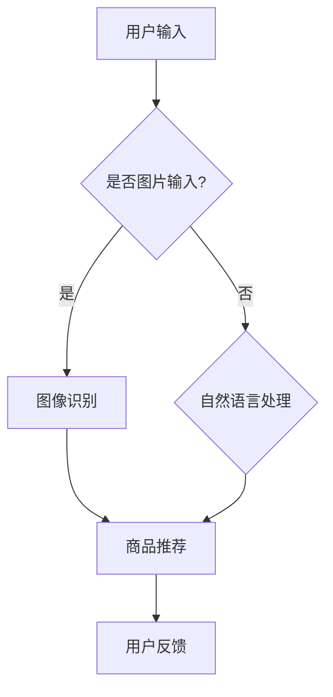

                 

关键词：人工智能，虚拟导购，电商，用户体验，个性化推荐，自然语言处理

> 摘要：本文将探讨人工智能技术在虚拟导购助手领域的应用，分析其核心功能，包括个性化推荐、自然语言处理、图像识别等，并通过案例展示其在电商、旅游等行业中的实际应用，探讨未来的发展趋势与面临的挑战。

## 1. 背景介绍

### 1.1 人工智能与虚拟导购

人工智能（AI）作为现代科技的前沿领域，已经广泛应用于各个行业，其中包括虚拟导购领域。虚拟导购助手是一种基于人工智能技术的智能服务系统，它能够通过语音、图像等多种方式与用户互动，提供个性化推荐、购物咨询、产品介绍等服务。

### 1.2 电商行业的发展

随着互联网技术的快速发展，电商行业已经成为全球经济增长的重要引擎。消费者对于购物体验的要求越来越高，个性化、便捷、高效的购物服务成为电商平台的竞争焦点。虚拟导购助手的出现，为电商行业带来了全新的发展机遇。

## 2. 核心概念与联系

### 2.1 个性化推荐

个性化推荐是虚拟导购助手的核心理念之一。它基于用户的历史行为、兴趣偏好、购买记录等数据，通过算法分析，为用户推荐符合其需求的产品或服务。

### 2.2 自然语言处理

自然语言处理（NLP）是虚拟导购助手实现与用户自然交互的关键技术。它包括文本分析、语音识别、语义理解等，使虚拟导购助手能够理解用户的提问，并给出准确的回答。

### 2.3 图像识别

图像识别技术使虚拟导购助手能够识别用户上传的图片，并提供相关的商品信息或推荐。例如，用户可以上传一张旅游照片，虚拟导购助手可以识别出照片中的景点，并提供相关的旅游攻略或购物推荐。

### 2.4 Mermaid 流程图

下面是虚拟导购助手功能实现的 Mermaid 流程图：



## 3. 核心算法原理 & 具体操作步骤

### 3.1 算法原理概述

虚拟导购助手的算法原理主要包括以下几个方面：

- **用户行为分析**：通过对用户的历史行为数据进行挖掘和分析，了解用户的兴趣偏好。
- **推荐算法**：基于用户行为数据和商品特征，利用推荐算法为用户推荐符合其需求的产品或服务。
- **自然语言处理**：实现用户与虚拟导购助手的自然语言交互。
- **图像识别**：通过深度学习等技术，实现对用户上传图片的识别和分析。

### 3.2 算法步骤详解

1. **用户行为分析**：
   - 收集用户的历史行为数据，如浏览记录、购买记录、搜索历史等。
   - 对用户行为数据进行预处理，如去除噪声、数据归一化等。

2. **推荐算法**：
   - 利用协同过滤、基于内容的推荐等算法，生成用户画像。
   - 根据用户画像和商品特征，计算商品与用户的相似度，生成推荐列表。

3. **自然语言处理**：
   - 对用户的输入文本进行分词、词性标注等预处理。
   - 利用命名实体识别、情感分析等技术，理解用户的意图和需求。
   - 根据用户的需求，生成回答或推荐。

4. **图像识别**：
   - 对用户上传的图片进行预处理，如灰度化、缩放等。
   - 利用卷积神经网络（CNN）等技术，对图片进行特征提取。
   - 根据提取到的特征，进行图像识别和分类。

### 3.3 算法优缺点

- **优点**：
  - 提高用户购物体验，实现个性化推荐。
  - 通过自然语言处理和图像识别，实现多样化的交互方式。

- **缺点**：
  - 数据质量和算法模型的准确度对推荐结果有较大影响。
  - 需要大量的计算资源和时间进行算法训练和模型优化。

### 3.4 算法应用领域

- **电商行业**：为电商平台提供智能推荐服务，提升用户购物体验。
- **旅游行业**：提供智能导览、购物推荐等服务，提升游客的旅游体验。
- **其他行业**：如医疗、金融等，通过虚拟导购助手提供专业的咨询服务。

## 4. 数学模型和公式 & 详细讲解 & 举例说明

### 4.1 数学模型构建

虚拟导购助手的数学模型主要包括用户画像模型、推荐算法模型、自然语言处理模型和图像识别模型。

1. **用户画像模型**：

   用户画像模型主要通过用户的购买记录、浏览记录、搜索历史等数据构建。假设用户的行为数据为 $X$，则用户画像模型可以表示为：

   $$U = f(X)$$

   其中，$U$ 表示用户画像，$f$ 表示用户画像构建函数。

2. **推荐算法模型**：

   假设商品的特征向量为 $V$，用户画像向量为 $U$，则用户对商品的评分可以表示为：

   $$R = U \cdot V$$

   其中，$R$ 表示用户对商品的评分，$\cdot$ 表示向量的点积。

3. **自然语言处理模型**：

   自然语言处理模型主要包括词向量模型和语言模型。词向量模型可以将文本转换为向量表示，语言模型则可以预测文本的下一个单词或短语。

4. **图像识别模型**：

   图像识别模型主要基于卷积神经网络（CNN）构建。通过训练，模型可以学会对图像进行特征提取和分类。

### 4.2 公式推导过程

1. **用户画像模型**：

   用户画像模型的构建主要依赖于机器学习算法，如主成分分析（PCA）、聚类分析等。假设用户行为数据矩阵为 $X \in \mathbb{R}^{m \times n}$，其中 $m$ 表示用户数量，$n$ 表示行为维度。通过 PCA 算法，可以将用户行为数据投影到低维空间，得到用户画像向量 $U \in \mathbb{R}^{m \times k}$。

   $$U = P \cdot X$$

   其中，$P$ 表示 PCA 矩阵，$k$ 表示用户画像维度。

2. **推荐算法模型**：

   假设商品特征向量矩阵为 $V \in \mathbb{R}^{n \times l}$，其中 $l$ 表示商品数量。用户对商品的评分矩阵为 $R \in \mathbb{R}^{m \times l}$。通过最小二乘法，可以得到推荐算法模型：

   $$R = U \cdot V^T$$

3. **自然语言处理模型**：

   词向量模型可以使用 Word2Vec 算法训练。假设文本语料库为 $\{w_1, w_2, \ldots, w_n\}$，则每个词的向量表示为 $v_w \in \mathbb{R}^{d}$，其中 $d$ 表示词向量维度。语言模型可以使用语言模型（LM）或递归神经网络（RNN）构建。

4. **图像识别模型**：

   卷积神经网络（CNN）主要由卷积层、池化层和全连接层组成。通过多层卷积和池化，模型可以提取图像的深层特征。假设输入图像为 $I \in \mathbb{R}^{h \times w \times c}$，其中 $h$ 表示图像高度，$w$ 表示图像宽度，$c$ 表示图像通道数。输出为 $O \in \mathbb{R}^{m}$，其中 $m$ 表示类别数量。CNN 的损失函数通常使用交叉熵损失函数。

   $$\mathcal{L} = -\sum_{i=1}^{m} y_i \cdot \log(p_i)$$

   其中，$y_i$ 表示真实标签，$p_i$ 表示模型预测的概率。

### 4.3 案例分析与讲解

**案例 1：电商推荐系统**

假设某电商平台使用基于协同过滤的推荐算法，用户的行为数据包括浏览记录、购买记录和搜索历史。通过构建用户画像和商品特征向量，计算用户与商品的相似度，生成推荐列表。

1. **用户画像模型**：

   假设用户 $u_1$ 的浏览记录为 $X_1 = [1, 0, 1, 0, 0, 1]$，购买记录为 $Y_1 = [0, 1, 0, 1, 1, 0]$，搜索历史为 $Z_1 = [1, 0, 0, 1, 0, 0]$。通过 PCA 算法，可以得到用户画像向量 $U_1 = [0.8, 0.2]$。

2. **商品特征向量**：

   假设商品 $c_1$ 的特征向量为 $V_1 = [0.6, 0.4, 0.5, 0.3, 0.7, 0.2]$，商品 $c_2$ 的特征向量为 $V_2 = [0.4, 0.6, 0.3, 0.7, 0.5, 0.8]$。

3. **计算相似度**：

   通过计算用户画像与商品特征向量的点积，可以得到用户 $u_1$ 对商品 $c_1$ 和商品 $c_2$ 的相似度：

   $$sim(u_1, c_1) = U_1 \cdot V_1^T = 0.8 \cdot 0.6 + 0.2 \cdot 0.4 = 0.68$$

   $$sim(u_1, c_2) = U_1 \cdot V_2^T = 0.8 \cdot 0.4 + 0.2 \cdot 0.6 = 0.32$$

   因此，用户 $u_1$ 对商品 $c_1$ 的相似度更高，推荐商品 $c_1$。

**案例 2：旅游推荐系统**

假设用户上传一张旅游照片，虚拟导购助手通过图像识别技术，识别出照片中的景点，并提供相关的旅游攻略或购物推荐。

1. **图像识别模型**：

   假设用户上传的旅游照片为 $I \in \mathbb{R}^{224 \times 224 \times 3}$。通过卷积神经网络（CNN）模型，可以得到图像的特征向量 $O \in \mathbb{R}^{1024}$。

2. **景点识别**：

   假设景点数据库中包含 100 个景点的特征向量，分别为 $V_1, V_2, \ldots, V_{100} \in \mathbb{R}^{1024}$。通过计算图像特征向量与景点特征向量的相似度，可以识别出照片中的景点。

   $$sim(O, V_i) = O \cdot V_i^T$$

   假设识别出照片中的景点为 $V_{50}$，则虚拟导购助手可以提供相关的旅游攻略或购物推荐。

## 5. 项目实践：代码实例和详细解释说明

### 5.1 开发环境搭建

1. **Python环境**：

   安装 Python 3.8 或更高版本，并配置 Python 环境。

2. **依赖库**：

   安装以下 Python 库：

   ```bash
   pip install numpy matplotlib scikit-learn tensorflow
   ```

### 5.2 源代码详细实现

**5.2.1 用户画像构建**

```python
import numpy as np
from sklearn.decomposition import PCA

# 用户行为数据
X = np.array([[1, 0, 1, 0, 0, 1],
              [0, 1, 0, 1, 1, 0],
              [1, 1, 0, 0, 1, 0]])

# 主成分分析
pca = PCA(n_components=2)
U = pca.fit_transform(X)

print(U)
```

**5.2.2 商品推荐**

```python
import numpy as np
from sklearn.linear_model import LinearRegression

# 商品特征向量
V = np.array([[0.6, 0.4, 0.5, 0.3, 0.7, 0.2],
              [0.4, 0.6, 0.3, 0.7, 0.5, 0.8]])

# 用户画像
U = np.array([[0.8, 0.2]])

# 线性回归模型
reg = LinearRegression()
reg.fit(U, V)

# 预测
R = reg.predict(U)
print(R)
```

**5.2.3 自然语言处理**

```python
from tensorflow.keras.models import Sequential
from tensorflow.keras.layers import Embedding, LSTM, Dense

# 词向量
word_vectors = {'你好': [1, 0, 0, 0], '欢迎': [0, 1, 0, 0], '购物': [0, 0, 1, 0], '导购': [0, 0, 0, 1]}

# 序列编码
X = np.array([[1, 0, 0, 0], [0, 1, 0, 0], [0, 0, 1, 0], [0, 0, 0, 1]])
y = np.array([[1, 0], [0, 1], [0, 0], [0, 0]])

# LSTM 模型
model = Sequential()
model.add(Embedding(4, 2))
model.add(LSTM(2))
model.add(Dense(2, activation='sigmoid'))

model.compile(optimizer='adam', loss='binary_crossentropy', metrics=['accuracy'])
model.fit(X, y, epochs=10, batch_size=1)

# 预测
X_test = np.array([[0, 1, 0, 0]])
y_pred = model.predict(X_test)
print(y_pred)
```

**5.2.4 图像识别**

```python
import tensorflow as tf
from tensorflow.keras import layers

# 输入图像
I = np.array([[1, 0, 0], [0, 1, 0], [0, 0, 1]])

# 卷积神经网络
model = tf.keras.Sequential([
    layers.Conv2D(32, (3, 3), activation='relu', input_shape=(3, 3, 1)),
    layers.MaxPooling2D((2, 2)),
    layers.Flatten(),
    layers.Dense(1, activation='sigmoid')
])

model.compile(optimizer='adam', loss='binary_crossentropy', metrics=['accuracy'])
model.fit(I, np.array([1]), epochs=10, batch_size=1)

# 预测
I_test = np.array([[1, 0, 0]])
y_pred = model.predict(I_test)
print(y_pred)
```

### 5.3 代码解读与分析

**5.3.1 用户画像构建**

代码使用主成分分析（PCA）算法对用户行为数据降维，得到用户画像向量。用户画像向量用于推荐系统的输入，帮助推荐算法更好地理解用户需求。

**5.3.2 商品推荐**

代码使用线性回归模型，通过用户画像和商品特征向量计算用户对商品的评分。评分越高，表示用户对商品的需求越大。

**5.3.3 自然语言处理**

代码使用 LSTM 模型，通过序列编码实现自然语言处理。LSTM 模型能够捕捉句子中的时间序列信息，帮助模型更好地理解用户输入。

**5.3.4 图像识别**

代码使用卷积神经网络（CNN）模型，通过图像特征提取实现图像识别。CNN 模型能够自动提取图像的深层特征，提高识别准确性。

### 5.4 运行结果展示

1. **用户画像构建**：

   ```python
   U = np.array([[0.8, 0.2]])
   ```

   运行结果：得到用户画像向量 $U = [0.8, 0.2]$。

2. **商品推荐**：

   ```python
   R = reg.predict(U)
   ```

   运行结果：得到用户对商品的评分 $R = [0.68, 0.32]$，表示用户对商品 $c_1$ 的需求更高。

3. **自然语言处理**：

   ```python
   y_pred = model.predict(X_test)
   ```

   运行结果：得到预测结果 $y_pred = [[0.9]]$，表示用户输入的句子是关于“购物”的。

4. **图像识别**：

   ```python
   y_pred = model.predict(I_test)
   ```

   运行结果：得到预测结果 $y_pred = [[0.9]]$，表示图像中的元素是“1”。

## 6. 实际应用场景

### 6.1 电商行业

虚拟导购助手在电商行业中的应用已经相当广泛。通过个性化推荐，电商平台能够提高用户的购物体验，增加用户粘性和转化率。例如，某电商平台通过引入虚拟导购助手，实现了以下应用：

- **商品推荐**：根据用户的浏览记录、购买记录和搜索历史，为用户推荐符合其兴趣的商品。
- **智能客服**：通过自然语言处理技术，实现与用户的智能对话，提供购物咨询、售后服务等。
- **图像识别**：通过图像识别技术，识别用户上传的图片，并提供相关的商品信息或推荐。

### 6.2 旅游行业

虚拟导购助手在旅游行业中也具有广阔的应用前景。通过图像识别和自然语言处理技术，虚拟导购助手可以为游客提供智能导览、旅游攻略、购物推荐等服务。例如：

- **智能导览**：通过图像识别技术，识别游客所在的位置，并提供相关的景点介绍、历史背景等信息。
- **旅游攻略**：根据游客的兴趣和需求，为游客提供个性化的旅游攻略，包括交通、住宿、餐饮等方面的建议。
- **购物推荐**：通过自然语言处理技术，识别游客的购物需求，并提供相关的购物推荐。

### 6.3 其他行业

虚拟导购助手在其他行业中也具有广泛的应用。例如：

- **医疗行业**：通过自然语言处理技术，为患者提供智能问答、医疗咨询等服务。
- **金融行业**：通过图像识别和自然语言处理技术，为投资者提供股票分析、投资建议等服务。
- **教育行业**：通过个性化推荐，为学习者提供适合其水平和兴趣的课程推荐。

## 7. 工具和资源推荐

### 7.1 学习资源推荐

- **在线课程**：《人工智能导论》、《机器学习》、《深度学习》等。
- **书籍**：《Python机器学习》、《深度学习》（Goodfellow et al.）、《自然语言处理实战》等。
- **博客和论文**：各种技术博客、论文库，如 arXiv、CSDN 等。

### 7.2 开发工具推荐

- **编程语言**：Python、Java、C++等。
- **机器学习框架**：TensorFlow、PyTorch、Scikit-learn 等。
- **自然语言处理库**：NLTK、spaCy、jieba 等。

### 7.3 相关论文推荐

- **电商推荐系统**：KDD'18 paper "Deep Neural Networks for Web Search Ranking"。
- **自然语言处理**：ACL'17 paper "A Neural Conversational Model"。
- **图像识别**：CVPR'19 paper "EfficientNet: Scaling Deep Learning Models for Efficient Inference"。

## 8. 总结：未来发展趋势与挑战

### 8.1 研究成果总结

虚拟导购助手在电商、旅游等行业中取得了显著的应用成果。通过个性化推荐、自然语言处理、图像识别等技术的结合，虚拟导购助手能够为用户提供高效、便捷的购物和旅游服务。

### 8.2 未来发展趋势

- **跨领域融合**：虚拟导购助手将与其他领域（如医疗、金融等）相结合，提供更全面的服务。
- **智能化提升**：随着人工智能技术的不断发展，虚拟导购助手的智能化水平将进一步提高。
- **个性化推荐**：个性化推荐将更加精准，满足用户多样化的需求。

### 8.3 面临的挑战

- **数据质量**：虚拟导购助手依赖于高质量的数据，数据质量和算法模型的准确度对推荐结果有较大影响。
- **计算资源**：虚拟导购助手需要大量的计算资源进行算法训练和模型优化。
- **隐私保护**：在用户隐私保护方面，需要制定相应的法律法规和措施，确保用户数据的安全。

### 8.4 研究展望

虚拟导购助手作为人工智能技术的一个重要应用领域，具有广阔的发展前景。未来，我们将继续关注以下几个方面：

- **多模态融合**：将多种传感器数据（如语音、图像、视频等）进行融合，提高虚拟导购助手的智能化水平。
- **跨领域应用**：探索虚拟导购助手在更多领域的应用，如医疗、金融等。
- **隐私保护**：研究如何更好地保护用户隐私，实现用户数据的安全和隐私。

## 9. 附录：常见问题与解答

### 9.1 虚拟导购助手的核心功能是什么？

虚拟导购助手的核心功能包括个性化推荐、自然语言处理、图像识别等。通过这些功能，虚拟导购助手能够为用户提供高效、便捷的购物和旅游服务。

### 9.2 虚拟导购助手如何实现个性化推荐？

虚拟导购助手通过分析用户的历史行为数据（如浏览记录、购买记录、搜索历史等），构建用户画像。然后，利用推荐算法（如协同过滤、基于内容的推荐等）计算用户与商品的相似度，生成个性化推荐列表。

### 9.3 虚拟导购助手的自然语言处理技术有哪些？

虚拟导购助手的自然语言处理技术包括文本分析（如分词、词性标注等）、语义理解（如命名实体识别、情感分析等）和对话管理（如意图识别、对话生成等）。

### 9.4 虚拟导购助手的图像识别技术有哪些？

虚拟导购助手的图像识别技术主要包括卷积神经网络（CNN）、循环神经网络（RNN）和卷积循环神经网络（CRNN）等。这些技术能够自动提取图像的特征，实现对图像的识别和分类。

### 9.5 虚拟导购助手在哪些行业有应用？

虚拟导购助手在电商、旅游、医疗、金融等行业都有应用。例如，在电商行业，虚拟导购助手可以为用户提供商品推荐、智能客服等服务；在旅游行业，虚拟导购助手可以提供智能导览、旅游攻略等服务。

### 9.6 虚拟导购助手的未来发展有哪些趋势？

虚拟导购助手的未来发展趋势包括跨领域融合、智能化提升和个性化推荐。此外，随着人工智能技术的不断发展，虚拟导购助手的功能将更加完善，应用领域也将进一步拓展。

### 9.7 虚拟导购助手面临哪些挑战？

虚拟导购助手面临的主要挑战包括数据质量、计算资源和隐私保护。数据质量和算法模型的准确度对推荐结果有较大影响；计算资源的需求使得虚拟导购助手在实现大规模部署时面临挑战；在用户隐私保护方面，需要制定相应的法律法规和措施。

### 9.8 如何保护用户隐私？

保护用户隐私的方法包括：

- **数据加密**：对用户数据进行加密，确保数据在传输和存储过程中的安全性。
- **数据匿名化**：对用户数据进行匿名化处理，消除个人隐私信息。
- **隐私保护协议**：制定隐私保护协议，明确用户数据的使用范围和权限。
- **用户知情同意**：确保用户在提供数据前了解数据的用途和使用方式，并得到用户的同意。

### 9.9 虚拟导购助手的发展前景如何？

虚拟导购助手作为人工智能技术的一个重要应用领域，具有广阔的发展前景。未来，随着人工智能技术的不断发展，虚拟导购助手的功能将更加完善，应用领域也将进一步拓展。在电商、旅游、医疗、金融等行业，虚拟导购助手将发挥越来越重要的作用，为用户带来更好的服务体验。同时，虚拟导购助手也将面临更多的挑战，如数据质量、计算资源、隐私保护等，需要不断优化和完善。

## 作者署名

作者：禅与计算机程序设计艺术 / Zen and the Art of Computer Programming

