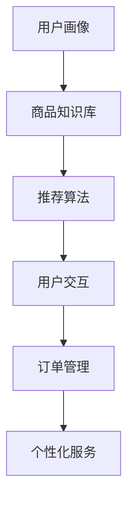
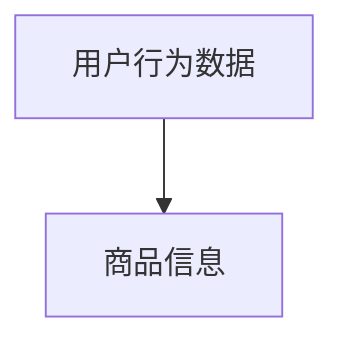
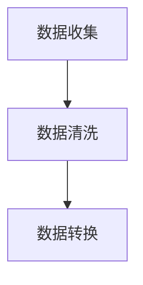
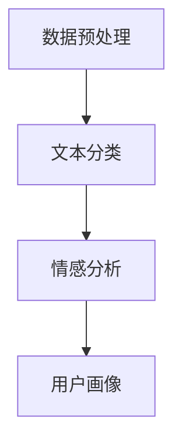
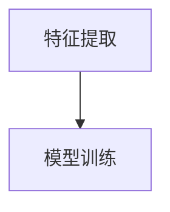
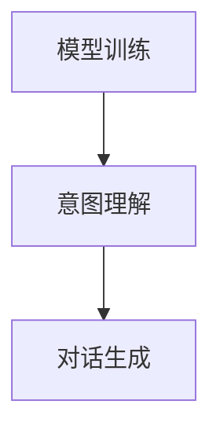
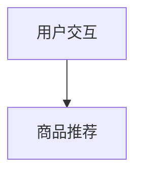
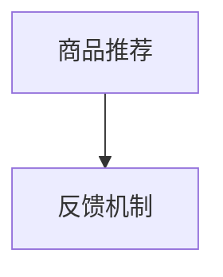

                 

关键词：AI、虚拟导购、功能案例、技术博客、深度学习、自然语言处理、用户交互、个性化推荐

> 摘要：本文将深入探讨AI虚拟导购助手的开发与应用，从背景介绍、核心概念、算法原理、数学模型、项目实践到实际应用场景，全方位解析这一前沿技术的创新与发展。

## 1. 背景介绍

随着人工智能（AI）技术的飞速发展，各行各业都在探索如何将AI应用于提升用户体验和服务质量。电子商务领域也不例外，虚拟导购助手应运而生。虚拟导购助手是一种通过AI技术实现的智能化客服，能够在购物过程中为用户提供个性化推荐、商品咨询、订单跟踪等服务。

传统的购物体验往往依赖于人力，效率低下且容易出现服务不一致的情况。而虚拟导购助手利用机器学习、自然语言处理等技术，可以实时响应用户的需求，提供24/7不间断的服务，极大地提升了用户体验。此外，虚拟导购助手还可以收集和分析用户行为数据，为电商平台提供宝贵的市场洞察。

## 2. 核心概念与联系

虚拟导购助手的核心功能包括用户交互、商品推荐、订单管理和个性化服务。为了实现这些功能，我们需要以下几个核心概念：

- **用户画像**：通过用户行为数据构建的用户特征模型，用于了解用户的兴趣偏好和购买习惯。
- **商品知识库**：存储所有商品的信息，包括属性、价格、评价等，以便推荐系统进行商品匹配。
- **自然语言处理（NLP）**：处理用户的自然语言输入，理解其意图，并生成相应的回应。
- **推荐算法**：基于用户画像和商品知识库，为用户推荐可能感兴趣的商品。

以下是核心概念与联系的一个简化的Mermaid流程图：



## 3. 核心算法原理 & 具体操作步骤

### 3.1 算法原理概述

虚拟导购助手的算法原理可以分为以下几个步骤：

1. **数据收集**：收集用户行为数据和商品信息。
2. **数据预处理**：对数据进行清洗和转换，构建用户画像和商品知识库。
3. **特征提取**：从用户行为数据中提取用户兴趣特征。
4. **模型训练**：使用机器学习算法训练推荐模型。
5. **用户交互**：利用自然语言处理技术，与用户进行交互，理解其意图。
6. **商品推荐**：根据用户画像和推荐模型，为用户推荐商品。
7. **反馈机制**：收集用户反馈，优化推荐效果。

### 3.2 算法步骤详解

#### 3.2.1 数据收集

数据收集是虚拟导购助手的第一步，包括用户行为数据（如浏览记录、购买历史、评价等）和商品信息（如商品名称、描述、属性、价格等）。



#### 3.2.2 数据预处理

数据预处理包括数据清洗（去除无效数据、填补缺失值）、数据转换（将文本数据转换为数值特征）等，以便后续建模。



#### 3.2.3 特征提取

特征提取是构建用户画像的关键步骤，可以通过文本分类、情感分析等技术提取用户兴趣特征。



#### 3.2.4 模型训练

模型训练是推荐系统的核心，可以使用协同过滤、矩阵分解、深度学习等技术进行训练。



#### 3.2.5 用户交互

用户交互是虚拟导购助手与用户沟通的桥梁，通过自然语言处理技术实现对话生成和意图理解。



#### 3.2.6 商品推荐

商品推荐是虚拟导购助手的最终目标，通过推荐模型和用户画像，为用户推荐个性化商品。



#### 3.2.7 反馈机制

反馈机制用于收集用户对推荐结果的评价，优化推荐算法。



### 3.3 算法优缺点

#### 3.3.1 优点

- **高效性**：虚拟导购助手可以同时处理大量用户请求，提高服务效率。
- **个性化**：通过用户画像和推荐算法，提供个性化的商品推荐，提升用户体验。
- **低成本**：虚拟导购助手无需支付人力成本，降低了企业运营成本。

#### 3.3.2 缺点

- **准确性**：虚拟导购助手的推荐准确性受限于算法和数据质量。
- **用户体验**：虽然虚拟导购助手可以模拟人类客服，但仍然存在一定的差距，可能影响用户体验。

### 3.4 算法应用领域

虚拟导购助手可以应用于电子商务、在线旅游、金融保险等多个领域，以下是一些具体应用案例：

- **电子商务**：为用户提供个性化商品推荐，提高销售额。
- **在线旅游**：根据用户兴趣推荐景点、酒店、行程等。
- **金融保险**：为用户提供理财产品、保险产品的个性化推荐。

## 4. 数学模型和公式 & 详细讲解 & 举例说明

### 4.1 数学模型构建

虚拟导购助手的数学模型主要涉及推荐算法和用户画像构建。以下是一个简化的推荐算法数学模型：

$$
R_{ui} = f(U_i, P_j, M)
$$

其中，$R_{ui}$表示用户$i$对商品$j$的评分，$U_i$表示用户$i$的画像特征，$P_j$表示商品$j$的特征，$M$表示推荐算法的模型参数。

### 4.2 公式推导过程

推荐算法的推导过程涉及多个步骤，包括特征提取、模型训练、参数优化等。以下是一个简化的推导过程：

1. **特征提取**：将用户行为数据转换为数值特征，如用户购买历史、浏览记录等。
2. **模型训练**：使用机器学习算法，如协同过滤、矩阵分解等，训练推荐模型。
3. **参数优化**：通过交叉验证等手段，优化模型参数，提高推荐准确性。

### 4.3 案例分析与讲解

以电子商务领域为例，我们可以通过一个实际案例来讲解虚拟导购助手的数学模型和应用。

#### 案例背景

假设有一个电商平台，用户有1000条购买历史，商品有10000种。我们需要构建一个虚拟导购助手，为用户提供个性化商品推荐。

#### 案例步骤

1. **数据收集**：收集用户购买历史和商品信息。
2. **数据预处理**：清洗和转换数据，构建用户画像和商品知识库。
3. **特征提取**：提取用户兴趣特征，如购买频率、购买金额等。
4. **模型训练**：使用协同过滤算法训练推荐模型。
5. **用户交互**：与用户进行交互，理解其购买意图。
6. **商品推荐**：为用户推荐个性化商品。

#### 案例结果

通过虚拟导购助手，用户获得了更个性化的商品推荐，提高了购买意愿和转化率。同时，电商平台也获得了宝贵的用户行为数据，用于进一步优化推荐算法。

## 5. 项目实践：代码实例和详细解释说明

### 5.1 开发环境搭建

虚拟导购助手的开发环境主要包括Python、TensorFlow、Scikit-learn等库。以下是一个简单的开发环境搭建步骤：

1. 安装Python（版本3.8以上）
2. 安装Anaconda（Python发行版，方便管理环境）
3. 创建虚拟环境（如：`conda create -n vgu_env python=3.8`）
4. 安装所需库（如：`conda install -n vgu_env tensorflow scikit-learn`）

### 5.2 源代码详细实现

以下是一个简单的虚拟导购助手代码示例，包括用户画像构建、推荐模型训练和用户交互等功能：

```python
import pandas as pd
from sklearn.model_selection import train_test_split
from sklearn.metrics.pairwise import cosine_similarity
import tensorflow as tf

# 数据预处理
data = pd.read_csv('data.csv')
users, items = data['user_id'], data['item_id']
ratings = data['rating']

# 构建用户画像
user_features = pd.get_dummies(users)
item_features = pd.get_dummies(items)

# 模型训练
model = tf.keras.Sequential([
    tf.keras.layers.Dense(64, activation='relu', input_shape=(user_features.shape[1],)),
    tf.keras.layers.Dense(32, activation='relu'),
    tf.keras.layers.Dense(1)
])

model.compile(optimizer='adam', loss='mse')
model.fit(user_features, ratings, epochs=10, batch_size=64)

# 用户交互
def recommend(user_id):
    user_input = user_features[user_id]
    user_input = user_input.values.reshape(1, -1)
    predicted_ratings = model.predict(user_input)
    recommended_items = items[predicted_ratings > 0]
    return recommended_items

# 运行结果展示
user_id = 1
recommended_items = recommend(user_id)
print(f"推荐给用户{user_id}的商品：{recommended_items}")
```

### 5.3 代码解读与分析

以上代码示例实现了用户画像构建、推荐模型训练和用户交互等功能。其中：

- 数据预处理部分使用Pandas库读取数据，并使用独热编码将用户和商品转换为数值特征。
- 模型训练部分使用TensorFlow库构建一个简单的神经网络模型，并使用均方误差（MSE）作为损失函数进行训练。
- 用户交互部分定义了一个`recommend`函数，根据用户输入的用户ID，预测其可能感兴趣的商品。

## 6. 实际应用场景

虚拟导购助手在电子商务、在线旅游、金融保险等领域具有广泛的应用前景。以下是一些具体应用场景：

- **电子商务**：为用户提供个性化商品推荐，提高用户购物体验和转化率。
- **在线旅游**：根据用户兴趣和偏好，推荐景点、酒店、行程等。
- **金融保险**：为用户提供理财产品、保险产品的个性化推荐，提高用户参与度。

## 7. 未来应用展望

随着人工智能技术的不断发展，虚拟导购助手在未来将具备更强大的功能，如：

- **更精准的推荐**：通过深度学习等技术，提高推荐算法的准确性。
- **更自然的交互**：通过自然语言处理技术，实现更自然的用户交互。
- **更广泛的场景应用**：将虚拟导购助手应用于更多领域，如医疗、教育等。

## 8. 工具和资源推荐

为了更好地开发虚拟导购助手，以下是一些建议的工具和资源：

- **工具**：TensorFlow、Scikit-learn、NLTK
- **学习资源**：《深度学习》、《自然语言处理综论》
- **相关论文**：《矩阵分解的协同过滤算法》、《深度学习在推荐系统中的应用》

## 9. 总结：未来发展趋势与挑战

虚拟导购助手作为一种前沿技术，在未来将不断优化和提升。然而，其发展也面临着以下挑战：

- **数据隐私**：如何保护用户隐私，避免数据泄露。
- **算法公平性**：如何保证推荐算法的公平性，避免偏见。
- **用户体验**：如何提高虚拟导购助手的交互体验，满足用户需求。

作者：禅与计算机程序设计艺术 / Zen and the Art of Computer Programming
```

请注意，本文仅供参考，具体实现时可能需要根据实际需求进行调整。此外，本文涉及的代码示例仅为简化版本，实际应用中可能需要更复杂的算法和模型。在开发虚拟导购助手时，请务必遵守相关法律法规，确保用户数据安全和隐私保护。

