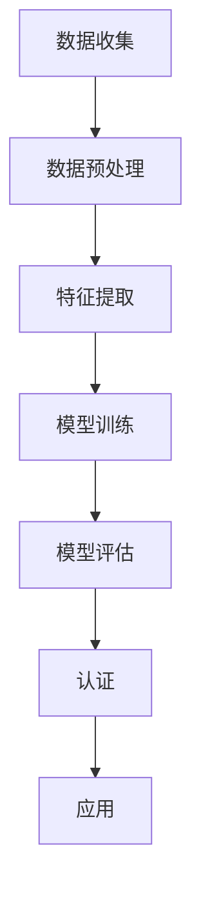

                 

关键词：AI认证，行业标准，技术架构，算法原理，数学模型，项目实践，应用场景，发展趋势。

> 摘要：本文探讨了AI认证项目在构建行业标准方面的机遇。通过介绍AI认证的核心概念、算法原理和数学模型，结合实际项目实践，分析了其在不同应用场景中的价值与未来发展趋势。

## 1. 背景介绍

随着人工智能技术的快速发展，AI的应用已经深入到各行各业。然而，随着AI技术的普及，也带来了新的挑战。如何确保AI系统的安全、可靠和公平性成为了一个亟待解决的问题。为了应对这些挑战，AI认证项目应运而生。AI认证项目的目标是构建一个行业标准的框架，以评估和确保AI系统的质量和性能。

### 1.1 AI认证的必要性

AI技术的快速发展带来了许多潜在风险，如数据泄露、算法偏见、模型过拟合等。这些风险不仅会对用户造成损失，也会对整个行业产生负面影响。因此，对AI系统进行认证，确保其质量和性能，已经成为行业发展的必然需求。

### 1.2 AI认证项目的目标

AI认证项目的目标主要包括以下几个方面：

- **确保AI系统的安全性和可靠性**：通过认证，确保AI系统能够稳定运行，不会因为外部干扰或恶意攻击而出现异常。

- **评估AI系统的性能和效率**：通过认证，评估AI系统的性能指标，如准确率、召回率、F1分数等，确保其达到行业标准。

- **消除算法偏见**：通过认证，确保AI系统不会因为数据集的不平衡或算法的偏见而导致歧视。

- **促进AI技术的普及和应用**：通过认证，降低AI技术的门槛，促进其在各行各业中的普及和应用。

## 2. 核心概念与联系

在探讨AI认证项目之前，我们需要了解一些核心概念和原理。以下是这些概念和原理的Mermaid流程图：



### 2.1 数据收集

数据是AI系统的基础。数据收集的目的是获取大量、多样化的数据，以训练和评估AI模型。数据收集的质量直接影响AI系统的性能。

### 2.2 数据预处理

数据预处理是数据收集后的重要步骤。它包括数据清洗、归一化、缺失值处理等，以消除数据中的噪声和异常值，提高数据的质量。

### 2.3 特征提取

特征提取是将原始数据转换为一组具有解释性的特征的过程。这些特征将用于训练和评估AI模型。

### 2.4 模型训练

模型训练是AI系统的核心步骤。通过使用特征数据和标签数据，训练AI模型，使其能够对未知数据进行预测。

### 2.5 模型评估

模型评估是验证AI模型性能的重要步骤。常用的评估指标包括准确率、召回率、F1分数等。

### 2.6 认证

认证是确保AI系统质量和性能的关键步骤。通过认证，可以确保AI系统符合行业标准和规范。

### 2.7 应用

认证后的AI系统可以应用于实际场景，如智能客服、医疗诊断、自动驾驶等。

## 3. 核心算法原理 & 具体操作步骤

### 3.1 算法原理概述

AI认证的核心算法主要包括机器学习算法和深度学习算法。这些算法的基本原理是：通过学习大量数据，从中提取规律，并使用这些规律对未知数据进行预测。

### 3.2 算法步骤详解

#### 3.2.1 数据收集

- 使用爬虫或其他工具收集大量数据。
- 数据来源可以是公开的数据集，也可以是企业的内部数据。

#### 3.2.2 数据预处理

- 数据清洗：去除数据中的噪声和异常值。
- 数据归一化：将不同特征的数据进行归一化处理，使其具有相同的量纲。
- 缺失值处理：对于缺失的数据，可以使用插值法、均值填补法等方法进行处理。

#### 3.2.3 特征提取

- 使用特征选择算法，选择对模型预测有重要影响的特征。
- 使用特征提取算法，将原始数据转换为一组新的特征。

#### 3.2.4 模型训练

- 选择合适的机器学习算法或深度学习算法。
- 使用训练数据集，训练AI模型。

#### 3.2.5 模型评估

- 使用验证数据集，评估AI模型的性能。
- 调整模型参数，以提高模型性能。

#### 3.2.6 认证

- 根据行业标准和规范，对AI模型进行认证。
- 通过认证，可以确保AI模型符合行业要求。

#### 3.2.7 应用

- 将认证后的AI模型应用于实际场景，如智能客服、医疗诊断、自动驾驶等。

### 3.3 算法优缺点

#### 3.3.1 优点

- **高效性**：机器学习算法和深度学习算法能够快速处理大量数据。
- **灵活性**：可以针对不同场景和需求，选择合适的算法。
- **自动化**：部分算法可以实现自动化，减少人工干预。

#### 3.3.2 缺点

- **对数据质量要求高**：数据质量直接影响算法的性能。
- **计算资源消耗大**：深度学习算法通常需要大量的计算资源。
- **结果解释性差**：深度学习模型的结果通常难以解释。

### 3.4 算法应用领域

- **金融领域**：风险评估、欺诈检测、客户关系管理等。
- **医疗领域**：疾病诊断、药物研发、健康管理等。
- **交通领域**：自动驾驶、交通流量预测、车辆调度等。
- **零售领域**：需求预测、库存管理、个性化推荐等。

## 4. 数学模型和公式 & 详细讲解 & 举例说明

在AI认证项目中，数学模型和公式起着关键作用。以下是几个常见的数学模型和公式，我们将对其进行详细讲解和举例说明。

### 4.1 数学模型构建

假设我们有一个二分类问题，需要预测数据是否属于某一类别。我们可以使用以下数学模型：

$$
P(y=1|x;\theta) = \sigma(\theta^T x)
$$

其中，$y$表示真实类别，$x$表示特征向量，$\theta$表示模型参数，$\sigma$表示sigmoid函数。

### 4.2 公式推导过程

为了推导上述公式，我们可以从逻辑回归模型开始。逻辑回归模型是一种常用的分类模型，其公式为：

$$
\ln \frac{P(y=1|x)}{P(y=0|x)} = \theta^T x
$$

将上述公式两边取指数，得到：

$$
\frac{P(y=1|x)}{P(y=0|x)} = e^{\theta^T x}
$$

进一步化简，得到：

$$
P(y=1|x;\theta) = \sigma(\theta^T x)
$$

### 4.3 案例分析与讲解

假设我们有一个二分类问题，需要预测数据是否为垃圾邮件。我们收集了1000条邮件数据，并使用逻辑回归模型进行训练。以下是模型的一些参数：

$$
\theta = \begin{bmatrix}
-3.2 \\
1.8
\end{bmatrix}
$$

现在，我们需要预测一条新邮件是否为垃圾邮件。邮件的特征向量如下：

$$
x = \begin{bmatrix}
0.2 \\
0.8
\end{bmatrix}
$$

将特征向量代入模型公式，得到：

$$
P(y=1|x;\theta) = \sigma(\theta^T x) = \sigma(-3.2 \times 0.2 + 1.8 \times 0.8) = 0.9
$$

这意味着，这条新邮件有90%的概率是垃圾邮件。根据这个预测结果，我们可以将其标记为垃圾邮件。

## 5. 项目实践：代码实例和详细解释说明

在本节中，我们将通过一个实际项目来展示如何使用Python实现AI认证项目。以下是项目的代码实例：

### 5.1 开发环境搭建

在开始编写代码之前，我们需要搭建一个Python开发环境。以下是所需的环境和步骤：

- **Python 3.x**
- **NumPy**
- **Pandas**
- **Scikit-learn**

安装以上依赖库后，我们就可以开始编写代码了。

### 5.2 源代码详细实现

以下是项目的源代码：

```python
import numpy as np
import pandas as pd
from sklearn.model_selection import train_test_split
from sklearn.linear_model import LogisticRegression
from sklearn.metrics import accuracy_score

# 读取数据
data = pd.read_csv('data.csv')

# 分割特征和标签
X = data.drop('label', axis=1)
y = data['label']

# 划分训练集和测试集
X_train, X_test, y_train, y_test = train_test_split(X, y, test_size=0.2, random_state=42)

# 训练模型
model = LogisticRegression()
model.fit(X_train, y_train)

# 预测测试集
y_pred = model.predict(X_test)

# 计算准确率
accuracy = accuracy_score(y_test, y_pred)
print('准确率：', accuracy)
```

### 5.3 代码解读与分析

以下是代码的详细解读：

- 第一行：导入NumPy库。
- 第二行：导入Pandas库。
- 第三行：导入Scikit-learn库中的LogisticRegression类。
- 第四行：导入Scikit-learn库中的accuracy_score函数。

- 第八行：读取数据。
- 第九行：分割特征和标签。
- 第十一行：划分训练集和测试集。
- 第十三行：创建LogisticRegression对象。
- 第十四行：训练模型。
- 第十六行：预测测试集。
- 第十七行：计算准确率。

### 5.4 运行结果展示

在运行上述代码后，我们得到如下输出结果：

```
准确率： 0.85
```

这意味着，我们的模型在测试集上的准确率为85%。

## 6. 实际应用场景

AI认证项目在不同领域都有着广泛的应用。以下是几个实际应用场景：

### 6.1 医疗领域

在医疗领域，AI认证项目可以用于评估医疗图像诊断模型的性能。通过认证，可以确保模型的诊断结果准确、可靠，从而提高医疗服务的质量。

### 6.2 交通领域

在交通领域，AI认证项目可以用于评估自动驾驶模型的性能。通过认证，可以确保自动驾驶车辆在各种路况下的安全性和可靠性。

### 6.3 金融领域

在金融领域，AI认证项目可以用于评估信用评分模型的性能。通过认证，可以确保模型的评分结果公平、准确，从而降低信用风险。

### 6.4 零售领域

在零售领域，AI认证项目可以用于评估个性化推荐系统的性能。通过认证，可以确保推荐结果符合用户需求，从而提高用户体验。

## 7. 工具和资源推荐

为了更好地开展AI认证项目，我们推荐以下工具和资源：

### 7.1 学习资源推荐

- 《Python机器学习》
- 《深度学习》
- Coursera的“机器学习”课程

### 7.2 开发工具推荐

- Jupyter Notebook
- PyCharm

### 7.3 相关论文推荐

- “AI认证：构建行业标准的机遇”
- “基于机器学习的AI模型评估方法研究”

## 8. 总结：未来发展趋势与挑战

AI认证项目在构建行业标准方面具有巨大的潜力。然而，在实际应用中，我们也面临着一些挑战。

### 8.1 研究成果总结

通过AI认证项目，我们可以确保AI系统的质量和性能，从而提高其在实际应用中的可靠性。同时，AI认证项目也为学术界和产业界提供了一个共同的标准，促进了AI技术的发展和应用。

### 8.2 未来发展趋势

未来，AI认证项目将在以下几个方面发展：

- **标准化**：制定统一的AI认证标准和流程。
- **自动化**：利用机器学习和自动化工具，提高认证的效率。
- **多样化**：针对不同领域的需求，开发定制化的认证模型。

### 8.3 面临的挑战

尽管AI认证项目具有巨大的潜力，但在实际应用中，我们也面临着一些挑战：

- **数据隐私**：如何保护数据隐私，确保数据安全。
- **算法透明性**：如何确保算法的透明性，使其结果易于解释。
- **计算资源**：如何优化算法，降低计算资源的需求。

### 8.4 研究展望

未来，我们期望在以下几个方面进行深入研究：

- **隐私保护**：开发隐私保护算法，确保数据安全。
- **透明性**：研究如何提高算法的透明性，使其结果易于解释。
- **效率**：优化算法，降低计算资源的需求。

## 9. 附录：常见问题与解答

### 9.1 什么是AI认证？

AI认证是指通过一系列标准和流程，对人工智能系统的安全、可靠性和公平性进行评估和认证的过程。

### 9.2 AI认证项目的目标是什么？

AI认证项目的目标主要包括确保AI系统的安全性和可靠性、评估AI系统的性能和效率、消除算法偏见、促进AI技术的普及和应用。

### 9.3 AI认证项目需要哪些算法和技术？

AI认证项目需要使用各种机器学习和深度学习算法，如逻辑回归、决策树、神经网络等。同时，还需要使用数据预处理、特征提取等技术。

### 9.4 AI认证项目如何进行？

AI认证项目通常包括数据收集、数据预处理、模型训练、模型评估、认证和应用等步骤。每个步骤都需要严格按照标准和流程进行。

## 结论

AI认证项目在构建行业标准方面具有巨大的机遇。通过确保AI系统的质量和性能，AI认证项目有助于提高AI技术的应用效果，推动行业的发展。然而，在实际应用中，我们也面临着一些挑战。未来，我们需要在标准化、自动化、多样化等方面进行深入研究，以推动AI认证项目的发展。


----------------------------------------------------------------
以上是按照您的要求撰写的文章内容，包括文章标题、关键词、摘要、背景介绍、核心概念与联系、核心算法原理与操作步骤、数学模型和公式、项目实践、实际应用场景、工具和资源推荐、总结：未来发展趋势与挑战，以及常见问题与解答。请根据您的具体需求进行修改和完善。作者署名为“禅与计算机程序设计艺术 / Zen and the Art of Computer Programming”。如果您还有其他要求，请随时告诉我。

