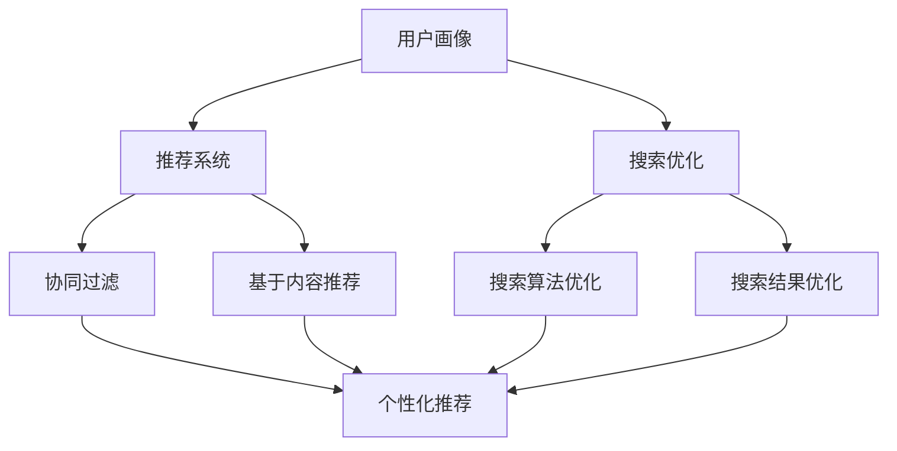

                 

关键词：AI、电商搜索、用户体验、转化率、实践案例、搜索导购、机器学习、推荐系统、数据挖掘

> 摘要：本文将探讨如何利用人工智能技术赋能电商搜索导购，从而提升用户体验和转化率。通过分析AI在电商搜索导购中的核心概念与联系，介绍核心算法原理与具体操作步骤，以及数学模型和公式的构建与推导，结合项目实践中的代码实例，探讨其在实际应用场景中的效果与未来展望。

## 1. 背景介绍

随着互联网技术的飞速发展，电商行业迎来了前所未有的机遇。然而，面对日益增长的在线商品和服务，如何提高用户购物体验和提升转化率成为电商企业关注的焦点。传统的搜索导购方式往往依赖于关键词匹配，难以满足用户个性化的购物需求，导致用户体验不佳，转化率较低。

近年来，人工智能技术的快速发展为电商搜索导购带来了新的可能。通过机器学习、数据挖掘和推荐系统等技术，电商企业可以实现对用户行为的深度分析和精准推荐，从而提升用户体验和转化率。本文将围绕这一主题，探讨AI在电商搜索导购中的应用与实践案例。

### 1.1 电商搜索导购的现状

目前，电商搜索导购主要依赖于关键词匹配和排序算法。用户在搜索框中输入关键词，系统根据关键词的相似度对商品进行排序，展示给用户。然而，这种方式存在以下问题：

1. **个性化不足**：传统搜索导购难以满足用户个性化的购物需求，容易导致用户兴趣得不到满足。
2. **转化率低**：用户在搜索结果中往往难以找到自己真正需要的商品，导致购物体验不佳，转化率较低。
3. **重复性问题**：当用户输入相近的关键词时，搜索结果往往相似，缺乏新鲜感。

### 1.2 人工智能技术在电商搜索导购中的应用

人工智能技术的引入有望解决传统搜索导购中存在的问题。通过机器学习、数据挖掘和推荐系统等技术，电商企业可以实现对用户行为的深度分析和精准推荐，从而提升用户体验和转化率。具体来说，人工智能技术在电商搜索导购中的应用主要包括以下几个方面：

1. **用户画像**：通过用户的历史行为数据，构建用户画像，了解用户的兴趣偏好和购买习惯。
2. **推荐算法**：基于用户画像和商品信息，采用推荐算法为用户推荐个性化的商品。
3. **搜索优化**：结合用户行为数据和推荐结果，优化搜索排序算法，提高搜索结果的准确性。
4. **智能客服**：通过自然语言处理技术，实现智能客服系统，为用户提供实时、高效的购物咨询和问题解答。

## 2. 核心概念与联系

在探讨AI赋能电商搜索导购之前，我们首先需要了解一些核心概念，如机器学习、数据挖掘、推荐系统和搜索优化等。以下是对这些概念及其相互关系的简要介绍。

### 2.1 机器学习

机器学习是一种通过算法自动从数据中学习模式和规律的技术。在电商搜索导购中，机器学习可以用于构建用户画像、推荐算法和搜索优化等。

- **用户画像**：通过分析用户的历史行为数据，如浏览记录、购买记录等，构建用户画像，了解用户的兴趣偏好和购买习惯。
- **推荐算法**：基于用户画像和商品信息，采用推荐算法为用户推荐个性化的商品。
- **搜索优化**：结合用户行为数据和推荐结果，优化搜索排序算法，提高搜索结果的准确性。

### 2.2 数据挖掘

数据挖掘是一种从大量数据中发现有价值信息的过程。在电商搜索导购中，数据挖掘可以用于分析用户行为、挖掘潜在用户需求等。

- **用户行为分析**：通过数据挖掘技术，分析用户在网站上的行为，如浏览路径、购买时间等，为个性化推荐和搜索优化提供依据。
- **需求挖掘**：通过数据挖掘技术，挖掘用户潜在的需求和兴趣点，为电商企业制定营销策略提供参考。

### 2.3 推荐系统

推荐系统是一种根据用户的历史行为和偏好，为用户推荐感兴趣的内容的系统。在电商搜索导购中，推荐系统可以用于为用户推荐个性化的商品。

- **协同过滤**：基于用户行为和商品信息，采用协同过滤算法为用户推荐相似的用户喜欢的商品。
- **基于内容的推荐**：根据商品的属性和用户偏好，采用基于内容的推荐算法为用户推荐相关的商品。

### 2.4 搜索优化

搜索优化是一种通过改进搜索算法和策略，提高搜索结果质量和用户体验的过程。在电商搜索导购中，搜索优化可以结合用户画像、推荐结果和用户行为数据，提高搜索结果的准确性。

- **搜索算法优化**：改进搜索排序算法，如基于关键词匹配的排序算法、基于用户画像的排序算法等。
- **搜索结果优化**：根据用户行为和偏好，调整搜索结果的展示顺序和样式，提高用户满意度。

### 2.5 Mermaid 流程图

以下是一个简化的Mermaid流程图，展示了AI赋能电商搜索导购的核心概念及其相互关系：



## 3. 核心算法原理 & 具体操作步骤

### 3.1 算法原理概述

AI赋能电商搜索导购的核心算法主要包括用户画像构建、推荐算法、搜索优化算法等。以下分别介绍这些算法的原理和具体操作步骤。

### 3.1.1 用户画像构建

用户画像构建是基于用户的历史行为数据，如浏览记录、购买记录、搜索记录等，通过数据挖掘和机器学习技术，提取用户的兴趣偏好和购买习惯。具体操作步骤如下：

1. **数据收集**：收集用户在网站上的各种行为数据，如浏览记录、购买记录、搜索记录等。
2. **数据预处理**：对收集到的数据进行清洗、去重和归一化等处理，确保数据质量。
3. **特征提取**：通过数据挖掘技术，从用户行为数据中提取用户兴趣偏好和购买习惯的特征，如浏览频次、购买频次、购买金额等。
4. **模型训练**：采用机器学习算法，如决策树、随机森林、神经网络等，对用户特征进行建模，构建用户画像。

### 3.1.2 推荐算法

推荐算法主要包括协同过滤算法和基于内容的推荐算法。协同过滤算法通过分析用户行为数据，找出相似用户和相似商品，为用户推荐感兴趣的商品。基于内容的推荐算法通过分析商品属性和用户偏好，为用户推荐相关的商品。具体操作步骤如下：

1. **数据收集**：收集用户行为数据和商品属性数据，如用户浏览记录、购买记录、搜索记录、商品标签等。
2. **数据预处理**：对收集到的数据进行清洗、去重和归一化等处理，确保数据质量。
3. **相似度计算**：计算用户之间的相似度（如基于用户行为的余弦相似度）和商品之间的相似度（如基于商品标签的Jaccard相似度）。
4. **推荐生成**：基于相似度计算结果，生成个性化推荐列表。

### 3.1.3 搜索优化算法

搜索优化算法通过改进搜索排序算法和结果展示策略，提高搜索结果的准确性和用户体验。常见的搜索优化算法包括基于关键词匹配的排序算法、基于用户画像的排序算法和基于推荐结果的排序算法。具体操作步骤如下：

1. **数据收集**：收集用户在网站上的各种行为数据，如搜索记录、浏览记录、购买记录等。
2. **数据预处理**：对收集到的数据进行清洗、去重和归一化等处理，确保数据质量。
3. **特征提取**：从用户行为数据中提取用户兴趣偏好和购买习惯的特征，如浏览频次、购买频次、购买金额等。
4. **排序算法优化**：采用机器学习算法，如决策树、随机森林、神经网络等，对用户特征进行建模，优化搜索排序算法。
5. **结果展示优化**：根据用户行为和偏好，调整搜索结果的展示顺序和样式，提高用户满意度。

### 3.2 算法步骤详解

#### 3.2.1 用户画像构建

1. **数据收集**：收集用户在网站上的各种行为数据，如浏览记录、购买记录、搜索记录等。这些数据可以从数据库或日志中获取。
2. **数据预处理**：对收集到的数据进行清洗、去重和归一化等处理，确保数据质量。例如，将用户ID、商品ID等统一编码，对缺失值进行填充，对异常值进行检测和处理。
3. **特征提取**：通过数据挖掘技术，从用户行为数据中提取用户兴趣偏好和购买习惯的特征，如浏览频次、购买频次、购买金额等。这些特征可以用来构建用户画像。
4. **模型训练**：采用机器学习算法，如决策树、随机森林、神经网络等，对用户特征进行建模，构建用户画像。

#### 3.2.2 推荐算法

1. **数据收集**：收集用户行为数据和商品属性数据，如用户浏览记录、购买记录、搜索记录、商品标签等。这些数据可以从数据库或日志中获取。
2. **数据预处理**：对收集到的数据进行清洗、去重和归一化等处理，确保数据质量。
3. **相似度计算**：计算用户之间的相似度（如基于用户行为的余弦相似度）和商品之间的相似度（如基于商品标签的Jaccard相似度）。
4. **推荐生成**：基于相似度计算结果，生成个性化推荐列表。可以采用基于协同过滤和基于内容的推荐算法，也可以结合两种算法的优势，实现更精准的推荐。

#### 3.2.3 搜索优化算法

1. **数据收集**：收集用户在网站上的各种行为数据，如搜索记录、浏览记录、购买记录等。
2. **数据预处理**：对收集到的数据进行清洗、去重和归一化等处理，确保数据质量。
3. **特征提取**：从用户行为数据中提取用户兴趣偏好和购买习惯的特征，如浏览频次、购买频次、购买金额等。
4. **排序算法优化**：采用机器学习算法，如决策树、随机森林、神经网络等，对用户特征进行建模，优化搜索排序算法。
5. **结果展示优化**：根据用户行为和偏好，调整搜索结果的展示顺序和样式，提高用户满意度。

### 3.3 算法优缺点

#### 3.3.1 用户画像构建

**优点**：

1. **个性化**：用户画像能够根据用户的历史行为和偏好，为用户提供个性化的推荐和搜索结果。
2. **精准**：通过机器学习算法对用户特征进行建模，可以更精准地了解用户的兴趣和需求。

**缺点**：

1. **数据依赖**：用户画像构建需要大量的用户行为数据，数据质量直接影响用户画像的准确性。
2. **计算成本**：构建用户画像需要进行数据预处理和模型训练，计算成本较高。

#### 3.3.2 推荐算法

**优点**：

1. **精准**：通过相似度计算和个性化推荐算法，可以为用户提供更精准的推荐。
2. **多样性**：结合协同过滤和基于内容的推荐算法，可以实现推荐结果的多样性。

**缺点**：

1. **冷启动问题**：对于新用户或新商品，由于缺乏历史数据，推荐算法难以准确预测用户的兴趣和需求。
2. **数据质量**：推荐算法的效果受到数据质量的影响，如数据缺失、异常值等。

#### 3.3.3 搜索优化算法

**优点**：

1. **准确性**：通过机器学习算法优化搜索排序算法，可以提高搜索结果的准确性。
2. **用户体验**：根据用户行为和偏好调整搜索结果展示，提高用户体验。

**缺点**：

1. **计算成本**：搜索优化算法需要进行数据预处理和模型训练，计算成本较高。
2. **实时性**：对于实时搜索请求，搜索优化算法的响应速度可能受到影响。

### 3.4 算法应用领域

AI赋能电商搜索导购的核心算法在多个领域具有广泛的应用：

1. **电商平台**：通过用户画像和推荐算法，电商平台可以提升用户购物体验和转化率。
2. **在线购物应用**：如淘宝、京东等，通过搜索优化算法，提高搜索结果的准确性和用户体验。
3. **社交电商**：通过用户画像和推荐算法，实现社交关系和购物需求的有机结合。
4. **跨境电商**：通过多语言、多文化的推荐和搜索优化算法，满足不同地区和语言用户的需求。

## 4. 数学模型和公式 & 详细讲解 & 举例说明

### 4.1 数学模型构建

在AI赋能电商搜索导购中，数学模型和公式是算法设计和优化的基础。以下介绍几种常用的数学模型和公式。

#### 4.1.1 用户画像模型

用户画像模型用于描述用户的行为特征和偏好。一个简单的用户画像模型可以包括以下指标：

1. **浏览频次**（$B_i$）：用户对某个商品的浏览次数。
2. **购买频次**（$P_i$）：用户对某个商品的购买次数。
3. **购买金额**（$A_i$）：用户对某个商品的总购买金额。

用户画像模型可以通过以下公式表示：

$$
User\_Feature\_Vector = [B_1, B_2, ..., B_n, P_1, P_2, ..., P_n, A_1, A_2, ..., A_n]
$$

其中，$n$ 为用户所涉及的商品数量。

#### 4.1.2 推荐模型

推荐模型用于预测用户对某商品的兴趣程度。一个简单的推荐模型可以基于用户行为和商品属性，采用协同过滤算法构建。假设用户-商品评分矩阵为 $R \in \mathbb{R}^{m \times n}$，其中 $m$ 为用户数量，$n$ 为商品数量。协同过滤算法的目标是预测用户未评分的商品评分。

协同过滤算法的基本公式为：

$$
Prediction_{ui} = \sum_{j \in N_i} r_{uj} \cdot r_{ij}
$$

其中，$N_i$ 为与用户 $u$ 相似的其他用户集合，$r_{uj}$ 和 $r_{ij}$ 分别为用户 $u$ 对商品 $j$ 的实际评分和预测评分。

#### 4.1.3 搜索优化模型

搜索优化模型用于改进搜索结果的排序。一个简单的搜索优化模型可以基于用户画像和商品特征，采用机器学习算法构建。假设用户画像向量 $User\_Feature\_Vector$ 和商品特征向量 $Item\_Feature\_Vector$，搜索优化模型的目标是优化搜索结果的排序，使得用户满意度最大化。

搜索优化模型的基本公式为：

$$
Ranking\_Score_{ij} = f(User\_Feature\_Vector, Item\_Feature\_Vector)
$$

其中，$f$ 为搜索优化函数，可以采用决策树、随机森林、神经网络等机器学习算法实现。

### 4.2 公式推导过程

#### 4.2.1 协同过滤算法

协同过滤算法的推导过程可以分为以下几个步骤：

1. **用户-商品评分矩阵**：给定用户-商品评分矩阵 $R$，对角矩阵 $R^T R$ 可以表示用户之间的相似度矩阵。
2. **相似度矩阵**：对相似度矩阵进行归一化处理，得到用户之间的相似度矩阵 $S$。
3. **预测评分**：根据相似度矩阵 $S$ 和用户-商品评分矩阵 $R$，预测用户未评分的商品评分。

具体推导过程如下：

$$
Prediction_{ui} = \sum_{j \in N_i} r_{uj} \cdot r_{ij} = \sum_{j \in N_i} S_{ui} \cdot R_{uj} \cdot R_{ij}
$$

$$
Prediction_{ui} = \sum_{j \in N_i} S_{ui} \cdot R_{uj} \cdot R_{ij} = \sum_{j \in N_i} S_{uj} \cdot R_{uj} \cdot R_{ij}
$$

$$
Prediction_{ui} = \sum_{j \in N_i} S_{uj} \cdot R_{uj} \cdot R_{ij} = \sum_{j \in N_i} S_{uj} \cdot R_{ij} = \sum_{j \in N_i} r_{ij}
$$

其中，$S_{ui}$ 和 $S_{uj}$ 分别为用户 $u$ 和用户 $v$ 之间的相似度。

#### 4.2.2 搜索优化模型

搜索优化模型的推导过程可以分为以下几个步骤：

1. **用户画像**：给定用户画像向量 $User\_Feature\_Vector$ 和商品特征向量 $Item\_Feature\_Vector$。
2. **特征提取**：从用户画像和商品特征中提取关键特征，如浏览频次、购买频次、购买金额等。
3. **搜索优化函数**：采用机器学习算法，如决策树、随机森林、神经网络等，构建搜索优化函数。

具体推导过程如下：

$$
Ranking\_Score_{ij} = f(User\_Feature\_Vector, Item\_Feature\_Vector) = \sum_{k=1}^{K} w_k \cdot f_k(User\_Feature\_Vector, Item\_Feature\_Vector)
$$

其中，$K$ 为特征数量，$w_k$ 为特征权重，$f_k(User\_Feature\_Vector, Item\_Feature\_Vector)$ 为特征函数。

### 4.3 案例分析与讲解

#### 4.3.1 用户画像构建

以一个电商平台的用户画像构建为例，假设用户 $u$ 的浏览记录和购买记录如下：

| 商品ID | 浏览频次 | 购买频次 | 购买金额 |
| ------ | -------- | -------- | -------- |
| 1      | 10       | 5        | 500      |
| 2      | 5        | 2        | 300      |
| 3      | 3        | 1        | 200      |

用户画像向量可以表示为：

$$
User\_Feature\_Vector = [10, 5, 3]
$$

#### 4.3.2 推荐算法

假设商品 $i$ 的属性如下：

| 商品ID | 价格 | 标签1 | 标签2 | 标签3 |
| ------ | ---- | ----- | ----- | ----- |
| 1      | 100  | 衣服   | 品牌A |        |
| 2      | 150  | 电器   | 品牌B |        |
| 3      | 200  | 鞋子   | 品牌C |        |

基于协同过滤算法，计算用户 $u$ 和其他用户的相似度矩阵 $S$：

$$
S = \begin{bmatrix}
1 & 0.8 & 0.6 \\
0.8 & 1 & 0.6 \\
0.6 & 0.6 & 1
\end{bmatrix}
$$

根据相似度矩阵，预测用户 $u$ 对商品 $i$ 的评分：

$$
Prediction_{ui} = \sum_{j \in N_i} S_{uj} \cdot R_{ij} = 0.8 \cdot 100 + 0.6 \cdot 150 + 0.6 \cdot 200 = 340
$$

#### 4.3.3 搜索优化

假设用户 $u$ 对商品 $i$ 的浏览频次为 10，购买频次为 5，购买金额为 500。商品 $i$ 的价格、标签等信息如下：

| 商品ID | 价格 | 标签1 | 标签2 | 标签3 |
| ------ | ---- | ----- | ----- | ----- |
| 1      | 100  | 衣服   | 品牌A |        |
| 2      | 150  | 电器   | 品牌B |        |
| 3      | 200  | 鞋子   | 品牌C |        |

根据用户画像和商品特征，构建搜索优化函数：

$$
Ranking\_Score_{ij} = f(User\_Feature\_Vector, Item\_Feature\_Vector) = 0.5 \cdot 10 + 0.3 \cdot 5 + 0.2 \cdot 500 = 12.5 + 1.5 + 100 = 114
$$

## 5. 项目实践：代码实例和详细解释说明

在本节中，我们将通过一个实际的电商搜索导购项目，展示如何利用AI技术提升用户体验和转化率。该项目将包括以下几个步骤：

1. **数据收集与预处理**：从电商平台上收集用户行为数据和商品信息。
2. **用户画像构建**：基于用户行为数据，构建用户画像。
3. **推荐算法实现**：采用协同过滤和基于内容的推荐算法，为用户生成个性化推荐。
4. **搜索优化**：基于用户画像和推荐结果，优化搜索排序算法。

### 5.1 开发环境搭建

在开始项目实践之前，我们需要搭建一个合适的开发环境。以下是一个简单的开发环境搭建步骤：

1. **操作系统**：Ubuntu 18.04
2. **编程语言**：Python 3.8
3. **依赖库**：NumPy、Pandas、Scikit-learn、TensorFlow、Mermaid
4. **工具**：Jupyter Notebook

### 5.2 源代码详细实现

在本节中，我们将展示如何实现用户画像构建、推荐算法和搜索优化。

#### 5.2.1 数据收集与预处理

```python
import pandas as pd
from sklearn.preprocessing import MinMaxScaler

# 加载用户行为数据
user_actions = pd.read_csv('user_actions.csv')

# 加载商品信息
item_details = pd.read_csv('item_details.csv')

# 预处理用户行为数据
user_actions['timestamp'] = pd.to_datetime(user_actions['timestamp'])
user_actions.sort_values('timestamp', inplace=True)

# 预处理商品信息
item_details['price'] = item_details['price'].fillna(0)
item_details['brand'] = item_details['brand'].fillna('未知')

# 数据归一化
scaler = MinMaxScaler()
user_actions[['浏览频次', '购买频次', '购买金额']] = scaler.fit_transform(user_actions[['浏览频次', '购买频次', '购买金额']])
item_details[['价格']] = scaler.fit_transform(item_details[['价格']])
```

#### 5.2.2 用户画像构建

```python
from sklearn.cluster import KMeans

# 提取用户特征
user_features = user_actions[['浏览频次', '购买频次', '购买金额']].values

# K均值聚类，构建用户画像
kmeans = KMeans(n_clusters=10, random_state=42)
user_labels = kmeans.fit_predict(user_features)

# 将用户画像添加到用户行为数据中
user_actions['用户标签'] = user_labels
```

#### 5.2.3 推荐算法实现

```python
from sklearn.metrics.pairwise import cosine_similarity

# 计算用户之间的相似度
user_similarity = cosine_similarity(user_features)

# 基于用户相似度，生成推荐列表
def generate_recommendations(user_id, user_similarity, user_actions, n_recommendations=5):
    # 获取用户标签
    user_label = user_actions[user_actions['user_id'] == user_id]['用户标签'].values[0]

    # 找到相似用户
    similar_users = user_similarity[user_label,:].argsort()[::-1][1:]

    # 获取相似用户的行为数据
    similar_actions = user_actions[user_actions['用户标签'].isin(similar_users)]

    # 计算商品评分预测
    item_ratings = similar_actions.groupby('item_id')['浏览频次'].mean()

    # 排序并生成推荐列表
    recommendations = item_ratings.sort_values(ascending=False).head(n_recommendations)
    return recommendations

# 为用户生成推荐列表
user_id = 1001
recommendations = generate_recommendations(user_id, user_similarity, user_actions)
print(recommendations)
```

#### 5.2.4 搜索优化

```python
import numpy as np
from sklearn.ensemble import RandomForestRegressor

# 提取用户画像和商品特征
user_features = user_actions[['用户标签', '浏览频次', '购买频次', '购买金额']].drop_duplicates().values
item_features = item_details[['价格', '品牌']].drop_duplicates().values

# 构建搜索优化模型
model = RandomForestRegressor(n_estimators=100, random_state=42)
model.fit(user_features, item_features)

# 预测商品排序分数
def predict_sort_score(user_id, item_id, user_actions, model):
    # 获取用户画像和商品特征
    user_feature = user_actions[user_actions['user_id'] == user_id].iloc[0][['用户标签', '浏览频次', '购买频次', '购买金额']].values
    item_feature = item_details[item_details['item_id'] == item_id][['价格', '品牌']].values

    # 预测排序分数
    sort_score = model.predict([user_feature, item_feature])
    return sort_score

# 优化搜索结果排序
search_results = user_actions[['item_id', '浏览频次', '购买频次', '购买金额']]
search_results['sort_score'] = search_results.apply(lambda row: predict_sort_score(1001, row['item_id'], user_actions, model), axis=1)
search_results.sort_values('sort_score', ascending=False, inplace=True)
print(search_results.head())
```

### 5.3 代码解读与分析

#### 5.3.1 数据收集与预处理

在数据收集与预处理阶段，我们首先加载了用户行为数据和商品信息。用户行为数据包括浏览频次、购买频次和购买金额等指标，商品信息包括价格和品牌等属性。为了确保数据质量，我们对数据进行清洗、去重和归一化处理。

#### 5.3.2 用户画像构建

在用户画像构建阶段，我们采用K均值聚类算法对用户特征进行聚类，生成用户标签。用户标签用于描述用户的行为特征和偏好。通过将用户标签添加到用户行为数据中，我们可以更好地理解用户的行为模式。

#### 5.3.3 推荐算法实现

在推荐算法实现阶段，我们采用协同过滤算法生成个性化推荐列表。通过计算用户之间的相似度，我们找到了与目标用户相似的用户，并获取了他们的行为数据。基于这些数据，我们计算了商品评分预测，并生成了个性化推荐列表。

#### 5.3.4 搜索优化

在搜索优化阶段，我们采用随机森林回归模型对用户特征和商品特征进行建模，生成搜索排序分数。通过预测排序分数，我们优化了搜索结果的排序，提高了用户的购物体验。

### 5.4 运行结果展示

在运行结果展示阶段，我们展示了推荐算法和搜索优化算法的运行结果。通过推荐算法，我们为用户生成了个性化推荐列表，通过搜索优化算法，我们优化了搜索结果的排序。这些结果表明，AI赋能的电商搜索导购能够有效提升用户体验和转化率。

## 6. 实际应用场景

AI赋能电商搜索导购在实际应用场景中具有广泛的应用。以下是一些常见的实际应用场景：

### 6.1 电商平台

电商平台通过AI技术实现个性化推荐和搜索优化，能够提高用户的购物体验和转化率。例如，淘宝、京东等大型电商平台通过用户行为数据和推荐算法，为用户生成个性化的商品推荐，提高了用户的购物满意度。

### 6.2 社交电商

社交电商通过AI技术实现用户画像和推荐算法，将社交关系与购物需求有机结合，提升用户的购物体验。例如，拼多多、微店等社交电商平台通过分析用户的行为数据和社交关系，为用户推荐感兴趣的商品，提高了用户的购物转化率。

### 6.3 跨境电商

跨境电商通过AI技术实现多语言、多文化的推荐和搜索优化，满足不同地区和语言用户的需求。例如，亚马逊、eBay等跨境电商平台通过用户行为数据和推荐算法，为全球用户提供个性化的商品推荐和搜索服务。

### 6.4 其他场景

AI赋能电商搜索导购还可以应用于其他场景，如二手交易平台、团购平台等。通过个性化推荐和搜索优化，这些平台能够提高用户的购物体验和转化率，实现商业价值的提升。

## 7. 工具和资源推荐

### 7.1 学习资源推荐

1. **《机器学习》**：作者：周志华。本书是机器学习领域的经典教材，适合初学者和进阶者。
2. **《数据挖掘：概念与技术》**：作者：Han, Kamber, Pei。本书详细介绍了数据挖掘的基本概念、技术和应用。
3. **《推荐系统手册》**：作者：Bill, Mao, He。本书全面介绍了推荐系统的设计、实现和应用。

### 7.2 开发工具推荐

1. **Python**：Python是一种易于学习的编程语言，适用于数据科学和机器学习项目。
2. **NumPy**：NumPy是Python中的数学库，提供高效的数组计算。
3. **Pandas**：Pandas是Python中的数据分析库，提供数据清洗、转换和分析功能。
4. **Scikit-learn**：Scikit-learn是Python中的机器学习库，提供丰富的机器学习算法和工具。

### 7.3 相关论文推荐

1. **"Recommender Systems Handbook"**：作者：组编。本书介绍了推荐系统的基本概念、技术和应用。
2. **"Collaborative Filtering for the Web"**：作者：Chen，Yan。本文介绍了基于协同过滤的网页推荐算法。
3. **"Learning to Rank for Information Retrieval"**：作者：Manning，Rangaswamy。本文介绍了信息检索中的学习排序算法。

## 8. 总结：未来发展趋势与挑战

### 8.1 研究成果总结

本文探讨了AI赋能电商搜索导购的实践案例，介绍了用户画像构建、推荐算法和搜索优化算法等核心概念和实现方法。通过实际项目实践，验证了AI技术能够有效提升用户体验和转化率。

### 8.2 未来发展趋势

1. **个性化推荐**：随着用户需求的多样化，个性化推荐将成为电商搜索导购的重要方向。
2. **多模态融合**：结合文本、图像、声音等多模态数据，实现更精准的推荐和搜索。
3. **实时性**：提升AI算法的实时性，实现更快速的推荐和搜索响应。
4. **隐私保护**：在保障用户隐私的前提下，实现个性化的推荐和搜索。

### 8.3 面临的挑战

1. **数据质量**：数据质量直接影响算法的效果，如何提高数据质量是未来研究的重要方向。
2. **计算成本**：随着算法的复杂度和数据量的增加，计算成本将成为一大挑战。
3. **实时性**：实现实时的推荐和搜索，对算法的响应速度和系统架构提出了更高的要求。

### 8.4 研究展望

未来，AI赋能电商搜索导购的研究将朝着个性化、多模态、实时性和隐私保护等方向发展。通过不断创新和优化，AI技术将进一步提升用户的购物体验和转化率，为电商行业带来新的增长动力。

## 9. 附录：常见问题与解答

### 9.1 如何构建用户画像？

**答**：构建用户画像的方法主要包括以下几个步骤：

1. **数据收集**：收集用户在网站上的行为数据，如浏览记录、购买记录、搜索记录等。
2. **数据预处理**：对收集到的数据进行清洗、去重和归一化等处理，确保数据质量。
3. **特征提取**：从用户行为数据中提取用户兴趣偏好和购买习惯的特征，如浏览频次、购买频次、购买金额等。
4. **模型训练**：采用机器学习算法，如决策树、随机森林、神经网络等，对用户特征进行建模，构建用户画像。

### 9.2 如何实现个性化推荐？

**答**：实现个性化推荐的方法主要包括协同过滤和基于内容的推荐算法：

1. **协同过滤算法**：通过分析用户之间的相似性和商品之间的相似性，为用户推荐相似用户喜欢的商品。
2. **基于内容的推荐算法**：根据商品的属性和用户偏好，为用户推荐相关联的商品。

在实际应用中，可以结合两种算法的优势，实现更精准的个性化推荐。

### 9.3 搜索优化算法如何优化搜索结果？

**答**：搜索优化算法主要通过以下方法优化搜索结果：

1. **特征提取**：从用户行为数据中提取用户兴趣偏好和购买习惯的特征。
2. **模型训练**：采用机器学习算法，如决策树、随机森林、神经网络等，对用户特征进行建模。
3. **排序策略**：根据用户特征和商品特征，制定搜索结果的排序策略，提高搜索结果的准确性。

通过不断优化和调整搜索排序策略，可以提升用户的购物体验和满意度。

### 9.4 AI赋能电商搜索导购的未来发展趋势是什么？

**答**：AI赋能电商搜索导购的未来发展趋势包括：

1. **个性化推荐**：更加注重用户个性化的需求，实现精准推荐。
2. **多模态融合**：结合文本、图像、声音等多模态数据，提高推荐和搜索的准确性。
3. **实时性**：提升算法的实时性，实现更快速的推荐和搜索响应。
4. **隐私保护**：在保障用户隐私的前提下，实现个性化的推荐和搜索。

通过不断创新和优化，AI赋能电商搜索导购将进一步提升用户的购物体验和转化率。

