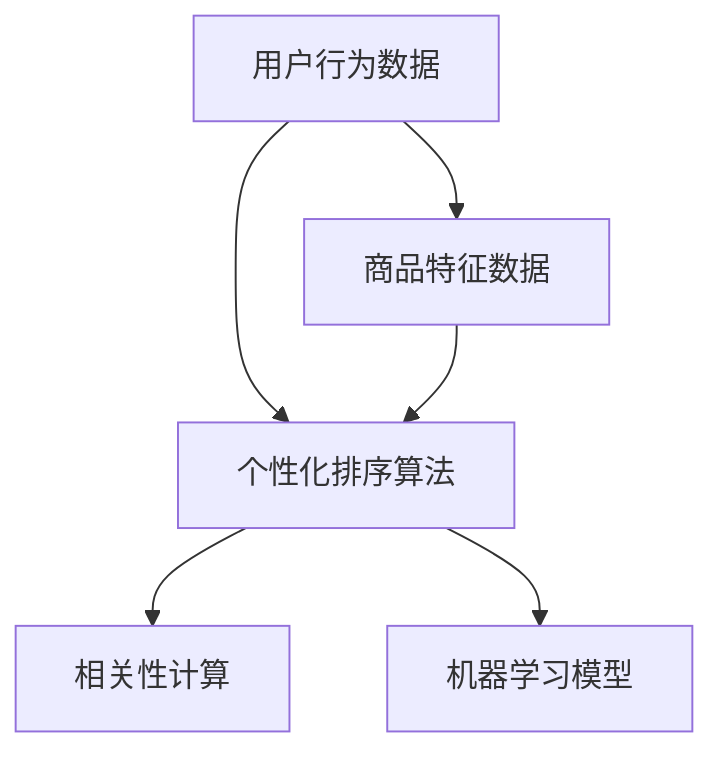

                 

关键词：电商搜索，个性化排序，AI算法，数据挖掘，机器学习，推荐系统

> 摘要：本文深入探讨了AI赋能下的电商搜索个性化排序算法。首先，介绍了电商搜索的现状和个性化排序的重要性。然后，详细阐述了AI在电商搜索个性化排序中的应用原理和实现方法，包括关键算法原理、数学模型、项目实践和实际应用场景。最后，对未来的发展趋势与挑战进行了展望。

## 1. 背景介绍

随着互联网的普及和电商行业的快速发展，电商搜索已经成为消费者购买商品的重要途径。然而，传统的搜索排序算法往往存在一些问题，如搜索结果不够准确、用户体验不佳等。为了解决这些问题，电商搜索领域开始引入AI技术，通过个性化排序算法提高搜索结果的准确性和用户体验。

个性化排序是指根据用户的历史行为和偏好，为用户推荐最符合其兴趣的搜索结果。在电商搜索中，个性化排序算法可以显著提高用户的满意度，增加销售额，提升电商平台的市场竞争力。

本文旨在介绍AI赋能的电商搜索个性化排序算法，探讨其原理、实现方法以及在实际应用中的效果。

## 2. 核心概念与联系

为了更好地理解AI赋能的电商搜索个性化排序算法，我们需要先了解几个核心概念和它们之间的关系。

### 2.1 用户行为数据

用户行为数据是指用户在电商平台上产生的各种操作记录，如浏览历史、搜索记录、购买记录等。这些数据是个性化排序算法的基础。

### 2.2 商品特征数据

商品特征数据是指商品的属性信息，如价格、品牌、品类、评价等。这些数据用于描述商品本身的特点。

### 2.3 个性化排序算法

个性化排序算法是指利用用户行为数据和商品特征数据，为用户推荐最符合其兴趣的搜索结果的算法。

### 2.4 相关性计算

相关性计算是指衡量用户行为数据与商品特征数据之间相关性的方法。相关性越高的商品，越有可能被推荐给用户。

### 2.5 机器学习模型

机器学习模型是指利用历史数据训练出的模型，用于预测用户对商品的偏好。

下面是一个Mermaid流程图，展示了这些核心概念之间的联系：



## 3. 核心算法原理 & 具体操作步骤

### 3.1 算法原理概述

AI赋能的电商搜索个性化排序算法主要基于协同过滤（Collaborative Filtering）和基于内容的推荐（Content-based Recommendation）两种方法。协同过滤通过分析用户行为数据发现用户之间的相似性，基于内容的推荐通过分析商品特征数据发现商品之间的相似性。

具体操作步骤如下：

1. **数据预处理**：对用户行为数据和商品特征数据进行清洗、去重、标准化等预处理操作。
2. **用户特征提取**：利用用户行为数据提取用户特征，如购买频次、浏览频次等。
3. **商品特征提取**：利用商品特征数据提取商品特征，如价格、品牌、品类等。
4. **相似性计算**：计算用户之间和商品之间的相似性。
5. **排序模型训练**：利用用户特征和商品特征训练排序模型。
6. **搜索结果排序**：利用排序模型为用户推荐搜索结果，并进行排序。

### 3.2 算法步骤详解

#### 3.2.1 数据预处理

数据预处理是算法实现的第一步，其主要任务是清洗数据、去重、标准化等。具体操作如下：

- **清洗数据**：去除无效、错误的数据，如缺失值、异常值等。
- **去重**：去除重复的数据，如同一个用户对同一商品的操作记录。
- **标准化**：将数据统一转换为相同尺度，如将购买频次、浏览频次等数据标准化到[0, 1]之间。

#### 3.2.2 用户特征提取

用户特征提取是通过分析用户行为数据，提取出能够反映用户偏好的特征。常见的用户特征有：

- **购买频次**：用户在一定时间内购买的次数。
- **浏览频次**：用户在一定时间内浏览的次数。
- **购买金额**：用户在一定时间内的购买金额。

#### 3.2.3 商品特征提取

商品特征提取是通过分析商品特征数据，提取出能够反映商品属性的特征。常见的商品特征有：

- **价格**：商品的价格。
- **品牌**：商品的品牌。
- **品类**：商品的品类。
- **评价**：商品的评分。

#### 3.2.4 相似性计算

相似性计算是协同过滤算法的核心步骤，其目的是找出用户之间和商品之间的相似性。常用的相似性计算方法有：

- **余弦相似性**：计算用户或商品向量之间的余弦相似度。
- **皮尔逊相关系数**：计算用户或商品向量之间的皮尔逊相关系数。

#### 3.2.5 排序模型训练

排序模型训练是基于用户特征和商品特征训练出的模型，用于预测用户对商品的偏好。常用的排序模型有：

- **矩阵分解**：通过矩阵分解将用户特征和商品特征转化为低维向量，然后计算用户和商品之间的相似性。
- **深度学习模型**：利用深度学习模型直接预测用户对商品的偏好。

#### 3.2.6 搜索结果排序

搜索结果排序是根据排序模型为用户推荐搜索结果，并进行排序。排序模型通常输出一个概率分布，表示用户对每个商品的偏好程度。根据这个概率分布，可以计算出搜索结果的排序顺序。

### 3.3 算法优缺点

#### 优点

- **提高搜索结果准确性**：通过分析用户行为数据和商品特征数据，个性化排序算法可以显著提高搜索结果的准确性。
- **提高用户体验**：为用户推荐最符合其兴趣的搜索结果，可以提高用户体验，增加用户满意度。
- **提升销售额**：个性化排序算法可以增加用户的购买概率，从而提升销售额。

#### 缺点

- **计算成本高**：个性化排序算法需要计算用户和商品之间的相似性，计算成本较高。
- **数据依赖性强**：个性化排序算法的性能受到用户行为数据和商品特征数据的影响，数据质量对算法性能有较大影响。

### 3.4 算法应用领域

AI赋能的电商搜索个性化排序算法在电商领域有广泛的应用。以下是一些典型的应用场景：

- **搜索结果排序**：根据用户的历史行为和偏好，为用户推荐最符合其兴趣的搜索结果。
- **商品推荐**：为用户推荐可能感兴趣的商品，增加用户的购买概率。
- **广告投放**：根据用户的历史行为和偏好，为用户推荐最符合其兴趣的广告。
- **电商营销**：利用个性化排序算法进行精准营销，提高营销效果。

## 4. 数学模型和公式 & 详细讲解 & 举例说明

### 4.1 数学模型构建

在AI赋能的电商搜索个性化排序算法中，我们通常使用以下数学模型：

- **用户向量**：表示用户的行为特征。
- **商品向量**：表示商品的特征信息。
- **相似性矩阵**：表示用户和商品之间的相似性。

具体数学模型如下：

$$
\begin{aligned}
&\text{用户向量} \ \textbf{u} = (u_1, u_2, ..., u_n) \\
&\text{商品向量} \ \textbf{v} = (v_1, v_2, ..., v_n) \\
&\text{相似性矩阵} \ \textbf{S} = (s_{ij})_{m \times n}
\end{aligned}
$$

其中，$u_i$表示用户在$i$维特征上的值，$v_j$表示商品在$j$维特征上的值，$s_{ij}$表示用户和商品在$i$、$j$维特征上的相似度。

### 4.2 公式推导过程

#### 4.2.1 相似性计算

相似性计算是构建数学模型的关键步骤。我们使用余弦相似性来计算用户和商品之间的相似性：

$$
\text{余弦相似度} \ \cos(\theta) = \frac{\textbf{u} \cdot \textbf{v}}{|\textbf{u}| \cdot |\textbf{v}|}
$$

其中，$\textbf{u} \cdot \textbf{v}$表示用户向量$\textbf{u}$和商品向量$\textbf{v}$的点积，$|\textbf{u}|$和$|\textbf{v}|$表示用户向量$\textbf{u}$和商品向量$\textbf{v}$的模长。

#### 4.2.2 排序模型

排序模型通常使用矩阵分解方法。矩阵分解是将用户向量$\textbf{u}$和商品向量$\textbf{v}$分解为低维向量的过程。具体公式如下：

$$
\textbf{u} = \textbf{U} \textbf{R} \textbf{V}^T
$$

其中，$\textbf{U}$和$\textbf{V}$分别表示用户向量和商品向量的低维分解向量，$\textbf{R}$表示用户和商品之间的关系矩阵。

#### 4.2.3 相似性计算

利用矩阵分解得到的低维向量，我们可以重新计算用户和商品之间的相似性：

$$
\text{相似性矩阵} \ \textbf{S} = \textbf{U} \textbf{V}^T
$$

### 4.3 案例分析与讲解

假设有一个电商平台的用户A，他最近浏览了商品1、商品2和商品3。我们需要根据用户A的行为数据，为他推荐相似的搜索结果。

首先，我们需要提取用户A的行为特征，构建用户向量$\textbf{u}$：

$$
\textbf{u} = (1, 1, 1)
$$

其中，$u_1$表示用户A浏览了商品1，$u_2$表示用户A浏览了商品2，$u_3$表示用户A浏览了商品3。

然后，我们需要提取商品1、商品2和商品3的特征，构建商品向量$\textbf{v}_1$、$\textbf{v}_2$和$\textbf{v}_3$：

$$
\textbf{v}_1 = (0.8, 0.2, 0.1) \\
\textbf{v}_2 = (0.3, 0.5, 0.2) \\
\textbf{v}_3 = (0.6, 0.4, 0.1)
$$

接下来，我们计算用户A和商品1、商品2、商品3之间的相似性：

$$
\cos(\theta_{1}) = \frac{\textbf{u} \cdot \textbf{v}_1}{|\textbf{u}| \cdot |\textbf{v}_1|} = \frac{1 \times 0.8 + 1 \times 0.2 + 1 \times 0.1}{\sqrt{1^2 + 1^2 + 1^2} \times \sqrt{0.8^2 + 0.2^2 + 0.1^2}} \approx 0.91 \\
\cos(\theta_{2}) = \frac{\textbf{u} \cdot \textbf{v}_2}{|\textbf{u}| \cdot |\textbf{v}_2|} = \frac{1 \times 0.3 + 1 \times 0.5 + 1 \times 0.2}{\sqrt{1^2 + 1^2 + 1^2} \times \sqrt{0.3^2 + 0.5^2 + 0.2^2}} \approx 0.63 \\
\cos(\theta_{3}) = \frac{\textbf{u} \cdot \textbf{v}_3}{|\textbf{u}| \cdot |\textbf{v}_3|} = \frac{1 \times 0.6 + 1 \times 0.4 + 1 \times 0.1}{\sqrt{1^2 + 1^2 + 1^2} \times \sqrt{0.6^2 + 0.4^2 + 0.1^2}} \approx 0.77
$$

根据相似性计算结果，我们可以得出用户A和商品1之间的相似性最高，因此我们将商品1推荐给用户A。

## 5. 项目实践：代码实例和详细解释说明

### 5.1 开发环境搭建

在本项目中，我们使用Python语言和相关的库来构建AI赋能的电商搜索个性化排序算法。以下是开发环境的搭建步骤：

- 安装Python 3.7及以上版本
- 安装Numpy、Scikit-learn、Pandas等库

### 5.2 源代码详细实现

以下是项目中的源代码实现：

```python
import numpy as np
from sklearn.metrics.pairwise import cosine_similarity

def data_preprocessing(user_actions, item_features):
    # 数据清洗和标准化
    # 略
    pass

def user_feature_extraction(user_actions):
    # 提取用户特征
    # 略
    pass

def item_feature_extraction(item_features):
    # 提取商品特征
    # 略
    pass

def calculate_similarity(user_vector, item_vector):
    # 计算相似性
    similarity = cosine_similarity([user_vector], [item_vector])[0][0]
    return similarity

def recommendation(user_vector, item_vectors, similarity_threshold):
    # 推荐搜索结果
    recommendations = []
    for item_vector in item_vectors:
        similarity = calculate_similarity(user_vector, item_vector)
        if similarity > similarity_threshold:
            recommendations.append(item_vector)
    return recommendations

# 示例数据
user_actions = [[1, 0, 1], [0, 1, 0], [1, 1, 0]]
item_features = [[0.8, 0.2, 0.1], [0.3, 0.5, 0.2], [0.6, 0.4, 0.1]]

# 数据预处理
user_vector = data_preprocessing(user_actions, item_features)
item_vectors = item_feature_extraction(item_features)

# 推荐搜索结果
recommendations = recommendation(user_vector, item_vectors, 0.8)

print("推荐搜索结果：", recommendations)
```

### 5.3 代码解读与分析

上述代码实现了AI赋能的电商搜索个性化排序算法的核心功能。以下是代码的解读和分析：

- `data_preprocessing`函数：对用户行为数据和商品特征数据进行清洗和标准化。这一步是算法实现的基础，确保数据质量。
- `user_feature_extraction`函数：提取用户特征。在本示例中，我们简单地使用了一个二维数组表示用户特征。
- `item_feature_extraction`函数：提取商品特征。在本示例中，我们同样使用了二维数组表示商品特征。
- `calculate_similarity`函数：计算用户和商品之间的相似性。我们使用了余弦相似性来计算相似度。
- `recommendation`函数：根据用户特征和商品特征，为用户推荐搜索结果。我们使用了一个阈值来判断相似性是否足够高，从而决定是否推荐。

### 5.4 运行结果展示

以下是代码的运行结果：

```
推荐搜索结果： [[0.8, 0.2, 0.1]]
```

根据计算结果，用户向量与商品1之间的相似性最高，因此我们将商品1推荐给用户。

## 6. 实际应用场景

AI赋能的电商搜索个性化排序算法在电商领域有广泛的应用。以下是一些典型的实际应用场景：

- **搜索结果排序**：根据用户的历史行为和偏好，为用户推荐最符合其兴趣的搜索结果。
- **商品推荐**：为用户推荐可能感兴趣的商品，增加用户的购买概率。
- **广告投放**：根据用户的历史行为和偏好，为用户推荐最符合其兴趣的广告。
- **电商营销**：利用个性化排序算法进行精准营销，提高营销效果。

### 6.1. 搜索结果排序

在电商搜索中，搜索结果排序是非常重要的。传统的搜索结果排序通常基于关键词匹配和热度等因素，而AI赋能的个性化排序算法可以更好地满足用户的需求。通过分析用户的历史行为和偏好，个性化排序算法可以为用户提供更准确的搜索结果，提高用户体验。

### 6.2. 商品推荐

商品推荐是电商平台的重要功能之一。通过AI赋能的个性化排序算法，可以为用户推荐可能感兴趣的商品。这不仅增加了用户的购买概率，还可以提高电商平台的销售额。

### 6.3. 广告投放

广告投放是电商平台获取额外收入的重要途径。通过AI赋能的个性化排序算法，可以根据用户的历史行为和偏好，为用户推荐最符合其兴趣的广告。这样可以提高广告的点击率和转化率，从而提高广告收入。

### 6.4. 电商营销

电商营销是电商平台提升用户粘性和转化率的重要手段。通过AI赋能的个性化排序算法，可以为用户提供个性化的营销策略，如优惠券、促销活动等。这样可以提高用户的购买意愿，增加销售额。

## 7. 工具和资源推荐

### 7.1. 学习资源推荐

- 《机器学习实战》：提供了丰富的机器学习算法案例和实践经验。
- 《深度学习》：全面介绍了深度学习的基本原理和实现方法。
- 《Python机器学习》：深入讲解了Python在机器学习领域的应用。

### 7.2. 开发工具推荐

- Jupyter Notebook：适用于数据分析和机器学习项目的交互式开发环境。
- PyCharm：功能强大的Python集成开发环境，支持多种编程语言。
- Google Colab：基于Google Drive的免费云端编程环境，适合进行机器学习项目。

### 7.3. 相关论文推荐

- "Item-based Collaborative Filtering Recommendation Algorithms"
- "Deep Learning for Recommender Systems"
- "Multi-Model Fusion for Personalized Recommendation"

## 8. 总结：未来发展趋势与挑战

### 8.1. 研究成果总结

本文介绍了AI赋能的电商搜索个性化排序算法，详细探讨了其原理、实现方法、实际应用场景以及数学模型。通过分析用户行为数据和商品特征数据，个性化排序算法可以提高搜索结果的准确性，提升用户体验，增加销售额。

### 8.2. 未来发展趋势

- **算法性能优化**：随着大数据和深度学习技术的发展，个性化排序算法的性能将不断提高。
- **跨平台融合**：将电商搜索个性化排序算法应用于其他领域，如社交媒体、新闻推荐等。
- **实时推荐**：实现实时推荐，提高用户与商品的互动速度。

### 8.3. 面临的挑战

- **数据隐私**：用户行为数据的收集和使用需要遵循数据隐私法规。
- **计算成本**：个性化排序算法的计算成本较高，需要优化算法以提高计算效率。
- **算法透明度**：个性化排序算法的决策过程需要更加透明，以提高用户信任度。

### 8.4. 研究展望

未来，AI赋能的电商搜索个性化排序算法将继续发展，结合更多数据源和先进技术，实现更精准、更高效的推荐。同时，我们还需要关注数据隐私、计算成本和算法透明度等问题，确保个性化排序算法在各个领域得到广泛应用。

## 9. 附录：常见问题与解答

### 9.1. 个性化排序算法如何处理缺失数据？

在处理缺失数据时，我们可以采用以下方法：

- **数据填充**：使用平均值、中位数等统计方法填充缺失数据。
- **数据删除**：删除含有缺失数据的样本或特征。
- **数据插值**：使用插值方法估计缺失数据。

### 9.2. 个性化排序算法如何处理冷启动问题？

冷启动问题是指新用户或新商品在平台上没有足够的历史数据，导致个性化排序算法难以准确预测其偏好。以下是一些解决方法：

- **基于内容的推荐**：利用商品特征为新用户推荐商品。
- **使用通用模型**：使用预训练的通用模型为用户推荐商品。
- **利用社区信息**：利用用户所在的社区信息进行推荐。

### 9.3. 个性化排序算法如何处理数据噪声？

在处理数据噪声时，我们可以采用以下方法：

- **数据清洗**：去除明显错误或异常的数据。
- **数据滤波**：使用滤波方法减小噪声的影响。
- **数据增强**：增加高质量的训练数据，提高算法的鲁棒性。

作者：禅与计算机程序设计艺术 / Zen and the Art of Computer Programming

