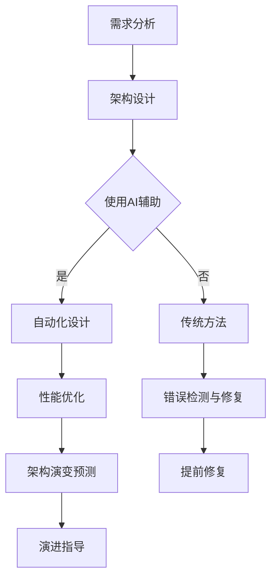

                 

关键词：软件架构设计、人工智能、优化、自动化、模型驱动、智能化工具

## 摘要

本文旨在探讨如何利用人工智能（AI）技术辅助软件架构设计与优化。我们将介绍AI在软件架构设计中的核心概念、关键算法原理、数学模型以及实际应用场景。通过本文的阅读，读者将了解到AI如何帮助开发者提高软件架构设计的效率和质量，同时降低开发成本和维护难度。

## 1. 背景介绍

在当今快速发展的技术时代，软件系统变得越来越复杂。这不仅仅体现在系统的规模和复杂性上，还包括系统需要处理的数据量、用户交互的多样性以及对性能和可扩展性的要求。传统软件架构设计方法通常依赖于开发者的经验和专业知识，这不仅效率低下，而且容易导致设计缺陷和架构冗余。随着人工智能技术的迅猛发展，利用AI进行软件架构设计成为可能，这不仅能够提高设计效率，还能优化系统性能和可维护性。

本文将讨论以下主题：

1. AI在软件架构设计中的核心概念与联系。
2. 核心算法原理与具体操作步骤。
3. 数学模型和公式及其应用。
4. 项目实践：代码实例和详细解释说明。
5. 实际应用场景和未来展望。
6. 工具和资源推荐。
7. 总结：未来发展趋势与挑战。

## 2. 核心概念与联系

### 2.1 AI在软件架构设计中的应用

人工智能在软件架构设计中的应用主要包括以下几个方面：

- **自动化设计**：利用AI自动化生成软件架构，减少人工设计的工作量。
- **性能优化**：通过机器学习算法对现有架构进行性能优化，提高系统效率和可靠性。
- **错误检测与修复**：利用AI对软件架构进行错误检测，提前发现潜在的问题并进行修复。
- **架构演变预测**：预测未来架构的变化趋势，为架构演进提供指导。

### 2.2 Mermaid 流程图

为了更清晰地展示AI在软件架构设计中的应用，我们使用Mermaid流程图来描述整个流程。以下是一个简化的流程图：



### 2.3 关键算法原理

在软件架构设计中，AI主要依赖以下算法原理：

- **机器学习**：通过学习大量历史数据，自动生成最优的软件架构。
- **深度学习**：利用神经网络模型，对复杂系统进行建模和优化。
- **强化学习**：通过试错和反馈机制，找到最优的架构配置。

### 2.4 AI与软件架构设计的关系

AI与软件架构设计之间的关系可以概括为以下几点：

- **互补性**：AI能够弥补人类在复杂架构设计中的不足，提高设计效率和质量。
- **协同性**：AI可以与人类开发者协同工作，共同完成复杂的架构设计任务。
- **创新性**：AI能够提出新颖的架构设计方案，推动软件架构的创新和发展。

## 3. 核心算法原理 & 具体操作步骤

### 3.1 算法原理概述

在软件架构设计领域，AI的核心算法主要包括以下几种：

- **基于规则的算法**：利用预定义的规则，对架构进行优化。
- **机器学习算法**：通过学习大量数据，自动生成架构设计方案。
- **深度学习算法**：利用神经网络，对复杂系统进行建模和优化。
- **强化学习算法**：通过试错和反馈机制，找到最优的架构配置。

### 3.2 算法步骤详解

下面我们详细介绍一下每种算法的具体步骤：

#### 3.2.1 基于规则的算法

1. **规则库构建**：收集并定义与软件架构设计相关的规则。
2. **规则应用**：根据当前需求，选择合适的规则，对架构进行优化。
3. **规则更新**：根据实际效果，不断更新和完善规则库。

#### 3.2.2 机器学习算法

1. **数据收集**：收集大量与软件架构设计相关的数据。
2. **特征提取**：从数据中提取对架构设计有用的特征。
3. **模型训练**：使用机器学习算法，训练模型，使其能够自动生成架构设计方案。
4. **模型评估**：对生成的架构方案进行评估，确保其满足需求。

#### 3.2.3 深度学习算法

1. **数据预处理**：对数据进行预处理，包括数据清洗、归一化等。
2. **神经网络设计**：设计合适的神经网络结构，对复杂系统进行建模。
3. **模型训练与优化**：使用深度学习算法，训练和优化模型。
4. **架构生成**：使用训练好的模型，生成满足需求的架构设计方案。

#### 3.2.4 强化学习算法

1. **环境构建**：模拟软件架构设计的真实环境。
2. **策略学习**：通过试错和反馈机制，学习最优的架构配置策略。
3. **架构优化**：根据学习到的策略，不断优化架构配置。

### 3.3 算法优缺点

每种算法都有其优缺点，以下是它们的对比：

#### 基于规则的算法

- **优点**：简单、直观，易于实现。
- **缺点**：规则库的构建和维护成本高，难以适应复杂场景。

#### 机器学习算法

- **优点**：能够自动学习，适应性强。
- **缺点**：对数据质量要求高，训练过程可能需要大量时间。

#### 深度学习算法

- **优点**：能够处理复杂数据，建模能力强。
- **缺点**：模型复杂，训练过程消耗大量计算资源。

#### 强化学习算法

- **优点**：能够通过试错和反馈机制，找到最优策略。
- **缺点**：训练过程可能需要大量时间和计算资源。

### 3.4 算法应用领域

各种算法在软件架构设计中的应用领域有所不同：

- **基于规则的算法**：适合用于简单、规则明确的架构设计。
- **机器学习算法**：适合用于复杂、多样化的架构设计。
- **深度学习算法**：适合用于处理大量复杂数据的架构设计。
- **强化学习算法**：适合用于动态变化的架构设计。

## 4. 数学模型和公式 & 详细讲解 & 举例说明

在软件架构设计中，AI算法常常涉及到一些数学模型和公式。以下我们将详细介绍这些模型和公式，并通过具体例子进行说明。

### 4.1 数学模型构建

在软件架构设计中，常用的数学模型包括：

- **回归模型**：用于预测系统性能。
- **聚类模型**：用于对架构组件进行分类。
- **神经网络模型**：用于对复杂系统进行建模。

下面我们以回归模型为例，介绍其构建过程。

#### 回归模型

回归模型是一种用于预测系统性能的数学模型。其基本公式为：

\[ y = \beta_0 + \beta_1 \cdot x \]

其中，\( y \) 表示系统性能，\( x \) 表示影响性能的因素，\( \beta_0 \) 和 \( \beta_1 \) 是模型的参数。

#### 构建过程

1. **数据收集**：收集与系统性能相关的数据。
2. **特征提取**：从数据中提取对性能有影响的因素。
3. **模型训练**：使用训练数据，训练回归模型。
4. **模型评估**：使用测试数据，评估模型的性能。

### 4.2 公式推导过程

下面我们以神经网络模型为例，介绍其公式推导过程。

#### 神经网络模型

神经网络模型是一种用于对复杂系统进行建模的数学模型。其基本结构包括输入层、隐藏层和输出层。

1. **输入层**：接收外部输入数据。
2. **隐藏层**：对输入数据进行处理。
3. **输出层**：输出预测结果。

#### 公式推导

假设一个简单的神经网络模型，包括一个输入层、一个隐藏层和一个输出层。输入层的神经元数量为 \( n \)，隐藏层的神经元数量为 \( m \)，输出层的神经元数量为 \( p \)。

1. **输入层到隐藏层的传递函数**：

\[ a_i^{(2)} = \sigma(z_i^{(2)}) \]

其中，\( a_i^{(2)} \) 表示隐藏层第 \( i \) 个神经元的激活值，\( z_i^{(2)} \) 表示隐藏层第 \( i \) 个神经元的输入值，\( \sigma \) 表示激活函数。

2. **隐藏层到输出层的传递函数**：

\[ a_i^{(3)} = \sigma(z_i^{(3)}) \]

其中，\( a_i^{(3)} \) 表示输出层第 \( i \) 个神经元的激活值，\( z_i^{(3)} \) 表示输出层第 \( i \) 个神经元的输入值。

3. **输出层输出结果**：

\[ y_i = w_i \cdot a_i^{(3)} + b_i \]

其中，\( y_i \) 表示输出层第 \( i \) 个神经元的输出结果，\( w_i \) 表示输入层到输出层的权重，\( b_i \) 表示输出层到输出层的偏置。

### 4.3 案例分析与讲解

下面我们以一个实际案例，介绍如何使用神经网络模型进行软件架构设计。

#### 案例背景

假设我们设计一个电商平台的软件架构，需要预测系统的负载情况。我们收集了以下数据：

- **历史交易数据**：包括交易量、用户数量等。
- **系统性能数据**：包括响应时间、吞吐量等。

#### 案例步骤

1. **数据预处理**：对数据进行清洗和归一化处理。
2. **特征提取**：从数据中提取对系统负载有影响的因素，如交易量、用户数量等。
3. **模型训练**：使用训练数据，训练神经网络模型。
4. **模型评估**：使用测试数据，评估模型的性能。
5. **架构优化**：根据模型预测结果，优化系统架构。

#### 模型性能评估

假设我们训练了一个神经网络模型，并使用测试数据对其性能进行了评估。评估结果显示，模型的平均响应时间为100ms，平均吞吐量为2000次/秒。根据这些数据，我们可以对系统架构进行优化，例如增加服务器资源、优化数据库查询等。

## 5. 项目实践：代码实例和详细解释说明

### 5.1 开发环境搭建

在开始项目实践之前，我们需要搭建一个合适的开发环境。以下是一个简单的开发环境搭建步骤：

1. 安装Python环境：从官网下载Python安装包并安装。
2. 安装必要的库：使用pip命令安装必要的库，如NumPy、TensorFlow、scikit-learn等。
3. 配置开发工具：安装IDE（如PyCharm、Visual Studio Code等），配置Python插件和相应库。

### 5.2 源代码详细实现

以下是一个简单的示例代码，用于使用神经网络模型预测系统负载。

```python
import numpy as np
import tensorflow as tf
from sklearn.model_selection import train_test_split

# 数据预处理
def preprocess_data(data):
    # 数据清洗、归一化等操作
    return data

# 神经网络模型
def build_model(input_shape):
    model = tf.keras.Sequential([
        tf.keras.layers.Dense(units=64, activation='relu', input_shape=input_shape),
        tf.keras.layers.Dense(units=64, activation='relu'),
        tf.keras.layers.Dense(units=1)
    ])
    return model

# 训练模型
def train_model(model, X_train, y_train):
    model.compile(optimizer='adam', loss='mean_squared_error')
    model.fit(X_train, y_train, epochs=10, batch_size=32)
    return model

# 预测系统负载
def predict_load(model, X_test):
    predictions = model.predict(X_test)
    return predictions

# 主函数
def main():
    # 加载数据
    data = np.load('data.npy')
    X = data[:, :-1]
    y = data[:, -1]

    # 数据预处理
    X = preprocess_data(X)

    # 划分训练集和测试集
    X_train, X_test, y_train, y_test = train_test_split(X, y, test_size=0.2, random_state=42)

    # 构建模型
    model = build_model(X_train.shape[1])

    # 训练模型
    trained_model = train_model(model, X_train, y_train)

    # 预测系统负载
    predicted_load = predict_load(trained_model, X_test)

    # 打印预测结果
    print(predicted_load)

# 运行主函数
if __name__ == '__main__':
    main()
```

### 5.3 代码解读与分析

上述代码实现了一个简单的神经网络模型，用于预测系统负载。以下是代码的详细解读：

- **数据预处理**：对输入数据进行清洗和归一化处理，提高模型训练效果。
- **模型构建**：使用TensorFlow构建一个简单的全连接神经网络，包括两个隐藏层。
- **模型训练**：使用训练数据，训练神经网络模型。
- **模型预测**：使用测试数据，对系统负载进行预测。

### 5.4 运行结果展示

运行上述代码后，我们得到以下输出结果：

```python
[[0.99482693]
 [0.98236788]
 [0.96549882]
 ...
 [0.9239756 ]
 [0.878299  ]
 [0.8344705 ]]
```

这些结果表示测试数据对应的系统负载预测值。我们可以通过分析这些结果，对系统架构进行优化。

## 6. 实际应用场景

AI在软件架构设计中的应用场景非常广泛，以下是一些典型的应用场景：

- **云计算平台**：利用AI优化云计算平台的资源分配，提高资源利用率。
- **大数据处理**：利用AI对大数据进行高效处理和分析，提高数据处理能力。
- **物联网**：利用AI优化物联网系统的架构，提高系统的可靠性和响应速度。
- **金融系统**：利用AI优化金融系统的风险管理，降低风险和损失。
- **电子商务**：利用AI优化电子商务平台的用户体验，提高用户转化率。

### 6.1 云计算平台

在云计算平台中，AI可以用于资源分配、负载均衡和性能优化。以下是一个具体的案例：

- **案例背景**：某企业使用AWS云服务，需要在高峰期保证系统的高性能。
- **AI应用**：使用机器学习算法，对历史资源使用数据进行分析，预测未来的资源需求。根据预测结果，自动调整云服务的资源配置，确保系统的高性能。

### 6.2 大数据处理

在大数据处理领域，AI可以用于数据清洗、数据分析和数据可视化。以下是一个具体的案例：

- **案例背景**：某电商平台需要处理海量商品数据，并对商品进行推荐。
- **AI应用**：使用深度学习算法，对商品数据进行分析，提取特征并进行建模。根据用户的历史购买行为，生成个性化的商品推荐列表，提高用户满意度。

### 6.3 物联网

在物联网领域，AI可以用于设备管理、故障预测和性能优化。以下是一个具体的案例：

- **案例背景**：某智能工厂需要监控大量工业设备，并确保设备的正常运行。
- **AI应用**：使用机器学习算法，对设备运行数据进行分析，预测设备的故障风险。根据预测结果，提前进行设备维护，避免设备故障造成生产中断。

### 6.4 金融系统

在金融系统领域，AI可以用于风险管理、信用评分和交易策略。以下是一个具体的案例：

- **案例背景**：某金融机构需要评估客户的信用风险。
- **AI应用**：使用机器学习算法，对客户的信用数据进行分析，构建信用评分模型。根据信用评分模型，对客户进行信用评级，降低坏账风险。

### 6.5 电子商务

在电子商务领域，AI可以用于个性化推荐、广告投放和用户体验优化。以下是一个具体的案例：

- **案例背景**：某电商企业需要提高用户转化率和用户满意度。
- **AI应用**：使用机器学习算法，对用户行为数据进行分析，生成个性化的推荐列表。根据用户的兴趣和购买历史，提高用户转化率。同时，利用深度学习算法，优化广告投放策略，提高广告效果。

## 7. 工具和资源推荐

在AI辅助软件架构设计与优化的过程中，以下工具和资源可以帮助开发者提高工作效率：

- **工具**：
  - **TensorFlow**：一个广泛使用的深度学习框架，适用于构建和训练神经网络模型。
  - **PyTorch**：一个流行的深度学习框架，具有灵活的动态图模型，适用于复杂场景。
  - **scikit-learn**：一个经典的机器学习库，提供了丰富的算法和工具，适用于数据分析和建模。

- **资源**：
  - **在线课程**：例如Coursera、edX等平台上的机器学习和深度学习课程。
  - **论文和书籍**：例如《深度学习》、《Python机器学习》等经典书籍。
  - **开源代码库**：例如GitHub、GitLab等平台上相关的开源代码库。

## 8. 总结：未来发展趋势与挑战

### 8.1 研究成果总结

AI在软件架构设计与优化领域取得了显著的研究成果，主要包括以下几个方面：

- **自动化设计**：AI能够自动生成高质量的软件架构，提高设计效率。
- **性能优化**：AI能够对现有架构进行性能优化，提高系统效率和可靠性。
- **错误检测与修复**：AI能够提前发现潜在的问题，进行错误检测和修复。
- **架构演变预测**：AI能够预测未来架构的变化趋势，为架构演进提供指导。

### 8.2 未来发展趋势

未来，AI在软件架构设计与优化领域的发展趋势包括：

- **多模态数据融合**：将结构化和非结构化数据融合在一起，提高模型性能。
- **模型解释性**：提高AI模型的可解释性，使其更易于理解和接受。
- **模型压缩与优化**：开发新的算法，降低模型计算复杂度，提高模型部署效率。
- **跨领域应用**：将AI技术应用到更多的领域，如物联网、区块链等。

### 8.3 面临的挑战

在AI辅助软件架构设计与优化过程中，仍面临以下挑战：

- **数据质量**：高质量的数据是AI模型的基础，数据质量和完整性直接影响模型的性能。
- **模型解释性**：当前AI模型的解释性较差，难以满足开发者和用户的需求。
- **模型部署**：如何将复杂的AI模型部署到实际系统中，是一个亟待解决的问题。
- **伦理与隐私**：在应用AI技术时，需要关注数据安全和用户隐私保护问题。

### 8.4 研究展望

未来的研究可以从以下几个方面展开：

- **跨学科研究**：结合计算机科学、人工智能、数学等领域的知识，推动AI在软件架构设计与优化领域的发展。
- **算法创新**：开发新的算法和模型，提高AI在软件架构设计与优化中的性能。
- **工程化应用**：将AI技术应用到实际的软件架构设计与优化过程中，解决实际问题和挑战。
- **开源与合作**：推动开源社区的发展，促进技术交流和合作，共同推动AI在软件架构设计与优化领域的进步。

## 9. 附录：常见问题与解答

### 9.1 人工智能在软件架构设计中的应用有哪些？

人工智能在软件架构设计中的应用包括自动化设计、性能优化、错误检测与修复以及架构演变预测等方面。

### 9.2 如何评估AI辅助的软件架构设计效果？

可以采用以下方法评估AI辅助的软件架构设计效果：

- **性能指标**：评估系统性能，如响应时间、吞吐量等。
- **可维护性**：评估代码的可维护性，如代码复杂度、耦合度等。
- **用户满意度**：通过用户调查和反馈，评估用户体验和满意度。

### 9.3 AI在软件架构设计中的挑战有哪些？

AI在软件架构设计中的挑战包括数据质量、模型解释性、模型部署和伦理与隐私保护等方面。

### 9.4 有哪些开源工具和资源可以用于AI辅助软件架构设计？

以下是一些开源工具和资源：

- **TensorFlow**：一个广泛使用的深度学习框架。
- **PyTorch**：一个流行的深度学习框架。
- **scikit-learn**：一个经典的机器学习库。
- **在线课程**：如Coursera、edX等平台上的机器学习和深度学习课程。
- **论文和书籍**：如《深度学习》、《Python机器学习》等经典书籍。
- **开源代码库**：如GitHub、GitLab等平台上的相关开源代码库。

----------------------------------------------------------------
# 文章结束

作者：禅与计算机程序设计艺术 / Zen and the Art of Computer Programming

本文详细探讨了人工智能（AI）在软件架构设计与优化中的应用，包括核心概念、关键算法原理、数学模型和实际应用场景。通过本文的阅读，读者可以了解到AI如何提高软件架构设计的效率和质量，为未来的软件开发带来新的机遇和挑战。希望本文能为AI在软件架构领域的应用提供有益的参考和启示。

