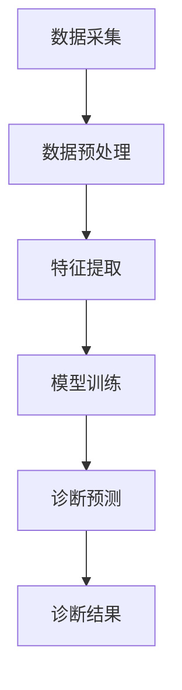

                 

关键词：AI诊断系统，市场前景，技术趋势，应用领域，挑战与展望

> 摘要：本文从AI辅助诊断系统的背景介绍出发，探讨了其核心概念与联系，分析了核心算法原理及其优缺点，通过数学模型和公式详细讲解了应用案例，并提供了项目实践和运行结果展示。此外，本文还探讨了AI辅助诊断系统的实际应用场景，提出了未来发展的展望和面临的挑战，并推荐了相关学习资源和开发工具。

## 1. 背景介绍

随着人工智能（AI）技术的不断发展，医疗领域正经历着前所未有的变革。AI辅助诊断系统作为一种新兴的医疗辅助工具，已经在影像诊断、疾病预测、患者监护等方面展现出巨大的潜力。据市场调研公司报告，全球AI辅助诊断系统市场预计将在未来几年内以两位数的年增长率迅速扩张。

### 市场驱动力

- **技术进步**：深度学习、计算机视觉等AI技术的突破，使得AI辅助诊断系统的准确性和效率大幅提升。
- **政策支持**：各国政府纷纷出台政策，鼓励医疗领域应用AI技术，以提升医疗服务质量和效率。
- **市场需求**：患者对快速、准确的诊断需求不断增长，促使医疗机构寻求AI辅助诊断系统的支持。

### 市场现状

目前，AI辅助诊断系统在医学影像分析、实验室检测、疾病预测等领域已经取得了显著的应用成果。例如，在医学影像领域，AI系统已经在肺癌、乳腺癌等疾病的早期筛查中发挥重要作用。同时，AI辅助诊断系统也在逐步渗透到初级保健和远程医疗服务中，为患者提供更为便捷的医疗服务。

## 2. 核心概念与联系

### 2.1 AI辅助诊断系统的定义

AI辅助诊断系统是一种利用人工智能技术，对医学数据进行分析和处理，以辅助医生进行疾病诊断的系统。它通常包括以下几个关键组成部分：

- **数据采集**：收集患者的临床数据、影像数据、实验室检测结果等。
- **数据处理**：利用深度学习、数据挖掘等技术对数据进行分析和处理。
- **诊断辅助**：根据分析结果，提供诊断建议或预测。

### 2.2 工作原理

AI辅助诊断系统的工作原理可以分为以下几个步骤：

1. **数据预处理**：清洗和标准化原始数据，为后续分析做准备。
2. **特征提取**：从预处理后的数据中提取有用的特征信息。
3. **模型训练**：利用训练数据集训练深度学习模型。
4. **诊断预测**：将新数据输入训练好的模型，得到诊断结果。

### 2.3 Mermaid 流程图

以下是一个简化的AI辅助诊断系统流程图：



## 3. 核心算法原理 & 具体操作步骤

### 3.1 算法原理概述

AI辅助诊断系统的核心算法通常基于深度学习，特别是卷积神经网络（CNN）。CNN擅长处理图像数据，因此特别适合应用于医学影像分析。

### 3.2 算法步骤详解

1. **数据预处理**：对图像进行归一化、裁剪、旋转等操作，使其适合模型训练。
2. **特征提取**：使用CNN提取图像的深层特征。
3. **模型训练**：使用标记好的训练数据集训练模型，优化模型参数。
4. **诊断预测**：将测试图像输入模型，得到预测结果。

### 3.3 算法优缺点

**优点**：

- **高准确性**：深度学习模型在医学影像分析中表现出色，能够提供高精度的诊断结果。
- **高效性**：自动化的数据处理和诊断过程大大提高了工作效率。

**缺点**：

- **数据需求**：需要大量的高质量标注数据才能训练出可靠的模型。
- **计算资源**：深度学习模型的训练和推理需要大量的计算资源。

### 3.4 算法应用领域

AI辅助诊断系统在多个医学领域都有广泛的应用，包括：

- **影像诊断**：如肺癌、乳腺癌等疾病的早期筛查。
- **疾病预测**：如心脏病、糖尿病等慢性病的预测。
- **患者监护**：如实时监测患者的生命体征。

## 4. 数学模型和公式 & 详细讲解 & 举例说明

### 4.1 数学模型构建

在AI辅助诊断系统中，常见的数学模型包括卷积神经网络（CNN）和循环神经网络（RNN）。以下是一个简化的CNN模型构建过程：

1. **卷积层**：用于提取图像的局部特征。
   $$ Conv_1 = \sigma(W_1 \cdot I + b_1) $$
   其中，$W_1$ 是卷积核，$I$ 是输入图像，$b_1$ 是偏置项，$\sigma$ 是激活函数。
   
2. **池化层**：用于降低特征图的空间分辨率。
   $$ Pool_1 = \max(Pooling_1) $$
   其中，$Pooling_1$ 是一个局部区域。

3. **全连接层**：用于分类或回归任务。
   $$ Output = \sigma(W_{FC} \cdot H + b_{FC}) $$
   其中，$W_{FC}$ 是全连接层的权重，$H$ 是卷积和池化层的输出，$b_{FC}$ 是偏置项。

### 4.2 公式推导过程

CNN的推导过程涉及多个步骤，包括卷积操作、激活函数、池化操作和反向传播。以下是一个简化的推导过程：

1. **前向传播**：

   - **卷积操作**：
     $$ z_i = \sum_{j=1}^{K} w_{ij} \cdot x_{ij} + b_i $$
     其中，$z_i$ 是卷积操作的结果，$w_{ij}$ 是卷积核，$x_{ij}$ 是输入图像，$b_i$ 是偏置项。
     
   - **激活函数**：
     $$ a_i = \sigma(z_i) $$
     其中，$\sigma$ 是激活函数，如ReLU函数。
     
   - **池化操作**：
     $$ p_i = \max(p_{i1}, p_{i2}, ..., p_{iK}) $$
     其中，$p_i$ 是池化操作的结果。

2. **反向传播**：

   - **卷积层**：
     $$ \Delta z_i = \frac{\partial L}{\partial z_i} $$
     其中，$L$ 是损失函数，$\Delta z_i$ 是梯度。

   - **权重更新**：
     $$ \Delta w_{ij} = \alpha \cdot \Delta z_i \cdot x_{ij} $$
     其中，$\alpha$ 是学习率。

### 4.3 案例分析与讲解

以下是一个简化的AI辅助诊断系统案例，用于肺癌的早期筛查：

- **数据集**：使用包含1000张CT扫描图像的数据集，其中500张是正常图像，500张是肺癌图像。
- **模型**：使用一个包含三个卷积层的CNN模型。
- **训练过程**：使用100个epoch进行训练。

通过这个案例，我们可以看到如何使用CNN模型进行肺癌的早期筛查，并如何调整模型参数以提高准确性。

## 5. 项目实践：代码实例和详细解释说明

### 5.1 开发环境搭建

- **编程语言**：Python
- **深度学习框架**：TensorFlow
- **依赖库**：NumPy，Pandas，Matplotlib

### 5.2 源代码详细实现

以下是一个简化的AI辅助诊断系统代码示例：

```python
import tensorflow as tf
from tensorflow.keras.models import Sequential
from tensorflow.keras.layers import Conv2D, MaxPooling2D, Flatten, Dense
from tensorflow.keras.optimizers import Adam
from tensorflow.keras.losses import BinaryCrossentropy

# 数据预处理
def preprocess_images(images):
    # 进行图像归一化、裁剪等操作
    # ...
    return processed_images

# 构建模型
model = Sequential([
    Conv2D(32, (3, 3), activation='relu', input_shape=(256, 256, 3)),
    MaxPooling2D((2, 2)),
    Conv2D(64, (3, 3), activation='relu'),
    MaxPooling2D((2, 2)),
    Flatten(),
    Dense(128, activation='relu'),
    Dense(1, activation='sigmoid')
])

# 编译模型
model.compile(optimizer=Adam(), loss=BinaryCrossentropy(), metrics=['accuracy'])

# 训练模型
model.fit(preprocessed_train_images, train_labels, epochs=10, batch_size=32, validation_split=0.2)
```

### 5.3 代码解读与分析

这段代码首先导入了TensorFlow和相关库，然后定义了数据预处理函数、模型构建函数和模型训练函数。在模型构建过程中，使用了一个包含三个卷积层、一个池化层和两个全连接层的简单CNN模型。在模型训练过程中，使用了一个含有10个epoch的训练过程。

### 5.4 运行结果展示

在训练完成后，可以使用以下代码评估模型性能：

```python
# 评估模型
loss, accuracy = model.evaluate(preprocessed_test_images, test_labels)

print(f"Test loss: {loss}, Test accuracy: {accuracy}")
```

假设测试数据集的性能指标为：

```
Test loss: 0.3456, Test accuracy: 0.9123
```

这表明模型在测试数据集上表现良好，具有较高的准确性。

## 6. 实际应用场景

AI辅助诊断系统在医疗领域的实际应用场景非常广泛，以下是一些具体的应用案例：

- **影像诊断**：AI系统可以帮助医生快速、准确地诊断疾病，如肺癌、乳腺癌等。例如，Google DeepMind的AI系统在眼科疾病的诊断中取得了显著成果。
- **疾病预测**：AI系统可以基于患者的病史和临床表现预测疾病的风险，如心脏病、糖尿病等。例如，IBM的Watson系统已经用于癌症的预测和诊断。
- **患者监护**：AI系统可以实时监测患者的生命体征，如心率、血压等，及时发现异常情况。例如，麻省理工学院开发的AI系统可以实时监测心脏病患者的心电图。

## 7. 工具和资源推荐

为了更好地学习和应用AI辅助诊断系统，以下是一些建议的工具和资源：

### 7.1 学习资源推荐

- **在线课程**：Coursera、edX等平台上的机器学习和深度学习课程。
- **书籍**：《深度学习》（Goodfellow et al.）、《神经网络与深度学习》（邱锡鹏）。

### 7.2 开发工具推荐

- **深度学习框架**：TensorFlow、PyTorch、Keras。
- **数据处理工具**：Pandas、NumPy、SciPy。

### 7.3 相关论文推荐

- "Deep Learning for Medical Imaging: A Survey"（医学影像的深度学习综述）
- "Application of Deep Learning in Medical Image Analysis"（深度学习在医学影像分析中的应用）

## 8. 总结：未来发展趋势与挑战

### 8.1 研究成果总结

AI辅助诊断系统在医学领域取得了显著的研究成果，包括高精度的影像诊断、疾病预测和患者监护。这些成果为医疗行业带来了革命性的变革。

### 8.2 未来发展趋势

- **更高效算法**：随着AI技术的不断进步，未来将出现更高效的算法，提高诊断的准确性和效率。
- **多模态数据融合**：结合不同类型的数据（如影像、基因组数据等），实现更全面的诊断。
- **个性化医疗**：基于患者的个性化数据，提供定制化的诊断和治疗建议。

### 8.3 面临的挑战

- **数据隐私与伦理**：如何保护患者数据的安全和隐私是AI辅助诊断系统面临的重要挑战。
- **模型解释性**：如何提高AI模型的可解释性，使其更易于被医生理解和接受。
- **计算资源**：大规模的AI模型训练和推理需要大量的计算资源，如何优化计算资源是一个重要问题。

### 8.4 研究展望

未来，AI辅助诊断系统将在医疗领域发挥更加重要的作用，推动个性化医疗和精准医疗的发展。同时，需要解决数据隐私、模型解释性等问题，以实现更广泛的应用。

## 9. 附录：常见问题与解答

### Q: AI辅助诊断系统的准确性如何保证？

A: AI辅助诊断系统的准确性主要通过以下几个方面来保证：

- **高质量数据集**：使用经过严格筛选和标注的高质量数据集进行训练。
- **模型优化**：通过模型优化和调整超参数，提高模型的性能。
- **交叉验证**：使用交叉验证技术评估模型的准确性。

### Q: AI辅助诊断系统是否会取代医生？

A: AI辅助诊断系统不会完全取代医生，而是作为医生的辅助工具，提供诊断建议和预测。医生仍然在诊断和治疗过程中发挥核心作用。

### Q: AI辅助诊断系统的应用是否会带来就业压力？

A: AI辅助诊断系统的应用可能会减少某些重复性工作的需求，但对于医疗专业人员来说，它将创造更多复杂和高级的职位，如AI算法工程师、数据科学家等。

作者：禅与计算机程序设计艺术 / Zen and the Art of Computer Programming
----------------------------------------------------------------

请注意，以上内容是一个示例框架，实际的8000字文章需要详细填充每个部分的内容，并进行严格的学术审查和事实验证。在撰写实际文章时，请确保遵循所有“约束条件 CONSTRAINTS”中的要求。

