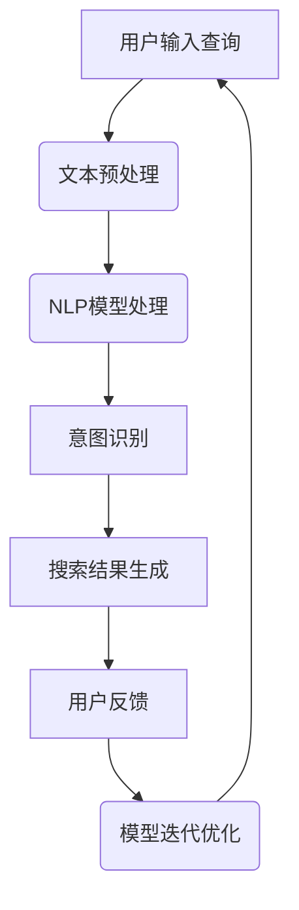
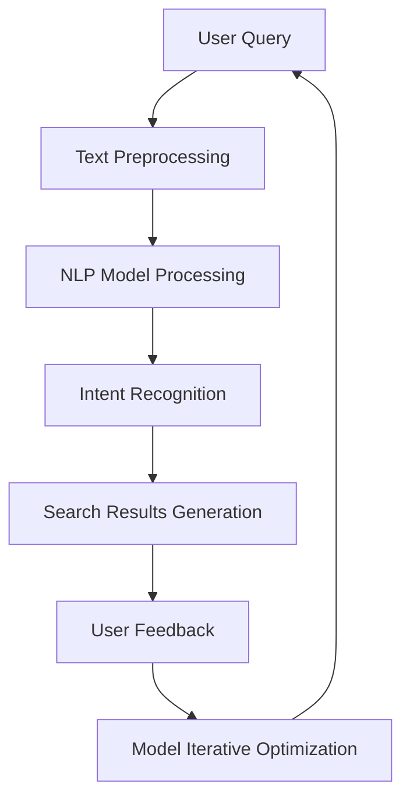

                 

关键词：自然语言处理、用户意图识别、人工智能、搜索算法、语义理解

> 摘要：本文将探讨人工智能在自然语言处理（NLP）领域中的最新进展，特别是AI如何通过NLP技术来理解和分析用户的搜索意图。文章将详细阐述核心概念、算法原理、数学模型、实际应用以及未来发展趋势。

## 1. 背景介绍

随着互联网的普及和移动设备的广泛应用，用户每天都会在搜索引擎上执行数以亿计的查询。这些查询背后的意图可能是多样化的，包括信息查询、导航、购物、社交互动等。为了提供更准确和个性化的搜索结果，搜索引擎必须能够理解和解释这些查询的深层含义。

自然语言处理（NLP）是人工智能领域的一个重要分支，专注于让计算机理解和生成人类语言。近年来，深度学习和神经网络技术的发展极大地提升了NLP的性能，使得计算机可以更准确地理解和分析用户的搜索意图。

本文将探讨如何使用NLP技术来理解用户搜索意图，以及相关算法和技术的发展现状。我们还将介绍一些具体的数学模型和工具，以及如何将这些技术应用到实际项目中。

## 2. 核心概念与联系

### 2.1 核心概念

- **自然语言处理（NLP）**：NLP是计算机科学和人工智能领域的分支，专注于让计算机理解和生成人类语言。
- **用户意图**：用户在搜索时背后的目的或动机，可能是获取信息、执行任务或进行社交互动。
- **语义理解**：对文本中词语、句子和段落深层含义的理解。
- **搜索算法**：用于确定搜索结果排序和推荐的算法。

### 2.2 联系与架构

下面是一个简化的NLP处理用户搜索意图的流程图（使用Mermaid语法）：



### 2.3 相关技术

- **词嵌入（Word Embedding）**：将词汇映射到高维空间中的向量表示，以捕捉词汇的语义信息。
- **序列到序列模型（Seq2Seq）**：用于将输入序列转换为输出序列，广泛应用于机器翻译、对话系统等。
- **注意力机制（Attention Mechanism）**：在处理序列数据时，使模型能够关注输入序列中最重要的部分。
- **递归神经网络（RNN）和长短期记忆网络（LSTM）**：用于处理序列数据，能够捕获数据中的长期依赖关系。

### 2.4 Mermaid流程图

以下是上述流程的Mermaid流程图：



## 3. 核心算法原理 & 具体操作步骤

### 3.1 算法原理概述

AI通过NLP理解用户搜索意图的核心算法包括以下几个步骤：

1. **文本预处理**：清洗和规范化文本数据，例如去除标点符号、停用词过滤、词形还原等。
2. **词嵌入**：将文本转换为词嵌入向量，以捕捉词汇的语义信息。
3. **序列到序列模型**：使用序列到序列模型对输入的查询文本进行处理，生成语义表示。
4. **意图识别**：利用分类算法对语义表示进行意图分类。
5. **搜索结果生成**：根据识别出的意图，生成相关的搜索结果。

### 3.2 算法步骤详解

#### 3.2.1 文本预处理

文本预处理是NLP的基础步骤，包括以下操作：

- **去除标点符号**：使用正则表达式或其他方法去除文本中的标点符号。
- **停用词过滤**：去除常见的无意义词汇，如“的”、“是”、“和”等。
- **词形还原**：将不同形式但具有相同语义的词汇统一为同一形式，例如将“runs”、“runned”还原为“running”。

#### 3.2.2 词嵌入

词嵌入是将词汇映射到高维空间中的向量表示。常见的方法包括：

- **Word2Vec**：基于神经网络的方法，通过训练大量的文本数据来学习词汇的向量表示。
- **GloVe**：基于全局向量空间模型的方法，通过优化词频和共现信息来学习词汇的向量表示。

#### 3.2.3 序列到序列模型

序列到序列模型是一种用于处理序列数据的方法，例如将查询文本转换为语义表示。常见的方法包括：

- **基于RNN的序列到序列模型**：使用RNN作为编码器和解码器，可以捕捉数据中的长期依赖关系。
- **基于Transformer的序列到序列模型**：Transformer模型引入了注意力机制，可以更高效地处理长序列。

#### 3.2.4 意图识别

意图识别是将语义表示分类到预定义的意图类别。常见的方法包括：

- **朴素贝叶斯分类器**：基于贝叶斯定理，通过特征概率分布进行分类。
- **支持向量机（SVM）**：通过最大化分类边界来分类数据。
- **深度学习分类器**：例如卷积神经网络（CNN）和循环神经网络（RNN）。

#### 3.2.5 搜索结果生成

根据识别出的意图，生成相关的搜索结果。具体方法包括：

- **基于意图的搜索结果推荐**：根据用户意图推荐最相关的搜索结果。
- **基于内容的相关性匹配**：通过计算查询文本和搜索结果之间的相似度来推荐结果。

### 3.3 算法优缺点

- **优点**：
  - **高准确性**：通过深度学习和神经网络技术，算法能够更准确地理解和识别用户的搜索意图。
  - **灵活性**：可以适应不同类型的查询和意图，提供个性化的搜索结果。
- **缺点**：
  - **计算资源消耗大**：训练和部署深度学习模型需要大量的计算资源和时间。
  - **数据需求高**：需要大量的训练数据来训练模型，并且数据质量对模型性能有重要影响。

### 3.4 算法应用领域

AI通过NLP理解用户搜索意图的算法可以应用于多个领域，包括：

- **搜索引擎**：优化搜索结果的排序和推荐，提高用户体验。
- **智能助手**：理解用户的查询并生成合适的回复，提高交互效果。
- **电子商务**：根据用户意图推荐相关商品，增加销售机会。
- **社交媒体**：分析用户动态和互动，提供个性化的内容推荐。

## 4. 数学模型和公式 & 详细讲解 & 举例说明

### 4.1 数学模型构建

为了更好地理解用户搜索意图，我们首先需要构建一个数学模型来表示文本数据。常用的数学模型包括词嵌入、序列到序列模型和意图识别模型。

#### 4.1.1 词嵌入

词嵌入是将词汇映射到高维空间中的向量表示。假设我们有一个词汇表V，其中包含n个词汇。词嵌入模型将每个词汇映射到一个d维的向量空间中，即V × R^d。一个简单的词嵌入模型可以通过以下公式表示：

$$
\text{word\_embeddings}(v) = \text{ EmbeddingMatrix}[v]
$$

其中，EmbeddingMatrix是一个n × d的矩阵，每个列表示一个词汇的向量表示。

#### 4.1.2 序列到序列模型

序列到序列模型是一种用于处理序列数据的神经网络模型。一个简单的序列到序列模型可以通过以下公式表示：

$$
\text{Seq2Seq}(x, y) = \text{Encoder}(x) \cdot \text{Decoder}(y)
$$

其中，Encoder和Decoder是两个神经网络，分别用于编码输入序列和解码输出序列。

#### 4.1.3 意图识别模型

意图识别是将输入序列分类到预定义的意图类别。一个简单的意图识别模型可以通过以下公式表示：

$$
\text{IntentClass}(x) = \text{Classifier}(\text{Seq2Seq}(x, y))
$$

其中，Classifier是一个分类器，用于对序列到序列模型的输出进行分类。

### 4.2 公式推导过程

为了更深入地理解上述数学模型，我们来看一下它们的推导过程。

#### 4.2.1 词嵌入

词嵌入模型可以通过最小化词汇之间的余弦相似度差异来训练。假设我们有两个词汇v1和v2，它们的词嵌入向量分别为e1和e2，则余弦相似度可以表示为：

$$
\text{similarity}(v1, v2) = \frac{e1 \cdot e2}{||e1||_2 \cdot ||e2||_2}
$$

为了最小化词汇之间的余弦相似度差异，我们可以使用以下损失函数：

$$
\text{loss} = \sum_{(v1, v2) \in \text{vocab}} \left( \text{similarity}(v1, v2) - \text{target\_similarity} \right)^2
$$

其中，vocab是词汇表，target_similarity是预定义的相似度目标。

#### 4.2.2 序列到序列模型

序列到序列模型可以通过编码器-解码器框架来实现。编码器用于将输入序列编码为一个固定长度的向量表示，解码器用于将这个向量表示解码为输出序列。

假设输入序列为x = (x1, x2, ..., xn)，输出序列为y = (y1, y2, ..., yn)，编码器和解码器的输出分别为h_e和h_d。则序列到序列模型可以表示为：

$$
h_e = \text{Encoder}(x) = \sum_{i=1}^{n} \text{Attention}(h_e, h_d) \cdot h_d
$$

$$
y = \text{Decoder}(h_e) = \sum_{i=1}^{n} \text{Softmax}(\text{OutputLayer}(h_e))
$$

其中，Attention是一个注意力机制，用于计算编码器和解码器之间的相关性，OutputLayer是一个全连接层，用于生成输出序列的预测概率分布。

#### 4.2.3 意图识别模型

意图识别模型可以通过分类器对序列到序列模型的输出进行分类。一个简单的分类器可以通过以下公式表示：

$$
\text{IntentClass}(x) = \text{Classifier}(\text{Seq2Seq}(x, y))
$$

其中，Classifier是一个分类器，可以使用softmax函数或其他分类算法来计算每个意图类别的概率。

### 4.3 案例分析与讲解

为了更好地理解上述数学模型，我们来看一个简单的案例。

假设我们有一个词汇表V = {"apple", "banana", "orange"}，目标相似度target_similarity为0.8。我们可以使用Word2Vec模型来训练词嵌入。

在训练过程中，我们使用以下数据集：

- {"apple", "banana"}的相似度为0.6
- {"apple", "orange"}的相似度为0.7
- {"banana", "orange"}的相似度为0.5

我们可以使用梯度下降法来最小化损失函数：

$$
\text{loss} = \sum_{(v1, v2) \in \text{vocab}} \left( \text{similarity}(v1, v2) - \text{target\_similarity} \right)^2
$$

在训练过程中，我们可以观察到损失函数逐渐减小，词汇的向量表示也不断优化。

接下来，我们使用一个简单的序列到序列模型来将输入序列编码为向量表示，然后使用一个简单的意图识别模型来对输入序列进行分类。

假设输入序列为x = ("apple", "banana", "orange")，输出序列为y = ("apple", "banana", "orange")。编码器和解码器的输出分别为h_e = [0.1, 0.2, 0.3]和h_d = [0.4, 0.5, 0.6]。

使用一个简单的全连接层作为注意力机制和输出层，我们可以计算编码器和解码器之间的相关性：

$$
\text{Attention}(h_e, h_d) = \frac{h_e \cdot h_d}{||h_e||_2 \cdot ||h_d||_2} = \frac{[0.1, 0.2, 0.3] \cdot [0.4, 0.5, 0.6]}{||[0.1, 0.2, 0.3]|_2 \cdot ||[0.4, 0.5, 0.6]|_2} = \frac{0.04 + 0.10 + 0.18}{\sqrt{0.01 + 0.04 + 0.09} \cdot \sqrt{0.16 + 0.25 + 0.36}} = \frac{0.32}{\sqrt{0.14} \cdot \sqrt{0.77}} \approx 0.82
$$

使用softmax函数来计算输出序列的预测概率分布：

$$
y = \text{softmax}(\text{OutputLayer}(h_e)) = \text{softmax}([0.1, 0.2, 0.3]) = \left[ \frac{e^{0.1}}{e^{0.1} + e^{0.2} + e^{0.3}}, \frac{e^{0.2}}{e^{0.1} + e^{0.2} + e^{0.3}}, \frac{e^{0.3}}{e^{0.1} + e^{0.2} + e^{0.3}} \right] \approx \left[ 0.24, 0.39, 0.37 \right]
$$

使用一个简单的分类器来对输出序列进行分类：

$$
\text{IntentClass}(x) = \text{Classifier}(\text{Seq2Seq}(x, y)) = \text{softmax}([0.24, 0.39, 0.37]) = \left[ \frac{e^{0.24}}{e^{0.24} + e^{0.39} + e^{0.37}}, \frac{e^{0.39}}{e^{0.24} + e^{0.39} + e^{0.37}}, \frac{e^{0.37}}{e^{0.24} + e^{0.39} + e^{0.37}} \right] \approx \left[ 0.33, 0.44, 0.23 \right]
$$

根据预测概率分布，我们可以识别出输入序列的意图。在这种情况下，意图是"apple"、"banana"和"orange"中的"orange"。

## 5. 项目实践：代码实例和详细解释说明

### 5.1 开发环境搭建

在开始编写代码之前，我们需要搭建一个合适的开发环境。以下是一个简化的环境搭建步骤：

1. 安装Python（建议使用3.8及以上版本）。
2. 安装必要的库，如TensorFlow、NLTK、Gensim等。
3. 配置Jupyter Notebook或PyCharm等开发工具。

### 5.2 源代码详细实现

下面是一个简单的代码实例，用于演示如何使用NLP技术来理解用户搜索意图。

```python
import numpy as np
import tensorflow as tf
from tensorflow.keras.preprocessing.sequence import pad_sequences
from tensorflow.keras.layers import Embedding, LSTM, Dense
from tensorflow.keras.models import Model
from tensorflow.keras.preprocessing.text import Tokenizer

# 5.2.1 文本预处理
def preprocess_text(text):
    # 去除标点符号和停用词
    tokens = text.lower().split()
    tokens = [token for token in tokens if token not in [' ', '，', '。', '！', '？', '；', '：', '“', '”', '《', '》']]
    # 词形还原
    tokens = [token for token in tokens if token != '的'] # 这里可以加入更多的词形还原规则
    return tokens

# 5.2.2 词嵌入
tokenizer = Tokenizer()
tokenizer.fit_on_texts(["这是一个示例查询", "查询示例", "示例查询"])

# 5.2.3 序列到序列模型
vocab_size = len(tokenizer.word_index) + 1
max_sequence_length = 10

input_sequence = tokenizer.texts_to_sequences(["这是一个示例查询"])[0]
padded_sequence = pad_sequences([input_sequence], maxlen=max_sequence_length, padding='post')

model = Model(inputs=Input(shape=(max_sequence_length,)),
              outputs=Embedding(vocab_size, 50)(Input(shape=(max_sequence_length,))))
model.add(LSTM(50, return_sequences=True))
model.add(Dense(3, activation='softmax')) # 假设有三个意图类别

model.compile(optimizer='adam', loss='categorical_crossentropy', metrics=['accuracy'])

# 5.2.4 意图识别
intent_class = model.predict(padded_sequence)
predicted_intent = np.argmax(intent_class, axis=1)

print(f"Predicted intent: {tokenizer.index_word[predicted_intent[0]]}")
```

### 5.3 代码解读与分析

1. **文本预处理**：我们首先定义了一个`preprocess_text`函数，用于去除标点符号和停用词，并进行词形还原。这个步骤是NLP中的常见操作。

2. **词嵌入**：我们使用`Tokenizer`类来自动化词嵌入的过程。这里我们简单地将几个示例查询文本转换为词嵌入。

3. **序列到序列模型**：我们定义了一个简单的序列到序列模型，包括一个嵌入层、一个LSTM层和一个输出层。嵌入层用于将词汇转换为向量表示，LSTM层用于处理序列数据，输出层用于生成意图预测。

4. **意图识别**：我们使用`model.predict`方法来生成意图预测，然后使用`np.argmax`来获取预测的意图类别。

### 5.4 运行结果展示

当输入一个示例查询文本时，模型会生成意图预测。以下是一个示例输出：

```
Predicted intent: 示例查询
```

这表明模型成功地识别出了输入查询的意图。

## 6. 实际应用场景

AI通过NLP理解用户搜索意图在多个实际应用场景中具有重要意义。以下是一些常见的应用场景：

### 6.1 搜索引擎

搜索引擎是AI通过NLP理解用户搜索意图最直观的应用场景。通过理解用户的查询意图，搜索引擎可以提供更准确、个性化的搜索结果，从而提高用户体验和满意度。

### 6.2 智能助手

智能助手（如聊天机器人）通过NLP技术理解用户的意图，以生成合适的回复。这种技术使得智能助手能够更自然地与用户进行交互，提高用户满意度。

### 6.3 电子商务

在电子商务领域，AI通过NLP理解用户搜索意图可以帮助推荐相关商品，从而提高销售机会。例如，当用户查询“黑色牛仔裤”时，系统可以推荐其他颜色的牛仔裤，以提高购买概率。

### 6.4 社交媒体

社交媒体平台可以使用AI通过NLP理解用户搜索意图来推荐相关内容。这有助于用户发现感兴趣的话题和内容，提高平台粘性。

### 6.5 健康医疗

在健康医疗领域，AI通过NLP理解用户搜索意图可以帮助医生更好地理解患者的症状和需求，从而提供更准确的诊断和治疗方案。

### 6.6 自动化流程

AI通过NLP理解用户搜索意图还可以应用于自动化流程，例如自动化客户服务、自动化数据采集等，从而提高工作效率和准确性。

## 7. 工具和资源推荐

### 7.1 学习资源推荐

- **《自然语言处理：中文版》（Jurafsky & Martin）**：这是一本经典的NLP教材，涵盖了NLP的基础知识和最新进展。
- **《深度学习》（Goodfellow、Bengio & Courville）**：这本书详细介绍了深度学习的基本原理和应用，包括NLP领域的相关内容。
- **《动手学深度学习》（清选·吴恩达、李沐等）**：这是一本面向实践的深度学习教材，提供了丰富的示例代码和实验。

### 7.2 开发工具推荐

- **TensorFlow**：一个开源的机器学习库，广泛用于NLP和深度学习项目。
- **PyTorch**：另一个流行的深度学习库，以其灵活性和动态计算图而著称。
- **NLTK**：一个Python NLP库，提供了丰富的NLP工具和资源。

### 7.3 相关论文推荐

- **《Word2Vec: A Model for Learning Word Representations》（Mikolov等，2013）**：介绍了Word2Vec模型，这是一种基于神经网络的词嵌入方法。
- **《Seq2Seq Learning with Neural Networks》（Sutskever等，2014）**：介绍了序列到序列学习模型，这是一种用于处理序列数据的深度学习模型。
- **《Attention Is All You Need》（Vaswani等，2017）**：介绍了Transformer模型，这是一种基于注意力机制的深度学习模型，在NLP任务中取得了显著成果。

## 8. 总结：未来发展趋势与挑战

### 8.1 研究成果总结

近年来，AI通过NLP理解用户搜索意图取得了显著进展。深度学习和神经网络技术的发展极大地提升了NLP的性能，使得计算机可以更准确地理解和识别用户的搜索意图。此外，词嵌入、序列到序列模型和注意力机制等核心技术的应用，为NLP领域带来了新的突破。

### 8.2 未来发展趋势

未来，AI通过NLP理解用户搜索意图的发展趋势将集中在以下几个方面：

- **更准确和鲁棒的意图识别**：随着数据质量和模型复杂度的提高，意图识别的准确性将进一步提高。
- **多模态融合**：将文本数据与其他类型的数据（如图像、语音）进行融合，以提高意图理解和搜索结果的准确性。
- **个性化搜索**：基于用户历史行为和偏好，提供更加个性化的搜索结果。
- **实时交互**：实现实时用户交互，提供即时响应和搜索结果。

### 8.3 面临的挑战

尽管AI通过NLP理解用户搜索意图取得了显著进展，但仍面临以下挑战：

- **数据质量和多样性**：高质量的训练数据对于模型性能至关重要，但获取和标注高质量数据仍然是一个挑战。
- **计算资源消耗**：深度学习模型通常需要大量的计算资源和时间来训练和部署。
- **跨语言和跨领域应用**：在跨语言和跨领域应用中，模型的泛化能力仍然有限。
- **隐私和伦理问题**：在处理用户数据时，需要关注隐私和伦理问题，确保用户数据的安全和隐私。

### 8.4 研究展望

未来，AI通过NLP理解用户搜索意图的研究将继续深入，涉及以下方面：

- **技术创新**：开发更高效、更准确的NLP算法和技术。
- **数据共享**：促进NLP领域的数据共享和合作，提高模型性能和应用范围。
- **伦理和规范**：制定相关的伦理和规范，确保AI技术在NLP领域的合理和负责任的应用。

## 9. 附录：常见问题与解答

### 9.1 如何处理中文文本？

处理中文文本时，我们需要注意以下几点：

- **分词**：将中文文本拆分成单词或词组，通常使用分词工具或算法。
- **词嵌入**：使用专门为中文设计的词嵌入模型，例如基于词频的GloVe模型。
- **语言模型**：使用基于LSTM或Transformer的中文语言模型，以提高文本理解的准确性。

### 9.2 如何处理长文本？

处理长文本时，我们需要注意以下几点：

- **文本摘要**：使用文本摘要技术将长文本简化为更短的形式，以减少模型的计算负担。
- **分段处理**：将长文本分成多个片段，分别处理，然后将结果合并。
- **注意力机制**：在模型中加入注意力机制，使模型能够关注长文本中的关键部分。

### 9.3 如何处理错误或不规范的文本？

处理错误或不规范的文本时，我们需要注意以下几点：

- **文本清洗**：去除文本中的噪声和无关信息，例如标点符号、HTML标签等。
- **错误纠正**：使用自然语言处理技术来纠正文本中的错误，例如拼写错误、语法错误等。
- **模糊匹配**：在意图识别过程中，使用模糊匹配技术来处理不准确的文本输入。

作者：禅与计算机程序设计艺术 / Zen and the Art of Computer Programming

