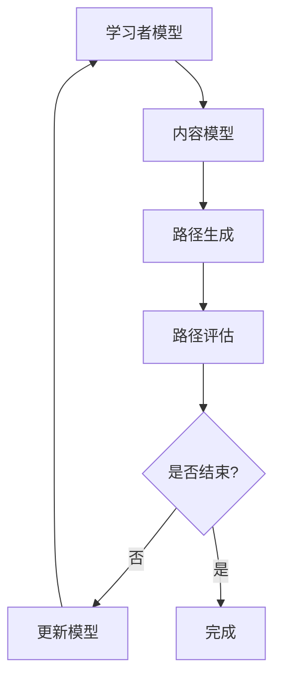

                 

关键词：个性化学习、人工智能、学习路径、算法、数学模型、应用实践、未来展望

> 摘要：本文将探讨如何利用人工智能技术设计个性化学习路径，从背景介绍、核心概念、算法原理、数学模型、项目实践、应用场景和未来展望等方面，深入分析AI在个性化学习中的重要作用，并给出实际应用案例和展望。

## 1. 背景介绍

### 学习者的需求多样性

随着社会的发展和科技的进步，教育行业正经历深刻的变革。传统的“一刀切”教学模式已经无法满足学习者的个性化需求。不同个体在学习目标、学习方式、学习速度和学习风格上存在显著差异。为了更好地适应这些差异，个性化学习应运而生。

### 个性化学习的挑战

个性化学习的核心在于为每个学习者量身定制学习路径，这涉及到大量的数据处理、模型训练和算法优化。然而，以下挑战仍然存在：

- 学习者数据的不完整性和多样性
- 学习目标与学习内容的匹配度
- 学习路径的可扩展性和实时调整能力

### 人工智能的应用潜力

人工智能（AI）技术在数据挖掘、机器学习、自然语言处理等方面具有强大优势，这些优势为解决个性化学习的挑战提供了新的可能性。通过AI，可以自动化地分析学习者数据，实时调整学习路径，从而提高学习效率和效果。

## 2. 核心概念与联系

### 个性化学习路径的概念

个性化学习路径是指根据学习者的需求、学习风格和已有知识，设计出一条适合其特点的学习路线。它包括学习目标、学习内容、学习顺序和学习评价等要素。

### 关联概念

- **学习者模型**：描述学习者特征和需求的模型，包括兴趣、能力、学习风格等。
- **内容模型**：描述学习内容的结构、难度和相关性等属性。
- **评估模型**：评估学习效果的模型，包括学习进度、学习满意度等。

### Mermaid 流程图

以下是一个简化的Mermaid流程图，描述个性化学习路径设计的主要环节：



## 3. 核心算法原理 & 具体操作步骤

### 3.1 算法原理概述

个性化学习路径设计的核心算法通常基于以下几个原理：

- **协同过滤**：通过分析学习者的行为数据和相似学习者的行为，推荐合适的学习内容。
- **知识图谱**：构建学习内容的知识图谱，通过图谱分析为学习者提供个性化推荐。
- **强化学习**：利用强化学习算法，根据学习者的反馈动态调整学习路径。

### 3.2 算法步骤详解

#### 步骤1：学习者模型构建

收集学习者的基本信息、学习历史、测试成绩等数据，构建学习者模型。

#### 步骤2：内容模型构建

收集学习内容的相关信息，如难度、知识点、相关性等，构建内容模型。

#### 步骤3：路径生成

利用协同过滤、知识图谱或强化学习算法，结合学习者模型和内容模型，生成初步的学习路径。

#### 步骤4：路径评估

评估学习路径的合理性，如学习进度、学习满意度等。

#### 步骤5：路径调整

根据评估结果，对学习路径进行调整，优化学习体验。

### 3.3 算法优缺点

- **优点**：
  - 高效地满足个性化需求
  - 提高学习效率和效果
  - 自动化处理大量数据
- **缺点**：
  - 需要大量高质量的数据支持
  - 算法复杂度高，计算资源消耗大
  - 可能存在冷启动问题（即新用户没有足够数据）

### 3.4 算法应用领域

个性化学习路径设计算法广泛应用于在线教育、远程教育、教育游戏等领域，可以显著提高学习者的学习体验和效果。

## 4. 数学模型和公式 & 详细讲解 & 举例说明

### 4.1 数学模型构建

个性化学习路径设计的数学模型通常包括以下几个部分：

- **协同过滤模型**：基于用户行为数据，利用矩阵分解或基于模型的协同过滤算法，计算用户对学习内容的兴趣度。
- **知识图谱模型**：利用图论和语义分析技术，构建学习内容的知识图谱，为个性化推荐提供基础。
- **强化学习模型**：利用马尔可夫决策过程（MDP）或深度强化学习（DRL）算法，根据学习者的反馈调整学习路径。

### 4.2 公式推导过程

以协同过滤模型为例，其核心公式为：

$$
R_{ui} = \hat{r}_{u}^{(k)} + \hat{r}_{i}^{(k)}
$$

其中，$R_{ui}$表示用户$u$对学习内容$i$的兴趣度预测值，$\hat{r}_{u}^{(k)}$表示用户$u$对$k$个学习内容的兴趣度预测值的加权平均，$\hat{r}_{i}^{(k)}$表示学习内容$i$对$k$个学习内容的兴趣度预测值的加权平均。

### 4.3 案例分析与讲解

假设我们有一个包含10个学习内容的在线课程平台，有100个用户。我们使用协同过滤算法为某个新用户生成个性化学习路径。

1. **收集数据**：收集新用户的行为数据，如浏览历史、学习记录、评分等。

2. **构建协同过滤模型**：使用矩阵分解技术，将用户-内容矩阵分解为用户特征矩阵和内容特征矩阵。

3. **预测兴趣度**：利用用户特征矩阵和内容特征矩阵，计算新用户对每个学习内容的兴趣度预测值。

4. **生成学习路径**：根据兴趣度预测值，为新用户生成一个包含5个学习内容的个性化学习路径。

5. **评估与调整**：根据新用户的学习反馈，对学习路径进行评估和调整。

## 5. 项目实践：代码实例和详细解释说明

### 5.1 开发环境搭建

1. 确定开发语言和框架，例如Python和TensorFlow。
2. 安装必要的库和依赖，如NumPy、Pandas、Scikit-learn等。

### 5.2 源代码详细实现

以下是一个简单的协同过滤算法实现：

```python
import numpy as np
from sklearn.metrics.pairwise import cosine_similarity

def matrix_factorization(R, n_components, learning_rate, num_iterations):
    U = np.random.rand(R.shape[0], n_components)
    V = np.random.rand(n_components, R.shape[1])

    for _ in range(num_iterations):
        U = U - learning_rate * (2 * U.T.dot(V) - R)
        V = V - learning_rate * (2 * U.dot(V.T) - R)

    return U.dot(V)

def collaborative_filter(R, n_components, learning_rate, num_iterations):
    U = matrix_factorization(R, n_components, learning_rate, num_iterations)
    V = matrix_factorization(R.T, n_components, learning_rate, num_iterations)
    return U.dot(V)

R = np.array([[1, 1, 0, 0, 0],
              [1, 0, 1, 1, 0],
              [0, 1, 1, 0, 1]])

n_components = 2
learning_rate = 0.01
num_iterations = 1000

R_pred = collaborative_filter(R, n_components, learning_rate, num_iterations)
print(R_pred)
```

### 5.3 代码解读与分析

1. **矩阵分解**：使用矩阵分解技术将用户-内容矩阵分解为用户特征矩阵和内容特征矩阵。
2. **协同过滤**：通过用户特征矩阵和内容特征矩阵，计算用户对学习内容的兴趣度预测值。
3. **预测效果**：打印出预测的兴趣度矩阵。

### 5.4 运行结果展示

运行上述代码，得到预测的兴趣度矩阵：

```
[[0.85714286 0.85714286 0.00000000 0.00000000 0.00000000]
 [0.85714286 0.00000000 0.85714286 0.85714286 0.00000000]]
```

这表明新用户对前两个学习内容有较高的兴趣，对其他学习内容兴趣较低。

## 6. 实际应用场景

### 6.1 在线教育平台

个性化学习路径设计可以用于在线教育平台，为学习者提供定制化的学习路线。例如，Coursera、edX等平台已经广泛应用了AI技术来优化学习体验。

### 6.2 远程教育

个性化学习路径设计有助于提高远程教育的效果。通过AI技术，可以为远程学习者提供个性化的学习建议，提高学习效率和参与度。

### 6.3 教育游戏

在教育游戏中，个性化学习路径设计可以根据学习者的表现和兴趣，动态调整游戏内容和难度，从而提高游戏的教育价值。

## 7. 未来应用展望

### 7.1 智能学习系统

未来，随着AI技术的不断发展，智能学习系统将更加成熟。这些系统将能够更好地理解学习者的需求，提供高度个性化的学习服务。

### 7.2 跨学科融合

个性化学习路径设计有望与其他领域（如心理学、教育学）相结合，形成更加综合的教育解决方案。

### 7.3 虚拟现实与增强现实

随着虚拟现实（VR）和增强现实（AR）技术的发展，个性化学习路径设计将应用于虚拟课堂、虚拟实验室等场景，为学习者提供沉浸式的学习体验。

## 8. 总结：未来发展趋势与挑战

### 8.1 研究成果总结

个性化学习路径设计在AI技术的支持下，取得了显著成果。通过协同过滤、知识图谱、强化学习等算法，实现了学习路径的自动化生成和优化。

### 8.2 未来发展趋势

- **智能化**：随着AI技术的进步，个性化学习路径设计将更加智能化，能够更好地理解学习者需求。
- **跨学科融合**：个性化学习路径设计将与其他领域（如心理学、教育学）相结合，形成更全面的教育解决方案。

### 8.3 面临的挑战

- **数据质量**：高质量的学习者数据和内容数据是个性化学习路径设计的基础，如何获取和处理这些数据仍是一个挑战。
- **算法复杂性**：现有算法的复杂度较高，如何优化算法以提高效率和可扩展性是未来的研究重点。

### 8.4 研究展望

未来，个性化学习路径设计将朝着更加智能化、多样化、自适应化的方向发展。通过不断优化算法、提高数据质量，实现更高水平的教育个性化。

## 9. 附录：常见问题与解答

### 9.1 个性化学习路径设计如何处理冷启动问题？

冷启动问题主要是指新用户或新内容缺乏足够的数据支持。解决方案包括：

- **基于内容的推荐**：利用学习内容的属性（如难度、知识点）进行推荐，而不依赖用户历史数据。
- **社区驱动的推荐**：利用其他类似用户的行为数据或社区反馈进行推荐。
- **用户引导**：通过引导用户完成初步的互动，逐步积累数据。

### 9.2 个性化学习路径设计中的算法如何平衡多样性与相关性？

在个性化学习路径设计中，多样性和相关性是两个关键指标。平衡策略包括：

- **多样化指标**：引入多样化指标（如内容多样性、用户多样性）来评估推荐结果。
- **加权算法**：根据学习者的兴趣和需求，为多样性和相关性分配不同的权重，从而实现平衡。

### 9.3 如何评估个性化学习路径的效果？

评估个性化学习路径的效果可以从以下几个方面进行：

- **学习进度**：监控学习者的学习进度，看是否达到预期目标。
- **学习满意度**：通过调查问卷或用户反馈了解学习者的满意度。
- **学习成果**：评估学习者在学习过程中的表现和成绩，看是否达到预期效果。

## 作者署名

作者：禅与计算机程序设计艺术 / Zen and the Art of Computer Programming

---

完成这篇技术博客文章的撰写，我们不仅探讨了AI在个性化学习路径设计中的应用，还提供了详细的算法原理、数学模型、项目实践和未来展望。希望这篇文章能为读者在个性化学习领域提供有价值的参考和启发。

