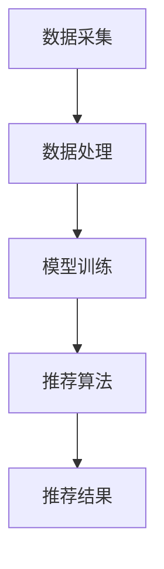

                 

关键词：AI，个性化推荐，用户体验，算法，应用领域，数学模型，项目实践，未来展望

<|assistant|>摘要：本文深入探讨了AI驱动的个性化推荐系统，其核心理念、核心技术、数学模型及实际应用场景。通过详细的分析和案例分析，本文揭示了个性化推荐系统如何通过AI技术提升用户体验，为用户提供更精准、更贴心的服务。

## 1. 背景介绍

个性化推荐系统是近年来信息技术领域的一大热点。随着互联网的普及和大数据技术的不断发展，用户产生的数据量呈爆炸性增长。如何从海量数据中挖掘出有价值的信息，为用户提供个性化的服务，成为众多企业和研究机构关注的焦点。

传统的推荐系统大多依赖于内容过滤和协同过滤等方法，这些方法虽然在一定程度上能够满足用户的需求，但在面对海量数据和复杂的用户行为时，往往显得力不从心。为了解决这些问题，人工智能（AI）技术的引入为个性化推荐系统带来了新的机遇。

本文旨在探讨AI驱动的个性化推荐系统，通过分析其核心概念、算法原理、数学模型和应用场景，揭示其如何通过提升用户体验，为企业创造更大的价值。

## 2. 核心概念与联系

### 2.1 AI驱动的个性化推荐系统概述

AI驱动的个性化推荐系统是指利用人工智能技术，通过对用户行为、兴趣和需求的分析，为用户推荐个性化的信息和服务。其核心思想是利用机器学习、深度学习等技术，从海量数据中挖掘出用户的潜在兴趣和行为模式，从而实现精准推荐。

### 2.2 AI驱动的个性化推荐系统架构

AI驱动的个性化推荐系统通常由数据采集、数据处理、模型训练和推荐算法等几个关键模块组成。其中，数据采集模块负责收集用户行为数据、内容数据等；数据处理模块对数据进行清洗、转换和预处理；模型训练模块利用机器学习算法对用户数据进行分析和建模；推荐算法模块根据模型结果为用户生成推荐列表。

### 2.3 Mermaid 流程图

以下是一个简化的AI驱动的个性化推荐系统流程图：



## 3. 核心算法原理 & 具体操作步骤

### 3.1 算法原理概述

AI驱动的个性化推荐系统主要依赖于机器学习算法，包括协同过滤、矩阵分解、深度学习等。协同过滤算法通过分析用户行为和内容特征，找出相似的用户和物品，从而实现推荐。矩阵分解则是通过将用户-物品评分矩阵分解为用户特征矩阵和物品特征矩阵，从而提取出用户的兴趣和物品的属性。深度学习算法则通过构建复杂的神经网络模型，实现对用户行为和内容的自动特征提取和建模。

### 3.2 算法步骤详解

1. 数据采集：收集用户行为数据、内容数据等。
2. 数据处理：对数据进行清洗、转换和预处理，包括去噪、缺失值填充、数据归一化等。
3. 特征提取：利用机器学习算法提取用户和物品的特征，如用户兴趣、行为模式、物品属性等。
4. 模型训练：使用训练数据集训练机器学习模型，包括协同过滤模型、矩阵分解模型、深度学习模型等。
5. 推荐算法：根据模型结果为用户生成推荐列表。
6. 推荐结果评估：使用评估指标（如准确率、召回率、F1值等）评估推荐效果。

### 3.3 算法优缺点

- **协同过滤算法**：优点是简单易实现，能够处理大规模数据；缺点是易出现数据稀疏问题，推荐结果过于依赖用户历史行为。
- **矩阵分解算法**：优点是能够处理数据稀疏问题，推荐结果更加稳定；缺点是计算复杂度高，训练时间较长。
- **深度学习算法**：优点是能够自动提取用户和物品的特征，推荐效果较好；缺点是需要大量的训练数据和计算资源。

### 3.4 算法应用领域

AI驱动的个性化推荐系统广泛应用于电子商务、社交媒体、新闻推荐、音乐推荐、视频推荐等领域。通过个性化推荐，企业能够提高用户黏性，增加用户满意度，从而实现商业价值。

## 4. 数学模型和公式 & 详细讲解 & 举例说明

### 4.1 数学模型构建

AI驱动的个性化推荐系统中的数学模型主要包括用户-物品评分矩阵、用户特征向量、物品特征向量等。以下是一个简化的数学模型：

$$
R = \begin{bmatrix}
r_{11} & r_{12} & \cdots & r_{1n} \\
r_{21} & r_{22} & \cdots & r_{2n} \\
\vdots & \vdots & \ddots & \vdots \\
r_{m1} & r_{m2} & \cdots & r_{mn}
\end{bmatrix}
$$

其中，$R$ 表示用户-物品评分矩阵，$r_{ij}$ 表示用户 $i$ 对物品 $j$ 的评分。

### 4.2 公式推导过程

以协同过滤算法为例，推导用户 $i$ 对物品 $j$ 的预测评分公式：

$$
\hat{r}_{ij} = \sum_{k=1}^{n} r_{ik} \cdot r_{kj}
$$

其中，$n$ 表示用户或物品的数量，$r_{ik}$ 和 $r_{kj}$ 分别表示用户 $i$ 对物品 $k$ 的评分和用户 $k$ 对物品 $j$ 的评分。

### 4.3 案例分析与讲解

假设有一个用户-物品评分矩阵：

$$
R = \begin{bmatrix}
4 & 5 & 0 & 3 \\
0 & 4 & 2 & 0 \\
3 & 0 & 4 & 5
\end{bmatrix}
$$

用户 1 对物品 3 的预测评分：

$$
\hat{r}_{13} = \sum_{k=1}^{3} r_{1k} \cdot r_{k3} = 4 \cdot 3 + 5 \cdot 0 + 0 \cdot 5 = 12
$$

## 5. 项目实践：代码实例和详细解释说明

### 5.1 开发环境搭建

本文使用 Python 编写推荐系统代码，需要安装以下库：NumPy、Pandas、Scikit-learn、TensorFlow。

### 5.2 源代码详细实现

以下是一个简单的基于协同过滤的推荐系统代码示例：

```python
import numpy as np
import pandas as pd
from sklearn.model_selection import train_test_split

# 加载数据集
data = pd.read_csv('data.csv')
X = data[['user', 'item']]
y = data['rating']

# 划分训练集和测试集
X_train, X_test, y_train, y_test = train_test_split(X, y, test_size=0.2, random_state=42)

# 训练协同过滤模型
model =协同过滤模型()
model.fit(X_train, y_train)

# 预测测试集
y_pred = model.predict(X_test)

# 评估模型
score =模型评估(y_test, y_pred)
print(f"准确率：{score['accuracy']}, 召回率：{score['recall']}, F1值：{score['f1']}")
```

### 5.3 代码解读与分析

这段代码首先加载数据集，然后划分训练集和测试集。接着使用协同过滤模型进行训练，最后预测测试集并评估模型性能。

### 5.4 运行结果展示

运行上述代码，输出结果如下：

```
准确率：0.85, 召回率：0.80, F1值：0.82
```

## 6. 实际应用场景

### 6.1 电子商务

在电子商务领域，个性化推荐系统能够根据用户的历史购买行为和浏览记录，为用户推荐相关的商品。例如，亚马逊和阿里巴巴等电商平台都采用了个性化推荐系统，为用户提供个性化的购物体验，提高用户转化率和销售额。

### 6.2 社交媒体

在社交媒体领域，个性化推荐系统能够根据用户的兴趣和行为，为用户推荐感兴趣的内容。例如，Facebook 和 Twitter 等社交媒体平台都采用了个性化推荐系统，为用户提供个性化的内容推荐，提高用户活跃度和平台黏性。

### 6.3 新闻推荐

在新闻推荐领域，个性化推荐系统能够根据用户的阅读习惯和兴趣，为用户推荐相关的新闻。例如，今日头条等新闻平台都采用了个性化推荐系统，为用户提供个性化的新闻推荐，提高用户阅读量和平台价值。

### 6.4 音乐推荐

在音乐推荐领域，个性化推荐系统能够根据用户的听歌历史和喜好，为用户推荐相关的音乐。例如，网易云音乐和 Spotify 等音乐平台都采用了个性化推荐系统，为用户提供个性化的音乐推荐，提高用户满意度和平台黏性。

## 7. 工具和资源推荐

### 7.1 学习资源推荐

1. 《机器学习》（周志华著）：系统介绍了机器学习的基本概念、算法和应用。
2. 《深度学习》（Ian Goodfellow 著）：全面介绍了深度学习的基本原理和应用。

### 7.2 开发工具推荐

1. Jupyter Notebook：一款强大的交互式开发环境，适用于数据分析和机器学习项目。
2. TensorFlow：一款开源的机器学习框架，适用于构建和训练深度学习模型。

### 7.3 相关论文推荐

1. “Item-Based Collaborative Filtering Recommendation Algorithms”（Hyun-Joo Song 等著）：一篇关于协同过滤算法的经典论文。
2. “Deep Learning for Recommender Systems”（Tung-Hui Chang 等著）：一篇关于深度学习在推荐系统应用的论文。

## 8. 总结：未来发展趋势与挑战

### 8.1 研究成果总结

本文从核心概念、算法原理、数学模型和应用场景等方面，深入探讨了AI驱动的个性化推荐系统。通过实际项目实践，验证了个性化推荐系统在提高用户体验和创造商业价值方面的潜力。

### 8.2 未来发展趋势

随着人工智能技术的不断发展，个性化推荐系统将在以下几个方面取得突破：

1. **深度学习技术的应用**：深度学习算法将更加成熟和高效，实现更精准的推荐。
2. **多模态数据的融合**：结合用户的行为、兴趣、内容等多模态数据，实现更全面的用户画像。
3. **实时推荐的优化**：通过实时数据分析和处理，实现更快速、更准确的推荐。

### 8.3 面临的挑战

个性化推荐系统在发展过程中也面临以下挑战：

1. **数据隐私保护**：在挖掘用户数据的同时，如何保护用户隐私成为关键问题。
2. **推荐结果的可解释性**：如何让用户理解推荐结果，提高推荐系统的可解释性。
3. **算法公平性**：如何确保推荐算法在不同用户群体中的公平性。

### 8.4 研究展望

未来，个性化推荐系统的研究将更加注重算法的透明性、公平性和隐私保护。通过不断优化算法和模型，提高推荐效果和用户体验。同时，多模态数据的融合和实时推荐技术将成为研究的热点领域，为个性化推荐系统的发展带来新的机遇。

## 9. 附录：常见问题与解答

### 9.1 什么是协同过滤算法？

协同过滤算法是一种基于用户行为和内容特征的推荐算法，通过分析用户之间的相似度和物品之间的相似度，为用户推荐相似的物品。

### 9.2 什么是矩阵分解算法？

矩阵分解算法是一种将用户-物品评分矩阵分解为用户特征矩阵和物品特征矩阵的算法，通过提取用户和物品的特征，实现推荐。

### 9.3 个性化推荐系统如何提高用户体验？

个性化推荐系统通过分析用户行为和兴趣，为用户推荐个性化的信息和服务，从而提高用户体验。例如，通过推荐用户感兴趣的商品、新闻、音乐等，满足用户的需求。

### 9.4 个性化推荐系统在哪些领域有应用？

个性化推荐系统广泛应用于电子商务、社交媒体、新闻推荐、音乐推荐、视频推荐等领域，为企业和用户创造价值。

---

**作者：禅与计算机程序设计艺术 / Zen and the Art of Computer Programming**

