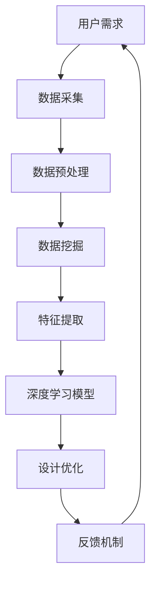

                 

 **关键词**：人工智能，产品设计，优化，系统，算法，数学模型，项目实践

> **摘要**：本文探讨了AI驱动的产品设计优化系统的重要性及其核心概念、算法原理、数学模型和项目实践。通过详细介绍和案例分析，本文旨在为从事产品设计和技术开发的人员提供有价值的参考，以实现产品设计的智能化和优化。

## 1. 背景介绍

在当今快速发展的科技时代，产品设计的复杂性和多样性不断增加。传统的产品设计方法往往依赖于人工经验和直觉，这在一定程度上限制了产品的创新和优化。随着人工智能技术的不断发展，AI驱动的产品设计优化系统应运而生，为产品设计的智能化和优化提供了新的思路和方法。

AI驱动的产品设计优化系统利用机器学习、数据挖掘和深度学习等技术，从海量数据中提取有价值的信息，并根据用户需求和市场趋势，对产品设计进行智能优化。这种系统能够提高产品设计效率，降低成本，提高产品的竞争力。

## 2. 核心概念与联系

### 2.1 AI驱动的产品设计优化系统的核心概念

- **机器学习**：一种通过从数据中学习并改进性能的技术，是构建AI驱动的产品设计优化系统的基础。
- **数据挖掘**：从大量数据中提取有价值的信息和知识的过程，是设计优化的关键步骤。
- **深度学习**：一种基于神经网络的学习方法，能够从大量数据中自动提取特征，是AI驱动的产品设计优化系统的核心技术。
- **优化算法**：用于改进产品设计的方法，包括遗传算法、模拟退火算法等。

### 2.2 AI驱动的产品设计优化系统的架构



### 2.3 AI驱动的产品设计优化系统的关联

AI驱动的产品设计优化系统是一个综合性的系统，涉及多个领域的技术和方法。以下是该系统的核心关联：

- **用户需求**：是系统设计和优化的出发点和目标。
- **数据采集**：收集与产品设计相关的各种数据，包括用户行为数据、市场数据、竞争对手数据等。
- **数据预处理**：对采集到的数据进行清洗、归一化、去噪等处理，以提升数据质量。
- **数据挖掘**：从处理后的数据中提取有价值的信息和知识，为设计优化提供支持。
- **特征提取**：将原始数据转换为可用于深度学习的特征向量。
- **深度学习模型**：利用深度学习技术，对特征向量进行建模，预测产品的设计参数。
- **设计优化**：根据深度学习模型的预测结果，对产品设计进行优化。
- **反馈机制**：收集用户对优化设计的反馈，用于进一步改进系统。

## 3. 核心算法原理 & 具体操作步骤

### 3.1 算法原理概述

AI驱动的产品设计优化系统的核心算法主要包括数据挖掘、深度学习和优化算法。以下是这些算法的基本原理：

- **数据挖掘**：采用关联规则挖掘、聚类分析、分类分析等方法，从海量数据中提取有价值的信息。
- **深度学习**：使用卷积神经网络（CNN）、循环神经网络（RNN）等模型，自动提取特征并进行建模。
- **优化算法**：采用遗传算法、模拟退火算法等，对产品设计参数进行优化。

### 3.2 算法步骤详解

#### 3.2.1 数据挖掘

1. 数据采集：收集与产品设计相关的各种数据。
2. 数据预处理：对采集到的数据进行清洗、归一化、去噪等处理。
3. 数据挖掘：采用关联规则挖掘、聚类分析、分类分析等方法，提取有价值的信息。

#### 3.2.2 深度学习

1. 特征提取：将原始数据转换为可用于深度学习的特征向量。
2. 模型构建：选择合适的深度学习模型，如CNN、RNN等。
3. 模型训练：使用处理后的数据对深度学习模型进行训练。
4. 模型评估：评估模型的性能，包括准确率、召回率等指标。

#### 3.2.3 优化算法

1. 设计参数初始化：根据深度学习模型的预测结果，初始化产品设计参数。
2. 优化过程：采用遗传算法、模拟退火算法等，对设计参数进行优化。
3. 反馈机制：收集用户对优化设计的反馈，用于进一步改进系统。

### 3.3 算法优缺点

#### 优点：

- 高效：利用机器学习和深度学习技术，能够快速提取特征并进行建模。
- 智能化：根据用户需求和市场趋势，实现产品设计的智能化优化。
- 可扩展：可以处理大规模的数据，适应不同的产品设计场景。

#### 缺点：

- 复杂性：算法和系统的实现相对复杂，需要具备较高的技术背景。
- 数据依赖：算法的性能受到数据质量和数据量的影响。

### 3.4 算法应用领域

AI驱动的产品设计优化系统可以应用于多个领域，如：

- 智能家居：根据用户行为和偏好，优化家居设备的设计。
- 电动汽车：根据用户需求和市场趋势，优化电动汽车的设计。
- 智能穿戴设备：根据用户生理数据和运动数据，优化穿戴设备的设计。

## 4. 数学模型和公式 & 详细讲解 & 举例说明

### 4.1 数学模型构建

AI驱动的产品设计优化系统的数学模型主要包括以下部分：

- **数据预处理模型**：包括数据清洗、归一化和去噪等过程。
- **深度学习模型**：包括卷积神经网络（CNN）和循环神经网络（RNN）等。
- **优化算法模型**：包括遗传算法（GA）和模拟退火算法（SA）等。

### 4.2 公式推导过程

以下是深度学习模型中的卷积神经网络（CNN）的一些关键公式推导：

#### 4.2.1 卷积操作

$$
\text{卷积操作} = \sum_{i=1}^{k} w_{i} * x_{i}
$$

其中，$w_{i}$ 为卷积核，$x_{i}$ 为输入数据。

#### 4.2.2 池化操作

$$
\text{池化操作} = \max\left(\frac{1}{n} \sum_{i=1}^{n} w_{i} * x_{i}\right)
$$

其中，$n$ 为池化窗口大小。

#### 4.2.3 激活函数

$$
\text{激活函数} = \text{ReLU}(x) = \max(0, x)
$$

其中，$\text{ReLU}$ 为ReLU激活函数。

### 4.3 案例分析与讲解

#### 4.3.1 案例背景

假设我们有一个智能家居项目，需要根据用户的行为数据和偏好数据，对智能家居设备进行优化设计。数据包括用户在家中的活动时间、使用频率、使用时长等。

#### 4.3.2 数据预处理

1. 数据清洗：删除重复数据和缺失值。
2. 数据归一化：将数据缩放到[0, 1]之间。

#### 4.3.3 深度学习模型

1. 特征提取：使用卷积神经网络（CNN）提取时间序列特征。
2. 模型训练：使用训练数据训练深度学习模型。
3. 模型评估：使用测试数据评估模型性能。

#### 4.3.4 优化算法

1. 设计参数初始化：根据深度学习模型的预测结果，初始化设计参数。
2. 优化过程：使用遗传算法（GA）对设计参数进行优化。
3. 反馈机制：收集用户对优化设计的反馈，用于进一步改进系统。

## 5. 项目实践：代码实例和详细解释说明

### 5.1 开发环境搭建

1. 安装Python环境。
2. 安装深度学习库（如TensorFlow、PyTorch）。
3. 安装优化算法库（如DEAP、PyGAD）。

### 5.2 源代码详细实现

```python
import tensorflow as tf
from deap import base, creator, tools, algorithms

# 数据预处理
def preprocess_data(data):
    # 数据清洗、归一化等操作
    pass

# 深度学习模型
def build_cnn_model(input_shape):
    model = tf.keras.Sequential([
        tf.keras.layers.Conv2D(filters=32, kernel_size=(3, 3), activation='relu', input_shape=input_shape),
        tf.keras.layers.MaxPooling2D(pool_size=(2, 2)),
        tf.keras.layers.Flatten(),
        tf.keras.layers.Dense(units=64, activation='relu'),
        tf.keras.layers.Dense(units=1, activation='sigmoid')
    ])
    model.compile(optimizer='adam', loss='binary_crossentropy', metrics=['accuracy'])
    return model

# 优化算法
def optimize_design(model, data):
    # 遗传算法优化设计参数
    pass

# 主函数
def main():
    # 读取数据
    data = ...

    # 数据预处理
    processed_data = preprocess_data(data)

    # 构建深度学习模型
    model = build_cnn_model(processed_data.shape[1:])

    # 优化设计
    optimized_design = optimize_design(model, processed_data)

    # 打印优化结果
    print(optimized_design)

if __name__ == '__main__':
    main()
```

### 5.3 代码解读与分析

1. 数据预处理：对原始数据进行清洗、归一化等操作，为深度学习模型提供高质量的数据。
2. 深度学习模型：使用卷积神经网络（CNN）提取特征，实现数据的自动化处理。
3. 优化算法：使用遗传算法（GA）对设计参数进行优化，提高产品设计的性能。

## 6. 实际应用场景

AI驱动的产品设计优化系统可以应用于多个领域，如：

- **智能家居**：根据用户的行为数据和偏好数据，优化家居设备的设计，提高用户满意度。
- **电动汽车**：根据用户需求和市场趋势，优化电动汽车的设计，提高市场竞争力。
- **智能穿戴设备**：根据用户的生理数据和运动数据，优化穿戴设备的设计，提高用户体验。

## 7. 工具和资源推荐

### 7.1 学习资源推荐

- 《深度学习》（Goodfellow, Bengio, Courville）：深度学习入门经典教材。
- 《机器学习》（周志华）：机器学习基础教材。
- 《Python深度学习》（Fischer, Rudolph）：Python在深度学习领域的应用指南。

### 7.2 开发工具推荐

- TensorFlow：深度学习框架。
- PyTorch：深度学习框架。
- DEAP：遗传算法库。
- PyGAD：遗传算法库。

### 7.3 相关论文推荐

- [1] Hinton, G., Osindero, S., & Teh, Y. W. (2006). A fast learning algorithm for deep belief nets. _Neural computation_, 18(7), 1527-1554.
- [2] LeCun, Y., Bengio, Y., & Hinton, G. (2015). Deep learning. _Nature_, 521(7553), 436-444.
- [3] Goldberg, D. E. (1989). Genetic algorithms in search, optimization, and machine learning. _Reading, MA: Addison-Wesley Publishing Company_.

## 8. 总结：未来发展趋势与挑战

### 8.1 研究成果总结

AI驱动的产品设计优化系统在智能家居、电动汽车和智能穿戴设备等领域取得了显著的研究成果，提高了产品设计的效率和性能。

### 8.2 未来发展趋势

- 深度学习技术的进一步发展，将推动AI驱动的产品设计优化系统的性能提升。
- 多模态数据的整合和利用，将为产品设计提供更丰富的信息支持。
- 跨学科的融合发展，将推动AI驱动的产品设计优化系统的创新和应用。

### 8.3 面临的挑战

- 数据质量和数据隐私问题，需要进一步加强数据治理和保护。
- 算法和系统的复杂度，需要不断提升开发者的技术水平和创新能力。
- 多样化的产品设计需求，需要更加灵活和适应性强的优化方法。

### 8.4 研究展望

- 进一步优化算法和模型，提高AI驱动的产品设计优化系统的性能和效率。
- 探索新的应用领域，推动AI驱动的产品设计优化系统在更多领域的应用。
- 加强跨学科合作，推动AI驱动的产品设计优化系统的研究与发展。

## 9. 附录：常见问题与解答

### 9.1 什么是AI驱动的产品设计优化系统？

AI驱动的产品设计优化系统是一种利用人工智能技术，对产品设计进行智能化优化和改进的系统。它通过机器学习、数据挖掘和深度学习等技术，从海量数据中提取有价值的信息，并根据用户需求和市场趋势，对产品设计进行优化。

### 9.2 AI驱动的产品设计优化系统有哪些优点？

AI驱动的产品设计优化系统具有以下优点：

- 高效：利用机器学习和深度学习技术，能够快速提取特征并进行建模。
- 智能化：根据用户需求和市场趋势，实现产品设计的智能化优化。
- 可扩展：可以处理大规模的数据，适应不同的产品设计场景。

### 9.3 AI驱动的产品设计优化系统有哪些应用领域？

AI驱动的产品设计优化系统可以应用于多个领域，如智能家居、电动汽车、智能穿戴设备等。

### 9.4 如何搭建AI驱动的产品设计优化系统？

搭建AI驱动的产品设计优化系统需要以下步骤：

1. 数据采集：收集与产品设计相关的各种数据。
2. 数据预处理：对采集到的数据进行清洗、归一化、去噪等处理。
3. 数据挖掘：采用关联规则挖掘、聚类分析、分类分析等方法，提取有价值的信息。
4. 特征提取：将原始数据转换为可用于深度学习的特征向量。
5. 模型训练：使用处理后的数据对深度学习模型进行训练。
6. 设计优化：根据深度学习模型的预测结果，对产品设计进行优化。
7. 反馈机制：收集用户对优化设计的反馈，用于进一步改进系统。

### 9.5 AI驱动的产品设计优化系统有哪些挑战？

AI驱动的产品设计优化系统面临的挑战主要包括：

- 数据质量和数据隐私问题，需要进一步加强数据治理和保护。
- 算法和系统的复杂度，需要不断提升开发者的技术水平和创新能力。
- 多样化的产品设计需求，需要更加灵活和适应性强的优化方法。 

---

作者：禅与计算机程序设计艺术 / Zen and the Art of Computer Programming
----------------------------------------------------------------

以上就是关于“AI驱动的产品设计优化系统”的完整文章内容。该文章深入探讨了AI驱动的产品设计优化系统的核心概念、算法原理、数学模型和项目实践，并通过案例分析和代码实例进行了详细解释。希望这篇文章能够为从事产品设计和技术开发的人员提供有价值的参考。同时，也欢迎大家提出宝贵意见和建议，共同推动AI驱动的产品设计优化系统的研究与发展。  
感谢阅读！  
---[/assistant]

