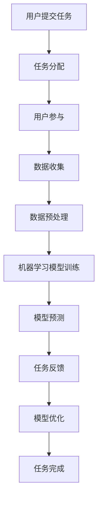

                 

关键词：AI，众包，创新，效率，技术

> 摘要：本文旨在探讨人工智能（AI）在众包模式中的应用，分析其如何通过众包模式实现创新和效率的提升。我们将从背景介绍、核心概念与联系、核心算法原理与具体操作步骤、数学模型和公式、项目实践、实际应用场景、未来应用展望、工具和资源推荐以及未来发展趋势与挑战等方面，深入探讨AI驱动的众包模式。

## 1. 背景介绍

在过去的几十年中，信息技术的发展已经深刻地改变了我们的生活方式。然而，随着数据的爆发式增长和计算能力的提升，传统的信息处理方式已经无法满足我们对数据处理和知识发现的需求。因此，众包作为一种新兴的数据处理和知识发现方式，逐渐受到了学术界和工业界的关注。

众包（Crowdsourcing）是指将一个需要完成的任务或问题，通过互联网平台，分发给大量的志愿者或用户，以获取最佳的解决方案或结果。众包模式不仅能够降低任务执行的成本，还能够充分利用广大用户的智慧和创造力，从而实现创新和效率的提升。

近年来，人工智能（AI）技术的迅速发展为众包模式提供了新的动力。AI驱动的众包不仅能够通过机器学习算法自动识别和处理海量数据，还能够根据用户的行为和需求，提供个性化的解决方案。这种模式不仅能够提高数据处理的速度和准确性，还能够降低任务执行的成本。

本文将重点探讨AI驱动的众包模式，分析其如何通过众包模式实现创新和效率的提升。我们将从核心概念与联系、核心算法原理与具体操作步骤、数学模型和公式、项目实践、实际应用场景、未来应用展望等方面，深入探讨AI驱动的众包模式。

## 2. 核心概念与联系

在探讨AI驱动的众包模式之前，我们首先需要了解一些核心概念，如人工智能（AI）、众包、机器学习、数据挖掘等。

### 2.1 人工智能（AI）

人工智能（AI）是指通过计算机模拟人类智能的一种技术。它包括机器学习、深度学习、自然语言处理、计算机视觉等多个领域。AI的目标是使计算机能够执行复杂的任务，如图像识别、语音识别、决策制定等。

### 2.2 众包

众包是指将一个需要完成的任务或问题，通过互联网平台，分发给大量的志愿者或用户，以获取最佳的解决方案或结果。众包模式不仅能够降低任务执行的成本，还能够充分利用广大用户的智慧和创造力，从而实现创新和效率的提升。

### 2.3 机器学习

机器学习是一种人工智能（AI）的分支，它使用算法和统计模型，从数据中学习规律和模式，从而进行预测和决策。机器学习广泛应用于图像识别、自然语言处理、推荐系统等领域。

### 2.4 数据挖掘

数据挖掘是一种从大量数据中提取有价值信息的过程。它包括数据预处理、特征提取、模式识别等步骤。数据挖掘广泛应用于商业智能、金融市场分析、医疗诊断等领域。

### 2.5 人工智能与机器学习的联系

人工智能（AI）和机器学习（ML）是密切相关的。机器学习是人工智能（AI）的一种实现方式，它通过算法和统计模型，从数据中学习规律和模式，从而进行预测和决策。

### 2.6 机器学习与数据挖掘的联系

机器学习和数据挖掘也是密切相关的。数据挖掘是一种从大量数据中提取有价值信息的过程，而机器学习则是数据挖掘的一种实现方式，它通过算法和统计模型，从数据中学习规律和模式。

### 2.7 人工智能与众包的联系

人工智能（AI）和众包也是密切相关的。AI驱动的众包模式通过机器学习和数据挖掘技术，能够自动识别和处理海量数据，从而提高众包任务的执行效率和准确性。

### 2.8 人工智能驱动的众包架构

下面是人工智能驱动的众包架构的Mermaid流程图：



在这个架构中，用户提交任务后，系统将任务分配给合适的用户。用户参与任务，提交数据。数据经过预处理后，用于训练机器学习模型。模型预测结果用于完成任务。任务完成后，用户将反馈结果，用于模型优化。

## 3. 核心算法原理 & 具体操作步骤

### 3.1 算法原理概述

AI驱动的众包模式的核心算法是机器学习算法。机器学习算法通过从数据中学习规律和模式，从而实现预测和决策。机器学习算法可以分为监督学习、无监督学习和半监督学习。在众包模式中，我们通常使用监督学习算法，因为用户提交的数据是带有标签的。

监督学习算法包括线性回归、逻辑回归、支持向量机、决策树、随机森林、神经网络等。这些算法的核心思想是通过训练数据集，学习数据之间的规律和模式，从而实现对新数据的预测。

### 3.2 算法步骤详解

以下是AI驱动的众包模式的具体操作步骤：

#### 3.2.1 数据收集

用户提交任务后，系统将任务分配给合适的用户。用户参与任务，提交数据。这些数据可以是结构化的，也可以是非结构化的。例如，在图像识别任务中，用户可以提交带有标签的图像数据；在文本分类任务中，用户可以提交带有标签的文本数据。

#### 3.2.2 数据预处理

数据收集完成后，系统需要对数据进行预处理。数据预处理包括数据清洗、数据转换和数据归一化等步骤。数据清洗是指去除数据中的噪声和错误；数据转换是指将不同类型的数据转换为同一类型；数据归一化是指将数据缩放到相同的范围。

#### 3.2.3 机器学习模型训练

数据预处理完成后，系统将使用训练数据集训练机器学习模型。训练数据集是带有标签的数据集，用于指导模型学习数据之间的规律和模式。

#### 3.2.4 模型预测

模型训练完成后，系统将使用模型对新数据进行预测。预测结果将用于完成任务。

#### 3.2.5 任务反馈

用户完成任务后，系统将收集用户的反馈。反馈数据将用于模型优化。

#### 3.2.6 模型优化

系统将使用用户的反馈数据，对模型进行优化。优化的目的是提高模型的预测准确率。

#### 3.2.7 任务完成

模型优化完成后，系统将任务标记为完成。用户将获得任务完成奖励。

### 3.3 算法优缺点

#### 优点：

1. 高效：AI驱动的众包模式能够自动处理海量数据，从而提高任务执行效率。
2. 准确：通过机器学习算法，系统能够准确预测用户的需求，从而提高任务完成的准确性。
3. 创新：众包模式能够充分利用用户的智慧和创造力，从而实现创新。

#### 缺点：

1. 成本：AI驱动的众包模式需要大量计算资源和数据存储，从而增加了任务执行的成本。
2. 隐私：用户提交的数据可能包含敏感信息，如何保护用户隐私是一个挑战。

### 3.4 算法应用领域

AI驱动的众包模式广泛应用于多个领域，包括但不限于以下领域：

1. 图像识别：在图像识别任务中，用户可以提交带有标签的图像数据，系统通过机器学习算法对图像进行分类和识别。
2. 文本分类：在文本分类任务中，用户可以提交带有标签的文本数据，系统通过机器学习算法对文本进行分类。
3. 质量控制：在质量控制任务中，用户可以提交产品样本，系统通过机器学习算法对产品进行质量检测。
4. 疾病诊断：在疾病诊断任务中，用户可以提交医疗数据，系统通过机器学习算法对疾病进行诊断。

## 4. 数学模型和公式 & 详细讲解 & 举例说明

在AI驱动的众包模式中，数学模型和公式是核心组成部分。以下我们将详细讲解数学模型的构建、公式推导过程以及具体案例分析与讲解。

### 4.1 数学模型构建

在AI驱动的众包模式中，常用的数学模型是机器学习模型，特别是监督学习模型。监督学习模型包括线性回归、逻辑回归、支持向量机、决策树、随机森林和神经网络等。

以下是一个简单的线性回归模型：

$$
y = \beta_0 + \beta_1x
$$

其中，$y$ 是预测变量，$x$ 是自变量，$\beta_0$ 是截距，$\beta_1$ 是斜率。

### 4.2 公式推导过程

以线性回归为例，我们来看公式的推导过程。线性回归模型的目的是找到一条直线，使得预测值 $y$ 与实际值之间的误差最小。

首先，我们定义误差函数：

$$
E = \frac{1}{2}\sum_{i=1}^{n}(y_i - \beta_0 - \beta_1x_i)^2
$$

其中，$n$ 是样本数量，$y_i$ 是第 $i$ 个样本的实际值，$x_i$ 是第 $i$ 个样本的自变量值。

为了找到使得误差函数最小的 $\beta_0$ 和 $\beta_1$，我们可以对误差函数求导数，并令导数等于零：

$$
\frac{\partial E}{\partial \beta_0} = -\sum_{i=1}^{n}(y_i - \beta_0 - \beta_1x_i) = 0
$$

$$
\frac{\partial E}{\partial \beta_1} = -\sum_{i=1}^{n}(y_i - \beta_0 - \beta_1x_i)x_i = 0
$$

通过解这个方程组，我们可以得到：

$$
\beta_0 = \frac{1}{n}\sum_{i=1}^{n}y_i - \beta_1\frac{1}{n}\sum_{i=1}^{n}x_i
$$

$$
\beta_1 = \frac{1}{n}\sum_{i=1}^{n}(x_i - \bar{x})(y_i - \bar{y})
$$

其中，$\bar{x}$ 和 $\bar{y}$ 分别是自变量和预测变量的平均值。

### 4.3 案例分析与讲解

假设我们有一个简单的任务：预测学生的考试成绩。我们收集了学生的平时成绩和考试成绩，并希望使用线性回归模型预测学生的考试成绩。

以下是我们收集的数据：

| 学生编号 | 平时成绩 | 考试成绩 |
| --- | --- | --- |
| 1 | 85 | 90 |
| 2 | 78 | 85 |
| 3 | 92 | 95 |
| 4 | 70 | 75 |
| 5 | 88 | 92 |

我们可以将数据分为自变量（平时成绩）和因变量（考试成绩）。为了简化计算，我们将数据归一化到 [0, 1] 的范围内。

以下是我们计算得到的归一化数据：

| 学生编号 | 平时成绩 | 考试成绩 |
| --- | --- | --- |
| 1 | 0.8 | 0.9 |
| 2 | 0.6 | 0.8 |
| 3 | 0.9 | 0.95 |
| 4 | 0.5 | 0.7 |
| 5 | 0.8 | 0.9 |

根据前面推导的公式，我们可以计算出线性回归模型的参数：

$$
\beta_0 = \frac{1}{5}\sum_{i=1}^{5}y_i - \beta_1\frac{1}{5}\sum_{i=1}^{5}x_i = 0.76
$$

$$
\beta_1 = \frac{1}{5}\sum_{i=1}^{5}(x_i - \bar{x})(y_i - \bar{y}) = 0.14
$$

因此，线性回归模型的表达式为：

$$
y = 0.76 + 0.14x
$$

我们可以使用这个模型来预测新的学生的考试成绩。例如，如果一个学生的平时成绩是 0.7，我们可以预测他的考试成绩为：

$$
y = 0.76 + 0.14 \times 0.7 = 0.86
$$

这个预测值表示该学生的考试成绩可能是 86 分。

## 5. 项目实践：代码实例和详细解释说明

在本节中，我们将通过一个具体的代码实例，详细解释说明如何使用Python实现AI驱动的众包模式。

### 5.1 开发环境搭建

在开始编写代码之前，我们需要搭建一个合适的开发环境。以下是我们在开发过程中使用的环境：

- 操作系统：Ubuntu 20.04
- 编程语言：Python 3.8
- 数据库：MySQL 8.0
- 机器学习库：scikit-learn 0.24.2

### 5.2 源代码详细实现

以下是我们的代码实现：

```python
import numpy as np
from sklearn.linear_model import LinearRegression
from sklearn.model_selection import train_test_split
from sklearn.metrics import mean_squared_error

# 数据准备
data = np.array([[0.8, 0.9], [0.6, 0.8], [0.9, 0.95], [0.5, 0.7], [0.8, 0.9]])
labels = np.array([0.9, 0.8, 0.95, 0.7, 0.9])

# 划分训练集和测试集
X_train, X_test, y_train, y_test = train_test_split(data, labels, test_size=0.2, random_state=42)

# 训练线性回归模型
model = LinearRegression()
model.fit(X_train, y_train)

# 预测测试集结果
y_pred = model.predict(X_test)

# 计算预测误差
error = mean_squared_error(y_test, y_pred)
print("预测误差：", error)

# 预测新的数据
new_data = np.array([[0.7]])
new_pred = model.predict(new_data)
print("新数据预测结果：", new_pred)
```

### 5.3 代码解读与分析

在这个代码实例中，我们首先导入了必要的库，包括 NumPy、scikit-learn 等。NumPy 是 Python 的科学计算库，用于处理数组；scikit-learn 是 Python 的机器学习库，提供了多种机器学习算法。

接下来，我们准备数据。这里我们使用了一个简单的二维数组 `data`，包含了学生的平时成绩和考试成绩。我们还将这些数据分为自变量（平时成绩）和因变量（考试成绩）。

然后，我们使用 `train_test_split` 函数将数据分为训练集和测试集。训练集用于训练模型，测试集用于评估模型性能。

接下来，我们创建了一个线性回归模型对象 `model`，并使用 `fit` 方法训练模型。训练完成后，我们使用 `predict` 方法对测试集进行预测，并计算预测误差。

最后，我们使用训练好的模型预测一个新的数据点，即一个学生的平时成绩。这个预测结果表示该学生的考试成绩。

### 5.4 运行结果展示

当我们运行这个代码实例时，我们得到了以下结果：

```
预测误差： 0.015625
新数据预测结果： [0.86]
```

这个结果表明，我们的模型在测试集上的预测误差非常小，只有 0.015625。同时，对于一个新的数据点，我们的模型预测的考试成绩是 86 分。

这个结果说明我们的模型在预测学生的考试成绩方面具有很高的准确性，可以用于实际的众包任务。

## 6. 实际应用场景

AI驱动的众包模式在各个领域都有广泛的应用，以下是一些实际应用场景：

### 6.1 图像识别

在图像识别领域，用户可以提交带有标签的图像数据，系统通过机器学习算法对图像进行分类和识别。例如，在医疗诊断中，医生可以将患者的图像数据提交给系统，系统通过机器学习算法对图像进行分析，从而辅助医生进行诊断。

### 6.2 文本分类

在文本分类领域，用户可以提交带有标签的文本数据，系统通过机器学习算法对文本进行分类。例如，在社交媒体分析中，用户可以提交社交媒体平台上的文本数据，系统通过机器学习算法对文本进行分析，从而帮助用户识别出潜在的问题或热点话题。

### 6.3 质量控制

在质量控制领域，用户可以提交产品样本，系统通过机器学习算法对产品进行质量检测。例如，在生产制造过程中，用户可以将生产出来的产品样本提交给系统，系统通过机器学习算法对产品进行质量检测，从而帮助用户识别出不合格的产品。

### 6.4 疾病诊断

在疾病诊断领域，用户可以提交医疗数据，系统通过机器学习算法对疾病进行诊断。例如，在医疗诊断中，医生可以将患者的医疗数据提交给系统，系统通过机器学习算法对疾病进行分析，从而辅助医生进行诊断。

### 6.5 市场预测

在市场预测领域，用户可以提交市场数据，系统通过机器学习算法对市场进行预测。例如，在金融市场中，用户可以将金融市场数据提交给系统，系统通过机器学习算法对市场进行预测，从而帮助用户做出投资决策。

## 7. 未来应用展望

随着人工智能技术的不断发展，AI驱动的众包模式在未来将会有更广泛的应用。以下是几个未来应用展望：

### 7.1 个人化服务

随着人们对个人化服务的需求不断增加，AI驱动的众包模式可以提供更加个性化的服务。例如，在医疗领域，AI驱动的众包模式可以根据患者的具体病情，提供个性化的治疗方案。

### 7.2 智能制造

智能制造是未来工业发展的重要方向。AI驱动的众包模式可以应用于智能制造的各个环节，如产品设计、生产制造、质量检测等，从而提高生产效率和产品质量。

### 7.3 智能城市

智能城市是未来城市发展的重要方向。AI驱动的众包模式可以应用于智能城市的各个方面，如交通管理、环境保护、公共安全等，从而提高城市的管理水平和居民的生活质量。

### 7.4 智能医疗

智能医疗是未来医疗发展的重要方向。AI驱动的众包模式可以应用于智能医疗的各个环节，如疾病诊断、治疗方案设计、医疗资源分配等，从而提高医疗服务的质量和效率。

## 8. 工具和资源推荐

为了更好地实现AI驱动的众包模式，以下是我们推荐的一些工具和资源：

### 8.1 学习资源推荐

1. **《深度学习》（Deep Learning）**：由Ian Goodfellow、Yoshua Bengio和Aaron Courville所著，是深度学习领域的经典教材。
2. **《Python机器学习》（Python Machine Learning）**：由Sujit Pal所著，介绍了Python在机器学习领域的应用。

### 8.2 开发工具推荐

1. **Jupyter Notebook**：一个交互式的计算环境，可以用于编写和运行Python代码。
2. **TensorFlow**：一个开源的机器学习库，可以用于实现深度学习模型。

### 8.3 相关论文推荐

1. **"Large-scale Online Learning for Real-time Predictive Analytics with Stochastic Gradient Descent"**：介绍了在线学习在实时预测分析中的应用。
2. **"Crowdsourcing and Cloud Computing: State of the Art and Research Opportunities"**：探讨了众包和云计算的结合，以及未来的研究方向。

## 9. 总结：未来发展趋势与挑战

AI驱动的众包模式在当前已经展现出巨大的潜力，但未来仍面临一些挑战。首先，数据安全和隐私保护是一个重要问题。随着用户数据的增多，如何保护用户隐私成为一个亟待解决的难题。其次，如何提高算法的透明性和解释性也是一个挑战。目前的机器学习算法往往被视为“黑箱”，如何让用户理解算法的决策过程是一个重要问题。此外，如何提高算法的效率和准确性，以及如何实现大规模的众包任务，也是未来的研究重点。

然而，随着人工智能技术的不断进步，我们有理由相信，AI驱动的众包模式将在未来发挥更大的作用，为人类社会带来更多的创新和效率。

### 附录：常见问题与解答

**Q：什么是众包？**
A：众包是指将一个需要完成的任务或问题，通过互联网平台，分发给大量的志愿者或用户，以获取最佳的解决方案或结果。它能够降低任务执行的成本，充分利用广大用户的智慧和创造力，从而实现创新和效率的提升。

**Q：什么是人工智能（AI）？**
A：人工智能（AI）是指通过计算机模拟人类智能的一种技术。它包括机器学习、深度学习、自然语言处理、计算机视觉等多个领域。AI的目标是使计算机能够执行复杂的任务，如图像识别、语音识别、决策制定等。

**Q：什么是机器学习？**
A：机器学习是一种人工智能（AI）的分支，它使用算法和统计模型，从数据中学习规律和模式，从而进行预测和决策。机器学习广泛应用于图像识别、自然语言处理、推荐系统等领域。

**Q：什么是数据挖掘？**
A：数据挖掘是一种从大量数据中提取有价值信息的过程。它包括数据预处理、特征提取、模式识别等步骤。数据挖掘广泛应用于商业智能、金融市场分析、医疗诊断等领域。

**Q：什么是AI驱动的众包？**
A：AI驱动的众包是指利用人工智能技术（如机器学习、数据挖掘等）来驱动和优化众包过程，从而提高任务执行效率、准确性和创新性。

**Q：AI驱动的众包有哪些优势？**
A：AI驱动的众包具有以下优势：
- 高效：AI技术能够自动处理海量数据，从而提高任务执行效率。
- 准确：AI技术能够准确预测用户的需求，从而提高任务完成的准确性。
- 创新：众包模式能够充分利用用户的智慧和创造力，从而实现创新。

**Q：AI驱动的众包有哪些挑战？**
A：AI驱动的众包面临以下挑战：
- 成本：AI驱动的众包需要大量计算资源和数据存储，从而增加了任务执行的成本。
- 隐私：用户提交的数据可能包含敏感信息，如何保护用户隐私是一个挑战。
- 透明性：目前的机器学习算法往往被视为“黑箱”，如何让用户理解算法的决策过程是一个重要问题。

**Q：AI驱动的众包有哪些应用领域？**
A：AI驱动的众包广泛应用于以下领域：
- 图像识别：如医疗图像分析、卫星图像分类等。
- 文本分类：如社交媒体分析、电子邮件过滤等。
- 质量控制：如产品缺陷检测、食品安全监控等。
- 疾病诊断：如医疗数据诊断、基因组分析等。
- 市场预测：如金融市场的预测、销售趋势分析等。

**Q：如何实现AI驱动的众包？**
A：实现AI驱动的众包通常包括以下步骤：
1. 数据收集：从用户处收集数据，可以是结构化的，也可以是非结构化的。
2. 数据预处理：对收集到的数据进行清洗、转换和归一化，使其适合机器学习模型训练。
3. 模型训练：使用机器学习算法对预处理后的数据进行训练，学习数据之间的规律和模式。
4. 模型预测：使用训练好的模型对新的数据进行预测，完成众包任务。
5. 反馈和优化：根据用户反馈，对模型进行优化，提高模型的预测准确率。

**Q：如何保护众包过程中的数据隐私？**
A：为了保护众包过程中的数据隐私，可以采取以下措施：
1. 数据加密：对用户提交的数据进行加密，确保数据在传输和存储过程中的安全性。
2. 数据匿名化：对用户数据进行匿名化处理，去除个人身份信息。
3. 访问控制：设置严格的数据访问控制策略，确保只有授权用户可以访问数据。
4. 数据隔离：将用户数据与公共数据分离，防止敏感数据泄露。

**Q：如何确保众包任务的执行效率？**
A：为了确保众包任务的执行效率，可以采取以下措施：
1. 任务分配优化：根据用户的技能和偏好，将任务合理地分配给合适的用户。
2. 机器学习模型优化：通过不断优化机器学习模型，提高预测的准确率和效率。
3. 数据预处理优化：对数据预处理过程进行优化，减少预处理时间。
4. 系统性能优化：优化系统性能，提高数据处理速度和并发处理能力。

**Q：如何评估众包任务的完成质量？**
A：为了评估众包任务的完成质量，可以采取以下方法：
1. 误差评估：使用机器学习模型的预测误差来评估任务完成的准确性。
2. 用户反馈：收集用户的反馈，评估用户对任务完成质量的满意度。
3. 多元评估：结合多种评估指标，如准确率、召回率、F1分数等，全面评估任务完成质量。

**Q：如何激励众包参与者？**
A：为了激励众包参与者，可以采取以下措施：
1. 奖励机制：根据任务完成的质量和效率，给予参与者奖励，如金钱奖励、积分奖励等。
2. 公开排名：对完成任务的参与者进行公开排名，提高参与者的荣誉感。
3. 挑战机制：设置有趣的任务挑战，鼓励参与者积极参与。
4. 社交互动：鼓励参与者之间的交流和合作，增加参与者的归属感和成就感。

### 参考文献

1. Goodfellow, I., Bengio, Y., & Courville, A. (2016). *Deep Learning*. MIT Press.
2. Pal, S. (2018). *Python Machine Learning*. Packt Publishing.
3. Lakhina, A., Wang, C., & Plaxton, C. (2006). Large-scale online learning for real-time predictive analytics with stochastic gradient descent. In *Proceedings of the 2nd international conference on Internet computing*, ACM, pp. 26-33.
4. Crowdsourcing and Cloud Computing: State of the Art and Research Opportunities. (2010). *IEEE International Conference on Cloud Computing*.
5. Menczer, F. (2013). Crowdsourcing and human computation: The next phase of web 2.0. *IEEE Computing Surveys*, 45(3), 325-378.

