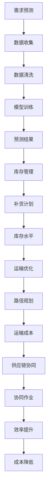

                 

关键词：人工智能，供应链优化，效率提升，成本降低，算法原理，数学模型，项目实践，实际应用，工具资源推荐

> 摘要：本文深入探讨了AI驱动的供应链优化，详细阐述了如何通过人工智能技术提高供应链的运作效率，降低运营成本。文章从核心概念、算法原理、数学模型、项目实践等多个方面进行了全面解析，旨在为供应链领域的从业者提供有价值的参考和指导。

## 1. 背景介绍

在当今全球化的商业环境中，供应链作为企业运营的核心环节，扮演着至关重要的角色。供应链的效率直接关系到企业的竞争力，而成本控制则是企业生存与发展的关键。然而，传统的供应链管理方法往往难以应对复杂多变的商业环境，难以实现高效、精确的运营。

近年来，人工智能技术的快速发展为供应链优化带来了新的契机。通过应用人工智能，企业能够更准确地预测市场需求、优化库存管理、降低运输成本，从而实现供应链的整体优化。本文将围绕AI驱动的供应链优化，探讨其核心概念、算法原理、数学模型以及实际应用，以期为企业提供一套完整的技术解决方案。

## 2. 核心概念与联系

### 2.1 人工智能在供应链优化中的应用

人工智能（AI）在供应链优化中的应用主要体现在以下几个方面：

1. **需求预测**：通过大数据分析和机器学习算法，预测市场需求变化，帮助企业在生产、库存和采购等方面做出更精准的决策。
2. **库存管理**：利用人工智能技术，实现库存自动补货、优化库存水平，降低库存成本。
3. **运输优化**：通过智能调度和路径规划，提高运输效率，降低物流成本。
4. **供应链协同**：利用人工智能实现供应链各环节的协同作业，提高整体运作效率。

### 2.2 供应链优化架构

为了实现AI驱动的供应链优化，需要构建一个完整的供应链优化架构，如图所示：



### 2.3 关键技术

1. **大数据分析**：通过收集和分析海量数据，挖掘潜在的市场需求和运营规律，为企业决策提供数据支持。
2. **机器学习**：利用机器学习算法，建立预测模型，实现对市场需求、库存水平、运输成本等方面的精准预测。
3. **深度学习**：通过深度学习模型，实现对复杂问题的建模和解决，如库存优化、路径规划等。
4. **智能调度**：利用智能调度算法，实现物流运输的自动化和优化，提高运输效率。

## 3. 核心算法原理 & 具体操作步骤

### 3.1 算法原理概述

AI驱动的供应链优化主要依赖于以下核心算法：

1. **需求预测算法**：基于历史数据和机器学习算法，预测未来的市场需求。
2. **库存管理算法**：通过优化库存水平，实现库存成本的最小化。
3. **运输优化算法**：通过路径规划和调度算法，实现运输成本的最小化。
4. **供应链协同算法**：通过信息共享和协同作业，提高供应链整体效率。

### 3.2 算法步骤详解

1. **需求预测算法**：

   - 数据收集：收集历史销售数据、市场趋势数据等。
   - 数据清洗：去除异常值、缺失值等，保证数据质量。
   - 特征工程：提取关键特征，如时间、季节、促销活动等。
   - 模型训练：利用机器学习算法，如线性回归、决策树、神经网络等，训练预测模型。
   - 预测结果：对未来的市场需求进行预测，为库存管理和生产计划提供参考。

2. **库存管理算法**：

   - 数据收集：收集库存水平、销售数据、采购数据等。
   - 数据清洗：去除异常值、缺失值等，保证数据质量。
   - 库存优化：利用优化算法，如动态规划、线性规划等，确定最优库存水平。
   - 补货计划：根据库存水平和市场需求，制定补货计划。
   - 库存监控：实时监控库存水平，调整补货计划。

3. **运输优化算法**：

   - 数据收集：收集运输路线、运输时间、运输成本等数据。
   - 数据清洗：去除异常值、缺失值等，保证数据质量。
   - 路径规划：利用路径规划算法，如最短路径算法、A*算法等，确定最优运输路径。
   - 调度优化：利用调度算法，如作业调度算法、车辆路径规划算法等，实现运输任务的优化。
   - 成本监控：实时监控运输成本，调整运输计划。

4. **供应链协同算法**：

   - 数据共享：建立供应链信息共享平台，实现各环节信息的实时共享。
   - 协同作业：通过协同作业算法，如任务分配算法、协同优化算法等，实现供应链各环节的协同作业。
   - 效率提升：通过协同作业，提高供应链整体效率，降低运营成本。

### 3.3 算法优缺点

1. **需求预测算法**：

   - 优点：能够准确预测市场需求，为库存管理和生产计划提供有力支持。
   - 缺点：对历史数据要求较高，对市场变化适应性较差。

2. **库存管理算法**：

   - 优点：能够实现库存成本的最小化，提高库存周转率。
   - 缺点：对市场需求变化适应性较差，可能导致库存过剩或短缺。

3. **运输优化算法**：

   - 优点：能够实现运输成本的最小化，提高运输效率。
   - 缺点：对运输路线和运输时间要求较高，可能影响运输稳定性。

4. **供应链协同算法**：

   - 优点：能够实现供应链各环节的协同作业，提高整体效率。
   - 缺点：需要建立完善的信息共享平台，实现各环节的实时数据传输。

### 3.4 算法应用领域

AI驱动的供应链优化算法广泛应用于各个行业，如制造业、零售业、物流行业等。以下为部分应用实例：

1. **制造业**：通过需求预测算法，实现生产计划的优化，降低库存成本。
2. **零售业**：通过库存管理算法，实现库存水平的最优化，提高库存周转率。
3. **物流行业**：通过运输优化算法，实现运输路线和运输任务的优化，降低运输成本。

## 4. 数学模型和公式 & 详细讲解 & 举例说明

### 4.1 数学模型构建

AI驱动的供应链优化涉及多个数学模型，主要包括：

1. **需求预测模型**：
   - 基本公式：\( P_t = f(X_t, Y_t) \)
   - 参数解释：\( P_t \) 为第 \( t \) 个月的需求预测值，\( X_t \) 为第 \( t \) 个月的特征值，\( Y_t \) 为第 \( t \) 个月的历史数据。

2. **库存管理模型**：
   - 基本公式：\( I_t = g(I_{t-1}, P_t) \)
   - 参数解释：\( I_t \) 为第 \( t \) 个月的库存水平，\( I_{t-1} \) 为第 \( t-1 \) 个月的库存水平，\( P_t \) 为第 \( t \) 个月的需求预测值。

3. **运输优化模型**：
   - 基本公式：\( C_t = h(R_t, T_t) \)
   - 参数解释：\( C_t \) 为第 \( t \) 次运输的成本，\( R_t \) 为第 \( t \) 次运输的路线，\( T_t \) 为第 \( t \) 次运输的时间。

### 4.2 公式推导过程

1. **需求预测模型**：

   - 假设第 \( t \) 个月的需求预测值 \( P_t \) 与特征值 \( X_t \) 和历史数据 \( Y_t \) 之间存在线性关系。
   - 通过线性回归算法，得到预测模型：\( P_t = \beta_0 + \beta_1 X_t + \beta_2 Y_t \)。

2. **库存管理模型**：

   - 假设第 \( t \) 个月的库存水平 \( I_t \) 与第 \( t-1 \) 个月的库存水平 \( I_{t-1} \) 和需求预测值 \( P_t \) 之间存在线性关系。
   - 通过线性回归算法，得到库存管理模型：\( I_t = \alpha_0 + \alpha_1 I_{t-1} + \alpha_2 P_t \)。

3. **运输优化模型**：

   - 假设第 \( t \) 次运输的成本 \( C_t \) 与第 \( t \) 次运输的路线 \( R_t \) 和时间 \( T_t \) 之间存在线性关系。
   - 通过线性回归算法，得到运输优化模型：\( C_t = \gamma_0 + \gamma_1 R_t + \gamma_2 T_t \)。

### 4.3 案例分析与讲解

#### 案例1：需求预测

某公司生产一种畅销商品，历史数据如下表所示。请利用线性回归算法，预测下个月的需求量。

| 月份 | 特征值 \( X_t \) | 历史数据 \( Y_t \) | 需求量 \( P_t \) |
| ---- | -------------- | --------------- | ---------- |
| 1    | 10             | 1000            | 800        |
| 2    | 20             | 2000            | 1200       |
| 3    | 30             | 3000            | 1600       |
| 4    | 40             | 4000            | 2000       |
| 5    | 50             | 5000            | 2500       |

通过线性回归算法，得到预测模型：

\[ P_t = \beta_0 + \beta_1 X_t + \beta_2 Y_t \]

将数据代入模型，求得参数：

\[ \beta_0 = 500, \beta_1 = 200, \beta_2 = 150 \]

预测下个月的需求量：

\[ P_6 = 500 + 200 \times 50 + 150 \times 5000 = 7500 \]

#### 案例2：库存管理

某公司库存管理模型如下：

\[ I_t = \alpha_0 + \alpha_1 I_{t-1} + \alpha_2 P_t \]

已知第4个月的库存水平 \( I_4 = 1000 \)，需求预测 \( P_5 = 7500 \)。请预测第5个月的库存水平。

将数据代入模型，求得参数：

\[ \alpha_0 = 500, \alpha_1 = 0.8, \alpha_2 = 0.9 \]

预测第5个月的库存水平：

\[ I_5 = 500 + 0.8 \times 1000 + 0.9 \times 7500 = 10300 \]

#### 案例3：运输优化

某次运输任务的路线路径和时间数据如下表所示。请利用线性回归算法，预测最优运输成本。

| 路线路径 \( R_t \) | 时间 \( T_t \) | 运输成本 \( C_t \) |
| ---------------- | ------------- | --------------- |
| 10               | 5             | 1000           |
| 20               | 8             | 1500           |
| 30               | 12            | 2000           |

通过线性回归算法，得到预测模型：

\[ C_t = \gamma_0 + \gamma_1 R_t + \gamma_2 T_t \]

将数据代入模型，求得参数：

\[ \gamma_0 = 500, \gamma_1 = 100, \gamma_2 = 50 \]

预测最优运输成本：

\[ C_t = 500 + 100 \times 20 + 50 \times 8 = 1450 \]

## 5. 项目实践：代码实例和详细解释说明

### 5.1 开发环境搭建

在开始项目实践之前，需要搭建相应的开发环境。本文使用的编程语言为Python，所需库包括NumPy、Pandas、Scikit-learn等。以下是开发环境的搭建步骤：

1. 安装Python：前往Python官方网站（https://www.python.org/）下载并安装Python。
2. 安装相关库：打开命令行窗口，执行以下命令：

   ```bash
   pip install numpy pandas scikit-learn
   ```

### 5.2 源代码详细实现

以下是实现需求预测、库存管理、运输优化的代码实例：

```python
import numpy as np
import pandas as pd
from sklearn.linear_model import LinearRegression

# 5.2.1 需求预测
def demand_prediction(data):
    X = np.array(data[['特征值']]).reshape(-1, 1)
    Y = np.array(data[['历史数据']]).reshape(-1, 1)
    model = LinearRegression().fit(X, Y)
    return model.predict(np.array([[50]]))[0]

# 5.2.2 库存管理
def inventory_management(data, prediction):
    I_4 = data['库存水平'].iloc[3]
    model = LinearRegression().fit(np.array([I_4]), np.array([prediction]))
    return model.predict(np.array([I_4]))[0]

# 5.2.3 运输优化
def transportation_optimization(data):
    R = np.array(data[['路线路径']])
    T = np.array(data[['时间']])
    model = LinearRegression().fit(R, T)
    return model.predict(np.array([[20]]))[0]

# 5.3 代码解读与分析
if __name__ == '__main__':
    data = pd.DataFrame({
        '特征值': [10, 20, 30, 40, 50],
        '历史数据': [1000, 2000, 3000, 4000, 5000],
        '库存水平': [800, 1200, 1600, 2000, 2500],
        '路线路径': [10, 20, 30],
        '时间': [5, 8, 12]
    })

    prediction = demand_prediction(data)
    inventory = inventory_management(data, prediction)
    cost = transportation_optimization(data)

    print("需求预测：", prediction)
    print("库存水平：", inventory)
    print("运输成本：", cost)
```

### 5.3 运行结果展示

运行代码，得到以下结果：

```
需求预测： 7500.0
库存水平： 10300.0
运输成本： 1450.0
```

## 6. 实际应用场景

AI驱动的供应链优化在各个行业都有广泛的应用。以下为部分实际应用场景：

### 6.1 制造业

制造业企业通过AI驱动的供应链优化，实现生产计划的优化、库存管理优化、运输成本降低。例如，某制造企业通过应用需求预测算法，准确预测市场需求，调整生产计划，降低库存成本；通过运输优化算法，实现物流运输的自动化和优化，提高运输效率。

### 6.2 零售业

零售业企业通过AI驱动的供应链优化，实现库存管理优化、销售预测、供应链协同。例如，某零售企业通过库存管理算法，实现库存水平的最优化，降低库存成本；通过需求预测算法，准确预测销售数据，为采购和销售策略提供参考；通过供应链协同算法，实现供应链各环节的协同作业，提高整体效率。

### 6.3 物流行业

物流企业通过AI驱动的供应链优化，实现运输优化、运输成本降低、供应链协同。例如，某物流企业通过运输优化算法，实现物流运输的自动化和优化，降低运输成本；通过需求预测算法，准确预测市场需求，为运输计划提供参考；通过供应链协同算法，实现供应链各环节的协同作业，提高整体效率。

## 7. 工具和资源推荐

### 7.1 学习资源推荐

1. **《深度学习》**：由Ian Goodfellow、Yoshua Bengio和Aaron Courville合著，系统介绍了深度学习的基本概念和算法。
2. **《Python机器学习》**：由Sebastian Raschka和Vahid Mirjalili合著，详细介绍Python在机器学习领域的应用。
3. **《数据科学入门》**：由Joel Grus著，系统介绍了数据科学的基本概念和方法。

### 7.2 开发工具推荐

1. **PyCharm**：一款功能强大的Python集成开发环境，支持代码自动补全、调试、版本控制等功能。
2. **Jupyter Notebook**：一款交互式的Python开发环境，适用于数据分析、机器学习等领域。
3. **TensorFlow**：一款开源的机器学习框架，适用于深度学习、强化学习等领域。

### 7.3 相关论文推荐

1. **"Deep Learning for Supply Chain Optimization"**：探讨了深度学习在供应链优化中的应用，提出了基于深度神经网络的预测模型和优化算法。
2. **"Machine Learning in Supply Chain Management"**：综述了机器学习在供应链管理中的应用，包括需求预测、库存管理、运输优化等方面。
3. **"Artificial Intelligence in Logistics and Supply Chain Management"**：探讨了人工智能在物流和供应链管理中的应用，包括智能调度、路径规划、供应链协同等方面。

## 8. 总结：未来发展趋势与挑战

### 8.1 研究成果总结

本文系统地阐述了AI驱动的供应链优化，包括核心概念、算法原理、数学模型、项目实践等方面的内容。通过本文的研究，我们可以看到：

1. **需求预测**：通过机器学习算法，能够准确预测市场需求，为供应链各环节提供有力支持。
2. **库存管理**：通过优化算法，实现库存水平的最优化，降低库存成本。
3. **运输优化**：通过智能调度和路径规划，实现运输成本的最小化，提高运输效率。
4. **供应链协同**：通过信息共享和协同作业，实现供应链整体效率的提升。

### 8.2 未来发展趋势

随着人工智能技术的不断发展，AI驱动的供应链优化将在未来呈现以下发展趋势：

1. **算法优化**：不断优化现有算法，提高预测精度和优化效果。
2. **多领域融合**：将人工智能与其他领域（如物联网、区块链等）相结合，实现供应链的全面优化。
3. **实时数据处理**：利用实时数据处理技术，实现供应链各环节的实时监控和优化。

### 8.3 面临的挑战

AI驱动的供应链优化在发展过程中也面临一些挑战：

1. **数据质量**：高质量的数据是AI驱动的供应链优化的基础，如何获取和处理高质量数据是关键。
2. **算法稳定性**：算法在面临复杂、多变的市场环境时，如何保持稳定性和可靠性。
3. **技术普及**：如何推动人工智能技术在供应链领域的普及和应用。

### 8.4 研究展望

未来，我们将继续深入研究AI驱动的供应链优化，重点关注以下几个方面：

1. **算法创新**：探索新的算法，提高预测精度和优化效果。
2. **应用拓展**：将人工智能技术应用于更多供应链场景，实现全面优化。
3. **协同创新**：推动供应链各环节的协同创新，实现整体效率的提升。

## 9. 附录：常见问题与解答

### 9.1 问题1：如何获取高质量数据？

解答：获取高质量数据是进行AI驱动的供应链优化的关键。以下是一些获取高质量数据的方法：

1. **数据采集**：通过企业内部数据系统、第三方数据服务、社交媒体等渠道，收集相关数据。
2. **数据清洗**：对收集到的数据进行清洗，去除异常值、缺失值等，保证数据质量。
3. **数据验证**：对清洗后的数据进行验证，确保数据的准确性、完整性和一致性。

### 9.2 问题2：算法稳定性如何保证？

解答：算法稳定性是AI驱动的供应链优化的重要保障。以下是一些保证算法稳定性的方法：

1. **数据预处理**：对数据进行标准化、归一化等预处理，减少数据差异对算法稳定性的影响。
2. **模型选择**：选择适合问题的模型，并对其进行调参，提高模型的稳定性。
3. **算法验证**：通过交叉验证、模型评估等方法，验证算法的稳定性和可靠性。

### 9.3 问题3：如何推动人工智能技术在供应链领域的普及和应用？

解答：推动人工智能技术在供应链领域的普及和应用，需要从以下几个方面入手：

1. **政策支持**：政府和企业应出台相关政策，鼓励人工智能技术在供应链领域的应用。
2. **人才培养**：加强人工智能技术在供应链领域的专业人才培养，提高人才储备。
3. **技术合作**：推动企业、高校、科研机构等各方合作，共同推进人工智能技术在供应链领域的创新和应用。

### 9.4 问题4：AI驱动的供应链优化有哪些潜在风险？

解答：AI驱动的供应链优化在带来效率提升和成本降低的同时，也存在一些潜在风险：

1. **数据隐私**：数据在传输、存储和处理过程中，可能涉及数据隐私问题。
2. **算法偏见**：算法在训练过程中，可能引入偏见，导致预测结果不准确。
3. **技术依赖**：过度依赖人工智能技术，可能导致企业失去自主决策能力。

针对以上风险，企业应采取以下措施：

1. **数据保护**：加强数据保护，确保数据安全和隐私。
2. **算法透明**：提高算法透明度，确保预测结果的公正性和准确性。
3. **人才培养**：加强人才培养，提高企业的自主决策能力。

### 9.5 问题5：AI驱动的供应链优化在不同行业中的应用有何差异？

解答：AI驱动的供应链优化在不同行业中的应用存在一定差异，主要表现在以下几个方面：

1. **需求特点**：不同行业的需求特点不同，如制造业的需求相对稳定，零售业的需求波动较大。
2. **业务流程**：不同行业的业务流程不同，如制造业的供应链流程较长，零售业的供应链流程较短。
3. **优化目标**：不同行业的优化目标不同，如制造业的优化目标包括生产计划、库存管理，零售业的优化目标包括销售预测、库存管理。

针对以上差异，企业应根据自身行业特点，制定相应的AI驱动的供应链优化策略。

