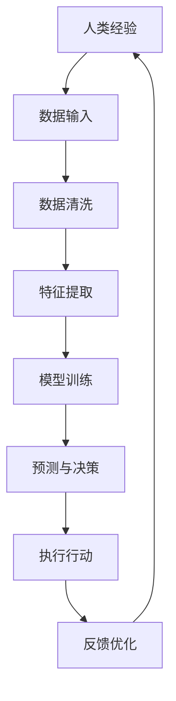

                 

关键词：人工智能、商业创新、人类计算、未来展望、技术发展

> 摘要：随着人工智能技术的迅速发展，人类计算在商业中的应用正变得越来越广泛。本文将探讨人工智能驱动的创新，以及人类计算在商业中的未来展望，旨在为读者提供一幅全面而清晰的蓝图，帮助理解和把握人工智能时代的商业机遇。

## 1. 背景介绍

人工智能（AI）作为21世纪最具前瞻性的技术之一，正在深刻改变我们的生活和工作方式。近年来，AI技术在各个领域都取得了显著的进展，从自然语言处理到计算机视觉，从智能机器人到自动驾驶，AI的应用场景日益丰富，成为推动社会进步的重要力量。

在商业领域，人工智能的应用不仅提升了企业运营效率，还带来了全新的商业模式。从数据驱动的决策支持，到个性化服务的实现，再到智能供应链的管理，AI正在成为企业竞争力的新引擎。与此同时，人类计算在商业中的角色也在不断演变，从传统的手工操作和数据分析师，逐渐转向与智能系统协同合作的新角色。

本文旨在通过深入探讨人工智能驱动的创新，以及人类计算在商业中的未来展望，帮助读者了解这一趋势的背景、核心概念、算法原理、实际应用和未来挑战，从而更好地把握人工智能时代的商业机遇。

## 2. 核心概念与联系

### 2.1 人工智能概述

人工智能，指的是使计算机系统能够模拟人类智能行为的技术。这包括学习、推理、感知、自我修正等能力。人工智能的发展可以分为几个阶段：

- **早期阶段**：以符号逻辑和规则系统为基础，如专家系统。
- **发展阶段**：以机器学习和深度学习为核心，通过大数据训练模型，实现自我优化。
- **当前阶段**：以生成对抗网络（GAN）、强化学习等前沿技术为标志，AI的应用范围不断扩展。

### 2.2 人类计算与商业

人类计算在商业中扮演着至关重要的角色，主要体现在以下几个方面：

- **数据分析**：人类通过对数据的理解，提取出有价值的信息，支持商业决策。
- **创新思维**：人类具备创新思维能力，能够在商业实践中提出新的解决方案。
- **人际互动**：在许多服务型业务中，人类的情感理解和人际沟通能力是不可替代的。

### 2.3 人工智能与人类计算的融合

人工智能与人类计算的融合，是一种双赢的模式。通过将人类的知识和经验与AI的计算能力相结合，可以实现以下优势：

- **提高效率**：AI能够自动化重复性工作，人类专注于更具创造性的任务。
- **增强准确性**：AI能够处理大量数据，减少人为错误。
- **优化决策**：AI通过数据分析和预测模型，为商业决策提供有力支持。

### 2.4 Mermaid 流程图

以下是一个简化的 Mermaid 流程图，展示了人工智能与人类计算的融合过程：



### 2.5 关键概念联系

- **数据输入**：人类经验通过数据输入到系统中。
- **模型训练**：AI通过对大量数据的训练，学习到数据的规律和模式。
- **预测与决策**：AI利用训练好的模型，对新的数据进行预测和决策。
- **执行行动**：人类根据AI的决策结果，执行相应的行动。
- **反馈优化**：通过反馈机制，AI不断优化自身模型，提高预测准确性。

## 3. 核心算法原理 & 具体操作步骤

### 3.1 算法原理概述

在人工智能与人类计算的融合过程中，核心算法起着至关重要的作用。以下将介绍几个关键算法原理：

- **机器学习**：通过训练大量数据，使计算机系统能够自动识别模式和规律。
- **深度学习**：基于神经网络，通过多层处理，实现对复杂数据的建模和预测。
- **强化学习**：通过试错学习，使系统在动态环境中做出最优决策。

### 3.2 算法步骤详解

#### 3.2.1 数据收集与预处理

1. **数据收集**：收集与业务相关的数据，包括内部数据和外部数据。
2. **数据清洗**：去除重复、异常和缺失的数据，确保数据质量。
3. **数据归一化**：将不同量纲的数据进行归一化处理，方便后续计算。

#### 3.2.2 模型选择与训练

1. **模型选择**：根据业务需求，选择合适的机器学习模型。
2. **模型训练**：使用清洗后的数据，对模型进行训练，使其学会识别模式和规律。
3. **模型评估**：使用验证集对模型进行评估，确保模型性能。

#### 3.2.3 预测与决策

1. **预测**：使用训练好的模型，对新数据进行预测。
2. **决策**：根据预测结果，制定相应的决策策略。
3. **执行**：执行决策，实现业务目标。

#### 3.2.4 反馈与优化

1. **反馈**：收集业务执行结果，作为反馈数据。
2. **优化**：使用反馈数据，对模型进行优化，提高预测准确性。

### 3.3 算法优缺点

#### 优点

- **高效性**：通过自动化处理，提高业务效率。
- **准确性**：通过大数据分析和机器学习，提高决策准确性。
- **可扩展性**：模型可以快速适应新数据和环境。

#### 缺点

- **数据依赖性**：模型性能依赖于数据质量，数据质量差可能导致模型失效。
- **模型复杂度**：深度学习模型复杂度高，训练和推理耗时较长。
- **对专业知识的依赖**：模型选择、训练和优化需要专业知识和经验。

### 3.4 算法应用领域

- **金融**：风险评估、投资决策、欺诈检测。
- **医疗**：疾病预测、诊断辅助、个性化治疗。
- **零售**：需求预测、库存管理、个性化推荐。
- **物流**：路径规划、运输调度、库存优化。

## 4. 数学模型和公式 & 详细讲解 & 举例说明

### 4.1 数学模型构建

在人工智能中，数学模型是核心组成部分。以下是一个简单的线性回归模型，用于预测销售量：

$$
y = wx + b
$$

其中，$y$ 表示销售量，$w$ 和 $b$ 分别为权重和偏置。

### 4.2 公式推导过程

线性回归模型的推导过程如下：

1. **最小二乘法**：目标是最小化预测值与实际值之间的误差平方和。

$$
\min \sum_{i=1}^{n} (wx_i + b - y_i)^2
$$

2. **求导**：对 $w$ 和 $b$ 分别求导，并令导数为零，得到：

$$
\frac{\partial}{\partial w} \sum_{i=1}^{n} (wx_i + b - y_i)^2 = 0
$$

$$
\frac{\partial}{\partial b} \sum_{i=1}^{n} (wx_i + b - y_i)^2 = 0
$$

3. **解方程**：解上述方程组，得到权重和偏置：

$$
w = \frac{\sum_{i=1}^{n} (x_i - \bar{x})(y_i - \bar{y})}{\sum_{i=1}^{n} (x_i - \bar{x})^2}
$$

$$
b = \bar{y} - w\bar{x}
$$

其中，$\bar{x}$ 和 $\bar{y}$ 分别为 $x$ 和 $y$ 的平均值。

### 4.3 案例分析与讲解

假设某零售店的每周销售量（$y$）与广告支出（$x$）之间存在线性关系。以下是数据集：

| 周次 | 广告支出（万元） | 销售量（万元） |
| --- | --- | --- |
| 1 | 2 | 5 |
| 2 | 3 | 7 |
| 3 | 4 | 9 |
| 4 | 5 | 11 |
| 5 | 6 | 13 |

1. **数据预处理**：计算 $x$ 和 $y$ 的平均值：

$$
\bar{x} = \frac{2 + 3 + 4 + 5 + 6}{5} = 4
$$

$$
\bar{y} = \frac{5 + 7 + 9 + 11 + 13}{5} = 9
$$

2. **计算权重和偏置**：

$$
w = \frac{(2-4)(5-9) + (3-4)(7-9) + (4-4)(9-9) + (5-4)(11-9) + (6-4)(13-9)}{(2-4)^2 + (3-4)^2 + (4-4)^2 + (5-4)^2 + (6-4)^2}
$$

$$
b = 9 - w \cdot 4 = 1
$$

3. **线性回归模型**：

$$
y = 1x + 1
$$

4. **预测与决策**：假设下周广告支出为5万元，预测销售量为：

$$
y = 1 \cdot 5 + 1 = 6
$$

因此，下周销售量预测为6万元。

## 5. 项目实践：代码实例和详细解释说明

### 5.1 开发环境搭建

在开始项目实践之前，我们需要搭建一个基本的开发环境。以下是所需的环境和工具：

- **Python**：用于编写代码
- **Jupyter Notebook**：用于运行代码和展示结果
- **Scikit-learn**：用于机器学习模型
- **Matplotlib**：用于数据可视化

### 5.2 源代码详细实现

以下是一个简单的线性回归模型的实现代码：

```python
import numpy as np
import matplotlib.pyplot as plt
from sklearn.linear_model import LinearRegression

# 数据集
X = np.array([[1], [2], [3], [4], [5], [6]])
y = np.array([5, 7, 9, 11, 13, 6])

# 创建线性回归模型
model = LinearRegression()

# 训练模型
model.fit(X, y)

# 预测
y_pred = model.predict(np.array([[5]]))

# 可视化
plt.scatter(X, y)
plt.plot(X, y_pred, color='red')
plt.show()
```

### 5.3 代码解读与分析

1. **数据集**：数据集包含每周的广告支出和销售量。
2. **模型创建**：创建一个线性回归模型。
3. **模型训练**：使用训练数据训练模型。
4. **预测**：使用训练好的模型预测新的广告支出对应的销售量。
5. **可视化**：将预测结果可视化，展示线性回归模型的效果。

### 5.4 运行结果展示

运行上述代码后，我们会看到一个散点图，其中红色的直线表示线性回归模型的预测结果。通过观察散点图，我们可以发现模型对数据的拟合度较好，预测结果较为准确。

## 6. 实际应用场景

### 6.1 金融行业

在金融行业中，人工智能广泛应用于风险管理、投资决策和欺诈检测。例如，通过机器学习算法，金融机构可以预测客户的风险等级，从而制定个性化的贷款策略。同时，人工智能还可以识别欺诈行为，提高金融交易的安全性和可靠性。

### 6.2 医疗行业

在医疗行业中，人工智能可以帮助医生进行疾病预测、诊断辅助和个性化治疗。例如，通过深度学习算法，可以分析患者的医学影像，识别早期疾病迹象。此外，人工智能还可以为患者提供个性化的治疗方案，提高医疗服务的质量和效率。

### 6.3 零售行业

在零售行业中，人工智能可以帮助企业进行需求预测、库存管理和个性化推荐。例如，通过分析销售数据和顾客行为，企业可以预测未来的销售趋势，从而优化库存管理。同时，人工智能还可以为顾客提供个性化的购物推荐，提高顾客满意度和忠诚度。

### 6.4 物流行业

在物流行业中，人工智能可以帮助企业实现路径规划、运输调度和库存优化。例如，通过机器学习算法，可以优化运输路线，降低运输成本。同时，人工智能还可以实时监测物流状态，提高物流效率和服务质量。

## 7. 工具和资源推荐

### 7.1 学习资源推荐

- **《深度学习》（Deep Learning）**：Goodfellow、Bengio、Courville 著，全面介绍深度学习理论和实践。
- **《Python机器学习》（Python Machine Learning）**：Sebastian Raschka 著，介绍如何使用Python进行机器学习实践。
- **《人工智能：一种现代方法》（Artificial Intelligence: A Modern Approach）**：Stuart Russell、Peter Norvig 著，全面介绍人工智能的基本原理和应用。

### 7.2 开发工具推荐

- **Jupyter Notebook**：强大的交互式开发环境，支持多种编程语言。
- **TensorFlow**：开源的深度学习框架，支持各种深度学习模型的开发和训练。
- **Scikit-learn**：开源的机器学习库，提供丰富的机器学习算法和工具。

### 7.3 相关论文推荐

- **“Deep Learning” by Yoshua Bengio, Ian Goodfellow and Aaron Courville
- **“Learning to Learn” by Robert P. Winter
- **“Practical Reinforcement Learning” by Packt Publishing
- **“Generative Adversarial Networks: an Introduction” by Microsoft Research

## 8. 总结：未来发展趋势与挑战

### 8.1 研究成果总结

人工智能在商业中的应用取得了显著的成果，从提高运营效率到创新商业模式，再到提升客户体验，人工智能正在成为企业竞争力的重要来源。同时，人类计算在商业中的角色也在不断演变，从传统的手工操作和数据分析师，逐渐转向与智能系统协同合作的新角色。

### 8.2 未来发展趋势

未来，人工智能在商业中的应用将继续深化和扩展，主要体现在以下几个方面：

- **智能化服务**：通过人工智能，实现更高效的客户服务和个性化体验。
- **自动化决策**：利用大数据和机器学习，实现更精准的决策支持。
- **智能供应链**：通过人工智能优化供应链管理，提高供应链的灵活性和响应速度。
- **数字孪生**：利用人工智能和虚拟现实技术，实现虚拟与现实的深度融合。

### 8.3 面临的挑战

尽管人工智能在商业中具有巨大的潜力，但也面临一些挑战：

- **数据隐私与安全**：在应用人工智能的过程中，如何保护用户数据的安全和隐私是一个重要问题。
- **算法偏见与公平性**：算法的偏见和歧视问题，如何确保算法的公平性和透明性。
- **人机协同**：如何实现人工智能与人类计算的协同合作，提高整体效率。

### 8.4 研究展望

未来，人工智能在商业中的应用将朝着更加智能化、个性化、自适应和协同化的方向发展。同时，人类计算在商业中的作用也将得到进一步强化，与人工智能系统实现更好的协同。这将为商业领域带来更多的创新机会和挑战，同时也需要我们不断探索和研究如何更好地应对这些挑战。

## 9. 附录：常见问题与解答

### 9.1 人工智能在商业中的应用有哪些？

人工智能在商业中的应用非常广泛，包括但不限于：

- **客户服务**：通过智能客服、虚拟助手等提供更高效、个性化的客户服务。
- **决策支持**：利用大数据分析和机器学习算法，为商业决策提供数据支持和预测。
- **智能供应链**：通过优化库存管理、运输调度等，提高供应链的效率和灵活性。
- **个性化推荐**：基于用户行为数据，提供个性化的产品推荐，提高客户满意度和忠诚度。

### 9.2 人类计算在商业中的角色是什么？

人类计算在商业中的角色主要包括：

- **数据分析**：通过理解和处理数据，提取有价值的信息，支持商业决策。
- **创新思维**：在业务实践中提出新的解决方案，推动商业创新。
- **人际互动**：在需要人际沟通和情感理解的服务型业务中，发挥不可替代的作用。

### 9.3 如何确保人工智能算法的公平性和透明性？

确保人工智能算法的公平性和透明性是当前研究的一个重要方向，以下是一些方法：

- **数据公平性**：确保训练数据不包含偏见和歧视，从源头上避免算法偏见。
- **算法透明性**：开发可解释的人工智能模型，使算法的决策过程更加透明。
- **审查与监督**：对人工智能算法进行定期审查和监督，确保其遵守法律法规和社会伦理。

---

感谢您的阅读，希望本文能为您在人工智能与商业应用方面提供有价值的参考和启示。作者：禅与计算机程序设计艺术 / Zen and the Art of Computer Programming

