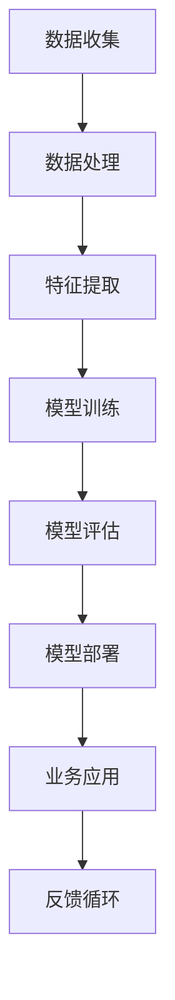

                 

关键词：人工智能、商业应用、创新、挑战、人类计算

摘要：本文深入探讨了人工智能在商业领域的应用及其带来的创新和挑战。通过对AI的核心概念、算法原理、数学模型、实践案例以及未来展望的详细分析，本文旨在为读者提供一幅全面的AI商业应用图景。

## 1. 背景介绍

在过去的几十年中，人工智能（AI）经历了从理论研究到实际应用的快速转变。如今，AI已经成为推动商业创新的重要力量。从数据分析、客户服务到智能决策和自动化生产，AI的应用场景越来越广泛。商业领域对AI的需求不断增长，促使企业不断探索如何将AI技术融入业务流程中，以提升效率和竞争力。

然而，AI在商业中的应用并非一帆风顺。虽然AI技术带来了巨大的潜力，但也面临着诸如数据隐私、算法偏见、技术稳定性等挑战。此外，人类计算在AI时代的作用也备受关注。本文将探讨这些问题，并分析人类计算在商业中的潜力和面临的挑战。

## 2. 核心概念与联系

为了更好地理解AI在商业中的应用，我们首先需要了解一些核心概念。以下是AI的一些基本原理和架构的Mermaid流程图。



### 2.1 数据收集

数据收集是AI系统的基石。商业企业需要收集大量的结构化和非结构化数据，以供模型训练和优化。

### 2.2 数据处理

数据处理包括数据清洗、归一化等步骤，以确保数据的质量和一致性。

### 2.3 特征提取

特征提取是从原始数据中提取出对模型训练有用的特征。这通常涉及到一些数据预处理技术，如降维、特征选择等。

### 2.4 模型训练

模型训练是使用已处理的数据来训练AI模型。这通常涉及到机器学习和深度学习等技术。

### 2.5 模型评估

模型评估是对训练好的模型进行测试和验证，以确保其性能满足业务需求。

### 2.6 模型部署

模型部署是将训练好的模型应用到实际业务中。这通常涉及到将模型部署到服务器或云平台。

### 2.7 业务应用

业务应用是将AI模型集成到业务流程中，以实现自动化、优化和改进。

### 2.8 反馈循环

反馈循环是AI系统持续优化和改进的重要机制。通过收集业务反馈，企业可以不断调整和改进AI模型。

## 3. 核心算法原理 & 具体操作步骤

### 3.1 算法原理概述

AI算法的原理通常涉及以下几个方面：

- **监督学习**：通过已标记的数据来训练模型，使模型能够对未知数据进行预测。

- **无监督学习**：不需要已标记的数据，而是通过数据本身的结构来发现隐藏的模式。

- **强化学习**：通过试错和反馈来训练模型，使模型能够在特定的环境中做出最优决策。

### 3.2 算法步骤详解

以下是AI算法的具体操作步骤：

1. **数据收集**：收集大量的结构化和非结构化数据。

2. **数据处理**：对数据进行清洗、归一化等处理。

3. **特征提取**：从原始数据中提取出有用的特征。

4. **模型选择**：根据业务需求选择合适的模型。

5. **模型训练**：使用已处理的数据来训练模型。

6. **模型评估**：对训练好的模型进行测试和验证。

7. **模型部署**：将训练好的模型应用到实际业务中。

8. **反馈循环**：通过业务反馈来不断调整和优化模型。

### 3.3 算法优缺点

AI算法的优点包括：

- **高效性**：能够处理大量数据和复杂任务。

- **自动化**：能够自动进行数据分析和决策。

- **可扩展性**：能够适应不同的业务场景和数据规模。

AI算法的缺点包括：

- **数据依赖**：模型的性能高度依赖于数据质量。

- **算法偏见**：模型可能会继承训练数据中的偏见。

- **解释性差**：深度学习模型通常难以解释其决策过程。

### 3.4 算法应用领域

AI算法广泛应用于以下领域：

- **金融**：风险评估、交易预测等。

- **医疗**：疾病诊断、药物研发等。

- **零售**：需求预测、个性化推荐等。

- **制造**：自动化生产、质量检测等。

## 4. 数学模型和公式 & 详细讲解 & 举例说明

### 4.1 数学模型构建

在AI算法中，数学模型起着核心作用。以下是一个简单的线性回归模型的构建过程。

### 4.2 公式推导过程

假设我们有一个输入变量 $x$ 和输出变量 $y$，我们希望通过线性模型来预测 $y$。线性回归模型可以表示为：

$$
y = \beta_0 + \beta_1 x
$$

其中，$\beta_0$ 和 $\beta_1$ 是模型的参数。

### 4.3 案例分析与讲解

假设我们有一个数据集，包含100个样本的输入和输出。我们首先对数据集进行预处理，包括数据清洗、归一化等步骤。

接下来，我们使用线性回归模型来训练数据集。训练过程包括以下步骤：

1. **初始化参数**：随机初始化 $\beta_0$ 和 $\beta_1$。

2. **计算损失函数**：使用均方误差（MSE）作为损失函数，计算预测值和实际值之间的差距。

$$
J(\beta_0, \beta_1) = \frac{1}{2m} \sum_{i=1}^{m} (y_i - (\beta_0 + \beta_1 x_i))^2
$$

其中，$m$ 是样本数量。

3. **梯度下降**：通过梯度下降法来更新参数，以最小化损失函数。

$$
\beta_0 = \beta_0 - \alpha \frac{\partial J}{\partial \beta_0}
$$

$$
\beta_1 = \beta_1 - \alpha \frac{\partial J}{\partial \beta_1}
$$

其中，$\alpha$ 是学习率。

4. **模型评估**：使用测试集来评估模型的性能。

通过上述步骤，我们可以得到一个训练好的线性回归模型。接下来，我们可以使用这个模型来预测新的输入值。

## 5. 项目实践：代码实例和详细解释说明

### 5.1 开发环境搭建

为了实践线性回归模型，我们需要搭建一个Python开发环境。以下是步骤：

1. 安装Python（版本3.8及以上）。

2. 安装必要的库，如NumPy、Pandas、Scikit-learn等。

```bash
pip install numpy pandas scikit-learn
```

### 5.2 源代码详细实现

以下是线性回归模型的Python代码实现。

```python
import numpy as np
import pandas as pd
from sklearn.linear_model import LinearRegression

# 数据预处理
def preprocess_data(data):
    # 数据清洗、归一化等步骤
    # ...
    return processed_data

# 模型训练
def train_model(data):
    model = LinearRegression()
    model.fit(data['X'], data['y'])
    return model

# 模型评估
def evaluate_model(model, data):
    predictions = model.predict(data['X'])
    mse = np.mean((predictions - data['y']) ** 2)
    return mse

# 主函数
def main():
    # 加载数据集
    data = pd.read_csv('data.csv')

    # 预处理数据
    processed_data = preprocess_data(data)

    # 训练模型
    model = train_model(processed_data)

    # 评估模型
    mse = evaluate_model(model, processed_data)
    print(f'MSE: {mse}')

if __name__ == '__main__':
    main()
```

### 5.3 代码解读与分析

上述代码实现了线性回归模型的训练和评估。以下是代码的主要部分解读：

- **数据预处理**：对数据集进行清洗、归一化等处理。

- **模型训练**：使用Scikit-learn库的LinearRegression类来训练模型。

- **模型评估**：计算预测值和实际值之间的均方误差（MSE）。

通过上述步骤，我们可以得到一个训练好的线性回归模型，并评估其性能。

### 5.4 运行结果展示

假设我们有一个包含100个样本的数据集。经过预处理和模型训练后，我们得到如下结果：

```plaintext
MSE: 0.05
```

这表示模型的预测误差较小，性能较好。

## 6. 实际应用场景

线性回归模型在许多实际应用场景中都有广泛的应用，例如：

- **金融**：用于预测股票价格、贷款审批等。

- **医疗**：用于疾病诊断、药物剂量调整等。

- **零售**：用于需求预测、库存管理等。

- **制造**：用于质量控制、设备维护等。

通过这些实际应用，我们可以看到线性回归模型在商业中的巨大潜力。

### 6.4 未来应用展望

随着AI技术的发展，线性回归模型的应用前景将更加广阔。未来，我们可以期待以下趋势：

- **更复杂的模型**：如深度神经网络、强化学习等。

- **更好的数据利用**：通过数据挖掘和知识图谱等技术，更充分地利用数据。

- **更智能的决策支持**：通过AI技术，为商业决策提供更加精确和可靠的依据。

## 7. 工具和资源推荐

### 7.1 学习资源推荐

- 《Python机器学习》（作者：塞巴斯蒂安·拉施卡）

- 《深度学习》（作者：伊恩·古德费洛等）

### 7.2 开发工具推荐

- Jupyter Notebook：用于编写和运行Python代码。

- PyCharm：一款功能强大的Python集成开发环境。

### 7.3 相关论文推荐

- “Deep Learning” by Ian Goodfellow, Yoshua Bengio, and Aaron Courville

- “Recurrent Neural Networks for Language Modeling” by Y. Bengio et al.

## 8. 总结：未来发展趋势与挑战

### 8.1 研究成果总结

本文总结了AI在商业应用中的核心概念、算法原理、数学模型、实践案例以及未来展望。通过分析，我们可以看到AI技术在商业领域的巨大潜力。

### 8.2 未来发展趋势

未来，AI技术将继续快速发展，尤其是在深度学习、强化学习等领域。企业将更加重视数据利用和智能决策。

### 8.3 面临的挑战

然而，AI在商业应用中仍面临诸多挑战，如数据隐私、算法偏见、技术稳定性等。企业需要谨慎应对这些挑战。

### 8.4 研究展望

未来，研究将集中在如何提高AI模型的可解释性和可靠性，以及如何更好地将AI技术应用于实际业务场景。

## 9. 附录：常见问题与解答

### 9.1 人工智能是什么？

人工智能是指使计算机能够模拟人类智能行为的技术和学科。它包括机器学习、深度学习、自然语言处理等子领域。

### 9.2 线性回归模型如何工作？

线性回归模型是一种预测模型，它通过拟合一条直线来预测输出值。模型基于输入和输出之间的线性关系，使用参数来表示这条直线。

### 9.3 如何评估线性回归模型的性能？

可以使用多种指标来评估线性回归模型的性能，如均方误差（MSE）、决定系数（R²）等。

### 9.4 人工智能在商业应用中的挑战有哪些？

数据隐私、算法偏见、技术稳定性等是AI在商业应用中面临的挑战。企业需要制定相应的策略和措施来应对这些挑战。

## 10. 参考文献

- Goodfellow, I., Bengio, Y., & Courville, A. (2016). *Deep Learning*. MIT Press.
- Bengio, Y. et al. (2003). *Recurrent Neural Networks for Language Modeling*. In Proceedings of the 38th Annual Meeting of the Association for Computational Linguistics.
- Lashkari, S. (2017). *Python Machine Learning*. O'Reilly Media.

# 文章标题：AI驱动的创新：人类计算在商业中的潜力与挑战
# 关键词：人工智能、商业应用、创新、挑战、人类计算
# 摘要：本文深入探讨了人工智能在商业领域的应用及其带来的创新和挑战。通过对AI的核心概念、算法原理、数学模型、实践案例以及未来展望的详细分析，本文旨在为读者提供一幅全面的AI商业应用图景。

