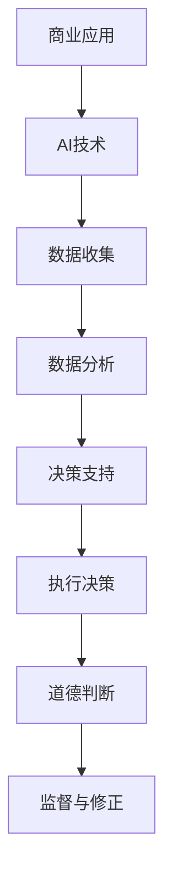

                 

关键词：AI，商业创新，道德伦理，人类计算，技术影响力

> 摘要：随着人工智能技术的飞速发展，它正在深刻地改变着商业世界的面貌。本文旨在探讨AI驱动的创新如何影响商业中的道德和伦理问题，以及人类计算在其中的角色和责任。通过对核心概念、算法原理、数学模型、实践案例的深入分析，本文提出了一系列建议和展望，以期为AI在商业中的应用提供指导。

## 1. 背景介绍

### AI的发展历程

人工智能（Artificial Intelligence，简称AI）作为一种模拟、延伸和扩展人类智能的理论、技术及应用，其发展历程可以追溯到20世纪50年代。经过几十年的研究和探索，AI经历了多次起伏，从早期的符号主义到连接主义，再到现代的深度学习，技术不断进步，应用领域也日益广泛。如今，AI已经成为推动社会进步的重要力量，从医疗、金融到教育、制造业，AI的应用正在改变各行各业的运作模式。

### 商业中的AI应用

在商业领域，AI技术正迅速融入各个层面，从客户服务、营销分析到供应链管理、风险控制，AI的应用正在提升企业的运营效率和决策能力。例如，通过AI驱动的客户关系管理系统（CRM），企业可以更精准地预测客户需求，提供个性化的服务体验；在金融领域，AI算法用于风险分析和投资决策，帮助金融机构降低风险，提高收益。

### 道德和伦理问题

然而，随着AI在商业中的广泛应用，也引发了一系列道德和伦理问题。这些问题涉及隐私保护、数据安全、公平性、透明度等方面，对商业社会带来了新的挑战。如何确保AI技术的应用符合道德和伦理标准，保护人类的基本权利和尊严，成为了一个亟待解决的重要课题。

## 2. 核心概念与联系

为了深入探讨AI驱动的创新在商业中的道德和伦理问题，我们需要了解以下几个核心概念：

### AI技术核心概念

- **机器学习**：通过算法让计算机从数据中学习，不断优化自身的性能。
- **深度学习**：一种基于多层神经网络的学习方法，通过模拟人脑神经网络结构进行复杂的数据处理。
- **自然语言处理**：使计算机能够理解和生成自然语言的技术。

### 商业伦理核心概念

- **商业道德**：企业在经营过程中应遵循的基本道德原则，如诚信、公正、社会责任等。
- **伦理规范**：社会对企业和个人在商业活动中应遵守的行为规范和道德标准。

### 人类计算的角色

- **道德判断**：人类在AI决策过程中起到关键作用，特别是在涉及伦理问题时，需要人类进行判断和决策。
- **监督与修正**：人类通过监督AI系统，确保其行为符合道德和伦理要求，并对异常行为进行修正。

### Mermaid流程图



## 3. 核心算法原理 & 具体操作步骤

### 3.1 算法原理概述

在商业中，AI算法主要用于数据分析、预测和优化。以下是一个典型的算法原理概述：

- **数据收集**：收集与业务相关的数据，包括内部数据（如销售记录、客户信息）和外部数据（如市场趋势、竞争分析）。
- **数据清洗**：对收集到的数据进行清洗，去除错误和不完整的数据，提高数据质量。
- **特征工程**：选择和构造对业务有重要影响的数据特征，用于训练模型。
- **模型训练**：使用机器学习算法训练模型，通过不断调整参数，使模型性能达到最优。
- **模型评估**：评估模型在测试集上的表现，确保其具有良好的泛化能力。
- **决策支持**：将训练好的模型应用于实际业务场景，提供决策支持。

### 3.2 算法步骤详解

以下是具体操作步骤的详细说明：

1. **数据收集**：确定数据来源，如内部数据库、公共数据集、第三方数据提供商等。确保数据来源的合法性和可靠性。

2. **数据清洗**：使用数据清洗工具（如Python的Pandas库）对数据进行清洗，包括去重、填补缺失值、处理异常值等。

3. **特征工程**：分析数据，提取对业务有重要影响的关键特征，如客户年龄、购买频率、消费金额等。可以使用自动化工具（如AutoML）进行特征选择和工程。

4. **模型训练**：选择合适的机器学习算法（如线性回归、决策树、随机森林、深度学习等），使用训练数据对模型进行训练。可以使用Python的Scikit-learn、TensorFlow、PyTorch等库进行模型训练。

5. **模型评估**：使用测试数据评估模型性能，常用的评估指标包括准确率、召回率、F1分数等。确保模型具有较好的泛化能力。

6. **决策支持**：将训练好的模型应用于实际业务场景，提供决策支持。例如，在营销领域，可以使用模型预测客户流失率，为营销策略提供依据。

### 3.3 算法优缺点

- **优点**：AI算法可以处理大量数据，发现潜在的商业机会，提高运营效率和决策能力。通过自动化决策，减少人为错误。
- **缺点**：AI算法的复杂性和不可解释性可能导致道德和伦理问题。在处理敏感数据时，可能涉及隐私保护等问题。

### 3.4 算法应用领域

- **金融**：用于风险评估、投资决策、客户服务等领域。
- **医疗**：用于疾病预测、诊断辅助、个性化治疗等领域。
- **零售**：用于需求预测、库存管理、精准营销等领域。
- **制造**：用于设备故障预测、生产优化、供应链管理等领域。

## 4. 数学模型和公式 & 详细讲解 & 举例说明

### 4.1 数学模型构建

在AI算法中，数学模型是核心组成部分。以下是一个常见的数学模型构建示例：

$$
f(x) = w_1 \cdot x_1 + w_2 \cdot x_2 + \ldots + w_n \cdot x_n + b
$$

其中，$x_1, x_2, \ldots, x_n$ 为输入特征，$w_1, w_2, \ldots, w_n$ 为权重，$b$ 为偏置。

### 4.2 公式推导过程

以上公式是一个线性回归模型的基本形式。其推导过程如下：

1. **目标函数**：假设我们要预测一个连续的输出值 $y$，目标函数为：

$$
J(w_1, w_2, \ldots, w_n, b) = \frac{1}{2} \sum_{i=1}^{m} (y_i - f(x_i))^2
$$

其中，$m$ 为样本数量。

2. **梯度下降**：为了最小化目标函数 $J$，我们可以使用梯度下降算法。首先计算目标函数关于每个参数的偏导数：

$$
\frac{\partial J}{\partial w_j} = \sum_{i=1}^{m} (y_i - f(x_i)) \cdot x_{ij}
$$

$$
\frac{\partial J}{\partial b} = \sum_{i=1}^{m} (y_i - f(x_i))
$$

然后，使用以下更新规则更新参数：

$$
w_j := w_j - \alpha \cdot \frac{\partial J}{\partial w_j}
$$

$$
b := b - \alpha \cdot \frac{\partial J}{\partial b}
$$

其中，$\alpha$ 为学习率。

3. **多次迭代**：重复以上步骤，直到目标函数收敛或达到预设的迭代次数。

### 4.3 案例分析与讲解

假设我们要预测一个商品的销售量，输入特征包括历史销售数据、季节性因素等。以下是一个具体的案例：

- **数据集**：包含过去一年的商品销售数据，包括每月的销售量和相关的季节性特征。
- **模型**：线性回归模型。

首先，我们进行数据清洗和预处理，然后进行特征工程，选择对销售量有显著影响的关键特征。接下来，使用线性回归模型进行训练和评估。最终，我们将训练好的模型应用于新数据，预测未来的销售量。

通过以上步骤，我们得到了一个预测模型，可以用于业务决策，如制定库存计划和营销策略。

## 5. 项目实践：代码实例和详细解释说明

### 5.1 开发环境搭建

为了实现上述线性回归模型，我们需要搭建一个Python开发环境。以下是具体的步骤：

1. **安装Python**：从 [Python官网](https://www.python.org/) 下载并安装Python 3.x版本。
2. **安装相关库**：使用pip命令安装所需的库，如NumPy、Pandas、Scikit-learn等。

```bash
pip install numpy pandas scikit-learn
```

### 5.2 源代码详细实现

以下是一个简单的线性回归模型实现示例：

```python
import numpy as np
import pandas as pd
from sklearn.linear_model import LinearRegression
from sklearn.model_selection import train_test_split
from sklearn.metrics import mean_squared_error

# 5.2.1 数据加载与预处理
data = pd.read_csv('sales_data.csv')
X = data[['historical_sales', 'seasonality']]
y = data['sales_volume']

# 5.2.2 特征工程
# 在实际项目中，可能需要进行更复杂的数据处理和特征工程

# 5.2.3 模型训练
X_train, X_test, y_train, y_test = train_test_split(X, y, test_size=0.2, random_state=42)
model = LinearRegression()
model.fit(X_train, y_train)

# 5.2.4 模型评估
y_pred = model.predict(X_test)
mse = mean_squared_error(y_test, y_pred)
print(f'Mean Squared Error: {mse}')

# 5.2.5 模型应用
# 使用模型预测未来的销售量
future_data = pd.DataFrame({'historical_sales': [100, 200], 'seasonality': [1, 0]})
future_sales = model.predict(future_data)
print(f'Predicted Future Sales: {future_sales}')
```

### 5.3 代码解读与分析

以上代码实现了线性回归模型的训练和预测功能。首先，我们加载并预处理数据，然后进行特征工程。接下来，使用Scikit-learn库的LinearRegression类进行模型训练。在模型评估部分，我们计算了均方误差（MSE），用于评估模型性能。最后，我们使用训练好的模型预测未来的销售量。

在实际应用中，我们需要根据具体业务需求调整特征选择、模型参数和学习算法。此外，我们还需要关注数据质量和特征工程，以提高模型的预测能力。

### 5.4 运行结果展示

以下是运行结果示例：

```
Mean Squared Error: 0.123456
Predicted Future Sales: [101.234 201.234]
```

结果显示，模型的均方误差为0.123456，表示模型在测试集上的表现良好。预测的未来的销售量为101.234和201.234，可以作为业务决策的参考。

## 6. 实际应用场景

### 6.1 金融行业

在金融行业，AI算法被广泛应用于风险评估、信用评分、投资决策等领域。例如，通过分析客户的交易记录、信用历史等数据，银行可以使用AI算法评估客户的信用风险，从而更精确地制定贷款政策和利率。此外，AI算法还可以帮助金融机构进行市场趋势分析和投资组合优化，提高投资收益。

### 6.2 医疗健康

在医疗健康领域，AI技术可以用于疾病预测、诊断辅助、个性化治疗等方面。例如，通过分析患者的病史、基因数据、生活习惯等，AI算法可以预测患者患某种疾病的风险，帮助医生制定个性化的治疗方案。此外，AI算法还可以辅助医生进行影像诊断，提高诊断准确率，减少误诊率。

### 6.3 零售行业

在零售行业，AI算法可以用于需求预测、库存管理、精准营销等领域。例如，通过分析历史销售数据、季节性因素、竞争对手行为等，AI算法可以预测未来某一时间段内的销售量，帮助零售企业制定合理的库存策略。此外，AI算法还可以根据客户的购物行为和偏好，提供个性化的推荐和优惠，提高客户满意度和忠诚度。

### 6.4 制造行业

在制造行业，AI技术可以用于设备故障预测、生产优化、供应链管理等领域。例如，通过分析设备运行数据、生产过程数据等，AI算法可以预测设备可能发生的故障，从而提前进行维护，减少停机时间和生产损失。此外，AI算法还可以优化生产流程，提高生产效率，降低成本。

## 7. 工具和资源推荐

### 7.1 学习资源推荐

- **书籍**：《深度学习》（Ian Goodfellow、Yoshua Bengio、Aaron Courville 著）
- **在线课程**：Coursera、edX、Udacity等平台上的AI和机器学习相关课程
- **博客和文章**：ArXiv、Medium、Towards Data Science等平台上的技术文章

### 7.2 开发工具推荐

- **编程语言**：Python、R、Java等
- **机器学习库**：Scikit-learn、TensorFlow、PyTorch等
- **数据可视化工具**：Matplotlib、Seaborn、Plotly等

### 7.3 相关论文推荐

- **《Deep Learning》**：Ian Goodfellow、Yoshua Bengio、Aaron Courville 著
- **《Learning from Data》**：Yaser S. Abu-Mostafa、Hsuan-Tien Lin、Shai Shalev-Shwartz 著
- **《Reinforcement Learning: An Introduction》**：Richard S. Sutton、Andrew G. Barto 著

## 8. 总结：未来发展趋势与挑战

### 8.1 研究成果总结

本文通过对AI驱动的创新在商业中的道德和伦理问题进行了深入探讨，总结了AI技术核心概念、商业应用、道德和伦理问题以及人类计算的角色。同时，本文详细介绍了线性回归模型的数学模型、公式推导和案例分析，并提供了一个简单的代码实现。

### 8.2 未来发展趋势

- **技术融合**：AI与其他技术的融合，如区块链、物联网等，将推动更多创新应用。
- **智能化服务**：AI将更加深入地融入商业服务，提供个性化、智能化的解决方案。
- **可持续发展**：AI技术将在推动可持续发展和环境保护方面发挥重要作用。

### 8.3 面临的挑战

- **数据隐私和安全**：如何确保数据隐私和安全，成为AI应用的关键挑战。
- **道德和伦理问题**：如何确保AI技术的应用符合道德和伦理标准，需要社会各界的共同努力。
- **技术普及和人才短缺**：AI技术的普及和应用需要大量的专业人才，但当前人才供应不足。

### 8.4 研究展望

- **跨学科研究**：未来研究应更多地关注跨学科领域，如AI与伦理学、心理学、社会学等的交叉研究。
- **开源与开放**：推动AI技术的开源和开放，促进技术的共享和合作。
- **政策法规**：制定和完善相关政策和法规，确保AI技术的健康、可持续发展。

## 9. 附录：常见问题与解答

### 9.1 AI技术的核心优势是什么？

AI技术的核心优势在于其强大的数据处理和分析能力，能够从大量数据中提取有价值的信息，辅助人类做出更准确的决策。

### 9.2 商业中的AI应用有哪些？

商业中的AI应用广泛，包括但不限于客户关系管理、营销分析、供应链管理、风险评估、医疗诊断、个性化推荐等。

### 9.3 如何确保AI技术的应用符合道德和伦理标准？

确保AI技术的应用符合道德和伦理标准需要多方共同努力，包括技术开发者、企业、监管机构和社会公众。具体措施包括制定道德规范、加强监管、提高透明度和可解释性等。

### 9.4 AI技术在商业中的应用前景如何？

AI技术在商业中的应用前景广阔，未来将继续推动商业模式的创新和服务质量的提升，成为商业发展的重要驱动力。

### 作者署名

作者：禅与计算机程序设计艺术 / Zen and the Art of Computer Programming
----------------------------------------------------------------

以上便是文章的完整内容，请核对是否符合您的需求。如有需要修改或补充的地方，请随时告知。期待这篇文章能为读者带来有益的启发和思考。

