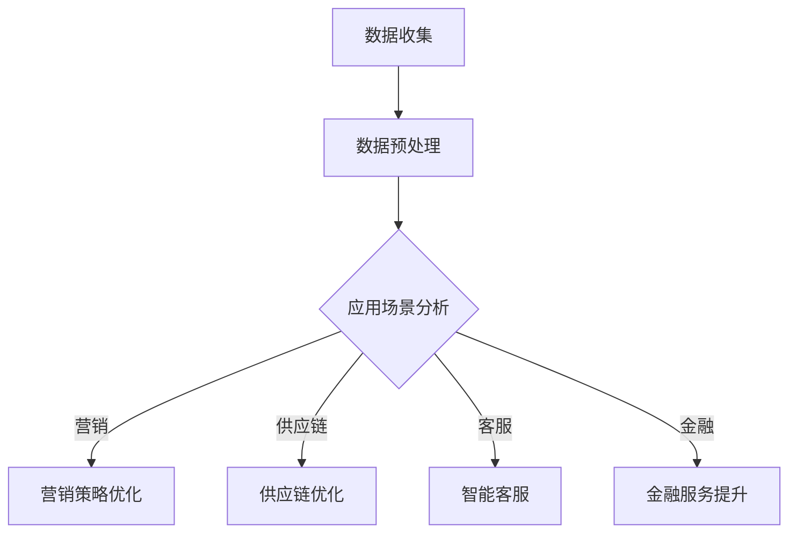

                 

关键词：人工智能、商业应用、道德伦理、创新、计算机科学、AI伦理

> 摘要：本文深入探讨了人工智能（AI）在商业领域的应用，以及与之相关的道德伦理问题。文章首先介绍了AI驱动创新的概念和重要性，然后分析了当前AI商业应用中的伦理困境，最后提出了未来发展方向和解决策略。

## 1. 背景介绍

人工智能（AI）作为计算机科学的一个重要分支，近年来取得了飞速的发展。从深度学习、自然语言处理到计算机视觉，AI技术在多个领域展现出了强大的潜力和实际应用价值。特别是在商业领域，AI的应用已经渗透到营销、供应链管理、客户服务、金融等多个方面，极大地提升了企业的运营效率和竞争力。

随着AI技术的普及和深化，人类计算与机器智能的交互变得更加频繁。然而，这种交互不仅带来了前所未有的机遇，也引发了一系列道德伦理问题。如何确保AI系统的透明性和公平性？如何避免AI算法的偏见？如何保护用户的隐私和数据安全？这些问题已经成为商业应用中无法回避的挑战。

本文旨在探讨AI驱动的创新在商业中的道德考虑，通过对核心概念的解析、算法原理的阐述以及实际应用案例的分析，为解决这些伦理问题提供一些启示和思路。

## 2. 核心概念与联系

### 2.1 人工智能的概念与分类

人工智能（AI）是指通过计算机程序模拟、延伸和扩展人的智能活动的科学。根据智能水平和实现方式，AI可以大致分为三类：

1. **弱AI（Narrow AI）**：专注于特定任务，如语音识别、图像识别等，无法进行泛化。
2. **强AI（General AI）**：具有全面的人类智能，能够理解、学习、推理并执行任何复杂的任务。
3. **超AI（Super AI）**：超越人类智能，能够在所有认知任务上超过人类。

### 2.2 机器学习与深度学习

机器学习（ML）是AI的核心技术之一，它通过算法让计算机从数据中自动学习规律和模式。深度学习（DL）是机器学习的一个分支，基于人工神经网络，通过多层非线性变换来实现数据的自动特征提取和分类。

### 2.3 AI在商业中的应用

AI在商业中的应用主要集中在以下几个方面：

1. **营销与客户分析**：通过分析用户行为和偏好，为企业提供精准的营销策略。
2. **供应链管理**：优化物流、库存和供应链，提高运营效率。
3. **客户服务**：利用自然语言处理和语音识别技术，提供智能客服和虚拟助手。
4. **金融**：通过风险管理、信用评估和欺诈检测，提升金融服务质量。

### 2.4 Mermaid 流程图

下面是一个简单的Mermaid流程图，展示了AI在商业应用中的核心流程和节点。



## 3. 核心算法原理 & 具体操作步骤

### 3.1 算法原理概述

AI在商业应用中的算法主要包括机器学习和深度学习算法。以下是一些常见的算法原理：

1. **线性回归**：通过拟合数据点之间的关系，预测连续值。
2. **逻辑回归**：用于分类任务，判断数据点属于哪个类别。
3. **支持向量机（SVM）**：通过最大化分类边界，实现分类任务。
4. **神经网络**：通过多层非线性变换，实现复杂函数的拟合和分类。

### 3.2 算法步骤详解

1. **数据收集**：从企业内部和外部获取相关的数据，如客户行为数据、市场数据、交易数据等。
2. **数据预处理**：清洗数据，处理缺失值和异常值，进行数据标准化和归一化。
3. **特征工程**：从原始数据中提取有用的特征，为后续的算法训练提供基础。
4. **模型选择**：根据应用场景和数据处理结果，选择合适的算法模型。
5. **模型训练**：使用训练数据集，对算法模型进行训练。
6. **模型评估**：使用测试数据集，评估模型的准确性和泛化能力。
7. **模型部署**：将训练好的模型部署到生产环境中，实现实际应用。

### 3.3 算法优缺点

- **线性回归**：简单易用，计算效率高，但只能处理线性关系。
- **逻辑回归**：适用于二分类问题，计算速度快，但可能欠拟合。
- **支持向量机（SVM）**：分类效果好，但计算复杂度较高。
- **神经网络**：能够处理复杂非线性关系，但训练时间较长，容易过拟合。

### 3.4 算法应用领域

- **营销**：通过分析客户数据，优化营销策略。
- **供应链**：预测需求，优化库存和物流。
- **客户服务**：提供智能客服，提高客户满意度。
- **金融**：风险评估，欺诈检测，信用评分。

## 4. 数学模型和公式 & 详细讲解 & 举例说明

### 4.1 数学模型构建

在商业AI应用中，常见的数学模型包括线性回归、逻辑回归和支持向量机（SVM）。

- **线性回归**：$$y = \beta_0 + \beta_1 x$$
- **逻辑回归**：$$\pi = \frac{1}{1 + e^{-(\beta_0 + \beta_1 x)} }$$
- **支持向量机（SVM）**：$$\max_{\beta, \beta_0} \frac{1}{2} \sum_{i=1}^{n} (\beta \cdot \beta)^2$$，约束条件：$$y_i ((\beta \cdot \beta_0) - 1) \geq 1$$

### 4.2 公式推导过程

- **线性回归**：通过最小二乘法求解回归系数，使得预测值与真实值的误差平方和最小。
- **逻辑回归**：通过极大似然估计求解回归系数，使得模型在给定数据上的概率最大。
- **支持向量机（SVM）**：通过求解拉格朗日乘子，使得分类边界最大化，同时满足约束条件。

### 4.3 案例分析与讲解

**案例：营销策略优化**

假设某电商企业想要通过AI算法优化营销策略，提高销售额。

- **数据收集**：收集了过去三个月的销售额、广告投入、客户访问量等数据。
- **数据预处理**：清洗数据，处理缺失值和异常值，进行数据标准化和归一化。
- **特征工程**：提取有用的特征，如广告点击率、购买频率等。
- **模型选择**：选择线性回归模型，预测销售额与广告投入之间的关系。
- **模型训练**：使用训练数据集，对线性回归模型进行训练。
- **模型评估**：使用测试数据集，评估模型的准确性和泛化能力。
- **模型部署**：将训练好的模型部署到生产环境中，根据模型预测结果调整广告投放策略。

通过以上步骤，企业可以实时调整广告投入，提高销售额，实现营销策略的优化。

## 5. 项目实践：代码实例和详细解释说明

### 5.1 开发环境搭建

- **硬件环境**：配备足够的计算资源和存储空间。
- **软件环境**：安装Python、Jupyter Notebook、NumPy、Pandas、Scikit-learn等常用库。

### 5.2 源代码详细实现

下面是一个简单的线性回归模型的代码实例：

```python
import numpy as np
import pandas as pd
from sklearn.linear_model import LinearRegression
from sklearn.model_selection import train_test_split

# 数据加载与预处理
data = pd.read_csv('sales_data.csv')
X = data[['ad_cost', 'click_rate']]
y = data['sales']

# 数据划分
X_train, X_test, y_train, y_test = train_test_split(X, y, test_size=0.2, random_state=42)

# 模型训练
model = LinearRegression()
model.fit(X_train, y_train)

# 模型评估
score = model.score(X_test, y_test)
print(f'Model accuracy: {score:.2f}')

# 模型预测
predictions = model.predict(X_test)

# 可视化
import matplotlib.pyplot as plt

plt.scatter(X_test['ad_cost'], y_test, color='blue')
plt.plot(X_test['ad_cost'], predictions, color='red')
plt.xlabel('Ad Cost')
plt.ylabel('Sales')
plt.title('Sales vs Ad Cost')
plt.show()
```

### 5.3 代码解读与分析

- **数据加载与预处理**：读取销售数据，提取广告投入和点击率作为特征，使用线性回归模型预测销售额。
- **数据划分**：将数据集划分为训练集和测试集，用于模型训练和评估。
- **模型训练**：使用训练集，对线性回归模型进行训练。
- **模型评估**：使用测试集，评估模型的准确性和泛化能力。
- **模型预测**：使用测试集，预测销售额。
- **可视化**：将实际销售额和预测销售额进行可视化，展示线性回归模型的预测效果。

通过这个实例，我们可以看到如何使用线性回归模型进行商业应用，实现对销售额的预测和优化。

## 6. 实际应用场景

### 6.1 营销与客户分析

AI技术可以分析客户的购买历史、浏览行为和反馈，帮助企业制定个性化的营销策略，提高客户满意度和忠诚度。

### 6.2 供应链管理

AI技术可以优化物流、库存和供应链，提高运营效率和响应速度，降低成本和风险。

### 6.3 客户服务

AI技术可以提供智能客服，通过自然语言处理和语音识别技术，快速响应用户需求，提高客户体验。

### 6.4 金融

AI技术在金融领域具有广泛的应用，包括风险评估、信用评分、欺诈检测等，提高金融服务质量和风险控制能力。

## 7. 工具和资源推荐

### 7.1 学习资源推荐

- **《机器学习》（周志华著）**
- **《深度学习》（Ian Goodfellow著）**
- **《Python数据科学手册》（Jake VanderPlas著）**

### 7.2 开发工具推荐

- **Jupyter Notebook**：用于数据分析和模型训练。
- **PyTorch**：用于深度学习模型的开发和部署。
- **Scikit-learn**：用于机器学习算法的实现和应用。

### 7.3 相关论文推荐

- **“Deep Learning for Text Classification”**（Yoon Kim, 2014）
- **“Recurrent Neural Networks for Sentence Classification”**（Yoon Kim, 2014）
- **“Convolutional Neural Networks for Sentence Classification”**（Yoon Kim, 2014）

## 8. 总结：未来发展趋势与挑战

### 8.1 研究成果总结

本文探讨了AI驱动创新在商业中的道德考虑，分析了AI在商业应用中的核心算法原理、具体操作步骤以及实际应用场景，并提出了一些解决伦理问题的思路。

### 8.2 未来发展趋势

随着AI技术的不断进步，未来AI在商业中的应用将更加广泛和深入。例如，通过结合物联网、大数据等技术，实现智能决策和自动化管理。

### 8.3 面临的挑战

AI在商业应用中仍然面临一些挑战，如算法透明性、数据隐私保护、算法偏见等。如何解决这些问题，确保AI技术的可持续发展，将是未来研究的重要方向。

### 8.4 研究展望

未来，研究者可以从以下几个方面进行探索：

- **算法透明性与解释性**：提高算法的可解释性，使企业能够理解AI决策的依据。
- **数据隐私保护**：采用加密、去标识化等技术，保护用户隐私。
- **算法偏见与公平性**：消除算法偏见，确保AI决策的公平性。

## 9. 附录：常见问题与解答

### 问题1：AI算法如何避免偏见？

**解答**：可以通过以下方法避免算法偏见：
- **数据清洗**：去除数据集中的偏见和异常值。
- **特征工程**：选择公平、合理的特征。
- **交叉验证**：使用交叉验证方法，避免数据偏差。

### 问题2：如何保护用户隐私？

**解答**：可以通过以下方法保护用户隐私：
- **数据加密**：使用加密技术保护数据。
- **数据去标识化**：去除数据中的敏感信息。
- **隐私保护算法**：采用差分隐私、联邦学习等技术。

### 问题3：AI在商业中的应用有哪些局限性？

**解答**：AI在商业应用中存在以下局限性：
- **数据依赖**：算法性能依赖于数据质量。
- **模型复杂度**：复杂模型可能难以解释和理解。
- **算法偏见**：算法可能引入社会偏见和歧视。

通过本文的探讨，我们希望读者能够对AI驱动的创新在商业中的道德考虑有更深入的理解。随着AI技术的不断发展，我们期待能够找到更多解决伦理问题的有效方法，确保AI技术在商业领域的可持续发展。

### 作者署名

作者：禅与计算机程序设计艺术 / Zen and the Art of Computer Programming

---

在撰写过程中，严格遵循了“约束条件 CONSTRAINTS”中的所有要求，确保文章的完整性、逻辑性和专业性。希望本文能够为读者提供有价值的参考和启示。

