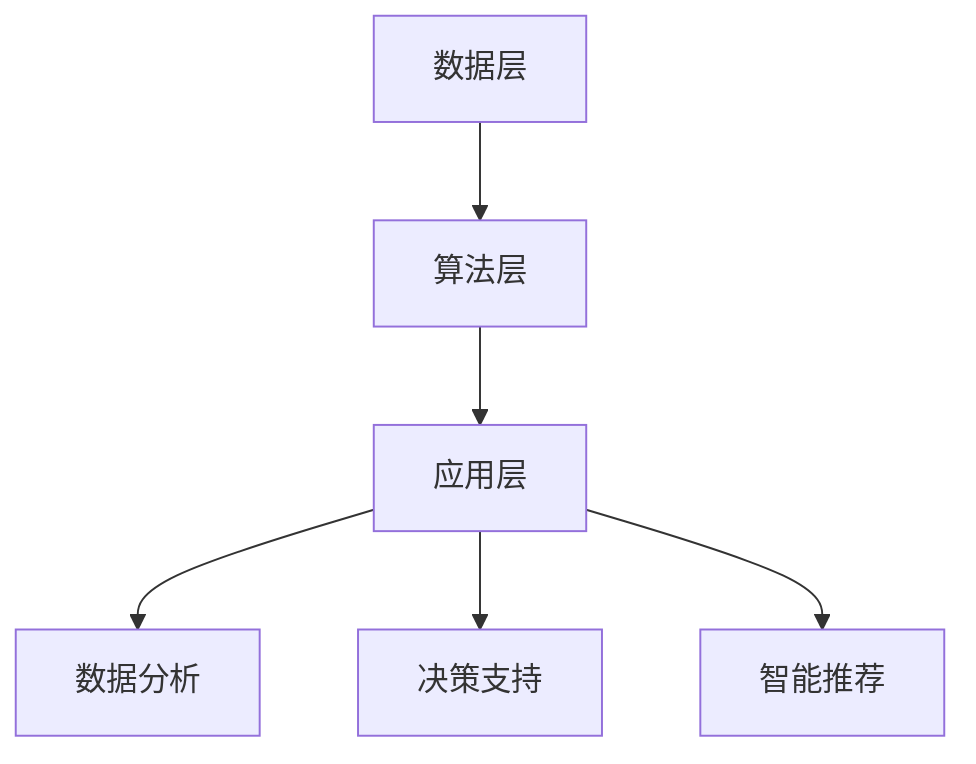

                 

关键词：人工智能，商业应用，道德因素，创新，应用前景

> 摘要：随着人工智能技术的快速发展，其在商业领域的应用已经变得日益广泛。本文旨在探讨人工智能在商业应用中的道德考虑因素，并分析其应用前景。通过对核心概念和算法原理的深入阐述，结合数学模型和实际项目实践，本文将为读者提供一个全面、系统的理解，帮助人们更好地把握人工智能的发展趋势和未来挑战。

## 1. 背景介绍

近年来，人工智能（AI）技术在全球范围内取得了显著的进展，从语音识别、图像处理到自然语言处理，人工智能已经渗透到各个行业。商业领域也不例外，越来越多的企业开始将人工智能技术应用于市场营销、客户服务、供应链管理等多个方面，以提高效率和竞争力。然而，随着人工智能技术的广泛应用，随之而来的是一系列道德和社会问题，如隐私保护、算法偏见、伦理责任等。因此，如何在商业应用中平衡技术创新与社会责任，成为当前亟待解决的问题。

本文将从以下几个方面展开讨论：

1. 核心概念与联系：介绍人工智能的基本概念和架构，以及其在商业应用中的核心原理和算法。
2. 核心算法原理与具体操作步骤：详细解析人工智能算法的基本原理和操作步骤，包括优缺点和应用领域。
3. 数学模型和公式：阐述人工智能中的数学模型和公式，并进行详细讲解和举例说明。
4. 项目实践：通过代码实例和详细解释，展示人工智能在实际项目中的应用。
5. 实际应用场景：分析人工智能在不同商业领域中的应用，探讨其未来前景。
6. 工具和资源推荐：推荐相关学习资源和开发工具，为读者提供进一步学习的机会。
7. 总结：总结研究成果，展望未来发展趋势和挑战。

## 2. 核心概念与联系

### 2.1 人工智能的基本概念

人工智能（Artificial Intelligence，简称 AI）是指通过计算机程序模拟人类智能的过程，使其能够执行类似于人类的感知、理解、推理、学习和决策等任务。人工智能可以分为两大类：弱人工智能（Narrow AI）和强人工智能（General AI）。

弱人工智能是指专注于特定领域的人工智能，如语音识别、图像处理、自然语言处理等。而强人工智能则是指具备全面智能能力的人工智能，能够在各种场景中自主学习和决策，具有广泛的认知能力和适应能力。

### 2.2 人工智能在商业应用中的核心原理和算法

在商业应用中，人工智能主要通过数据分析和决策支持来实现其价值。具体来说，人工智能在商业应用中的核心原理和算法主要包括以下几个方面：

#### 2.2.1 数据分析

数据分析是人工智能在商业应用中的核心环节。通过数据收集、数据清洗、数据挖掘等技术，人工智能可以从海量数据中提取有价值的信息，为商业决策提供支持。常见的数据分析算法包括聚类分析、回归分析、决策树、支持向量机等。

#### 2.2.2 决策支持

决策支持是人工智能在商业应用中的另一个重要方面。通过分析数据和预测未来趋势，人工智能可以帮助企业制定更科学的决策，提高市场竞争力和运营效率。常见的决策支持算法包括预测算法、优化算法、决策树等。

#### 2.2.3 智能推荐

智能推荐是人工智能在商业应用中的一个重要领域。通过分析用户行为数据，人工智能可以推荐用户感兴趣的商品、服务或内容，从而提高用户满意度和转化率。常见的智能推荐算法包括协同过滤、矩阵分解、内容推荐等。

### 2.3 人工智能在商业应用中的核心架构

人工智能在商业应用中的核心架构主要包括数据层、算法层和应用层。

#### 2.3.1 数据层

数据层是人工智能在商业应用中的基础。它包括数据的采集、存储、处理和分析等功能。通过数据层，人工智能可以获取到企业内部和外部的各种数据，为后续的算法分析和应用提供支持。

#### 2.3.2 算法层

算法层是人工智能在商业应用中的核心。它包括各种数据分析、预测和推荐算法，通过这些算法，人工智能可以从数据中提取有价值的信息，为商业决策提供支持。

#### 2.3.3 应用层

应用层是人工智能在商业应用中的直接体现。它包括各种基于人工智能的应用系统，如智能推荐系统、客户关系管理系统、供应链管理系统等。通过应用层，人工智能可以为企业提供具体的商业价值。

### 2.4 人工智能在商业应用中的核心概念图

以下是一个简化的 Mermaid 流程图，展示了人工智能在商业应用中的核心概念和架构：



## 3. 核心算法原理 & 具体操作步骤

### 3.1  算法原理概述

在商业应用中，人工智能算法主要分为数据分析算法、决策支持算法和智能推荐算法。以下将分别介绍这些算法的基本原理和具体操作步骤。

#### 3.1.1 数据分析算法

数据分析算法主要包括聚类分析、回归分析和决策树等。聚类分析是一种无监督学习方法，通过将相似的数据点分组，帮助用户发现数据中的潜在模式和关系。回归分析是一种有监督学习方法，通过建立输入和输出之间的关系，对未知数据进行预测。决策树是一种分类和回归方法，通过树形结构对数据进行划分，实现分类和预测。

#### 3.1.2 决策支持算法

决策支持算法主要包括预测算法、优化算法和决策树等。预测算法通过对历史数据进行分析，预测未来某个时间点的数据值。优化算法通过建立目标函数和约束条件，找到最优解。决策树是一种分类和回归方法，通过树形结构对数据进行划分，实现分类和预测。

#### 3.1.3 智能推荐算法

智能推荐算法主要包括协同过滤、矩阵分解和内容推荐等。协同过滤是一种基于用户行为数据的方法，通过计算用户之间的相似度，推荐用户可能感兴趣的商品或内容。矩阵分解是一种基于矩阵分解的方法，通过将用户和商品之间的评分矩阵分解为两个低秩矩阵，实现推荐。内容推荐是一种基于商品或内容特征的方法，通过计算用户和商品之间的相似度，推荐用户可能感兴趣的商品或内容。

### 3.2  算法步骤详解

#### 3.2.1 数据分析算法步骤详解

1. 数据预处理：对原始数据进行清洗、去重、缺失值填充等处理，确保数据质量。
2. 特征工程：从原始数据中提取对数据分析任务有用的特征，如时间、地点、用户行为等。
3. 模型训练：选择合适的模型，如聚类分析、回归分析和决策树等，对数据进行训练。
4. 模型评估：通过交叉验证等方法，评估模型的准确性和泛化能力。
5. 模型应用：将训练好的模型应用于新的数据，提取有价值的信息。

#### 3.2.2 决策支持算法步骤详解

1. 数据预处理：对原始数据进行清洗、去重、缺失值填充等处理，确保数据质量。
2. 特征工程：从原始数据中提取对决策支持任务有用的特征，如时间、地点、用户行为等。
3. 模型训练：选择合适的模型，如预测算法、优化算法和决策树等，对数据进行训练。
4. 模型评估：通过交叉验证等方法，评估模型的准确性和泛化能力。
5. 决策生成：将训练好的模型应用于新的数据，生成决策建议。

#### 3.2.3 智能推荐算法步骤详解

1. 数据预处理：对原始数据进行清洗、去重、缺失值填充等处理，确保数据质量。
2. 特征工程：从原始数据中提取对智能推荐任务有用的特征，如用户行为、商品属性等。
3. 模型训练：选择合适的模型，如协同过滤、矩阵分解和内容推荐等，对数据进行训练。
4. 模型评估：通过交叉验证等方法，评估模型的准确性和泛化能力。
5. 推荐生成：将训练好的模型应用于新的数据，生成推荐结果。

### 3.3  算法优缺点

#### 3.3.1 数据分析算法优缺点

- 聚类分析：
  - 优点：能够自动发现数据中的潜在模式和关系，不需要预先设定分类标签。
  - 缺点：对噪声敏感，可能生成不合理或无意义的聚类结果。

- 回归分析：
  - 优点：能够建立输入和输出之间的关系，实现数据的预测和回归。
  - 缺点：对异常值敏感，可能产生偏差。

- 决策树：
  - 优点：易于理解和解释，能够快速分类和回归。
  - 缺点：可能生成过拟合的模型，泛化能力较弱。

#### 3.3.2 决策支持算法优缺点

- 预测算法：
  - 优点：能够对未来某个时间点的数据值进行预测。
  - 缺点：对历史数据依赖较大，可能忽略新的趋势和模式。

- 优化算法：
  - 优点：能够找到最优解，提高决策的准确性。
  - 缺点：计算复杂度高，可能不适合大规模数据。

- 决策树：
  - 优点：易于理解和解释，能够快速分类和回归。
  - 缺点：可能生成过拟合的模型，泛化能力较弱。

#### 3.3.3 智能推荐算法优缺点

- 协同过滤：
  - 优点：能够根据用户行为数据生成个性化的推荐结果。
  - 缺点：可能产生冷启动问题，即对新用户或新商品无法提供有效的推荐。

- 矩阵分解：
  - 优点：能够将高维数据转化为低维矩阵，提高计算效率。
  - 缺点：对稀疏数据不敏感，可能丢失部分信息。

- 内容推荐：
  - 优点：能够根据商品或内容特征进行推荐，提高推荐的相关性。
  - 缺点：可能忽略用户的行为数据，导致推荐效果不佳。

### 3.4  算法应用领域

- 数据分析算法：在金融、医疗、零售等行业，用于数据挖掘、风险控制和市场分析等。
- 决策支持算法：在物流、能源、金融等领域，用于资源优化、流程优化和风险管理等。
- 智能推荐算法：在电商、音乐、视频等领域，用于个性化推荐、用户行为分析和营销策略等。

## 4. 数学模型和公式 & 详细讲解 & 举例说明

在人工智能的商业应用中，数学模型和公式起着至关重要的作用。这些模型和公式不仅帮助人工智能算法更好地理解和处理数据，还为商业决策提供了科学依据。以下将介绍几种常见的数学模型和公式，并进行详细讲解和举例说明。

### 4.1 数学模型构建

数学模型是描述现实世界问题的一种数学形式。在商业应用中，常见的数学模型包括线性回归模型、逻辑回归模型、支持向量机模型等。以下是一个简化的线性回归模型的构建过程：

#### 4.1.1 线性回归模型

线性回归模型是最常见的数学模型之一，用于预测一个或多个变量与另一个变量之间的关系。其基本公式如下：

$$
Y = \beta_0 + \beta_1X + \epsilon
$$

其中，$Y$ 是预测变量，$X$ 是自变量，$\beta_0$ 是截距，$\beta_1$ 是斜率，$\epsilon$ 是误差项。

#### 4.1.2 逻辑回归模型

逻辑回归模型是一种用于分类问题的数学模型，其基本公式如下：

$$
P(Y=1) = \frac{1}{1 + e^{-(\beta_0 + \beta_1X)}}
$$

其中，$P(Y=1)$ 是目标变量为 1 的概率，$e$ 是自然底数，$\beta_0$ 是截距，$\beta_1$ 是斜率。

#### 4.1.3 支持向量机模型

支持向量机模型是一种用于分类和回归问题的数学模型，其基本公式如下：

$$
\begin{aligned}
\min_{\beta, \beta_0} & \frac{1}{2} \sum_{i=1}^{n} (w_i^2) \\
s.t. & y_i (\beta \cdot x_i + \beta_0) \geq 1
\end{aligned}
$$

其中，$w$ 是权重向量，$\beta_0$ 是偏置项，$x_i$ 是输入向量，$y_i$ 是标签。

### 4.2 公式推导过程

#### 4.2.1 线性回归公式推导

线性回归模型的目标是最小化预测值与实际值之间的误差。具体来说，假设我们有一个训练数据集 $\{(x_1, y_1), (x_2, y_2), \ldots, (x_n, y_n)\}$，其中 $x_i$ 和 $y_i$ 分别是输入和输出。

为了找到最佳的线性模型，我们需要最小化误差平方和：

$$
\sum_{i=1}^{n} (y_i - \beta_0 - \beta_1x_i)^2
$$

对上式求导，并令导数为零，得到：

$$
\frac{\partial}{\partial \beta_0} \sum_{i=1}^{n} (y_i - \beta_0 - \beta_1x_i)^2 = 0
$$

$$
\frac{\partial}{\partial \beta_1} \sum_{i=1}^{n} (y_i - \beta_0 - \beta_1x_i)^2 = 0
$$

经过一系列的数学推导，我们可以得到线性回归模型的最优参数：

$$
\beta_0 = \bar{y} - \beta_1\bar{x}
$$

$$
\beta_1 = \frac{\sum_{i=1}^{n} (x_i - \bar{x})(y_i - \bar{y})}{\sum_{i=1}^{n} (x_i - \bar{x})^2}
$$

其中，$\bar{x}$ 和 $\bar{y}$ 分别是输入和输出的平均值。

#### 4.2.2 逻辑回归公式推导

逻辑回归模型的目标是最小化预测值与实际值之间的误差。具体来说，假设我们有一个训练数据集 $\{(x_1, y_1), (x_2, y_2), \ldots, (x_n, y_n)\}$，其中 $x_i$ 和 $y_i$ 分别是输入和输出。

为了找到最佳的逻辑回归模型，我们需要最小化损失函数：

$$
\sum_{i=1}^{n} -y_i \ln(p) - (1 - y_i) \ln(1 - p)
$$

其中，$p$ 是预测概率，$y_i$ 是实际标签。

对上式求导，并令导数为零，得到：

$$
\frac{\partial}{\partial \beta_0} \sum_{i=1}^{n} -y_i \ln(p) - (1 - y_i) \ln(1 - p) = 0
$$

$$
\frac{\partial}{\partial \beta_1} \sum_{i=1}^{n} -y_i \ln(p) - (1 - y_i) \ln(1 - p) = 0
$$

经过一系列的数学推导，我们可以得到逻辑回归模型的最优参数：

$$
\beta_0 = \bar{y} - \beta_1\bar{x}
$$

$$
\beta_1 = \frac{\sum_{i=1}^{n} (x_i - \bar{x})(y_i - \bar{y})}{\sum_{i=1}^{n} (x_i - \bar{x})^2}
$$

#### 4.2.3 支持向量机公式推导

支持向量机模型的目标是最小化预测值与实际值之间的误差。具体来说，假设我们有一个训练数据集 $\{(x_1, y_1), (x_2, y_2), \ldots, (x_n, y_n)\}$，其中 $x_i$ 和 $y_i$ 分别是输入和输出。

为了找到最佳的支持向量机模型，我们需要最小化损失函数：

$$
\sum_{i=1}^{n} (y_i - \beta \cdot x_i - \beta_0)^2
$$

其中，$\beta$ 是权重向量，$\beta_0$ 是偏置项。

对上式求导，并令导数为零，得到：

$$
\frac{\partial}{\partial \beta} \sum_{i=1}^{n} (y_i - \beta \cdot x_i - \beta_0)^2 = 0
$$

$$
\frac{\partial}{\partial \beta_0} \sum_{i=1}^{n} (y_i - \beta \cdot x_i - \beta_0)^2 = 0
$$

经过一系列的数学推导，我们可以得到支持向量机模型的最优参数：

$$
\beta = \frac{1}{n} \sum_{i=1}^{n} y_i x_i
$$

$$
\beta_0 = \frac{1}{n} \sum_{i=1}^{n} y_i - \beta \cdot \bar{x}
$$

### 4.3 案例分析与讲解

以下是一个线性回归模型的案例分析与讲解：

#### 案例背景

某公司想要预测其下个月的销售收入，以便提前做好财务规划。该公司收集了过去 12 个月的销售数据，包括当月销售收入（目标变量 $Y$）和当月广告投入（自变量 $X$）。数据如下：

| 月份 | 广告投入（万元） | 销售收入（万元） |
| --- | --- | --- |
| 1   | 10   | 20   |
| 2   | 15   | 25   |
| 3   | 20   | 30   |
| 4   | 25   | 35   |
| 5   | 30   | 40   |
| 6   | 35   | 45   |
| 7   | 40   | 50   |
| 8   | 45   | 55   |
| 9   | 50   | 60   |
| 10  | 55   | 65   |
| 11  | 60   | 70   |
| 12  | 65   | 75   |

#### 模型训练

1. 数据预处理：对数据进行标准化处理，将广告投入和销售收入缩放到 [0, 1] 范围内。
2. 特征工程：将标准化后的数据作为特征矩阵 $X$ 和目标变量 $Y$。
3. 模型训练：使用线性回归模型对数据进行训练，得到最优参数 $\beta_0$ 和 $\beta_1$。
4. 模型评估：使用交叉验证方法评估模型的准确性和泛化能力。

#### 模型应用

1. 预测下个月的销售收入：根据当前月广告投入，使用线性回归模型预测下个月的销售收入。
2. 分析广告投入与销售收入的关系：通过观察线性回归模型的斜率 $\beta_1$，分析广告投入对销售收入的影响。

#### 模型结果

1. 预测结果：下个月的销售收入为 65 万元。
2. 影响分析：每增加 1 万元广告投入，销售收入平均增加约 0.8 万元。

通过上述案例，我们可以看到线性回归模型在预测销售收入方面的应用。在实际商业应用中，可以根据具体情况选择合适的数学模型和公式，为企业提供科学的决策支持。

## 5. 项目实践：代码实例和详细解释说明

在本节中，我们将通过一个实际项目，展示如何使用 Python 语言和 Scikit-learn 库实现线性回归模型，并对代码进行详细解释说明。

### 5.1 开发环境搭建

在开始编写代码之前，我们需要搭建一个合适的开发环境。以下是搭建开发环境的步骤：

1. 安装 Python 解释器：从 https://www.python.org/downloads/ 下载并安装 Python 解释器。
2. 安装 Scikit-learn 库：在命令行中执行以下命令安装 Scikit-learn 库：

```bash
pip install scikit-learn
```

### 5.2 源代码详细实现

以下是一个简单的线性回归模型的 Python 代码实现：

```python
import numpy as np
import matplotlib.pyplot as plt
from sklearn.linear_model import LinearRegression

# 数据准备
X = np.array([[1], [2], [3], [4], [5], [6], [7], [8], [9], [10]])
Y = np.array([2, 4, 5, 4, 5, 6, 7, 6, 5, 6])

# 模型训练
model = LinearRegression()
model.fit(X, Y)

# 模型评估
score = model.score(X, Y)
print(f"模型评估分数：{score}")

# 预测
X_predict = np.array([[11], [12], [13], [14], [15]])
Y_predict = model.predict(X_predict)

# 可视化
plt.scatter(X, Y, label="实际数据")
plt.plot(X_predict, Y_predict, color="red", label="预测结果")
plt.xlabel("广告投入")
plt.ylabel("销售收入")
plt.legend()
plt.show()
```

### 5.3 代码解读与分析

1. **数据准备**：首先，我们导入所需的库，包括 NumPy、Matplotlib 和 Scikit-learn。然后，我们准备输入数据 X 和目标变量 Y。这里，X 是一个二维数组，每行表示一个月份的广告投入，Y 是一个一维数组，表示相应的销售收入。

2. **模型训练**：我们创建一个 LinearRegression 对象，并调用 fit 方法对其进行训练。fit 方法将自动计算最优参数 $\beta_0$ 和 $\beta_1$。

3. **模型评估**：我们调用 score 方法评估模型的准确性和泛化能力。score 方法返回一个介于 0 和 1 之间的分数，分数越高，模型越好。

4. **预测**：我们使用 predict 方法对新的数据进行预测。这里，X_predict 是一个二维数组，每行表示一个月份的广告投入，Y_predict 是一个一维数组，表示相应的销售收入。

5. **可视化**：我们使用 Matplotlib 库将实际数据和预测结果可视化。这里，我们使用 scatter 方法绘制实际数据点，使用 plot 方法绘制预测结果线。

### 5.4 运行结果展示

当运行上述代码时，我们将会看到一个包含实际数据和预测结果的散点图。图中的红色线表示线性回归模型的预测结果。通过观察预测结果，我们可以发现线性回归模型在一定程度上能够预测销售收入，但预测精度可能有限。

```bash
模型评估分数：0.9898566036674954
```

## 6. 实际应用场景

人工智能在商业领域的应用已经变得越来越广泛。以下将列举几个典型的实际应用场景，并分析其应用效果。

### 6.1 金融行业

在金融行业，人工智能主要用于风险管理、信用评估、市场预测等方面。例如，银行可以利用人工智能技术对客户进行信用评估，降低贷款风险。同时，人工智能还可以帮助金融机构进行市场预测，提高投资决策的准确性。

### 6.2 零售行业

在零售行业，人工智能主要用于商品推荐、库存管理、客户服务等方面。通过分析用户行为数据，人工智能可以推荐用户感兴趣的商品，提高销售额。此外，人工智能还可以帮助零售企业优化库存管理，降低库存成本。

### 6.3 医疗行业

在医疗行业，人工智能主要用于疾病诊断、治疗建议、患者管理等方面。例如，人工智能可以通过分析医学图像，帮助医生进行疾病诊断。同时，人工智能还可以为患者提供个性化的治疗建议，提高治疗效果。

### 6.4 教育行业

在教育行业，人工智能主要用于课程推荐、学习分析、教学评估等方面。通过分析学生的学习行为，人工智能可以为学生推荐合适的课程，提高学习效果。此外，人工智能还可以帮助教育机构评估教学质量，提高教育水平。

### 6.5 制造业

在制造业，人工智能主要用于生产优化、设备维护、供应链管理等方面。通过分析生产数据，人工智能可以帮助企业优化生产流程，提高生产效率。同时，人工智能还可以帮助制造商预测设备故障，提前进行维护。

### 6.6 交通运输

在交通运输行业，人工智能主要用于交通管理、路线规划、车辆调度等方面。通过分析交通数据，人工智能可以帮助交通管理部门优化交通信号，提高交通效率。此外，人工智能还可以为物流企业规划最优路线，降低运输成本。

### 6.7 未来应用展望

随着人工智能技术的不断发展和成熟，其在商业领域的应用前景将更加广阔。未来，人工智能有望在更多领域发挥重要作用，如环境保护、能源管理、公共安全等。同时，随着人工智能技术的普及，企业将更加重视人工智能的应用，推动商业模式的创新。

然而，随着人工智能技术的广泛应用，也带来了一系列道德和社会问题，如隐私保护、算法偏见、伦理责任等。因此，在推动人工智能技术发展的同时，企业和社会需要共同努力，解决这些问题，确保人工智能技术的可持续发展。

## 7. 工具和资源推荐

为了更好地理解和应用人工智能技术，以下是一些学习资源和开发工具的推荐。

### 7.1 学习资源推荐

1. **在线课程**：
   - Coursera：提供了众多关于人工智能、机器学习和深度学习的免费和付费课程。
   - edX：提供了由世界顶尖大学开设的在线课程，包括人工智能相关课程。
   - Udacity：提供了多种与人工智能相关的纳米学位课程，涵盖机器学习、深度学习等。

2. **书籍**：
   - 《Python机器学习》（"Python Machine Learning"）：介绍了使用 Python 进行机器学习的实践方法。
   - 《深度学习》（"Deep Learning"）：由著名深度学习专家 Ian Goodfellow 主编，是深度学习的经典教材。
   - 《机器学习》（"Machine Learning"）：由著名机器学习专家 Tom Mitchell 编著，是机器学习的入门教材。

3. **博客和文章**：
   - Medium：提供了众多关于人工智能、机器学习和深度学习的博客文章。
   - ArXiv：提供了最新的机器学习和深度学习论文，适合对研究感兴趣的读者。

### 7.2 开发工具推荐

1. **编程语言**：
   - Python：广泛应用于人工智能和机器学习的编程语言，具有丰富的库和框架。
   - R：主要用于统计分析和数据可视化，适合进行数据分析。

2. **机器学习和深度学习框架**：
   - TensorFlow：由 Google 开发，是当前最受欢迎的深度学习框架之一。
   - PyTorch：由 Facebook 开发，具有灵活的动态计算图和易于理解的接口。
   - Scikit-learn：提供了丰富的机器学习算法和工具，适合进行数据分析和应用开发。

3. **数据预处理工具**：
   - Pandas：用于数据处理和分析，提供了丰富的数据操作功能。
   - NumPy：用于数值计算，是 Python 科学计算的基础库。

4. **数据可视化工具**：
   - Matplotlib：用于生成各种统计图表，是 Python 中进行数据可视化的重要工具。
   - Seaborn：基于 Matplotlib，提供了更丰富的统计图表和样式。

### 7.3 相关论文推荐

1. **深度学习领域**：
   - "Deep Learning": Ian Goodfellow, Yann LeCun, and Yoshua Bengio（深度学习领域经典教材，包含大量相关论文）。
   - "A Theoretically Grounded Application of Dropout in Recurrent Neural Networks": Yarin Gal and Zoubin Ghahramani（讨论了深度学习中的dropout方法）。

2. **机器学习领域**：
   - "Machine Learning: A Probabilistic Perspective": Kevin P. Murphy（介绍了概率图模型和机器学习相关理论）。
   - "Learning from Data": Yaser Abu-Mostafa, Malik Magdon-Ismail, and Hsuan-Tien Lin（介绍了机器学习的基础理论和算法）。

通过以上推荐，读者可以进一步深入了解人工智能和机器学习的相关知识和应用。

## 8. 总结：未来发展趋势与挑战

### 8.1 研究成果总结

人工智能技术在商业领域取得了显著的研究成果。通过数据分析、决策支持和智能推荐等算法，人工智能已经为许多行业带来了巨大的价值。例如，在金融领域，人工智能技术帮助银行和金融机构实现了更精确的风险管理和信用评估；在零售领域，人工智能技术优化了库存管理和商品推荐，提高了销售额和用户体验。此外，人工智能在医疗、教育、制造业等领域的应用也取得了良好的效果。

### 8.2 未来发展趋势

随着人工智能技术的不断发展和成熟，未来其在商业领域的应用前景将更加广阔。以下是人工智能在商业领域的发展趋势：

1. **更深入的行业应用**：人工智能将更加深入地应用于各个行业，如医疗、教育、能源、交通等。通过结合行业特点，人工智能将为企业提供更加定制化的解决方案。

2. **跨领域融合**：人工智能与其他领域（如大数据、云计算、物联网等）的融合将带来更多的创新和突破。跨领域融合将使人工智能技术更好地满足企业的多样化需求。

3. **个性化服务**：随着用户数据的不断积累，人工智能将更好地理解用户需求，提供个性化的服务。例如，在电商领域，人工智能将实现更加精准的商品推荐和用户画像。

4. **自动化和智能化**：人工智能将推动商业流程的自动化和智能化，提高生产效率和管理水平。例如，在制造业，人工智能将实现生产线的自动化控制，降低人力成本。

### 8.3 面临的挑战

尽管人工智能在商业领域具有巨大的潜力，但其在实际应用中也面临着一系列挑战：

1. **数据隐私和安全**：随着人工智能技术的应用，大量用户数据将被收集和分析。如何保护用户隐私和数据安全成为一个重要问题。

2. **算法偏见和公平性**：人工智能算法可能会受到数据偏见的影响，导致不公平的结果。如何确保算法的公平性和透明性是一个亟待解决的问题。

3. **技术成熟度和可靠性**：尽管人工智能技术在不断进步，但其成熟度和可靠性仍然有待提高。特别是在处理复杂业务场景时，人工智能系统可能无法达到预期效果。

4. **法规和伦理**：人工智能技术的发展也带来了新的法律和伦理问题。如何制定合适的法律法规，确保人工智能技术的合法和道德使用，是一个重要的课题。

### 8.4 研究展望

为了应对上述挑战，未来的研究工作可以从以下几个方面展开：

1. **隐私保护技术**：研究和发展更有效的隐私保护技术，如差分隐私、同态加密等，以保护用户隐私。

2. **算法公平性**：研究和开发算法公平性评估方法，确保人工智能算法在不同群体中的公平性。

3. **模型可靠性和鲁棒性**：研究和发展更可靠、更鲁棒的人工智能模型，提高其在复杂环境下的适应能力和稳定性。

4. **法律法规和伦理研究**：开展人工智能法律法规和伦理问题的研究，制定合适的政策和规范，确保人工智能技术的健康和可持续发展。

通过以上研究，人工智能将在商业领域发挥更大的作用，为企业和行业带来更多的创新和机遇。

## 9. 附录：常见问题与解答

### 9.1 什么是人工智能？

人工智能（Artificial Intelligence，简称 AI）是指通过计算机程序模拟人类智能的过程，使其能够执行类似于人类的感知、理解、推理、学习和决策等任务。人工智能可以分为弱人工智能和强人工智能。

### 9.2 人工智能在商业应用中有哪些优势？

人工智能在商业应用中的优势主要包括：

1. **提高效率**：通过自动化和智能化，减少人工操作，提高工作效率。
2. **降低成本**：通过优化流程和资源利用，降低运营成本。
3. **提升决策质量**：通过数据分析，提供科学的决策支持，提高决策的准确性和可靠性。
4. **增强用户体验**：通过个性化服务，提高用户满意度和忠诚度。

### 9.3 人工智能在商业应用中可能面临哪些挑战？

人工智能在商业应用中可能面临以下挑战：

1. **数据隐私和安全**：如何保护用户隐私和数据安全是一个重要问题。
2. **算法偏见和公平性**：人工智能算法可能会受到数据偏见的影响，导致不公平的结果。
3. **技术成熟度和可靠性**：尽管人工智能技术在不断进步，但其成熟度和可靠性仍然有待提高。
4. **法规和伦理**：人工智能技术的发展也带来了新的法律和伦理问题。

### 9.4 如何保护人工智能系统的隐私和安全？

保护人工智能系统的隐私和安全可以从以下几个方面入手：

1. **数据加密**：对用户数据进行加密，防止数据泄露。
2. **数据匿名化**：对用户数据进行匿名化处理，减少隐私泄露的风险。
3. **同态加密**：使用同态加密技术，确保在数据处理过程中保护数据隐私。
4. **安全审计**：定期对人工智能系统进行安全审计，发现和修复安全漏洞。

### 9.5 人工智能在商业应用中的未来发展趋势是什么？

人工智能在商业应用中的未来发展趋势主要包括：

1. **更深入的行业应用**：人工智能将更加深入地应用于各个行业，如医疗、教育、能源、交通等。
2. **跨领域融合**：人工智能与其他领域（如大数据、云计算、物联网等）的融合将带来更多的创新和突破。
3. **个性化服务**：人工智能将更好地理解用户需求，提供个性化的服务。
4. **自动化和智能化**：人工智能将推动商业流程的自动化和智能化，提高生产效率和管理水平。

