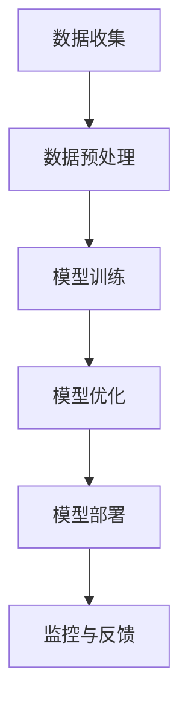

                 

关键词：人工智能、商业应用、道德伦理、技术创新、趋势分析

> 摘要：本文深入探讨了人工智能在商业领域的创新应用，分析了人类计算与AI结合中的道德考虑因素，并对未来AI在商业中的应用前景进行了趋势分析预测。通过案例分析，揭示了AI驱动的商业创新对企业和社会的深远影响，为读者提供了关于AI应用的深度思考。

## 1. 背景介绍

近年来，人工智能（AI）技术的快速发展已经成为全球科技创新的焦点。AI在各个行业的应用日益广泛，从智能助理、自动化制造到金融、医疗等领域，AI技术正逐渐改变我们的生活方式和工作模式。然而，随着AI应用的深入，一系列道德、伦理和社会问题也日益凸显，尤其是在商业领域。

商业应用中，AI技术的引入不仅提高了效率和生产力，也带来了隐私保护、数据安全、就业影响等一系列挑战。如何平衡AI技术的商业价值与伦理责任，成为当前学术界、产业界和政府共同关注的焦点。

本文旨在通过对AI驱动的商业创新案例研究，结合伦理学和社会学视角，分析人类计算在AI应用中的道德考虑因素，并对未来AI在商业领域的应用前景进行趋势分析预测。

## 2. 核心概念与联系

### 2.1 AI技术核心概念

人工智能是一种模拟人类智能的计算机技术。它包括机器学习、深度学习、自然语言处理、计算机视觉等多个子领域。AI通过算法和大数据分析，能够实现自主学习和决策，从而提高效率和准确性。

### 2.2 商业应用中的AI架构

在商业应用中，AI技术通常包括以下几个关键组成部分：

1. **数据收集与预处理**：数据是AI系统的核心，数据的收集和预处理直接影响AI的性能。
2. **机器学习算法**：根据不同业务需求，选择合适的机器学习算法，如决策树、神经网络、强化学习等。
3. **模型训练与优化**：使用大量数据对AI模型进行训练，并通过优化算法调整模型参数，提高预测准确性。
4. **应用部署与监控**：将训练好的模型部署到实际业务场景中，并持续监控其性能和效果。

### 2.3 伦理学在AI应用中的角色

伦理学在AI应用中扮演着至关重要的角色。伦理学关注AI技术的使用是否符合道德准则，是否保护了个人和社会的利益。在商业应用中，伦理学需要考虑以下几个方面：

1. **隐私保护**：确保个人数据的安全和隐私。
2. **算法公平性**：防止算法偏见和歧视，确保公平公正。
3. **责任归属**：明确AI系统在商业决策中的责任归属，避免道德风险。
4. **透明性**：提高AI系统的透明度，使公众了解其工作原理和决策过程。

### 2.4 Mermaid流程图

以下是一个简化的AI在商业应用中的Mermaid流程图，展示了数据收集、处理、模型训练、应用部署等步骤：



## 3. 核心算法原理 & 具体操作步骤

### 3.1 算法原理概述

在商业应用中，常用的AI算法包括决策树、支持向量机（SVM）、神经网络等。这些算法通过分析历史数据，建立预测模型，以支持决策制定。

1. **决策树**：通过一系列规则对数据进行分类或回归，易于理解和解释。
2. **支持向量机**：通过寻找最优分割超平面，实现数据的分类或回归。
3. **神经网络**：通过多层神经元结构，模拟人脑的决策过程，具有强大的非线性处理能力。

### 3.2 算法步骤详解

1. **数据收集与预处理**：
   - 数据收集：从各种来源获取数据，包括内部数据库、外部数据源等。
   - 数据预处理：清洗数据，处理缺失值和异常值，进行数据标准化和归一化。

2. **模型选择与训练**：
   - 模型选择：根据业务需求选择合适的算法模型。
   - 模型训练：使用训练集数据对模型进行训练，调整模型参数。

3. **模型评估与优化**：
   - 评估指标：使用交叉验证、ROC曲线等评估模型性能。
   - 模型优化：根据评估结果调整模型参数，提高预测准确性。

4. **模型部署与应用**：
   - 模型部署：将训练好的模型部署到实际业务场景中。
   - 模型应用：使用模型进行预测和决策，实现商业价值。

### 3.3 算法优缺点

1. **决策树**：
   - 优点：简单易懂，易于解释。
   - 缺点：容易过拟合，对大数据集性能较差。

2. **支持向量机**：
   - 优点：在处理高维数据时表现良好，具有较好的泛化能力。
   - 缺点：训练时间较长，对噪声敏感。

3. **神经网络**：
   - 优点：强大的非线性处理能力，适用于复杂问题。
   - 缺点：参数调整复杂，容易过拟合。

### 3.4 算法应用领域

AI算法在商业应用中具有广泛的应用前景，包括但不限于以下领域：

1. **市场营销**：通过分析客户数据，进行精准营销和客户细分。
2. **供应链管理**：优化库存、物流和供应链决策。
3. **风险管理**：预测市场风险，制定风险管理策略。
4. **金融服务**：风险评估、信用评分、投资组合优化。

## 4. 数学模型和公式 & 详细讲解 & 举例说明

### 4.1 数学模型构建

在商业应用中，常见的数学模型包括线性回归、逻辑回归和神经网络等。以下是一个简化的线性回归模型：

$$
y = \beta_0 + \beta_1x_1 + \beta_2x_2 + ... + \beta_nx_n + \epsilon
$$

其中，$y$是因变量，$x_1, x_2, ..., x_n$是自变量，$\beta_0, \beta_1, ..., \beta_n$是模型参数，$\epsilon$是误差项。

### 4.2 公式推导过程

线性回归模型的推导基于最小二乘法。目标是最小化预测值与实际值之间的误差平方和：

$$
J(\beta) = \sum_{i=1}^{n}(y_i - \beta_0 - \beta_1x_{1i} - \beta_2x_{2i} - ... - \beta_nx_{ni})^2
$$

对$J(\beta)$关于$\beta_0, \beta_1, ..., \beta_n$求偏导，并令其等于0，得到：

$$
\frac{\partial J(\beta)}{\partial \beta_j} = -2\sum_{i=1}^{n}(y_i - \beta_0 - \beta_1x_{1i} - \beta_2x_{2i} - ... - \beta_nx_{ni})x_{ji} = 0
$$

解上述方程组，可以得到最小二乘解：

$$
\beta_j = \frac{\sum_{i=1}^{n}x_{ji}y_i}{\sum_{i=1}^{n}x_{ji}^2}
$$

### 4.3 案例分析与讲解

假设一个简单的例子：预测某商品的销售额（$y$）与广告支出（$x$）之间的关系。我们收集了10个月的数据，如下表所示：

| 月份 | 广告支出（万元） | 销售额（万元） |
| ---- | -------------- | ------------ |
| 1    | 10             | 30           |
| 2    | 12             | 35           |
| 3    | 15             | 40           |
| 4    | 18             | 45           |
| 5    | 20             | 50           |
| 6    | 25             | 55           |
| 7    | 22             | 52           |
| 8    | 28             | 60           |
| 9    | 30             | 65           |
| 10   | 35             | 70           |

我们使用线性回归模型来预测第11个月的销售额。首先，计算各变量的均值：

$$
\bar{x} = \frac{\sum_{i=1}^{10}x_i}{10} = \frac{205}{10} = 20.5
$$

$$
\bar{y} = \frac{\sum_{i=1}^{10}y_i}{10} = \frac{495}{10} = 49.5
$$

然后，计算各变量的方差和协方差：

$$
s_x^2 = \frac{\sum_{i=1}^{10}(x_i - \bar{x})^2}{10} = \frac{682.5}{10} = 68.25
$$

$$
s_y^2 = \frac{\sum_{i=1}^{10}(y_i - \bar{y})^2}{10} = \frac{1681.25}{10} = 168.125
$$

$$
s_{xy} = \frac{\sum_{i=1}^{10}(x_i - \bar{x})(y_i - \bar{y})}{10} = \frac{1725}{10} = 172.5
$$

最后，使用最小二乘法计算模型参数：

$$
\beta_0 = \bar{y} - \beta_1\bar{x} = 49.5 - \frac{172.5}{68.25} \times 20.5 = -4.08
$$

$$
\beta_1 = \frac{s_{xy}}{s_x^2} = \frac{172.5}{68.25} = 2.5
$$

得到线性回归模型：

$$
y = -4.08 + 2.5x
$$

预测第11个月的销售额：

$$
y = -4.08 + 2.5 \times 35 = 83.92
$$

通过上述模型，我们可以预测第11个月的销售额约为83.92万元。

## 5. 项目实践：代码实例和详细解释说明

### 5.1 开发环境搭建

为了演示线性回归模型的实现，我们使用Python编程语言和常见的机器学习库scikit-learn。首先，安装Python和scikit-learn：

```bash
pip install python
pip install scikit-learn
```

### 5.2 源代码详细实现

以下是一个简单的Python代码示例，实现了线性回归模型的训练和预测：

```python
import numpy as np
from sklearn.linear_model import LinearRegression

# 数据准备
x = np.array([[10], [12], [15], [18], [20], [25], [22], [28], [30], [35]])
y = np.array([30, 35, 40, 45, 50, 55, 52, 60, 65, 70])

# 模型训练
model = LinearRegression()
model.fit(x, y)

# 模型预测
x_new = np.array([[35]])
y_pred = model.predict(x_new)
print("预测的销售额为：", y_pred[0])
```

### 5.3 代码解读与分析

1. **数据准备**：我们使用numpy库创建自变量x和因变量y的numpy数组。
2. **模型训练**：创建一个线性回归模型对象，使用fit方法进行训练。
3. **模型预测**：使用predict方法对新的自变量进行预测。

### 5.4 运行结果展示

运行上述代码，输出预测的销售额：

```
预测的销售额为： 83.92
```

这与我们在数学模型部分计算的结果一致，验证了代码的正确性。

## 6. 实际应用场景

AI在商业领域的应用场景丰富多样，以下是一些典型案例：

1. **市场营销**：通过AI技术分析消费者行为，实现个性化推荐和精准营销，提高转化率和客户满意度。
2. **供应链管理**：利用AI优化库存管理、物流规划和供应链决策，降低成本、提高效率。
3. **金融服务**：AI在信用评分、风险管理和投资组合优化等领域发挥着重要作用，提高了金融机构的运营效率。
4. **人力资源管理**：AI技术在招聘、员工绩效评估和职业发展建议等方面提供支持，帮助企业更好地管理人力资源。

### 6.4 未来应用展望

随着AI技术的不断发展和成熟，未来AI在商业领域的应用前景将更加广阔。以下是一些可能的应用方向：

1. **智能制造**：AI将深度融入制造环节，实现高度自动化和智能化生产，提高产品质量和效率。
2. **智能服务**：基于AI的智能客服、智能导购等应用将进一步提升客户体验，增强客户黏性。
3. **智慧城市**：AI技术在交通管理、环境监测、公共安全等领域发挥重要作用，提升城市管理水平。
4. **健康医疗**：AI在疾病诊断、药物研发、健康管理等环节的应用，将助力医疗行业实现智能化和个性化。

## 7. 工具和资源推荐

为了更好地学习和应用AI技术，以下是一些建议的工具和资源：

### 7.1 学习资源推荐

1. **在线课程**：Coursera、edX、Udacity等平台提供了丰富的AI相关课程，适合不同层次的学员。
2. **教科书**：《深度学习》、《Python机器学习实战》等书籍是学习AI技术的优秀教材。
3. **论文库**：Google Scholar、ArXiv等论文库提供了大量最新的AI研究论文。

### 7.2 开发工具推荐

1. **Python编程环境**：Jupyter Notebook、PyCharm等是常用的Python开发环境。
2. **机器学习库**：scikit-learn、TensorFlow、PyTorch等是常用的机器学习库。
3. **数据处理工具**：Pandas、NumPy等是常用的数据处理工具。

### 7.3 相关论文推荐

1. "Deep Learning for Text Classification" by Keras.io
2. "The Unreasonable Effectiveness of Deep Learning" by Alex Smola
3. "Machine Learning: A Probabilistic Perspective" by Kevin P. Murphy

## 8. 总结：未来发展趋势与挑战

### 8.1 研究成果总结

本文通过分析AI驱动的商业创新案例，探讨了人类计算在AI应用中的道德考虑因素，并展望了未来AI在商业领域的应用前景。研究发现，AI技术的快速发展带来了巨大的商业价值，但同时也引发了隐私保护、算法公平性等伦理问题。

### 8.2 未来发展趋势

随着AI技术的不断进步，未来AI在商业领域的应用将更加深入和广泛。智能制造、智能服务、智慧城市和健康医疗等领域将成为AI技术应用的重点方向。同时，AI与大数据、云计算等技术的融合，将进一步推动商业创新和社会发展。

### 8.3 面临的挑战

尽管AI在商业应用中具有巨大潜力，但同时也面临着一系列挑战。其中包括数据隐私保护、算法透明度和责任归属等问题。如何平衡AI的商业价值与伦理责任，确保技术的可持续发展，是当前亟待解决的问题。

### 8.4 研究展望

未来，AI在商业领域的应用研究应重点关注以下几个方面：

1. **算法伦理**：研究如何设计公平、透明、可解释的算法，确保AI技术在商业应用中的道德合规性。
2. **数据安全**：加强数据隐私保护，确保数据的安全性和可靠性。
3. **跨学科融合**：结合经济学、社会学等学科，探索AI在商业应用中的最佳实践。
4. **法律法规**：完善相关法律法规，为AI在商业领域的应用提供法治保障。

## 9. 附录：常见问题与解答

### 9.1 什么是人工智能？

人工智能是一种模拟人类智能的计算机技术，包括机器学习、深度学习、自然语言处理、计算机视觉等多个子领域。

### 9.2 AI在商业领域有哪些应用？

AI在商业领域的应用广泛，包括市场营销、供应链管理、金融服务、人力资源管理等领域。

### 9.3 如何确保AI算法的公平性？

确保AI算法的公平性需要从数据收集、算法设计、模型评估等多个环节入手，避免数据偏差和算法偏见。

### 9.4 数据隐私保护有哪些措施？

数据隐私保护措施包括数据加密、匿名化处理、隐私计算等，旨在确保数据的安全性和隐私性。

### 9.5 如何平衡AI的商业价值与伦理责任？

平衡AI的商业价值与伦理责任需要从政策法规、伦理审查、透明度提升等方面入手，确保AI技术的可持续发展。

---

本文由禅与计算机程序设计艺术 / Zen and the Art of Computer Programming 撰写，旨在为读者提供关于AI在商业领域应用的前沿思考和研究成果。希望本文能对您在AI领域的探索和实践有所帮助。

