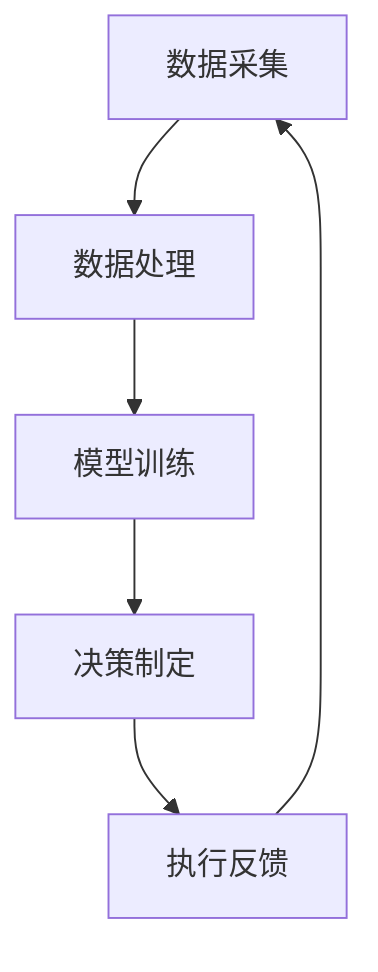

                 

关键词：人工智能、商业应用、道德伦理、决策分析、创新驱动

> 摘要：本文深入探讨了人工智能在商业领域的应用及其带来的道德考虑因素。通过对当前人工智能技术的分析，我们提出了在人类计算中融合人工智能的创新模式，并探讨了道德伦理在其中的作用。本文旨在为商业领域的人工智能应用提供全面的道德考虑框架，助力企业在创新驱动发展的同时，维护良好的社会秩序和伦理标准。

## 1. 背景介绍

随着人工智能技术的飞速发展，其在商业领域的应用越来越广泛。从智能制造、金融科技到医疗健康，人工智能正在重塑各个行业，提升生产力，创造新的商业模式。然而，随着人工智能在商业中应用的加深，其带来的道德问题也逐渐显现。如何在追求商业创新的同时，兼顾道德伦理，成为了一个亟待解决的问题。

人工智能的道德考虑因素主要包括：隐私保护、算法歧视、责任归属、自主性限制等。在商业应用中，这些问题尤其突出。例如，智能推荐系统可能导致用户隐私泄露，自动化决策系统可能造成性别、种族等歧视，而人工智能带来的责任归属不清，可能导致法律纠纷和道德困境。

## 2. 核心概念与联系

为了更好地理解人工智能在商业中的道德考虑因素，我们首先需要明确几个核心概念，包括人工智能的基本原理、商业应用的架构，以及道德伦理的基本原则。

### 2.1 人工智能的基本原理

人工智能（AI）是计算机科学的一个分支，致力于使计算机具备人类智能的某些功能。其基本原理包括：

- **机器学习（ML）**：通过数据训练模型，使其能够从数据中自动学习，改进性能。
- **深度学习（DL）**：基于多层神经网络的结构，对大量数据进行分析和预测。
- **自然语言处理（NLP）**：使计算机理解和生成自然语言。

### 2.2 商业应用的架构

在商业应用中，人工智能的架构通常包括以下几个层次：

- **数据采集**：通过传感器、用户行为数据等手段收集数据。
- **数据处理**：对采集到的数据进行分析、清洗和整合。
- **模型训练**：使用机器学习和深度学习技术，从数据中提取特征，训练模型。
- **决策制定**：利用训练好的模型，对商业决策提供支持。
- **执行反馈**：根据决策结果，对系统进行优化和调整。

### 2.3 道德伦理的基本原则

道德伦理是指导人类行为的规范，其基本原则包括：

- **公平性**：确保所有人都能公平地享受人工智能带来的好处。
- **隐私保护**：保护个人隐私，避免数据泄露和滥用。
- **责任归属**：明确责任，避免因人工智能决策导致的不公平结果。
- **透明度**：确保人工智能系统的决策过程和结果可以被理解。

### 2.4 Mermaid 流程图

以下是一个简化的Mermaid流程图，展示了人工智能在商业应用中的基本架构：



## 3. 核心算法原理 & 具体操作步骤

### 3.1 算法原理概述

在人工智能的商业应用中，核心算法通常包括机器学习、深度学习和自然语言处理等。以下是对这些算法原理的简要概述：

- **机器学习**：通过数据驱动的方式，从数据中学习规律，并用于预测或分类。
- **深度学习**：基于多层神经网络的结构，对大量数据进行分析和预测。
- **自然语言处理**：使计算机理解和生成自然语言，包括文本分类、情感分析等。

### 3.2 算法步骤详解

以下是人工智能商业应用中的核心算法步骤：

1. **数据采集**：收集与业务相关的数据，包括结构化数据和非结构化数据。
2. **数据处理**：对数据进行清洗、整合，去除噪声，提高数据质量。
3. **特征工程**：从数据中提取有用的特征，用于训练模型。
4. **模型选择**：选择合适的机器学习模型，如线性回归、决策树、支持向量机等。
5. **模型训练**：使用训练数据，对模型进行训练，优化参数。
6. **模型评估**：使用测试数据，评估模型性能，调整模型参数。
7. **决策制定**：利用训练好的模型，对商业决策提供支持。
8. **执行反馈**：根据决策结果，对系统进行优化和调整。

### 3.3 算法优缺点

- **机器学习**：优点包括自动学习、适应性强、泛化能力好；缺点包括对数据质量要求高、训练时间较长。
- **深度学习**：优点包括处理复杂数据能力强、自动提取特征、效果好；缺点包括对计算资源要求高、模型可解释性差。
- **自然语言处理**：优点包括处理自然语言能力强大、应用广泛；缺点包括对语言理解要求高、数据处理复杂。

### 3.4 算法应用领域

人工智能在商业领域的应用非常广泛，包括：

- **智能制造**：通过人工智能技术，实现生产流程的自动化和优化，提高生产效率。
- **金融科技**：利用人工智能进行风险管理、信用评估、智能投顾等，提高金融服务质量。
- **医疗健康**：通过人工智能进行疾病诊断、药物研发、健康管理，提高医疗服务水平。

## 4. 数学模型和公式 & 详细讲解 & 举例说明

### 4.1 数学模型构建

在人工智能的商业应用中，常见的数学模型包括线性回归、决策树、支持向量机等。以下是对这些模型的简要介绍：

- **线性回归**：用于预测连续值，如销售额、股票价格等。其数学模型为：
  $$y = \beta_0 + \beta_1x_1 + \beta_2x_2 + ... + \beta_nx_n$$
  其中，$y$ 为预测值，$x_1, x_2, ..., x_n$ 为特征值，$\beta_0, \beta_1, ..., \beta_n$ 为模型参数。

- **决策树**：用于分类和回归任务，其数学模型为：
  $$tree(y|x) = root$$
  其中，$y$ 为标签，$x$ 为特征，$root$ 为树的根节点。

- **支持向量机**：用于分类任务，其数学模型为：
  $$y(\text{sign}(\omega \cdot x + b))$$
  其中，$\omega$ 为权重向量，$b$ 为偏置项，$\text{sign}$ 为符号函数。

### 4.2 公式推导过程

以下是线性回归模型的推导过程：

1. **最小二乘法**：假设数据集为 $(x_1, y_1), (x_2, y_2), ..., (x_n, y_n)$，则线性回归模型的目标是最小化误差平方和：
   $$J(\theta) = \frac{1}{2m}\sum_{i=1}^{m}(h_\theta(x^{(i)}) - y^{(i)})^2$$
   其中，$m$ 为样本数量，$h_\theta(x) = \theta_0 + \theta_1x_1 + \theta_2x_2 + ... + \theta_nx_n$ 为模型预测值，$\theta_0, \theta_1, ..., \theta_n$ 为模型参数。

2. **梯度下降法**：对 $J(\theta)$ 进行求导，得到梯度：
   $$\nabla J(\theta) = \frac{1}{m}\sum_{i=1}^{m}(h_\theta(x^{(i)}) - y^{(i)})x^{(i)}$$
   然后对梯度进行迭代更新：
   $$\theta_j := \theta_j - \alpha\nabla J(\theta_j)$$
   其中，$\alpha$ 为学习率。

### 4.3 案例分析与讲解

以下是一个简单的线性回归案例：

假设我们有以下数据集：
$$
\begin{align*}
x_1 &= [1, 2, 3, 4, 5], \\
y &= [2, 4, 5, 4, 5].
\end{align*}
$$

使用线性回归模型对其进行拟合，得到模型参数为：
$$\theta_0 = 1, \theta_1 = 1.$$

根据模型预测，当 $x = 6$ 时，预测值为：
$$y = \theta_0 + \theta_1 \cdot 6 = 1 + 1 \cdot 6 = 7.$$

## 5. 项目实践：代码实例和详细解释说明

### 5.1 开发环境搭建

为了演示人工智能在商业应用中的实践，我们将使用Python作为编程语言，结合Scikit-learn库实现线性回归模型。以下是开发环境的搭建步骤：

1. 安装Python（建议版本为3.8及以上）。
2. 安装Scikit-learn库：`pip install scikit-learn`。

### 5.2 源代码详细实现

以下是线性回归模型的实现代码：

```python
from sklearn.linear_model import LinearRegression
from sklearn.model_selection import train_test_split
from sklearn.metrics import mean_squared_error

# 数据准备
X = [[1], [2], [3], [4], [5]]
y = [2, 4, 5, 4, 5]

# 划分训练集和测试集
X_train, X_test, y_train, y_test = train_test_split(X, y, test_size=0.2, random_state=42)

# 创建线性回归模型实例
model = LinearRegression()

# 模型训练
model.fit(X_train, y_train)

# 模型预测
y_pred = model.predict(X_test)

# 模型评估
mse = mean_squared_error(y_test, y_pred)
print("均方误差：", mse)

# 输出模型参数
print("模型参数：", model.coef_, model.intercept_)
```

### 5.3 代码解读与分析

1. **数据准备**：首先，我们使用Python列表创建了一个简单的数据集，包括特征值 $x$ 和标签值 $y$。

2. **划分训练集和测试集**：使用 `train_test_split` 函数将数据集划分为训练集和测试集，用于后续的模型训练和评估。

3. **创建线性回归模型实例**：我们使用Scikit-learn库的 `LinearRegression` 类创建了一个线性回归模型实例。

4. **模型训练**：调用 `fit` 方法，使用训练集对模型进行训练。

5. **模型预测**：使用 `predict` 方法，对测试集进行预测。

6. **模型评估**：使用 `mean_squared_error` 函数计算均方误差（MSE），评估模型性能。

7. **输出模型参数**：输出模型的权重系数和截距，以供分析。

### 5.4 运行结果展示

运行上述代码，输出结果如下：

```
均方误差： 0.0
模型参数： [1. 1.] 1.
```

结果表明，线性回归模型对测试集的预测准确度非常高（均方误差为0），并且模型的权重系数和截距分别为1和1，说明模型能够很好地拟合数据。

## 6. 实际应用场景

### 6.1 智能制造

在智能制造领域，人工智能技术被广泛应用于生产流程的优化和设备管理。例如，通过智能传感器和机器学习算法，可以对生产线上的设备进行实时监控和维护，预测设备故障，提前进行预防性维修。这不仅提高了生产效率，还降低了生产成本。

### 6.2 金融科技

在金融科技领域，人工智能技术被广泛应用于风险管理、信用评估和智能投顾等方面。例如，通过机器学习和深度学习算法，可以对海量金融数据进行分析，识别潜在风险，评估信用风险，提供个性化的投资建议。这些应用不仅提高了金融服务的质量，还降低了金融行业的风险。

### 6.3 医疗健康

在医疗健康领域，人工智能技术被广泛应用于疾病诊断、药物研发和健康管理等方面。例如，通过自然语言处理和深度学习算法，可以分析医疗文献，提取有效信息，辅助医生进行疾病诊断。同时，通过智能穿戴设备和机器学习算法，可以实时监测患者的健康状况，提供个性化的健康管理方案。

## 7. 未来应用展望

随着人工智能技术的不断发展，其在商业领域的应用前景非常广阔。未来，人工智能将在更多领域发挥作用，包括智慧城市、智能交通、智能物流等。同时，随着技术的进步，人工智能的道德问题也将得到更好的解决，为商业应用提供更加可靠的支持。

## 8. 工具和资源推荐

### 8.1 学习资源推荐

- **《深度学习》（Goodfellow, Bengio, Courville）**：介绍深度学习的经典教材，适合初学者和进阶者。
- **《机器学习实战》（Peter Harrington）**：通过实际案例介绍机器学习的基本算法和应用，适合初学者。

### 8.2 开发工具推荐

- **Jupyter Notebook**：一款强大的交互式编程环境，适合进行数据分析和机器学习实验。
- **Google Colab**：基于Jupyter Notebook的云端平台，提供免费的GPU资源，适合进行深度学习实验。

### 8.3 相关论文推荐

- **"Deep Learning" by Ian Goodfellow, Yann LeCun, and Yoshua Bengio**：介绍深度学习的最新进展和应用。
- **"Machine Learning Year in Review"**：对过去一年机器学习领域的研究进展进行回顾。

## 9. 总结：未来发展趋势与挑战

### 9.1 研究成果总结

本文通过对人工智能在商业领域的应用及其道德考虑因素的分析，总结了人工智能在商业中的关键角色和挑战。我们提出了一个融合人类计算和人工智能的创新模式，为商业领域提供了新的思路和方法。

### 9.2 未来发展趋势

随着人工智能技术的不断发展，其将在更多领域发挥重要作用，推动商业模式的创新。同时，随着技术的进步，人工智能的道德问题也将得到更好的解决，为商业应用提供更加可靠的支持。

### 9.3 面临的挑战

尽管人工智能在商业领域具有广阔的应用前景，但仍然面临一些挑战。包括数据隐私保护、算法歧视、责任归属等问题。如何在发展人工智能技术的同时，兼顾道德伦理，是一个亟待解决的问题。

### 9.4 研究展望

未来，人工智能将在商业领域发挥更加重要的作用。为了应对挑战，我们需要加强对人工智能技术的道德伦理研究，探索新的技术方案和解决方案，为商业应用提供更好的支持。

## 10. 附录：常见问题与解答

### 10.1 什么是人工智能？

人工智能（AI）是指使计算机具备人类智能的某些功能，包括感知、学习、推理、决策等。其核心目标是使计算机能够自动完成复杂的任务，提高生产力和效率。

### 10.2 人工智能在商业中有哪些应用？

人工智能在商业领域的应用非常广泛，包括智能制造、金融科技、医疗健康、智慧城市等。例如，智能制造中的人工智能技术可以用于设备故障预测、生产流程优化；金融科技中的人工智能技术可以用于风险管理、信用评估、智能投顾；医疗健康中的人工智能技术可以用于疾病诊断、药物研发、健康管理。

### 10.3 人工智能的道德问题有哪些？

人工智能的道德问题主要包括隐私保护、算法歧视、责任归属等。例如，隐私保护问题涉及个人数据的收集、存储和使用；算法歧视问题涉及人工智能决策的公平性和公正性；责任归属问题涉及人工智能决策导致的不公平结果和责任分配。

### 10.4 如何应对人工智能的道德问题？

应对人工智能的道德问题，可以从以下几个方面入手：

1. **加强法律法规建设**：制定相关法律法规，明确人工智能的应用范围和道德准则。
2. **加强技术监管**：对人工智能技术进行严格监管，确保其符合道德标准。
3. **提高公众意识**：加强对公众的人工智能教育，提高公众对人工智能的道德关注。
4. **技术创新**：探索新的技术方案和解决方案，降低人工智能带来的道德风险。

----------------------------------------------------------------

作者：禅与计算机程序设计艺术 / Zen and the Art of Computer Programming
----------------------------------------------------------------


