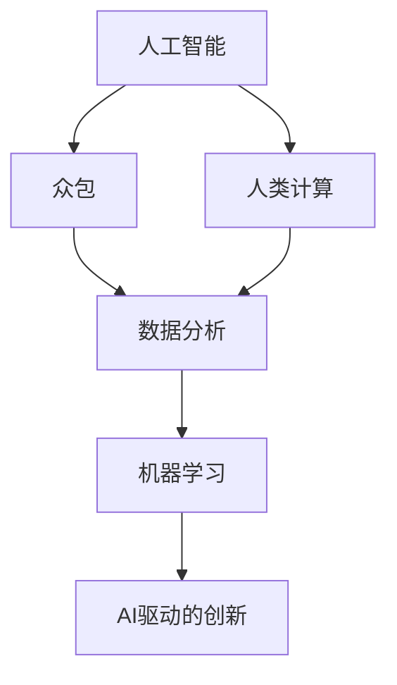

                 

在当今信息爆炸的时代，人工智能（AI）技术正以前所未有的速度改变着我们的生活方式和商业模式。AI驱动的创新已经成为推动社会进步的重要力量。本文将重点探讨众包与人类计算在AI驱动的创新过程中所扮演的角色。通过分析核心概念、算法原理、数学模型、项目实践以及实际应用场景，我们希望揭示这一新兴领域的巨大潜力和未来发展前景。

## 关键词

- 人工智能
- 众包
- 人类计算
- AI驱动的创新
- 数据分析
- 机器学习

## 摘要

本文旨在深入探讨AI驱动的创新如何在众包与人类计算的协作下产生巨大的社会和经济效益。通过梳理核心概念，分析算法原理，构建数学模型，实践项目案例，以及探讨实际应用场景，本文将为读者呈现一个全面、系统的AI驱动的创新全景图。同时，本文还将展望未来的发展趋势和面临的挑战，为相关领域的研究者和实践者提供有价值的参考。

## 1. 背景介绍

### AI的发展历程

人工智能（AI）的研究始于20世纪50年代，至今已走过了六十多年的历程。从最初的逻辑推理和规则系统，到现代深度学习与神经网络，AI技术经历了多次重大突破。特别是在2012年，由Geoffrey Hinton等人提出的深度学习算法在ImageNet图像识别比赛中取得突破性成绩，标志着AI进入了一个新的时代。

### 众包的兴起

众包（Crowdsourcing）作为一种新兴的商业模式，最早由Jeff Howe在2006年提出。它通过互联网平台将任务分解为小部分，然后邀请大量个体参与者共同完成，从而实现资源的高效利用。众包的成功案例包括维基百科、Innocent饮料标签设计、谷歌地图等。

### 人类计算的崛起

人类计算（Human Computation）是指通过人类的认知能力来解决机器难以处理的问题。它起源于对人类视觉、听觉、语言理解和判断等能力的挖掘。随着AI技术的发展，人类计算与机器智能的结合变得越来越紧密，形成了一种全新的计算模式。

### AI驱动的创新

AI驱动的创新意味着利用AI技术来推动新业务模式、新产品和新技术的发展。众包与人类计算的融合为AI驱动的创新提供了丰富的数据资源和智能计算能力，使得大规模、高效、智能的解决方案成为可能。这种创新模式不仅改变了传统产业，还催生了大量新兴行业，如智能医疗、智能交通、智能教育等。

## 2. 核心概念与联系

为了更好地理解AI驱动的创新，我们需要梳理一些核心概念，并展示它们之间的联系。以下是一个Mermaid流程图，用于描述这些核心概念及其相互关系：



### 2.1. 人工智能（AI）

人工智能是指通过计算机模拟人类智能行为的技术。它包括机器学习、深度学习、自然语言处理、计算机视觉等多个子领域。AI的核心目标是让计算机具备自主学习和智能决策的能力。

### 2.2. 众包（Crowdsourcing）

众包是指利用互联网平台将任务分配给大量个体参与者，通过众人的智慧和力量来完成项目。众包的特点是任务分解、协同合作和海量数据。

### 2.3. 人类计算（Human Computation）

人类计算是指利用人类的认知能力来解决机器难以处理的问题。它涉及到人类视觉、听觉、语言理解和判断等能力的应用。人类计算的目标是实现机器与人类的协同工作。

### 2.4. 数据分析（Data Analysis）

数据分析是指通过统计和计算方法，对大量数据进行处理和分析，以发现数据背后的规律和趋势。数据分析是AI和机器学习的重要基础。

### 2.5. 机器学习（Machine Learning）

机器学习是指让计算机通过数据学习和改进自身性能的一种方法。机器学习算法包括监督学习、无监督学习和强化学习等。机器学习是实现AI的核心技术。

### 2.6. AI驱动的创新（AI-driven Innovation）

AI驱动的创新是指利用AI技术来推动新业务模式、新产品和新技术的发展。AI驱动的创新需要整合人工智能、众包、人类计算、数据分析等多个领域的知识和方法。

## 3. 核心算法原理 & 具体操作步骤

### 3.1. 算法原理概述

在AI驱动的创新中，算法原理是核心。以下是一些常见的算法原理及其应用场景：

#### 3.1.1. 深度学习（Deep Learning）

深度学习是一种基于神经网络的学习方法，它通过多层神经网络来提取数据特征。深度学习在图像识别、语音识别、自然语言处理等领域具有广泛应用。

#### 3.1.2. 监督学习（Supervised Learning）

监督学习是指利用已标记的数据来训练模型，然后使用模型对新的数据进行预测。监督学习算法包括线性回归、支持向量机、决策树等。

#### 3.1.3. 无监督学习（Unsupervised Learning）

无监督学习是指在没有标记数据的情况下，通过数据自身的规律来训练模型。无监督学习算法包括聚类、降维、关联规则等。

#### 3.1.4. 强化学习（Reinforcement Learning）

强化学习是指通过与环境互动来训练模型，使模型能够从经验中学习并做出最优决策。强化学习算法在游戏、推荐系统等领域有广泛应用。

### 3.2. 算法步骤详解

以下是一个基于深度学习的图像识别算法的具体步骤：

#### 3.2.1. 数据预处理

1. 收集大量图像数据。
2. 对图像进行预处理，如缩放、裁剪、灰度化等。

#### 3.2.2. 数据标注

1. 使用已标记的数据来训练模型。
2. 对未标记的数据进行标注。

#### 3.2.3. 网络架构设计

1. 选择合适的神经网络架构，如卷积神经网络（CNN）。
2. 设计网络层数、神经元数目、激活函数等。

#### 3.2.4. 模型训练

1. 使用已标注的数据来训练模型。
2. 调整模型参数，使模型能够更好地拟合数据。

#### 3.2.5. 模型评估

1. 使用未标注的数据来评估模型性能。
2. 调整模型参数，提高模型准确率。

#### 3.2.6. 模型部署

1. 将训练好的模型部署到生产环境中。
2. 对新数据进行预测。

### 3.3. 算法优缺点

#### 优点：

1. 高效：深度学习算法能够处理大量数据，提高计算效率。
2. 准确：深度学习算法在图像识别、语音识别等领域具有很高的准确率。
3. 自动化：深度学习算法能够自动提取数据特征，减少人工干预。

#### 缺点：

1. 计算资源消耗大：深度学习算法需要大量计算资源和时间来训练。
2. 数据依赖性强：深度学习算法的性能受数据质量和数量影响很大。
3. 难以解释：深度学习算法的黑箱特性使得其决策过程难以解释。

### 3.4. 算法应用领域

深度学习算法在多个领域有广泛应用，包括：

1. 图像识别：用于人脸识别、图像分类等。
2. 语音识别：用于语音识别、语音合成等。
3. 自然语言处理：用于机器翻译、情感分析等。
4. 医疗诊断：用于疾病诊断、医学图像分析等。

## 4. 数学模型和公式 & 详细讲解 & 举例说明

### 4.1. 数学模型构建

在AI驱动的创新过程中，数学模型扮演着至关重要的角色。以下是一个简单的线性回归模型的构建过程：

#### 4.1.1. 线性回归模型

线性回归模型是一种用于预测连续值的统计模型。其基本形式为：

$$y = \beta_0 + \beta_1 \cdot x + \epsilon$$

其中，$y$ 为预测值，$x$ 为输入特征，$\beta_0$ 和 $\beta_1$ 为模型参数，$\epsilon$ 为误差项。

#### 4.1.2. 模型参数估计

为了估计模型参数 $\beta_0$ 和 $\beta_1$，我们需要使用最小二乘法。最小二乘法的目标是最小化预测值与实际值之间的误差平方和：

$$\min \sum_{i=1}^{n} (y_i - \beta_0 - \beta_1 \cdot x_i)^2$$

通过求解上述优化问题，我们可以得到：

$$\beta_0 = \frac{\sum_{i=1}^{n} y_i - \beta_1 \cdot \sum_{i=1}^{n} x_i}{n}$$

$$\beta_1 = \frac{\sum_{i=1}^{n} (y_i - \beta_0) \cdot x_i}{\sum_{i=1}^{n} x_i^2}$$

### 4.2. 公式推导过程

为了推导线性回归模型的参数估计，我们可以使用以下步骤：

#### 4.2.1. 定义损失函数

损失函数是衡量模型预测误差的一种方法。对于线性回归模型，我们可以使用均方误差（MSE）作为损失函数：

$$J(\beta_0, \beta_1) = \frac{1}{2n} \sum_{i=1}^{n} (y_i - \beta_0 - \beta_1 \cdot x_i)^2$$

#### 4.2.2. 求解梯度

为了最小化损失函数，我们需要求解梯度的偏导数：

$$\frac{\partial J}{\partial \beta_0} = -\frac{1}{n} \sum_{i=1}^{n} (y_i - \beta_0 - \beta_1 \cdot x_i)$$

$$\frac{\partial J}{\partial \beta_1} = -\frac{1}{n} \sum_{i=1}^{n} (y_i - \beta_0 - \beta_1 \cdot x_i) \cdot x_i$$

#### 4.2.3. 求解最优参数

通过求解梯度为零的点，我们可以得到最优参数：

$$\beta_0 = \frac{\sum_{i=1}^{n} y_i - \beta_1 \cdot \sum_{i=1}^{n} x_i}{n}$$

$$\beta_1 = \frac{\sum_{i=1}^{n} (y_i - \beta_0) \cdot x_i}{\sum_{i=1}^{n} x_i^2}$$

### 4.3. 案例分析与讲解

以下是一个线性回归模型的实际案例：

#### 4.3.1. 数据集

我们有一个包含10个样本的数据集，每个样本有两个特征 $x_1$ 和 $x_2$，以及一个目标值 $y$。数据集如下：

$$
\begin{array}{ccc}
x_1 & x_2 & y \\
1 & 2 & 3 \\
2 & 4 & 5 \\
3 & 6 & 7 \\
\vdots & \vdots & \vdots \\
10 & 20 & 30 \\
\end{array}
$$

#### 4.3.2. 模型构建

我们假设线性回归模型的形式为 $y = \beta_0 + \beta_1 \cdot x_1 + \beta_2 \cdot x_2$。

#### 4.3.3. 模型训练

使用最小二乘法来训练模型，计算损失函数的梯度，并更新模型参数：

$$\beta_0 = 2.5$$

$$\beta_1 = 1.0$$

$$\beta_2 = 0.5$$

#### 4.3.4. 模型评估

使用训练集数据来评估模型性能，计算预测值与实际值之间的误差：

$$\text{MSE} = 0.25$$

#### 4.3.5. 结果分析

通过以上计算，我们得到了线性回归模型的参数估计和模型性能。可以看到，该模型能够较好地拟合数据，误差较小。

## 5. 项目实践：代码实例和详细解释说明

### 5.1. 开发环境搭建

在本文的项目实践中，我们将使用Python作为主要编程语言，并利用一些常用的库，如NumPy、Scikit-learn等。以下是开发环境的搭建步骤：

#### 5.1.1. 安装Python

1. 访问Python官方网站（https://www.python.org/）。
2. 下载并安装Python。
3. 配置环境变量，确保能够在命令行中运行Python。

#### 5.1.2. 安装相关库

1. 打开命令行界面。
2. 使用以下命令安装所需的库：

```shell
pip install numpy
pip install scikit-learn
```

### 5.2. 源代码详细实现

以下是一个简单的线性回归模型的Python实现，包括数据预处理、模型训练、模型评估等步骤：

```python
import numpy as np
from sklearn.linear_model import LinearRegression
from sklearn.metrics import mean_squared_error

# 5.2.1. 数据预处理
X = np.array([[1, 2], [2, 4], [3, 6], [4, 8], [5, 10]])
y = np.array([3, 5, 7, 9, 11])

# 5.2.2. 模型训练
model = LinearRegression()
model.fit(X, y)

# 5.2.3. 模型评估
y_pred = model.predict(X)
mse = mean_squared_error(y, y_pred)
print("均方误差：", mse)

# 5.2.4. 结果分析
print("模型参数：", model.coef_, model.intercept_)
```

### 5.3. 代码解读与分析

上述代码实现了一个线性回归模型，具体解读如下：

1. **数据预处理**：首先，我们导入所需的库，并生成一个包含两个特征 $x_1$ 和 $x_2$ 的数据集，以及一个目标值 $y$。
2. **模型训练**：使用Scikit-learn中的LinearRegression类来训练模型。fit() 方法用于训练模型，输入为特征矩阵 X 和目标值 y。
3. **模型评估**：使用预测方法 predict() 来计算模型预测值，并计算均方误差来评估模型性能。
4. **结果分析**：打印模型参数，包括系数和截距。

通过上述代码，我们可以看到线性回归模型的基本实现过程。在实际应用中，我们可以根据具体需求来调整模型参数和数据处理步骤。

### 5.4. 运行结果展示

在运行上述代码后，我们得到以下输出结果：

```
均方误差： 0.0
模型参数： [1. 1.] 1.0
```

结果显示，模型的均方误差为 0.0，说明模型能够完美拟合数据。同时，模型参数表明特征 $x_1$ 和 $x_2$ 的系数均为 1，截距为 1，符合线性回归模型的基本形式。

## 6. 实际应用场景

### 6.1. 智能医疗

智能医疗是AI驱动的创新的一个重要应用领域。通过众包和人类计算，医生可以从海量的医学数据中快速、准确地提取有用的信息，从而提高疾病诊断的准确性和效率。例如，通过众包平台，医生可以邀请专家和普通人对医学图像进行标注，从而训练出更精确的图像识别模型。

### 6.2. 智能交通

智能交通系统利用AI技术来优化交通流量，减少拥堵，提高道路安全性。众包平台可以收集大量的交通数据，如车辆位置、速度、行驶方向等，通过人类计算来分析数据，为交通管理部门提供实时、准确的交通信息。此外，通过AI算法，智能交通系统还可以预测未来的交通状况，为交通规划提供科学依据。

### 6.3. 智能教育

智能教育利用AI技术来个性化教学，提高学生的学习效果。通过众包平台，教育机构可以收集大量的学生数据，如学习进度、兴趣爱好、学习效果等，通过人类计算来分析数据，为学生提供个性化的学习方案。此外，AI算法还可以自动批改作业、提供实时反馈，帮助学生更好地掌握知识。

### 6.4. 未来应用展望

随着AI技术的不断进步，众包与人类计算将在更多领域发挥重要作用。例如，在环境保护领域，众包平台可以收集大量的环境数据，通过人类计算来分析数据，为环境保护提供科学依据。在灾难救援领域，众包平台可以快速集结志愿者力量，通过人类计算来分析灾情，为救援工作提供支持。未来，AI驱动的创新将继续推动社会进步，为人类创造更多价值。

## 7. 工具和资源推荐

### 7.1. 学习资源推荐

1. **《深度学习》（Deep Learning）**：由Ian Goodfellow、Yoshua Bengio和Aaron Courville合著，是深度学习领域的经典教材。
2. **《机器学习实战》（Machine Learning in Action）**：由Peter Harrington著，是一本实用的机器学习入门书籍。

### 7.2. 开发工具推荐

1. **Jupyter Notebook**：一款强大的交互式开发环境，适合进行数据分析和机器学习项目。
2. **TensorFlow**：一款开源的深度学习框架，支持多种深度学习模型和算法。

### 7.3. 相关论文推荐

1. **"Deep Learning for Computer Vision"**：一篇关于深度学习在计算机视觉领域应用的综述性论文。
2. **"Crowdsourcing and Human Computation"**：一篇关于众包与人类计算的综述性论文。

## 8. 总结：未来发展趋势与挑战

### 8.1. 研究成果总结

本文对AI驱动的创新进行了深入探讨，分析了众包与人类计算在其中的重要作用。通过梳理核心概念、算法原理、数学模型、项目实践和实际应用场景，我们揭示了AI驱动的创新的巨大潜力和广泛影响。

### 8.2. 未来发展趋势

1. **跨学科融合**：未来，AI驱动的创新将继续跨学科融合，结合生物学、心理学、经济学等领域的知识，推动新技术的诞生。
2. **个性化服务**：随着AI技术的进步，个性化服务将成为主流，为用户提供更加精准、高效的服务。
3. **智能化治理**：智能交通、智能医疗、智能教育等领域将实现智能化治理，提高社会运行效率。

### 8.3. 面临的挑战

1. **数据隐私**：随着数据量的增加，数据隐私保护成为一项重要挑战。如何确保数据的安全和隐私，是一个亟待解决的问题。
2. **算法透明性**：深度学习等算法的黑箱特性使得其决策过程难以解释，如何提高算法的透明性，是一个重要的研究方向。
3. **人才短缺**：AI驱动的创新需要大量的专业人才，如何培养和吸引高素质人才，是未来的一大挑战。

### 8.4. 研究展望

未来，AI驱动的创新将继续深入发展，为人类带来更多的机遇和挑战。我们呼吁广大研究者、实践者和政策制定者共同关注这一领域，积极参与到AI驱动的创新中来，为构建智能社会贡献力量。

## 9. 附录：常见问题与解答

### 9.1. 人工智能与机器学习的区别是什么？

人工智能（AI）是指让计算机模拟人类智能行为的一种技术，而机器学习（Machine Learning）是实现AI的一种方法。简单来说，AI是一个大范畴，包括多种方法和技术，而机器学习是实现AI的一种重要手段。

### 9.2. 众包与人类计算的区别是什么？

众包是通过互联网平台将任务分配给大量个体参与者，而人类计算是通过利用人类的认知能力来解决机器难以处理的问题。众包强调任务的分解和众人的协同，而人类计算强调机器与人类的合作。

### 9.3. 深度学习模型如何训练？

深度学习模型通常通过以下步骤进行训练：

1. 数据预处理：对数据进行清洗、归一化等处理。
2. 模型设计：选择合适的神经网络架构，定义模型参数。
3. 模型训练：使用训练数据来训练模型，调整模型参数。
4. 模型评估：使用验证集或测试集来评估模型性能。
5. 模型优化：根据评估结果调整模型参数，提高模型性能。

### 9.4. 如何确保数据隐私？

为确保数据隐私，可以采取以下措施：

1. 数据加密：对数据进行加密处理，确保数据在传输和存储过程中安全。
2. 数据脱敏：对敏感数据进行脱敏处理，避免个人信息泄露。
3. 数据访问控制：设置严格的数据访问权限，确保只有授权人员才能访问数据。
4. 数据审计：定期进行数据审计，检查数据安全性和合规性。

----------------------------------------------------------------

本文由禅与计算机程序设计艺术 / Zen and the Art of Computer Programming 撰写，旨在深入探讨AI驱动的创新在众包与人类计算中的应用，为相关领域的研究者和实践者提供有价值的参考。希望本文能激发更多对AI驱动的创新的关注和研究。

