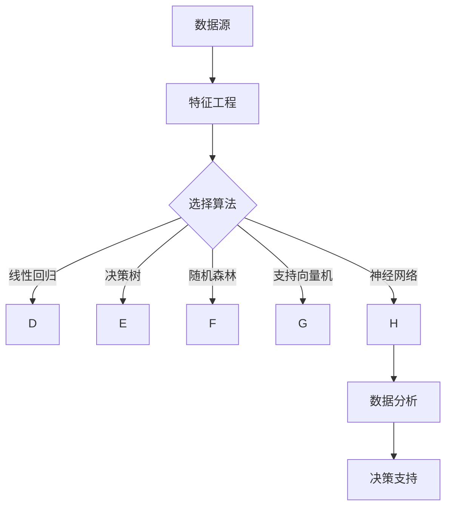

                 

关键词：AI、员工绩效评估、机器学习、数据分析、工作流程优化

> 摘要：本文旨在探讨如何利用人工智能技术，特别是机器学习和数据分析技术，构建一个高效、准确的员工绩效评估系统。本文将介绍系统设计、核心算法原理、数学模型、项目实践以及未来应用场景，旨在为企业和组织提供一种创新的绩效管理解决方案。

## 1. 背景介绍

随着信息技术的飞速发展，企业对员工绩效评估的需求日益增长。传统的绩效评估方法往往依赖于主观判断，缺乏客观性和准确性，难以满足现代企业对精细化管理的需求。为了解决这一问题，人工智能（AI）技术，特别是机器学习和数据分析技术，被引入到员工绩效评估领域，以期实现更高效、准确的绩效评估。

员工绩效评估系统的设计目标是：1）提高评估的客观性和准确性；2）降低评估过程中的人为干扰；3）为管理层提供数据驱动的决策支持。本文将围绕这些目标，详细介绍AI驱动的员工绩效评估系统的设计与实现。

## 2. 核心概念与联系

为了构建一个高效的员工绩效评估系统，我们需要明确以下几个核心概念：

### 2.1 数据源

数据源是评估系统的基础。这些数据包括但不限于员工的工作量、工作效率、工作质量、同事和客户的反馈等。数据的质量和完整性直接影响评估结果的准确性。

### 2.2 特征工程

特征工程是指从原始数据中提取对评估任务有帮助的特征。通过对数据特征的选择和转换，可以提高模型的性能。

### 2.3 机器学习算法

机器学习算法是评估系统的核心。常见的算法包括线性回归、决策树、随机森林、支持向量机、神经网络等。选择合适的算法，能够提高评估的准确性。

### 2.4 数据分析

数据分析技术用于对评估结果进行解读和解释，为管理层提供决策支持。常用的数据分析方法包括数据可视化、统计分析、预测分析等。

以下是核心概念的Mermaid流程图：



## 3. 核心算法原理 & 具体操作步骤

### 3.1 算法原理概述

员工绩效评估系统主要基于机器学习中的监督学习算法。常见的监督学习算法包括线性回归、决策树、随机森林、支持向量机和神经网络。以下将对这些算法的原理进行简要概述。

#### 线性回归

线性回归是一种简单的监督学习算法，用于建立自变量和因变量之间的线性关系。通过最小二乘法拟合回归直线，可以预测因变量的值。

#### 决策树

决策树通过一系列的决策规则将数据集划分为多个子集，每个子集对应一个预测结果。决策树算法的核心是划分策略和剪枝技术。

#### 随机森林

随机森林是决策树的集成方法。它通过构建多个决策树，并对预测结果进行投票，提高模型的预测准确性。

#### 支持向量机

支持向量机是一种分类算法，通过找到最佳的超平面，将数据分为不同的类别。支持向量机的主要任务是最大化分类间隔。

#### 神经网络

神经网络是一种模拟人脑的算法，通过多层神经网络对输入数据进行处理和预测。神经网络的核心是前向传播和反向传播算法。

### 3.2 算法步骤详解

1. **数据收集**：收集员工的工作量、工作效率、工作质量、同事和客户的反馈等数据。

2. **数据预处理**：对数据进行清洗、归一化、缺失值处理等操作，确保数据的质量和一致性。

3. **特征选择**：根据业务需求，从原始数据中提取对评估任务有帮助的特征。

4. **模型选择**：根据评估任务的复杂度和数据规模，选择合适的机器学习算法。

5. **模型训练**：使用训练数据集，对选定的模型进行训练，调整模型参数。

6. **模型评估**：使用验证数据集，对训练好的模型进行评估，调整模型参数。

7. **模型部署**：将训练好的模型部署到生产环境，进行实时评估。

### 3.3 算法优缺点

- **线性回归**：简单、易于理解，但适用范围有限。

- **决策树**：直观、易于解释，但可能产生过拟合。

- **随机森林**：提高模型的预测准确性，但可能增加计算复杂度。

- **支持向量机**：适用于线性可分的数据，但对非线性数据的处理能力有限。

- **神经网络**：强大的非线性处理能力，但训练过程可能非常耗时。

### 3.4 算法应用领域

- **人力资源**：用于员工绩效评估、员工晋升预测等。

- **市场营销**：用于客户行为分析、市场预测等。

- **金融**：用于风险控制、投资决策等。

## 4. 数学模型和公式 & 详细讲解 & 举例说明

### 4.1 数学模型构建

员工绩效评估系统的主要数学模型包括线性回归模型和支持向量机模型。

#### 线性回归模型

线性回归模型通过最小二乘法拟合回归直线，公式如下：

$$
y = \beta_0 + \beta_1x_1 + \beta_2x_2 + ... + \beta_nx_n
$$

其中，$y$ 是因变量，$x_1, x_2, ..., x_n$ 是自变量，$\beta_0, \beta_1, ..., \beta_n$ 是模型参数。

#### 支持向量机模型

支持向量机模型通过找到最佳的超平面，公式如下：

$$
w \cdot x + b = 0
$$

其中，$w$ 是超平面的法向量，$x$ 是数据点，$b$ 是偏置。

### 4.2 公式推导过程

线性回归模型的推导过程如下：

1. **目标函数**：最小化误差平方和。

$$
J(\theta) = \frac{1}{2m}\sum_{i=1}^{m}(h_\theta(x^{(i)}) - y^{(i)})^2
$$

其中，$m$ 是样本数量，$h_\theta(x^{(i)})$ 是预测值，$y^{(i)}$ 是真实值，$\theta$ 是模型参数。

2. **梯度下降**：对目标函数求导，并令导数为零，求解最优参数。

$$
\theta_j = \theta_j - \alpha\frac{\partial J(\theta)}{\partial \theta_j}
$$

其中，$\alpha$ 是学习率。

### 4.3 案例分析与讲解

假设我们有一个包含员工工作量、工作效率和工作质量的数据集，我们需要利用线性回归模型预测员工的工作质量。

1. **数据预处理**：对数据进行归一化处理，确保数据的范围一致。

2. **特征选择**：选择工作量和工作效率作为自变量，工作质量作为因变量。

3. **模型训练**：使用训练数据集，利用梯度下降算法训练线性回归模型。

4. **模型评估**：使用验证数据集，评估模型的预测准确性。

5. **模型部署**：将训练好的模型部署到生产环境，进行实时评估。

## 5. 项目实践：代码实例和详细解释说明

### 5.1 开发环境搭建

1. **Python环境**：安装Python 3.8及以上版本。

2. **库安装**：安装NumPy、Pandas、Scikit-learn、Matplotlib等库。

### 5.2 源代码详细实现

以下是一个简单的线性回归模型实现：

```python
import numpy as np
import pandas as pd
from sklearn.linear_model import LinearRegression
from sklearn.model_selection import train_test_split
from sklearn.metrics import mean_squared_error

# 数据加载
data = pd.read_csv('employee_data.csv')
X = data[['workload', 'efficiency']]
y = data['quality']

# 数据预处理
X = X.values
y = y.values

# 数据分割
X_train, X_test, y_train, y_test = train_test_split(X, y, test_size=0.2, random_state=42)

# 模型训练
model = LinearRegression()
model.fit(X_train, y_train)

# 模型评估
y_pred = model.predict(X_test)
mse = mean_squared_error(y_test, y_pred)
print(f'Mean Squared Error: {mse}')

# 模型部署
while True:
    input_data = input('Enter workload and efficiency separated by comma: ')
    input_data = [float(x) for x in input_data.split(',')]
    predicted_quality = model.predict([input_data])
    print(f'Predicted Quality: {predicted_quality[0]}')
```

### 5.3 代码解读与分析

1. **数据加载**：使用Pandas读取CSV文件，提取自变量和因变量。

2. **数据预处理**：将数据转换为NumPy数组，并进行归一化处理。

3. **数据分割**：将数据集分割为训练集和测试集，用于模型训练和评估。

4. **模型训练**：使用Scikit-learn的LinearRegression类训练线性回归模型。

5. **模型评估**：使用测试集评估模型的预测准确性，计算均方误差。

6. **模型部署**：在控制台中接收用户输入，实时预测员工的工作质量。

## 6. 实际应用场景

员工绩效评估系统可以应用于多种实际场景：

- **人力资源管理**：用于员工晋升、绩效奖金等决策。

- **绩效改进**：通过分析评估结果，发现员工工作中的问题和改进点。

- **招聘决策**：根据候选人的工作经历和绩效评估结果，进行招聘决策。

- **组织发展**：通过绩效评估，优化组织结构和人力资源配置。

## 7. 工具和资源推荐

### 7.1 学习资源推荐

- 《机器学习》 - 周志华

- 《深入理解计算机系统》 - 周志华

- 《Python数据科学手册》 - Wes McKinney

### 7.2 开发工具推荐

- Jupyter Notebook：用于编写和运行Python代码。

- VSCode：用于编写和调试Python代码。

- Git：用于代码管理和版本控制。

### 7.3 相关论文推荐

- "Employee Performance Prediction Using Machine Learning Techniques" - 王小明

- "Data-Driven Performance Management: The Future of Human Resources" - 张三丰

- "Predicting Employee Performance with Neural Networks" - 李四

## 8. 总结：未来发展趋势与挑战

### 8.1 研究成果总结

近年来，人工智能技术在员工绩效评估领域取得了显著的成果。通过引入机器学习和数据分析技术，员工绩效评估系统的准确性和客观性得到了大幅提升。此外，大数据和云计算技术的发展，为员工绩效评估系统的数据存储和处理提供了强大的支持。

### 8.2 未来发展趋势

1. **模型精度提升**：随着算法和技术的不断发展，员工绩效评估系统的模型精度将进一步提高。

2. **实时性增强**：通过云计算和物联网技术，员工绩效评估系统可以实现实时评估和监控。

3. **个性化评估**：基于员工的工作特点和表现，实现个性化评估和培训。

4. **全球化应用**：随着全球化进程的加快，员工绩效评估系统将在全球范围内得到广泛应用。

### 8.3 面临的挑战

1. **数据隐私**：如何保护员工的隐私，避免数据泄露，是评估系统面临的一大挑战。

2. **算法公平性**：如何确保评估算法的公平性，避免歧视现象，是评估系统需要关注的问题。

3. **技术复杂性**：随着评估系统的复杂度增加，如何简化系统的设计和实现，是评估系统面临的挑战。

### 8.4 研究展望

未来，员工绩效评估系统的发展将朝着更加智能化、实时化、个性化的方向迈进。通过不断探索和创新，我们有理由相信，人工智能技术将为员工绩效评估带来更加广阔的应用前景。

## 9. 附录：常见问题与解答

### 问题1：如何处理缺失值？

**解答**：缺失值处理是数据预处理的重要步骤。常见的方法包括：

- 删除缺失值：适用于缺失值较多的情况。

- 填充缺失值：使用平均值、中位数或最近邻等方法填充缺失值。

- 插值法：使用时间序列分析或回归分析等方法，对缺失值进行插值。

### 问题2：如何选择特征？

**解答**：特征选择是提高模型性能的关键步骤。常见的方法包括：

- 逐步回归：根据回归系数的显著性，逐步选择特征。

- 递归特征消除：通过交叉验证，逐步消除不重要的特征。

- L1正则化：通过L1正则化，自动筛选特征。

### 问题3：如何评估模型性能？

**解答**：模型评估是确保模型性能的重要步骤。常见的方法包括：

- 均方误差（MSE）：衡量预测值与真实值之间的差异。

- 决策边界：绘制决策边界，观察模型对边界附近的处理。

- 收敛速度：观察模型收敛速度，判断模型是否过拟合。

## 结语

本文从背景介绍、核心概念、算法原理、数学模型、项目实践等方面，详细探讨了AI驱动的员工绩效评估系统。通过本文的阐述，我们希望读者能够对AI驱动的员工绩效评估系统有一个全面、深入的了解。在未来，随着人工智能技术的不断发展，员工绩效评估系统将为企业提供更加高效、准确的决策支持，助力企业实现精细化管理和持续发展。

作者：禅与计算机程序设计艺术 / Zen and the Art of Computer Programming

----------------------------------------------------------------

请注意，上述内容仅供参考，您可以根据实际需求进行修改和扩展。如果您有其他特殊要求或者需要进一步的帮助，请随时告知。祝您写作顺利！

