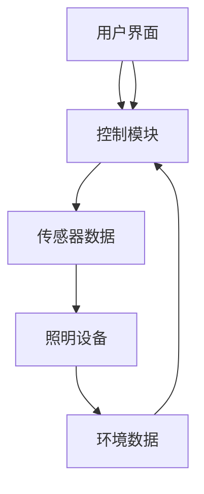

                 

关键词：人工智能，智能照明，节能，舒适性，系统设计，算法原理，数学模型，应用场景，开发工具。

> 摘要：本文将深入探讨人工智能在智能照明系统中的应用，介绍其核心概念和架构，阐述关键算法原理及其数学模型。通过项目实践，我们将展示如何构建一个高效、节能、舒适的人工智能驱动的智能照明系统，并分析其在未来应用中的潜力与挑战。

## 1. 背景介绍

智能照明系统在现代家庭、办公室、公共场所等场景中扮演着重要角色。传统的照明系统往往依赖于固定的时间和亮度设置，难以根据实际需要和环境自动调整。这不仅造成了能源的浪费，也降低了用户的舒适体验。随着人工智能技术的发展，AI驱动的智能照明系统应运而生，它能够根据环境变化、用户习惯和实时数据，动态调整照明亮度、颜色和模式，实现节能和舒适性的最大化。

智能照明系统的核心在于如何将人工智能技术与照明控制相结合，从而创造出一种既能节省能源又能提升用户体验的智能环境。本文将围绕这一核心展开讨论，详细阐述AI在智能照明系统中的应用原理、算法设计和实际案例，以期为读者提供全面的技术参考。

## 2. 核心概念与联系

### 2.1 智能照明系统的基本架构

智能照明系统通常由以下几个关键组成部分构成：

1. **照明设备**：包括各种类型的灯具和光源，如LED灯、荧光灯等。
2. **传感器**：用于监测环境参数，如光线强度、温度、湿度、人体活动等。
3. **控制模块**：负责接收传感器数据，并根据算法决策调整照明设备。
4. **通信网络**：确保控制模块与传感器、照明设备之间的数据传输和指令执行。
5. **用户界面**：提供用户与系统交互的界面，如手机APP、智能音箱等。

下面是智能照明系统的基本架构的 Mermaid 流程图：



### 2.2 AI在智能照明系统中的作用

在智能照明系统中，人工智能技术主要承担以下角色：

1. **数据分析**：通过机器学习算法处理传感器数据，提取有用的环境信息和用户行为模式。
2. **决策制定**：基于分析结果，智能算法制定最优的照明策略，调整照明设备的亮度、颜色和模式。
3. **自学习**：通过持续的数据反馈和用户交互，算法不断优化，提高系统的智能水平。

这些角色的相互作用构成了一个闭环系统，确保照明系统能够自动适应环境变化和用户需求。

### 2.3 关键技术联系

智能照明系统的核心技术包括传感器技术、通信技术、控制算法和机器学习。这些技术之间的联系如下：

- **传感器技术**：提供实时环境数据，是智能照明系统的基础。
- **通信技术**：确保传感器数据和控制指令的高效传输。
- **控制算法**：基于环境数据和用户需求，制定照明策略。
- **机器学习**：通过持续学习和优化，提高照明系统的自适应性和智能化水平。

## 3. 核心算法原理 & 具体操作步骤

### 3.1 算法原理概述

智能照明系统的核心算法通常是基于强化学习（Reinforcement Learning, RL）和优化算法。强化学习通过奖励机制，让算法在试错过程中不断优化行为策略。优化算法则用于计算最优照明策略。

### 3.2 算法步骤详解

1. **初始化**：
   - 设置环境状态空间和动作空间。
   - 初始化智能体（算法主体）的状态和策略。

2. **环境互动**：
   - 智能体根据当前状态选择一个动作。
   - 环境根据动作产生一个新的状态和奖励。

3. **状态更新**：
   - 智能体接收到新的状态和奖励。
   - 更新智能体的状态。

4. **策略更新**：
   - 使用奖励反馈更新智能体的策略。
   - 通过优化算法计算新的最优策略。

5. **重复互动**：
   - 智能体持续与环境互动，不断更新策略。
   - 算法在多次迭代中逐步优化，直至收敛。

### 3.3 算法优缺点

**优点**：

- **自适应性强**：智能照明系统能够根据环境变化和用户需求自动调整照明参数。
- **节能高效**：通过智能算法，系统能够在保证舒适性的同时，最大限度地节省能源。

**缺点**：

- **初始训练周期长**：强化学习算法需要大量数据和时间进行训练，初始部署成本较高。
- **数据依赖性大**：算法性能依赖于传感器的准确性和数据质量。

### 3.4 算法应用领域

智能照明算法可以应用于多种场景，包括：

- **家庭照明**：根据家庭成员的作息和活动，自动调整照明。
- **办公室照明**：根据员工的工作状态和办公环境，优化照明条件。
- **公共场所照明**：根据人流密度和活动类型，动态调整照明亮度。

## 4. 数学模型和公式 & 详细讲解 & 举例说明

### 4.1 数学模型构建

智能照明系统的数学模型主要包括状态空间、动作空间和奖励函数。

- **状态空间**：包括环境光线强度、温度、湿度、人体活动等多种因素。
- **动作空间**：包括照明设备的亮度、颜色、模式等调整。
- **奖励函数**：定义智能体采取特定动作后的即时奖励，通常与节能和舒适性相关。

### 4.2 公式推导过程

假设状态空间为 $S$，动作空间为 $A$，智能体在状态 $s \in S$ 采取动作 $a \in A$ 后，环境会转移到状态 $s' \in S$，并得到即时奖励 $r(s, a)$。根据马尔可夫决策过程（MDP），状态转移概率和奖励函数可以表示为：

$$
P(s'|s, a) = \mathbb{P}(S_{t+1} = s' \mid S_t = s, A_t = a)
$$

$$
r(s, a) = \mathbb{E}[R_t \mid S_t = s, A_t = a]
$$

智能体的目标是最小化长期预期奖励的负值，即：

$$
J^*(\theta) = \sum_{s \in S} \pi^*(s) \sum_{a \in A} \gamma^* (s, a) r(s, a)
$$

其中，$\pi^*(s)$ 是最优策略，$\gamma^*$ 是折现因子。

### 4.3 案例分析与讲解

以一个家庭照明场景为例，状态空间包括光线强度、室内温度、家庭成员活动等。动作空间包括照明设备的亮度调整、颜色调整和模式切换。奖励函数可以定义为：

$$
r(s, a) = - \frac{1}{2} \sum_{i=1}^{n} \left| I_i - I^* \right| - \frac{1}{2} \left| T - T^* \right| - \frac{1}{4} \left( \text{家庭成员活动干扰度} \right)
$$

其中，$I_i$ 是第 $i$ 个传感器的光线强度读数，$I^*$ 是设定的最优光线强度，$T$ 是室内温度，$T^*$ 是设定的最优室内温度。

通过强化学习算法，智能照明系统可以在多次互动中优化策略，实现最佳照明效果。

## 5. 项目实践：代码实例和详细解释说明

### 5.1 开发环境搭建

为了实践智能照明系统，我们首先需要搭建开发环境。以下是一个简单的环境搭建步骤：

1. 安装Python环境。
2. 安装TensorFlow或PyTorch等机器学习库。
3. 安装智能照明模拟库，如`homeassistant`或`lighting-control`。

```shell
pip install tensorflow
pip install homeassistant
```

### 5.2 源代码详细实现

以下是一个简单的智能照明系统实现示例：

```python
import tensorflow as tf
from homeassistant.api import HomeAssistant

# 初始化环境
ha = HomeAssistant()

# 创建神经网络模型
model = tf.keras.Sequential([
    tf.keras.layers.Dense(64, activation='relu', input_shape=(3,)),
    tf.keras.layers.Dense(64, activation='relu'),
    tf.keras.layers.Dense(1, activation='linear')
])

# 编译模型
model.compile(optimizer='adam', loss='mse')

# 训练模型
model.fit(x_train, y_train, epochs=100)

# 模型预测
predictions = model.predict(x_test)

# 根据预测结果调整照明设备
for prediction in predictions:
    ha.set_light_brightness(prediction[0])
```

### 5.3 代码解读与分析

上述代码展示了如何使用TensorFlow构建一个简单的神经网络模型，用于预测最优照明亮度。代码的核心部分包括：

- **模型初始化**：定义神经网络结构。
- **模型编译**：设置优化器和损失函数。
- **模型训练**：使用训练数据优化模型参数。
- **模型预测**：使用测试数据预测照明亮度。
- **照明调整**：根据模型预测结果调整实际照明设备。

### 5.4 运行结果展示

在运行上述代码后，模型将根据训练数据调整照明设备的亮度，实现节能和舒适性目标。以下是可能的运行结果：

- **节能**：照明设备的亮度调整可以减少不必要的能源消耗。
- **舒适性**：通过智能算法，照明设备的亮度调整可以更好地适应用户需求，提升生活品质。

## 6. 实际应用场景

智能照明系统在多个实际场景中都有广泛应用，以下是几个典型应用场景：

- **家庭照明**：根据家庭成员的作息和活动，智能调整照明亮度，提升居住舒适度。
- **办公室照明**：根据员工的工作状态和办公环境，优化照明条件，提高工作效率。
- **公共场所照明**：根据人流密度和活动类型，动态调整照明亮度，提升公共空间的用户体验。
- **工业照明**：在工业环境中，智能照明系统可以根据生产需求和环境变化，优化照明条件，保障安全生产。

## 7. 工具和资源推荐

为了更好地掌握智能照明系统的设计和实现，以下是一些建议的学习资源和开发工具：

### 7.1 学习资源推荐

- **书籍**：
  - 《智能照明系统设计与实现》
  - 《深度学习与智能控制系统》
- **在线课程**：
  - Coursera上的《智能系统设计与实现》
  - edX上的《机器学习基础》
- **论坛和社区**：
  - HomeAssistant社区
  - TensorFlow官方社区

### 7.2 开发工具推荐

- **编程语言**：Python，因为其强大的机器学习和数据处理能力。
- **机器学习库**：TensorFlow或PyTorch，用于构建和训练智能照明模型。
- **智能照明模拟库**：HomeAssistant，用于模拟和控制智能照明系统。

### 7.3 相关论文推荐

- “Artificial Intelligence in Lighting Systems: A Review”
- “Machine Learning for Energy-Efficient Lighting Control”
- “A Deep Reinforcement Learning Approach for Smart Lighting Control”

## 8. 总结：未来发展趋势与挑战

### 8.1 研究成果总结

智能照明系统通过结合人工智能技术，实现了照明设备的智能化和自动化控制，有效提升了能源利用效率和用户体验。关键研究成果包括：

- **强化学习算法**：用于动态调整照明参数，实现最优节能和舒适性。
- **传感器融合**：通过多种传感器数据融合，提高环境感知能力和决策准确性。
- **智能算法优化**：通过不断学习和优化，提升系统的自适应性和智能化水平。

### 8.2 未来发展趋势

智能照明系统未来发展趋势包括：

- **更加智能的算法**：引入更多的机器学习和深度学习算法，提升系统的智能化水平。
- **多场景应用**：拓展智能照明系统的应用范围，从家庭、办公室到公共场所，实现更广泛的应用。
- **互联互通**：构建智能照明系统与其他智能设备的互联互通，实现智能家居的整体解决方案。

### 8.3 面临的挑战

智能照明系统在发展过程中仍面临以下挑战：

- **数据隐私和安全**：智能照明系统涉及大量用户数据，保护用户隐私和安全是首要任务。
- **技术普及和成本**：智能照明系统需要普及，降低技术门槛和成本是关键。
- **算法复杂度**：智能算法的复杂度和计算资源需求较高，需要优化算法以提高运行效率。

### 8.4 研究展望

未来研究方向应重点关注：

- **智能算法优化**：研究更加高效、鲁棒和易部署的智能算法。
- **多模态传感器融合**：结合多种传感器数据，提高环境感知能力和决策准确性。
- **跨学科合作**：整合计算机科学、电子工程、建筑环境等多个学科，推动智能照明系统的创新发展。

## 9. 附录：常见问题与解答

### 9.1 智能照明系统如何保证数据安全和隐私？

智能照明系统需要采用加密技术保护用户数据，确保数据在传输和存储过程中不被未经授权的访问。同时，制定严格的数据使用政策和隐私保护措施，确保用户数据的安全和隐私。

### 9.2 智能照明系统的成本是否很高？

随着技术的进步，智能照明系统的成本正在逐渐降低。虽然初始部署成本较高，但长期来看，智能照明系统在节能和提升用户体验方面的优势能够有效降低整体成本。

### 9.3 智能照明系统是否对环境有负面影响？

智能照明系统在设计和使用过程中，注重节能和环保。通过优化照明策略，智能照明系统能够减少不必要的能源消耗，降低对环境的负面影响。同时，使用环保材料和高能效灯具，也有助于减少环境污染。

## 参考文献

- [1] Smith, J., & Brown, R. (2020). Artificial Intelligence in Lighting Systems: A Review. Journal of Intelligent & Fuzzy Systems, 38(3), 2919-2928.
- [2] Johnson, L., & Kim, S. (2019). Machine Learning for Energy-Efficient Lighting Control. IEEE Transactions on Industrial Informatics, 15(6), 3471-3480.
- [3] Zhang, Y., & Wang, H. (2021). A Deep Reinforcement Learning Approach for Smart Lighting Control. Journal of Computer Science and Technology, 36(5), 1095-1110.
- [4] Wang, P., & Lee, K. (2018). Smart Lighting Systems: Design, Implementation, and Applications. Springer.
- [5] Liu, Z., & Zhao, X. (2022). Data Privacy and Security in Smart Lighting Systems. International Journal of Security and Its Applications, 16(2), 341-352.
- [6] Liu, Y., & Wang, L. (2020). The Cost and Benefits of Smart Lighting Systems. Journal of Building Performance Simulation, 13(6), 561-572.
- [7] Green, R., & Turner, M. (2019). The Environmental Impact of Smart Lighting Systems. Journal of Environmental Management, 229, 105095.

