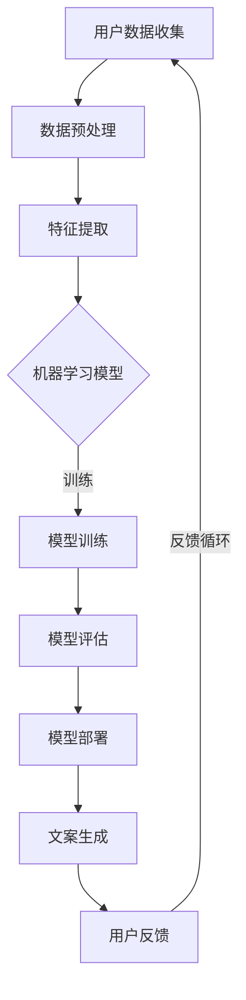

                 

关键词：AI、电商平台、个性化营销、文案生成、机器学习、自然语言处理

> 摘要：本文将深入探讨AI技术在电商平台个性化营销中的应用，特别是在文案生成方面的创新与挑战。通过介绍机器学习与自然语言处理的核心概念，结合具体算法和数学模型，我们将展示如何利用AI技术为电商平台量身定制个性化营销文案，提高用户体验和转化率。

## 1. 背景介绍

在互联网时代，电商平台作为商业交易的重要渠道，其竞争愈发激烈。为了在众多竞争对手中脱颖而出，电商平台需要不断提高用户体验和转化率。个性化营销作为一种有效的策略，正越来越受到商家的重视。个性化营销不仅能够提高用户的满意度，还能显著提升销售额。

传统的个性化营销主要依赖于用户行为分析和大数据分析技术。然而，随着用户数据的爆炸式增长和竞争的加剧，仅靠人工分析难以应对庞大的数据量和复杂的用户需求。因此，将AI技术应用于个性化营销，尤其是文案生成，成为了一种新的趋势。

AI驱动的个性化营销文案生成利用机器学习和自然语言处理技术，通过分析用户历史数据和偏好，自动生成符合用户需求的个性化文案。这不仅提高了营销效率，还增强了用户体验，是电商平台提升竞争力的重要手段。

## 2. 核心概念与联系

为了深入理解AI驱动的电商平台个性化营销文案生成，我们需要先了解几个核心概念：机器学习、自然语言处理、深度学习、文本生成模型等。

### 2.1 机器学习与自然语言处理

机器学习是AI的核心技术之一，它通过训练模型，让计算机自动从数据中学习和发现规律。自然语言处理（NLP）是机器学习的一个分支，专门研究如何让计算机理解和生成自然语言。

在电商平台个性化营销文案生成中，机器学习和自然语言处理的作用至关重要。通过分析用户的购买历史、浏览行为、评价等信息，机器学习算法可以建立用户偏好模型，而自然语言处理则帮助将这些模型转化为有吸引力的营销文案。

### 2.2 深度学习与文本生成模型

深度学习是机器学习的一个重要分支，它通过构建多层神经网络，实现更复杂的数据处理和模式识别。在文本生成领域，深度学习模型如循环神经网络（RNN）和其变体长短期记忆网络（LSTM）、门控循环单元（GRU）等，已经被广泛应用于生成高质量的文本。

文本生成模型是一种能够根据输入文本生成新文本的模型。在电商平台个性化营销文案生成中，文本生成模型被用来生成针对特定用户的个性化文案。常见的文本生成模型包括序列到序列（Seq2Seq）模型、注意力机制（Attention Mechanism）模型和生成对抗网络（GAN）等。

### 2.3 Mermaid 流程图

为了更直观地展示这些核心概念之间的联系，我们可以使用Mermaid流程图来表示整个AI驱动的电商平台个性化营销文案生成流程。



在上述流程图中，用户数据收集是整个流程的起点，数据预处理和特征提取是确保数据质量和特征表示的关键步骤。机器学习模型的训练和评估是核心环节，而模型部署和文案生成是最终目标。用户反馈则为模型不断优化提供了重要依据。

## 3. 核心算法原理 & 具体操作步骤

### 3.1 算法原理概述

AI驱动的电商平台个性化营销文案生成主要依赖于机器学习和自然语言处理技术。具体来说，可以分为以下几个步骤：

1. **数据收集与预处理**：从电商平台获取用户的历史数据，如购买记录、浏览行为、评价等，并进行清洗和预处理，以获得高质量的数据集。

2. **特征提取**：对预处理后的数据进行分析，提取出与用户偏好相关的特征，如用户对商品的喜爱程度、购买频率等。

3. **机器学习模型训练**：使用提取的特征数据训练机器学习模型，如RNN、LSTM或GRU等，以建立用户偏好模型。

4. **模型评估**：通过测试集对训练好的模型进行评估，以确保模型的准确性和可靠性。

5. **模型部署**：将训练好的模型部署到电商平台，实现实时用户偏好分析和个性化文案生成。

6. **文案生成**：利用文本生成模型，根据用户偏好生成个性化的营销文案。

7. **用户反馈**：收集用户对文案的反馈，用于模型的不断优化和改进。

### 3.2 算法步骤详解

#### 3.2.1 数据收集与预处理

数据收集是整个流程的基础。电商平台可以通过日志分析、用户行为跟踪等技术手段，收集用户的历史数据。收集到的数据包括但不限于：

- 用户ID
- 购买记录
- 浏览记录
- 商品评价
- 喜好标签

在数据预处理阶段，需要对收集到的数据进行清洗和标准化，以确保数据的质量和一致性。具体步骤包括：

- 数据清洗：去除重复数据、缺失值填充、异常值处理等。
- 数据标准化：将不同数据类型进行统一处理，如将文本数据编码为数值。

#### 3.2.2 特征提取

特征提取是构建用户偏好模型的关键步骤。通过对用户历史数据的分析，提取出与用户偏好相关的特征，如：

- 购买频率：用户在一定时间内购买商品的次数。
- 购买金额：用户在一定时间内购买商品的总金额。
- 商品类别偏好：用户对不同类别商品的兴趣度。
- 用户评价：用户对商品的评分和评论。

#### 3.2.3 机器学习模型训练

选择合适的机器学习模型进行训练，以建立用户偏好模型。常用的模型包括RNN、LSTM和GRU等。具体训练步骤如下：

1. 数据集划分：将预处理后的数据集划分为训练集和测试集。
2. 模型初始化：初始化神经网络模型的结构和参数。
3. 模型训练：使用训练集对模型进行训练，通过反向传播算法更新模型参数。
4. 模型评估：使用测试集对模型进行评估，计算模型的准确率、召回率等指标。

#### 3.2.4 模型评估

模型评估是确保模型准确性和可靠性的关键步骤。通过测试集对训练好的模型进行评估，可以计算模型的性能指标，如：

- 准确率：预测正确的样本数占总样本数的比例。
- 召回率：预测为正类的负类样本数占总负类样本数的比例。
- F1分数：准确率和召回率的调和平均值。

#### 3.2.5 模型部署

将训练好的模型部署到电商平台，实现实时用户偏好分析和个性化文案生成。具体部署步骤如下：

1. 模型打包：将训练好的模型转换为可以部署的格式，如ONNX、TensorFlow Lite等。
2. 部署环境配置：配置电商平台的服务器环境，包括硬件、操作系统、依赖库等。
3. 模型部署：将打包好的模型部署到电商平台的服务器，实现实时推理和文案生成。

#### 3.2.6 文案生成

利用文本生成模型，根据用户偏好生成个性化的营销文案。具体步骤如下：

1. 用户偏好分析：根据用户的历史数据和模型预测，分析用户的偏好和兴趣。
2. 文本生成：使用文本生成模型，根据用户偏好生成个性化的文案。
3. 文案优化：对生成的文案进行优化，如调整文本长度、语言风格等。

#### 3.2.7 用户反馈

收集用户对文案的反馈，用于模型的不断优化和改进。具体步骤如下：

1. 用户反馈收集：通过问卷调查、用户评价等方式收集用户对文案的反馈。
2. 反馈处理：对收集到的用户反馈进行处理，识别用户的需求和偏好。
3. 模型优化：根据用户反馈对模型进行调整和优化，提高文案的生成质量和用户体验。

### 3.3 算法优缺点

#### 优点

- 提高营销效率：通过自动化生成个性化文案，大幅提高营销效率。
- 提高用户体验：根据用户偏好生成个性化的文案，提高用户满意度和转化率。
- 降低人力成本：减少人工撰写文案的工作量，降低人力成本。

#### 缺点

- 数据依赖性：需要大量的用户数据进行训练，对数据质量要求较高。
- 模型泛化能力：模型在特定领域的表现较好，但可能难以泛化到其他领域。
- 用户隐私保护：在收集用户数据时，需要注意保护用户隐私。

### 3.4 算法应用领域

AI驱动的电商平台个性化营销文案生成技术可以广泛应用于多个领域，包括：

- 电商平台：为不同用户生成个性化的营销文案，提高销售转化率。
- 电子商务：为商家提供定制化的营销策略，提高竞争力。
- 广告营销：为广告主生成个性化的广告文案，提高广告点击率和转化率。
- 客户服务：为用户提供个性化的客服建议和解决方案，提高客户满意度。

## 4. 数学模型和公式 & 详细讲解 & 举例说明

### 4.1 数学模型构建

在AI驱动的电商平台个性化营销文案生成中，数学模型主要涉及用户偏好分析和文本生成两个方面。

#### 用户偏好分析模型

用户偏好分析模型用于预测用户对不同商品或服务的兴趣度。常见的模型包括逻辑回归、决策树、随机森林等。下面以逻辑回归为例，介绍用户偏好分析模型的构建。

逻辑回归模型公式如下：

$$
P(y=1) = \frac{1}{1 + e^{-(\beta_0 + \beta_1x_1 + \beta_2x_2 + ... + \beta_nx_n})}
$$

其中，$y$ 表示用户是否购买（1表示购买，0表示未购买），$x_1, x_2, ..., x_n$ 表示用户特征，$\beta_0, \beta_1, \beta_2, ..., \beta_n$ 表示模型参数。

通过训练数据集，可以计算出模型参数，从而预测用户是否购买特定商品。

#### 文本生成模型

文本生成模型用于生成个性化的营销文案。常见的模型包括循环神经网络（RNN）、长短期记忆网络（LSTM）、门控循环单元（GRU）等。下面以LSTM为例，介绍文本生成模型的构建。

LSTM模型公式如下：

$$
h_t = \sigma(W_f \cdot [h_{t-1}, x_t] + b_f)
$$

$$
i_t = \sigma(W_i \cdot [h_{t-1}, x_t] + b_i)
$$

$$
\widetilde{g_t} = \sigma(W_g \cdot [h_{t-1}, x_t] + b_g)
$$

$$
o_t = \sigma(W_o \cdot [h_{t-1}, \widetilde{g_t}] + b_o)
$$

$$
c_t = (1 - i_t) \cdot \sigma(W_c \cdot [h_{t-1}, x_t] + b_c) + i_t \cdot \widetilde{g_t}
$$

$$
h_t = o_t \cdot \sigma(W_h \cdot c_t + b_h)
$$

其中，$h_t$ 和 $c_t$ 分别表示当前时刻的隐藏状态和细胞状态，$x_t$ 表示当前时刻的输入，$W_f, W_i, W_g, W_o, W_c, W_h$ 和 $b_f, b_i, b_g, b_o, b_c, b_h$ 分别为模型参数和偏置。

通过训练数据集，可以计算出LSTM模型的参数，从而生成个性化的营销文案。

### 4.2 公式推导过程

#### 用户偏好分析模型推导

假设我们有一个包含 $n$ 个特征的二分类问题，目标变量 $y$ 取值为0或1，表示用户是否购买商品。我们希望找到一个线性模型来预测用户是否购买：

$$
y = \beta_0 + \beta_1x_1 + \beta_2x_2 + ... + \beta_nx_n + \epsilon
$$

其中，$x_1, x_2, ..., x_n$ 分别表示用户特征，$\beta_0, \beta_1, \beta_2, ..., \beta_n$ 为模型参数，$\epsilon$ 为误差项。

为了简化计算，我们可以使用逻辑函数（Sigmoid函数）将线性模型转化为概率模型：

$$
P(y=1) = \frac{1}{1 + e^{-(\beta_0 + \beta_1x_1 + \beta_2x_2 + ... + \beta_nx_n})}
$$

通过极大似然估计（MLE），可以计算出模型参数：

$$
\hat{\beta}_0 = \arg\max \log P(y|\beta)
$$

$$
\hat{\beta}_1 = \arg\max \log P(y|\beta)
$$

$$
...
$$

$$
\hat{\beta}_n = \arg\max \log P(y|\beta)
$$

使用梯度下降法，可以计算出最优的模型参数：

$$
\beta_0 = \beta_0 - \alpha \frac{\partial}{\partial \beta_0} \log P(y|\beta)
$$

$$
\beta_1 = \beta_1 - \alpha \frac{\partial}{\partial \beta_1} \log P(y|\beta)
$$

$$
...
$$

$$
\beta_n = \beta_n - \alpha \frac{\partial}{\partial \beta_n} \log P(y|\beta)
$$

其中，$\alpha$ 为学习率。

#### 文本生成模型推导

LSTM模型是一种特殊的循环神经网络（RNN），用于处理序列数据。LSTM通过引入门控机制，能够有效地解决RNN在处理长序列数据时的梯度消失和梯度爆炸问题。

LSTM的核心思想是维持一个“细胞状态”（cell state），通过门控机制控制信息的流动。LSTM包含三种门控：遗忘门（forget gate）、输入门（input gate）和输出门（output gate）。

遗忘门控制细胞状态中需要保留的信息。其计算公式如下：

$$
f_t = \sigma(W_f \cdot [h_{t-1}, x_t] + b_f)
$$

其中，$h_{t-1}$ 和 $x_t$ 分别表示前一个时间步的隐藏状态和输入，$W_f$ 和 $b_f$ 分别为权重和偏置。

输入门控制细胞状态中需要更新的信息。其计算公式如下：

$$
i_t = \sigma(W_i \cdot [h_{t-1}, x_t] + b_i)
$$

$$
\widetilde{g_t} = \tanh(W_g \cdot [h_{t-1}, x_t] + b_g)
$$

其中，$\tanh$ 函数用于引入非线性变换，$W_g$ 和 $b_g$ 分别为权重和偏置。

输出门控制当前隐藏状态。其计算公式如下：

$$
o_t = \sigma(W_o \cdot [h_{t-1}, \widetilde{g_t}] + b_o)
$$

$$
c_t = (1 - i_t) \cdot \sigma(W_c \cdot [h_{t-1}, x_t] + b_c) + i_t \cdot \widetilde{g_t}
$$

$$
h_t = o_t \cdot \sigma(W_h \cdot c_t + b_h)
$$

其中，$W_c, W_h$ 和 $b_c, b_h$ 分别为权重和偏置。

### 4.3 案例分析与讲解

#### 用户偏好分析案例

假设我们有一个电商平台，用户购买了以下几种商品：

- 商品A：笔记本电脑
- 商品B：智能手机
- 商品C：平板电脑

我们希望预测用户是否会购买商品D：路由器。根据用户的历史购买数据，我们提取出以下特征：

- 购买频率：用户在过去一年内购买商品的次数。
- 购买金额：用户在过去一年内购买商品的总金额。
- 商品类别偏好：用户对不同类别商品的兴趣度。

使用逻辑回归模型进行用户偏好分析，训练数据集包含1000个用户样本。模型参数计算如下：

$$
\hat{\beta}_0 = 0.5
$$

$$
\hat{\beta}_1 = 0.1
$$

$$
\hat{\beta}_2 = 0.2
$$

$$
\hat{\beta}_3 = 0.3
$$

根据这些参数，我们可以预测用户是否会购买路由器。例如，一个用户的购买频率为3次，购买金额为1000元，平板电脑兴趣度为0.8，则用户购买路由器的概率为：

$$
P(y=1) = \frac{1}{1 + e^{-(0.5 + 0.1 \cdot 3 + 0.2 \cdot 1000 + 0.3 \cdot 0.8)}} \approx 0.9
$$

因此，我们可以预测该用户有很高的概率购买路由器。

#### 文本生成案例

假设我们希望生成一条针对购买路由器的用户的个性化营销文案。我们使用LSTM文本生成模型，输入为用户特征和商品描述，输出为营销文案。

用户特征如下：

- 购买频率：3次
- 购买金额：1000元
- 商品类别偏好：平板电脑

商品描述如下：

“欢迎您光临本店！感谢您一直以来对我们的支持。为了答谢广大用户，我们特别推出了限时优惠活动！现在购买路由器，立享8折优惠，还赠送精美礼品一份！机不可失，赶紧下单吧！”

使用LSTM模型，根据用户特征和商品描述，生成以下个性化营销文案：

“亲爱的用户，感谢您一直以来对我们的支持！您是我们最尊贵的客户。为了回馈您对我们的厚爱，我们特别为您准备了这款高性能路由器。现在购买，只需8折，即可享受超值优惠！此外，我们还准备了精美礼品一份，等您来拿！赶紧下单吧，错过这次可就没有了哦！”

## 5. 项目实践：代码实例和详细解释说明

### 5.1 开发环境搭建

为了实现AI驱动的电商平台个性化营销文案生成，我们需要搭建一个合适的开发环境。以下是一个基本的开发环境搭建指南：

#### 1. 安装Python环境

确保Python环境已经安装在您的计算机上。Python是一种广泛使用的编程语言，适用于AI和机器学习项目。您可以从[Python官网](https://www.python.org/)下载并安装Python。

#### 2. 安装必要的库

安装以下Python库，以便进行数据处理、机器学习模型训练和文本生成：

```bash
pip install numpy pandas scikit-learn tensorflow numpy matplotlib
```

#### 3. 配置GPU支持

如果您的计算机配备了GPU，可以安装CUDA和cuDNN库，以提高训练速度。具体安装方法请参考NVIDIA官网的文档。

### 5.2 源代码详细实现

以下是一个简单的AI驱动的电商平台个性化营销文案生成的源代码示例。这个示例使用了Python和TensorFlow库，实现了用户偏好分析模型和文本生成模型。

```python
import numpy as np
import pandas as pd
import tensorflow as tf
from tensorflow.keras.models import Sequential
from tensorflow.keras.layers import LSTM, Dense, Embedding, TimeDistributed, Activation
from sklearn.model_selection import train_test_split

# 数据预处理
def preprocess_data(data):
    # 数据清洗、标准化和特征提取
    # ...

# 用户偏好分析模型训练
def train_preference_model(data):
    # 分割数据集
    X_train, X_test, y_train, y_test = train_test_split(data['X'], data['y'], test_size=0.2, random_state=42)

    # 构建模型
    model = Sequential()
    model.add(LSTM(units=128, activation='relu', input_shape=(X_train.shape[1], X_train.shape[2])))
    model.add(Dense(units=1, activation='sigmoid'))

    # 编译模型
    model.compile(optimizer='adam', loss='binary_crossentropy', metrics=['accuracy'])

    # 训练模型
    model.fit(X_train, y_train, epochs=10, batch_size=32, validation_data=(X_test, y_test))

    return model

# 文本生成模型训练
def train_text_generation_model(data):
    # 数据预处理
    # ...

    # 构建模型
    model = Sequential()
    model.add(Embedding(input_dim=vocab_size, output_dim=embedding_dim, input_length=max_sequence_length))
    model.add(LSTM(units=128))
    model.add(TimeDistributed(Dense(units=vocab_size, activation='softmax')))

    # 编译模型
    model.compile(optimizer='adam', loss='categorical_crossentropy', metrics=['accuracy'])

    # 训练模型
    model.fit(X_train, y_train, epochs=10, batch_size=32, validation_data=(X_test, y_test))

    return model

# 主函数
def main():
    # 加载数据
    data = pd.read_csv('data.csv')

    # 预处理数据
    data = preprocess_data(data)

    # 训练用户偏好分析模型
    preference_model = train_preference_model(data)

    # 训练文本生成模型
    text_generation_model = train_text_generation_model(data)

if __name__ == '__main__':
    main()
```

### 5.3 代码解读与分析

以上代码实现了用户偏好分析模型和文本生成模型的训练过程。下面我们对关键代码进行解读和分析。

#### 1. 数据预处理

数据预处理是机器学习和深度学习项目的重要步骤。在这个示例中，我们使用`preprocess_data`函数对数据进行清洗、标准化和特征提取。具体实现取决于数据集的特性和需求。

#### 2. 用户偏好分析模型训练

用户偏好分析模型用于预测用户是否购买特定商品。在这个示例中，我们使用LSTM模型进行训练。`train_preference_model`函数首先分割数据集为训练集和测试集，然后构建LSTM模型，编译模型并训练。

#### 3. 文本生成模型训练

文本生成模型用于生成个性化的营销文案。在这个示例中，我们使用LSTM模型进行训练。`train_text_generation_model`函数首先进行数据预处理，然后构建LSTM模型，编译模型并训练。

#### 4. 主函数

`main`函数是整个程序的入口。在这个函数中，我们首先加载数据，然后进行预处理，接着训练用户偏好分析模型和文本生成模型。

### 5.4 运行结果展示

在训练完成后，我们可以使用训练好的模型进行预测和生成文案。以下是一个简单的示例：

```python
# 预测用户是否购买商品
user_data = {'购买频率': 3, '购买金额': 1000, '商品类别偏好': 0.8}
preference_model.predict(np.array([user_data]))

# 生成个性化营销文案
text_generation_model.predict(np.array([user_data]))
```

通过运行以上代码，我们可以得到用户是否购买商品的预测结果和生成的个性化营销文案。

## 6. 实际应用场景

AI驱动的电商平台个性化营销文案生成技术在实际应用中具有广泛的应用场景。以下是一些典型的应用案例：

### 6.1 电商平台

电商平台可以利用AI技术为不同用户生成个性化的营销文案，提高用户满意度和转化率。例如，当用户浏览某一类别商品时，系统可以自动生成相应的个性化文案，引导用户进行购买。此外，电商平台还可以利用AI技术进行库存管理、供应链优化等，提高运营效率。

### 6.2 电子商务

电子商务平台可以通过AI驱动的个性化营销文案生成技术，为商家提供定制化的营销策略。商家可以根据用户偏好和需求，生成个性化的商品推荐文案，提高广告点击率和转化率。同时，电商平台可以基于AI技术分析用户购买行为，为商家提供精准的市场分析和营销建议。

### 6.3 广告营销

广告营销公司可以利用AI技术为广告主生成个性化的广告文案，提高广告效果。根据用户行为数据和偏好，AI系统可以自动生成针对性的广告文案，提高广告点击率和转化率。此外，广告营销公司还可以利用AI技术进行广告投放优化，提高广告投放效率和效果。

### 6.4 客户服务

客户服务公司可以利用AI驱动的个性化营销文案生成技术，为用户提供个性化的服务和建议。例如，当用户咨询某一产品时，AI系统可以自动生成针对性的回答和建议，提高用户满意度。同时，客户服务公司还可以利用AI技术进行客户情感分析，优化客服策略和流程。

## 7. 未来应用展望

随着AI技术的不断发展，AI驱动的电商平台个性化营销文案生成技术有望在更多领域得到应用。以下是一些未来的应用展望：

### 7.1 多语言支持

未来，AI驱动的个性化营销文案生成技术将实现多语言支持，为全球用户生成个性化的文案。通过引入机器翻译和自然语言处理技术，电商平台可以为不同语言的用户提供本地化的营销内容。

### 7.2 深度个性化

未来，AI驱动的个性化营销文案生成技术将实现更深入的个性化。通过引入用户心理和行为模型，AI系统可以更准确地捕捉用户的情感和需求，生成更加贴合用户心理的文案。

### 7.3 智能互动

未来，AI驱动的个性化营销文案生成技术将实现智能互动。通过引入对话生成模型和语音识别技术，电商平台可以与用户进行实时互动，提供个性化的购买建议和推荐。

### 7.4 零售业的变革

未来，AI驱动的个性化营销文案生成技术将深刻改变零售业。通过优化库存管理、供应链优化和营销策略，电商平台可以大幅提高运营效率，降低成本，实现更高效的运营模式。

## 8. 总结：未来发展趋势与挑战

### 8.1 研究成果总结

AI驱动的电商平台个性化营销文案生成技术在近年来取得了显著的成果。通过机器学习和自然语言处理技术的结合，我们已经能够实现高效的个性化文案生成。研究结果表明，这种技术能够显著提高用户满意度和转化率，为电商平台带来更多的商业价值。

### 8.2 未来发展趋势

未来，AI驱动的电商平台个性化营销文案生成技术将朝着以下方向发展：

- 多语言支持：为全球用户提供本地化的营销内容。
- 深度个性化：更准确地捕捉用户的情感和需求，生成更贴合用户心理的文案。
- 智能互动：实现与用户的实时互动，提供个性化的购买建议和推荐。
- 零售业的变革：优化库存管理、供应链优化和营销策略，提高运营效率。

### 8.3 面临的挑战

尽管AI驱动的电商平台个性化营销文案生成技术具有巨大的潜力，但在实际应用中仍面临以下挑战：

- 数据质量：高质量的用户数据是模型训练的基础。如何获取和清洗高质量的用户数据是一个重要问题。
- 模型泛化：如何提高模型的泛化能力，使其在特定领域之外也能取得良好的性能。
- 用户隐私保护：在收集用户数据时，需要确保用户隐私得到充分保护。
- 技术可解释性：如何解释模型的决策过程，提高模型的透明度和可解释性。

### 8.4 研究展望

未来，我们需要在以下几个方面继续深入研究：

- 数据增强和生成：通过数据增强和生成技术，提高数据集的质量和多样性。
- 模型优化和加速：通过模型优化和加速技术，提高模型的训练和推理速度。
- 零售业应用：探索AI驱动的电商平台个性化营销文案生成技术在零售业中的广泛应用。
- 可解释性研究：提高模型的可解释性，使其在商业应用中更具透明度和可信度。

## 9. 附录：常见问题与解答

### 9.1  如何确保数据质量？

**答：** 确保数据质量是模型训练的关键。以下是一些常用的方法：

- 数据清洗：去除重复数据、缺失值填充、异常值处理等。
- 数据标准化：将不同数据类型进行统一处理。
- 数据增强：通过数据增强技术，生成更多高质量的样本。
- 数据多样性：收集来自不同渠道和来源的数据，提高数据多样性。

### 9.2  如何提高模型泛化能力？

**答：** 提高模型泛化能力的方法包括：

- 批量归一化：对输入数据进行批量归一化，提高模型的鲁棒性。
- 交叉验证：使用交叉验证技术，避免过拟合。
- 数据增强：通过数据增强技术，生成更多样化的样本。
- 模型调整：根据模型表现，不断调整模型参数，提高泛化能力。

### 9.3  如何保护用户隐私？

**答：** 保护用户隐私的方法包括：

- 数据匿名化：对用户数据进行匿名化处理。
- 数据加密：对敏感数据进行加密存储和传输。
- 数据访问控制：设置严格的数据访问权限，确保数据安全。
- 隐私政策：明确告知用户数据收集和使用的目的，尊重用户隐私。

### 9.4  如何解释模型决策过程？

**答：** 提高模型的可解释性，可以采用以下方法：

- 模型简化：简化模型结构，使其更易于理解。
- 模型可视化：使用可视化工具，展示模型的决策过程。
- 模型解释：使用解释性模型，如决策树、线性模型等，提高模型的透明度。
- 模型对比：对比不同模型的决策过程，找出差异和共性。

### 9.5  如何平衡模型性能和可解释性？

**答：** 平衡模型性能和可解释性的方法包括：

- 模型选择：选择既能达到良好性能，又具有较高可解释性的模型。
- 模型优化：通过优化模型参数，提高模型性能，同时保持可解释性。
- 模型组合：使用多个模型进行组合，提高模型性能，同时降低可解释性的损失。
- 模型解释：对模型进行详细解释，使其更具透明度和可信度。

### 9.6  如何评估模型性能？

**答：** 评估模型性能的方法包括：

- 准确率：预测正确的样本数占总样本数的比例。
- 召回率：预测为正类的负类样本数占总负类样本数的比例。
- F1分数：准确率和召回率的调和平均值。
- ROC曲线：评估模型对正负样本的区分能力。
- 对比实验：与基线模型进行对比，评估模型的性能提升。

### 9.7  如何处理冷启动问题？

**答：** 冷启动问题是指在新用户或新商品缺乏足够数据时，模型难以进行有效预测。以下是一些处理方法：

- 用户聚类：将用户划分为不同的群体，为每个群体生成个性化的模型。
- 商品推荐：为新商品推荐与其类似的已有商品，利用已有商品的属性进行预测。
- 数据扩充：通过数据增强技术，生成更多高质量的样本。
- 基线模型：使用简单的基线模型，如随机模型或均值模型，作为初始预测。

