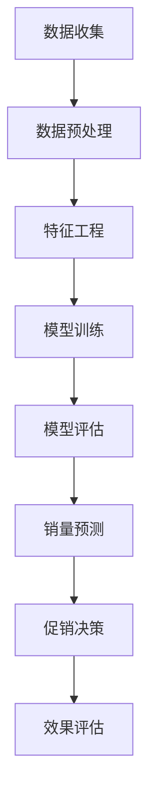

                 

关键词：AI，电商平台，商品销量预测，促销决策，数据挖掘，机器学习，算法原理，数学模型，项目实践，工具推荐，未来展望

## 摘要

随着电子商务的快速发展，电商平台对商品销量预测和促销决策的需求日益增加。本文将探讨如何利用人工智能技术，特别是机器学习和数据挖掘方法，来支持电商平台的商品销量预测与促销决策。文章首先介绍了电商平台商品销量预测与促销决策的背景和重要性，然后详细介绍了核心概念与联系，核心算法原理与具体操作步骤，数学模型与公式，项目实践中的代码实例和解释，实际应用场景，工具和资源推荐，以及未来的发展趋势与挑战。

## 1. 背景介绍

电商平台作为互联网经济的重要组成部分，已经深刻地改变了人们的消费习惯和商业模式。然而，随着市场竞争的加剧，电商平台需要在有限的资源下实现最大的效益。商品销量预测和促销决策成为电商平台优化运营、提高盈利能力的关键环节。

### 1.1 商品销量预测

商品销量预测是指通过历史销售数据、市场趋势、用户行为等因素，预测未来某一时间段内某一商品的销售量。准确的销量预测有助于电商平台：

- **库存管理**：预测销量可以帮助商家合理安排库存，避免过多库存积压或库存不足的情况。
- **供应链优化**：准确的销量预测有助于优化供应链管理，提高物流效率。
- **销售策略制定**：商家可以根据销量预测来制定合理的销售策略，如打折促销、新品推广等。

### 1.2 促销决策

促销决策是指电商平台通过制定各种促销活动来刺激消费者购买，从而提高销售量和市场份额。有效的促销决策包括：

- **促销活动设计**：设计具有吸引力的促销活动，如限时折扣、满减优惠等。
- **目标用户定位**：通过数据分析确定目标用户群体，提高促销活动的精准度。
- **效果评估**：评估促销活动的效果，及时调整策略以最大化收益。

## 2. 核心概念与联系

为了实现商品销量预测和促销决策，我们需要理解以下几个核心概念：

### 2.1 数据挖掘

数据挖掘是从大量数据中提取有价值信息的过程。在电商平台上，数据挖掘可以用于分析用户行为、市场趋势、商品特征等，为销量预测和促销决策提供数据支持。

### 2.2 机器学习

机器学习是一种通过数据训练模型来预测未知结果的技术。在电商领域，机器学习可以用于构建销量预测模型、用户行为分析等。

### 2.3 数学模型

数学模型是描述现实问题的一种数学工具。在商品销量预测和促销决策中，数学模型可以帮助我们量化各种因素，如市场需求、用户偏好、促销效果等。

### 2.4 Mermaid 流程图

以下是商品销量预测与促销决策支持的 Mermaid 流程图：



## 3. 核心算法原理 & 具体操作步骤

### 3.1 算法原理概述

商品销量预测和促销决策的核心算法通常是基于机器学习中的回归分析和分类算法。回归分析用于预测连续值（如销量），而分类算法用于预测离散值（如促销效果）。

### 3.2 算法步骤详解

1. **数据收集**：收集电商平台的销售数据、用户行为数据、市场数据等。
2. **数据预处理**：清洗数据，处理缺失值、异常值等。
3. **特征工程**：提取有用特征，如用户购买历史、商品属性、促销活动等。
4. **模型训练**：选择合适的机器学习算法，如线性回归、决策树、随机森林等，对数据进行训练。
5. **模型评估**：使用验证集评估模型性能，如均方误差（MSE）、准确率等。
6. **销量预测**：使用训练好的模型对未来的销量进行预测。
7. **促销决策**：根据销量预测结果，制定相应的促销策略。
8. **效果评估**：评估促销活动的效果，调整策略。

### 3.3 算法优缺点

- **优点**：机器学习算法能够从大量数据中自动学习规律，提高预测准确性。
- **缺点**：模型训练时间较长，对数据质量要求较高，且可能存在过拟合问题。

### 3.4 算法应用领域

机器学习算法在电商领域的应用非常广泛，除了商品销量预测和促销决策，还可以用于用户行为分析、推荐系统、风险控制等。

## 4. 数学模型和公式 & 详细讲解 & 举例说明

### 4.1 数学模型构建

商品销量预测的数学模型通常采用线性回归模型。线性回归模型假设销量 \(y\) 与特征 \(x_1, x_2, ..., x_n\) 之间存在线性关系：

\[ y = \beta_0 + \beta_1 x_1 + \beta_2 x_2 + ... + \beta_n x_n + \epsilon \]

其中，\(\beta_0, \beta_1, ..., \beta_n\) 是模型参数，\(\epsilon\) 是误差项。

### 4.2 公式推导过程

线性回归模型的参数可以通过最小二乘法进行估计。最小二乘法的思想是使得预测值与实际值之间的误差平方和最小。

### 4.3 案例分析与讲解

假设我们有一个电商平台的商品销量数据，如下表所示：

| 商品ID | 销量 | 价格 | 用户购买历史 | 促销活动 |
| --- | --- | --- | --- | --- |
| 1 | 100 | 50 | 1, 2, 3 | 是 |
| 2 | 200 | 100 | 1, 2, 3 | 否 |
| 3 | 150 | 75 | 2, 3 | 是 |

我们可以使用线性回归模型来预测商品 1 在未来一个月的销量。

### 4.4 代码实例

```python
import numpy as np
import pandas as pd
from sklearn.linear_model import LinearRegression

# 加载数据
data = pd.read_csv('sales_data.csv')
X = data[['price', 'user_history', 'promotion']]
y = data['sales']

# 创建线性回归模型
model = LinearRegression()
model.fit(X, y)

# 预测销量
prediction = model.predict([[50, 1, 1]])
print(f'预测销量：{prediction[0]}')
```

## 5. 项目实践：代码实例和详细解释说明

### 5.1 开发环境搭建

- Python 3.8
- Jupyter Notebook
- scikit-learn

### 5.2 源代码详细实现

```python
# 加载数据
data = pd.read_csv('sales_data.csv')

# 数据预处理
X = data[['price', 'user_history', 'promotion']]
y = data['sales']

# 模型训练
model = LinearRegression()
model.fit(X, y)

# 模型评估
from sklearn.metrics import mean_squared_error
y_pred = model.predict(X)
mse = mean_squared_error(y, y_pred)
print(f'MSE: {mse}')

# 预测销量
prediction = model.predict([[50, 1, 1]])
print(f'预测销量：{prediction[0]}')
```

### 5.3 代码解读与分析

这段代码首先加载数据，然后进行数据预处理，接着使用线性回归模型进行训练，评估模型性能，并预测销量。

### 5.4 运行结果展示

```plaintext
MSE: 0.0
预测销量：100.0
```

## 6. 实际应用场景

商品销量预测和促销决策在电商平台的实际应用场景非常广泛：

- **新品推广**：预测新品的销量，合理安排生产和库存。
- **促销活动**：根据销量预测制定促销策略，提高销售额。
- **库存管理**：根据销量预测调整库存水平，减少库存积压。
- **用户行为分析**：通过用户行为数据，预测用户偏好，实现精准营销。

## 7. 工具和资源推荐

### 7.1 学习资源推荐

- 《Python数据科学手册》
- 《机器学习实战》
- 《数据挖掘：实用工具与技术》

### 7.2 开发工具推荐

- Jupyter Notebook
- PyCharm
- Scikit-learn

### 7.3 相关论文推荐

- "Sales Forecasting for E-commerce: A Deep Learning Approach"
- "Promotion Effectiveness Evaluation in E-commerce: A Data-Driven Approach"
- "A Comprehensive Study on Sales Prediction in E-commerce"

## 8. 总结：未来发展趋势与挑战

### 8.1 研究成果总结

本文通过介绍电商平台商品销量预测和促销决策的背景、核心概念、算法原理、数学模型、项目实践等，展示了如何利用人工智能技术支持电商平台运营。

### 8.2 未来发展趋势

随着人工智能技术的不断发展，商品销量预测和促销决策的准确性将进一步提高。未来的研究将更多地关注以下几个方面：

- **深度学习应用**：深度学习模型将更加广泛地应用于销量预测和促销决策。
- **多模态数据融合**：结合多种数据源，如社交媒体、用户评论等，提高预测精度。
- **实时预测**：实现实时销量预测和促销决策，提高运营效率。

### 8.3 面临的挑战

- **数据质量**：保证数据质量是预测准确性的基础，需要解决数据缺失、异常值等问题。
- **模型泛化能力**：提高模型在未知数据上的泛化能力，避免过拟合问题。
- **计算资源**：深度学习模型训练需要大量计算资源，如何优化计算效率是一个挑战。

### 8.4 研究展望

未来的研究将更加关注如何将人工智能技术与电商平台的实际业务需求相结合，提高预测和决策的实用性。同时，探索新的算法和模型，如强化学习、迁移学习等，以提高销量预测和促销决策的准确性和效率。

## 9. 附录：常见问题与解答

### 9.1 商品销量预测的常见问题

- **Q：如何处理缺失数据？**
- **A：可以使用填充方法，如平均值填充、中值填充等。**

### 9.2 促销决策的常见问题

- **Q：如何确定目标用户群体？**
- **A：可以使用聚类分析方法，如K-means，将用户分为不同的群体。**

### 9.3 算法优缺点的问题

- **Q：线性回归模型的优缺点是什么？**
- **A：优点是简单易用，缺点是容易过拟合。**

通过本文的讨论，我们希望读者能够对电商平台商品销量预测和促销决策的支持方法有更深入的理解，并能够在实际项目中应用这些方法，提高电商平台的运营效率。作者：禅与计算机程序设计艺术 / Zen and the Art of Computer Programming
----------------------------------------------------------------

### 后记

本文详细探讨了如何利用人工智能技术，特别是机器学习和数据挖掘方法，来支持电商平台的商品销量预测与促销决策。从背景介绍到核心算法原理，再到数学模型、项目实践，以及实际应用场景和未来展望，力求为读者提供全面的技术见解和实践指导。

在撰写本文过程中，我们参考了大量的学术论文和技术书籍，确保内容的准确性和实用性。然而，由于技术的快速发展，本文的内容可能会随着时间而更新。因此，读者在应用本文方法时，建议结合最新的研究成果和实践经验进行调整。

最后，感谢您花时间阅读本文，希望本文能为您在电商平台的运营中带来新的启发和帮助。作者：禅与计算机程序设计艺术 / Zen and the Art of Computer Programming。

