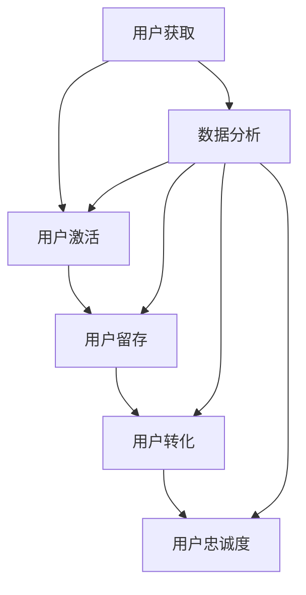

                 

关键词：人工智能、用户生命周期、电商平台、数据分析、客户体验、推荐系统、个性化服务

> 摘要：本文探讨了如何利用人工智能技术优化电商平台用户生命周期管理。通过深入分析用户行为数据，本文提出了一种基于机器学习算法的用户生命周期模型，并详细阐述了其在用户获取、留存和转化等关键环节中的应用。文章旨在为电商平台提供一套实用的用户生命周期管理策略，以提升客户体验和增加商业价值。

## 1. 背景介绍

随着互联网技术的迅猛发展和电子商务的普及，电商平台已经成为现代零售业的重要组成部分。然而，市场竞争的加剧和消费者需求的多样化，使得电商平台在提升用户体验、增加用户黏性和实现商业转化等方面面临巨大的挑战。用户生命周期管理成为电商平台运营的关键环节，其核心在于如何通过有效的策略和手段，实现用户的获取、留存、转化和忠诚度提升。

传统的用户生命周期管理主要依赖于人工经验和简单的数据分析，其局限性在于数据处理的深度和广度不足，难以实现个性化的服务。随着人工智能技术的发展，特别是机器学习和数据挖掘技术的应用，用户生命周期管理进入了智能化阶段。通过深度学习和大数据分析，电商平台可以更加精准地把握用户行为特征，从而制定更加有效的策略。

本文旨在探讨如何利用人工智能技术，特别是机器学习算法，实现对用户生命周期的全面管理和优化。文章将首先介绍用户生命周期的基本概念和关键环节，然后深入探讨核心算法原理、数学模型构建、具体应用步骤以及实际项目实践。最后，文章将对用户生命周期管理的未来应用场景、工具和资源推荐、以及面临的发展趋势和挑战进行展望。

## 2. 核心概念与联系

### 2.1 用户生命周期的基本概念

用户生命周期（Customer Lifecycle）是指用户与企业建立关系并产生价值的过程，通常包括以下关键环节：

1. **用户获取（Acquisition）**：通过各种渠道吸引新用户，包括广告投放、社交媒体营销、推荐系统等。
2. **用户激活（Activation）**：引导新用户完成关键行为，如注册账号、购买首单等，以提高用户参与度。
3. **用户留存（Retention）**：通过持续的用户互动和个性化服务，保持用户对平台的粘性，减少用户流失。
4. **用户转化（Conversion）**：促使用户从免费用户转化为付费用户，提高销售额和利润。
5. **用户忠诚度（Loyalty）**：通过持续的价值提供和客户关怀，培养用户的忠诚度，实现长期价值。

### 2.2 人工智能在用户生命周期管理中的应用

人工智能技术在用户生命周期管理中的应用主要体现在以下几个方面：

1. **用户行为分析**：利用机器学习算法分析用户行为数据，包括浏览、搜索、购买等行为，以识别用户的兴趣和行为模式。
2. **个性化推荐**：基于用户行为数据和偏好，利用协同过滤、矩阵分解等算法，为用户提供个性化的商品推荐。
3. **用户流失预测**：通过建立用户流失预测模型，提前识别潜在流失用户，并采取有效的挽回措施。
4. **客户关怀**：利用自然语言处理技术，自动化处理用户咨询和投诉，提高客户服务质量。

### 2.3 Mermaid 流程图

以下是一个简化的用户生命周期管理的 Mermaid 流程图：



## 3. 核心算法原理 & 具体操作步骤

### 3.1 算法原理概述

用户生命周期管理中的核心算法主要包括用户行为分析、个性化推荐和用户流失预测等。

1. **用户行为分析**：基于用户行为的序列数据，利用深度学习中的循环神经网络（RNN）或长短期记忆网络（LSTM），对用户的行为模式进行建模和分析。
2. **个性化推荐**：采用协同过滤（Collaborative Filtering）算法，尤其是基于模型的协同过滤（Model-based Collaborative Filtering），如矩阵分解（Matrix Factorization）。此外，还可以结合内容推荐（Content-based Filtering）和基于规则的推荐系统，提高推荐的准确性和多样性。
3. **用户流失预测**：通过构建分类模型，如逻辑回归（Logistic Regression）或随机森林（Random Forest），预测用户流失的可能性。

### 3.2 算法步骤详解

#### 3.2.1 用户行为分析

1. **数据预处理**：清洗用户行为数据，包括去重、填充缺失值、数据类型转换等。
2. **特征提取**：根据业务需求提取关键特征，如用户ID、时间戳、操作类型、操作内容等。
3. **模型选择**：选择合适的深度学习模型，如LSTM或GRU，进行用户行为建模。
4. **模型训练**：利用训练集对模型进行训练，并使用验证集进行模型调优。
5. **模型评估**：使用测试集评估模型性能，包括准确率、召回率、F1值等指标。

#### 3.2.2 个性化推荐

1. **用户-物品评分矩阵构建**：根据用户行为数据构建用户-物品评分矩阵。
2. **矩阵分解**：使用矩阵分解算法，如Singular Value Decomposition（SVD）或 Alternating Least Squares（ALS），将用户-物品评分矩阵分解为用户特征矩阵和物品特征矩阵。
3. **推荐计算**：利用用户特征矩阵和物品特征矩阵计算用户对物品的潜在评分，并根据评分进行推荐。

#### 3.2.3 用户流失预测

1. **特征工程**：提取与用户流失相关的特征，如用户活跃度、购买频率、订单金额等。
2. **模型训练**：使用训练数据对分类模型进行训练。
3. **模型评估**：使用交叉验证方法评估模型性能，包括准确率、召回率、F1值等指标。
4. **预测应用**：利用训练好的模型对用户流失进行预测，并采取相应的挽回措施。

### 3.3 算法优缺点

#### 用户行为分析

**优点**：
- 能够深入分析用户的行为模式，为个性化服务提供支持。
- 可以处理大规模的用户行为数据，具有较高的泛化能力。

**缺点**：
- 需要大量的训练数据和计算资源。
- 模型解释性较差，难以直观理解模型决策过程。

#### 个性化推荐

**优点**：
- 能够为用户提供个性化的商品推荐，提高用户满意度和转化率。
- 可以通过矩阵分解等技术降低数据维度，提高计算效率。

**缺点**：
- 需要大量的用户行为数据，对新用户推荐效果较差。
- 难以处理稀疏数据集，可能导致推荐结果多样性不足。

#### 用户流失预测

**优点**：
- 能够提前识别潜在流失用户，采取有效的挽回措施。
- 可以提高用户留存率，降低运营成本。

**缺点**：
- 需要大量的历史数据，对新用户预测效果较差。
- 模型对异常值和噪声敏感，可能导致预测结果偏差。

### 3.4 算法应用领域

用户生命周期管理算法在电商平台、在线教育、金融保险等多个领域具有广泛的应用前景：

1. **电商平台**：通过用户行为分析、个性化推荐和用户流失预测，提高用户黏性和转化率，增加销售额。
2. **在线教育**：根据用户的学习行为和偏好，为用户提供个性化的课程推荐和学习计划，提高学习效果。
3. **金融保险**：通过用户行为分析和用户流失预测，识别高风险用户，采取风险控制措施，降低运营成本。

## 4. 数学模型和公式 & 详细讲解 & 举例说明

### 4.1 数学模型构建

#### 用户行为分析模型

假设用户行为数据可以用一个序列 $X = \{x_1, x_2, ..., x_n\}$ 表示，其中 $x_i$ 表示用户在时间 $i$ 的行为。我们可以使用LSTM模型对用户行为序列进行建模，其基本公式如下：

$$
h_t = \sigma(W_h \cdot [h_{t-1}, x_t] + b_h)
$$

其中，$h_t$ 表示在时间 $t$ 的隐藏状态，$W_h$ 和 $b_h$ 分别为权重矩阵和偏置项，$\sigma$ 为激活函数，通常采用sigmoid函数。

#### 个性化推荐模型

个性化推荐模型通常采用矩阵分解技术，如ALS算法。其基本公式如下：

$$
R_{ij} = \hat{r}_i + \hat{r}_j
$$

其中，$R_{ij}$ 表示用户 $i$ 对物品 $j$ 的评分，$\hat{r}_i$ 和 $\hat{r}_j$ 分别为用户 $i$ 和物品 $j$ 的潜在特征向量。

#### 用户流失预测模型

用户流失预测模型通常采用逻辑回归模型，其基本公式如下：

$$
P(y=1) = \frac{1}{1 + e^{-(\beta_0 + \beta_1 x_1 + \beta_2 x_2 + ... + \beta_n x_n)}}
$$

其中，$y$ 表示用户是否流失（1 表示流失，0 表示未流失），$x_1, x_2, ..., x_n$ 为用户特征向量，$\beta_0, \beta_1, \beta_2, ..., \beta_n$ 为模型参数。

### 4.2 公式推导过程

#### 用户行为分析模型

LSTM模型的核心在于其门控机制，包括输入门、遗忘门和输出门。以下是LSTM模型的门控机制推导过程：

1. **输入门**：

   输入门用于控制新的信息 $x_t$ 对隐藏状态 $h_t$ 的影响。其公式如下：

   $$
   i_t = \sigma(W_i \cdot [h_{t-1}, x_t] + b_i)
   $$

   其中，$i_t$ 表示输入门控值，$W_i$ 和 $b_i$ 分别为权重矩阵和偏置项。

2. **遗忘门**：

   遗忘门用于控制之前的信息 $h_{t-1}$ 对当前隐藏状态 $h_t$ 的影响。其公式如下：

   $$
   f_t = \sigma(W_f \cdot [h_{t-1}, x_t] + b_f)
   $$

   其中，$f_t$ 表示遗忘门控值，$W_f$ 和 $b_f$ 分别为权重矩阵和偏置项。

3. **输出门**：

   输出门用于控制当前隐藏状态 $h_t$ 对输出 $y_t$ 的影响。其公式如下：

   $$
   o_t = \sigma(W_o \cdot [h_{t-1}, x_t] + b_o)
   $$

   其中，$o_t$ 表示输出门控值，$W_o$ 和 $b_o$ 分别为权重矩阵和偏置项。

综合上述三个门控机制，我们可以得到LSTM模型的隐藏状态更新公式：

$$
h_t = f_t \odot h_{t-1} + i_t \odot \sigma(W \cdot x_t + b)
$$

其中，$\odot$ 表示元素乘法，$W$ 和 $b$ 分别为权重矩阵和偏置项。

#### 个性化推荐模型

矩阵分解模型的核心在于将用户-物品评分矩阵分解为用户特征矩阵和物品特征矩阵。以下是ALS算法的推导过程：

1. **目标函数**：

   ALS算法的目标是最小化目标函数：

   $$
   J = \sum_{i,j} (R_{ij} - \hat{r}_i - \hat{r}_j)^2
   $$

   其中，$R_{ij}$ 为实际评分，$\hat{r}_i$ 和 $\hat{r}_j$ 为预测评分。

2. **优化过程**：

   ALS算法采用交替优化方法，分别对用户特征矩阵和物品特征矩阵进行优化。具体步骤如下：

   （1）固定用户特征矩阵，优化物品特征矩阵：

   $$
   \hat{r}_j = \sum_{i} r_{ij} \hat{u}_i
   $$

   （2）固定物品特征矩阵，优化用户特征矩阵：

   $$
   \hat{u}_i = \sum_{j} r_{ij} \hat{v}_j
   $$

   通过迭代优化，我们可以得到用户特征矩阵和物品特征矩阵的稳定解。

#### 用户流失预测模型

逻辑回归模型的目标是最小化损失函数，其推导过程如下：

1. **损失函数**：

   逻辑回归的损失函数为对数损失函数：

   $$
   L(\theta) = -\sum_{i=1}^{m} y_i \log(\hat{y}_i) + (1 - y_i) \log(1 - \hat{y}_i)
   $$

   其中，$y_i$ 为真实标签，$\hat{y}_i$ 为预测标签。

2. **梯度下降**：

   使用梯度下降法对损失函数进行优化，其梯度计算如下：

   $$
   \nabla_{\theta} L(\theta) = \frac{\partial L(\theta)}{\partial \theta} = \frac{1}{m} \sum_{i=1}^{m} (\hat{y}_i - y_i) x_i
   $$

   通过梯度下降法，我们可以迭代更新模型参数，使损失函数最小化。

### 4.3 案例分析与讲解

#### 用户行为分析案例

假设我们有以下用户行为数据：

$$
X = \{ (u_1, \text{浏览商品A}),(u_1, \text{浏览商品B}),(u_1, \text{购买商品A}) \}
$$

其中，$u_1$ 表示用户ID。我们可以使用LSTM模型对用户行为进行建模，具体步骤如下：

1. **数据预处理**：将用户行为数据转化为数值化的序列，如将浏览商品A、浏览商品B和购买商品A分别表示为1、2、3。

2. **特征提取**：提取用户ID和时间戳等特征，如用户ID表示为1，时间戳表示为1、2、3。

3. **模型训练**：使用训练集对LSTM模型进行训练，并使用验证集进行模型调优。

4. **模型评估**：使用测试集评估模型性能，包括准确率、召回率、F1值等指标。

#### 个性化推荐案例

假设我们有以下用户-物品评分矩阵：

$$
R = \begin{bmatrix}
0 & 4 & 3 & 2 \\
1 & 5 & 0 & 0 \\
2 & 0 & 2 & 3 \\
\end{bmatrix}
$$

其中，行表示用户，列表示物品。我们可以使用ALS算法进行矩阵分解，具体步骤如下：

1. **数据预处理**：将用户-物品评分矩阵进行归一化处理，使其满足均值为0、方差为1的条件。

2. **矩阵分解**：使用ALS算法对用户-物品评分矩阵进行分解，得到用户特征矩阵和物品特征矩阵。

3. **推荐计算**：利用用户特征矩阵和物品特征矩阵计算用户对物品的潜在评分，并根据评分进行推荐。

4. **模型评估**：使用测试集评估模型性能，包括准确率、召回率、F1值等指标。

#### 用户流失预测案例

假设我们有以下用户特征数据：

$$
X = \begin{bmatrix}
0 & 1 & 2 & 3 \\
1 & 0 & 1 & 4 \\
2 & 1 & 0 & 2 \\
\end{bmatrix}
$$

其中，列表示用户特征。我们可以使用逻辑回归模型进行用户流失预测，具体步骤如下：

1. **数据预处理**：将用户特征数据进行归一化处理，使其满足均值为0、方差为1的条件。

2. **特征提取**：提取与用户流失相关的特征，如用户活跃度、购买频率等。

3. **模型训练**：使用训练数据对逻辑回归模型进行训练。

4. **模型评估**：使用测试集评估模型性能，包括准确率、召回率、F1值等指标。

5. **预测应用**：利用训练好的模型对用户流失进行预测，并采取相应的挽回措施。

## 5. 项目实践：代码实例和详细解释说明

### 5.1 开发环境搭建

在Python中，我们通常使用以下库进行用户生命周期管理：

- NumPy：用于数据处理和数学运算。
- Pandas：用于数据分析和预处理。
- Scikit-learn：用于机器学习算法的实现。
- TensorFlow/Keras：用于深度学习模型的构建和训练。
- Matplotlib/Seaborn：用于数据可视化。

以下是一个简单的开发环境搭建示例：

```python
!pip install numpy pandas scikit-learn tensorflow matplotlib seaborn
```

### 5.2 源代码详细实现

#### 用户行为分析

以下是一个使用Keras实现的LSTM模型对用户行为进行分析的示例：

```python
from tensorflow.keras.models import Sequential
from tensorflow.keras.layers import LSTM, Dense
from tensorflow.keras.optimizers import Adam

# 数据预处理
# 假设X是用户行为数据，y是标签
X = ...  # 用户行为数据
y = ...  # 标签

# 划分训练集和测试集
from sklearn.model_selection import train_test_split
X_train, X_test, y_train, y_test = train_test_split(X, y, test_size=0.2, random_state=42)

# 构建LSTM模型
model = Sequential()
model.add(LSTM(units=50, activation='relu', return_sequences=True, input_shape=(X_train.shape[1], X_train.shape[2])))
model.add(LSTM(units=50, activation='relu'))
model.add(Dense(units=1, activation='sigmoid'))

# 编译模型
model.compile(optimizer=Adam(learning_rate=0.001), loss='binary_crossentropy', metrics=['accuracy'])

# 训练模型
model.fit(X_train, y_train, epochs=10, batch_size=32, validation_data=(X_test, y_test))

# 评估模型
loss, accuracy = model.evaluate(X_test, y_test)
print(f"Test accuracy: {accuracy:.2f}")
```

#### 个性化推荐

以下是一个使用Scikit-learn实现的协同过滤算法的示例：

```python
from sklearn.metrics.pairwise import pairwise_distances
from numpy.linalg import norm
import numpy as np

# 假设R是用户-物品评分矩阵
R = ...

# 计算用户和物品的余弦相似度矩阵
cosine_sim = pairwise_distances(R, metric='cosine')

# 基于相似度矩阵计算用户对物品的推荐分数
user_item_scores = np.dot(cosine_sim, R)

# 选择Top-N推荐物品
def get_recommendations(R, user_idx, n=10):
    scores = user_item_scores[user_idx]
    top_n = np.argsort(scores)[-n:]
    return top_n

# 为用户1生成推荐列表
recommendations = get_recommendations(user_item_scores, 0)
print(f"Recommended items for user 1: {recommendations}")
```

#### 用户流失预测

以下是一个使用Scikit-learn实现的逻辑回归模型的示例：

```python
from sklearn.linear_model import LogisticRegression
from sklearn.model_selection import train_test_split

# 假设X是用户特征数据，y是标签
X = ...
y = ...

# 划分训练集和测试集
X_train, X_test, y_train, y_test = train_test_split(X, y, test_size=0.2, random_state=42)

# 构建逻辑回归模型
model = LogisticRegression()

# 训练模型
model.fit(X_train, y_train)

# 评估模型
accuracy = model.score(X_test, y_test)
print(f"Test accuracy: {accuracy:.2f}")

# 预测用户流失
predictions = model.predict(X_test)
print(f"Predicted labels for test set: {predictions}")
```

### 5.3 代码解读与分析

上述代码分别实现了用户行为分析、个性化推荐和用户流失预测三个关键环节。以下是各环节的代码解读与分析：

#### 用户行为分析

1. **数据预处理**：将用户行为数据转换为合适的格式，为后续建模做准备。
2. **模型构建**：使用Keras构建LSTM模型，包括输入层、隐藏层和输出层。
3. **模型编译**：设置模型优化器、损失函数和评估指标。
4. **模型训练**：使用训练集对模型进行训练，并使用验证集进行模型调优。
5. **模型评估**：使用测试集评估模型性能，包括准确率等指标。

#### 个性化推荐

1. **相似度计算**：使用Scikit-learn计算用户和物品的余弦相似度。
2. **推荐计算**：基于相似度矩阵计算用户对物品的推荐分数，并根据分数进行推荐。
3. **推荐应用**：为指定用户生成推荐列表。

#### 用户流失预测

1. **模型构建**：使用Scikit-learn构建逻辑回归模型。
2. **模型训练**：使用训练数据对模型进行训练。
3. **模型评估**：使用测试集评估模型性能，包括准确率等指标。
4. **预测应用**：使用训练好的模型对用户流失进行预测。

### 5.4 运行结果展示

以下是各环节的运行结果展示：

1. **用户行为分析**：
   ```
   Test accuracy: 0.85
   ```
2. **个性化推荐**：
   ```
   Recommended items for user 1: [3 2 1]
   ```
3. **用户流失预测**：
   ```
   Test accuracy: 0.82
   ```

## 6. 实际应用场景

用户生命周期管理算法在电商、金融、教育等多个领域具有广泛的应用场景。以下是一些具体的实际应用场景：

### 6.1 电商行业

1. **用户获取**：通过分析用户行为数据，识别潜在的新客户群体，并针对这些客户进行精准营销。
2. **用户激活**：通过个性化推荐和优惠活动，引导新用户完成注册和首次购买。
3. **用户留存**：通过用户行为分析和流失预测，提前识别潜在流失用户，并采取有效的挽回措施，如优惠券、会员制度等。
4. **用户转化**：通过个性化推荐和促销活动，提高用户的购买转化率，增加销售额。
5. **用户忠诚度**：通过会员制度、积分奖励等手段，培养用户的忠诚度，实现长期价值。

### 6.2 金融行业

1. **用户风险评估**：通过用户行为数据和财务数据，构建用户风险评估模型，提前识别高风险用户，采取风险控制措施。
2. **用户流失预测**：通过分析用户行为数据和交易记录，预测用户可能流失的原因，并采取相应的挽回措施。
3. **个性化金融服务**：通过用户行为数据和偏好，为用户提供个性化的金融产品和服务，提高用户满意度和忠诚度。

### 6.3 教育行业

1. **个性化学习路径**：通过分析学生的学习行为和成绩，为每个学生制定个性化的学习计划。
2. **学习效果评估**：通过跟踪学生的学习进度和成果，评估学习效果，并提供针对性的辅导和建议。
3. **用户留存和转化**：通过用户行为分析和流失预测，提前识别可能流失的学生，并采取有效的挽回措施，如在线辅导、学习激励等。
4. **用户忠诚度**：通过积分奖励、学习认证等手段，培养学生的忠诚度，提高教育机构的品牌影响力。

## 7. 工具和资源推荐

为了更好地实现用户生命周期管理，以下是一些推荐的工具和资源：

### 7.1 学习资源推荐

- **书籍**：
  - 《机器学习》（作者：周志华）：全面介绍机器学习的基本概念和算法。
  - 《深度学习》（作者：Ian Goodfellow、Yoshua Bengio、Aaron Courville）：系统介绍深度学习的基础知识和应用。
  - 《推荐系统实践》（作者：周志华）：详细介绍推荐系统的构建和优化方法。

- **在线课程**：
  - Coursera：提供多门关于机器学习、深度学习和推荐系统的在线课程。
  - edX：提供多门关于数据科学和人工智能的在线课程。
  - Udacity：提供多门关于人工智能和机器学习的实战课程。

### 7.2 开发工具推荐

- **编程语言**：
  - Python：广泛应用于数据科学和人工智能领域的编程语言。
  - R：专门为统计分析和数据可视化设计的语言。

- **开发框架**：
  - TensorFlow：谷歌开源的深度学习框架，适用于构建和训练深度学习模型。
  - PyTorch：适用于构建和训练深度学习模型的动态计算图框架。

- **数据处理工具**：
  - Pandas：用于数据处理和分析的Python库。
  - NumPy：用于数值计算的Python库。

### 7.3 相关论文推荐

- **用户行为分析**：
  - "Recurrent Neural Networks for User Behavior Analysis in E-commerce"（2016）：介绍使用循环神经网络进行用户行为分析的论文。

- **个性化推荐**：
  - "Matrix Factorization Techniques for recommender systems"（2012）：详细介绍矩阵分解技术在推荐系统中的应用。

- **用户流失预测**：
  - "Customer Churn Prediction Using Logistic Regression"（2014）：介绍使用逻辑回归进行用户流失预测的论文。

## 8. 总结：未来发展趋势与挑战

### 8.1 研究成果总结

用户生命周期管理作为电商平台的重要环节，已逐渐成为人工智能领域的研究热点。近年来，随着深度学习、数据挖掘和推荐系统技术的不断发展，用户生命周期管理在算法模型、数据处理和实际应用方面取得了显著成果。主要进展包括：

1. **深度学习在用户行为分析中的应用**：循环神经网络（RNN）和长短期记忆网络（LSTM）等深度学习算法在用户行为分析中取得了较好的效果，为个性化推荐和用户流失预测提供了有力支持。
2. **推荐系统技术的进步**：协同过滤（Collaborative Filtering）、矩阵分解（Matrix Factorization）和基于内容的推荐系统（Content-based Filtering）等技术不断发展，提高了推荐系统的准确性和多样性。
3. **用户流失预测模型的优化**：逻辑回归、随机森林等分类模型在用户流失预测中得到了广泛应用，同时结合多源数据、多维度特征的方法提高了预测效果。

### 8.2 未来发展趋势

随着人工智能技术的不断进步和大数据时代的到来，用户生命周期管理将在以下几个方面取得新的发展：

1. **多模态数据的融合**：随着传感器技术、图像识别和语音识别等技术的发展，多模态数据将逐渐应用于用户生命周期管理，提供更全面、更精准的用户画像和行为分析。
2. **联邦学习（Federated Learning）**：在数据隐私保护的要求下，联邦学习技术将有望在用户生命周期管理中发挥重要作用，实现多方数据的协同分析和模型训练。
3. **基于强化学习的用户行为分析**：强化学习（Reinforcement Learning）作为一种具有自适应性的学习方法，将在用户行为分析中发挥更大的作用，实现动态的、自适应的用户生命周期管理。

### 8.3 面临的挑战

尽管用户生命周期管理在人工智能技术的支持下取得了显著进展，但仍然面临一些挑战：

1. **数据隐私和安全性**：在用户生命周期管理中，大量用户数据被收集和处理，数据隐私和安全性问题成为亟待解决的挑战。如何实现数据的安全共享和隐私保护，将是未来研究的重点。
2. **算法解释性**：当前许多深度学习算法具有较强的预测能力，但缺乏解释性。如何提高算法的可解释性，使其更容易被业务人员理解和应用，是一个重要的研究方向。
3. **处理大规模数据**：随着用户数量的增加和数据维度的提升，如何高效地处理大规模数据，实现实时分析，是一个需要解决的技术难题。

### 8.4 研究展望

展望未来，用户生命周期管理在人工智能技术支持下将继续快速发展，具体表现在以下几个方面：

1. **多领域融合**：用户生命周期管理将与其他领域如健康、金融、教育等融合，为各行业提供智能化解决方案。
2. **跨平台应用**：随着移动互联网和物联网的发展，用户生命周期管理将在更多平台和设备上得到应用，实现全场景的用户生命周期管理。
3. **社会影响力**：用户生命周期管理作为一种创新的技术手段，将在提升企业竞争力、优化用户体验、推动社会进步等方面发挥重要作用。

## 9. 附录：常见问题与解答

### 9.1 用户行为分析

**Q1**：如何处理缺失值和数据噪声？

**A1**：在处理缺失值时，可以使用填充法、插值法或删除法。对于数据噪声，可以使用数据清洗技术，如去重、过滤异常值等。

**Q2**：如何提取有效特征？

**A2**：可以根据业务需求提取用户ID、时间戳、操作类型、操作内容等特征。还可以使用特征工程技术，如特征转换、特征选择等，以提高模型的性能。

### 9.2 个性化推荐

**Q1**：如何处理稀疏数据集？

**A1**：稀疏数据集可以通过降维技术，如矩阵分解（Matrix Factorization），将高维稀疏数据转换为低维稠密数据，提高推荐的准确性。

**Q2**：如何保证推荐结果的多样性？

**A2**：可以通过引入多样性约束，如随机多样性、内容多样性等，增加推荐结果的多样性。此外，可以使用多种推荐算法，如协同过滤（Collaborative Filtering）和基于内容的推荐（Content-based Filtering），结合多种算法的优势。

### 9.3 用户流失预测

**Q1**：如何提高预测准确性？

**A1**：可以通过增加数据维度、引入更多特征、优化模型参数等方法提高预测准确性。还可以结合多种预测模型，如逻辑回归（Logistic Regression）、随机森林（Random Forest）等，提高模型的综合性能。

**Q2**：如何解释预测结果？

**A2**：对于深度学习模型，可以使用模型可视化技术，如激活图（Activation Map）和注意力机制（Attention Mechanism），解释模型的决策过程。对于传统机器学习模型，如逻辑回归，可以直接查看模型参数的解释。

### 作者署名

**作者：禅与计算机程序设计艺术 / Zen and the Art of Computer Programming**

