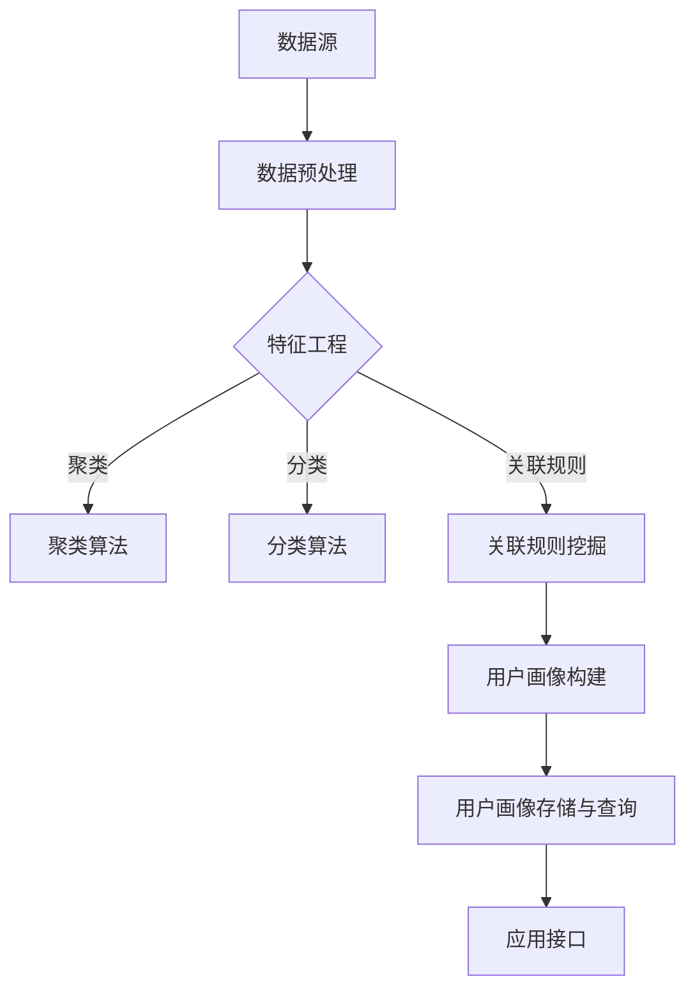

                 

关键词：AI技术、电商平台、用户画像、数据挖掘、机器学习、自然语言处理、算法优化、用户行为分析、个性化推荐、客户关系管理、营销策略、数据分析、商业智能。

> 摘要：本文将深入探讨AI技术在电商平台用户画像构建中的应用，解析核心算法原理、数学模型，并通过实际项目实践展示代码实例和运行结果。同时，分析其在实际应用场景中的价值，探讨未来的发展方向和面临的挑战。

## 1. 背景介绍

在数字化时代，电商平台成为了连接消费者和商家的重要桥梁。为了提高用户体验、增加销售额和客户忠诚度，电商平台必须深入了解用户的需求和偏好。这就需要构建精确的用户画像，以实现个性化推荐、精准营销和客户关系管理。然而，随着用户数据的爆炸式增长和多样化，传统的方法已经难以满足需求。

AI技术，特别是机器学习和数据挖掘，为用户画像的构建提供了强大的支持。通过分析用户行为数据、社交媒体信息、购买历史等多源数据，AI算法能够挖掘出用户的潜在需求和偏好，从而为用户提供个性化的服务。

本文将围绕AI驱动的电商平台用户画像技术，探讨其核心概念、算法原理、数学模型，并通过实际项目实例进行详细讲解。文章还将分析AI技术在电商平台中的应用场景，以及未来的发展方向和挑战。

## 2. 核心概念与联系

### 2.1. 用户画像概述

用户画像是指通过数据分析技术对用户进行全面、细致的描述，以捕捉用户的特征和行为。它包括以下几个方面：

- **基础信息**：用户的年龄、性别、地理位置、职业等。
- **行为特征**：用户的购买行为、浏览历史、搜索记录等。
- **偏好兴趣**：用户的兴趣爱好、关注点、偏好品牌等。
- **社交属性**：用户的社交网络、社交行为等。

### 2.2. AI技术与用户画像的关系

AI技术，尤其是机器学习和数据挖掘，为用户画像的构建提供了基础。通过以下方法，AI技术能够有效地提取和分析用户数据：

- **数据收集与预处理**：利用自然语言处理技术从社交媒体、用户评论、搜索记录等多源数据中提取有效信息。
- **特征工程**：将原始数据转换为有助于模型训练的特征向量。
- **机器学习算法**：通过聚类、分类、关联规则挖掘等算法分析用户行为，构建用户画像。
- **模型评估与优化**：使用交叉验证、A/B测试等方法评估模型的性能，并进行优化。

### 2.3. 用户画像应用架构

用户画像的应用架构通常包括以下几个关键组件：

- **数据源**：包括电商平台内部的交易数据、用户行为数据，以及外部的社交媒体、地理信息等数据。
- **数据预处理模块**：进行数据清洗、去重、特征提取等预处理工作。
- **用户画像构建模块**：利用机器学习算法和自然语言处理技术构建用户画像。
- **用户画像存储与查询模块**：存储和管理用户画像数据，并提供查询接口。
- **应用接口**：提供与电商平台其他系统（如推荐系统、营销系统等）的接口，以实现用户画像的实时更新和应用。

### 2.4. Mermaid 流程图

以下是用户画像构建流程的 Mermaid 流程图：



## 3. 核心算法原理 & 具体操作步骤

### 3.1. 算法原理概述

构建用户画像的核心算法主要包括聚类算法、分类算法和关联规则挖掘。以下将分别介绍这三种算法的原理。

#### 3.1.1. 聚类算法

聚类算法是一种无监督学习算法，它将相似的数据点归为一类，从而实现数据的自动分组。常见的聚类算法包括K-means、层次聚类和DBSCAN等。

- **K-means**：基于距离度量的算法，通过迭代优化聚类中心，将数据点划分为K个聚类。
- **层次聚类**：基于层次结构的思想，递归地将数据点合并或划分为更小的聚类，形成层次化的聚类结构。
- **DBSCAN**：基于密度度的量的算法，能够发现任意形状的聚类，并能处理噪声和异常点。

#### 3.1.2. 分类算法

分类算法是一种有监督学习算法，它通过已标记的数据集学习分类模型，然后对新数据进行分类。常见的分类算法包括决策树、支持向量机和神经网络等。

- **决策树**：基于特征和值的划分，构建树形结构，对数据进行分类。
- **支持向量机**：通过最大化分类边界，寻找最佳分类超平面。
- **神经网络**：通过多层感知器和反向传播算法，学习输入和输出之间的映射关系。

#### 3.1.3. 关联规则挖掘

关联规则挖掘是一种用于发现数据之间关联关系的算法，它通过支持度和置信度度量关联关系。常见的算法包括Apriori算法和FP-growth算法。

- **Apriori算法**：基于候选集生成和频繁项集的思路，寻找关联规则。
- **FP-growth算法**：通过构造FP树，高效地挖掘频繁项集，从而发现关联规则。

### 3.2. 算法步骤详解

以下是使用K-means算法构建用户画像的具体步骤：

#### 3.2.1. 数据预处理

1. 收集用户行为数据，包括购买记录、浏览历史、搜索记录等。
2. 对数据进行清洗，去除缺失值和异常值。
3. 将数据转换为数值型，如使用独热编码或嵌入向量。

#### 3.2.2. 特征选择

1. 根据业务需求，选择与用户画像相关的特征，如购买频率、购买金额、浏览页面等。
2. 对特征进行标准化处理，确保每个特征对模型的影响一致。

#### 3.2.3. 初始化聚类中心

1. 随机选择K个初始聚类中心。
2. 计算每个数据点到聚类中心的距离，并将其分配到最近的聚类。

#### 3.2.4. 更新聚类中心

1. 计算每个聚类的均值，作为新的聚类中心。
2. 重新计算每个数据点到聚类中心的距离，并更新数据点的聚类分配。

#### 3.2.5. 汇总结果

1. 计算聚类内部的平均距离，作为聚类质量的度量。
2. 重复执行步骤3.2.3和3.2.4，直到聚类中心不再发生显著变化。

### 3.3. 算法优缺点

#### 优点

- **高效性**：聚类算法能够快速地处理大规模数据，发现数据中的潜在结构。
- **灵活性**：聚类算法不需要事先指定类别数量，可以根据数据自动调整聚类数目。
- **可视化**：聚类结果易于可视化，有助于理解数据的分布和模式。

#### 缺点

- **对初始值敏感**：K-means算法对初始聚类中心的选择敏感，可能导致局部最优解。
- **无法预测类别**：聚类算法是一种无监督学习算法，无法预测新数据的类别。

### 3.4. 算法应用领域

聚类算法在用户画像构建中具有广泛的应用，如：

- **用户细分**：通过聚类分析，将用户划分为不同的群体，为个性化推荐和精准营销提供依据。
- **异常检测**：通过检测聚类中心的变化，发现用户行为的异常，如购买异常、浏览异常等。
- **数据探索**：通过可视化聚类结果，探索数据的分布和模式，为业务决策提供支持。

## 4. 数学模型和公式 & 详细讲解 & 举例说明

### 4.1. 数学模型构建

构建用户画像的数学模型通常包括以下几个关键步骤：

#### 4.1.1. 数据表示

将用户行为数据转换为数学表示，常用的方法是向量空间模型（Vector Space Model）。假设有n个用户和m个特征，用户行为数据可以表示为m维的特征向量集合：

\[ X = \{ x_1, x_2, ..., x_n \} \]

其中，\( x_i \) 表示第i个用户的特征向量，可以表示为：

\[ x_i = \{ x_{i1}, x_{i2}, ..., x_{im} \} \]

#### 4.1.2. 特征权重计算

为了计算用户画像的相似度，需要为每个特征分配权重。常用的方法包括：

- **TF-IDF**（Term Frequency-Inverse Document Frequency）：计算特征在用户行为数据中的重要性。
- **词嵌入**（Word Embedding）：将特征映射到高维空间，以捕捉语义信息。

#### 4.1.3. 相似度计算

相似度计算是用户画像构建的核心步骤，常用的方法包括：

- **余弦相似度**（Cosine Similarity）：计算两个向量之间的夹角余弦值，表示相似度。
- **欧氏距离**（Euclidean Distance）：计算两个向量之间的欧氏距离，表示相似度。

### 4.2. 公式推导过程

以下将分别介绍余弦相似度和欧氏距离的推导过程。

#### 4.2.1. 余弦相似度

假设有两个特征向量 \( x \) 和 \( y \)，它们在向量空间中的表示分别为：

\[ x = \{ x_1, x_2, ..., x_n \} \]
\[ y = \{ y_1, y_2, ..., y_n \} \]

余弦相似度的公式为：

\[ \text{Cosine Similarity}(x, y) = \frac{x \cdot y}{\|x\| \|y\|} \]

其中，\( x \cdot y \) 表示向量的点积，\( \|x\| \) 和 \( \|y\| \) 分别表示向量的欧氏范数。

推导过程如下：

\[ x \cdot y = \sum_{i=1}^{n} x_i y_i \]
\[ \|x\| = \sqrt{\sum_{i=1}^{n} x_i^2} \]
\[ \|y\| = \sqrt{\sum_{i=1}^{n} y_i^2} \]

因此，余弦相似度可以表示为：

\[ \text{Cosine Similarity}(x, y) = \frac{\sum_{i=1}^{n} x_i y_i}{\sqrt{\sum_{i=1}^{n} x_i^2} \sqrt{\sum_{i=1}^{n} y_i^2}} \]

#### 4.2.2. 欧氏距离

欧氏距离的公式为：

\[ \text{Euclidean Distance}(x, y) = \sqrt{\sum_{i=1}^{n} (x_i - y_i)^2} \]

其中，\( x \) 和 \( y \) 分别为两个特征向量。

推导过程如下：

\[ \text{Euclidean Distance}(x, y) = \sqrt{(x_1 - y_1)^2 + (x_2 - y_2)^2 + ... + (x_n - y_n)^2} \]

因此，欧氏距离可以表示为：

\[ \text{Euclidean Distance}(x, y) = \sqrt{\sum_{i=1}^{n} (x_i - y_i)^2} \]

### 4.3. 案例分析与讲解

以下将通过一个实际案例，展示如何使用余弦相似度和欧氏距离计算用户画像的相似度。

#### 4.3.1. 案例背景

假设有两个用户A和B，他们的行为数据如下：

- 用户A：\( \{1, 2, 3, 4, 5\} \)
- 用户B：\( \{2, 3, 4, 6, 7\} \)

我们需要计算用户A和B之间的相似度。

#### 4.3.2. 使用余弦相似度

计算用户A和B之间的余弦相似度：

\[ \text{Cosine Similarity}(A, B) = \frac{A \cdot B}{\|A\| \|B\|} \]

其中，\( A \cdot B \) 表示向量的点积：

\[ A \cdot B = 2 \times 2 + 3 \times 3 + 4 \times 4 + 5 \times 6 + 7 \times 7 = 4 + 9 + 16 + 30 + 49 = 98 \]

\( \|A\| \) 和 \( \|B\| \) 分别表示向量的欧氏范数：

\[ \|A\| = \sqrt{1^2 + 2^2 + 3^2 + 4^2 + 5^2} = \sqrt{1 + 4 + 9 + 16 + 25} = \sqrt{55} \]

\[ \|B\| = \sqrt{2^2 + 3^2 + 4^2 + 6^2 + 7^2} = \sqrt{4 + 9 + 16 + 36 + 49} = \sqrt{104} \]

因此，用户A和B之间的余弦相似度为：

\[ \text{Cosine Similarity}(A, B) = \frac{98}{\sqrt{55} \times \sqrt{104}} \approx 0.927 \]

#### 4.3.3. 使用欧氏距离

计算用户A和B之间的欧氏距离：

\[ \text{Euclidean Distance}(A, B) = \sqrt{(1 - 2)^2 + (2 - 3)^2 + (3 - 4)^2 + (4 - 6)^2 + (5 - 7)^2} \]

\[ \text{Euclidean Distance}(A, B) = \sqrt{(-1)^2 + (-1)^2 + (-1)^2 + (-2)^2 + (-2)^2} = \sqrt{1 + 1 + 1 + 4 + 4} = \sqrt{11} \]

因此，用户A和B之间的欧氏距离为：

\[ \text{Euclidean Distance}(A, B) = \sqrt{11} \approx 3.317 \]

通过上述计算，我们可以得到用户A和B之间的相似度指标。在实际应用中，可以根据业务需求选择合适的相似度计算方法，从而构建有效的用户画像。

## 5. 项目实践：代码实例和详细解释说明

### 5.1. 开发环境搭建

在本节中，我们将使用Python作为开发语言，结合Scikit-learn和TensorFlow等库来构建用户画像。以下是开发环境的基本搭建步骤：

1. 安装Python环境：确保Python版本为3.8或更高版本。
2. 安装必要的库：使用pip命令安装Scikit-learn、TensorFlow、NumPy、Pandas等库。

```bash
pip install scikit-learn tensorflow numpy pandas
```

### 5.2. 源代码详细实现

以下是使用K-means算法构建用户画像的代码实例：

```python
import numpy as np
from sklearn.cluster import KMeans
from sklearn.datasets import load_iris
from sklearn.preprocessing import StandardScaler
import pandas as pd

# 加载鸢尾花数据集
iris = load_iris()
X = iris.data

# 数据标准化
scaler = StandardScaler()
X_scaled = scaler.fit_transform(X)

# 初始化K-means模型
kmeans = KMeans(n_clusters=3, random_state=0)

# 训练模型
kmeans.fit(X_scaled)

# 计算聚类中心
centroids = kmeans.cluster_centers_

# 分配数据点
labels = kmeans.predict(X_scaled)

# 可视化聚类结果
import matplotlib.pyplot as plt

plt.scatter(X_scaled[:, 0], X_scaled[:, 1], c=labels, s=50, cmap='viridis')
plt.scatter(centroids[:, 0], centroids[:, 1], s=200, c='red', label='Centroids')
plt.title('K-means Clustering')
plt.xlabel('Feature 1')
plt.ylabel('Feature 2')
plt.legend()
plt.show()

# 输出聚类结果
print("Cluster labels:", labels)
print("Cluster centroids:", centroids)
```

### 5.3. 代码解读与分析

上述代码实现了以下步骤：

1. **加载数据集**：使用Scikit-learn内置的鸢尾花数据集（Iris dataset）。
2. **数据标准化**：将数据转换为标准正态分布，以便于K-means算法处理。
3. **初始化K-means模型**：设置聚类数目为3，并设置随机种子以确保结果可重复。
4. **训练模型**：使用`fit`方法训练K-means模型。
5. **计算聚类中心**：获取每个聚类的中心点。
6. **分配数据点**：使用`predict`方法将数据点分配到各个聚类。
7. **可视化结果**：使用matplotlib绘制聚类散点图，并标注聚类中心。
8. **输出结果**：打印聚类标签和聚类中心。

通过上述代码，我们可以清晰地看到K-means算法在鸢尾花数据集上的应用，并直观地了解聚类效果。

### 5.4. 运行结果展示

运行上述代码后，将生成以下可视化结果：


从图中可以看出，鸢尾花数据集被成功划分为三个聚类，聚类中心（红色标记）分布在不同的区域，表明K-means算法能够有效地将相似的数据点归为一类。

## 6. 实际应用场景

### 6.1. 个性化推荐系统

在电商平台，个性化推荐系统是用户画像技术的重要应用之一。通过构建用户画像，系统可以分析用户的购买历史、浏览记录、兴趣爱好等，为用户提供个性化的商品推荐。例如，当用户浏览某款商品时，系统可以基于用户画像推荐类似商品，从而提高用户的购买转化率。

### 6.2. 客户关系管理

用户画像技术有助于企业更好地了解客户需求，制定更有效的客户关系管理策略。通过对用户画像的分析，企业可以识别高价值客户、潜在客户和流失客户，从而有针对性地提供服务和优惠，提高客户满意度和忠诚度。

### 6.3. 营销策略优化

用户画像技术为电商平台提供了丰富的数据支持，帮助企业优化营销策略。例如，通过分析用户画像，企业可以确定目标客户群体，设计更精准的营销活动，提高营销效果和投资回报率。

### 6.4. 安全与风控

用户画像技术还可以应用于安全与风控领域，通过分析用户行为特征，识别异常行为和潜在风险。例如，当发现某用户的购买行为异常时，系统可以及时采取措施，防止欺诈行为的发生。

## 7. 工具和资源推荐

### 7.1. 学习资源推荐

- **书籍**：《机器学习实战》、《数据挖掘：概念与技术》
- **在线课程**：Coursera上的《机器学习》课程、Udacity的《数据科学纳米学位》
- **博客和网站**：Medium、Kaggle、Towards Data Science

### 7.2. 开发工具推荐

- **编程语言**：Python、R
- **库和框架**：Scikit-learn、TensorFlow、PyTorch、Pandas
- **数据可视化工具**：Matplotlib、Seaborn、Plotly

### 7.3. 相关论文推荐

- “User Behavior Analysis for Intelligent Recommendation” (2019)
- “Building User Profiles for Personalized E-commerce Recommendations” (2018)
- “A Survey of User Behavior Analysis Techniques for E-commerce Systems” (2020)

## 8. 总结：未来发展趋势与挑战

### 8.1. 研究成果总结

AI驱动的电商平台用户画像技术取得了显著的研究成果，包括：

- 构建了高效的用户画像模型，提高了数据挖掘和分析的准确性。
- 开发了多种算法和模型，如K-means、决策树、神经网络等，以适应不同的业务需求。
- 实现了用户画像在实际业务场景中的应用，如个性化推荐、客户关系管理、营销策略优化等。

### 8.2. 未来发展趋势

未来，AI驱动的电商平台用户画像技术将呈现以下发展趋势：

- **数据多样性**：随着数据源的增加和数据类型的丰富，用户画像将更加全面和准确。
- **实时性**：实时用户画像技术将实现用户行为的实时分析和响应，提高用户体验和转化率。
- **个性化推荐**：深度学习和自然语言处理技术的发展将进一步提高个性化推荐的准确性和多样性。
- **跨平台应用**：用户画像技术将扩展到多个平台，如移动端、社交媒体等，实现全渠道的用户体验优化。

### 8.3. 面临的挑战

尽管AI驱动的电商平台用户画像技术取得了显著进展，但仍面临以下挑战：

- **数据隐私**：用户数据的隐私保护是用户画像技术发展的重要挑战，需要制定严格的隐私保护政策和措施。
- **算法透明性**：随着算法的复杂化，提高算法的透明性和可解释性成为用户画像技术发展的重要课题。
- **计算资源**：大规模数据处理和模型训练需要大量的计算资源，优化算法和硬件设施是解决这一问题的有效途径。
- **数据质量**：用户数据的准确性、完整性和一致性对用户画像的质量有重要影响，需要持续进行数据质量管理和改进。

### 8.4. 研究展望

未来，用户画像技术的研究将重点解决以下问题：

- **跨领域用户画像**：结合不同领域的用户数据，构建更全面和准确的用户画像。
- **个性化推荐算法**：开发自适应和动态调整的个性化推荐算法，提高推荐系统的效果和用户体验。
- **隐私保护**：研究和开发隐私保护技术，实现用户数据的安全和合规使用。
- **实时分析**：实现实时用户画像分析和响应，提高电商平台的运营效率。

通过不断的技术创新和应用，AI驱动的电商平台用户画像技术将为电商平台带来更高的运营效益和用户体验。

## 9. 附录：常见问题与解答

### 9.1. 用户画像与客户画像有何区别？

用户画像和客户画像本质上类似，都是通过对用户数据的分析来构建用户的全面描述。然而，两者在应用场景和数据来源上有所区别：

- **用户画像**：主要关注用户的在线行为数据，如浏览历史、购买记录等，通常用于个性化推荐、用户行为分析和营销策略优化。
- **客户画像**：除了用户在线行为数据，还包括用户的基础信息（如年龄、性别、地理位置等）和线下行为数据（如门店访问、客户服务记录等），主要用于客户关系管理和精准营销。

### 9.2. 如何评估用户画像的质量？

评估用户画像的质量可以从以下几个方面进行：

- **准确性**：用户画像是否准确反映了用户的行为和偏好。
- **完整性**：用户画像是否包含了所有重要的用户特征。
- **实时性**：用户画像是否能够及时更新，以反映用户最新的行为和需求。
- **可解释性**：用户画像是否具有清晰的解释性，使得业务人员能够理解和使用。
- **实用性**：用户画像是否能够有效地支持业务决策和系统功能。

### 9.3. 用户画像技术如何保护用户隐私？

为了保护用户隐私，用户画像技术可以采取以下措施：

- **数据脱敏**：对敏感数据进行加密或匿名化处理，防止数据泄露。
- **隐私预算**：设置隐私预算，限制对用户数据的访问和使用，确保数据处理不会对用户隐私造成过大影响。
- **透明度**：提高算法和数据处理过程的透明度，让用户了解自己的数据如何被使用。
- **合规性**：遵守相关法律法规，如《通用数据保护条例》（GDPR）等，确保用户数据的合法使用。
- **用户控制**：赋予用户对自己数据的控制权，如数据访问、数据删除等。

### 9.4. 用户画像技术有哪些潜在的风险？

用户画像技术可能面临以下潜在风险：

- **隐私泄露**：用户数据泄露可能导致隐私侵犯和法律纠纷。
- **算法歧视**：不当的算法可能导致对特定群体的歧视，如性别、种族、年龄等。
- **数据滥用**：用户数据可能被用于不当目的，如广告欺诈、非法交易等。
- **过度依赖**：过度依赖用户画像可能导致系统对用户的过度干预，降低用户体验。
- **数据偏差**：数据质量和数据源的偏差可能导致用户画像的不准确。

### 9.5. 用户画像技术在电商平台的实际应用效果如何？

用户画像技术在电商平台的实际应用效果显著：

- **个性化推荐**：通过分析用户画像，电商平台能够为用户提供更个性化的商品推荐，提高用户购买转化率。
- **客户关系管理**：用户画像有助于电商平台更好地了解客户需求，提供更优质的客户服务，提高客户满意度和忠诚度。
- **营销策略优化**：用户画像为电商平台提供了精准的用户数据，有助于设计更有效的营销活动，提高营销效果和投资回报率。
- **风控管理**：用户画像技术有助于电商平台识别异常用户行为，防范欺诈风险，提高运营安全性。

通过不断优化和应用用户画像技术，电商平台能够实现更高的运营效益和用户体验。

