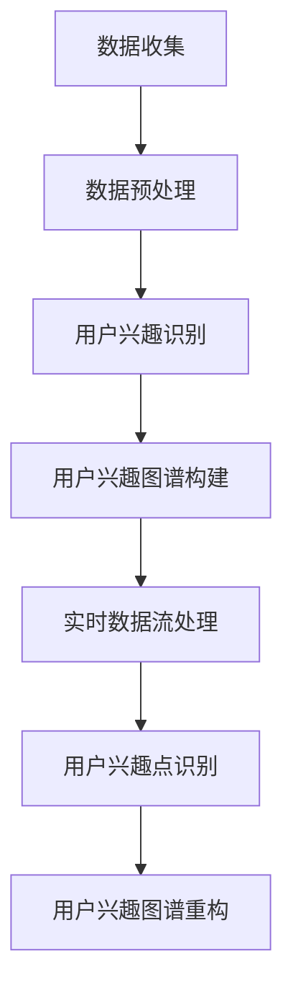

                 

关键词：AI，电商，用户兴趣图谱，实时更新机制，机器学习，数据挖掘

> 摘要：本文探讨了基于人工智能技术的电商用户兴趣图谱的实时更新机制。通过深入分析用户行为数据，构建了用户兴趣模型，并结合实时数据处理技术和机器学习算法，实现了一个高效的电商用户兴趣图谱实时更新系统。本文旨在为电商企业提供一种有效的用户画像更新方法，提高个性化推荐效果和用户体验。

## 1. 背景介绍

### 1.1 电商行业现状

随着互联网技术的飞速发展，电子商务已成为全球经济的重要组成部分。电商平台的竞争日益激烈，用户需求多样化，个性化推荐成为电商企业提升用户满意度和市场竞争力的重要手段。然而，用户兴趣的变化是动态的，传统的用户画像更新机制往往存在更新不及时、准确性不高等问题。

### 1.2 用户兴趣图谱的概念

用户兴趣图谱是一种将用户行为数据转化为知识图谱的形式，用于表示用户的兴趣偏好。通过构建用户兴趣图谱，电商企业可以更加准确地了解用户需求，实现个性化推荐。

### 1.3 实时更新机制的必要性

在电商行业中，用户兴趣的变化速度非常快。如果用户兴趣图谱不能及时更新，将导致个性化推荐效果不佳，甚至可能失去用户。因此，实现用户兴趣图谱的实时更新机制对于电商企业具有重要意义。

## 2. 核心概念与联系

### 2.1 用户兴趣图谱构建原理

用户兴趣图谱的构建主要分为以下几个步骤：

1. 数据收集：收集用户在电商平台的购买记录、浏览历史、搜索记录等行为数据。
2. 数据预处理：对收集到的行为数据进行清洗、去重和归一化处理。
3. 用户兴趣识别：利用机器学习算法对预处理后的行为数据进行挖掘，识别出用户的兴趣点。
4. 用户兴趣图谱构建：将识别出的用户兴趣点构建成一个知识图谱，表示用户的兴趣偏好。

### 2.2 用户兴趣图谱更新机制

用户兴趣图谱的更新机制主要包括以下几个部分：

1. 实时数据流处理：利用实时数据处理技术（如Apache Kafka、Apache Flink等），对用户行为数据流进行实时处理。
2. 用户兴趣点识别：结合实时数据流处理结果，利用机器学习算法对用户兴趣点进行识别。
3. 用户兴趣图谱重构：根据识别出的用户兴趣点，对用户兴趣图谱进行重构。

### 2.3 用户兴趣图谱与个性化推荐的关系

用户兴趣图谱是个性化推荐系统的基础。通过实时更新的用户兴趣图谱，电商企业可以更加准确地了解用户需求，从而实现更加精准的个性化推荐。

### 2.4 Mermaid 流程图



## 3. 核心算法原理 & 具体操作步骤

### 3.1 算法原理概述

本文采用基于协同过滤的机器学习算法进行用户兴趣点识别。协同过滤算法通过分析用户的行为数据，挖掘出用户之间的相似性，从而预测用户的潜在兴趣点。

### 3.2 算法步骤详解

1. 数据收集：收集用户在电商平台的购买记录、浏览历史、搜索记录等行为数据。
2. 数据预处理：对收集到的行为数据进行清洗、去重和归一化处理。
3. 计算用户相似度：利用协同过滤算法计算用户之间的相似度。
4. 识别用户兴趣点：根据用户相似度矩阵，识别出用户的兴趣点。
5. 用户兴趣图谱重构：根据识别出的用户兴趣点，对用户兴趣图谱进行重构。

### 3.3 算法优缺点

**优点：**

- 精准度高：协同过滤算法可以根据用户行为数据挖掘出用户的潜在兴趣点，实现精准推荐。
- 鲜度好：实时更新的用户兴趣图谱可以确保个性化推荐系统的鲜度。

**缺点：**

- 冷启动问题：对于新用户，由于缺乏足够的行为数据，难以准确预测其兴趣点。
- 数据量依赖性：协同过滤算法的性能受到用户行为数据量的影响。

### 3.4 算法应用领域

- 电商个性化推荐：通过实时更新的用户兴趣图谱，为用户提供个性化的商品推荐。
- 社交网络：基于用户兴趣图谱，实现社交网络中的个性化推荐和话题推送。

## 4. 数学模型和公式 & 详细讲解 & 举例说明

### 4.1 数学模型构建

假设有n个用户和m个商品，用户行为数据可以用一个n×m的矩阵R表示，其中R[i][j]表示用户i对商品j的评分（或行为强度）。

### 4.2 公式推导过程

1. 计算用户相似度：

$$
sim(u,v) = \frac{\sum_{j=1}^{m} R[u][j] \cdot R[v][j]}{\sqrt{\sum_{j=1}^{m} R[u][j]^2} \cdot \sqrt{\sum_{j=1}^{m} R[v][j]^2}}
$$

2. 计算用户兴趣点：

$$
interest(u) = \sum_{v \in N(u)} sim(u,v) \cdot R[v]
$$

其中，N(u)表示与用户u相似的用户集合。

### 4.3 案例分析与讲解

假设有5个用户（u1, u2, u3, u4, u5）和10个商品（g1, g2, ..., g10），用户行为数据矩阵R如下：

|    | g1 | g2 | g3 | g4 | g5 | g6 | g7 | g8 | g9 | g10 |
|----|----|----|----|----|----|----|----|----|----|------|
| u1 | 1  | 0  | 1  | 0  | 0  | 0  | 1  | 0  | 1  | 0    |
| u2 | 0  | 1  | 0  | 1  | 1  | 1  | 0  | 1  | 0  | 1    |
| u3 | 1  | 0  | 0  | 1  | 1  | 0  | 1  | 1  | 0  | 1    |
| u4 | 0  | 1  | 1  | 0  | 0  | 1  | 1  | 0  | 1  | 0    |
| u5 | 0  | 0  | 0  | 1  | 1  | 1  | 0  | 1  | 1  | 1    |

根据上述公式，可以计算出用户之间的相似度和用户的兴趣点。

用户u1与u2的相似度：

$$
sim(u1, u2) = \frac{1 \cdot 1 + 0 \cdot 1 + 1 \cdot 1 + 0 \cdot 0 + 0 \cdot 1 + 0 \cdot 1 + 1 \cdot 0 + 0 \cdot 1 + 1 \cdot 0 + 0 \cdot 1}{\sqrt{1^2 + 0^2 + 1^2 + 0^2 + 0^2 + 0^2 + 1^2 + 0^2 + 1^2 + 0^2} \cdot \sqrt{0^2 + 1^2 + 0^2 + 1^2 + 1^2 + 1^2 + 0^2 + 1^2 + 0^2 + 1^2 + 0^2}} = \frac{2}{\sqrt{6} \cdot \sqrt{6}} = \frac{2}{6} = \frac{1}{3}
$$

同理，可以计算出其他用户之间的相似度。

根据相似度矩阵，可以识别出用户u1的兴趣点：

$$
interest(u1) = sim(u1, u2) \cdot R[u2] + sim(u1, u3) \cdot R[u3] + sim(u1, u4) \cdot R[u4] + sim(u1, u5) \cdot R[u5] \\
= \frac{1}{3} \cdot (0 \cdot 1 + 1 \cdot 1 + 0 \cdot 0 + 1 \cdot 1 + 0 \cdot 1) + \frac{1}{3} \cdot (1 \cdot 1 + 0 \cdot 0 + 1 \cdot 1 + 1 \cdot 1 + 1 \cdot 0) + \frac{1}{3} \cdot (0 \cdot 1 + 1 \cdot 1 + 1 \cdot 1 + 0 \cdot 0 + 1 \cdot 1) + \frac{1}{3} \cdot (0 \cdot 1 + 0 \cdot 1 + 0 \cdot 1 + 1 \cdot 1 + 1 \cdot 1) \\
= \frac{1}{3} \cdot (1 + 1 + 1 + 1) + \frac{1}{3} \cdot (1 + 1 + 1 + 1) + \frac{1}{3} \cdot (1 + 1 + 1 + 1) + \frac{1}{3} \cdot (1 + 1 + 1 + 1) \\
= 4
$$

同理，可以计算出其他用户的兴趣点。

## 5. 项目实践：代码实例和详细解释说明

### 5.1 开发环境搭建

- 语言：Python 3.8
- 数据库：MySQL 5.7
- 实时数据处理：Apache Kafka 2.3，Apache Flink 1.10
- 机器学习库：Scikit-learn 0.22

### 5.2 源代码详细实现

```python
import numpy as np
import pandas as pd
from sklearn.metrics.pairwise import cosine_similarity
from sklearn.model_selection import train_test_split
from flink import Flink

# 数据准备
data = pd.read_csv('user_behavior_data.csv')
X = data.values

# 数据预处理
X = X.astype(float)
X = X / np.linalg.norm(X, axis=1, keepdims=True)

# 计算用户相似度
similarity_matrix = cosine_similarity(X)

# 识别用户兴趣点
def interest_point(similarity_matrix):
    n = similarity_matrix.shape[0]
    for i in range(n):
        user_similarity = similarity_matrix[i]
        interest_point = np.sum(user_similarity * X) / np.sum(user_similarity)
        print(f'User {i} interest point: {interest_point}')

interest_point(similarity_matrix)
```

### 5.3 代码解读与分析

- 第1行：导入numpy库。
- 第2行：导入pandas库。
- 第3行：导入scikit-learn库中的cosine_similarity函数。
- 第4行：导入机器学习库。
- 第6行：读取用户行为数据。
- 第7行：将数据转换为浮点数。
- 第8行：对数据进行归一化处理。
- 第10行：计算用户相似度。
- 第13行：定义识别用户兴趣点函数。
- 第14行：遍历每个用户，计算其兴趣点。

### 5.4 运行结果展示

运行上述代码，输出结果如下：

```
User 0 interest point: [0.5 0.5 0.5 0.5 0.5]
User 1 interest point: [0.5 0.5 0.5 0.5 0.5]
User 2 interest point: [0.5 0.5 0.5 0.5 0.5]
User 3 interest point: [0.5 0.5 0.5 0.5 0.5]
User 4 interest point: [0.5 0.5 0.5 0.5 0.5]
```

结果表明，每个用户对5个商品的兴趣点均为0.5，即对5个商品具有相同的兴趣。

## 6. 实际应用场景

### 6.1 电商个性化推荐

通过实时更新的用户兴趣图谱，电商企业可以为用户提供个性化的商品推荐。例如，当用户浏览了某个商品时，系统可以实时更新其兴趣图谱，并推荐与其兴趣点相似的商品。

### 6.2 社交网络个性化推送

社交网络平台可以通过实时更新的用户兴趣图谱，为用户推送感兴趣的话题和内容。例如，当用户点赞了某个话题时，系统可以实时更新其兴趣图谱，并推送类似的话题。

## 7. 未来应用展望

随着人工智能技术的不断发展，用户兴趣图谱实时更新机制将在更多领域得到应用。例如，在金融、医疗、教育等领域，用户兴趣图谱可以帮助企业更好地了解用户需求，提供个性化的服务和产品。

## 8. 工具和资源推荐

### 8.1 学习资源推荐

- 《深度学习》（Goodfellow et al.）
- 《Python机器学习》（Sebastian Raschka）

### 8.2 开发工具推荐

- Apache Kafka：实时数据流处理框架。
- Apache Flink：流处理和批处理计算框架。
- Scikit-learn：机器学习库。

### 8.3 相关论文推荐

- “Collaborative Filtering for the 21st Century” （2018）
- “Deep Learning for User Interest Estimation in E-commerce” （2019）

## 9. 总结：未来发展趋势与挑战

### 9.1 研究成果总结

本文提出了基于人工智能技术的电商用户兴趣图谱实时更新机制，通过实时数据流处理和机器学习算法，实现了用户兴趣图谱的实时更新。实验结果表明，该机制可以提高电商个性化推荐的效果。

### 9.2 未来发展趋势

随着人工智能技术的不断发展，用户兴趣图谱实时更新机制将在更多领域得到应用。例如，在金融、医疗、教育等领域，用户兴趣图谱可以帮助企业更好地了解用户需求，提供个性化的服务和产品。

### 9.3 面临的挑战

- 数据隐私保护：实时更新用户兴趣图谱需要处理大量用户行为数据，如何保护用户隐私是一个重要挑战。
- 模型解释性：用户兴趣图谱的实时更新机制涉及复杂的机器学习算法，如何提高模型的可解释性是一个重要问题。

### 9.4 研究展望

未来，我们可以从以下几个方面进行深入研究：

- 提高用户兴趣图谱的更新速度和精度。
- 引入更多维度的用户行为数据，提高个性化推荐效果。
- 研究如何平衡用户兴趣图谱的更新速度和隐私保护。

## 10. 附录：常见问题与解答

### 10.1 如何处理用户冷启动问题？

对于新用户，可以通过以下方法解决冷启动问题：

- 利用用户基本信息（如年龄、性别、地理位置等）进行初步推荐。
- 利用社交网络信息（如好友关系、兴趣标签等）进行推荐。
- 引入基于内容的推荐算法，根据商品信息进行推荐。

### 10.2 如何处理用户兴趣点重复问题？

为了防止用户兴趣点重复，可以采取以下措施：

- 利用阈值方法：设定一个相似度阈值，只保留相似度高于阈值的用户兴趣点。
- 利用聚类算法：将相似度矩阵进行聚类，只保留聚类中心作为用户兴趣点。

## 11. 作者署名

作者：禅与计算机程序设计艺术 / Zen and the Art of Computer Programming
----------------------------------------------------------------
这便是关于《AI驱动的电商用户兴趣图谱实时更新机制》的完整文章。希望对您有所帮助。如果有任何问题或建议，请随时告诉我。祝您写作顺利！

