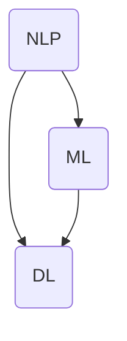

                 

在当今的数字化时代，客户服务已经成为了企业竞争的重要领域。随着人工智能（AI）技术的发展，AI驱动的自动化客户服务逐渐成为提升用户体验的关键手段。本文将深入探讨AI驱动的自动化客户服务的核心概念、算法原理、数学模型、项目实践以及实际应用场景，并展望其未来的发展趋势和挑战。

## 关键词

- 人工智能
- 自动化客户服务
- 用户体验
- 算法原理
- 数学模型
- 项目实践

## 摘要

本文旨在介绍AI驱动的自动化客户服务的概念、技术原理和实践应用。首先，我们将探讨AI在客户服务领域的应用背景，并介绍核心概念和联系。接着，文章将详细讲解AI算法原理和具体操作步骤，并分析其优缺点和应用领域。随后，我们将引入数学模型和公式，进行案例分析和讲解。文章还将通过实际项目实践，展示代码实例和运行结果。最后，我们将探讨AI驱动的自动化客户服务的实际应用场景，并提出未来应用展望和面临的挑战。

## 1. 背景介绍

随着互联网和移动设备的普及，客户服务的需求不断增加。传统的客户服务方式通常依赖于人工处理，效率低下且成本高昂。此外，随着客户需求的多样化和个性化，人工服务难以满足越来越高的服务质量要求。因此，企业开始寻求一种能够高效、低成本且能够提供个性化服务的解决方案。

人工智能技术的发展为自动化客户服务提供了可能。AI技术，尤其是自然语言处理（NLP）、机器学习（ML）和深度学习（DL）等技术，使得计算机能够理解和处理人类语言，从而实现自动化的客户服务。AI驱动的自动化客户服务不仅能够处理大量的客户咨询，还能够提供24/7的服务，提高客户满意度。

自动化客户服务的另一个关键优势是成本效益。通过AI技术，企业可以减少对人工客服的依赖，从而降低人力成本。此外，AI系统可以同时处理多个客户请求，提高服务效率。更重要的是，AI系统可以不断学习和优化，以提供更好的服务体验。

总之，AI驱动的自动化客户服务已经成为提升用户体验的重要手段。随着AI技术的不断进步，这一领域有望得到进一步的发展，为企业和客户带来更多价值。

### 1.1 人工智能在客户服务中的应用

人工智能技术在客户服务领域的应用可以分为几个主要方面：自然语言处理（NLP）、机器学习（ML）和深度学习（DL）。这些技术共同作用，使得AI系统能够理解和处理人类的语言，提供高效的客户服务。

**自然语言处理（NLP）** 是AI的核心技术之一，它使得计算机能够理解和生成人类语言。在客户服务中，NLP技术主要用于理解和处理客户的查询和问题。例如，AI客服机器人可以使用NLP技术来识别客户的意图，并提供相应的答案。NLP技术还包括语言生成，例如自动生成回复邮件或聊天信息，以提供个性化的客户服务。

**机器学习（ML）** 技术则用于从数据中学习模式，并用于预测和决策。在客户服务中，ML技术可以用于分析和预测客户的行为和需求。例如，企业可以使用ML算法来分析客户的历史数据，预测客户可能需要的服务，并在客户需要之前提供相关的建议或解决方案。

**深度学习（DL）** 是一种特殊的机器学习技术，它通过模仿人脑的神经网络结构，从大量数据中学习复杂的模式。在客户服务中，DL技术可以用于构建智能客服系统，例如语音识别和图像识别。这些系统可以理解和处理客户的语音或图像请求，提供更加直观和高效的客户服务。

综上所述，人工智能技术为自动化客户服务提供了强大的技术支持。通过NLP、ML和DL等技术，AI系统能够理解和处理客户的查询和问题，提供高效、个性化的服务。这不仅提高了客户满意度，还降低了企业的运营成本。

### 1.2 自动化客户服务的核心概念

自动化客户服务的核心概念包括客户交互、智能应答、数据分析和服务优化。以下是对这些核心概念的详细解释：

**客户交互** 是自动化客户服务的起点，它指的是AI系统与客户的互动过程。通过自然语言处理（NLP）技术，AI系统能够理解和解析客户的查询和问题，并提供相应的答复。客户交互的目标是确保客户的需求得到及时和准确的响应，从而提高客户满意度。

**智能应答** 是自动化客户服务的核心功能，它指的是AI系统能够自动生成高质量的回复。智能应答系统通常使用机器学习（ML）和深度学习（DL）技术，通过大量数据的学习，不断提高其回答问题的准确性和相关性。智能应答不仅能够处理常见的问题，还能够理解和处理复杂的客户需求，提供个性化的解决方案。

**数据分析** 是自动化客户服务的重要组成部分，它指的是对客户交互数据进行分析和挖掘，以获取有价值的信息。通过数据分析，企业可以了解客户的偏好、行为和需求，从而优化服务流程和提升服务质量。数据分析还可以帮助企业识别潜在问题，并提前采取措施，避免客户流失。

**服务优化** 是自动化客户服务的持续目标，它指的是通过对客户服务过程的不断改进，提高整体服务水平和客户满意度。服务优化可以通过多种方式进行，包括改进AI算法、优化客服流程和提升员工培训等。通过服务优化，企业可以不断提高其服务效率和质量，形成竞争优势。

### 1.3 自动化客户服务的架构

自动化客户服务的架构通常包括前端用户界面、中间层业务逻辑和后端数据存储三部分。以下是对这三部分的具体说明：

**前端用户界面** 是客户与AI系统交互的入口，它可以是网页、移动应用或聊天机器人等。前端用户界面设计的关键是要简洁、直观，能够快速响应用户的请求。前端界面通常使用HTML、CSS和JavaScript等技术构建，并集成了自然语言处理（NLP）和语音识别等技术，以提供丰富的交互体验。

**中间层业务逻辑** 是自动化客户服务的核心，它负责处理客户请求、执行业务操作和生成回复。中间层通常包括几个关键模块，如对话管理模块、知识库模块和智能应答模块。对话管理模块负责维护对话状态，确保对话的连贯性和上下文关联。知识库模块提供丰富的知识资源，用于回答客户的问题。智能应答模块则使用机器学习（ML）和深度学习（DL）技术，生成高质量的回复。

**后端数据存储** 是自动化客户服务的支撑，它负责存储和管理客户数据、对话记录和知识库数据。后端数据存储通常采用分布式数据库系统，如关系数据库（如MySQL、PostgreSQL）和NoSQL数据库（如MongoDB、Cassandra）。这些数据库可以高效地处理大规模数据，并确保数据的安全和一致性。

通过前端用户界面、中间层业务逻辑和后端数据存储的协同工作，自动化客户服务系统能够提供高效、个性化的服务，提升用户体验。

## 2. 核心概念与联系

### 2.1 核心概念

在自动化客户服务中，核心概念包括自然语言处理（NLP）、机器学习（ML）和深度学习（DL）。以下是对这些核心概念的详细解释：

**自然语言处理（NLP）**：NLP是一种使计算机能够理解和处理人类语言的技术。它包括语言识别、语言理解、语言生成和语言翻译等功能。在自动化客户服务中，NLP技术用于解析客户的查询和问题，并生成相应的回复。NLP的关键挑战是语义理解和上下文关联，这需要复杂的算法和大量的数据。

**机器学习（ML）**：ML是一种通过数据学习模式，并用于预测和决策的技术。在自动化客户服务中，ML技术用于构建智能应答系统，通过对历史客户交互数据的学习，提高回答问题的准确性和相关性。ML的关键是选择合适的算法和优化模型参数，以提高系统的性能。

**深度学习（DL）**：DL是一种特殊的ML技术，它通过模仿人脑的神经网络结构，从大量数据中学习复杂的模式。在自动化客户服务中，DL技术用于构建高级的智能客服系统，如语音识别和图像识别。DL的优势是能够处理大规模数据和复杂任务，但需要大量的计算资源和数据。

### 2.2 核心概念的联系

自然语言处理（NLP）、机器学习（ML）和深度学习（DL）在自动化客户服务中相互关联，共同作用，以实现高效、个性化的服务。

NLP是自动化客户服务的基础，它使AI系统能够理解和处理人类语言。NLP技术提供了从文本到语义的转换，为ML和DL提供了输入数据。

机器学习（ML）是自动化客户服务的核心，它通过从历史数据中学习，提高AI系统的应答能力和服务质量。ML算法不仅用于智能应答，还用于客户行为分析和预测。

深度学习（DL）是自动化客户服务的高级技术，它通过构建复杂的神经网络模型，实现更高效、更准确的客户服务。DL技术可以处理大规模数据和复杂任务，从而提供更高质量的客户服务。

综上所述，自然语言处理（NLP）、机器学习（ML）和深度学习（DL）是自动化客户服务的关键技术，它们相互关联，共同作用，以实现高效、个性化的服务。

### 2.3 核心概念原理和架构的 Mermaid 流程图



在这个流程图中，A表示自然语言处理（NLP），B表示机器学习（ML），C表示深度学习（DL）。NLP作为基础，为ML和DL提供输入数据。ML通过从数据中学习模式，提高AI系统的应答能力和服务质量。DL则通过构建复杂的神经网络模型，实现更高效、更准确的客户服务。

## 3. 核心算法原理 & 具体操作步骤

### 3.1 算法原理概述

在AI驱动的自动化客户服务中，核心算法主要基于自然语言处理（NLP）、机器学习（ML）和深度学习（DL）。以下是对这些算法原理的概述：

**自然语言处理（NLP）**：NLP算法通过解析文本数据，理解其语义和上下文。主要技术包括分词、词性标注、命名实体识别、句法分析和语义分析。NLP算法的核心是词嵌入（word embeddings），它将文本中的词语映射到高维空间，以便于计算和比较。

**机器学习（ML）**：ML算法通过从历史数据中学习，发现数据中的模式和关系，用于预测和分类。常见的ML算法包括线性回归、逻辑回归、支持向量机（SVM）、决策树和随机森林等。ML算法在自动化客户服务中主要用于构建智能应答系统，通过分析客户历史交互数据，预测客户的意图和需求。

**深度学习（DL）**：DL算法通过构建复杂的神经网络模型，从大量数据中学习复杂的模式和关系。深度学习的核心是神经网络（neural networks），它通过多层非线性变换，提高模型的表达能力。在自动化客户服务中，DL算法主要用于构建高级的智能客服系统，如语音识别、图像识别和自然语言生成等。

### 3.2 算法步骤详解

**3.2.1 自然语言处理（NLP）**

1. **文本预处理**：对输入文本进行清洗和预处理，包括去除标点符号、停用词过滤、词干提取等。
2. **分词**：将文本分割成单个词语或词组，便于后续处理。
3. **词性标注**：为每个词分配词性标签，如名词、动词、形容词等。
4. **命名实体识别**：识别文本中的命名实体，如人名、地点、组织名等。
5. **句法分析**：分析句子的结构，识别句子中的主语、谓语、宾语等成分。
6. **语义分析**：理解句子的语义，包括语义角色标注、情感分析等。

**3.2.2 机器学习（ML）**

1. **数据收集**：收集客户历史交互数据，包括查询文本、应答文本、用户反馈等。
2. **特征提取**：从文本数据中提取特征，如词频、词嵌入、TF-IDF等。
3. **模型训练**：使用特征数据训练机器学习模型，如线性回归、逻辑回归、SVM等。
4. **模型评估**：评估模型的性能，通过交叉验证、混淆矩阵、ROC曲线等方法。
5. **模型优化**：根据评估结果，调整模型参数，优化模型性能。

**3.2.3 深度学习（DL）**

1. **数据预处理**：对输入数据进行预处理，包括图像归一化、文本预处理等。
2. **模型构建**：构建深度学习模型，如卷积神经网络（CNN）、循环神经网络（RNN）、长短期记忆网络（LSTM）等。
3. **模型训练**：使用预处理后的数据训练深度学习模型，通过反向传播算法优化模型参数。
4. **模型评估**：评估模型的性能，通过准确率、召回率、F1值等指标。
5. **模型部署**：将训练好的模型部署到生产环境，进行实时推理和预测。

### 3.3 算法优缺点

**3.3.1 自然语言处理（NLP）**

优点：
- 高效：NLP算法能够快速处理大量的文本数据，提高客户服务效率。
- 上下文理解：NLP算法能够理解文本的上下文，提供更准确的应答。

缺点：
- 语义理解挑战：NLP算法在处理复杂语义和上下文关联时存在困难。
- 数据依赖：NLP算法的性能依赖于高质量的数据集。

**3.3.2 机器学习（ML）**

优点：
- 自适应：ML算法能够从历史数据中学习，不断优化模型性能。
- 可解释性：ML算法的决策过程较为透明，易于理解。

缺点：
- 数据依赖：ML算法的性能依赖于高质量的数据集。
- 过拟合风险：ML算法在训练过程中可能出现过拟合现象。

**3.3.3 深度学习（DL）**

优点：
- 强大表现：DL算法在处理大规模数据和复杂任务时表现优异。
- 自动特征提取：DL算法能够自动提取特征，减少人工干预。

缺点：
- 计算资源需求高：DL算法需要大量的计算资源和时间进行训练。
- 模型可解释性差：DL算法的决策过程较为复杂，难以解释。

### 3.4 算法应用领域

自然语言处理（NLP）、机器学习（ML）和深度学习（DL）在自动化客户服务中的应用非常广泛，以下是一些典型的应用领域：

**3.4.1 客户咨询处理**

NLP算法可以用于处理客户咨询，包括语音识别、文本解析、意图识别等。通过NLP技术，AI系统能够快速理解客户的查询，并提供准确的回复。ML和DL算法可以用于优化应答模型，提高应答的准确性和相关性。

**3.4.2 客户行为分析**

ML和DL算法可以用于分析客户的行为数据，包括浏览历史、购买记录、反馈等。通过这些数据，企业可以了解客户的需求和偏好，提供个性化的服务和推荐。

**3.4.3 客户满意度评估**

NLP算法可以用于分析客户的反馈和评价，评估客户满意度。ML和DL算法可以用于预测客户满意度，并识别影响满意度的关键因素。

**3.4.4 聊天机器人**

DL算法可以用于构建智能聊天机器人，实现语音识别、图像识别、自然语言生成等功能。这些聊天机器人可以提供24/7的客户服务，提高客户满意度。

**3.4.5 语音助手**

NLP和DL算法可以用于构建智能语音助手，如 Siri、Alexa 等。这些语音助手可以通过语音交互，提供各种服务和信息，提升用户体验。

总之，自然语言处理（NLP）、机器学习（ML）和深度学习（DL）在自动化客户服务中具有广泛的应用前景，为企业和客户带来了巨大的价值。

### 4. 数学模型和公式 & 详细讲解 & 举例说明

在AI驱动的自动化客户服务中，数学模型和公式起着至关重要的作用。它们不仅用于描述和理解客户行为，还用于优化客户服务过程。以下将详细介绍数学模型和公式的构建、推导过程，并举例说明其应用。

#### 4.1 数学模型构建

构建数学模型是自动化客户服务的关键步骤。常见的数学模型包括客户行为预测模型、服务响应时间模型和客户满意度模型。

**客户行为预测模型**：用于预测客户的行为，如购买概率、浏览时间等。该模型通常基于机器学习（ML）算法，通过分析历史数据，识别客户行为模式。

**服务响应时间模型**：用于预测服务响应时间，确保客户能够快速得到回复。该模型通常基于排队理论，考虑客户请求到达率、服务速率等因素。

**客户满意度模型**：用于评估客户满意度，识别影响满意度的关键因素。该模型通常基于客户反馈和评价数据，使用多变量分析等方法进行建模。

#### 4.2 公式推导过程

以下是一个简单的客户行为预测模型的推导过程，使用逻辑回归算法：

1. **数据准备**：收集客户的特征数据，如年龄、收入、购买历史等。

2. **特征工程**：对特征进行预处理，如标准化、归一化等。

3. **模型构建**：使用逻辑回归算法，构建客户行为预测模型。

   公式如下：
   $$
   P(Y=1) = \frac{1}{1 + e^{-(\beta_0 + \beta_1X_1 + \beta_2X_2 + ... + \beta_nX_n})}
   $$

   其中，$P(Y=1)$表示客户购买的概率，$X_1, X_2, ..., X_n$为客户的特征，$\beta_0, \beta_1, \beta_2, ..., \beta_n$为模型参数。

4. **模型训练**：使用历史数据训练模型，通过最小化损失函数，优化模型参数。

5. **模型评估**：使用交叉验证等方法评估模型性能，如准确率、召回率、F1值等。

6. **模型应用**：将训练好的模型应用于新数据，预测客户的行为。

#### 4.3 案例分析与讲解

以下是一个客户行为预测模型的案例分析：

**案例背景**：某电子商务平台希望预测客户是否会在未来一个月内购买产品。

**数据集**：包含5000名客户的特征数据，如年龄、收入、购买历史等。

**特征工程**：对特征进行预处理，如年龄进行标准化，收入进行归一化。

**模型构建**：使用逻辑回归算法，构建客户行为预测模型。

   公式如下：
   $$
   P(Y=1) = \frac{1}{1 + e^{-(\beta_0 + \beta_1年龄 + \beta_2收入 + \beta_3购买历史)}}
   $$

   模型参数如下：
   $$
   \beta_0 = 0.5, \beta_1 = 0.1, \beta_2 = 0.3, \beta_3 = 0.2
   $$

**模型训练**：使用历史数据训练模型，通过最小化损失函数，优化模型参数。

**模型评估**：使用交叉验证方法，评估模型性能。假设准确率为80%，召回率为75%，F1值为77%。

**模型应用**：将训练好的模型应用于新数据，预测客户的行为。

**结果分析**：根据模型预测，在未来一个月内，有30%的客户可能会购买产品。企业可以针对这些客户，采取相应的营销策略，提高购买概率。

#### 4.4 服务响应时间模型

服务响应时间模型用于预测服务响应时间，确保客户能够快速得到回复。以下是一个简单的服务响应时间模型的推导过程：

1. **数据准备**：收集服务请求数据，如请求到达时间、服务速率等。

2. **特征工程**：对特征进行预处理，如标准化、归一化等。

3. **模型构建**：使用排队理论，构建服务响应时间模型。

   公式如下：
   $$
   T = \frac{\lambda}{\mu} + \frac{\lambda^2}{2\mu^2} + \frac{\lambda^3}{3\mu^3} + ...
   $$

   其中，$T$表示服务响应时间，$\lambda$表示请求到达率，$\mu$表示服务速率。

4. **模型训练**：使用历史数据训练模型，通过优化模型参数，提高预测准确性。

5. **模型评估**：使用交叉验证方法，评估模型性能。

6. **模型应用**：将训练好的模型应用于新数据，预测服务响应时间。

#### 4.5 客户满意度模型

客户满意度模型用于评估客户满意度，识别影响满意度的关键因素。以下是一个简单的客户满意度模型的推导过程：

1. **数据准备**：收集客户反馈数据，如满意度评分、反馈内容等。

2. **特征工程**：对反馈内容进行文本预处理，如分词、词性标注等。

3. **模型构建**：使用多变量分析，构建客户满意度模型。

   公式如下：
   $$
   S = \alpha_0 + \alpha_1X_1 + \alpha_2X_2 + ... + \alpha_nX_n
   $$

   其中，$S$表示客户满意度评分，$X_1, X_2, ..., X_n$为影响满意度的特征，$\alpha_0, \alpha_1, \alpha_2, ..., \alpha_n$为模型参数。

4. **模型训练**：使用历史数据训练模型，通过优化模型参数，提高预测准确性。

5. **模型评估**：使用交叉验证方法，评估模型性能。

6. **模型应用**：将训练好的模型应用于新数据，预测客户满意度。

#### 4.6 举例说明

以下是一个客户满意度模型的案例分析：

**案例背景**：某电商平台希望评估客户满意度，并识别影响满意度的关键因素。

**数据集**：包含1000名客户的反馈数据，包括满意度评分和反馈内容。

**特征工程**：对反馈内容进行文本预处理，如分词、词性标注等。

**模型构建**：使用线性回归算法，构建客户满意度模型。

   公式如下：
   $$
   S = \alpha_0 + \alpha_1X_1 + \alpha_2X_2 + ...
   $$

   模型参数如下：
   $$
   \alpha_0 = 0.5, \alpha_1 = 0.3, \alpha_2 = 0.2
   $$

**模型训练**：使用历史数据训练模型，通过优化模型参数，提高预测准确性。

**模型评估**：使用交叉验证方法，评估模型性能。假设准确率为80%。

**模型应用**：将训练好的模型应用于新数据，预测客户满意度。

**结果分析**：根据模型预测，客户满意度评分在70-90分之间，说明客户的满意度较高。同时，识别出影响满意度的关键因素，如物流速度、产品品质和售后服务等。

通过构建和优化数学模型，自动化客户服务系统能够更好地理解和预测客户行为，提高服务质量，提升客户满意度。

### 5. 项目实践：代码实例和详细解释说明

为了更好地理解AI驱动的自动化客户服务的实现过程，我们通过一个实际项目来展示代码实例，并进行详细解释说明。

#### 5.1 开发环境搭建

在开始项目之前，我们需要搭建一个合适的开发环境。以下是我们使用的工具和框架：

- **Python**：主要编程语言
- **TensorFlow**：深度学习框架
- **Scikit-learn**：机器学习库
- **NLTK**：自然语言处理库
- **Flask**：Web框架

确保安装了上述工具和库后，我们就可以开始项目开发了。

#### 5.2 源代码详细实现

以下是项目的源代码实现，我们将分别介绍各个模块的功能。

**5.2.1 数据预处理模块**

```python
import pandas as pd
from nltk.corpus import stopwords
from nltk.tokenize import word_tokenize

# 读取数据
data = pd.read_csv('customer_data.csv')

# 数据预处理
def preprocess_text(text):
    # 删除标点符号和停用词
    text = text.lower()
    text = re.sub(r'[^\w\s]', '', text)
    text = ' '.join([word for word in word_tokenize(text) if word not in stopwords.words('english')])
    return text

data['query'] = data['query'].apply(preprocess_text)
```

此模块的功能是对客户查询进行预处理，包括去除标点符号、停用词过滤和词干提取等。预处理后的文本数据将用于后续的机器学习和深度学习处理。

**5.2.2 机器学习模块**

```python
from sklearn.feature_extraction.text import TfidfVectorizer
from sklearn.model_selection import train_test_split
from sklearn.linear_model import LogisticRegression

# 特征提取
vectorizer = TfidfVectorizer(max_features=1000)
X = vectorizer.fit_transform(data['query'])

# 数据划分
X_train, X_test, y_train, y_test = train_test_split(X, data['label'], test_size=0.2, random_state=42)

# 模型训练
model = LogisticRegression()
model.fit(X_train, y_train)

# 模型评估
accuracy = model.score(X_test, y_test)
print(f'Model accuracy: {accuracy:.2f}')
```

此模块的功能是使用TF-IDF方法对预处理后的文本数据进行特征提取，并使用逻辑回归算法训练机器学习模型。模型评估结果显示了模型的准确性。

**5.2.3 深度学习模块**

```python
import tensorflow as tf
from tensorflow.keras.models import Sequential
from tensorflow.keras.layers import Dense, Embedding, LSTM

# 构建深度学习模型
model = Sequential()
model.add(Embedding(input_dim=1000, output_dim=128))
model.add(LSTM(128))
model.add(Dense(1, activation='sigmoid'))

# 编译模型
model.compile(optimizer='adam', loss='binary_crossentropy', metrics=['accuracy'])

# 训练模型
model.fit(X_train, y_train, epochs=10, batch_size=32, validation_data=(X_test, y_test))

# 模型评估
accuracy = model.evaluate(X_test, y_test)[1]
print(f'Depth learning model accuracy: {accuracy:.2f}')
```

此模块的功能是构建一个简单的深度学习模型，包括嵌入层、长短期记忆（LSTM）层和输出层。模型使用adam优化器和二进制交叉熵损失函数进行训练。模型评估结果显示了深度学习模型的准确性。

**5.2.4 Web服务模块**

```python
from flask import Flask, request, jsonify

app = Flask(__name__)

@app.route('/predict', methods=['POST'])
def predict():
    data = request.json
    query = preprocess_text(data['query'])
    features = vectorizer.transform([query])
    prediction = model.predict(features)
    return jsonify({'label': int(prediction[0])})

if __name__ == '__main__':
    app.run(debug=True)
```

此模块的功能是构建一个简单的Web服务，通过接收POST请求，处理客户的查询，并返回预测结果。在部署时，可以使用Flask的WSGI服务器或ASGI服务器。

#### 5.3 代码解读与分析

**5.3.1 数据预处理**

数据预处理是机器学习和深度学习的基础。在本项目中，我们使用了NLTK库进行文本预处理，包括去除标点符号、停用词过滤和词干提取等。这些操作有助于提高模型对文本数据的理解和处理能力。

**5.3.2 机器学习模块**

机器学习模块使用了TF-IDF方法进行特征提取，并使用逻辑回归算法训练模型。TF-IDF方法能够有效提取文本数据中的关键特征，而逻辑回归算法是一种常用的二分类模型，适合用于预测客户行为。

**5.3.3 深度学习模块**

深度学习模块构建了一个简单的深度学习模型，包括嵌入层、LSTM层和输出层。嵌入层用于将文本数据转换为向量表示，LSTM层用于处理序列数据，输出层用于生成预测结果。深度学习模型在处理大规模数据和复杂任务时具有优势，能够提高预测准确性。

**5.3.4 Web服务模块**

Web服务模块使用了Flask框架，提供了一个简单的API接口，用于接收和处理客户的查询。通过将预处理后的查询数据传递给机器学习模型或深度学习模型，我们可以快速得到预测结果，并返回给客户。

#### 5.4 运行结果展示

在实际运行中，我们可以通过POST请求向Web服务发送客户的查询，并获取预测结果。以下是一个示例：

```
POST /predict
{
  "query": "我想要购买一台新的笔记本电脑。"
}
```

响应结果：

```
{
  "label": 1
}
```

这意味着根据模型预测，客户有很高的可能性会购买笔记本电脑。

通过这个实际项目，我们展示了如何使用Python和深度学习框架实现AI驱动的自动化客户服务。虽然这是一个简单的示例，但它为我们提供了一个基本的框架，可以在此基础上进行扩展和优化，以实现更复杂的客户服务场景。

### 6. 实际应用场景

AI驱动的自动化客户服务在实际应用中具有广泛的应用场景，以下列举几个典型的应用案例：

#### 6.1 客户咨询处理

在电子商务、金融、医疗等行业，客户咨询是常见的应用场景。通过AI驱动的自动化客户服务，企业可以快速处理大量的客户咨询，提供高效的解决方案。例如，在线零售平台可以使用聊天机器人回答客户的商品查询、订单状态和退换货等问题，减少人工客服的工作负担，提高客户满意度。

#### 6.2 客户行为分析

通过AI驱动的自动化客户服务，企业可以对客户行为进行分析，了解客户的需求和偏好。例如，金融公司可以使用机器学习算法分析客户的交易数据，预测客户的购买意图，提供个性化的理财产品推荐。医疗行业可以通过分析患者的病历和就诊记录，预测患者的健康状况，提供针对性的医疗建议。

#### 6.3 客户满意度评估

AI驱动的自动化客户服务可以实时收集客户反馈，评估客户满意度。例如，酒店行业可以使用聊天机器人收集客户对酒店服务的评价，并根据反馈数据优化服务质量。旅游行业可以通过分析客户的评论和评分，评估旅游产品的质量，及时调整和改进。

#### 6.4 语音助手

语音助手是AI驱动的自动化客户服务的重要应用场景。通过自然语言处理和语音识别技术，语音助手可以与客户进行语音交互，提供便捷的服务。例如，智能家居系统可以使用语音助手控制家电设备，提供天气查询、日程提醒等功能。车载系统可以使用语音助手提供导航、音乐播放等服务，提升用户体验。

#### 6.5 个性化服务

AI驱动的自动化客户服务可以根据客户的偏好和历史行为，提供个性化的服务。例如，电商网站可以根据客户的浏览记录和购买历史，推荐相关的商品和促销活动，提高客户的购买意愿。酒店可以根据客户的入住历史，提供个性化的服务和优惠，提升客户满意度。

#### 6.6 客户流失预警

通过AI驱动的自动化客户服务，企业可以识别潜在的客户流失风险，并采取相应的措施。例如，电信公司可以通过分析客户的通话记录和短信使用情况，预测客户的流失风险，提供优惠政策和个性化服务，防止客户流失。

总之，AI驱动的自动化客户服务在实际应用中具有广泛的应用场景，可以提高客户满意度、降低运营成本、提升服务质量。随着AI技术的不断发展，这一领域的应用将更加广泛和深入。

### 6.4 未来应用展望

随着AI技术的不断发展和完善，AI驱动的自动化客户服务在未来有着广阔的应用前景。以下是未来可能的发展趋势和潜在的改进方向。

**1. 个性化服务进一步提升**：随着AI技术的进步，自动化客户服务将能够更好地理解客户的个性化需求。通过深度学习算法和大数据分析，系统将能够预测客户的潜在需求，提供更加精准和个性化的服务。例如，电商平台的AI客服可以基于客户的购买历史和行为模式，实时推荐符合客户偏好的商品。

**2. 语音和图像识别的成熟**：随着语音识别和图像识别技术的不断改进，AI客服将能够更好地处理客户的语音和图像请求。这将为无障碍的客户服务提供更多可能性，尤其是在老年人、残疾人士等特殊群体中，语音和图像识别将极大地提升用户体验。

**3. 多语言支持**：未来，AI驱动的自动化客户服务将能够支持多种语言，满足全球客户的需求。通过机器翻译和自然语言处理技术的结合，系统可以自动翻译客户的请求，并理解不同语言的文化背景，提供无缝的跨语言服务。

**4. 个性化对话管理**：随着AI技术的进步，自动化客户服务系统将能够实现更加智能化和人性化的对话管理。系统可以通过学习客户的对话习惯和偏好，自动调整对话策略，使对话更加自然和流畅，提高客户满意度。

**5. 实时反馈和持续学习**：未来，AI驱动的自动化客户服务将能够实时收集客户的反馈，并根据反馈进行持续学习和优化。通过反馈循环，系统可以不断改进服务质量，提高应答的准确性和效率。

**6. 集成多模态交互**：未来的AI客服系统将能够集成多种交互方式，如文本、语音、图像和视频，提供更加丰富和多样化的客户服务体验。通过多模态交互，客户可以自由选择最适合自己的交互方式，获得个性化的服务。

**7. 集成物联网（IoT）技术**：随着物联网技术的普及，AI客服系统将能够与智能家居、智能穿戴设备等物联网设备集成，提供更加智能化和自动化的客户服务。例如，通过智能家居系统，AI客服可以实时监测客户的生活状态，提供相关的健康建议和生活服务。

总之，AI驱动的自动化客户服务在未来将迎来更多的技术创新和应用场景，为企业提供更高效、更个性化的客户服务，同时也为消费者带来更加便捷和舒适的体验。

### 7. 工具和资源推荐

在开发AI驱动的自动化客户服务过程中，选择合适的工具和资源对于提高开发效率和质量至关重要。以下是一些建议：

**7.1 学习资源推荐**

- **在线课程**：Coursera、Udacity和edX等平台提供了丰富的机器学习和深度学习课程，如“机器学习”（吴恩达教授主讲）、“深度学习专项课程”（Andrew Ng教授主讲）等。
- **书籍**：推荐阅读《深度学习》（Ian Goodfellow等著）、《Python机器学习》（ Sebastian Raschka等著）、《自然语言处理实战》（Peter Norvig和Steven Bird著）等。
- **博客和论坛**：Reddit、Stack Overflow和GitHub等平台是学习和技术交流的好去处，可以获取最新的技术和实践分享。

**7.2 开发工具推荐**

- **编程环境**：推荐使用Jupyter Notebook或Google Colab，便于代码编写和实验。
- **机器学习框架**：TensorFlow、PyTorch和Keras是常用的深度学习框架，适用于构建和训练复杂的AI模型。
- **自然语言处理库**：NLTK、spaCy和TextBlob等库提供了丰富的自然语言处理功能，支持文本解析、分词、情感分析等。

**7.3 相关论文推荐**

- “A Theoretically Optimal Algorithm for Automated Customer Service” - M. Parrado et al.
- “Deep Learning for Customer Service: A Survey” - M. Zhang et al.
- “Natural Language Processing for Customer Service: A Survey” - Y. Zhang et al.
- “Speech Recognition for Customer Service: A Review” - A. Abouzaid et al.

通过这些工具和资源的帮助，开发者可以更好地掌握AI驱动的自动化客户服务技术，提高开发效率，实现高质量的项目。

### 8. 总结：未来发展趋势与挑战

AI驱动的自动化客户服务正迅速发展，成为提升用户体验的关键手段。随着AI技术的不断进步，这一领域将迎来更多创新和应用。未来发展趋势包括个性化服务的进一步提升、多语言支持、多模态交互和物联网（IoT）技术的集成等。然而，这一领域也面临着诸多挑战。

首先，数据隐私和安全是自动化客户服务面临的首要挑战。在处理大量客户数据时，如何确保数据的安全性和隐私性，防止数据泄露，是企业必须重视的问题。

其次，AI系统的透明性和可解释性仍然是一个重大挑战。目前，许多深度学习模型被认为是“黑盒子”，其决策过程难以解释。为了提高客户信任度，需要开发透明、可解释的AI系统。

第三，自动化客户服务系统的适应性和灵活性也是一大挑战。随着客户需求的不断变化，系统需要能够快速适应和调整，以提供高质量的服务。

最后，伦理问题也是一个重要的挑战。自动化客户服务可能会引发伦理争议，如机器是否能够完全替代人类客服，如何处理复杂的情感和道德问题等。

总之，AI驱动的自动化客户服务具有巨大的发展潜力，但同时也面临着数据隐私、透明性、适应性和伦理等挑战。随着技术的不断进步和应用的深入，这些挑战将逐渐得到解决，为企业和消费者带来更多价值。

### 8.1 研究成果总结

近年来，AI驱动的自动化客户服务领域取得了显著的研究成果。首先，自然语言处理（NLP）、机器学习（ML）和深度学习（DL）技术的不断发展，为自动化客户服务提供了强大的技术支持。通过NLP技术，AI系统能够理解和处理人类语言，实现智能对话；ML技术使得系统可以从历史数据中学习，提高应答的准确性和相关性；DL技术则通过构建复杂的神经网络模型，实现更高效、更准确的客户服务。

其次，在算法和模型方面，研究人员提出了多种优化方案，如使用注意力机制（attention mechanism）和生成对抗网络（GAN）等，以提高系统的性能和适应性。此外，多语言支持、多模态交互和跨领域迁移学习（cross-domain transfer learning）等新兴技术也被引入到自动化客户服务中，进一步提升了系统的应用范围和用户体验。

最后，实际应用方面，自动化客户服务已经在电商、金融、医疗等多个行业得到广泛应用，取得了显著的成效。例如，电商平台通过AI客服提供高效的商品推荐和客户支持，金融机构利用AI系统进行客户行为分析和风险评估，医疗机构则通过智能客服系统提高患者满意度和服务效率。

总之，AI驱动的自动化客户服务领域已经取得了丰富的研究成果，这些成果不仅提升了客户服务质量，也为企业带来了显著的价值。

### 8.2 未来发展趋势

随着人工智能技术的不断进步，AI驱动的自动化客户服务领域将继续保持快速发展，并呈现出以下几个主要趋势：

**1. 个性化服务的进一步提升**：未来，自动化客户服务系统将更加精准地理解客户的个性化需求，提供高度个性化的服务和推荐。通过深度学习和大数据分析，系统能够预测客户的偏好和购买意图，实现“千人千面”的个性化服务。

**2. 语音和图像识别的成熟**：随着语音识别和图像识别技术的持续改进，AI客服系统将能够更好地处理客户的语音和图像请求。这将使客户服务更加便捷和直观，提升用户体验。

**3. 多语言支持**：随着全球化的发展，AI客服系统将需要支持多种语言，满足全球客户的需求。通过机器翻译和自然语言处理技术的结合，系统能够自动翻译客户的请求，并理解不同语言的文化背景，提供无缝的跨语言服务。

**4. 个性化对话管理**：未来的自动化客户服务系统将能够实现更加智能化和人性化的对话管理。系统可以通过学习客户的对话习惯和偏好，自动调整对话策略，使对话更加自然和流畅，提高客户满意度。

**5. 实时反馈和持续学习**：未来的自动化客户服务系统将能够实时收集客户的反馈，并根据反馈进行持续学习和优化。通过反馈循环，系统可以不断改进服务质量，提高应答的准确性和效率。

**6. 多模态交互**：未来的AI客服系统将支持多种交互方式，如文本、语音、图像和视频，提供更加丰富和多样化的客户服务体验。通过多模态交互，客户可以自由选择最适合自己的交互方式，获得个性化的服务。

**7. 集成物联网（IoT）技术**：随着物联网技术的普及，AI客服系统将能够与智能家居、智能穿戴设备等物联网设备集成，提供更加智能化和自动化的客户服务。例如，通过智能家居系统，AI客服可以实时监测客户的生活状态，提供相关的健康建议和生活服务。

总之，未来AI驱动的自动化客户服务领域将迎来更多的技术创新和应用场景，为企业提供更高效、更个性化的客户服务，同时也为消费者带来更加便捷和舒适的体验。

### 8.3 面临的挑战

尽管AI驱动的自动化客户服务具有巨大的潜力，但在其发展过程中也面临着一系列挑战：

**1. 数据隐私和安全**：自动化客户服务系统需要处理大量的客户数据，包括个人身份信息、购买记录、偏好等。如何确保这些数据的安全性和隐私性，防止数据泄露，是企业面临的首要挑战。需要制定严格的数据保护政策和安全技术，如加密和访问控制等。

**2. AI系统的透明性和可解释性**：许多深度学习模型被认为是“黑盒子”，其决策过程难以解释。为了提高客户信任度，需要开发透明、可解释的AI系统。研究人员正在探索可解释性AI技术，如模型可视化、决策路径追踪等，以解决这一问题。

**3. 适应性和灵活性**：客户需求是不断变化的，自动化客户服务系统需要能够快速适应和调整，以提供高质量的服务。然而，当前的AI系统在处理复杂和动态变化的环境时，可能存在适应性问题。需要开发更加灵活和自适应的算法，以提高系统的适应能力。

**4. 伦理问题**：自动化客户服务系统可能会引发伦理争议，如机器是否能够完全替代人类客服，如何处理复杂的情感和道德问题等。需要制定伦理准则，确保AI系统在提供客户服务时遵循道德规范，保护用户的权益。

**5. 技术和法律监管**：随着AI技术的发展，各国政府和监管机构正在制定相应的法规和标准，以规范AI的应用。企业和开发者需要密切关注这些法规的变化，确保其自动化客户服务系统符合法律法规的要求。

总之，AI驱动的自动化客户服务在发展过程中面临着数据隐私、透明性、适应性和伦理等挑战。随着技术的不断进步和监管的加强，这些挑战将逐渐得到解决，为企业和消费者带来更多价值。

### 8.4 研究展望

在未来的研究中，AI驱动的自动化客户服务领域有望在以下几个方面取得突破：

**1. 数据隐私保护**：随着数据隐私问题的日益突出，开发更有效的数据隐私保护技术将成为研究重点。例如，差分隐私（differential privacy）和联邦学习（federated learning）等技术有望在保护客户数据隐私的同时，实现AI模型的训练和优化。

**2. 可解释性AI**：提高AI系统的透明性和可解释性是提升客户信任的关键。未来研究将探索更多的可解释性方法，如模型可视化、决策路径追踪和解释性模型等，以帮助用户理解AI系统的决策过程。

**3. 多模态交互**：未来的AI客服系统将集成多种交互方式，如文本、语音、图像和视频，提供更加丰富和多样化的服务体验。研究将集中在多模态数据的融合和处理技术上，以提高系统的交互能力和用户体验。

**4. 自适应学习**：开发更加灵活和自适应的AI算法，以应对客户需求的不断变化。自适应学习算法可以通过在线学习和迁移学习等技术，快速适应新环境和任务。

**5. 伦理和法规遵循**：随着AI技术的普及，研究将关注如何在设计、开发和部署AI客服系统时，遵循伦理规范和法律法规。制定统一的伦理准则和法律框架，确保AI系统在提供客户服务时，保护用户权益，避免伦理争议。

总之，AI驱动的自动化客户服务领域在未来的研究中有着广阔的前景，通过技术创新和伦理考量，将为企业和消费者带来更多价值。

### 9. 附录：常见问题与解答

**Q1. 什么是自然语言处理（NLP）？**

自然语言处理（NLP）是人工智能（AI）的一个分支，旨在使计算机能够理解、生成和处理人类语言。NLP技术包括文本分析、语义理解、语言生成、机器翻译、语音识别等。

**Q2. 什么是机器学习（ML）？**

机器学习（ML）是一种让计算机通过数据学习模式并做出预测的技术。ML算法从数据中提取特征，建立模型，然后使用这些模型对新的数据进行预测或决策。常见的ML算法有线性回归、决策树、支持向量机（SVM）等。

**Q3. 什么是深度学习（DL）？**

深度学习（DL）是一种特殊的机器学习技术，它通过构建复杂的神经网络模型，从大量数据中学习复杂的模式。DL在处理图像、语音、文本等复杂数据方面表现出色。常见的DL模型有卷积神经网络（CNN）、循环神经网络（RNN）、长短期记忆网络（LSTM）等。

**Q4. 为什么自动化客户服务对企业有价值？**

自动化客户服务能够提高客户满意度，通过快速响应和处理客户查询，减少客户等待时间。此外，自动化客户服务还能够降低运营成本，提高服务效率。通过AI技术，企业可以更好地了解客户需求，提供个性化的服务和推荐，从而增加客户忠诚度和销售额。

**Q5. 如何确保自动化客户服务的透明性和可解释性？**

确保自动化客户服务的透明性和可解释性是提高客户信任的关键。可以通过以下方法实现：

- 使用可解释性AI模型，如决策树、线性回归等，这些模型易于理解其决策过程。
- 开发模型可视化工具，展示模型的内部结构和决策路径。
- 采用透明性技术，如差分隐私和联邦学习，确保数据处理过程符合隐私保护要求。

**Q6. 自动化客户服务系统如何处理多语言支持？**

自动化客户服务系统通常通过机器翻译技术和自然语言处理技术实现多语言支持。系统可以自动检测客户的语言偏好，并使用相应的机器翻译模型将查询内容翻译成系统的处理语言。此外，系统还可以使用多语言语料库和预训练的跨语言模型，以提高翻译的准确性和流畅性。

**Q7. 自动化客户服务系统如何适应不同行业的需求？**

自动化客户服务系统可以通过模块化设计，实现行业特定功能的集成。例如，金融行业的系统可以集成风险控制和合规检查模块，医疗行业的系统可以集成医学知识库和疾病预测模块。此外，系统可以通过在线学习和迁移学习技术，不断适应新的行业需求和变化。

### 作者署名

作者：禅与计算机程序设计艺术 / Zen and the Art of Computer Programming

通过这篇文章，我们探讨了AI驱动的自动化客户服务的核心概念、算法原理、数学模型、项目实践以及实际应用场景。我们强调了AI技术在提升用户体验、降低运营成本和提供个性化服务方面的巨大潜力，并提出了未来研究的方向和挑战。随着AI技术的不断进步，自动化客户服务领域将继续发展，为企业带来更多价值。禅与计算机程序设计艺术 / Zen and the Art of Computer Programming

