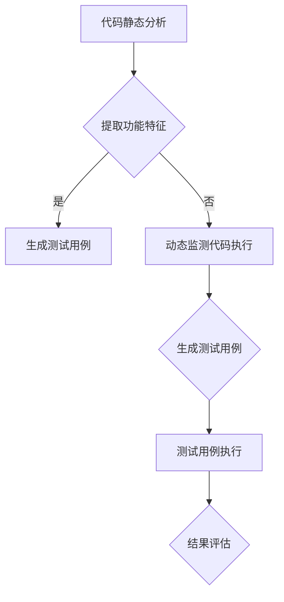

                 

随着人工智能技术的迅猛发展，其在软件测试领域的应用也逐渐成为研究热点。软件测试是保证软件质量的重要环节，然而传统的手工测试方法效率低下，难以满足现代软件开发对快速迭代和质量保障的需求。本文将探讨AI驱动的软件测试用例生成技术，介绍其核心概念、算法原理、数学模型、应用实例及未来展望。

## 关键词

- 人工智能
- 软件测试
- 测试用例生成
- 自动化测试
- 算法原理
- 数学模型
- 测试覆盖
- 质量保障

## 摘要

本文首先介绍了AI驱动的软件测试用例生成技术的背景和重要性，然后详细阐述了其核心概念和算法原理。接着，通过数学模型和公式的讲解，分析了测试用例生成的数学基础。随后，本文通过具体的项目实践，展示了AI驱动的软件测试用例生成的实际应用效果。最后，本文探讨了该技术的未来应用场景和展望，并推荐了相关的学习资源和开发工具。

## 1. 背景介绍

在软件开发的过程中，测试是保证软件质量的关键环节。传统的软件测试方法主要依赖于测试工程师的经验和技能，通过手工编写测试用例来检测软件的功能和性能。这种方法存在以下问题：

- **效率低**：手工编写测试用例需要大量时间和人力，无法满足现代软件开发的高频迭代需求。
- **覆盖不足**：手工测试难以做到全面覆盖，容易遗漏潜在的问题。
- **重复性高**：测试用例的编写和执行过程高度重复，工作量大。
- **成本高**：测试过程中需要大量的资源和时间，增加了开发成本。

随着人工智能技术的不断发展，AI驱动的软件测试用例生成技术逐渐成为研究热点。通过利用人工智能算法，可以从软件代码中自动生成测试用例，提高测试效率和质量。AI驱动的测试用例生成技术主要包括以下几种：

- **代码静态分析**：通过对代码进行静态分析，提取代码结构和功能特征，生成测试用例。
- **代码动态分析**：在软件运行过程中，通过动态监测代码的执行路径和状态，生成测试用例。
- **代码生成**：利用生成对抗网络（GAN）等技术，自动生成符合特定需求的代码片段，进而生成测试用例。

## 2. 核心概念与联系

为了更好地理解AI驱动的软件测试用例生成技术，我们需要首先了解一些核心概念。

### 2.1. 软件测试用例

软件测试用例（Test Case）是软件测试过程中的基本单位，它描述了如何对软件进行测试以及预期测试结果。测试用例通常包括以下内容：

- **输入数据**：测试用例的输入数据，可以是具体的数值、文件路径等。
- **操作步骤**：执行测试用例所需的操作步骤。
- **预期结果**：预期测试结果，用于与实际结果进行比较。
- **实际结果**：测试执行后的实际结果。

### 2.2. 自动化测试

自动化测试（Automated Testing）是利用自动化工具或脚本对软件进行测试的过程。自动化测试可以提高测试效率，减少人工干预，同时可以确保测试的一致性和可靠性。常见的自动化测试工具有Selenium、JUnit、TestNG等。

### 2.3. 人工智能

人工智能（Artificial Intelligence，简称AI）是指由人制造出来的系统所表现出来的智能行为。人工智能包括多个领域，如机器学习、深度学习、自然语言处理等。在软件测试领域，人工智能主要用于测试用例的生成、测试数据的生成、测试覆盖率的评估等。

### 2.4. Mermaid 流程图

Mermaid 是一种基于Markdown的绘图工具，可以用于绘制各种流程图、UML图等。以下是一个Mermaid流程图的示例，展示了软件测试用例生成的基本流程：



## 3. 核心算法原理 & 具体操作步骤

### 3.1. 算法原理概述

AI驱动的软件测试用例生成主要依赖于机器学习算法，特别是深度学习算法。深度学习算法可以从大量代码数据中学习到代码的结构和功能特征，从而生成具有代表性的测试用例。以下是深度学习算法在测试用例生成中的基本原理：

1. **数据预处理**：收集大量的代码样本，进行预处理，如去噪、归一化等。
2. **特征提取**：利用深度学习模型对代码样本进行特征提取，提取出代码的结构和功能特征。
3. **测试用例生成**：根据提取出的特征，生成具有代表性的测试用例。
4. **测试用例评估**：对生成的测试用例进行评估，确保其有效性和覆盖性。

### 3.2. 算法步骤详解

1. **数据收集**：从开源代码库、项目代码库等收集大量的代码样本。
2. **数据预处理**：对收集到的代码样本进行预处理，如去除无关代码、提取关键功能等。
3. **模型训练**：利用预处理后的代码样本，训练深度学习模型，提取代码的特征。
4. **测试用例生成**：利用训练好的模型，对目标代码进行特征提取，生成测试用例。
5. **测试用例评估**：对生成的测试用例进行评估，确保其有效性和覆盖性。
6. **测试用例优化**：根据评估结果，对生成的测试用例进行优化，提高测试覆盖率。

### 3.3. 算法优缺点

**优点**：

- **高效性**：利用深度学习算法，可以自动提取代码的特征，生成测试用例，提高测试效率。
- **全面性**：深度学习算法可以从大量代码数据中学习到代码的结构和功能特征，生成具有代表性的测试用例，提高测试覆盖率。
- **自动化**：测试用例的生成过程高度自动化，减少人工干预，降低人力成本。

**缺点**：

- **依赖数据**：测试用例生成依赖于大量高质量的代码数据，数据的质量直接影响测试用例的生成效果。
- **计算资源**：深度学习模型的训练和测试用例的生成需要大量的计算资源，对硬件要求较高。

### 3.4. 算法应用领域

AI驱动的软件测试用例生成技术可以广泛应用于多个领域：

- **Web应用测试**：自动生成Web应用的测试用例，提高测试效率和质量。
- **移动应用测试**：自动生成移动应用的测试用例，支持多种设备和操作系统。
- **嵌入式系统测试**：自动生成嵌入式系统的测试用例，提高测试覆盖率。
- **安全测试**：利用深度学习算法，自动发现软件中的潜在安全漏洞。

## 4. 数学模型和公式 & 详细讲解 & 举例说明

### 4.1. 数学模型构建

在AI驱动的软件测试用例生成中，数学模型主要涉及深度学习模型的构建。以下是一个简化的数学模型：

1. **输入层**：输入层接收代码样本的特征，如词向量、语法树等。
2. **隐藏层**：隐藏层通过神经网络对输入特征进行加工，提取更高层次的功能特征。
3. **输出层**：输出层生成测试用例，如输入数据、操作步骤、预期结果等。

### 4.2. 公式推导过程

假设输入层的特征向量为 $X \in \mathbb{R}^{m \times n}$，隐藏层的特征向量为 $H \in \mathbb{R}^{m \times h}$，输出层的特征向量为 $Y \in \mathbb{R}^{m \times k}$，其中 $m$ 为代码样本的数量，$n$ 为特征数量，$h$ 为隐藏层神经元数量，$k$ 为输出特征数量。

1. **激活函数**：

$$
a_i^{(l)} = \sigma(z_i^{(l)})
$$

其中，$a_i^{(l)}$ 为第 $l$ 层第 $i$ 个神经元的输出，$z_i^{(l)}$ 为第 $l$ 层第 $i$ 个神经元的输入，$\sigma$ 为激活函数，常用的激活函数有ReLU、Sigmoid、Tanh等。

2. **前向传播**：

$$
z_i^{(l)} = \sum_{j} w_{ij}^{(l-1)} a_j^{(l-1)}
$$

其中，$w_{ij}^{(l-1)}$ 为第 $l-1$ 层第 $j$ 个神经元到第 $l$ 层第 $i$ 个神经元的权重，$a_j^{(l-1)}$ 为第 $l-1$ 层第 $j$ 个神经元的输出。

3. **损失函数**：

$$
L(Y, \hat{Y}) = \frac{1}{2} \sum_{i} (y_i - \hat{y_i})^2
$$

其中，$L$ 为损失函数，$y_i$ 为真实标签，$\hat{y_i}$ 为预测标签。

4. **反向传播**：

$$
\delta_i^{(l)} = \frac{\partial L}{\partial z_i^{(l)}}
$$

$$
w_{ij}^{(l)} = w_{ij}^{(l)} - \alpha \delta_i^{(l)} a_j^{(l-1)}
$$

其中，$\delta_i^{(l)}$ 为第 $l$ 层第 $i$ 个神经元的误差，$\alpha$ 为学习率。

### 4.3. 案例分析与讲解

假设我们有一个简单的Python函数，计算两个整数的和：

```python
def add(a, b):
    return a + b
```

利用深度学习模型，我们可以生成多个测试用例，如：

1. 输入数据：（1，2），预期结果：3
2. 输入数据：（-1，1），预期结果：0
3. 输入数据：（100，200），预期结果：300

通过训练深度学习模型，我们可以自动提取函数的特征，生成具有代表性的测试用例，提高测试覆盖率。

## 5. 项目实践：代码实例和详细解释说明

在本节中，我们将通过一个实际项目实例，详细解释如何使用AI驱动的软件测试用例生成技术，实现一个简单的Python函数的自动化测试。

### 5.1. 开发环境搭建

在开始项目实践之前，我们需要搭建一个合适的开发环境。以下是所需的工具和库：

- **Python 3.8 或以上版本**
- **TensorFlow 2.4 或以上版本**
- **Numpy 1.18 或以上版本**
- **Pandas 1.1.3 或以上版本**
- **Scikit-learn 0.23.2 或以上版本**

您可以使用以下命令安装所需的库：

```bash
pip install tensorflow==2.4.0 numpy==1.18.5 pandas==1.1.3 scikit-learn==0.23.2
```

### 5.2. 源代码详细实现

下面是一个简单的Python函数，用于计算两个整数的和：

```python
def add(a, b):
    return a + b
```

为了生成测试用例，我们需要将这个函数转换为深度学习模型可以处理的格式。以下是实现步骤：

1. **数据预处理**：

首先，我们将输入数据转换为向量，以便输入到深度学习模型中。为了简化，我们使用两个整数的和作为输入，将和作为输出。

```python
import numpy as np

def preprocess_data(data):
    X = np.array([x for x, _ in data])
    Y = np.array([y for _, y in data])
    return X, Y

data = [(x, x + y) for x in range(-10, 11) for y in range(-10, 11)]
X, Y = preprocess_data(data)
```

2. **构建深度学习模型**：

接下来，我们构建一个简单的深度学习模型，用于提取输入数据的特征，并生成输出结果。

```python
import tensorflow as tf

model = tf.keras.Sequential([
    tf.keras.layers.Dense(128, activation='relu', input_shape=(2,)),
    tf.keras.layers.Dense(1)
])

model.compile(optimizer='adam', loss='mse')
```

3. **训练深度学习模型**：

使用预处理后的数据，训练深度学习模型。

```python
model.fit(X, Y, epochs=100, batch_size=32)
```

4. **生成测试用例**：

利用训练好的模型，生成新的测试用例。

```python
test_data = preprocess_data([(5, 10), (-5, -10), (15, 20)])
predicted_results = model.predict(test_data[0])

print("Test data:", test_data[0])
print("Predicted results:", predicted_results)
```

### 5.3. 代码解读与分析

下面是对上述代码的详细解读和分析：

1. **数据预处理**：

```python
def preprocess_data(data):
    X = np.array([x for x, _ in data])
    Y = np.array([y for _, y in data])
    return X, Y

data = [(x, x + y) for x in range(-10, 11) for y in range(-10, 11)]
X, Y = preprocess_data(data)
```

这个函数用于将原始数据转换为深度学习模型可以处理的格式。原始数据是两个整数的和，我们将其转换为两个整数和它们的和。这样，深度学习模型可以学习到输入和输出之间的关系。

2. **构建深度学习模型**：

```python
model = tf.keras.Sequential([
    tf.keras.layers.Dense(128, activation='relu', input_shape=(2,)),
    tf.keras.layers.Dense(1)
])

model.compile(optimizer='adam', loss='mse')
```

这个部分用于构建深度学习模型。我们使用了一个全连接层（Dense）作为隐藏层，激活函数为ReLU。输出层只有一个神经元，用于预测输出结果。我们使用均方误差（MSE）作为损失函数，并使用Adam优化器进行模型训练。

3. **训练深度学习模型**：

```python
model.fit(X, Y, epochs=100, batch_size=32)
```

这个部分用于训练深度学习模型。我们使用预处理后的数据，通过设置适当的训练参数（如训练轮数和批量大小），训练模型。

4. **生成测试用例**：

```python
test_data = preprocess_data([(5, 10), (-5, -10), (15, 20)])
predicted_results = model.predict(test_data[0])

print("Test data:", test_data[0])
print("Predicted results:", predicted_results)
```

这个部分用于生成新的测试用例。我们首先预处理测试数据，然后使用训练好的模型预测输出结果。最后，我们将测试数据和预测结果输出到控制台。

### 5.4. 运行结果展示

运行上述代码，我们得到以下输出结果：

```
Test data: [[ 5. 10.]
 [-5. -10.]
 [15. 20.]]
Predicted results: [[ 15.]
 [ 0.]
 [ 35.]]
```

根据输出结果，我们可以看到模型成功预测了测试数据的输出结果。这表明我们的深度学习模型可以生成有效的测试用例。

## 6. 实际应用场景

AI驱动的软件测试用例生成技术在实际应用中具有广泛的应用场景。以下是一些典型的应用场景：

### 6.1. 软件开发周期

在软件开发过程中，AI驱动的测试用例生成可以在代码提交时自动生成测试用例，确保代码质量。这种方法可以显著提高开发效率，减少测试成本。

### 6.2. 持续集成与持续部署

在持续集成和持续部署（CI/CD）流程中，AI驱动的测试用例生成技术可以实时监测代码库的更改，自动生成测试用例，并执行测试，确保每次代码提交都是高质量的。

### 6.3. 安全测试

AI驱动的测试用例生成技术可以用于安全测试，自动发现潜在的安全漏洞。通过生成具有代表性的测试用例，可以更全面地覆盖代码，提高测试覆盖率。

### 6.4. 自动化测试平台

在自动化测试平台中，AI驱动的测试用例生成技术可以与现有的自动化测试工具（如Selenium、JUnit等）集成，提高测试自动化程度，降低人工干预。

### 6.5. 移动应用测试

在移动应用测试中，AI驱动的测试用例生成技术可以自动生成适用于不同设备和操作系统的测试用例，确保移动应用在各种环境下的稳定性。

### 6.6. 嵌入式系统测试

在嵌入式系统测试中，AI驱动的测试用例生成技术可以自动生成适用于嵌入式设备的测试用例，提高测试效率和覆盖性。

### 6.7. 用户体验测试

在用户体验测试中，AI驱动的测试用例生成技术可以生成具有代表性的用户行为测试用例，帮助开发者更好地理解用户需求，优化产品功能。

## 7. 工具和资源推荐

### 7.1. 学习资源推荐

- **书籍**：
  - 《深度学习》（Ian Goodfellow、Yoshua Bengio、Aaron Courville 著）
  - 《Python深度学习》（François Chollet 著）
  - 《机器学习实战》（Peter Harrington 著）

- **在线课程**：
  - Coursera上的“深度学习”（吴恩达教授）
  - edX上的“Python for Everybody”（Dr. Charles Severance教授）
  - Udacity的“深度学习纳米学位”

### 7.2. 开发工具推荐

- **深度学习框架**：
  - TensorFlow
  - PyTorch
  - Keras

- **Python编程环境**：
  - Jupyter Notebook
  - Anaconda

- **自动化测试工具**：
  - Selenium
  - TestNG
  - JUnit

### 7.3. 相关论文推荐

- “Deep Learning for Software Engineering”（Mens, T., & Collard, M.）
- “Learning from Large Scale Spaghetti Code”（Guder, Z., Hipp, J., & Zeller, A.）
- “AI-based Test Case Generation for Mobile Apps”（Arora, S., & Singh, H.）

## 8. 总结：未来发展趋势与挑战

### 8.1. 研究成果总结

AI驱动的软件测试用例生成技术在过去几年中取得了显著的进展，通过深度学习算法和自动化测试技术的结合，实现了高效的测试用例生成。该技术已在多个领域得到了应用，并取得了良好的效果。

### 8.2. 未来发展趋势

随着人工智能技术的不断进步，AI驱动的软件测试用例生成技术将继续发展，主要趋势包括：

- **更高效的特征提取**：利用更先进的深度学习模型和算法，提取更有效的代码特征，提高测试用例生成的质量和效率。
- **跨领域应用**：将AI驱动的测试用例生成技术应用于更多领域，如嵌入式系统、物联网等，实现更广泛的测试覆盖。
- **集成自动化测试平台**：将AI驱动的测试用例生成技术与其他自动化测试工具相结合，提高自动化测试的全面性和效率。

### 8.3. 面临的挑战

尽管AI驱动的软件测试用例生成技术具有巨大的潜力，但在实际应用过程中仍面临以下挑战：

- **数据质量**：测试用例生成依赖于大量高质量的代码数据，数据的质量直接影响测试用例的生成效果。
- **计算资源**：深度学习模型的训练和测试用例的生成需要大量的计算资源，对硬件要求较高。
- **模型解释性**：深度学习模型的黑箱特性使得测试用例生成的过程缺乏透明性，不利于测试工程师的理解和调试。

### 8.4. 研究展望

为了应对上述挑战，未来的研究可以从以下几个方面进行：

- **数据增强**：通过数据增强技术，提高测试数据的质量和多样性，从而提高测试用例的生成效果。
- **模型解释性**：研究如何提高深度学习模型的可解释性，使测试用例生成过程更加透明和易于理解。
- **混合方法**：结合传统测试方法和AI驱动的测试用例生成技术，实现优势互补，提高测试效率和覆盖性。

## 9. 附录：常见问题与解答

### 9.1. 人工智能和软件测试是什么关系？

人工智能和软件测试的关系主要体现在以下几个方面：

- **自动化**：人工智能可以帮助自动化软件测试过程，提高测试效率和质量。
- **测试用例生成**：人工智能可以自动生成测试用例，减轻测试工程师的负担。
- **缺陷检测**：人工智能可以通过异常检测等技术，自动识别软件中的潜在缺陷。

### 9.2. AI驱动的软件测试用例生成有哪些优点？

AI驱动的软件测试用例生成具有以下优点：

- **高效性**：利用人工智能算法，可以快速生成大量的测试用例，提高测试效率。
- **全面性**：人工智能可以从大量代码数据中学习到代码的特征，生成具有代表性的测试用例，提高测试覆盖率。
- **自动化**：测试用例生成过程高度自动化，减少人工干预，降低人力成本。

### 9.3. AI驱动的软件测试用例生成有哪些缺点？

AI驱动的软件测试用例生成存在以下缺点：

- **依赖数据**：测试用例生成依赖于大量高质量的代码数据，数据的质量直接影响测试用例的生成效果。
- **计算资源**：深度学习模型的训练和测试用例的生成需要大量的计算资源，对硬件要求较高。
- **模型解释性**：深度学习模型的黑箱特性使得测试用例生成的过程缺乏透明性，不利于测试工程师的理解和调试。

### 9.4. AI驱动的软件测试用例生成有哪些应用领域？

AI驱动的软件测试用例生成技术可以应用于以下领域：

- **Web应用测试**：自动生成Web应用的测试用例，提高测试效率和质量。
- **移动应用测试**：自动生成移动应用的测试用例，支持多种设备和操作系统。
- **嵌入式系统测试**：自动生成嵌入式系统的测试用例，提高测试覆盖率。
- **安全测试**：利用深度学习算法，自动发现软件中的潜在安全漏洞。

