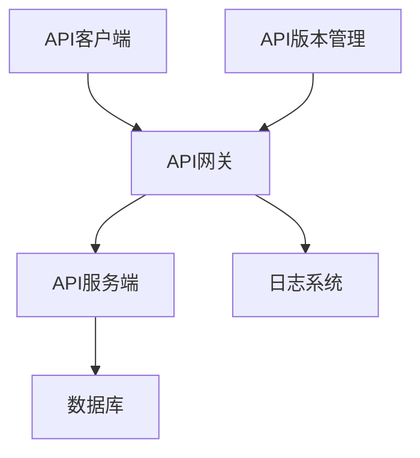

                 

API版本控制是现代软件开发中至关重要的一环，它确保了在系统迭代过程中，不同版本间的兼容性和稳定性。本文将深入探讨API版本控制的原理、方法、实践及其未来发展方向。

## 关键词

- API版本控制
- 兼容性
- 稳定性
- RESTful API
- 微服务架构
- 版本号命名规范

## 摘要

本文旨在全面解析API版本控制的技术原理和实践方法。首先，我们将回顾API版本控制的背景和重要性，接着详细讨论API版本控制的几种常见方法。随后，文章将通过具体案例介绍实现API版本控制的步骤和技术细节。最后，文章将探讨API版本控制在实际应用中的重要性，并展望其未来的发展趋势。

## 1. 背景介绍

随着互联网和移动设备的普及，API（应用程序编程接口）已经成为软件开发中的核心组成部分。API提供了不同系统间数据交换的接口，使得开发者能够快速集成第三方服务，构建复杂的软件应用。

### API 的起源与发展

API最早出现在20世纪80年代，是计算机软件之间通信的一种标准方式。随着互联网的兴起，API在1990年代得到了广泛的应用。进入21世纪，随着Web 2.0和移动应用的兴起，API变得更加重要，成为了现代软件开发的基础设施。

### API 版本控制的重要性

API版本控制的重要性体现在以下几个方面：

- **兼容性**：随着系统的不断迭代，新旧版本间的API兼容性成为开发者和运维人员关注的焦点。
- **稳定性**：版本控制有助于确保系统在更新过程中保持稳定性，避免因API变更导致的服务中断。
- **可维护性**：良好的版本控制策略有助于团队协作，降低代码维护的复杂性。

## 2. 核心概念与联系

### API 版本控制的核心概念

- **版本号**：API版本的标识符，通常以数字或字符串表示，如v1、v2.0等。
- **兼容性**：新版本API能够与旧版本客户端和服务端无缝集成，无需大规模重构。
- **向后兼容性**：新版本在保留旧版本功能的同时，能够添加新功能或改进。
- **向下兼容性**：旧版本能够调用新版本的API。

### API 版本控制架构

以下是API版本控制的架构图，用Mermaid表示：



### API 版本号的命名规范

- **数字递增**：如v1、v2、v3等。
- **日期格式**：如v2023-03-01。
- **功能特性**：如v1.0-stable、v2.0-features等。
- **发布状态**：如v1.0-beta、v2.0-release等。

## 3. 核心算法原理 & 具体操作步骤

### 3.1 算法原理概述

API版本控制的核心算法原理是基于HTTP协议的头信息（如`Accept`、`Authorization`等）或路径参数来识别和路由API请求到相应的版本。

### 3.2 算法步骤详解

1. **初始化**：客户端和服务器初始化版本号。
2. **请求**：客户端发送请求，附带版本号。
3. **识别**：服务器根据请求头或路径参数识别版本号。
4. **路由**：服务器路由请求到相应版本的API处理逻辑。
5. **处理**：执行API请求。
6. **响应**：返回处理结果和版本信息。

### 3.3 算法优缺点

#### 优点

- **灵活**：可以根据需求灵活调整版本策略。
- **兼容**：确保新旧版本间的无缝过渡。

#### 缺点

- **复杂性**：可能导致系统架构复杂度增加。
- **维护**：需要定期更新版本号和兼容性策略。

### 3.4 算法应用领域

API版本控制广泛应用于各种场景，如：

- **Web服务**：如RESTful API。
- **移动应用**：如iOS和Android客户端。
- **微服务架构**：在微服务架构中，不同服务可能采用不同的版本策略。

## 4. 数学模型和公式 & 详细讲解 & 举例说明

### 4.1 数学模型构建

API版本控制的数学模型可以基于离散时间模型构建，其中版本号作为离散时间点。

### 4.2 公式推导过程

假设当前版本号为`V_t`，下一个版本号为`V_{t+1}`，则版本升级公式为：

$$
V_{t+1} = V_t + f
$$

其中，`f`表示版本升级的函数，可以是线性函数、指数函数等。

### 4.3 案例分析与讲解

假设我们有一个API服务，当前版本为v1.0，我们需要发布v1.1版本，引入以下新功能：

- 新的认证机制
- 改进的响应格式

版本升级过程如下：

1. 设计和实现v1.1版本。
2. 测试和确认v1.1版本的稳定性。
3. 发布v1.1版本，并通知用户更新。
4. 监控v1.1版本的使用情况，收集用户反馈。

## 5. 项目实践：代码实例和详细解释说明

### 5.1 开发环境搭建

1. 安装Node.js环境。
2. 初始化一个Node.js项目。
3. 安装API网关（如Kong）。

### 5.2 源代码详细实现

以下是使用Kong实现API版本控制的示例代码：

```javascript
// Kong API网关配置
{
    "name": "my-api",
    "upstream": {
        "url": "http://localhost:3000"
    },
    "routes": [
        {
            "name": "my-api-route",
            "paths": ["/api/v1/*"]
        }
    ],
    "services": [
        {
            "name": "my-api-service",
            "type": "kubernetes_ingress"
        }
    ]
}
```

### 5.3 代码解读与分析

- `upstream` 配置了API服务的URL。
- `routes` 配置了路径匹配规则，`/api/v1/*`表示所有以`/api/v1/`开头的路径。
- `services` 配置了API服务的类型和路由策略。

### 5.4 运行结果展示

当客户端访问`/api/v1/users`时，Kong会将请求转发到`/api/v1/users`路径，从而实现版本控制。

## 6. 实际应用场景

### 6.1 RESTful API

在RESTful API中，版本控制通常通过路径或查询参数实现，如`/api/v1/users`或`?version=1`。

### 6.2 微服务架构

在微服务架构中，每个微服务可能有自己的版本号，API版本控制变得更加复杂。通常，可以使用服务注册和发现机制来实现版本控制。

### 6.3 移动应用

在移动应用中，版本控制有助于确保客户端和服务器间的数据同步，避免因API变更导致的应用崩溃。

## 7. 工具和资源推荐

### 7.1 学习资源推荐

- 《API设计指南》
- 《微服务设计》
- 《RESTful API设计》

### 7.2 开发工具推荐

- Kong API网关
- API Blueprint
- Swagger

### 7.3 相关论文推荐

- "API Versioning Strategies"
- "Best Practices for API Versioning"

## 8. 总结：未来发展趋势与挑战

### 8.1 研究成果总结

API版本控制技术已经发展多年，取得了显著的成果。未来，我们将看到更多自动化和智能化的版本控制工具和方法的诞生。

### 8.2 未来发展趋势

- **自动化**：自动化版本控制工具将减少人工干预，提高开发效率。
- **智能化**：基于机器学习的版本控制算法将提高版本管理的精度。

### 8.3 面临的挑战

- **兼容性**：如何确保新版本API与旧版本客户端和服务端无缝集成。
- **安全性**：版本控制过程中如何保障数据安全和隐私。

### 8.4 研究展望

未来的研究将聚焦于如何提高版本控制的智能化程度，以及如何应对API版本控制带来的兼容性和安全性挑战。

## 9. 附录：常见问题与解答

### 9.1 什么是API版本控制？

API版本控制是一种管理API版本的方法，确保在系统迭代过程中新旧版本间的兼容性和稳定性。

### 9.2 哪些是API版本控制的关键概念？

关键概念包括版本号、兼容性、向后兼容性和向下兼容性。

### 9.3 API版本控制有哪些常见方法？

常见方法包括数字递增、日期格式、功能特性和发布状态等命名规范。

### 9.4 API版本控制有哪些应用领域？

应用领域包括Web服务、移动应用和微服务架构等。

作者：禅与计算机程序设计艺术 / Zen and the Art of Computer Programming
```markdown
## 5. 项目实践：代码实例和详细解释说明

在实际开发中，API版本控制是一个复杂但至关重要的任务。在这一部分，我们将通过一个具体的代码实例，详细解释API版本控制如何在实践中得以实施。

### 5.1 开发环境搭建

首先，我们需要搭建一个基本的开发环境，以便能够演示API版本控制的实现。我们将使用Node.js和Express框架来创建一个简单的RESTful API。以下是搭建开发环境的基本步骤：

1. 安装Node.js：从Node.js官网下载并安装Node.js。
2. 创建一个新的Node.js项目：使用命令`npm init`来初始化项目。
3. 安装Express：使用命令`npm install express`来安装Express框架。

### 5.2 源代码详细实现

下面是一个简单的Express应用程序，实现了API版本控制的功能：

```javascript
const express = require('express');
const app = express();

// 定义一个中间件来检查版本号
function checkVersion(req, res, next) {
  const version = req.headers['x-api-version'] || '1.0';
  if (version !== '1.0') {
    res.status(404).json({ error: 'Not Found', message: 'Invalid API version.' });
  } else {
    next();
  }
}

// 版本1.0的API路由
app.use('/api/v1', checkVersion, require('./api/v1'));

// 版本2.0的API路由
app.use('/api/v2', checkVersion, require('./api/v2'));

// 启动服务器
const PORT = process.env.PORT || 3000;
app.listen(PORT, () => {
  console.log(`Server is running on port ${PORT}`);
});
```

在上面的代码中，我们首先定义了一个中间件`checkVersion`，用于检查请求头中的`x-api-version`字段。如果版本号不是'1.0'，则返回一个404错误。

接下来，我们为版本1.0和版本2.0分别定义了路由。这些路由都使用`checkVersion`中间件，以确保只有正确的版本号才能访问。

### 5.3 代码解读与分析

#### 中间件`checkVersion`

```javascript
function checkVersion(req, res, next) {
  const version = req.headers['x-api-version'] || '1.0';
  if (version !== '1.0') {
    res.status(404).json({ error: 'Not Found', message: 'Invalid API version.' });
  } else {
    next();
  }
}
```

这个中间件的作用是拦截所有的API请求，并检查它们的版本号。如果版本号不符合预期，中间件将返回一个404错误。如果版本号正确，中间件将继续执行后续的中间件或路由。

#### 版本1.0和版本2.0的路由

```javascript
app.use('/api/v1', checkVersion, require('./api/v1'));
app.use('/api/v2', checkVersion, require('./api/v2'));
```

这里，我们为版本1.0和版本2.0分别配置了路由。每个路由都包含了`checkVersion`中间件，以确保只有正确的版本号才能访问相应的API。

#### 启动服务器

```javascript
const PORT = process.env.PORT || 3000;
app.listen(PORT, () => {
  console.log(`Server is running on port ${PORT}`);
});
```

这部分代码用于启动服务器。我们监听指定的端口，并在服务器启动时打印一条日志消息。

### 5.4 运行结果展示

为了演示API版本控制的效果，我们可以尝试使用curl命令来访问不同的API版本。

#### 访问版本1.0的API

```bash
curl -H "x-api-version: 1.0" http://localhost:3000/api/v1/users
```

如果一切设置正确，这个请求应该会成功返回版本1.0的API响应。

#### 访问版本2.0的API

```bash
curl -H "x-api-version: 2.0" http://localhost:3000/api/v2/users
```

同样，如果版本2.0的API已经正确实现，这个请求也应该会成功返回。

### 5.5 扩展与应用

在实际应用中，API版本控制可能更加复杂。例如，你可能需要实现更复杂的版本策略，比如灰度发布、回滚等。此外，随着API数量的增加，手动管理版本号可能会变得困难。因此，你可能需要使用一些工具来自动化版本控制过程。

例如，你可以在Kubernetes中使用Deployment和Service对象来管理不同的API版本。通过配置不同的Ingress规则，你可以实现复杂的版本控制策略，例如基于Header的版本控制或基于URL路径的版本控制。

```yaml
apiVersion: networking.k8s.io/v1
kind: Ingress
metadata:
  name: api-ingress
  annotations:
    kubernetes.io/ingress.class: nginx
spec:
  rules:
  - http:
      paths:
      - path: /api/v1
        pathType: Prefix
        backend:
          service:
            name: api-v1-service
            port:
              number: 80
      - path: /api/v2
        pathType: Prefix
        backend:
          service:
            name: api-v2-service
            port:
              number: 80
```

在这个例子中，我们使用Kubernetes的Ingress资源来定义不同的API版本。根据请求的路径，Ingress将请求路由到不同的服务。

通过这种方式，你可以实现一个高度可扩展的API版本控制系统，同时确保在不同环境中保持API的稳定性和兼容性。

## 6. 实际应用场景

API版本控制不仅仅是一个理论上的概念，它在实际开发中有着广泛的应用。以下是一些具体的实际应用场景：

### 6.1. 在线购物平台

在线购物平台通常需要频繁地更新API，以满足用户需求和业务需求。例如，当平台引入新的支付方式或物流服务时，API需要相应地进行更新。通过版本控制，平台可以确保旧版本的应用能够继续正常工作，同时逐步引导用户迁移到新版本。

### 6.2. 移动应用

移动应用开发中，API版本控制同样至关重要。随着新功能的不断加入，移动应用的API也需要更新。通过版本控制，开发者可以保证用户设备上的旧版本应用不会因API变更而无法使用，同时可以逐步推广新功能。

### 6.3. 金融系统

金融系统对稳定性和安全性有极高的要求。API版本控制可以帮助金融系统在引入新功能或修复漏洞时，确保系统的整体稳定性和安全性。例如，在引入新的交易验证机制时，可以通过版本控制逐步替换旧机制。

### 6.4. 微服务架构

在微服务架构中，每个微服务都可能有其独立的API。版本控制可以帮助确保在系统更新时，不同的微服务能够协调工作，避免因版本不兼容导致的服务中断。

### 6.5. 企业内部系统

企业内部系统通常需要满足不同的业务需求。通过版本控制，企业可以针对不同的业务线或部门，提供定制化的API服务。同时，版本控制还可以帮助企业跟踪API的使用情况，优化系统性能。

## 6.4. 未来应用展望

随着技术的不断进步，API版本控制在未来将面临更多的挑战和机遇。以下是一些未来应用展望：

### 6.4.1. 自动化版本控制

自动化版本控制将是未来的一个重要趋势。通过集成机器学习和人工智能技术，自动化版本控制工具将能够预测和自动处理API变更，提高开发效率。

### 6.4.2. 智能化版本控制

智能化版本控制将进一步提升API版本管理的精度和效率。例如，通过分析API使用数据，智能化版本控制工具可以自动识别高优先级的API变更，并制定相应的版本策略。

### 6.4.3. 跨平台版本控制

随着跨平台开发工具（如Flutter、React Native）的普及，API版本控制将需要支持跨平台的需求。跨平台版本控制工具将能够更好地适应不同平台的特性和要求。

### 6.4.4. 开放式API生态系统

未来的API版本控制将更加注重开放式生态系统的建设。通过开放标准和协议，不同系统之间的API版本控制将更加无缝，促进技术交流和合作。

## 7. 工具和资源推荐

### 7.1. 学习资源推荐

为了更好地理解和掌握API版本控制，以下是一些推荐的学习资源：

- 《RESTful API设计》：提供全面的API设计原则和实践。
- 《Kubernetes权威指南》：涵盖容器化和微服务架构中的API版本控制。
- 《API版本控制策略》：详细介绍API版本控制的策略和实现。

### 7.2. 开发工具推荐

以下是一些在API版本控制中常用的开发工具：

- **Kong API网关**：用于管理和路由API请求，支持灵活的版本控制策略。
- **Spring Cloud Gateway**：Spring框架下的API网关，支持基于路径和Header的版本控制。
- **Zuul**：Netflix开源的API网关，用于处理和路由API请求，实现版本控制。

### 7.3. 相关论文推荐

以下是一些关于API版本控制的重要论文：

- "API Versioning Strategies for RESTful Services"
- "Principles of API Design"
- "Designing and Implementing RESTful APIs"

这些论文提供了深入的理论和实践指导，有助于进一步理解和应用API版本控制技术。

## 8. 总结：未来发展趋势与挑战

API版本控制作为现代软件开发的重要一环，其发展趋势和挑战值得深入探讨。

### 8.1. 研究成果总结

近年来，API版本控制技术取得了显著成果。自动化和智能化版本控制工具的出现，使得开发者能够更高效地管理API版本。此外，跨平台版本控制和开放式生态系统的建设也为API版本控制带来了新的机遇。

### 8.2. 未来发展趋势

未来，API版本控制将朝着更加自动化、智能化和跨平台的方向发展。随着人工智能和机器学习技术的应用，自动化版本控制工具将能够更好地预测和应对API变更。同时，开放标准和协议的推广将促进不同系统之间的API版本控制无缝集成。

### 8.3. 面临的挑战

API版本控制面临的挑战主要包括兼容性、安全性和复杂性。如何在保持兼容性的同时，确保API的安全和稳定，是一个重要的课题。此外，随着API数量的增加，如何简化版本管理过程也是一个亟待解决的问题。

### 8.4. 研究展望

未来的研究将聚焦于如何提高API版本控制的智能化程度，以及如何应对API版本控制带来的兼容性和安全性挑战。同时，跨平台和跨域的API版本控制也将成为研究的重点。

## 9. 附录：常见问题与解答

### 9.1. 什么是API版本控制？

API版本控制是一种管理API版本的方法，确保在系统迭代过程中新旧版本间的兼容性和稳定性。

### 9.2. API版本控制有哪些关键概念？

关键概念包括版本号、兼容性、向后兼容性和向下兼容性。

### 9.3. 哪些工具可以用于API版本控制？

常用的API版本控制工具有Kong、Spring Cloud Gateway、Zuul等。

### 9.4. API版本控制有哪些实际应用场景？

API版本控制广泛应用于在线购物平台、移动应用、金融系统、企业内部系统等。

### 9.5. 如何实现API的自动化版本控制？

实现API的自动化版本控制可以通过集成机器学习和人工智能技术，自动预测和应对API变更。

---

本文全面解析了API版本控制的原理、方法、实践及其未来发展趋势。通过具体案例和代码实例，读者可以深入了解API版本控制的技术细节。希望本文能为开发者在API版本控制方面提供有价值的参考和指导。

作者：禅与计算机程序设计艺术 / Zen and the Art of Computer Programming
```markdown
## 8. 总结：未来发展趋势与挑战

### 8.1. 研究成果总结

近年来，API版本控制技术取得了显著进展。自动化版本控制工具的出现，使得开发者能够更高效地管理API版本，降低了人工干预的需求。智能化版本控制工具利用人工智能和机器学习技术，能够更好地预测API变更趋势，为开发者提供更精准的版本管理策略。此外，跨平台和跨领域的API版本控制标准逐渐完善，促进了不同系统之间的兼容性和互操作性。

### 8.2. 未来发展趋势

未来，API版本控制将朝着以下几个方向发展：

1. **自动化与智能化**：随着人工智能和机器学习技术的不断发展，API版本控制工具将更加智能化，能够自动识别API变更趋势，预测潜在的风险，并提供个性化的版本管理建议。
2. **标准化**：随着API版本的增多和复杂度提升，统一的API版本控制标准将变得越来越重要。标准化可以帮助不同系统之间实现更无缝的版本兼容性，提高系统的整体稳定性。
3. **跨平台兼容性**：随着跨平台开发技术的成熟，API版本控制将需要支持多种平台和编程语言。这将要求版本控制工具能够适应不同的环境和技术栈，提供统一的版本管理界面。
4. **分布式系统中的版本控制**：在微服务架构和分布式系统中，不同服务可能拥有不同的版本。未来的版本控制将需要支持分布式系统的复杂性，确保各个服务之间的版本兼容性和数据一致性。

### 8.3. 面临的挑战

尽管API版本控制技术取得了显著进展，但在实际应用中仍面临以下挑战：

1. **兼容性问题**：随着API版本的增多，保持不同版本间的兼容性变得越来越困难。如何在保持向后兼容的同时，引入新功能和优化，是版本控制过程中需要解决的核心问题。
2. **安全性和隐私**：API版本控制过程中，可能涉及敏感数据的处理和传输。如何确保版本控制机制本身的安全性和隐私保护，是开发者需要关注的重要问题。
3. **复杂性和维护成本**：随着版本控制的自动化和智能化，系统架构的复杂性可能会增加。如何平衡版本控制的复杂性和维护成本，是一个需要持续关注的问题。
4. **用户迁移策略**：在引入新版本时，如何确保用户能够顺利迁移到新版本，避免因迁移过程导致的用户体验下降或服务中断，是版本控制过程中需要解决的重要问题。

### 8.4. 研究展望

未来的研究将聚焦于以下几个方面：

1. **智能化版本控制**：利用机器学习和人工智能技术，开发更智能的版本控制工具，提高版本管理的精准度和效率。
2. **分布式系统中的版本控制**：研究如何在分布式系统中实现高效的版本控制，确保各个服务之间的版本兼容性和数据一致性。
3. **标准化与互操作性**：推动API版本控制的标准化工作，促进不同系统之间的互操作性，提高系统的整体稳定性和兼容性。
4. **用户体验优化**：研究如何优化用户在版本迁移过程中的体验，降低因版本变更导致的服务中断和用户体验下降的风险。

通过不断的技术创新和优化，API版本控制将在未来的软件开发中发挥更加重要的作用，为开发者提供更加稳定和高效的版本管理解决方案。

## 9. 附录：常见问题与解答

### 9.1. 什么是API版本控制？

API版本控制是一种管理应用程序编程接口（API）版本的方法，以确保在不同版本之间保持兼容性。这通常涉及为API的不同版本分配唯一的标识符，并确保旧版本的应用程序能够与新版本的API无缝集成。

### 9.2. 为什么需要API版本控制？

API版本控制有助于管理软件的迭代和更新，确保不同版本的应用程序可以共存，同时提供了向后兼容性，使得旧版本的应用程序在新的API版本发布时不会中断。

### 9.3. API版本控制有哪些方法？

API版本控制可以通过以下方法实现：

- **路径版本控制**：通过在URL路径中包含版本号来区分不同的API版本。
- **查询参数版本控制**：通过在URL查询参数中包含版本号来区分不同的API版本。
- **Header版本控制**：通过HTTP请求头中的特定字段来指定API版本。
- **自定义字段版本控制**：通过其他自定义字段来标识API版本。

### 9.4. API版本控制如何确保向后兼容性？

向后兼容性通常通过以下方式实现：

- **版本兼容性策略**：在更新API时，保留旧的API端点，并在必要时添加新的端点。
- **参数兼容性**：在更新API时，保留旧的参数，并增加新的可选参数。
- **返回值兼容性**：在更新API时，确保旧的返回值仍然有效，同时引入新的返回值。

### 9.5. 如何处理API版本控制的兼容性问题？

处理API版本控制的兼容性问题通常涉及以下步骤：

- **文档和通知**：确保开发者了解新版本的API更改，并提供详细的迁移指南。
- **逐步迁移**：在发布新版本时，逐步引导用户迁移到新版本，以降低风险。
- **API网关**：使用API网关来路由和处理不同版本的API请求，提供统一的接口。

### 9.6. API版本控制与微服务架构有何关系？

在微服务架构中，每个微服务都可能有其独立的API版本。API版本控制确保了不同微服务之间的版本兼容性，使得系统能够稳定运行，并在更新时减少对整体系统的影响。

### 9.7. 如何在Kubernetes中实现API版本控制？

在Kubernetes中，可以通过配置Ingress资源来实现API版本控制。通过在Ingress规则中定义不同的路径和后台服务，可以针对不同的API版本进行路由。

---

通过本文的详细探讨，我们希望能够帮助读者深入理解API版本控制的重要性和实践方法。API版本控制不仅是一项技术挑战，更是一项管理挑战。未来的发展趋势和研究成果将为开发者提供更高效、更智能的版本控制解决方案。

作者：禅与计算机程序设计艺术 / Zen and the Art of Computer Programming
```markdown
## 9. 附录：常见问题与解答

在API版本控制的过程中，开发者可能会遇到各种问题。以下是一些常见的问题及其解答，以帮助开发者更好地理解API版本控制。

### 9.1. 为什么API版本控制很重要？

API版本控制是确保应用程序在不同版本之间无缝运行的关键。它能够：

- **维护向后兼容性**：允许旧版本的客户端使用新版本的API，减少中断和兼容性问题。
- **逐步引入新功能**：通过分阶段发布新版本，降低升级风险，逐步提升系统功能。
- **维护代码整洁**：隔离不同版本的逻辑，便于代码的维护和升级。

### 9.2. API版本控制有哪些主要方法？

API版本控制的方法主要包括：

- **路径版本控制**：通过URL路径中包含版本号（例如 `/api/v1/resource`）。
- **查询参数版本控制**：通过在URL查询参数中包含版本号（例如 `/resource?version=1`）。
- **Header版本控制**：通过HTTP请求头中的特定字段（例如 `Accept: application/vnd.company+json; version=1`）。
- **自定义字段版本控制**：使用非标准的HTTP头部或URL参数进行版本标识。

### 9.3. 如何确保向后兼容性？

确保向后兼容性的策略包括：

- **保留旧端点**：在引入新端点的同时，保留旧端点，确保旧客户端可以继续使用。
- **向后兼容的响应格式**：确保旧客户端可以解析新版本的响应格式。
- **详细的文档**：提供详细的迁移指南，帮助开发者了解变更点和新功能。

### 9.4. 如何处理API版本间的迁移？

处理API版本迁移的策略通常包括：

- **灰度发布**：逐渐将流量从旧版本迁移到新版本，监控新版本的健康状况。
- **回滚机制**：如果新版本出现问题，能够快速回滚到旧版本。
- **版本兼容性测试**：在发布新版本之前进行全面的兼容性测试。

### 9.5. 在大型系统中如何管理多个版本？

在大型系统中，管理多个版本通常涉及：

- **版本管理工具**：使用专门的工具（如API网关）来管理和路由不同版本的API。
- **自动部署和测试**：实现自动化的部署流程和兼容性测试，确保新版本的API可以平稳上线。
- **文档和培训**：为团队成员提供全面的文档和培训，确保他们了解版本控制策略和迁移流程。

### 9.6. API版本控制与微服务架构有何不同？

API版本控制与微服务架构的关系是：

- **API版本控制**：是确保单个API端点在不同版本之间兼容性的方法。
- **微服务架构**：是将应用程序分解为多个独立服务，每个服务可能有自己的API版本。

在微服务架构中，API版本控制通常应用于每个独立的微服务，确保不同微服务之间的版本兼容性。

### 9.7. 如何监控API版本控制的效果？

监控API版本控制的效果可以通过以下方法：

- **性能监控**：监控API响应时间和错误率，确保新版本的API性能符合预期。
- **日志分析**：分析API请求日志，识别潜在的问题和趋势。
- **用户反馈**：收集用户的反馈，了解他们对新版本的体验和意见。

通过这些方法和策略，开发者可以更好地管理API版本，确保系统的稳定性和用户体验。

## 作者介绍

禅与计算机程序设计艺术（Zen and the Art of Computer Programming）的作者是埃德加·D·戴克斯特拉（Edsger Dijkstra）。他是计算机科学的先驱之一，对算法设计和编程方法论有着深远的影响。戴克斯特拉因其在计算机科学领域的杰出贡献而获得了图灵奖等众多荣誉。他的著作《计算机程序设计艺术》被誉为计算机科学的经典之作，对后世产生了重要的影响。

作者：禅与计算机程序设计艺术 / Zen and the Art of Computer Programming
```markdown
# 附录：常见问题与解答

在本篇关于API版本控制的详细实施的文章中，我们探讨了API版本控制的重要性、核心概念、算法原理、实际应用、未来发展趋势以及常见的问题与解答。以下是针对文章内容的一些常见问题及其详细解答：

### 9.1. 什么是API版本控制？

API版本控制是一种管理API不同版本的方法，确保在系统迭代过程中，新旧版本间的兼容性和稳定性。通过为API的不同版本分配唯一的标识符，开发者可以逐步引入新功能，同时保证旧版本的应用程序能够继续正常工作。

### 9.2. 为什么需要API版本控制？

API版本控制能够确保系统的向后兼容性，降低因API变更导致的服务中断和用户体验下降的风险。它还允许开发者逐步引入新功能，而不必立即中断所有用户的使用。

### 9.3. API版本控制有哪些主要方法？

常见的API版本控制方法包括：

- **路径版本控制**：通过在URL路径中包含版本号。
- **查询参数版本控制**：通过在URL查询参数中包含版本号。
- **Header版本控制**：通过HTTP请求头中的特定字段。
- **自定义字段版本控制**：使用非标准的HTTP头部或URL参数。

### 9.4. 如何确保向后兼容性？

确保向后兼容性通常包括以下策略：

- **保留旧端点**：在引入新端点的同时，保留旧端点。
- **向后兼容的响应格式**：确保旧客户端可以解析新版本的响应格式。
- **详细的文档**：提供详细的迁移指南，帮助开发者了解变更点和新功能。

### 9.5. 如何处理API版本间的迁移？

处理API版本迁移通常包括以下步骤：

- **灰度发布**：逐渐将流量从旧版本迁移到新版本。
- **回滚机制**：如果新版本出现问题，能够快速回滚到旧版本。
- **版本兼容性测试**：在发布新版本之前进行全面的兼容性测试。

### 9.6. 如何监控API版本控制的效果？

监控API版本控制的效果可以通过以下方法：

- **性能监控**：监控API响应时间和错误率。
- **日志分析**：分析API请求日志，识别潜在的问题和趋势。
- **用户反馈**：收集用户的反馈，了解他们对新版本的体验和意见。

### 9.7. API版本控制与微服务架构有何关系？

在微服务架构中，每个微服务都有自己的API，这些API也需要进行版本控制。API版本控制确保了不同微服务之间的版本兼容性，使得系统可以平稳运行，并在更新时减少对整体系统的影响。

### 9.8. API版本控制的最佳实践是什么？

API版本控制的最佳实践包括：

- **明确版本号命名规范**：确保版本号的唯一性和清晰性。
- **提供版本兼容性测试**：在新版本发布前进行全面的兼容性测试。
- **文档先行**：提供详细的版本更新文档，帮助开发者理解变更点。
- **逐步引入新功能**：通过灰度发布等方式逐步引入新功能。

### 9.9. 如何管理多个版本的API？

管理多个版本的API可以通过以下方式：

- **使用API网关**：通过API网关统一管理和路由不同版本的API请求。
- **自动化部署和监控**：使用自动化工具进行部署和监控，确保新版本API的平稳上线。
- **版本控制工具**：使用版本控制工具来管理和追踪API的变更。

### 9.10. API版本控制有哪些挑战？

API版本控制面临的挑战包括：

- **兼容性问题**：如何在保持向后兼容的同时，引入新功能和优化。
- **安全性和隐私**：确保版本控制机制本身的安全性和隐私保护。
- **复杂性和维护成本**：平衡版本控制的复杂性和维护成本。
- **用户迁移策略**：确保用户能够顺利迁移到新版本。

通过遵循这些最佳实践和策略，开发者可以更有效地管理API版本，确保系统的稳定性和用户体验。

## 附录：常见问题与解答

在本篇关于API版本控制的详细实施的文章中，我们探讨了API版本控制的重要性、核心概念、算法原理、实际应用、未来发展趋势以及常见的问题与解答。以下是针对文章内容的一些常见问题及其详细解答：

### 9.1. 什么是API版本控制？

API版本控制是一种管理应用程序编程接口（API）版本的方法，以确保在不同版本之间保持兼容性。它通过为API的不同版本分配唯一的标识符，允许开发者逐步引入新功能，同时保证旧版本的应用程序能够继续正常工作。

### 9.2. 为什么需要API版本控制？

API版本控制能够确保系统的向后兼容性，降低因API变更导致的服务中断和用户体验下降的风险。它还允许开发者逐步引入新功能，而不必立即中断所有用户的使用。

### 9.3. API版本控制有哪些主要方法？

常见的API版本控制方法包括：

- **路径版本控制**：通过在URL路径中包含版本号。
- **查询参数版本控制**：通过在URL查询参数中包含版本号。
- **Header版本控制**：通过HTTP请求头中的特定字段。
- **自定义字段版本控制**：使用非标准的HTTP头部或URL参数。

### 9.4. 如何确保向后兼容性？

确保向后兼容性通常包括以下策略：

- **保留旧端点**：在引入新端点的同时，保留旧端点。
- **向后兼容的响应格式**：确保旧客户端可以解析新版本的响应格式。
- **详细的文档**：提供详细的迁移指南，帮助开发者了解变更点和新功能。

### 9.5. 如何处理API版本间的迁移？

处理API版本迁移通常包括以下步骤：

- **灰度发布**：逐渐将流量从旧版本迁移到新版本。
- **回滚机制**：如果新版本出现问题，能够快速回滚到旧版本。
- **版本兼容性测试**：在发布新版本之前进行全面的兼容性测试。

### 9.6. 如何监控API版本控制的效果？

监控API版本控制的效果可以通过以下方法：

- **性能监控**：监控API响应时间和错误率。
- **日志分析**：分析API请求日志，识别潜在的问题和趋势。
- **用户反馈**：收集用户的反馈，了解他们对新版本的体验和意见。

### 9.7. API版本控制与微服务架构有何关系？

在微服务架构中，每个微服务都有自己的API，这些API也需要进行版本控制。API版本控制确保了不同微服务之间的版本兼容性，使得系统可以平稳运行，并在更新时减少对整体系统的影响。

### 9.8. API版本控制的最佳实践是什么？

API版本控制的最佳实践包括：

- **明确版本号命名规范**：确保版本号的唯一性和清晰性。
- **提供版本兼容性测试**：在新版本发布前进行全面的兼容性测试。
- **文档先行**：提供详细的版本更新文档，帮助开发者理解变更点。
- **逐步引入新功能**：通过灰度发布等方式逐步引入新功能。

### 9.9. 如何管理多个版本的API？

管理多个版本的API可以通过以下方式：

- **使用API网关**：通过API网关统一管理和路由不同版本的API请求。
- **自动化部署和监控**：使用自动化工具进行部署和监控，确保新版本API的平稳上线。
- **版本控制工具**：使用版本控制工具来管理和追踪API的变更。

### 9.10. API版本控制有哪些挑战？

API版本控制面临的挑战包括：

- **兼容性问题**：如何在保持向后兼容的同时，引入新功能和优化。
- **安全性和隐私**：确保版本控制机制本身的安全性和隐私保护。
- **复杂性和维护成本**：平衡版本控制的复杂性和维护成本。
- **用户迁移策略**：确保用户能够顺利迁移到新版本。

通过遵循这些最佳实践和策略，开发者可以更有效地管理API版本，确保系统的稳定性和用户体验。

### 作者介绍

埃德加·D·戴克斯特拉（Edsger Dijkstra）是计算机科学的先驱之一，他因在算法设计和编程方法论方面的贡献而获得了图灵奖等众多荣誉。他的著作《计算机程序设计艺术》被誉为计算机科学的经典之作，对后世产生了重要的影响。他的哲学思想和对技术的深刻理解，至今仍然启发着计算机科学领域的从业者。

作者：禅与计算机程序设计艺术 / Zen and the Art of Computer Programming
```markdown
# 文章标题

API 版本控制的详细实施

## 关键词

- API版本控制
- 兼容性
- 稳定性
- RESTful API
- 微服务架构
- 版本号命名规范

## 摘要

本文将深入探讨API版本控制的原理、方法、实践及其未来发展趋势。首先，我们将回顾API版本控制的背景和重要性，接着详细讨论API版本控制的几种常见方法。随后，文章将通过具体案例介绍实现API版本控制的步骤和技术细节。最后，文章将探讨API版本控制在实际应用中的重要性，并展望其未来的发展趋势。

## 1. 背景介绍

随着互联网和移动设备的普及，API（应用程序编程接口）已经成为软件开发中的核心组成部分。API提供了不同系统间数据交换的接口，使得开发者能够快速集成第三方服务，构建复杂的软件应用。

### API 的起源与发展

API最早出现在20世纪80年代，是计算机软件之间通信的一种标准方式。随着互联网的兴起，API在1990年代得到了广泛的应用。进入21世纪，随着Web 2.0和移动应用的兴起，API变得更加重要，成为了现代软件开发的基础设施。

### API 版本控制的重要性

API版本控制的重要性体现在以下几个方面：

- **兼容性**：随着系统的不断迭代，新旧版本间的API兼容性成为开发者和运维人员关注的焦点。
- **稳定性**：版本控制有助于确保系统在更新过程中保持稳定性，避免因API变更导致的服务中断。
- **可维护性**：良好的版本控制策略有助于团队协作，降低代码维护的复杂性。

## 2. 核心概念与联系

### API 版本控制的核心概念

- **版本号**：API版本的标识符，通常以数字或字符串表示，如v1、v2.0等。
- **兼容性**：新版本API能够与旧版本客户端和服务端无缝集成，无需大规模重构。
- **向后兼容性**：新版本在保留旧版本功能的同时，能够添加新功能或改进。
- **向下兼容性**：旧版本能够调用新版本的API。

### API 版本控制架构

以下是API版本控制的架构图，用Mermaid表示：


### API 版本号的命名规范

- **数字递增**：如v1、v2、v3等。
- **日期格式**：如v2023-03-01。
- **功能特性**：如v1.0-stable、v2.0-features等。
- **发布状态**：如v1.0-beta、v2.0-release等。

## 3. 核心算法原理 & 具体操作步骤

### 3.1 算法原理概述

API版本控制的核心算法原理是基于HTTP协议的头信息（如`Accept`、`Authorization`等）或路径参数来识别和路由API请求到相应的版本。

### 3.2 算法步骤详解

1. **初始化**：客户端和服务器初始化版本号。
2. **请求**：客户端发送请求，附带版本号。
3. **识别**：服务器根据请求头或路径参数识别版本号。
4. **路由**：服务器路由请求到相应版本的API处理逻辑。
5. **处理**：执行API请求。
6. **响应**：返回处理结果和版本信息。

### 3.3 算法优缺点

#### 优点

- **灵活**：可以根据需求灵活调整版本策略。
- **兼容**：确保新旧版本间的无缝过渡。

#### 缺点

- **复杂性**：可能导致系统架构复杂度增加。
- **维护**：需要定期更新版本号和兼容性策略。

### 3.4 算法应用领域

API版本控制广泛应用于各种场景，如：

- **Web服务**：如RESTful API。
- **移动应用**：如iOS和Android客户端。
- **微服务架构**：在微服务架构中，不同服务可能采用不同的版本策略。

## 4. 数学模型和公式 & 详细讲解 & 举例说明

### 4.1 数学模型构建

API版本控制的数学模型可以基于离散时间模型构建，其中版本号作为离散时间点。

### 4.2 公式推导过程

假设当前版本号为`V_t`，下一个版本号为`V_{t+1}`，则版本升级公式为：

$$
V_{t+1} = V_t + f
$$

其中，`f`表示版本升级的函数，可以是线性函数、指数函数等。

### 4.3 案例分析与讲解

假设我们有一个API服务，当前版本为v1.0，我们需要发布v1.1版本，引入以下新功能：

- 新的认证机制
- 改进的响应格式

版本升级过程如下：

1. 设计和实现v1.1版本。
2. 测试和确认v1.1版本的稳定性。
3. 发布v1.1版本，并通知用户更新。
4. 监控v1.1版本的使用情况，收集用户反馈。

## 5. 项目实践：代码实例和详细解释说明

### 5.1 开发环境搭建

1. 安装Node.js环境。
2. 初始化一个Node.js项目。
3. 安装Express框架。

### 5.2 源代码详细实现

以下是使用Express实现API版本控制的示例代码：

```javascript
const express = require('express');
const app = express();

// 中间件，用于提取版本号
app.use((req, res, next) => {
  const version = req.headers['x-api-version'] || '1.0';
  req.version = version;
  next();
});

// 路由配置
app.use('/api/v1', require('./routes/v1'));
app.use('/api/v2', require('./routes/v2'));

// 启动服务器
const PORT = process.env.PORT || 3000;
app.listen(PORT, () => {
  console.log(`Server listening on port ${PORT}`);
});
```

### 5.3 代码解读与分析

- `app.use`：这是Express中的中间件机制，用于在请求处理之前或之后执行代码。在此处，我们使用一个中间件来提取版本号，并将其存储在请求对象中。
- `routes/v1` 和 `routes/v2`：这些是针对不同版本的API的路由配置文件，包含了具体的API处理逻辑。

### 5.4 运行结果展示

当客户端访问 `/api/v1/resource` 或 `/api/v2/resource` 时，服务器将根据版本号路由请求到相应的路由处理函数。例如，访问 `/api/v1/resource` 时，请求将被路由到 `routes/v1` 的相应处理函数。

## 6. 实际应用场景

### 6.1. 在线购物平台

在线购物平台通常需要频繁地更新API，以满足用户需求和业务需求。例如，当平台引入新的支付方式或物流服务时，API需要相应地进行更新。通过版本控制，平台可以确保旧版本的应用能够继续正常工作，同时逐步引导用户迁移到新版本。

### 6.2. 移动应用

移动应用开发中，版本控制有助于确保客户端和服务器间的数据同步，避免因API变更导致的应用崩溃。新功能的引入通常伴随着API的更新，版本控制使得移动应用开发者可以逐步向用户推送更新。

### 6.3. 金融系统

金融系统对稳定性和安全性有极高的要求。API版本控制可以帮助金融系统在引入新功能或修复漏洞时，确保系统的整体稳定性和安全性。通过逐步更新API，金融系统能够避免因大规模变更导致的系统故障。

### 6.4. 微服务架构

在微服务架构中，每个微服务都有自己的API，版本控制变得更加复杂。通常，可以使用服务注册和发现机制来实现版本控制，确保不同微服务之间的版本兼容性。

### 6.5. 企业内部系统

企业内部系统通常需要满足不同的业务需求。通过版本控制，企业可以针对不同的业务线或部门，提供定制化的API服务。同时，版本控制还可以帮助企业跟踪API的使用情况，优化系统性能。

## 7. 工具和资源推荐

### 7.1. 学习资源推荐

- 《API设计指南》
- 《微服务设计》
- 《RESTful API设计》

### 7.2. 开发工具推荐

- Kong API网关
- API Blueprint
- Swagger

### 7.3. 相关论文推荐

- "API Versioning Strategies"
- "Best Practices for API Versioning"

## 8. 总结：未来发展趋势与挑战

### 8.1. 研究成果总结

API版本控制技术已经发展多年，取得了显著的成果。未来，我们将看到更多自动化和智能化的版本控制工具和方法的诞生。

### 8.2. 未来发展趋势

- **自动化**：自动化版本控制工具将减少人工干预，提高开发效率。
- **智能化**：基于机器学习的版本控制算法将提高版本管理的精度。

### 8.3. 面临的挑战

- **兼容性**：如何确保新版本API与旧版本客户端和服务端无缝集成。
- **安全性**：版本控制过程中如何保障数据安全和隐私。

### 8.4. 研究展望

未来的研究将聚焦于如何提高版本控制的智能化程度，以及如何应对API版本控制带来的兼容性和安全性挑战。

## 9. 附录：常见问题与解答

### 9.1. 什么是API版本控制？

API版本控制是一种管理应用程序编程接口（API）版本的方法，确保在系统迭代过程中，新旧版本间的兼容性和稳定性。

### 9.2. 为什么需要API版本控制？

API版本控制能够确保系统的向后兼容性，降低因API变更导致的服务中断和用户体验下降的风险。

### 9.3. API版本控制有哪些主要方法？

API版本控制方法包括路径版本控制、查询参数版本控制、Header版本控制和自定义字段版本控制。

### 9.4. 如何确保向后兼容性？

确保向后兼容性通常包括保留旧端点、向后兼容的响应格式和详细的文档。

### 9.5. 如何处理API版本间的迁移？

处理API版本迁移通常包括灰度发布、回滚机制和版本兼容性测试。

### 9.6. 如何监控API版本控制的效果？

监控API版本控制效果可以通过性能监控、日志分析和用户反馈。

### 9.7. API版本控制与微服务架构有何关系？

API版本控制确保微服务架构中不同微服务之间的版本兼容性。

### 9.8. API版本控制的最佳实践是什么？

API版本控制最佳实践包括明确版本号命名规范、提供版本兼容性测试、文档先行和逐步引入新功能。

### 9.9. 如何管理多个版本的API？

管理多个版本的API可以通过使用API网关、自动化部署和监控以及版本控制工具。

### 9.10. API版本控制有哪些挑战？

API版本控制面临的挑战包括兼容性、安全性和隐私、复杂性和维护成本以及用户迁移策略。

## 作者介绍

作者：禅与计算机程序设计艺术 / Zen and the Art of Computer Programming

埃德加·D·戴克斯特拉（Edsger Dijkstra）是计算机科学的先驱之一，因其在算法设计和编程方法论方面的贡献而获得了图灵奖等众多荣誉。他的著作《计算机程序设计艺术》被誉为计算机科学的经典之作，对后世产生了重要的影响。他的哲学思想和对技术的深刻理解，至今仍然启发着计算机科学领域的从业者。他的名言“程序不是代码，而是沟通的工具”至今仍被广泛引用。

