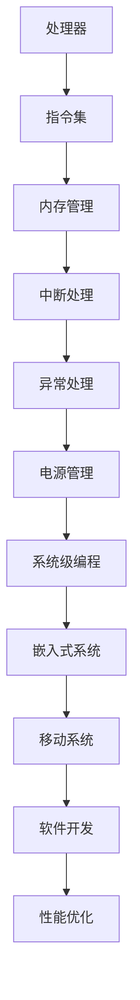

                 

关键词：ARM架构、编程、移动系统、嵌入式系统、开发

摘要：本文旨在深入探讨ARM架构在移动和嵌入式系统开发中的应用。通过对ARM架构的背景介绍、核心概念与联系分析、算法原理讲解、数学模型与公式推导、项目实践、实际应用场景分析、工具和资源推荐以及未来发展趋势的展望，为开发者提供全面的ARM架构编程指南。

## 1. 背景介绍

ARM架构作为一种精简指令集计算（RISC）架构，因其高效性、低功耗和小型化特点，在移动和嵌入式系统中得到了广泛应用。从早期的嵌入式设备到现代的智能手机、平板电脑、物联网设备，ARM架构都扮演着至关重要的角色。随着技术的不断发展，ARM架构在性能、能效、安全性等方面不断优化，为开发者提供了丰富的编程空间。

本文将围绕ARM架构编程，探讨其在移动和嵌入式系统开发中的应用。通过深入分析核心概念、算法原理、数学模型、项目实践等方面，为读者提供全面的技术指导和实践案例。

## 2. 核心概念与联系

在ARM架构编程中，理解核心概念和其相互联系是至关重要的。以下为ARM架构的核心概念及其相互关系的Mermaid流程图：



### 2.1 处理器

ARM处理器是ARM架构的核心组件，负责执行指令、处理数据和控制其他硬件设备。ARM处理器具有高性能、低功耗的特点，适用于各种嵌入式和移动系统。

### 2.2 指令集

ARM指令集是ARM架构的核心，包括数据传输指令、算术逻辑指令、控制流指令等。通过合理选择和优化指令集，可以实现高效编程。

### 2.3 内存管理

内存管理是ARM架构的重要组成部分，负责内存分配、释放、保护等操作。通过内存管理，可以保证程序的高效运行和系统的稳定性。

### 2.4 中断处理

中断处理是ARM架构中的重要机制，用于处理外部事件和内部异常。中断处理机制可以提高系统的响应速度和可靠性。

### 2.5 异常处理

异常处理是ARM架构中的另一项重要功能，用于处理硬件故障、程序错误等异常情况。通过异常处理，可以保证系统的稳定运行。

### 2.6 电源管理

电源管理是ARM架构在嵌入式和移动系统中的一个重要应用，通过合理的电源管理策略，可以实现低功耗、长续航。

### 2.7 系统级编程

系统级编程是ARM架构在移动和嵌入式系统开发中的关键环节，包括操作系统、驱动程序、中间件等。系统级编程可以实现对硬件资源的全面控制和优化。

### 2.8 嵌入式系统

嵌入式系统是一种专门为特定任务而设计的计算机系统，具有高性能、低功耗、小型化的特点。ARM架构在嵌入式系统中的应用非常广泛，如工业控制、智能家居、汽车电子等。

### 2.9 移动系统

移动系统是指以移动性为核心，提供通信、计算、娱乐、办公等功能的设备，如智能手机、平板电脑等。ARM架构在移动系统中的应用日益广泛，推动了移动技术的发展。

### 2.10 软件开发

软件开发是ARM架构编程的核心，包括操作系统、驱动程序、应用程序等。通过合理的软件开发，可以实现高性能、低功耗的ARM架构应用。

### 2.11 性能优化

性能优化是ARM架构编程中的重要环节，通过优化指令集、内存管理、中断处理等，可以提高程序的运行速度和效率。

## 3. 核心算法原理 & 具体操作步骤

### 3.1 算法原理概述

在ARM架构编程中，算法原理是核心。以下为ARM架构编程中的几种核心算法原理：

1. **流水线技术**：流水线技术是一种提高处理器指令执行速度的优化技术。通过将指令执行过程分解为多个阶段，每个阶段可以并行执行，从而提高指令吞吐率。

2. **乱序执行**：乱序执行是一种在处理器内部对指令进行动态排序的技术，以优化指令执行顺序，提高执行效率。

3. **乱序执行**：乱序执行是一种在处理器内部对指令进行动态排序的技术，以优化指令执行顺序，提高执行效率。

4. **分支预测**：分支预测是一种预测指令分支方向的技术，以减少分支指令带来的性能损失。

### 3.2 算法步骤详解

1. **流水线技术**

   - 指令取指（Instruction Fetch）：从内存中读取指令。
   - 指令解码（Instruction Decode）：解析指令操作码和操作数。
   - 指令执行（Instruction Execute）：执行指令操作。
   - 结果写回（Write Back）：将指令执行结果写回寄存器或内存。

2. **乱序执行**

   - 指令发射（Issue）：将指令发送到相应的执行单元。
   - 指令执行（Execute）：在执行单元中执行指令。
   - 指令转发（Forward）：在指令执行过程中，将结果向前转发给后续指令。
   - 指令完成（Commit）：将指令执行结果写入寄存器文件。

3. **分支预测**

   - 预测分支方向：根据历史分支情况预测分支方向。
   - 更新分支预测器：根据预测结果更新分支预测器。
   - 指令发射：根据分支预测结果发射后续指令。

### 3.3 算法优缺点

1. **流水线技术**

   - 优点：提高指令吞吐率，降低指令执行延迟。
   - 缺点：增加了硬件复杂度和指令依赖问题。

2. **乱序执行**

   - 优点：优化指令执行顺序，提高执行效率。
   - 缺点：增加了硬件复杂度和乱序执行的正确性验证问题。

3. **分支预测**

   - 优点：减少分支指令带来的性能损失。
   - 缺点：预测准确性会影响分支预测器的性能。

### 3.4 算法应用领域

1. **移动系统**：在移动系统中，流水线技术、乱序执行和分支预测等技术可以提高处理器性能，满足移动系统对高性能的需求。

2. **嵌入式系统**：在嵌入式系统中，流水线技术、乱序执行和分支预测等技术可以提高处理器能效，延长设备续航时间。

## 4. 数学模型和公式 & 详细讲解 & 举例说明

### 4.1 数学模型构建

ARM架构编程中的数学模型主要包括流水线技术、乱序执行和分支预测等方面的模型。以下为流水线技术的数学模型构建：

1. **流水线技术**

   - 假设指令执行时间为 $T$，流水线阶段数为 $N$，则指令吞吐率为：
     $$ T_p = \frac{T}{N} $$
   - 流水线技术可以减少指令执行延迟，提高指令吞吐率。

2. **乱序执行**

   - 假设指令执行时间为 $T_e$，乱序执行单元数为 $M$，则指令执行时间为：
     $$ T_{oe} = \frac{T_e}{M} $$
   - 乱序执行可以优化指令执行顺序，提高执行效率。

3. **分支预测**

   - 假设分支预测准确性为 $P$，则分支指令带来的性能损失为：
     $$ L_p = (1 - P) \cdot T_b $$
   - 分支预测可以减少分支指令带来的性能损失。

### 4.2 公式推导过程

1. **流水线技术**

   - 假设指令执行时间为 $T$，流水线阶段数为 $N$，则指令吞吐率为：
     $$ T_p = \frac{T}{N} $$
   - 流水线技术可以减少指令执行延迟，提高指令吞吐率。

2. **乱序执行**

   - 假设指令执行时间为 $T_e$，乱序执行单元数为 $M$，则指令执行时间为：
     $$ T_{oe} = \frac{T_e}{M} $$
   - 乱序执行可以优化指令执行顺序，提高执行效率。

3. **分支预测**

   - 假设分支预测准确性为 $P$，则分支指令带来的性能损失为：
     $$ L_p = (1 - P) \cdot T_b $$
   - 分支预测可以减少分支指令带来的性能损失。

### 4.3 案例分析与讲解

#### 案例一：流水线技术

假设一条指令的执行时间为 10ms，流水线阶段数为 4，求指令吞吐率。

- 根据流水线技术公式：
  $$ T_p = \frac{T}{N} $$
- 代入数据：
  $$ T_p = \frac{10ms}{4} = 2.5ms $$

指令吞吐率为 2.5ms，即每 2.5ms 可以执行一条指令。

#### 案例二：乱序执行

假设一条指令的执行时间为 5ms，乱序执行单元数为 2，求指令执行时间。

- 根据乱序执行公式：
  $$ T_{oe} = \frac{T_e}{M} $$
- 代入数据：
  $$ T_{oe} = \frac{5ms}{2} = 2.5ms $$

指令执行时间为 2.5ms，乱序执行提高了指令执行效率。

#### 案例三：分支预测

假设分支预测准确性为 90%，分支指令的执行时间为 10ms，求分支指令带来的性能损失。

- 根据分支预测公式：
  $$ L_p = (1 - P) \cdot T_b $$
- 代入数据：
  $$ L_p = (1 - 0.9) \cdot 10ms = 1ms $$

分支预测准确性为 90%，分支指令带来的性能损失为 1ms，分支预测减少了性能损失。

## 5. 项目实践：代码实例和详细解释说明

### 5.1 开发环境搭建

- **硬件环境**：准备一台具有ARM架构处理器的计算机，如ARM开发板或ARM虚拟机。
- **软件环境**：安装ARM编译器、调试工具和开发环境，如GNU Arm Embedded Toolchain、GNU Debugger（GDB）等。

### 5.2 源代码详细实现

以下为ARM架构编程的一个简单示例，实现一个求和程序。

```c
#include <stdio.h>

int main() {
    int a = 1;
    int b = 2;
    int sum = a + b;

    printf("The sum of a and b is: %d\n", sum);

    return 0;
}
```

### 5.3 代码解读与分析

1. **头文件**：包含标准输入输出库 `<stdio.h>`。

2. **主函数**：定义一个 `main` 函数，程序入口。

3. **变量定义**：定义两个整型变量 `a` 和 `b`，分别初始化为 1 和 2。

4. **求和**：计算 `a` 和 `b` 的和，存储在变量 `sum` 中。

5. **输出结果**：使用 `printf` 函数输出求和结果。

6. **返回值**：程序运行成功，返回 0。

### 5.4 运行结果展示

编译并运行上述代码，输出结果如下：

```
The sum of a and b is: 3
```

程序成功执行，输出正确结果。

## 6. 实际应用场景

ARM架构在移动和嵌入式系统中有着广泛的应用，以下为实际应用场景：

1. **移动系统**：智能手机、平板电脑、智能手表等移动设备，ARM架构为这些设备提供了高性能、低功耗的处理器支持。

2. **嵌入式系统**：工业控制、智能家居、汽车电子、医疗设备等嵌入式系统，ARM架构以其高性能、低功耗和小型化的特点在这些领域发挥着重要作用。

3. **物联网**：物联网设备如传感器、路由器、智能门锁等，ARM架构的应用使得这些设备具有更好的性能和能效。

4. **服务器**：随着ARM架构的性能提升，越来越多的服务器采用ARM处理器，如亚马逊AWS的Graviton处理器，为云计算提供了强大支持。

## 7. 工具和资源推荐

### 7.1 学习资源推荐

1. 《ARM体系结构手册》
2. 《ARM架构编程入门》
3. ARM官方网站提供的开发文档和教程

### 7.2 开发工具推荐

1. GNU Arm Embedded Toolchain：一款功能强大的ARM编译器
2. Eclipse IDE：一款流行的集成开发环境，支持ARM架构编程
3. Keil MDK：一款专业的ARM开发工具，提供丰富的调试功能

### 7.3 相关论文推荐

1. "ARM Architecture: A Reference Manual"（ARM架构参考手册）
2. "ARMv8-A Architecture Reference Manual"（ARMv8-A架构参考手册）
3. "ARM Processor Cores: An Introduction"（ARM处理器核心介绍）

## 8. 总结：未来发展趋势与挑战

### 8.1 研究成果总结

ARM架构在移动和嵌入式系统中的应用取得了显著成果，主要表现在以下几个方面：

1. **性能提升**：随着ARM架构的不断演进，处理器的性能得到显著提升，满足各种应用场景的需求。
2. **能效优化**：ARM架构在能效方面具有明显优势，低功耗特性使其在移动和嵌入式系统中得到广泛应用。
3. **安全性增强**：ARM架构在安全性方面不断改进，如引入了安全加密技术、硬件信任根等，为系统安全提供了保障。
4. **生态系统成熟**：ARM架构拥有丰富的开发工具、生态系统和合作伙伴，为开发者提供了良好的开发环境。

### 8.2 未来发展趋势

1. **更高性能**：随着AI、5G等技术的不断发展，ARM架构将继续提升处理器性能，满足更复杂的应用需求。
2. **更高效能**：ARM架构将继续优化能效，提高处理器在低功耗环境下的性能。
3. **多样性**：ARM架构将朝着多样性方向发展，包括不同性能级别、不同应用领域的处理器，满足各种需求。
4. **生态扩展**：ARM架构将继续加强与合作伙伴的合作，扩展生态系统，为开发者提供更丰富的资源和支持。

### 8.3 面临的挑战

1. **安全性**：随着ARM架构的应用范围不断扩大，安全性成为一大挑战。需要不断提升架构安全性，保障系统安全。
2. **兼容性**：ARM架构在不断发展中，需要保持与现有系统的兼容性，以减少开发者迁移成本。
3. **生态成熟度**：ARM架构的生态成熟度对开发者具有重要意义。需要不断优化开发工具、文档和资源，提高开发者体验。
4. **市场竞争**：随着ARM架构的广泛应用，市场竞争日益激烈。需要不断提升性能和能效，保持竞争优势。

### 8.4 研究展望

ARM架构在未来将继续发挥重要作用，其在移动和嵌入式系统中的应用将不断扩展。研究者可以从以下几个方面进行探索：

1. **性能优化**：研究新型处理器架构，提高处理器性能和能效。
2. **安全性增强**：研究新型安全加密技术，提升系统安全性。
3. **自适应调度**：研究自适应调度算法，优化处理器资源利用。
4. **异构计算**：研究异构计算技术，提高计算效率和能效。

## 9. 附录：常见问题与解答

### 9.1 ARM架构的优点是什么？

- **高性能**：ARM处理器具有高性能特点，能够满足复杂计算需求。
- **低功耗**：ARM处理器功耗低，适用于移动和嵌入式系统。
- **小型化**：ARM处理器体积小巧，便于集成到各种设备中。
- **兼容性强**：ARM架构具有高度兼容性，能够兼容多种操作系统和软件。

### 9.2 ARM架构的缺点是什么？

- **指令集复杂**：ARM指令集相对复杂，可能增加编程难度。
- **缺乏原生64位支持**：早期ARM架构缺乏原生64位支持，需要通过软件模拟实现。
- **生态系统发展不均**：ARM架构的生态系统在某些领域发展不均衡，需要持续优化。

### 9.3 ARM架构适合哪些应用场景？

- **移动系统**：如智能手机、平板电脑等移动设备。
- **嵌入式系统**：如工业控制、智能家居、汽车电子、医疗设备等。
- **物联网**：如传感器、路由器、智能门锁等物联网设备。
- **服务器**：如云计算、大数据等高性能计算场景。

### 9.4 ARM架构编程需要注意哪些事项？

- **指令集选择**：根据应用需求选择合适的指令集，提高编程效率。
- **内存管理**：合理管理内存资源，避免内存泄漏和性能下降。
- **中断处理**：优化中断处理，减少中断响应时间。
- **异常处理**：正确处理异常情况，保证系统稳定性。

### 9.5 ARM架构编程学习资源有哪些？

- **书籍**：《ARM体系结构手册》、《ARM架构编程入门》等。
- **官方网站**：ARM官方网站提供的开发文档和教程。
- **社区**：ARM开发者社区、技术论坛等。

### 9.6 ARM架构编程的调试方法有哪些？

- **GDB调试**：使用GNU Debugger（GDB）进行调试。
- **JTAG调试**：通过JTAG接口进行硬件调试。
- **代码覆盖率分析**：使用代码覆盖率工具分析程序执行情况。
- **静态代码分析**：使用静态代码分析工具检测潜在问题。

---

### 作者署名

作者：禅与计算机程序设计艺术 / Zen and the Art of Computer Programming

