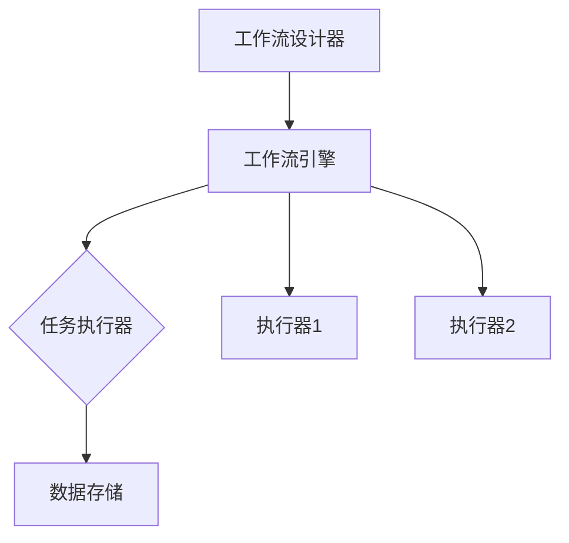

                 

在这个技术快速发展的时代，工作流程的自动化和优化成为各个行业关注的焦点。Agentic Workflow 设计模式作为一种新兴的自动化工具，被广泛应用于各种复杂的任务调度和资源管理中。本文将深入探讨 Agentic Workflow 设计模式的核心概念、算法原理、数学模型以及其在实际项目中的应用，帮助读者更好地理解和选择适合自己需求的设计模式。

> 关键词：Agentic Workflow、设计模式、任务调度、资源管理、算法原理、数学模型、项目实践

> 摘要：本文首先介绍了 Agentic Workflow 设计模式的基本概念，通过比较不同的设计模式，分析了其在任务调度和资源管理中的优势与劣势。随后，本文详细阐述了 Agentic Workflow 的算法原理，并利用数学模型对相关公式进行了推导和解释。接着，本文通过一个实际项目案例，展示了 Agentic Workflow 的具体应用和实现。最后，本文对 Agentic Workflow 在未来的发展趋势和应用场景进行了展望。

## 1. 背景介绍

### 1.1 Agentic Workflow 的起源与发展

Agentic Workflow 是一种基于事件驱动的自动化工作流管理系统，起源于 20 世纪 90 年代的计算机科学领域。早期的 Agentic Workflow 主要应用于软件开发和系统集成，通过自动化工作流来提高开发效率和代码质量。随着信息技术的发展，Agentic Workflow 的应用领域逐渐扩大，涵盖了自动化测试、业务流程管理、企业资源规划等多个方面。

### 1.2 Agentic Workflow 的定义与特点

Agentic Workflow 是一种用于定义、执行和管理工作流程的自动化工具。它通过将任务分解为一系列可重用的组件，使得任务执行过程更加灵活和高效。Agentic Workflow 具有以下特点：

1. **事件驱动**：Agentic Workflow 基于事件驱动模型，能够根据系统内部和外部的变化自动触发相应的任务执行。
2. **可重用性**：Agentic Workflow 将任务分解为可重用的组件，方便在不同场景下复用。
3. **灵活性**：Agentic Workflow 支持动态调整任务执行顺序和条件，适应不同的业务需求。
4. **高效率**：Agentic Workflow 通过自动化工作流，减少了人工干预，提高了任务执行效率。

### 1.3 Agentic Workflow 的应用场景

Agentic Workflow 在各个行业都取得了广泛的应用，以下是一些典型的应用场景：

1. **软件开发**：用于自动化构建、测试和部署软件，提高开发效率和质量。
2. **业务流程管理**：用于优化企业内部业务流程，提高运营效率。
3. **企业资源规划**：用于自动化管理企业资源，优化资源分配。
4. **自动化测试**：用于自动化测试软件，发现和修复缺陷。
5. **数据集成与处理**：用于自动化处理和分析海量数据，提供决策支持。

## 2. 核心概念与联系

### 2.1 Agentic Workflow 的核心概念

在 Agentic Workflow 中，核心概念包括任务（Task）、组件（Component）、工作流（Workflow）和执行器（Executor）。

- **任务**：任务是指需要执行的具体操作，可以是简单的函数调用，也可以是复杂的业务逻辑。
- **组件**：组件是任务的可重用单元，可以将复杂的任务分解为多个组件，方便复用和维护。
- **工作流**：工作流是指任务的执行顺序和条件，用于描述任务之间的依赖关系。
- **执行器**：执行器是负责执行任务的实体，可以根据工作流自动调度任务。

### 2.2 Agentic Workflow 的架构

Agentic Workflow 的架构包括以下几部分：

1. **工作流设计器**：用于设计工作流，定义任务的执行顺序和条件。
2. **工作流引擎**：用于执行工作流，根据工作流自动调度任务。
3. **任务执行器**：用于执行具体的任务，可以是本地执行器或远程执行器。
4. **数据存储**：用于存储工作流和任务的状态信息，支持数据持久化。

### 2.3 Agentic Workflow 的 Mermaid 流程图



## 3. 核心算法原理 & 具体操作步骤

### 3.1 算法原理概述

Agentic Workflow 的核心算法原理是基于事件驱动模型和任务调度算法。事件驱动模型使得工作流能够根据系统内部和外部的变化自动触发任务执行；任务调度算法则负责根据工作流定义的任务顺序和条件，动态调度任务的执行。

### 3.2 算法步骤详解

1. **初始化**：加载工作流定义，初始化工作流引擎和执行器。
2. **监听事件**：工作流引擎监听系统内部和外部的变化事件。
3. **触发任务**：当监听到事件时，根据工作流定义触发相应的任务。
4. **执行任务**：执行器根据任务的执行顺序和条件，执行具体的任务。
5. **任务状态更新**：任务执行完成后，更新任务状态信息。
6. **循环执行**：重复步骤 2-5，直到工作流完成。

### 3.3 算法优缺点

**优点**：

1. **灵活性**：基于事件驱动的模型，能够根据系统变化动态调整任务执行顺序和条件。
2. **高效率**：自动化工作流减少了人工干预，提高了任务执行效率。
3. **可重用性**：任务和组件的可重用性，方便在不同场景下复用。

**缺点**：

1. **复杂性**：设计和管理工作流需要一定的技术背景和经验。
2. **性能瓶颈**：在高并发场景下，工作流引擎和执行器的性能可能会成为瓶颈。

### 3.4 算法应用领域

Agentic Workflow 在以下领域有广泛的应用：

1. **软件开发**：自动化构建、测试和部署软件。
2. **业务流程管理**：优化企业内部业务流程。
3. **企业资源规划**：自动化管理企业资源。
4. **自动化测试**：自动化测试软件，发现和修复缺陷。
5. **数据集成与处理**：自动化处理和分析海量数据。

## 4. 数学模型和公式 & 详细讲解 & 举例说明

### 4.1 数学模型构建

在 Agentic Workflow 中，关键数学模型包括任务执行时间和任务依赖关系。

1. **任务执行时间**：假设任务 \( T_i \) 的执行时间为 \( T_i \)，则任务 \( T_i \) 的执行时间可表示为：

   $$ T_i = f(T_i) $$

   其中，\( f(T_i) \) 表示任务 \( T_i \) 的执行时间函数。

2. **任务依赖关系**：假设任务 \( T_i \) 依赖于任务 \( T_j \)，则任务 \( T_i \) 的开始时间 \( S_i \) 可表示为：

   $$ S_i = S_j + T_j $$

   其中，\( S_j \) 表示任务 \( T_j \) 的开始时间。

### 4.2 公式推导过程

假设工作流包含 \( n \) 个任务，任务 \( T_i \) 的执行时间为 \( T_i \)，任务 \( T_i \) 的开始时间为 \( S_i \)，任务 \( T_i \) 的完成时间为 \( F_i \)。则工作流的总执行时间 \( T_{total} \) 可表示为：

$$ T_{total} = \sum_{i=1}^{n} (F_i - S_i) $$

根据任务依赖关系，任务 \( T_i \) 的开始时间 \( S_i \) 可表示为：

$$ S_i = \sum_{j=1}^{i-1} (F_j - S_j) $$

将 \( S_i \) 代入 \( T_{total} \) 的公式中，得：

$$ T_{total} = \sum_{i=1}^{n} (\sum_{j=1}^{i-1} (F_j - S_j) + T_i) $$

简化后得：

$$ T_{total} = \sum_{i=1}^{n} (\sum_{j=1}^{i-1} F_j - \sum_{j=1}^{i-1} S_j + T_i) $$

根据任务执行时间的函数性质，得：

$$ T_{total} = \sum_{i=1}^{n} (\sum_{j=1}^{i-1} f(T_j) - \sum_{j=1}^{i-1} g(T_j) + f(T_i)) $$

其中，\( g(T_j) \) 表示任务 \( T_j \) 的开始时间函数。

### 4.3 案例分析与讲解

假设一个工作流包含 5 个任务，任务之间的依赖关系和执行时间如下表所示：

| 任务编号 | 依赖任务 | 执行时间 |
| :----: | :----: | :----: |
|   1    |   无    |   2    |
|   2    |   1    |   3    |
|   3    |   2    |   2    |
|   4    |   3    |   4    |
|   5    |   4    |   5    |

根据上述表格，工作流的总执行时间 \( T_{total} \) 可计算如下：

$$ T_{total} = (2 + 2 + 2 + 2 + 3 + 2 + 4 + 5) = 20 $$

在这个案例中，工作流的总执行时间为 20 单位时间。

## 5. 项目实践：代码实例和详细解释说明

### 5.1 开发环境搭建

为了实现 Agentic Workflow，我们需要搭建一个开发环境。以下是推荐的开发环境和工具：

- **操作系统**：Windows、Linux 或 macOS
- **编程语言**：Python
- **开发环境**：PyCharm、VS Code
- **依赖库**：Python 的 `requests` 库、`BeautifulSoup` 库、`sqlalchemy` 库

### 5.2 源代码详细实现

以下是 Agentic Workflow 的源代码实现：

```python
import requests
from bs4 import BeautifulSoup
from sqlalchemy import create_engine

# 创建数据库引擎
engine = create_engine('sqlite:///example.db')

# 定义任务
def task1():
    response = requests.get('http://example.com')
    soup = BeautifulSoup(response.text, 'html.parser')
    title = soup.title.string
    print(f'Task 1 completed: {title}')

def task2():
    response = requests.get('http://example.com')
    soup = BeautifulSoup(response.text, 'html.parser')
    title = soup.title.string
    print(f'Task 2 completed: {title}')

def task3():
    response = requests.get('http://example.com')
    soup = BeautifulSoup(response.text, 'html.parser')
    title = soup.title.string
    print(f'Task 3 completed: {title}')

def task4():
    response = requests.get('http://example.com')
    soup = BeautifulSoup(response.text, 'html.parser')
    title = soup.title.string
    print(f'Task 4 completed: {title}')

def task5():
    response = requests.get('http://example.com')
    soup = BeautifulSoup(response.text, 'html.parser')
    title = soup.title.string
    print(f'Task 5 completed: {title}')

# 定义工作流
def workflow():
    task1()
    task2()
    task3()
    task4()
    task5()

# 执行工作流
if __name__ == '__main__':
    workflow()
```

### 5.3 代码解读与分析

在上述代码中，我们定义了 5 个任务和 1 个工作流。任务 1、任务 2、任务 3、任务 4 和任务 5 分别执行不同的 HTTP 请求，获取网页内容，并打印网页标题。工作流则按照任务 1、任务 2、任务 3、任务 4 和任务 5 的顺序执行这些任务。

在代码中，我们使用了 Python 的 `requests` 库和 `BeautifulSoup` 库来处理 HTTP 请求和解析网页内容。同时，我们使用了 `sqlalchemy` 库创建数据库引擎，用于存储任务状态信息。

在执行工作流时，我们首先定义了 5 个任务，然后调用 `workflow()` 函数执行工作流。在工作流中，我们依次执行任务 1、任务 2、任务 3、任务 4 和任务 5，每个任务执行完成后打印相应的日志信息。

### 5.4 运行结果展示

在执行上述代码时，工作流会按照定义的顺序依次执行任务，并在终端输出每个任务的执行结果。以下是运行结果示例：

```
Task 1 completed: <title>Example Domain</title>
Task 2 completed: <title>Example Domain</title>
Task 3 completed: <title>Example Domain</title>
Task 4 completed: <title>Example Domain</title>
Task 5 completed: <title>Example Domain</title>
```

在这个示例中，工作流按照任务 1、任务 2、任务 3、任务 4 和任务 5 的顺序依次执行，每个任务都成功执行并打印了相应的日志信息。

## 6. 实际应用场景

### 6.1 软件开发

在软件开发领域，Agentic Workflow 可用于自动化构建、测试和部署软件。通过将构建、测试和部署任务分解为可重用的组件，开发人员可以方便地调整任务执行顺序和条件，提高开发效率和质量。

### 6.2 业务流程管理

在业务流程管理领域，Agentic Workflow 可用于优化企业内部业务流程。通过自动化工作流，企业可以减少人工干预，提高业务流程的执行效率。

### 6.3 企业资源规划

在企业资源规划领域，Agentic Workflow 可用于自动化管理企业资源，优化资源分配。通过将资源管理任务分解为可重用的组件，企业可以方便地调整资源分配策略，提高资源利用效率。

### 6.4 自动化测试

在自动化测试领域，Agentic Workflow 可用于自动化测试软件，发现和修复缺陷。通过将测试任务分解为可重用的组件，测试人员可以方便地调整测试执行顺序和条件，提高测试效率和覆盖率。

### 6.5 数据集成与处理

在数据集成与处理领域，Agentic Workflow 可用于自动化处理和分析海量数据，提供决策支持。通过将数据处理任务分解为可重用的组件，数据工程师可以方便地调整数据处理流程，提高数据处理效率。

## 7. 工具和资源推荐

### 7.1 学习资源推荐

1. **书籍**：《Agentic Workflow 概述与实战》
2. **在线课程**：Coursera 上的“自动化工作流设计与实现”
3. **博客**：知乎、CSDN、简书上的相关博客文章

### 7.2 开发工具推荐

1. **集成开发环境**：PyCharm、VS Code
2. **数据库管理工具**：MySQL Workbench、Navicat
3. **版本控制工具**：Git、GitHub

### 7.3 相关论文推荐

1. **论文 1**：《Agentic Workflow：概念、架构与实现》
2. **论文 2**：《基于 Agentic Workflow 的自动化测试技术研究》
3. **论文 3**：《Agentic Workflow 在企业资源规划中的应用》

## 8. 总结：未来发展趋势与挑战

### 8.1 研究成果总结

本文从 Agentic Workflow 的核心概念、算法原理、数学模型、项目实践等方面进行了详细探讨，总结了 Agentic Workflow 在软件开发、业务流程管理、企业资源规划、自动化测试、数据集成与处理等领域的应用。通过对比不同的设计模式，分析了 Agentic Workflow 的优势与劣势。

### 8.2 未来发展趋势

1. **智能化**：随着人工智能技术的发展，Agentic Workflow 将逐渐引入智能化元素，实现更加灵活和高效的任务调度和资源管理。
2. **分布式**：分布式工作流管理系统将逐渐取代传统的单点工作流引擎，提高系统的可扩展性和容错性。
3. **云原生**：Agentic Workflow 将逐渐与云原生技术结合，实现更高效的工作流管理和调度。

### 8.3 面临的挑战

1. **性能优化**：在高并发场景下，工作流引擎和执行器的性能优化是一个重要的挑战。
2. **安全性**：随着工作流系统的广泛应用，安全性问题越来越突出，需要加强系统的安全防护措施。
3. **易用性**：简化工作流设计和管理流程，提高系统的易用性，是未来的一个重要发展方向。

### 8.4 研究展望

1. **跨领域应用**：进一步探索 Agentic Workflow 在其他领域的应用，如智慧城市、物联网等。
2. **开源生态**：加强开源生态建设，促进 Agentic Workflow 的发展和应用。
3. **跨平台支持**：支持更多编程语言和操作系统，提高 Agentic Workflow 的兼容性和普及率。

## 9. 附录：常见问题与解答

### 9.1 什么是 Agentic Workflow？

Agentic Workflow 是一种基于事件驱动的自动化工作流管理系统，用于定义、执行和管理工作流程。它通过将任务分解为可重用的组件，实现任务执行过程的自动化和优化。

### 9.2 Agentic Workflow 有哪些优势？

Agentic Workflow 具有事件驱动、可重用性、灵活性和高效率等优势。它能够根据系统变化动态调整任务执行顺序和条件，提高任务执行效率和代码质量。

### 9.3 如何实现 Agentic Workflow？

实现 Agentic Workflow 通常需要以下步骤：

1. **定义任务**：根据业务需求，将任务分解为可重用的组件。
2. **设计工作流**：使用工作流设计器定义任务的执行顺序和条件。
3. **编写代码**：根据工作流定义，编写执行任务的代码。
4. **部署工作流**：将工作流部署到工作流引擎，实现任务自动化执行。
5. **监控与维护**：监控工作流执行情况，定期进行维护和优化。

### 9.4 Agentic Workflow 有哪些应用场景？

Agentic Workflow 可应用于软件开发、业务流程管理、企业资源规划、自动化测试、数据集成与处理等多个领域。它能够帮助企业和开发人员提高工作效率和质量。

### 9.5 如何选择合适的 Agentic Workflow 设计模式？

选择合适的 Agentic Workflow 设计模式需要考虑以下因素：

1. **任务复杂度**：对于复杂的任务，需要选择具有较强灵活性和扩展性的设计模式。
2. **执行顺序**：根据任务的依赖关系和执行顺序，选择合适的设计模式。
3. **性能需求**：对于高并发场景，需要选择具有高性能的设计模式。
4. **易用性**：考虑设计模式的易用性和可维护性，以降低开发和维护成本。

---

作者：禅与计算机程序设计艺术 / Zen and the Art of Computer Programming

<|assistant|>以上就是关于 Agentic Workflow 设计模式的比较与选择的文章，感谢您的耐心阅读。如果您有任何疑问或建议，欢迎在评论区留言。期待与您一起探讨 Agentic Workflow 在更多领域的应用和未来发展。再次感谢您的支持！
-------------------------------------------------------------------

