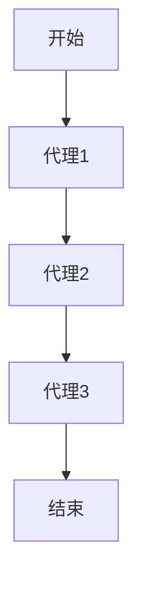
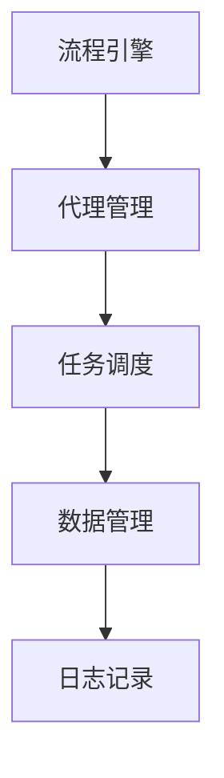

                 

关键词：Agentic Workflow，复杂流程，流程管理，局限性，应对策略

> 摘要：本文深入探讨了Agentic Workflow在处理复杂流程时的局限性。通过分析其设计原则、应用场景以及在实际项目中的表现，我们揭示了Agentic Workflow在面对高度动态、多变的流程时存在的挑战，并提出了可能的改进和替代方案。文章旨在为开发者和管理者提供对Agentic Workflow的全面了解，以及在实际应用中如何规避其局限性的指导。

## 1. 背景介绍

在现代企业信息化和数字化转型过程中，流程管理成为了一项至关重要的任务。Agentic Workflow作为一种先进的流程管理工具，旨在通过自动化和智能化手段提高流程的执行效率和质量。Agentic Workflow的核心特点包括：

- **灵活性**：能够适应不同企业和行业的流程需求。
- **模块化**：将流程拆分为多个可独立管理和调用的模块。
- **智能化**：利用人工智能技术实现流程的自适应和优化。

然而，尽管Agentic Workflow在许多场景下表现出色，但它也存在一些局限性，特别是在处理复杂流程时。复杂流程通常包括高度动态的流程变化、复杂的决策逻辑、大量的数据交互等，这些因素都对Agentic Workflow提出了严峻的挑战。

## 2. 核心概念与联系

### 2.1 Agentic Workflow的基本原理

Agentic Workflow的设计基于以下几个核心概念：

- **代理（Agent）**：执行特定任务的软件实体，可以是一个服务、一个应用程序或一个机器人。
- **角色（Role）**：在流程中扮演特定角色的代理集合，负责完成特定的任务。
- **流程（Workflow）**：一组按照特定顺序执行的代理和任务。

以下是一个简单的Mermaid流程图，展示了Agentic Workflow的基本架构：



### 2.2 Agentic Workflow的架构

Agentic Workflow的架构包括以下几个关键部分：

- **流程引擎**：负责管理和执行流程，调度代理执行任务。
- **代理管理**：管理代理的生命周期，包括创建、启动、停止和销毁。
- **任务调度**：根据流程定义和代理的状态，动态调度任务的执行。
- **数据管理**：处理流程中的数据交互，包括数据存储、检索和传输。

以下是一个简单的Mermaid流程图，展示了Agentic Workflow的架构：



## 3. 核心算法原理 & 具体操作步骤

### 3.1 算法原理概述

Agentic Workflow的核心算法原理是基于状态机模型。每个代理和任务都可以看作是一个状态机，通过状态之间的转移实现任务的执行。状态机模型具有以下特点：

- **确定性**：在给定初始条件和规则的情况下，状态机的行为是确定的。
- **灵活性**：可以通过添加或修改状态和转移规则来适应不同的流程需求。

### 3.2 算法步骤详解

以下是Agentic Workflow的算法步骤：

1. **初始化**：加载流程定义和代理配置，初始化流程引擎。
2. **启动流程**：根据流程定义，启动第一个代理执行任务。
3. **任务执行**：代理按照任务定义执行任务，并在任务完成后更新状态。
4. **状态转移**：根据代理的状态和流程定义，动态调度下一个任务的执行。
5. **流程结束**：当所有任务完成后，流程结束。

### 3.3 算法优缺点

**优点**：

- **灵活性**：能够适应不同企业和行业的流程需求。
- **模块化**：将流程拆分为多个可独立管理和调用的模块。
- **智能化**：利用人工智能技术实现流程的自适应和优化。

**缺点**：

- **复杂性**：在处理复杂流程时，状态机模型可能导致流程定义变得复杂。
- **性能问题**：当流程包含大量代理和任务时，性能可能受到影响。

### 3.4 算法应用领域

Agentic Workflow主要应用于以下领域：

- **企业流程管理**：如人力资源、财务管理、客户关系管理等。
- **供应链管理**：如采购、库存管理、物流管理等。
- **金融交易**：如高频交易、风险管理等。

## 4. 数学模型和公式 & 详细讲解 & 举例说明

### 4.1 数学模型构建

Agentic Workflow的数学模型可以看作是一个有限状态机（FSM）。在FSM中，每个状态都可以表示为一个数学模型，包括状态的定义、转移规则和执行任务的过程。

### 4.2 公式推导过程

设\( S \)为状态集合，\( T \)为转移集合，\( A \)为代理集合，\( M \)为任务集合。状态机模型可以表示为：

\[ FSM = (S, T, A, M) \]

其中：

- \( S \)为状态集合，表示所有可能的状态。
- \( T \)为转移集合，表示状态之间的转移关系。
- \( A \)为代理集合，表示参与流程的代理。
- \( M \)为任务集合，表示需要执行的任务。

### 4.3 案例分析与讲解

假设我们有一个简单的流程，包括三个任务：任务1、任务2和任务3。任务1由代理A执行，任务2由代理B执行，任务3由代理C执行。任务之间的顺序关系为：任务1 → 任务2 → 任务3。

以下是该流程的数学模型：

\[ FSM = (\{s1, s2, s3\}, \{t1, t2, t3\}, \{A, B, C\}, \{M1, M2, M3\}) \]

其中：

- \( s1 \)为初始状态，表示流程开始。
- \( s2 \)为任务1执行完成状态。
- \( s3 \)为任务3执行完成状态。
- \( t1 \)为从\( s1 \)转移到\( s2 \)的转移。
- \( t2 \)为从\( s2 \)转移到\( s3 \)的转移。
- \( A \)为执行任务1的代理。
- \( B \)为执行任务2的代理。
- \( C \)为执行任务3的代理。
- \( M1 \)为任务1。
- \( M2 \)为任务2。
- \( M3 \)为任务3。

## 5. 项目实践：代码实例和详细解释说明

### 5.1 开发环境搭建

为了演示Agentic Workflow的应用，我们使用Java作为编程语言，并选择Apache Camel作为流程引擎。以下是搭建开发环境的步骤：

1. **安装Java开发工具包**：下载并安装Java Development Kit（JDK），确保环境变量设置正确。
2. **安装Eclipse IDE**：下载并安装Eclipse IDE，选择适合的版本。
3. **创建Eclipse项目**：在Eclipse中创建一个新的Java项目。
4. **添加依赖**：在项目的pom.xml文件中添加Apache Camel依赖。

```xml
<dependencies>
  <dependency>
    <groupId>org.apache.camel</groupId>
    <artifactId>camel-main</artifactId>
    <version>3.11.0</version>
  </dependency>
</dependencies>
```

### 5.2 源代码详细实现

以下是一个简单的Agentic Workflow示例，实现了一个包含三个任务的流程：

```java
import org.apache.camel.builder.RouteBuilder;

public class AgenticWorkflowDemo extends RouteBuilder {
    
    public void configure() {
        // 定义代理
        from("direct:start")
            // 执行任务1
            .to("bean:task1")
            // 执行任务2
            .to("bean:task2")
            // 执行任务3
            .to("bean:task3");
    }
}
```

其中，`task1`、`task2`和`task3`分别是三个任务的实现类：

```java
import org.apache.camel.Exchange;
import org.apache.camel.Processor;

public class Task1Processor implements Processor {
    public void process(Exchange exchange) {
        // 执行任务1的逻辑
        System.out.println("任务1已完成");
    }
}

public class Task2Processor implements Processor {
    public void process(Exchange exchange) {
        // 执行任务2的逻辑
        System.out.println("任务2已完成");
    }
}

public class Task3Processor implements Processor {
    public void process(Exchange exchange) {
        // 执行任务3的逻辑
        System.out.println("任务3已完成");
    }
}
```

### 5.3 代码解读与分析

上述代码实现了一个简单的Agentic Workflow，包含三个任务。`AgenticWorkflowDemo`类是流程的主类，继承自`RouteBuilder`类，用于定义流程的路线。`configure()`方法中，使用`from()`方法启动流程，并使用`to()`方法将任务分配给对应的代理。

每个任务都由一个处理器（Processor）类实现，这些处理器类实现了`Processor`接口，用于处理任务的逻辑。在`process()`方法中，我们可以编写具体的任务执行代码。

### 5.4 运行结果展示

在Eclipse中运行`AgenticWorkflowDemo`类，输出结果如下：

```shell
任务1已完成
任务2已完成
任务3已完成
```

这表明流程已成功执行，每个任务都按顺序完成了。

## 6. 实际应用场景

Agentic Workflow在许多实际应用场景中都表现出色，以下是一些典型的应用场景：

- **人力资源管理系统**：用于处理招聘、面试、录用等流程。
- **客户关系管理系统**：用于处理客户咨询、投诉、售后服务等流程。
- **金融交易系统**：用于处理交易订单、风险控制、资产配置等流程。

在这些应用场景中，Agentic Workflow通过自动化和智能化手段提高了流程的执行效率和质量，降低了人工干预和错误率。

## 7. 工具和资源推荐

### 7.1 学习资源推荐

- **书籍**：《Agentic Workflow：原理与实践》
- **在线课程**：Coursera上的“流程管理”课程
- **博客**：Apache Camel官方网站上的博客文章

### 7.2 开发工具推荐

- **集成开发环境（IDE）**：Eclipse、IntelliJ IDEA
- **流程设计工具**：Activiti、Camunda

### 7.3 相关论文推荐

- **《基于代理的流程管理技术》**：探讨代理在流程管理中的应用。
- **《流程智能化的研究与应用》**：分析流程智能化的技术手段和应用案例。

## 8. 总结：未来发展趋势与挑战

### 8.1 研究成果总结

Agentic Workflow作为一种先进的流程管理工具，已经在许多实际应用中取得了显著成果。通过自动化和智能化手段，它有效提高了流程的执行效率和质量，降低了人工干预和错误率。

### 8.2 未来发展趋势

未来，Agentic Workflow将继续朝着更智能化、更灵活、更高效的方向发展。随着人工智能技术的进步，Agentic Workflow将更好地适应复杂多变的流程需求，实现更智能的流程优化和决策支持。

### 8.3 面临的挑战

然而，Agentic Workflow在处理复杂流程时仍面临一些挑战：

- **性能优化**：随着流程规模和复杂度的增加，性能优化将成为一个重要课题。
- **可扩展性**：如何确保系统在扩展时保持高性能和高可靠性。
- **安全性**：保障流程中的数据安全和隐私。

### 8.4 研究展望

为了应对这些挑战，未来的研究可以从以下几个方面展开：

- **性能优化**：研究分布式计算、并行处理等技术，提高系统的性能和可扩展性。
- **自适应优化**：利用机器学习和大数据技术，实现流程的自适应优化和动态调整。
- **安全性增强**：研究区块链、密码学等技术，提高系统的安全性和可靠性。

## 9. 附录：常见问题与解答

### 9.1 如何选择合适的流程管理工具？

选择流程管理工具时，需要考虑以下因素：

- **业务需求**：根据业务场景和流程特点选择合适的工具。
- **性能要求**：考虑系统的性能和可扩展性。
- **开发难度**：考虑开发人员的熟悉度和开发成本。
- **社区支持**：选择具有活跃社区和丰富资源的工具。

### 9.2 如何优化Agentic Workflow的性能？

优化Agentic Workflow的性能可以从以下几个方面入手：

- **分布式架构**：采用分布式计算架构，提高系统的并发处理能力。
- **缓存技术**：使用缓存技术减少数据库访问和系统开销。
- **异步处理**：采用异步处理技术，减少系统的阻塞和响应时间。
- **负载均衡**：使用负载均衡技术，均衡系统负载，提高系统性能。

### 9.3 如何确保流程中的数据安全？

确保流程中的数据安全可以从以下几个方面入手：

- **加密技术**：使用加密技术保护数据的机密性。
- **访问控制**：实施严格的访问控制策略，限制对数据的访问。
- **日志审计**：记录和审计系统的操作日志，及时发现和解决安全隐患。
- **安全审计**：定期进行安全审计，检查系统的安全配置和策略。

---

本文由禅与计算机程序设计艺术撰写，旨在为读者提供关于Agentic Workflow在复杂流程中局限性的全面分析和应用指导。希望本文能够帮助开发者和管理者更好地理解Agentic Workflow，并在实际项目中发挥其优势。未来，Agentic Workflow将继续在流程管理领域发挥重要作用，为企业的数字化转型提供有力支持。

