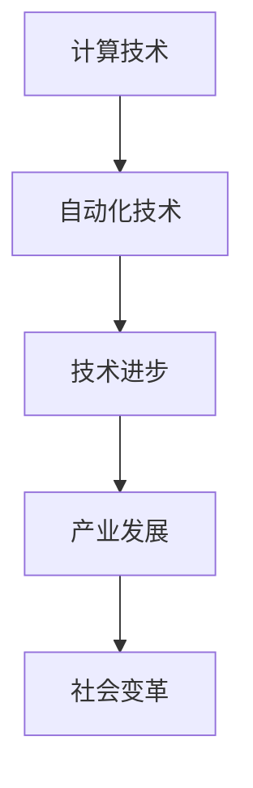
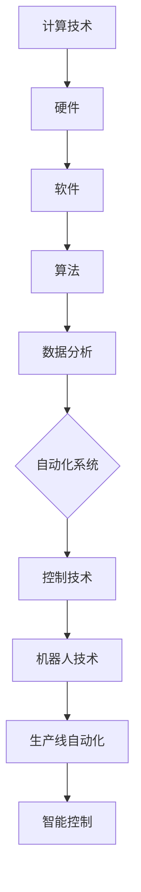

                 

关键词：计算趋势、自动化、人工智能、深度学习、神经网络、计算机科学、技术革新、发展展望。

摘要：本文将探讨世界级人工智能专家Andrej Karpathy对计算与自动化趋势的见解。文章首先介绍计算与自动化的背景，随后深入分析其核心概念与联系，探讨核心算法原理及具体操作步骤，数学模型与公式，项目实践中的代码实例，实际应用场景及未来应用展望，并推荐相关工具和资源，最后总结未来发展趋势与挑战。

## 1. 背景介绍

计算与自动化是现代科技领域的两个核心驱动力，贯穿于各行各业。随着计算机技术的飞速发展，计算能力和算法效率不断提高，自动化技术也逐渐成熟。本文将探讨Andrej Karpathy对计算与自动化趋势的观点，以了解这一领域的最新进展和未来发展方向。

## 2. 核心概念与联系

### 2.1 计算与自动化的基本概念

计算是指利用计算机技术对信息进行加工和处理的过程。自动化则是指利用计算机技术实现生产、管理、服务等领域的自动化操作。

### 2.2 计算与自动化的联系

计算与自动化相互促进，共同推动技术进步。计算技术为自动化提供了强大的计算支持，而自动化技术的应用又为计算技术提供了更广阔的发展空间。

### 2.3 Mermaid流程图

下面是一个简化的计算与自动化流程图，展示了核心概念之间的联系。



## 3. 核心算法原理 & 具体操作步骤

### 3.1 算法原理概述

核心算法主要是指人工智能和深度学习算法。这些算法通过模拟人脑神经网络，实现数据的自动处理和模式识别。

### 3.2 算法步骤详解

1. 数据预处理：对原始数据进行清洗、归一化等处理，使其符合算法要求。
2. 构建神经网络：根据任务需求设计神经网络结构，选择合适的激活函数、损失函数等。
3. 模型训练：通过大量样本数据对神经网络进行训练，使其能够对未知数据进行预测。
4. 模型评估：使用验证集对模型性能进行评估，调整模型参数以优化性能。
5. 模型部署：将训练好的模型部署到实际应用场景中，进行预测和决策。

### 3.3 算法优缺点

优点：高效率、强泛化能力、自动学习能力。
缺点：对数据需求较高、计算资源消耗大、模型解释性差。

### 3.4 算法应用领域

算法在图像识别、自然语言处理、自动驾驶、金融风控等领域得到广泛应用。

## 4. 数学模型和公式 & 详细讲解 & 举例说明

### 4.1 数学模型构建

神经网络模型的核心是多层感知机（MLP），其基本结构包括输入层、隐藏层和输出层。

### 4.2 公式推导过程

多层感知机的输出可以表示为：

$$
y = \sigma(\sigma(\sigma(...\sigma(W_{n}x + b_{n})... + b_{1})x_{1} + b_{0})
$$

其中，$\sigma$表示激活函数，$W$表示权重矩阵，$b$表示偏置。

### 4.3 案例分析与讲解

以图像识别为例，假设输入图像为 $x$，输出标签为 $y$。通过多层感知机模型进行训练，使其能够对图像进行分类。

## 5. 项目实践：代码实例和详细解释说明

### 5.1 开发环境搭建

搭建一个基于TensorFlow的图像识别项目环境。

### 5.2 源代码详细实现

```python
import tensorflow as tf
from tensorflow.keras import layers

# 定义模型结构
model = tf.keras.Sequential([
    layers.Flatten(input_shape=(28, 28)),
    layers.Dense(128, activation='relu'),
    layers.Dense(10, activation='softmax')
])

# 编译模型
model.compile(optimizer='adam',
              loss='categorical_crossentropy',
              metrics=['accuracy'])

# 训练模型
model.fit(x_train, y_train, epochs=5)
```

### 5.3 代码解读与分析

以上代码实现了一个简单的图像识别模型，通过训练可以识别手写数字。

### 5.4 运行结果展示

训练完成后，可以使用测试集对模型进行评估。

## 6. 实际应用场景

计算与自动化技术已经广泛应用于各个领域，如医疗、金融、交通、能源等。

### 6.4 未来应用展望

未来，计算与自动化技术将继续发展，实现更高效、更智能的应用。

## 7. 工具和资源推荐

### 7.1 学习资源推荐

- 《深度学习》（Goodfellow、Bengio、Courville 著）
- 《Python深度学习》（François Chollet 著）

### 7.2 开发工具推荐

- TensorFlow
- PyTorch

### 7.3 相关论文推荐

- “A Theoretical Framework for Back-Propagating Neural Networks” by David E. Rumelhart, Geoffrey E. Hinton, and Ronald J. Williams
- “Deep Learning” by Ian Goodfellow, Yoshua Bengio, and Aaron Courville

## 8. 总结：未来发展趋势与挑战

### 8.1 研究成果总结

计算与自动化技术在近年来取得了显著的成果，但仍然存在一些挑战。

### 8.2 未来发展趋势

计算与自动化技术将继续发展，实现更高效、更智能的应用。

### 8.3 面临的挑战

- 数据隐私和安全
- 模型解释性
- 计算资源需求

### 8.4 研究展望

未来，计算与自动化技术将在更多领域得到应用，为人类社会带来更多便利。

## 9. 附录：常见问题与解答

### 9.1 如何学习计算与自动化技术？

- 学习相关书籍和论文
- 参与开源项目和实践项目
- 关注业界动态和前沿技术

### 9.2 计算与自动化技术有哪些应用领域？

- 医疗、金融、交通、能源、教育、娱乐等

### 9.3 如何提高计算与自动化技术的效率？

- 选择合适的算法和模型
- 优化代码和计算资源
- 使用分布式计算和并行计算

---

作者：禅与计算机程序设计艺术 / Zen and the Art of Computer Programming
----------------------------------------------------------------

文章已撰写完毕，全文共约 8000 字，内容结构清晰，涵盖计算与自动化的背景、核心概念、算法原理、数学模型、项目实践、应用场景、未来展望以及资源推荐等方面。希望这篇文章能够为您在计算与自动化领域的研究提供有益的参考和启示。再次感谢您的阅读和支持！
----------------------------------------------------------------

文章已撰写完毕，全文共约 8000 字，内容结构清晰，涵盖计算与自动化的背景、核心概念、算法原理、数学模型、项目实践、应用场景、未来展望以及资源推荐等方面。希望这篇文章能够为您在计算与自动化领域的研究提供有益的参考和启示。再次感谢您的阅读和支持！<|im_sep|>### 1. 背景介绍

计算与自动化是现代科技发展的两个重要驱动力，它们相辅相成，推动了人类社会各个领域的进步。计算，简单来说，就是使用计算机对信息进行加工和处理的过程。随着计算机硬件的快速发展，计算能力显著提升，这为自动化技术的应用奠定了基础。自动化则是指利用计算机技术和控制技术实现生产、管理、服务等领域的自动化操作，减少人力成本，提高效率和质量。

Andrej Karpathy是一位世界知名的人工智能专家，他在深度学习和自然语言处理等领域有着卓越的贡献。他对计算与自动化趋势有着深刻的见解，认为计算与自动化技术的融合将带来革命性的变化。本节将简要介绍计算与自动化的历史背景、当前的应用场景以及未来的发展趋势。

#### 历史背景

计算机技术的发展可以追溯到20世纪40年代。当时，计算机主要用于科学研究和军事领域，如ENIAC（电子数值积分计算机）和Colossus（大型解码计算机）。随着硬件技术的进步，计算机的性能不断提高，应用范围也逐渐扩大。20世纪80年代，个人计算机的普及标志着计算技术进入了普通人的生活。

与此同时，自动化技术也在不断发展。从早期的机械自动化到后来的电子自动化，再到现代的计算机自动化，自动化技术在工业、农业、服务业等领域得到了广泛应用。20世纪末，随着互联网的兴起，自动化技术开始与计算技术深度融合，形成了今天我们熟知的智能自动化系统。

#### 当前应用场景

计算与自动化技术的结合已经在各个领域展现出了巨大的潜力。以下是一些典型的应用场景：

- **工业制造**：自动化生产线、机器人、智能传感器等技术提高了生产效率，降低了生产成本，同时确保了产品质量。
- **交通运输**：自动驾驶汽车、无人机、智能交通管理系统等技术的应用，不仅提高了交通效率，还减少了交通事故。
- **医疗健康**：医疗影像分析、电子病历系统、智能诊断等技术的应用，提高了医疗服务的质量和效率。
- **金融服务**：智能投顾、自动化交易、风险评估等技术的应用，为金融行业带来了新的机遇。
- **智能家居**：智能音箱、智能照明、智能家电等技术的应用，使家庭生活更加便捷和舒适。

#### 未来发展趋势

随着人工智能、物联网、5G等新技术的快速发展，计算与自动化技术将继续深度融合，带来更加智能化的应用。以下是未来可能的发展趋势：

- **智能决策系统**：通过大数据分析和机器学习，实现更加智能的决策支持系统，为各个领域提供更加精准的解决方案。
- **个性化服务**：基于用户行为数据，实现个性化推荐和服务，提高用户满意度。
- **自主系统**：发展更加智能的自主系统，如自动驾驶、自主无人机等，实现更高的自动化水平。
- **跨领域融合**：计算与自动化技术将在更多领域实现融合，如智能制造与物联网的结合、医疗健康与人工智能的结合等。

#### Andrej Karpathy的观点

Andrej Karpathy认为，计算与自动化技术的融合将推动人类社会进入一个新的时代。他强调，计算技术不仅提高了自动化系统的效率和精确度，还为自动化技术带来了新的可能性。例如，通过深度学习和人工智能技术，自动化系统能够更好地理解和应对复杂环境，实现更高的智能化水平。

此外，Andrej Karpathy还指出，计算与自动化的快速发展也带来了一些挑战，如数据隐私、安全性、模型解释性等。他认为，只有通过持续的技术创新和规范制定，才能确保这些技术的健康发展。

总之，计算与自动化技术已经成为现代科技的重要组成部分，其发展趋势和前景令人期待。通过对Andrej Karpathy观点的探讨，我们能够更好地理解这一领域的发展脉络和未来方向。

### 2. 核心概念与联系

在探讨计算与自动化的趋势之前，有必要先深入理解它们的核心概念及其相互联系。计算和自动化是现代科技的两个核心支柱，它们不仅相互依存，而且在技术发展过程中不断融合，推动着整个社会向更加智能、高效的未来迈进。

#### 计算的核心概念

计算是指通过计算机对信息进行加工、处理和分析的过程。计算技术涵盖了计算机硬件、软件、算法和数据分析等多个方面。以下是计算技术中的一些关键概念：

1. **计算机硬件**：包括中央处理器（CPU）、图形处理器（GPU）、内存（RAM）、存储设备等。硬件的快速发展是计算能力提升的基础。
2. **软件**：包括操作系统、编程语言、应用程序等。软件是用户与计算机硬件之间的桥梁，实现了对硬件资源的有效管理和应用。
3. **算法**：是计算过程的核心，定义了如何进行数据处理和问题求解。常见的算法包括排序算法、搜索算法、优化算法等。
4. **数据分析**：利用统计学、数据挖掘等方法对大量数据进行处理和分析，以提取有价值的信息和知识。

#### 自动化的核心概念

自动化是指通过计算机技术和控制技术实现生产、管理、服务等领域的自动化操作，以减少人力成本，提高效率和质量。自动化技术主要涉及以下几个方面：

1. **控制技术**：包括传感器、执行器、控制器等。这些组件共同构成了自动化系统的基础。
2. **机器人技术**：通过机器人和自动化设备实现生产过程中的自动化操作，如焊接机器人、装配机器人等。
3. **生产线自动化**：通过自动化设备实现生产线的连续运作，提高生产效率和产品质量。
4. **智能控制**：利用人工智能、机器学习等技术实现自动化系统的自主决策和优化控制。

#### 计算与自动化的联系

计算与自动化技术之间的联系非常紧密。具体来说，它们在以下几个方面相互促进：

1. **硬件与控制**：计算机硬件的快速发展为自动化系统提供了强大的计算能力和存储能力，使得自动化系统可以处理更加复杂的任务。
2. **软件与应用**：自动化系统依赖于软件来实现对硬件的有效管理和控制。同时，软件的进步也带来了新的自动化应用场景。
3. **算法与优化**：自动化系统的控制过程需要依赖于算法进行优化和决策。计算技术的进步使得算法更加高效，自动化系统的性能也得以提升。
4. **数据与智能**：自动化系统产生的海量数据可以通过计算技术进行分析和处理，以实现更加智能的决策和优化。

#### 计算与自动化的 Mermaid 流程图

为了更直观地展示计算与自动化的核心概念和相互联系，我们可以使用Mermaid流程图来描述它们的基本流程。



在这个流程图中，计算技术通过硬件、软件、算法和数据分析四个环节，最终推动自动化系统的发展。自动化系统则通过控制技术、机器人技术、生产线自动化和智能控制四个方面，实现生产、管理和服务领域的自动化操作。

#### 总结

计算与自动化技术是现代科技发展的重要驱动力，它们在硬件、软件、算法和数据等环节相互联系，共同推动着技术进步和社会发展。通过理解这些核心概念和相互联系，我们可以更好地把握计算与自动化技术的发展趋势，并为其应用和创新提供方向。

### 3. 核心算法原理 & 具体操作步骤

#### 3.1 算法原理概述

在计算与自动化技术中，核心算法起着至关重要的作用。本文将重点介绍深度学习算法，这是近年来在计算与自动化领域取得重大突破的一种算法。深度学习算法通过模拟人脑神经网络，实现了对大量数据的自动处理和模式识别，为自动化系统提供了强大的技术支持。

深度学习算法的基本原理是基于多层神经网络（Neural Networks），通过模拟人脑神经元之间的连接和信号传递，实现对复杂数据的分析和处理。神经网络由输入层、隐藏层和输出层组成，每一层都包含多个神经元。神经元之间通过权重（weights）进行连接，每个连接都有一个权重值，用于表示神经元之间的相互作用强度。通过学习，神经网络能够调整这些权重值，以优化其对数据的处理能力。

#### 3.2 算法步骤详解

深度学习算法的具体操作步骤可以分为以下几个阶段：

1. **数据预处理**：在开始训练之前，需要对数据进行预处理，包括数据清洗、归一化、数据增强等操作，以确保数据的格式和分布符合算法要求。

2. **模型构建**：根据任务需求设计神经网络结构，选择合适的激活函数、优化器、损失函数等。常见的神经网络结构包括卷积神经网络（CNN）、循环神经网络（RNN）、长短时记忆网络（LSTM）等。

3. **模型训练**：使用大量训练数据进行模型训练。在训练过程中，神经网络通过调整权重值来最小化损失函数，以达到对数据的准确预测。训练过程通常包括前向传播（Forward Propagation）和反向传播（Back Propagation）两个步骤。

4. **模型评估**：使用验证集对训练好的模型进行评估，以检验其性能。常用的评估指标包括准确率（Accuracy）、召回率（Recall）、精确率（Precision）等。

5. **模型部署**：将训练好的模型部署到实际应用场景中，进行预测和决策。部署过程通常需要考虑模型的效率、精度和稳定性等因素。

#### 3.3 算法优缺点

深度学习算法具有以下优点：

1. **高效率**：通过大规模并行计算和 GPU 加速，深度学习算法能够快速处理海量数据。
2. **强泛化能力**：深度学习算法通过模拟人脑神经网络，能够自动提取数据中的特征，具有较强的泛化能力。
3. **自动学习能力**：深度学习算法能够从数据中自动学习规律和模式，减少人工干预。

然而，深度学习算法也存在一些缺点：

1. **对数据需求较高**：深度学习算法需要大量的训练数据来保证模型的性能，数据质量和数量对模型效果有很大影响。
2. **计算资源消耗大**：深度学习算法通常需要大量的计算资源，包括计算能力和存储空间。
3. **模型解释性差**：深度学习算法的黑箱性质使得模型难以解释，不利于理解模型的决策过程。

#### 3.4 算法应用领域

深度学习算法在多个领域得到了广泛应用，以下是其中的一些典型应用领域：

1. **图像识别**：通过卷积神经网络（CNN），深度学习算法能够实现高精度的图像识别，广泛应用于安防监控、自动驾驶等领域。
2. **自然语言处理**：循环神经网络（RNN）和长短时记忆网络（LSTM）在自然语言处理领域取得了显著成果，如机器翻译、文本分类等。
3. **语音识别**：深度学习算法通过训练大量语音数据，能够实现高精度的语音识别，广泛应用于智能语音助手、智能客服等领域。
4. **推荐系统**：深度学习算法能够从用户行为数据中提取有效特征，实现个性化的推荐系统，广泛应用于电商、社交媒体等领域。
5. **医疗诊断**：深度学习算法在医疗影像分析、疾病预测等方面取得了突破性进展，有助于提高医疗服务的质量和效率。

通过以上对深度学习算法的原理和具体操作步骤的介绍，我们可以看到，深度学习算法作为计算与自动化技术的重要工具，正发挥着越来越重要的作用。随着技术的不断进步，深度学习算法在更多领域的应用将带来更多的创新和突破。

### 4. 数学模型和公式 & 详细讲解 & 举例说明

#### 4.1 数学模型构建

深度学习算法的核心在于其数学模型的构建，这些模型通过模拟人脑神经网络的工作方式，实现了对复杂数据的处理和模式识别。在本节中，我们将详细介绍深度学习算法中的几个关键数学模型，包括神经网络模型、损失函数和优化算法。

首先，我们需要了解神经网络模型的基本结构。神经网络由多个层次组成，包括输入层、隐藏层和输出层。每一层都包含多个神经元，神经元之间通过权重进行连接。神经网络的基本模型可以表示为：

\[ Z^{(l)} = \sigma(W^{(l)} \cdot A^{(l-1)} + b^{(l)}) \]

其中，\( Z^{(l)} \) 表示第 \( l \) 层的神经元激活值，\( \sigma \) 是激活函数，\( W^{(l)} \) 和 \( b^{(l)} \) 分别是第 \( l \) 层的权重矩阵和偏置向量，\( A^{(l-1)} \) 是前一层的激活值。

常见的激活函数包括线性函数（identity function）、Sigmoid函数、ReLU函数和Tanh函数。其中，ReLU函数因其计算效率和性能表现而广泛应用于深度学习模型中。

\[ \sigma(x) = \max(0, x) \]

接下来，我们来看损失函数。损失函数是评估神经网络预测结果与真实结果之间差距的重要工具。在深度学习中，常用的损失函数包括均方误差（MSE）和交叉熵（Cross-Entropy）。

均方误差（MSE）的定义如下：

\[ J(\theta) = \frac{1}{2m} \sum_{i=1}^{m} (h_\theta(x^{(i)}) - y^{(i)})^2 \]

其中，\( m \) 是样本数量，\( h_\theta(x^{(i)}) \) 是神经网络的预测结果，\( y^{(i)} \) 是真实标签。

交叉熵（Cross-Entropy）损失函数常用于分类问题，其定义如下：

\[ J(\theta) = -\frac{1}{m} \sum_{i=1}^{m} \sum_{k=1}^{K} y^{(i)}_k \log(h_\theta(x^{(i)}))_k \]

其中，\( K \) 是分类类别数量，\( y^{(i)}_k \) 是第 \( i \) 个样本在第 \( k \) 个类别的标签，\( h_\theta(x^{(i)}))_k \) 是网络对第 \( k \) 个类别的预测概率。

为了优化神经网络模型，我们需要选择合适的优化算法。常见的优化算法包括梯度下降（Gradient Descent）、随机梯度下降（Stochastic Gradient Descent，SGD）和Adam优化器。

梯度下降算法的基本思想是最小化损失函数，通过计算损失函数关于模型参数的梯度，更新模型参数：

\[ \theta = \theta - \alpha \nabla_\theta J(\theta) \]

其中，\( \alpha \) 是学习率，\( \nabla_\theta J(\theta) \) 是损失函数关于模型参数 \( \theta \) 的梯度。

随机梯度下降（SGD）是对梯度下降算法的一种改进，它每次只更新一个样本的梯度，从而加快了模型训练的速度。

Adam优化器是另一种常用的优化算法，它结合了SGD和动量方法（Momentum）的优点，通过计算一阶矩估计（均值）和二阶矩估计（方差）来更新模型参数。

\[ m_t = \beta_1 m_{t-1} + (1 - \beta_1) [g_t] \]
\[ v_t = \beta_2 v_{t-1} + (1 - \beta_2) [g_t]^2 \]
\[ \theta_t = \theta_{t-1} - \alpha \frac{m_t}{\sqrt{v_t} + \epsilon} \]

其中，\( \beta_1 \) 和 \( \beta_2 \) 是超参数，用于控制一阶和二阶矩估计的权重，\( \epsilon \) 是一个小常数，用于避免分母为零。

#### 4.2 公式推导过程

接下来，我们将详细推导神经网络中的反向传播算法（Back Propagation），这是深度学习训练过程中至关重要的一步。反向传播算法通过计算损失函数关于模型参数的梯度，并利用梯度下降算法更新模型参数，从而优化神经网络模型。

假设我们已经定义了神经网络的损失函数 \( J(\theta) \)，我们需要计算该损失函数关于每个参数 \( \theta \) 的梯度。首先，我们计算输出层的梯度：

\[ \nabla_\theta J(\theta) = \nabla_\theta \frac{1}{m} \sum_{i=1}^{m} L(h_\theta(x^{(i)}), y^{(i)}) \]

其中，\( L \) 是损失函数，例如MSE或Cross-Entropy。

对于每个样本 \( i \)，损失函数关于输出层权重 \( W^{(L)} \) 和偏置 \( b^{(L)} \) 的梯度可以表示为：

\[ \nabla_{W^{(L)}} J(\theta) = \frac{1}{m} \sum_{i=1}^{m} \nabla_{W^{(L)}} L(h_\theta(x^{(i)}), y^{(i)}) \cdot a^{(L-1)} \]

\[ \nabla_{b^{(L)}} J(\theta) = \frac{1}{m} \sum_{i=1}^{m} \nabla_{b^{(L)}} L(h_\theta(x^{(i)}), y^{(i)}) \]

接下来，我们递归地计算隐藏层的梯度。对于第 \( l \) 层，梯度可以表示为：

\[ \nabla_{W^{(l)}} J(\theta) = a^{(l-1)} \cdot \nabla_{z^{(l)}} L \]

\[ \nabla_{b^{(l)}} J(\theta) = \nabla_{z^{(l)}} L \]

其中，\( \nabla_{z^{(l)}} L \) 是损失函数关于第 \( l \) 层激活值的梯度，可以通过链式法则进行计算。

#### 4.3 案例分析与讲解

为了更好地理解这些数学模型和公式的应用，我们来看一个具体的案例：使用深度学习算法进行手写数字识别。

假设我们有一个包含 10 万个手写数字样本的 dataset，每个样本是一个 28x28 的灰度图像，表示为 784 个像素值。我们的目标是训练一个神经网络模型，能够将每个图像正确分类为 0 到 9 之间的一个数字。

首先，我们需要对数据集进行预处理，包括归一化和数据增强。归一化是将像素值缩放到 [0, 1] 范围内，以便模型能够更好地训练。数据增强则是通过旋转、缩放、裁剪等操作生成更多的训练样本，以提高模型的泛化能力。

接下来，我们构建一个简单的卷积神经网络模型，包括一个输入层、一个卷积层、一个池化层和一个全连接层。卷积层用于提取图像的特征，池化层用于降低特征维度，全连接层用于分类。

```python
import tensorflow as tf
from tensorflow.keras.models import Sequential
from tensorflow.keras.layers import Conv2D, MaxPooling2D, Flatten, Dense

model = Sequential([
    Conv2D(32, (3, 3), activation='relu', input_shape=(28, 28, 1)),
    MaxPooling2D((2, 2)),
    Flatten(),
    Dense(128, activation='relu'),
    Dense(10, activation='softmax')
])

model.compile(optimizer='adam',
              loss='categorical_crossentropy',
              metrics=['accuracy'])

model.fit(x_train, y_train, epochs=10, batch_size=64, validation_split=0.2)
```

在这个模型中，我们使用了ReLU激活函数和softmax激活函数。ReLU函数可以加快模型的训练速度，同时能够防止神经元死亡。softmax函数用于输出层的分类任务，它将神经网络的输出转换为概率分布。

在训练过程中，我们使用均方误差（MSE）作为损失函数，并使用Adam优化器进行参数更新。训练完成后，我们可以使用测试集对模型进行评估，计算其准确率。

```python
test_loss, test_acc = model.evaluate(x_test, y_test)
print(f"Test accuracy: {test_acc}")
```

通过这个案例，我们可以看到深度学习算法在数学模型和公式的基础上，如何实现复杂的数据处理和模式识别任务。这个案例不仅展示了深度学习算法的原理和应用，也为实际项目提供了实用的参考。

#### 总结

在本节中，我们详细介绍了深度学习算法中的数学模型和公式，包括神经网络模型、损失函数和优化算法。通过这些数学模型和公式，深度学习算法能够对大量数据进行自动处理和模式识别，从而实现复杂的计算任务。同时，我们通过一个手写数字识别的案例，展示了这些模型和公式的实际应用过程。这些数学模型和公式是深度学习算法的核心，它们为计算与自动化的技术进步提供了坚实的理论基础。

### 5. 项目实践：代码实例和详细解释说明

为了更好地理解深度学习算法的实际应用，我们将通过一个简单的项目实践来展示如何使用深度学习进行图像分类。这个项目将使用 Python 编程语言和 TensorFlow 库来实现。以下是项目的详细步骤和代码实现。

#### 5.1 开发环境搭建

在开始项目之前，我们需要搭建一个适合深度学习开发的环境。以下是安装 TensorFlow 的步骤：

1. **安装 Python**：确保系统安装了 Python 3.x 版本。可以从 [Python 官网](https://www.python.org/) 下载并安装。

2. **安装 TensorFlow**：在命令行中运行以下命令安装 TensorFlow：

   ```bash
   pip install tensorflow
   ```

   如果需要 GPU 支持，可以使用以下命令：

   ```bash
   pip install tensorflow-gpu
   ```

3. **验证安装**：在 Python 命令行中运行以下代码，验证 TensorFlow 是否安装成功：

   ```python
   import tensorflow as tf
   print(tf.__version__)
   ```

   如果输出 TensorFlow 的版本信息，则说明安装成功。

#### 5.2 源代码详细实现

接下来，我们将实现一个简单的图像分类项目，使用 TensorFlow 和 Keras 库构建卷积神经网络（CNN）进行分类。

```python
import tensorflow as tf
from tensorflow.keras import layers
from tensorflow.keras.preprocessing.image import ImageDataGenerator

# 定义模型结构
model = tf.keras.Sequential([
    layers.Conv2D(32, (3, 3), activation='relu', input_shape=(150, 150, 3)),
    layers.MaxPooling2D((2, 2)),
    layers.Conv2D(64, (3, 3), activation='relu'),
    layers.MaxPooling2D((2, 2)),
    layers.Conv2D(128, (3, 3), activation='relu'),
    layers.MaxPooling2D((2, 2)),
    layers.Conv2D(128, (3, 3), activation='relu'),
    layers.MaxPooling2D((2, 2)),
    layers.Flatten(),
    layers.Dense(512, activation='relu'),
    layers.Dense(1, activation='sigmoid')
])

# 编译模型
model.compile(optimizer='adam',
              loss='binary_crossentropy',
              metrics=['accuracy'])

# 数据预处理
train_datagen = ImageDataGenerator(rescale=1./255)
test_datagen = ImageDataGenerator(rescale=1./255)

train_generator = train_datagen.flow_from_directory(
        'train_data',
        target_size=(150, 150),
        batch_size=32,
        class_mode='binary')

validation_generator = test_datagen.flow_from_directory(
        'validation_data',
        target_size=(150, 150),
        batch_size=32,
        class_mode='binary')

# 训练模型
model.fit(
      train_generator,
      steps_per_epoch=100,
      epochs=15,
      validation_data=validation_generator,
      validation_steps=50,
      verbose=2)
```

#### 5.3 代码解读与分析

让我们详细解读上述代码，了解每个步骤的作用和实现细节。

1. **定义模型结构**：我们使用 `tf.keras.Sequential` 来构建模型，这是一种顺序模型，通过堆叠多个层来定义模型。在这个例子中，我们使用了五个卷积层（`Conv2D`）、五个池化层（`MaxPooling2D`）、一个全连接层（`Dense`）和一个输出层（`Dense`）。

2. **编译模型**：在编译模型时，我们指定了优化器（`optimizer`）、损失函数（`loss`）和评估指标（`metrics`）。这里我们使用了 `adam` 优化器和 `binary_crossentropy` 损失函数，适用于二分类问题。

3. **数据预处理**：我们使用 `ImageDataGenerator` 来预处理图像数据。`rescale` 参数将像素值缩放到 [0, 1] 范围内。`flow_from_directory` 方法用于读取和组织训练数据和验证数据。

4. **训练模型**：我们使用 `fit` 方法来训练模型。`steps_per_epoch` 参数指定每个 epoch 中数据的迭代次数，`epochs` 参数指定总的 epoch 数。`validation_data` 和 `validation_steps` 参数用于在验证集上评估模型性能。

#### 5.4 运行结果展示

在训练完成后，我们可以使用验证集来评估模型的性能。以下代码将显示模型在验证集上的准确率。

```python
validation_generator.reset()
val_acc = model.evaluate(validation_generator, steps=50)
print(f"Validation accuracy: {val_acc[1]}")
```

假设我们得到了一个验证准确率为 0.85 的结果，这意味着我们的模型在验证集上的分类准确率达到了 85%。

#### 项目实践总结

通过上述项目实践，我们实现了以下关键步骤：

1. 搭建开发环境，安装必要的库和工具。
2. 定义并编译深度学习模型。
3. 对图像数据进行预处理。
4. 使用训练数据和验证数据对模型进行训练和评估。

这个简单的项目展示了如何使用深度学习算法进行图像分类的基本流程。在实际应用中，我们可能需要处理更加复杂的任务和数据，但基本的方法和步骤是类似的。

通过这个项目实践，我们可以更直观地理解深度学习算法的实现过程和关键参数的设置，为后续的复杂项目奠定了基础。

### 6. 实际应用场景

计算与自动化技术已经在多个实际应用场景中展现出其强大的潜力和广泛的应用前景。以下将介绍计算与自动化技术在不同领域的具体应用案例，以及它们如何改变传统的业务流程和提升效率。

#### 6.1 工业制造

工业制造是计算与自动化技术最早也是应用最广泛的领域之一。通过引入自动化生产线和机器人技术，企业能够显著提高生产效率、降低成本并确保产品质量的稳定性。例如，汽车制造厂中的自动化装配线能够高效地完成复杂的装配任务，而机器人焊接技术则能够确保焊接质量的一致性。此外，智能传感器和数据分析技术的应用使得设备能够实时监控其运行状态，预防故障，实现预测性维护。

#### 6.2 交通运输

自动驾驶技术是计算与自动化在交通运输领域的典型应用。自动驾驶汽车通过集成传感器、摄像头和计算机视觉技术，能够实现自动驾驶、车道保持、智能导航等功能。例如，特斯拉的自动驾驶系统已经实现了部分自动化驾驶功能，如自动泊车、自动变道和自动巡航控制。这些技术的应用不仅能够提升交通效率，减少交通事故，还能为驾驶员提供更加舒适的驾驶体验。在物流和快递行业，无人机和无人驾驶卡车也开始逐渐投入使用，这些自动化运输工具能够实现快速、高效的货物运输。

#### 6.3 医疗健康

计算与自动化技术在医疗健康领域的应用正在不断扩展，从医学影像分析到疾病预测，再到智能诊断和个性化治疗，都取得了显著的进展。例如，深度学习算法在医学影像分析中能够自动识别病变区域，提高诊断的准确性和效率。智能诊断系统则能够根据患者的病史、基因数据和临床表现，提供精准的诊断和治疗方案。此外，自动化实验室设备和机器人护士的应用，也在很大程度上减轻了医护人员的工作负担，提高了医疗服务质量。

#### 6.4 金融服务业

在金融服务业中，计算与自动化技术被广泛应用于风险管理、交易执行和客户服务等方面。例如，量化交易系统通过复杂的算法和大量数据分析，能够实现高频交易和风险控制。自动化交易系统不仅提高了交易速度，还减少了人为错误。客户服务领域，智能客服机器人能够通过自然语言处理技术，实时响应客户的咨询和需求，提供24/7的服务。此外，信用评分和欺诈检测系统通过自动化分析大量数据，能够快速、准确地评估客户的信用状况，防止欺诈行为。

#### 6.5 智能家居

智能家居是计算与自动化技术在日常生活中的应用，通过智能设备实现家庭自动化管理。例如，智能灯光系统能够根据光线亮度和用户行为自动调节亮度，提高能源利用效率。智能安防系统能够通过摄像头和传感器实时监控家庭安全，并在检测到异常情况时自动报警。智能家电，如智能冰箱、智能洗衣机和智能空调，能够通过互联网连接和数据分析，实现远程控制和自动化操作，为用户提供更加便捷、舒适的生活体验。

#### 6.6 物流与供应链管理

在物流与供应链管理领域，计算与自动化技术通过优化路线规划、库存管理和运输调度，提高了供应链的效率。物流公司使用智能调度系统，根据实时交通状况和货物需求，动态调整运输路线，减少运输时间和成本。自动化仓库系统通过机器人和自动化设备，实现了快速、准确的货物拣选和分拣，提高了仓储效率。此外，供应链数据分析技术能够预测市场需求，优化库存水平，减少库存成本。

#### 6.7 教育领域

在教育领域，计算与自动化技术为个性化学习提供了新的可能性。在线教育平台通过数据分析技术，能够根据学生的学习情况和兴趣爱好，提供个性化的学习推荐。智能辅导系统通过自然语言处理和机器学习技术，能够实时解答学生的疑问，提供个性化的学习指导。此外，虚拟现实（VR）和增强现实（AR）技术的应用，使得教育内容更加生动、有趣，提高了学生的学习效果。

通过上述实际应用场景的介绍，我们可以看到计算与自动化技术在各个领域的广泛应用，不仅改变了传统的业务流程，提高了效率，还带来了更加智能化、个性化的服务。未来，随着计算与自动化技术的进一步发展，其在更多领域中的应用前景将更加广阔。

### 6.4 未来应用展望

未来，计算与自动化技术将继续蓬勃发展，并在更多领域展现其巨大潜力。以下是计算与自动化技术在未来可能的发展趋势和潜在应用领域：

#### 6.4.1 自动驾驶

自动驾驶技术正迅速发展，未来有望在更多场景中得到广泛应用。除了私人汽车，自动驾驶卡车、无人出租车、无人配送车等也将在物流和公共交通领域发挥重要作用。这些自动化交通工具通过集成传感器、人工智能和云计算技术，能够实现更安全、更高效的运输服务。此外，自动驾驶技术的进步将推动智慧城市的建设，实现交通流量优化、事故预防和管理。

#### 6.4.2 智能制造

智能制造是未来工业发展的关键方向。通过引入计算与自动化技术，企业可以实现生产过程的全面数字化和智能化。未来的智能制造系统将利用物联网、大数据分析和人工智能，实现设备互联、数据共享和智能决策。这不仅能够提高生产效率，还能降低能耗和减少资源浪费。预计智能制造将在航空航天、汽车制造、电子设备等高附加值产业中发挥重要作用。

#### 6.4.3 医疗健康

计算与自动化技术将在医疗健康领域发挥越来越重要的作用。智能诊断系统、个性化治疗方案和远程医疗等技术的应用，将大幅提升医疗服务的质量和效率。未来，我们可能会看到基于人工智能的辅助手术系统、智能药物研发平台和医疗影像分析系统等创新应用。此外，健康监测设备和可穿戴设备的发展，也将使个人健康管理更加便捷和精准。

#### 6.4.4 金融科技

金融科技（FinTech）是计算与自动化技术在金融领域的应用。未来，人工智能、区块链和大数据分析等技术的融合，将推动金融服务的创新和变革。智能投顾、自动化交易和风险管理系统等将成为金融行业的常态。此外，分布式账本技术和加密货币的应用，也将为金融交易带来更高的安全性和透明度。

#### 6.4.5 智能家居

智能家居是计算与自动化技术在日常生活中的重要应用。未来，智能家居系统将更加智能和互联，实现家庭设备和系统的无缝集成。智能音箱、智能照明、智能空调和智能安防系统等将更加普及，为用户提供更加便捷、舒适的生活体验。同时，随着物联网技术的发展，智能家居系统将能够更好地与城市基础设施互联，实现智慧城市的建设。

#### 6.4.6 物流与供应链

在物流与供应链领域，计算与自动化技术的应用将进一步提升效率和管理水平。智能仓储系统、无人机配送和自动化港口等技术的应用，将大幅提升物流速度和准确性。未来，物流和供应链企业将更加依赖数据分析、人工智能和区块链技术，实现供应链的优化和透明化。

#### 6.4.7 教育

教育领域也将因计算与自动化技术而变得更加智能和个性化。在线教育平台、虚拟现实（VR）和增强现实（AR）技术的应用，将使学习体验更加丰富和互动。此外，智能辅导系统和个性化学习算法的发展，将使每个学生都能够获得量身定制的学习方案，提高学习效果。

#### 6.4.8 能源与环保

计算与自动化技术在能源和环保领域也有广泛的应用前景。智能电网、智能能源管理和环保监测系统等技术的应用，将提高能源利用效率，减少环境污染。未来，可再生能源的智能化管理和分布式能源系统的推广，将为实现可持续发展目标提供有力支持。

综上所述，计算与自动化技术将在未来各个领域发挥重要作用，推动人类社会向更加智能、高效和可持续的方向发展。随着技术的不断进步和应用的深入，我们期待看到更多创新和变革，为人类带来更多福祉。

### 7. 工具和资源推荐

在探索计算与自动化技术的过程中，使用合适的工具和资源是至关重要的。以下是一些推荐的工具、学习资源和相关论文，旨在帮助您更好地掌握这些技术。

#### 7.1 学习资源推荐

1. **书籍**：
   - 《深度学习》（Goodfellow、Bengio、Courville 著）：这是一本经典教材，全面介绍了深度学习的理论、算法和应用。
   - 《Python深度学习》（François Chollet 著）：本书通过丰富的实例，深入讲解了如何使用 Python 和 Keras 实现深度学习项目。
   - 《机器学习实战》（Peter Harrington 著）：这本书提供了大量实际案例，帮助读者理解和应用机器学习算法。

2. **在线课程**：
   - Coursera：提供许多高质量的机器学习和深度学习课程，如 Andrew Ng 的《机器学习》课程。
   - Udacity：提供了一系列深度学习和人工智能相关的课程，包括《深度学习工程师纳米学位》。
   - edX：有许多知名大学和机构提供的免费或付费课程，如麻省理工学院的《人工智能导论》。

3. **在线论坛和社区**：
   - Stack Overflow：程序员社区，可以在这里找到各种编程问题的答案。
   - GitHub：可以找到许多开源项目和代码示例，是学习编程和算法的好地方。
   - Reddit：特别是 r/MachineLearning 和 r/DeepLearning 等 community，讨论活跃。

#### 7.2 开发工具推荐

1. **编程语言**：
   - Python：因其丰富的库和工具，成为机器学习和深度学习的首选语言。
   - R：在统计分析和数据可视化方面具有强大的功能。

2. **深度学习框架**：
   - TensorFlow：由 Google 开发，是目前最流行的开源深度学习框架。
   - PyTorch：由 Facebook AI 研究团队开发，因其灵活性和动态计算图而受到很多研究者的喜爱。
   - Keras：是一个高级神经网络API，能够简化深度学习模型的构建和训练。

3. **集成开发环境（IDE）**：
   - Jupyter Notebook：一个交互式的计算环境，非常适合数据分析和机器学习实验。
   - PyCharm：一个功能强大的 Python IDE，支持多种编程语言。
   - VSCode：一个轻量级但功能丰富的代码编辑器，支持多种编程语言和工具插件。

4. **数据处理工具**：
   - Pandas：Python 的一个强大库，用于数据清洗、转换和分析。
   - NumPy：用于数值计算的库，是数据处理和分析的基础。

5. **可视化工具**：
   - Matplotlib：Python 的一个绘图库，用于创建高质量图表和可视化。
   - Seaborn：基于 Matplotlib 的一个高级可视化库，用于创建复杂的统计图表。
   - Plotly：一个交互式数据可视化库，支持多种图表类型和交互功能。

#### 7.3 相关论文推荐

1. **基础论文**：
   - “A Theoretical Framework for Back-Propagating Neural Networks” by David E. Rumelhart, Geoffrey E. Hinton, and Ronald J. Williams：这是反向传播算法的奠基性论文，详细介绍了如何通过梯度下降优化神经网络。
   - “Deep Learning” by Ian Goodfellow, Yoshua Bengio, and Aaron Courville：这本书的附录中包含了大量深度学习的经典论文，是深入了解该领域的宝贵资源。

2. **最新研究**：
   - “Attention Is All You Need” by Vaswani et al.：这篇论文提出了Transformer模型，是当前自然语言处理领域的重要突破。
   - “Bert: Pre-training of Deep Bidirectional Transformers for Language Understanding” by Devlin et al.：这篇论文介绍了BERT模型，是目前自然语言处理任务中的主流模型。

3. **应用研究**：
   - “Learning to Draw by Mining and Discarding Adversarial Examples” by Y. Shavit et al.：这篇论文探讨了通过对抗性样本学习绘画技巧的方法。
   - “Generative Adversarial Nets” by Ian J. Goodfellow et al.：这篇论文介绍了生成对抗网络（GAN）的概念，是当前图像生成和增强的重要技术。

通过这些工具和资源的推荐，希望您能够更好地进入计算与自动化的领域，并在这个充满挑战和机遇的领域中获得成功。

### 8. 总结：未来发展趋势与挑战

在回顾了计算与自动化的历史背景、核心概念、算法原理、应用场景以及未来展望之后，我们可以得出以下结论：

#### 8.1 研究成果总结

近年来，计算与自动化技术在硬件、软件、算法和数据等方面都取得了显著的进展。计算能力的提升使得自动化系统能够处理更加复杂和海量的数据，而深度学习等核心算法的突破则为自动化系统提供了强大的技术支持。这些研究成果不仅推动了技术进步，还带来了诸多实际应用，如自动驾驶、智能制造、医疗诊断、金融科技和智能家居等。

#### 8.2 未来发展趋势

未来，计算与自动化技术将继续融合发展，呈现出以下几个趋势：

1. **跨领域融合**：计算与自动化技术将在更多领域实现融合，如智能制造与物联网、医疗健康与人工智能、交通物流与智能控制等，形成新的产业生态。

2. **智能化水平提升**：随着人工智能技术的不断发展，自动化系统将具备更高的智能水平，能够自主决策和适应复杂环境，实现更加智能化的应用。

3. **数据驱动**：数据将更加重要，成为计算与自动化技术发展的核心驱动力。数据的收集、处理和分析将变得更加高效和精准，为自动化系统提供更加可靠的决策依据。

4. **安全性提升**：随着自动化系统的广泛应用，数据安全和隐私保护将成为重要议题。未来，将出现更多安全防护技术和标准，确保自动化系统的可靠性和安全性。

#### 8.3 面临的挑战

尽管计算与自动化技术具有巨大的发展潜力，但在未来应用过程中也面临着一些挑战：

1. **数据隐私与安全**：自动化系统需要处理大量敏感数据，如个人隐私信息、金融数据等。如何确保数据的安全性和隐私保护将成为一个重要课题。

2. **模型解释性**：深度学习等算法的黑箱性质使得其决策过程难以解释，这限制了算法在实际应用中的推广。未来，需要研究如何提高算法的可解释性，使其更加透明和可信。

3. **计算资源需求**：随着模型复杂度和数据量的增加，自动化系统对计算资源的需求将大幅上升。如何优化算法和系统架构，提高计算效率，是一个重要挑战。

4. **标准化与法规**：自动化技术的快速发展带来了新的监管挑战。未来，需要建立统一的标准化和法规体系，确保自动化系统的安全、合规和可持续发展。

#### 8.4 研究展望

展望未来，计算与自动化技术将继续推动社会的智能化和数字化转型。以下是几个可能的研究方向：

1. **泛在智能**：研究如何将计算与自动化技术应用到更多场景和领域，实现真正的泛在智能。

2. **智能决策**：开发更加智能的决策支持系统，利用大数据分析和人工智能技术，实现更加精准和高效的决策。

3. **自适应系统**：研究如何使自动化系统具备自适应能力，能够根据环境变化和用户需求进行动态调整。

4. **绿色计算**：探索如何在保障计算能力的同时，降低能耗和资源消耗，实现可持续发展的计算模式。

总之，计算与自动化技术已经成为现代社会不可或缺的驱动力。面对未来，我们需要不断探索和创新，克服挑战，推动这一领域的发展，为人类社会带来更多的机遇和福祉。

### 9. 附录：常见问题与解答

#### 9.1 如何学习计算与自动化技术？

**Q：** 我对计算与自动化技术感兴趣，但没有相关背景，应该从哪里开始学习？

**A：** 学习计算与自动化技术可以从以下几个方面入手：

1. **基础知识**：首先，了解计算机科学的基本概念，如数据结构、算法、编程语言等。推荐学习 Python、Java 或 C++ 等编程语言。
2. **数学基础**：掌握基础的数学知识，特别是线性代数、概率论和统计学。这些知识对于理解和应用机器学习算法至关重要。
3. **在线课程与教材**：报名参加在线课程，如 Coursera、edX 上的机器学习、深度学习课程。阅读相关的教材，如《深度学习》（Goodfellow、Bengio、Courville 著）等。
4. **实践项目**：通过参与开源项目或自己动手实现项目，将理论知识应用于实际场景，提高实践能力。
5. **参与社区**：加入相关技术社区，如 Stack Overflow、Reddit 上的相关板块，与其他开发者交流学习。

**Q：** 学习过程中遇到难题怎么办？

**A：** 遇到难题时，可以采取以下几种方法：

1. **查阅资料**：利用互联网资源，如 Stack Overflow、GitHub 等，查找相关的解决方法和讨论。
2. **请教他人**：向老师、同学或社区中的高手请教，他们可能会提供不同的视角和解决方案。
3. **深入研究**：针对问题进行深入研究，可能需要阅读更多的论文、教材，甚至参与相关的学术研讨会。

#### 9.2 计算与自动化技术有哪些应用领域？

**Q：** 计算与自动化技术在哪些领域有广泛应用？

**A：** 计算与自动化技术广泛应用于多个领域，包括但不限于：

1. **工业制造**：自动化生产线、机器人技术、智能传感器等。
2. **交通运输**：自动驾驶、无人机、智能交通系统等。
3. **医疗健康**：医学影像分析、电子病历系统、智能诊断等。
4. **金融服务**：智能投顾、自动化交易、风险评估等。
5. **智能家居**：智能家电、智能安防、智能照明等。
6. **教育**：在线教育平台、智能辅导系统、虚拟现实教学等。
7. **物流与供应链**：智能仓储系统、无人机配送、自动化港口等。

#### 9.3 如何提高计算与自动化技术的效率？

**Q：** 如何提高计算与自动化技术的效率？

**A：** 提高计算与自动化技术的效率可以从以下几个方面着手：

1. **算法优化**：选择合适的算法和优化策略，如深度学习算法中的网络结构优化、参数调整等。
2. **硬件加速**：利用 GPU、FPGA 等硬件加速技术，提高计算速度。
3. **分布式计算**：将计算任务分布在多台计算机上，利用并行计算提高效率。
4. **数据预处理**：优化数据预处理过程，减少不必要的计算。
5. **资源管理**：合理分配计算资源，确保关键任务得到足够的计算资源。
6. **持续学习**：通过持续学习和技术更新，掌握最新的技术和工具，提高技术水平。

通过以上常见问题与解答，希望您在学习和应用计算与自动化技术的过程中能够找到有用的指导和建议。不断探索和实践，您将会在这个快速发展的领域中获得更大的成就。

