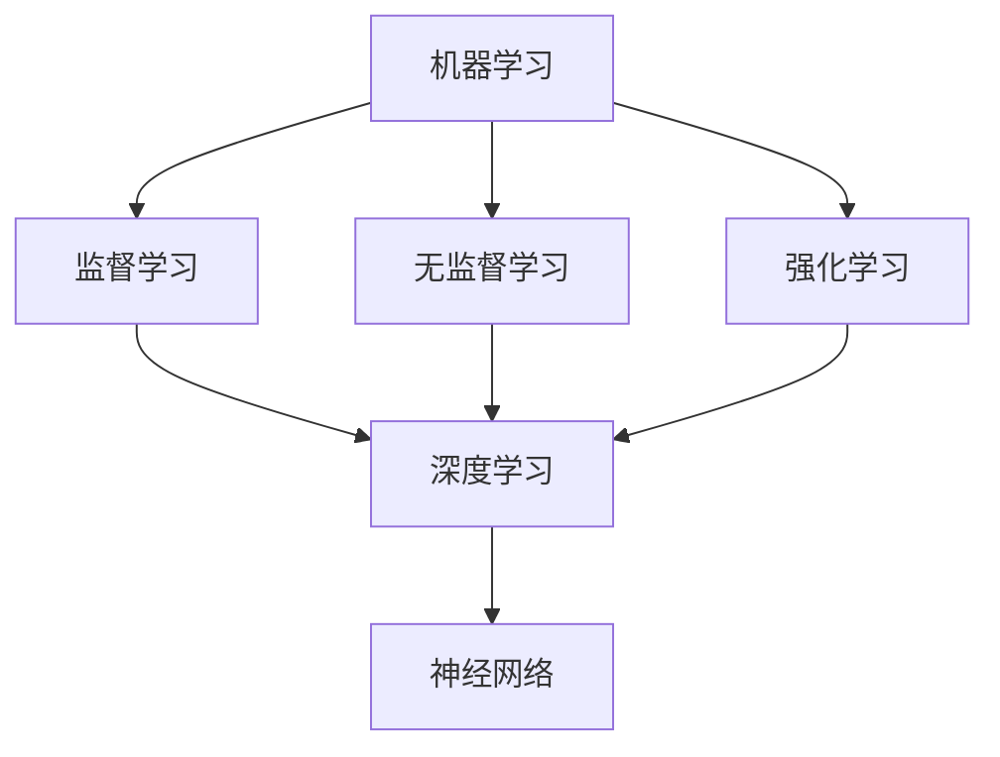

                 

关键词：人工智能、未来、发展目标、技术趋势、挑战、应用场景、解决方案

人工智能（AI）技术在过去几十年里取得了令人瞩目的进展，从早期的规则基础系统到今天的深度学习模型，AI在图像识别、自然语言处理、自动驾驶等领域都发挥了重要作用。然而，随着技术的不断进步，人工智能的未来发展目标也日益明晰。本文旨在探讨人工智能的未来发展方向，包括核心概念、算法原理、数学模型、应用实践以及面临的挑战和未来展望。

## 1. 背景介绍

自20世纪50年代人工智能（AI）概念首次提出以来，它已经成为计算机科学和工程领域的重要研究方向。早期的人工智能系统依赖于规则和符号逻辑，但它们在处理复杂问题时效率低下，适应性差。随着计算能力的提升和数据量的增加，20世纪80年代以来，机器学习（ML）特别是深度学习（DL）的发展为人工智能带来了新的突破。

深度学习通过多层神经网络模型对数据进行特征提取和分类，取得了在图像识别、语音识别、自然语言处理等领域的显著成果。近年来，人工智能技术不仅在学术界取得了重要突破，还在工业、医疗、金融等领域得到了广泛应用。

## 2. 核心概念与联系

为了理解人工智能的未来发展目标，我们需要首先明确几个核心概念：

- **机器学习（ML）**：机器学习是指通过算法从数据中自动学习和改进的系统。它包括监督学习、无监督学习和强化学习等不同类型。

- **深度学习（DL）**：深度学习是机器学习的一种，它使用多层神经网络来学习和模拟人类大脑的处理方式。

- **神经网络（NN）**：神经网络是由大量相互连接的节点（或称为神经元）组成的计算模型，能够通过学习输入和输出之间的映射关系来解决问题。

下面是一个简单的Mermaid流程图，展示了这些核心概念之间的联系：



### 2.1 机器学习

机器学习是人工智能的核心概念之一。它通过算法从数据中自动学习和改进，从而实现对未知数据的预测和决策。机器学习可以分为以下几类：

- **监督学习**：在监督学习中，模型通过已标记的输入和输出数据来学习。常见的算法包括线性回归、支持向量机、决策树和神经网络等。

- **无监督学习**：无监督学习不使用已标记的数据，而是通过发现数据中的隐藏结构和模式来学习。常见的算法包括聚类和主成分分析等。

- **强化学习**：强化学习是一种交互式学习方式，模型通过与环境的交互来学习最优策略。常见的算法包括Q学习和深度强化学习等。

### 2.2 深度学习

深度学习是机器学习的一个重要分支，它通过多层神经网络对数据进行特征提取和分类。深度学习在图像识别、语音识别、自然语言处理等领域取得了显著的成果。深度学习的关键在于其能够自动学习和提取数据中的复杂特征，从而实现高精度的预测和分类。

### 2.3 神经网络

神经网络是深度学习的基础，它由大量相互连接的节点（或称为神经元）组成。每个神经元都可以接收输入信号、进行加权求和处理，并输出一个激活值。神经网络通过多层结构来逐层提取数据中的特征，最终实现对输入数据的分类或回归。

## 3. 核心算法原理 & 具体操作步骤

### 3.1 算法原理概述

深度学习的核心在于神经网络，而神经网络的训练过程是通过反向传播算法来优化的。反向传播算法是一种通过反向传播误差信号来更新网络权重和偏置的方法。具体步骤如下：

1. **前向传播**：输入数据通过网络的各个层进行传播，每个神经元计算出输出值。

2. **计算误差**：将输出值与实际标签进行比较，计算损失函数的值。

3. **反向传播**：将损失函数的误差反向传播回网络的各个层，计算每个神经元的梯度。

4. **权重更新**：使用梯度下降或其他优化算法更新网络权重和偏置。

### 3.2 算法步骤详解

以下是深度学习训练过程的详细步骤：

1. **初始化权重**：随机初始化网络的权重和偏置。

2. **前向传播**：
    - 将输入数据输入到网络的输入层。
    - 通过网络的隐藏层进行计算，得到中间输出值。
    - 输出层得到最终的预测值。

3. **计算误差**：
    - 使用损失函数计算预测值与实际标签之间的误差。
    - 常见的损失函数包括均方误差（MSE）、交叉熵损失等。

4. **反向传播**：
    - 计算输出层的梯度。
    - 将梯度反向传播到隐藏层，逐层计算每个神经元的梯度。

5. **权重更新**：
    - 使用梯度下降或其他优化算法更新网络权重和偏置。
    - 目的是减小损失函数的值。

6. **迭代优化**：重复上述步骤，直到达到预设的迭代次数或损失函数值收敛。

### 3.3 算法优缺点

深度学习算法具有以下优点：

- **强大的特征提取能力**：深度学习能够自动从数据中提取复杂的特征，从而提高模型的泛化能力。

- **高精度**：深度学习在图像识别、语音识别等领域的表现远超传统的机器学习算法。

- **自适应性强**：深度学习模型可以通过调整网络结构和超参数来适应不同的应用场景。

然而，深度学习也存在一些缺点：

- **计算资源需求高**：深度学习模型通常需要大量的计算资源和时间来训练和优化。

- **对数据依赖性强**：深度学习模型对训练数据的质量和数量有较高的要求，否则容易过拟合。

### 3.4 算法应用领域

深度学习在多个领域取得了显著的成果，以下是其中一些重要的应用领域：

- **图像识别**：深度学习模型在图像分类、目标检测、图像分割等领域表现优异。

- **语音识别**：深度学习在语音识别任务中取得了显著突破，使得语音识别的准确性大幅提高。

- **自然语言处理**：深度学习在文本分类、机器翻译、情感分析等自然语言处理任务中发挥了重要作用。

## 4. 数学模型和公式 & 详细讲解 & 举例说明

### 4.1 数学模型构建

深度学习模型通常由多个层组成，包括输入层、隐藏层和输出层。每个层由多个神经元组成，神经元之间的连接通过权重进行调节。神经元的输出通过激活函数进行非线性变换，从而实现对数据的复杂变换和特征提取。

### 4.2 公式推导过程

深度学习模型的训练过程涉及多个数学公式。以下是其中一些重要的公式：

- **前向传播**：
  $$ z^{(l)} = \sigma(W^{(l)} \cdot a^{(l-1)} + b^{(l)}) $$
  $$ a^{(l)} = \sigma(z^{(l)}) $$

  其中，$a^{(l)}$ 表示第 $l$ 层的输出，$z^{(l)}$ 表示第 $l$ 层的输入，$W^{(l)}$ 表示第 $l$ 层的权重，$b^{(l)}$ 表示第 $l$ 层的偏置，$\sigma$ 表示激活函数。

- **反向传播**：
  $$ \delta^{(l)} = \frac{\partial J}{\partial z^{(l)}} \odot \frac{\partial \sigma}{\partial z^{(l)}} $$
  $$ \frac{\partial J}{\partial W^{(l)}} = a^{(l-1)} \cdot \delta^{(l)} $$
  $$ \frac{\partial J}{\partial b^{(l)}} = \delta^{(l)} $$

  其中，$\delta^{(l)}$ 表示第 $l$ 层的误差，$J$ 表示损失函数。

### 4.3 案例分析与讲解

下面以一个简单的多层感知机（MLP）模型为例，展示如何使用这些公式进行训练。

假设我们有一个二分类问题，输入数据为 $x = [1, 2, 3]$，标签为 $y = [0, 1]$。我们的目标是训练一个模型来预测输入数据的类别。

1. **初始化参数**：
   - 随机初始化权重 $W^{(1)}$ 和偏置 $b^{(1)}$。
   - 随机初始化权重 $W^{(2)}$ 和偏置 $b^{(2)}$。

2. **前向传播**：
   - 输入数据 $x$ 通过输入层传递到隐藏层。
   - 计算隐藏层的输出 $a^{(1)}$。

3. **计算误差**：
   - 计算输出层的预测值 $y' = \sigma(W^{(2)} \cdot a^{(1)} + b^{(2)})$。
   - 计算损失函数 $J = -y \cdot \log(y') - (1 - y) \cdot \log(1 - y')$。

4. **反向传播**：
   - 计算输出层的误差 $\delta^{(2)} = y' - y$。
   - 计算隐藏层的误差 $\delta^{(1)} = a^{(1)} \cdot (1 - a^{(1)}) \cdot \delta^{(2)} \cdot W^{(2)}$。

5. **权重更新**：
   - 更新隐藏层到输出层的权重 $W^{(2)}$ 和偏置 $b^{(2)}$。
   - 更新输入层到隐藏层的权重 $W^{(1)}$ 和偏置 $b^{(1)}$。

6. **迭代优化**：
   - 重复上述步骤，直到达到预设的迭代次数或损失函数值收敛。

## 5. 项目实践：代码实例和详细解释说明

在本节中，我们将使用Python和TensorFlow框架来实现一个简单的多层感知机（MLP）模型，并对其进行训练和评估。

### 5.1 开发环境搭建

要运行下面的代码实例，需要安装以下库：

- TensorFlow：用于构建和训练神经网络。
- NumPy：用于数值计算。

安装命令如下：

```bash
pip install tensorflow numpy
```

### 5.2 源代码详细实现

以下是一个简单的MLP模型实现，用于二分类问题：

```python
import tensorflow as tf
import numpy as np

# 初始化参数
input_size = 3
hidden_size = 4
output_size = 1

# 创建随机权重和偏置
W1 = tf.random.normal([input_size, hidden_size])
b1 = tf.random.normal([hidden_size])
W2 = tf.random.normal([hidden_size, output_size])
b2 = tf.random.normal([output_size])

# 定义激活函数
sigma = tf.nn.sigmoid

# 定义损失函数
loss_fn = tf.nn.sigmoid_cross_entropy_with_logits

# 定义前向传播
def forward(x):
    a1 = sigma(tf.matmul(x, W1) + b1)
    y_pred = sigma(tf.matmul(a1, W2) + b2)
    return y_pred

# 定义反向传播
def backward(x, y):
    y_pred = forward(x)
    with tf.GradientTape() as tape:
        loss = loss_fn(y, y_pred)
    gradients = tape.gradient(loss, [W1, b1, W2, b2])
    W1.assign_sub(gradients[0])
    b1.assign_sub(gradients[1])
    W2.assign_sub(gradients[2])
    b2.assign_sub(gradients[3])
    return loss

# 训练模型
for i in range(1000):
    loss = backward(x, y)
    if i % 100 == 0:
        print(f"Epoch {i}: Loss = {loss.numpy()}")

# 评估模型
y_pred = forward(x)
print(f"Predicted class: {y_pred.numpy()}")
```

### 5.3 代码解读与分析

1. **初始化参数**：我们首先定义了输入层、隐藏层和输出层的大小。然后创建随机权重和偏置，用于初始化网络。

2. **定义激活函数**：我们使用Sigmoid函数作为激活函数，因为它可以很好地处理0和1之间的输出。

3. **定义损失函数**：我们使用Sigmoid交叉熵损失函数，因为它适合二分类问题。

4. **定义前向传播**：前向传播函数将输入数据通过网络的各个层进行传播，最终得到预测值。

5. **定义反向传播**：反向传播函数使用梯度下降法来更新网络权重和偏置。

6. **训练模型**：我们在训练循环中迭代更新网络参数，并打印损失函数值。

7. **评估模型**：我们在最后一步使用训练好的模型来预测输入数据的类别。

## 6. 实际应用场景

深度学习在多个领域都取得了显著的成果，以下是一些实际应用场景：

- **医疗健康**：深度学习可以用于医疗图像分析、疾病预测和个性化医疗。例如，深度学习模型可以用于肺癌筛查、乳腺癌诊断等。

- **自动驾驶**：深度学习在自动驾驶领域发挥了重要作用，包括车辆检测、道路识别、行人检测等。

- **金融**：深度学习可以用于金融市场的预测、风险管理和欺诈检测。

- **零售**：深度学习可以用于商品推荐、库存管理和需求预测。

- **制造业**：深度学习可以用于设备故障预测、生产优化和质量控制。

## 7. 未来应用展望

随着人工智能技术的不断发展，未来将出现更多创新的应用场景。以下是几个可能的未来应用方向：

- **智能助手**：智能助手将更加智能化，能够更好地理解自然语言并执行复杂的任务。

- **智能医疗**：基于人工智能的辅助诊断和治疗系统将变得更加普及，提高医疗效率和准确性。

- **智能交通**：智能交通系统将实现自动驾驶、智能信号控制和实时交通流量管理。

- **智能制造**：智能制造将实现更高效率的生产和更精确的质量控制。

## 8. 工具和资源推荐

### 8.1 学习资源推荐

- 《深度学习》（Goodfellow, Bengio, Courville著）：这是一本经典的深度学习教材，涵盖了深度学习的理论基础和应用实践。
- 《Python深度学习》（François Chollet著）：这是一本针对Python编程和深度学习的入门书籍，适合初学者。
- fast.ai：这是一个提供免费在线课程的网站，涵盖了深度学习的基础知识和应用实践。

### 8.2 开发工具推荐

- TensorFlow：这是一个开源的深度学习框架，适用于构建和训练复杂的深度学习模型。
- PyTorch：这是一个开源的深度学习框架，以其灵活性和动态计算图而受到广泛使用。
- Keras：这是一个基于TensorFlow和PyTorch的高层神经网络API，适用于快速搭建和训练深度学习模型。

### 8.3 相关论文推荐

- “A Tutorial on Deep Learning” by Liang Wang and Younes Messaoud
- “Deep Learning for Natural Language Processing” by Kyunghyun Cho
- “Deep Learning for Speech Recognition” by Kuldip K. Paliwal

## 9. 总结：未来发展趋势与挑战

### 9.1 研究成果总结

过去几十年，人工智能取得了显著的进展，特别是在深度学习领域。深度学习模型在图像识别、语音识别、自然语言处理等方面表现优异，推动了人工智能技术的广泛应用。

### 9.2 未来发展趋势

未来，人工智能将继续在多个领域取得突破，包括智能助手、智能医疗、智能交通、智能制造等。同时，随着计算能力的提升和算法的优化，人工智能将变得更加高效和普及。

### 9.3 面临的挑战

尽管人工智能取得了显著进展，但仍面临一些挑战，包括数据隐私、算法透明度、公平性和可解释性等。此外，人工智能的发展也需要关注伦理和社会影响。

### 9.4 研究展望

未来，人工智能研究将继续朝着更加智能化、自主化、高效化的方向发展。同时，研究应关注如何平衡技术进步与社会发展，确保人工智能技术的可持续发展。

## 10. 附录：常见问题与解答

### 10.1 人工智能是什么？

人工智能（AI）是指由计算机系统执行的任务，这些任务通常需要人类智能才能完成，例如视觉识别、语言理解、决策制定等。

### 10.2 深度学习和机器学习有什么区别？

机器学习是人工智能的一个分支，它涉及使用算法从数据中学习。深度学习是机器学习的一种，它使用多层神经网络来提取数据中的复杂特征。

### 10.3 如何选择合适的深度学习框架？

选择深度学习框架时，应考虑项目需求、开发环境和个人技能。TensorFlow和PyTorch是两个流行的框架，适用于不同的应用场景。

### 10.4 人工智能对社会有哪些影响？

人工智能对社会有着广泛的影响，包括提高生产效率、改善医疗健康、促进经济发展等。然而，人工智能也可能引发一些社会问题，如就业变化、数据隐私和安全等。

---

作者：禅与计算机程序设计艺术 / Zen and the Art of Computer Programming
----------------------------------------------------------------
---

以上就是关于《Andrej Karpathy：人工智能的未来发展目标》的文章。本文详细探讨了人工智能的核心概念、算法原理、数学模型、应用实践以及面临的挑战和未来展望。希望本文能够为读者提供对人工智能技术的深入理解和未来发展趋势的洞察。作者在此感谢读者的关注和支持。如果您有任何问题或建议，欢迎在评论区留言。

