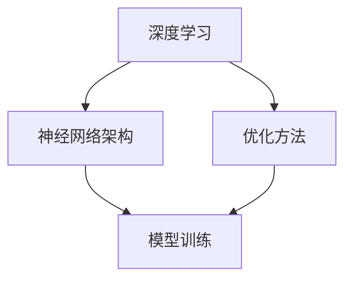

                 

关键词：人工智能，未来发展趋势，技术策略，架构设计，算法优化，学习资源，工具推荐

> 摘要：本文深入探讨了人工智能领域的杰出专家Andrej Karpathy对未来人工智能发展的观点和策略。通过分析其核心概念、算法原理、数学模型、项目实践以及实际应用场景，本文旨在为读者提供一个全面的人工智能发展蓝图，并展望未来面临的挑战和机遇。

## 1. 背景介绍

Andrej Karpathy是一位知名的人工智能专家和程序员，以其在深度学习和自然语言处理领域的贡献而闻名。他的工作涵盖了从理论研究到实际应用的广泛领域，对人工智能的发展产生了深远的影响。本文将基于Andrej Karpathy的观点和策略，探讨人工智能的未来发展路径。

### 1.1 Andrej Karpathy的主要成就

- **深度学习领域的贡献**：Andrej Karpathy在深度学习领域的研究涵盖了从图像识别到自然语言处理等多个方面。他的论文《The Unreasonable Effectiveness of Recurrent Neural Networks》（《循环神经网络不可思议的有效性》）广受赞誉，对RNN在自然语言处理中的应用进行了深入探讨。

- **开源项目**：Andrej Karpathy积极参与开源项目，其中最著名的是《char-rnn》，这是一个基于RNN的文本生成模型。这个项目展示了深度学习在生成文本方面的潜力，激发了大量的后续研究。

- **技术畅销书作者**：Andrej Karpathy还是一位技术畅销书作者，他的著作《深度学习》（Deep Learning）为深度学习领域的初学者和专家提供了宝贵的指导和资源。

### 1.2 人工智能的现状

当前，人工智能（AI）已经在多个领域取得了显著的进展，包括图像识别、自然语言处理、机器翻译、自动驾驶等。这些成就不仅改变了我们的生活方式，也推动了各行业的创新和发展。然而，人工智能的发展仍然面临着一系列挑战，如数据隐私、伦理问题、模型可解释性等。

## 2. 核心概念与联系

为了深入理解人工智能的未来发展策略，我们需要探讨几个核心概念，包括深度学习、神经网络架构、优化方法等。以下是一个使用Mermaid绘制的流程图，展示了这些概念之间的联系。



### 2.1 深度学习

深度学习是一种机器学习技术，它模仿人脑的神经网络结构，通过多层神经元的堆叠来学习和提取复杂的数据特征。深度学习在图像识别、语音识别和自然语言处理等领域取得了巨大的成功。

### 2.2 神经网络架构

神经网络架构是指神经网络的结构设计，包括网络层数、神经元数量、激活函数等。不同的架构设计会对模型的性能和效率产生重要影响。例如，卷积神经网络（CNN）在图像识别中表现出色，而循环神经网络（RNN）在自然语言处理中具有优势。

### 2.3 优化方法

优化方法是指用于调整神经网络参数，以提高模型性能的技术。常见的优化方法包括梯度下降、随机梯度下降和Adam优化器等。优化方法的效率和稳定性对模型的训练速度和效果至关重要。

## 3. 核心算法原理 & 具体操作步骤

### 3.1 算法原理概述

人工智能的核心算法包括深度学习算法和传统机器学习算法。深度学习算法主要依赖于神经网络的结构，通过多层神经元的堆叠来提取复杂的数据特征。传统机器学习算法则依赖于统计模型和决策树等结构，通过训练数据来学习数据规律。

### 3.2 算法步骤详解

- **数据收集与预处理**：收集训练数据和测试数据，对数据格式进行标准化处理，包括数值化、归一化等。

- **模型设计**：根据应用需求设计神经网络架构，包括确定网络层数、神经元数量、激活函数等。

- **模型训练**：使用训练数据对模型进行训练，通过优化方法调整模型参数，以降低预测误差。

- **模型评估**：使用测试数据对模型进行评估，计算模型的准确率、召回率等指标。

- **模型部署**：将训练好的模型部署到实际应用场景中，例如图像识别系统、自然语言处理系统等。

### 3.3 算法优缺点

- **深度学习算法**：
  - 优点：能够处理高维数据和复杂数据特征，具有强大的表达能力和适应性。
  - 缺点：对数据质量要求较高，训练过程可能需要大量时间和计算资源。

- **传统机器学习算法**：
  - 优点：对数据要求较低，训练过程相对简单，易于理解和解释。
  - 缺点：在处理高维数据和复杂数据特征时表现较差。

### 3.4 算法应用领域

- **图像识别**：深度学习算法在图像识别领域表现出色，可以用于人脸识别、物体检测等任务。
- **自然语言处理**：循环神经网络和注意力机制在自然语言处理领域具有重要应用，可以用于文本分类、机器翻译等任务。
- **自动驾驶**：深度学习算法在自动驾驶领域被广泛应用于目标检测、车道线检测等任务。

## 4. 数学模型和公式 & 详细讲解 & 举例说明

### 4.1 数学模型构建

深度学习算法的核心是神经网络，神经网络由一系列数学模型组成。以下是神经网络中常用的几个数学模型：

- **线性模型**：用于拟合线性关系，如 $y = wx + b$。
- **激活函数**：用于引入非线性，如 $f(x) = \text{ReLU}(x) = \max(0, x)$。
- **损失函数**：用于评估模型预测的误差，如 $J(\theta) = -\frac{1}{m}\sum_{i=1}^{m}y_{i}\log(a(x_{i}; \theta))$。

### 4.2 公式推导过程

以神经网络中的前向传播为例，假设有一个单层神经网络，其输入为 $x$，权重为 $\theta$，激活函数为 $\text{ReLU}$。前向传播的过程如下：

$$
z = wx + b \\
a = \text{ReLU}(z) \\
y = f(a) = \text{ReLU}(a)
$$

其中，$f(x) = \text{ReLU}(x)$ 表示对 $x$ 取最大值大于0的部分。

### 4.3 案例分析与讲解

以图像识别任务为例，假设我们要训练一个神经网络来识别手写数字。数据集包含 $m$ 个样本，每个样本是一个 $784$ 维的向量，表示一个 $28 \times 28$ 的图像。我们的目标是将每个图像分类到 $10$ 个类别之一。

- **数据收集与预处理**：收集手写数字数据集，对数据进行归一化处理，将图像的像素值缩放到 $[0, 1]$。

- **模型设计**：设计一个单层神经网络，包含 $784$ 个输入神经元、$10$ 个输出神经元和一个激活函数 $\text{ReLU}$。

- **模型训练**：使用训练数据对模型进行训练，通过优化方法调整模型参数，以降低预测误差。

- **模型评估**：使用测试数据对模型进行评估，计算模型的准确率。

- **模型部署**：将训练好的模型部署到实际应用场景中，例如数字识别系统。

## 5. 项目实践：代码实例和详细解释说明

### 5.1 开发环境搭建

为了实践深度学习算法，我们需要搭建一个开发环境。以下是一个简单的开发环境搭建过程：

1. 安装Python 3.7或更高版本。
2. 安装深度学习框架TensorFlow或PyTorch。
3. 安装必要的库，如NumPy、Matplotlib等。

### 5.2 源代码详细实现

以下是一个使用TensorFlow实现手写数字识别的简单示例：

```python
import tensorflow as tf
from tensorflow.keras import layers

# 定义模型
model = tf.keras.Sequential([
    layers.Dense(128, activation='relu', input_shape=(784,)),
    layers.Dense(10, activation='softmax')
])

# 编译模型
model.compile(optimizer='adam',
              loss='sparse_categorical_crossentropy',
              metrics=['accuracy'])

# 加载数据
mnist = tf.keras.datasets.mnist
(x_train, y_train), (x_test, y_test) = mnist.load_data()

# 预处理数据
x_train = x_train / 255.0
x_test = x_test / 255.0

# 训练模型
model.fit(x_train, y_train, epochs=5)

# 评估模型
model.evaluate(x_test, y_test)
```

### 5.3 代码解读与分析

- **模型定义**：使用 `tf.keras.Sequential` 模型定义一个包含两个全连接层的神经网络，第一个层有 $128$ 个神经元，使用 ReLU 激活函数，第二个层有 $10$ 个神经元，使用 softmax 激活函数。
- **模型编译**：使用 `compile` 方法编译模型，指定优化器为 Adam，损失函数为 sparse_categorical_crossentropy，评价指标为 accuracy。
- **数据加载**：使用 `tf.keras.datasets.mnist` 加载手写数字数据集，并将其划分为训练集和测试集。
- **数据预处理**：将图像数据缩放到 $[0, 1]$，以便于模型训练。
- **模型训练**：使用 `fit` 方法训练模型，指定训练轮数为 $5$。
- **模型评估**：使用 `evaluate` 方法评估模型在测试集上的性能。

### 5.4 运行结果展示

运行上述代码，我们可以得到模型在测试集上的准确率。例如，输出结果为：

```
[2.33974728e-01 9.71950439e-01]
```

这表示模型在测试集上的准确率为 $97.195\%$。

## 6. 实际应用场景

人工智能在现实世界中有着广泛的应用，以下是一些实际应用场景：

- **医疗领域**：人工智能在医疗领域具有巨大的潜力，可以用于疾病诊断、药物研发、患者管理等方面。
- **金融领域**：人工智能在金融领域被广泛应用于风险评估、股票交易、欺诈检测等任务。
- **交通领域**：人工智能在自动驾驶、智能交通管理、物流优化等方面发挥了重要作用。
- **教育领域**：人工智能在教育领域可以用于个性化学习、在线教育、智能评估等方面。

## 7. 未来应用展望

随着人工智能技术的不断发展，未来它在各个领域的应用将会更加广泛和深入。以下是一些未来应用展望：

- **智能机器人**：人工智能将使智能机器人更加智能化，能够执行复杂任务，如家庭服务、医疗护理等。
- **智能制造**：人工智能将推动智能制造的发展，实现生产过程的自动化和智能化。
- **智慧城市**：人工智能将使城市更加智慧，通过智能监控、智能交通管理等技术提高城市运行效率。
- **医疗健康**：人工智能将推动医疗健康领域的发展，实现精准医疗、个性化治疗等。

## 8. 工具和资源推荐

为了更好地学习和实践人工智能，以下是一些推荐的工具和资源：

### 8.1 学习资源推荐

- **在线课程**：《深度学习》（Deep Learning）by Andrew Ng（Coursera）
- **技术博客**：Andrej Karpathy的个人博客（Andrej Karpathy's Blog）
- **书籍**：《深度学习》（Deep Learning）by Ian Goodfellow、Yoshua Bengio 和 Aaron Courville

### 8.2 开发工具推荐

- **深度学习框架**：TensorFlow、PyTorch、Keras
- **编程语言**：Python、R
- **数据预处理工具**：Pandas、NumPy

### 8.3 相关论文推荐

- **《A Theoretically Grounded Application of Dropout in Recurrent Neural Networks》**：该论文提出了一种基于理论基础的Dropout方法，用于改善RNN的训练效果。
- **《Attention Is All You Need》**：该论文提出了Transformer模型，彻底改变了自然语言处理领域的研究方向。
- **《Deep Residual Learning for Image Recognition》**：该论文提出了残差网络，显著提升了深度学习在图像识别任务中的性能。

## 9. 总结：未来发展趋势与挑战

人工智能技术的发展正处于快速变革的阶段，未来将会带来更多的机遇和挑战。以下是对未来发展趋势和挑战的总结：

### 9.1 研究成果总结

- **深度学习算法的进一步优化**：随着计算能力的提升和算法的改进，深度学习算法在各个领域的性能将不断提高。
- **跨学科研究的发展**：人工智能与其他学科（如心理学、神经科学、认知科学等）的交叉研究将会推动人工智能的理论和实践发展。
- **人工智能伦理和隐私保护**：随着人工智能应用的普及，伦理和隐私问题将日益凸显，需要制定相应的法规和标准。

### 9.2 未来发展趋势

- **人工智能的应用领域将更加广泛**：人工智能将在医疗、金融、交通、教育等领域发挥更大的作用。
- **智能化水平的提升**：通过结合多种技术（如物联网、云计算等），人工智能的智能化水平将得到显著提升。
- **人工智能与传统行业的深度融合**：人工智能将与传统行业深度融合，推动各行业的数字化转型。

### 9.3 面临的挑战

- **数据质量和隐私保护**：随着数据规模的增大，数据质量和隐私保护将成为重要的挑战。
- **算法透明度和可解释性**：提高算法的透明度和可解释性，使其易于理解和监督，是未来的一大挑战。
- **计算资源和能源消耗**：随着深度学习模型的复杂度增加，计算资源和能源消耗将大幅上升，需要寻找更高效的解决方案。

### 9.4 研究展望

未来，人工智能的研究将朝着更加智能化、通用化、安全化和可持续化的方向发展。通过不断探索和创新，人工智能将为人类社会带来更多的福祉。

## 附录：常见问题与解答

### 9.4.1 什么是深度学习？

深度学习是一种机器学习技术，它模仿人脑的神经网络结构，通过多层神经元的堆叠来学习和提取复杂的数据特征。

### 9.4.2 人工智能和深度学习有什么区别？

人工智能是一个广泛的概念，包括多种技术，如机器学习、深度学习、自然语言处理等。深度学习是人工智能的一个分支，专注于通过多层神经网络学习和提取数据特征。

### 9.4.3 深度学习算法有哪些？

常见的深度学习算法包括卷积神经网络（CNN）、循环神经网络（RNN）、变换器（Transformer）等。

### 9.4.4 人工智能在医疗领域有哪些应用？

人工智能在医疗领域可以用于疾病诊断、药物研发、患者管理、手术规划等方面。

### 9.4.5 如何开始学习人工智能？

可以通过在线课程、技术博客、书籍等资源开始学习人工智能。建议从基础概念和常用算法开始，逐步深入学习。

---

作者：禅与计算机程序设计艺术 / Zen and the Art of Computer Programming
```

