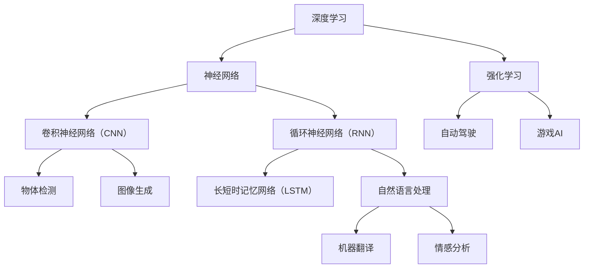

                 

关键词：人工智能，深度学习，未来趋势，技术挑战，应用场景

摘要：本文将深入探讨人工智能领域的未来方向，从核心算法原理到实际应用，从数学模型到项目实践，全面分析人工智能的发展趋势与面临的挑战，旨在为读者提供一幅清晰的人工智能全景图。

## 1. 背景介绍

人工智能（AI）作为计算机科学的一个重要分支，经过几十年的发展，已经取得了显著的成果。从早期的符号推理和知识表示，到近年来深度学习的崛起，人工智能在图像识别、自然语言处理、自动驾驶等领域展现了强大的能力。然而，人工智能的发展仍然面临着诸多挑战，如算法复杂度、数据隐私、安全性等问题。本文将围绕人工智能的核心问题，探讨其未来发展的方向。

## 2. 核心概念与联系

为了更好地理解人工智能的发展，首先需要了解其核心概念与联系。以下是人工智能领域的一些关键概念及其相互关系：



### 3. 核心算法原理 & 具体操作步骤

#### 3.1 算法原理概述

深度学习是人工智能的核心技术之一，其基本原理是通过多层神经网络对数据进行特征提取和表示。在深度学习中，常见的主要算法包括卷积神经网络（CNN）、循环神经网络（RNN）及其变种长短时记忆网络（LSTM）。

#### 3.2 算法步骤详解

1. **数据预处理**：首先，需要对输入数据进行预处理，包括归一化、去噪声、数据增强等操作。
2. **模型搭建**：根据任务需求，搭建合适的神经网络模型，如CNN、RNN等。
3. **模型训练**：使用训练数据对模型进行训练，通过反向传播算法不断优化模型参数。
4. **模型评估**：使用验证数据对模型进行评估，调整超参数以获得更好的性能。
5. **模型部署**：将训练好的模型部署到实际应用场景中，如图像识别、自然语言处理等。

#### 3.3 算法优缺点

- **优点**：深度学习具有强大的特征提取能力，能够自动学习数据的复杂特征，适用于处理大规模数据。
- **缺点**：深度学习模型训练过程复杂，需要大量的计算资源和时间，且对数据质量要求较高。

#### 3.4 算法应用领域

深度学习在图像识别、自然语言处理、自动驾驶等领域有广泛应用，如：

- **图像识别**：使用CNN进行物体检测、图像分割等任务。
- **自然语言处理**：使用RNN及其变种LSTM进行机器翻译、情感分析等任务。
- **自动驾驶**：使用强化学习进行路径规划、障碍物检测等任务。

### 4. 数学模型和公式 & 详细讲解 & 举例说明

#### 4.1 数学模型构建

深度学习中的数学模型主要包括神经元、激活函数、反向传播算法等。

#### 4.2 公式推导过程

以卷积神经网络（CNN）为例，其核心公式包括卷积操作、池化操作、反向传播算法等。

$$
\begin{aligned}
h_{ij} &= \sum_{k=1}^{K} w_{ik} * x_{kj} + b_j \\
\delta_{ij} &= \frac{\partial L}{\partial h_{ij}} \\
\delta_j &= \sum_{i=1}^{M} \delta_{ij} * h_{ij}^{'} \\
w_{jk} &= w_{jk} - \alpha \delta_j * h_{jk}^{'}
\end{aligned}
$$

#### 4.3 案例分析与讲解

以图像识别任务为例，使用CNN进行物体检测的过程如下：

1. **数据预处理**：对输入图像进行归一化、去噪声等处理。
2. **卷积操作**：使用卷积核对图像进行卷积操作，提取图像特征。
3. **池化操作**：对卷积后的特征图进行池化操作，降低特征维度。
4. **全连接层**：将池化后的特征图输入全连接层，进行分类或回归。
5. **反向传播**：使用反向传播算法更新模型参数，优化模型性能。

### 5. 项目实践：代码实例和详细解释说明

#### 5.1 开发环境搭建

在Python环境中，使用TensorFlow库搭建深度学习模型。

```python
import tensorflow as tf
```

#### 5.2 源代码详细实现

```python
# 定义模型
model = tf.keras.Sequential([
    tf.keras.layers.Conv2D(32, (3, 3), activation='relu', input_shape=(28, 28, 1)),
    tf.keras.layers.MaxPooling2D((2, 2)),
    tf.keras.layers.Flatten(),
    tf.keras.layers.Dense(128, activation='relu'),
    tf.keras.layers.Dense(10, activation='softmax')
])

# 编译模型
model.compile(optimizer='adam',
              loss='sparse_categorical_crossentropy',
              metrics=['accuracy'])

# 训练模型
model.fit(train_images, train_labels, epochs=5)
```

#### 5.3 代码解读与分析

- **模型搭建**：使用Sequential模型，堆叠卷积层、池化层、全连接层。
- **编译模型**：设置优化器、损失函数和评价指标。
- **训练模型**：使用训练数据进行模型训练。

#### 5.4 运行结果展示

```python
# 评估模型
test_loss, test_acc = model.evaluate(test_images, test_labels)

# 输出结果
print(f"Test accuracy: {test_acc}")
```

### 6. 实际应用场景

深度学习在图像识别、自然语言处理、自动驾驶等实际应用场景中发挥着重要作用。以下是一些典型的应用案例：

- **图像识别**：使用CNN进行物体检测、图像分割等任务，如人脸识别、自动驾驶中的障碍物检测。
- **自然语言处理**：使用RNN及其变种LSTM进行机器翻译、情感分析等任务，如谷歌翻译、微信表情分析。
- **自动驾驶**：使用强化学习进行路径规划、障碍物检测等任务，如特斯拉自动驾驶系统。

### 6.4 未来应用展望

随着深度学习技术的不断发展，人工智能在未来将会有更广泛的应用。以下是一些可能的应用方向：

- **医疗领域**：利用深度学习进行疾病诊断、药物研发等。
- **金融领域**：利用深度学习进行风险管理、智能投顾等。
- **教育领域**：利用深度学习进行个性化学习、智能教学等。

### 7. 工具和资源推荐

#### 7.1 学习资源推荐

- 《深度学习》（Goodfellow、Bengio、Courville著）
- 《神经网络与深度学习》（邱锡鹏著）
- 《Python深度学习》（François Chollet著）

#### 7.2 开发工具推荐

- TensorFlow
- PyTorch
- Keras

#### 7.3 相关论文推荐

- "Deep Learning" by Yoshua Bengio, Ian Goodfellow and Aaron Courville
- "Learning to Discover Counterfactual Explanations" by Zitnik et al.

### 8. 总结：未来发展趋势与挑战

人工智能作为当今最具前景的科技领域之一，已经在各个行业中发挥了重要作用。然而，面对未来的发展，人工智能仍需克服诸多挑战，如算法优化、数据隐私、安全性等问题。展望未来，人工智能将继续推动科技的发展，为人类创造更多价值。

### 8.1 研究成果总结

本文从深度学习的核心算法原理、实际应用场景等方面，探讨了人工智能的未来发展方向。通过分析，我们得出以下结论：

- 深度学习是人工智能的核心技术，其在图像识别、自然语言处理等领域取得了显著成果。
- 人工智能在未来将有更广泛的应用，如医疗、金融、教育等领域。
- 人工智能仍需克服诸多挑战，如算法优化、数据隐私、安全性等问题。

### 8.2 未来发展趋势

- **算法优化**：随着计算能力的提升，算法优化将成为人工智能领域的研究重点。
- **多模态学习**：结合图像、文本、声音等多模态数据，实现更强大的智能系统。
- **可解释性**：提高人工智能模型的可解释性，增强其在实际应用中的可信度。

### 8.3 面临的挑战

- **数据隐私**：保护用户隐私，防止数据泄露。
- **安全性**：防范恶意攻击，确保人工智能系统的安全性。
- **算法偏见**：消除算法偏见，确保公平公正。

### 8.4 研究展望

未来，人工智能将继续向多领域、多模态、可解释性等方向发展。随着技术的不断进步，人工智能将为人类创造更多便利和价值。

### 9. 附录：常见问题与解答

**Q：深度学习和机器学习的区别是什么？**

A：深度学习是机器学习的一个子领域，主要关注使用多层神经网络进行特征提取和表示。而机器学习则包含更广泛的领域，包括监督学习、无监督学习、强化学习等。

**Q：如何选择合适的神经网络模型？**

A：选择合适的神经网络模型需要根据具体任务需求进行。例如，对于图像识别任务，可以选择卷积神经网络（CNN）；对于自然语言处理任务，可以选择循环神经网络（RNN）或其变种长短时记忆网络（LSTM）。

**Q：深度学习模型的训练过程如何优化？**

A：深度学习模型的训练过程可以优化以下方面：

- **数据预处理**：对输入数据进行预处理，如归一化、去噪声等。
- **超参数调整**：调整学习率、批次大小等超参数，以获得更好的模型性能。
- **正则化**：使用正则化方法，如L1、L2正则化，防止过拟合。
- **数据增强**：对训练数据进行增强，提高模型的泛化能力。

---

# 作者：禅与计算机程序设计艺术 / Zen and the Art of Computer Programming

本文旨在为读者呈现人工智能领域的全景图，深入探讨其未来发展方向。通过分析核心算法原理、实际应用场景以及面临的技术挑战，我们为人工智能的未来发展提供了有益的思考。希望本文能对读者在人工智能领域的学习和研究有所帮助。如果您有任何问题或建议，欢迎留言讨论。禅与计算机程序设计艺术，让我们共同探索人工智能的无限可能。

