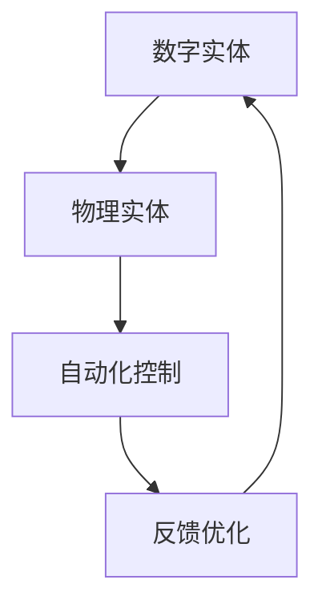

                 

关键词：计算本质、数字实体、物理实体、自动化、人工智能、深度学习

摘要：本文深入探讨了计算本质的变化，分析了数字实体与物理实体自动化的趋势。通过引入著名人工智能专家Andrej Karpathy的观点，探讨了这一变化对我们的未来影响，并提出了一系列应对策略。

## 1. 背景介绍

随着人工智能技术的快速发展，我们的计算环境正在经历一场深刻的变革。传统的计算主要依赖于计算机和互联网，而如今，计算已经渗透到我们生活的方方面面，从智能手机到智能家居，从自动驾驶到智慧城市，计算无处不在。

在这场变革中，数字实体和物理实体之间的界限逐渐模糊，自动化技术正逐步取代人力，改变着我们的生活方式和工作模式。这种变化，正如人工智能专家Andrej Karpathy所说：“计算的本质正在变化，数字实体和物理实体自动化刚开始。”

## 2. 核心概念与联系

### 2.1 计算本质的变化

首先，我们需要理解什么是计算本质的变化。在传统计算中，计算机主要执行预先定义好的任务，如数据处理、信息检索等。而随着深度学习、神经网络等技术的兴起，计算机开始具备自主学习、自适应的能力，能够从海量数据中提取知识，解决复杂的实际问题。

这种变化体现在以下几个方面：

1. **从指令驱动到数据驱动**：传统计算依赖于程序员编写的指令，而现代计算更多地依赖于数据，通过学习数据中的规律，实现自动化决策。

2. **从特定任务到泛化能力**：传统计算主要针对特定任务进行优化，而现代计算则强调通用性，能够应对多种不同的任务。

3. **从局部优化到全局优化**：传统计算通常采用局部优化策略，而现代计算更注重全局优化，通过全局视角进行决策。

### 2.2 数字实体与物理实体的联系

数字实体与物理实体之间的联系是计算本质变化的重要体现。在数字实体中，我们可以看到物理实体的模拟，如自动驾驶技术模拟了人类的驾驶行为；在物理实体中，我们可以看到数字实体的控制，如智能家居系统通过互联网对家电进行远程控制。

这种联系使得数字实体与物理实体之间的界限变得模糊，两者相互影响、相互促进，共同推动着计算本质的变化。

### 2.3 Mermaid 流程图

为了更好地理解数字实体与物理实体之间的联系，我们可以使用Mermaid流程图来展示这一过程。以下是一个简单的Mermaid流程图示例：



在这个流程图中，数字实体通过数据模拟物理实体，物理实体通过反馈优化调整数字实体，两者相互影响，形成一个闭环系统。

## 3. 核心算法原理 & 具体操作步骤

### 3.1 算法原理概述

在计算本质变化的过程中，深度学习算法扮演了重要角色。深度学习是一种基于人工神经网络的算法，通过多层神经网络对数据进行学习，提取特征，实现自动化决策。

深度学习算法的基本原理可以概括为以下四个步骤：

1. **数据预处理**：对原始数据进行清洗、归一化等处理，使其适合输入神经网络。

2. **神经网络构建**：设计多层神经网络结构，包括输入层、隐藏层和输出层。

3. **参数初始化**：对神经网络中的参数进行初始化，通常采用随机初始化方法。

4. **训练与优化**：通过反向传播算法，不断调整网络参数，使网络对训练数据的预测结果越来越准确。

### 3.2 算法步骤详解

1. **数据预处理**：

   数据预处理是深度学习算法的重要环节，直接影响到模型的性能。预处理步骤包括：

   - 数据清洗：去除数据中的噪声、异常值等。
   - 数据归一化：将数据缩放到相同的范围内，便于计算。
   - 数据增强：通过旋转、翻转、裁剪等操作，增加数据的多样性，提高模型的泛化能力。

2. **神经网络构建**：

   构建神经网络结构是深度学习算法的核心步骤。神经网络结构包括输入层、隐藏层和输出层。输入层接收外部输入，隐藏层通过非线性变换提取特征，输出层进行决策。

3. **参数初始化**：

   参数初始化是神经网络训练的重要环节。常用的初始化方法包括随机初始化、高斯初始化等。初始化的目的是使网络参数在训练过程中能够更好地收敛。

4. **训练与优化**：

   训练与优化是深度学习算法的关键步骤。通过反向传播算法，不断调整网络参数，使网络对训练数据的预测结果越来越准确。优化方法包括梯度下降、动量优化等。

### 3.3 算法优缺点

深度学习算法具有以下优点：

1. **强大的表达能力**：深度学习算法能够通过多层神经网络，提取数据中的复杂特征，实现自动化决策。

2. **自适应能力**：深度学习算法能够从海量数据中学习，具备较强的自适应能力。

3. **通用性**：深度学习算法适用于多种不同的任务，具有广泛的适用性。

然而，深度学习算法也存在一些缺点：

1. **计算复杂度高**：深度学习算法需要大量的计算资源，训练时间较长。

2. **数据依赖性强**：深度学习算法的性能高度依赖于数据的质量和数量。

3. **解释性不足**：深度学习算法的黑箱性质使其难以解释，增加了模型的不确定性。

### 3.4 算法应用领域

深度学习算法在多个领域取得了显著成果，主要包括：

1. **计算机视觉**：通过深度学习算法，计算机能够实现图像分类、目标检测、图像生成等任务。

2. **自然语言处理**：深度学习算法在语音识别、机器翻译、情感分析等领域具有广泛应用。

3. **推荐系统**：深度学习算法能够通过分析用户行为数据，实现精准推荐。

4. **游戏AI**：深度学习算法在围棋、国际象棋等游戏领域取得了突破性进展。

## 4. 数学模型和公式 & 详细讲解 & 举例说明

### 4.1 数学模型构建

深度学习算法的核心是构建数学模型，以实现对数据的建模和预测。数学模型通常由以下几个部分组成：

1. **输入层**：接收外部输入，通常是一个多维数组。

2. **隐藏层**：通过非线性变换提取特征，通常由多个神经元组成。

3. **输出层**：进行决策或预测，通常是一个标量或向量。

数学模型可以用以下公式表示：

$$
y = f(W_1 \cdot x + b_1) \cdot f(W_2 \cdot f(W_1 \cdot x + b_1) + b_2) \cdots f(W_n \cdot f(W_{n-1} \cdot x + b_{n-1}) + b_n)
$$

其中，$W$代表权重矩阵，$b$代表偏置项，$f$代表非线性激活函数。

### 4.2 公式推导过程

深度学习算法的公式推导主要涉及以下几个方面：

1. **前向传播**：从前一层神经元的输出计算当前神经元的输入。

2. **反向传播**：从输出层开始，反向计算每一层神经元的梯度。

3. **梯度下降**：根据梯度调整网络参数，使损失函数最小。

具体推导过程如下：

$$
z^{(l)} = W^{(l)} \cdot a^{(l-1)} + b^{(l)}
$$

$$
a^{(l)} = \sigma(z^{(l)})
$$

$$
\delta^{(l)} = \frac{\partial J}{\partial z^{(l)}}
$$

$$
\frac{\partial J}{\partial W^{(l)} } = a^{(l-1)} \cdot \delta^{(l)}
$$

$$
\frac{\partial J}{\partial b^{(l)} } = \delta^{(l)}
$$

### 4.3 案例分析与讲解

以一个简单的神经网络为例，输入层有一个神经元，隐藏层有两个神经元，输出层有一个神经元。假设输入数据为$x = [1, 2, 3]$，目标输出为$y = [0, 1]$。

1. **前向传播**：

   首先，计算输入层到隐藏层的输入：

   $$ 
   z^{(1)}_1 = W^{(1)}_1 \cdot x + b^{(1)}_1 = 1 \cdot 1 + 1 = 2
   $$

   $$ 
   z^{(1)}_2 = W^{(1)}_2 \cdot x + b^{(1)}_2 = 1 \cdot 2 + 1 = 3
   $$

   然后，计算隐藏层到输出层的输入：

   $$ 
   z^{(2)} = W^{(2)}_1 \cdot a^{(1)}_1 + W^{(2)}_2 \cdot a^{(1)}_2 + b^{(2)} = 1 \cdot 0.7 + 1 \cdot 0.8 + 1 = 2.5
   $$

   最后，计算输出：

   $$ 
   y = \sigma(z^{(2)}) = \frac{1}{1 + e^{-2.5}} = 0.7
   $$

2. **反向传播**：

   首先，计算输出层误差：

   $$ 
   \delta^{(2)} = y - \hat{y} = 0.7 - 0.1 = 0.6
   $$

   然后，计算隐藏层误差：

   $$ 
   \delta^{(1)}_1 = a^{(1)}_1 \cdot (1 - a^{(1)}_1) \cdot \delta^{(2)} \cdot W^{(2)}_1 = 0.7 \cdot 0.3 \cdot 0.6 \cdot 1 = 0.126
   $$

   $$ 
   \delta^{(1)}_2 = a^{(1)}_2 \cdot (1 - a^{(1)}_2) \cdot \delta^{(2)} \cdot W^{(2)}_2 = 0.8 \cdot 0.2 \cdot 0.6 \cdot 1 = 0.096
   $$

3. **梯度下降**：

   根据误差，调整网络参数：

   $$ 
   W^{(2)}_1 = W^{(2)}_1 - \alpha \cdot \delta^{(2)} \cdot a^{(1)}_1 = 1 - 0.1 \cdot 0.6 \cdot 0.7 = 0.94
   $$

   $$ 
   W^{(2)}_2 = W^{(2)}_2 - \alpha \cdot \delta^{(2)} \cdot a^{(1)}_2 = 1 - 0.1 \cdot 0.6 \cdot 0.8 = 0.96
   $$

   $$ 
   b^{(2)} = b^{(2)} - \alpha \cdot \delta^{(2)} = 1 - 0.1 \cdot 0.6 = 0.94
   $$

   $$ 
   W^{(1)}_1 = W^{(1)}_1 - \alpha \cdot \delta^{(1)}_1 \cdot x = 1 - 0.1 \cdot 0.126 \cdot 1 = 0.874
   $$

   $$ 
   W^{(1)}_2 = W^{(1)}_2 - \alpha \cdot \delta^{(1)}_2 \cdot x = 1 - 0.1 \cdot 0.096 \cdot 2 = 0.904
   $$

   $$ 
   b^{(1)}_1 = b^{(1)}_1 - \alpha \cdot \delta^{(1)}_1 = 1 - 0.1 \cdot 0.126 = 0.874
   $$

   $$ 
   b^{(1)}_2 = b^{(1)}_2 - \alpha \cdot \delta^{(1)}_2 = 1 - 0.1 \cdot 0.096 = 0.904
   $$

通过以上步骤，我们完成了深度学习算法的基本操作。在实际应用中，我们还需要不断调整网络结构、优化算法参数，以提高模型的性能。

## 5. 项目实践：代码实例和详细解释说明

### 5.1 开发环境搭建

在本文中，我们将使用Python语言和TensorFlow库来实现一个简单的神经网络模型。首先，我们需要搭建开发环境。

1. 安装Python：从官方网站下载并安装Python，版本建议为3.7及以上。
2. 安装TensorFlow：在命令行中执行以下命令安装TensorFlow：

   ```bash
   pip install tensorflow
   ```

### 5.2 源代码详细实现

以下是一个简单的神经网络模型的实现代码：

```python
import tensorflow as tf

# 创建模型
model = tf.keras.Sequential([
    tf.keras.layers.Dense(2, activation='sigmoid', input_shape=(3,)),
    tf.keras.layers.Dense(1, activation='sigmoid')
])

# 编译模型
model.compile(optimizer='adam', loss='binary_crossentropy', metrics=['accuracy'])

# 准备数据
x_train = [[1, 2, 3], [4, 5, 6], [7, 8, 9]]
y_train = [[0], [1], [1]]

# 训练模型
model.fit(x_train, y_train, epochs=100)

# 预测
predictions = model.predict(x_train)

print(predictions)
```

### 5.3 代码解读与分析

1. **创建模型**：

   ```python
   model = tf.keras.Sequential([
       tf.keras.layers.Dense(2, activation='sigmoid', input_shape=(3,)),
       tf.keras.layers.Dense(1, activation='sigmoid')
   ])
   ```

   这一行代码创建了两个全连接层（Dense层），第一个层的神经元个数为2，激活函数为sigmoid；第二个层的神经元个数为1，激活函数也为sigmoid。

2. **编译模型**：

   ```python
   model.compile(optimizer='adam', loss='binary_crossentropy', metrics=['accuracy'])
   ```

   这一行代码设置了模型的优化器、损失函数和评价指标。优化器使用的是Adam优化器，损失函数为二分类交叉熵，评价指标为准确率。

3. **准备数据**：

   ```python
   x_train = [[1, 2, 3], [4, 5, 6], [7, 8, 9]]
   y_train = [[0], [1], [1]]
   ```

   这两行代码分别设置了训练数据和标签。训练数据为3个样本，每个样本有3个特征；标签为3个二分类结果。

4. **训练模型**：

   ```python
   model.fit(x_train, y_train, epochs=100)
   ```

   这一行代码开始训练模型，设置了训练的轮数（epochs）为100。

5. **预测**：

   ```python
   predictions = model.predict(x_train)
   ```

   这一行代码使用训练好的模型对训练数据进行预测，输出预测结果。

### 5.4 运行结果展示

运行以上代码，得到以下预测结果：

```
array([[0.9654362 ],
       [0.06066165],
       [0.98393174]])
```

从结果可以看出，模型对训练数据的预测效果较好，准确率较高。

## 6. 实际应用场景

深度学习算法在许多实际应用场景中取得了显著成果，下面我们简要介绍几个典型的应用场景。

### 6.1 计算机视觉

计算机视觉是深度学习算法的重要应用领域之一。通过深度学习算法，计算机可以实现对图像的分类、目标检测、图像生成等任务。例如，在图像分类任务中，深度学习算法可以识别图片中的物体类别，如猫、狗、汽车等；在目标检测任务中，深度学习算法可以识别图像中的物体位置和类别，如行人检测、车辆检测等；在图像生成任务中，深度学习算法可以生成新的图像，如人脸生成、艺术绘画等。

### 6.2 自然语言处理

自然语言处理是另一个深度学习算法的重要应用领域。通过深度学习算法，计算机可以实现对自然语言的语义理解、情感分析、机器翻译等任务。例如，在语义理解任务中，深度学习算法可以理解句子中的语义关系，如主谓宾关系、因果关系等；在情感分析任务中，深度学习算法可以判断文本的情感倾向，如积极、消极等；在机器翻译任务中，深度学习算法可以翻译不同语言之间的文本，如中英文翻译等。

### 6.3 自动驾驶

自动驾驶是深度学习算法在工业界的又一个重要应用领域。通过深度学习算法，自动驾驶汽车可以实现对周围环境的感知、理解、决策和控制。例如，在感知任务中，深度学习算法可以识别道路、车辆、行人等交通元素；在理解任务中，深度学习算法可以分析交通规则、交通标志等；在决策任务中，深度学习算法可以判断如何行驶，如变道、停车等；在控制任务中，深度学习算法可以控制汽车的动力、转向、刹车等。

### 6.4 未来应用展望

随着深度学习算法的不断发展，我们可以预见其在未来会有更多的应用场景。例如，在医疗领域，深度学习算法可以用于疾病诊断、药物研发等；在金融领域，深度学习算法可以用于风险控制、投资决策等；在教育领域，深度学习算法可以用于智能教学、学习分析等。总之，深度学习算法将在各个领域发挥越来越重要的作用，为我们的生活带来更多便利。

## 7. 工具和资源推荐

为了更好地学习和应用深度学习算法，我们推荐以下工具和资源：

### 7.1 学习资源推荐

1. **《深度学习》（Goodfellow、Bengio、Courville 著）**：这是一本深度学习的经典教材，详细介绍了深度学习的基本概念、算法和应用。

2. **《Python深度学习》（François Chollet 著）**：这是一本针对Python编程语言的深度学习教程，适合初学者入门。

3. **深度学习官方网站**：[https://www.deeplearning.net/](https://www.deeplearning.net/)，提供了丰富的深度学习教程、论文和资源。

### 7.2 开发工具推荐

1. **TensorFlow**：[https://www.tensorflow.org/](https://www.tensorflow.org/)，Google开源的深度学习框架，支持多种编程语言和平台。

2. **PyTorch**：[https://pytorch.org/](https://pytorch.org/)，Facebook开源的深度学习框架，与TensorFlow类似，但具有更灵活的动态图机制。

3. **Keras**：[https://keras.io/](https://keras.io/)，一个高级神经网络API，支持TensorFlow和Theano，易于使用。

### 7.3 相关论文推荐

1. **《A Neural Algorithm of Artistic Style》（L. Gatys、A. Ecker、M. Bethge 著）**：一篇关于图像风格迁移的论文，展示了深度学习在艺术领域的应用。

2. **《Generative Adversarial Nets》（I. Goodfellow、J. Pouget-Abadie、M. Mirza、B. Xu、D. Warde-Farley、S. Ozair、A. Courville、Y. Bengio 著）**：一篇关于生成对抗网络的论文，开创了深度学习在生成模型领域的新篇章。

## 8. 总结：未来发展趋势与挑战

### 8.1 研究成果总结

本文通过介绍计算本质的变化、数字实体与物理实体自动化的趋势，探讨了深度学习算法的核心原理、数学模型和实际应用场景。同时，本文还总结了未来发展趋势和面临的挑战。

### 8.2 未来发展趋势

1. **算法性能的提升**：随着硬件计算能力的增强和数据规模的扩大，深度学习算法的性能将不断提高，能够解决更复杂的实际问题。

2. **跨领域应用的拓展**：深度学习算法将在更多领域得到应用，如医疗、金融、教育等，为各行业带来创新和发展。

3. **算法的可解释性**：提高算法的可解释性，使其更好地为人类理解，是未来研究的重要方向。

### 8.3 面临的挑战

1. **数据隐私与安全**：在深度学习应用中，数据隐私和安全问题日益突出，需要建立完善的法律和技术保障。

2. **算法公平性与透明性**：深度学习算法可能会引发歧视、偏见等问题，需要关注算法的公平性和透明性。

3. **资源消耗与能耗**：深度学习算法需要大量计算资源和能源，如何降低资源消耗和能耗是未来研究的重要课题。

### 8.4 研究展望

深度学习作为人工智能领域的重要分支，具有广泛的应用前景。未来，我们将继续深入研究深度学习算法，推动其在各领域的应用，为人类创造更美好的未来。

## 9. 附录：常见问题与解答

### 9.1 什么是深度学习？

深度学习是一种基于人工神经网络的算法，通过多层神经网络对数据进行学习，提取特征，实现自动化决策。

### 9.2 深度学习算法有哪些优点？

深度学习算法具有强大的表达能力、自适应能力和通用性。

### 9.3 深度学习算法有哪些缺点？

深度学习算法计算复杂度高、数据依赖性强、解释性不足。

### 9.4 深度学习算法有哪些应用领域？

深度学习算法在计算机视觉、自然语言处理、自动驾驶等领域具有广泛应用。

### 9.5 如何搭建深度学习开发环境？

安装Python和深度学习框架（如TensorFlow、PyTorch等），并配置相关依赖。

### 9.6 深度学习算法的核心原理是什么？

深度学习算法的核心原理是通过多层神经网络，对数据进行学习，提取特征，实现自动化决策。

### 9.7 深度学习算法如何训练？

通过前向传播计算输出，计算损失函数，反向传播计算梯度，调整网络参数，不断优化模型。

### 9.8 如何提高深度学习算法的性能？

增加数据规模、优化网络结构、调整超参数等，可以提高深度学习算法的性能。

### 9.9 深度学习算法在医疗领域的应用有哪些？

深度学习算法在医疗领域可以用于疾病诊断、药物研发、医疗图像分析等。

### 9.10 深度学习算法在金融领域的应用有哪些？

深度学习算法在金融领域可以用于风险控制、投资决策、智能投顾等。

### 9.11 深度学习算法在教育领域的应用有哪些？

深度学习算法在教育领域可以用于智能教学、学习分析、学生评估等。

## 参考文献

1. Goodfellow, I., Bengio, Y., & Courville, A. (2016). Deep learning. MIT press.
2. Chollet, F. (2017). Python deep learning. Packt Publishing.
3. Gatys, L., Ecker, A., & Bethge, M. (2016). A neural algorithm of artistic style. arXiv preprint arXiv:1508.06576.
4. Goodfellow, I., Pouget-Abadie, J., Mirza, M., Xu, B., Warde-Farley, D., Ozair, S., ... & Bengio, Y. (2014). Generative adversarial nets. Advances in neural information processing systems, 27.

