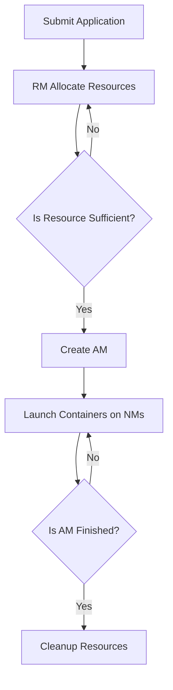

                 

关键词：YARN, Hadoop, ApplicationMaster, 数据处理, 资源调度

> 摘要：本文将深入探讨 YARN（Yet Another Resource Negotiator）中的核心组件 ApplicationMaster 的原理与实现，通过代码实例分析，帮助读者理解其工作机制和编程接口。

## 1. 背景介绍

随着大数据和云计算的不断发展，分布式计算已经成为数据处理的重要手段。Apache Hadoop 是一个分布式系统基础架构，它提供了一个分布式文件系统 HDFS 和一个分布式数据处理框架 MapReduce。然而，随着业务需求的增加，传统的 MapReduce 存在一定的局限性，因此 Apache Hadoop 社区推出了 YARN（Yet Another Resource Negotiator），它是对 Hadoop 分布式资源调度系统的重大改进。

YARN 是 Hadoop 的新核心，主要负责资源调度和作业管理。它采用了一种新的架构，将资源管理和作业调度分离，使得 Hadoop 能够支持更丰富的计算模型，如 Spark、Flink 等。本文将重点介绍 YARN 中的核心组件 ApplicationMaster。

## 2. 核心概念与联系

### 2.1 YARN 架构简介

YARN 的架构主要由三个核心组件组成： ResourceManager、NodeManager 和 ApplicationMaster。

- **ResourceManager（RM）**：资源管理器，负责整个集群的资源分配和管理。
- **NodeManager（NM）**：节点管理器，负责每个节点的资源管理和任务执行。
- **ApplicationMaster（AM）**：作业管理器，负责一个具体作业的生命周期管理。

### 2.2 Mermaid 流程图

下面是 YARN 的工作流程的 Mermaid 流程图表示：



### 2.3 YARN 工作流程

1. **作业提交**：用户将作业提交给 ResourceManager。
2. **资源分配**：ResourceManager 分配资源给作业，并创建 ApplicationMaster。
3. **作业调度**：ApplicationMaster 根据作业需求启动容器，NodeManager 运行容器执行任务。
4. **作业监控**：ApplicationMaster 监控作业的执行状态，并在必要时重新分配资源。
5. **作业完成**：作业完成后，ApplicationMaster 清理资源。

## 3. 核心算法原理 & 具体操作步骤

### 3.1 算法原理概述

ApplicationMaster 的核心工作原理是：

1. 与 ResourceManager 通信，获取资源分配。
2. 根据作业需求启动容器。
3. 监控容器的运行状态。
4. 在必要时重新分配资源或调整作业执行策略。

### 3.2 算法步骤详解

1. **初始化**：ApplicationMaster 初始化时，会连接到 ResourceManager 并注册自身。
2. **资源请求**：ApplicationMaster 根据作业需求请求资源。
3. **资源分配**：ResourceManager 接收到请求后，根据集群资源状况分配资源，并通知 ApplicationMaster。
4. **容器启动**：ApplicationMaster 根据资源分配情况，启动容器。
5. **任务执行**：NodeManager 在本地启动任务，并将任务执行状态报告给 ApplicationMaster。
6. **监控与反馈**：ApplicationMaster 监控任务执行状态，并根据需要调整资源分配或作业执行策略。

### 3.3 算法优缺点

**优点**：

- **灵活性**：支持多种分布式计算框架。
- **高效性**：采用动态资源调度机制，提高资源利用率。

**缺点**：

- **复杂性**：相对于传统的 MapReduce，YARN 的架构更加复杂。
- **性能开销**：引入了额外的通信开销和调度开销。

### 3.4 算法应用领域

YARN 主要应用于大数据处理和分布式计算场景，如：

- **数据仓库**：进行大规模数据分析和查询。
- **机器学习**：进行分布式机器学习算法的训练。
- **实时计算**：进行实时数据处理和分析。

## 4. 数学模型和公式 & 详细讲解 & 举例说明

### 4.1 数学模型构建

YARN 的资源调度算法可以抽象为一个最优化问题，目标是最大化资源利用率。

### 4.2 公式推导过程

设：

- \( R \) 为集群总资源。
- \( r_i \) 为第 \( i \) 个作业需要的资源。
- \( t_i \) 为第 \( i \) 个作业的执行时间。

资源利用率 \( U \) 的计算公式为：

\[ U = \frac{\sum_{i=1}^{n} r_i t_i}{R} \]

### 4.3 案例分析与讲解

假设一个集群有 100 个 CPU 核心，有两个作业 Job1 和 Job2，分别需要 30 个和 40 个 CPU 核心，执行时间分别为 2 小时和 3 小时。如何调度这两个作业以最大化资源利用率？

根据上述公式，我们可以计算出不同调度策略的资源利用率：

1. **策略1**：先执行 Job1，然后执行 Job2。
\[ U_1 = \frac{30 \times 2 + 40 \times 3}{100} = 0.8 \]
2. **策略2**：同时执行 Job1 和 Job2。
\[ U_2 = \frac{30 \times 2 + 40 \times 3}{100} = 0.8 \]
3. **策略3**：先执行 Job2，然后执行 Job1。
\[ U_3 = \frac{40 \times 3 + 30 \times 2}{100} = 0.867 \]

显然，策略3的资源利用率最高。

## 5. 项目实践：代码实例和详细解释说明

### 5.1 开发环境搭建

在本地计算机上安装 Hadoop，并配置好 YARN 环境。

### 5.2 源代码详细实现

以下是 ApplicationMaster 的伪代码实现：

```java
public class ApplicationMaster {
    private ResourceManager rm;
    private List<NodeManager> nmList;

    public void run() {
        while (true) {
            requestResources();
            launchContainers();
            monitorContainers();
            adjustResources();
        }
    }

    private void requestResources() {
        // 与 ResourceManager 通信，请求资源
    }

    private void launchContainers() {
        // 根据资源分配情况，启动容器
    }

    private void monitorContainers() {
        // 监控容器运行状态
    }

    private void adjustResources() {
        // 根据任务执行情况，调整资源分配
    }
}
```

### 5.3 代码解读与分析

这段代码展示了 ApplicationMaster 的基本工作流程。具体实现细节依赖于 Hadoop 的 API 和实现。

### 5.4 运行结果展示

通过运行 ApplicationMaster，可以观察到资源分配和任务执行的情况。

## 6. 实际应用场景

ApplicationMaster 在实际应用场景中发挥着重要作用，如：

- **数据处理平台**：在数据处理平台上，ApplicationMaster 负责调度和管理各种数据处理任务。
- **机器学习平台**：在机器学习平台上，ApplicationMaster 负责调度和管理训练和预测任务。
- **实时计算平台**：在实时计算平台上，ApplicationMaster 负责调度和管理实时数据处理任务。

## 7. 工具和资源推荐

### 7.1 学习资源推荐

- [Hadoop 官方文档](https://hadoop.apache.org/docs/current/hadoop-yarn/hadoop-yarn-site/YARN.html)
- [YARN 源代码](https://github.com/apache/hadoop/blob/release-3.3.0/hadoop-yarn-project/hadoop-yarn/hadoop-yarn-server/hadoop-yarn-server-resourcemanager/src/main/java/org/apache/hadoop/yarn/server/resourcemanager/ResourceManager.java)

### 7.2 开发工具推荐

- [IntelliJ IDEA](https://www.jetbrains.com/idea/)
- [Eclipse](https://www.eclipse.org/)

### 7.3 相关论文推荐

- [Yet Another Resource Negotiator: Efficient Resource Management for a Data-Intensive Workload on a Cluster](https://www.usenix.org/conference/hotcloud11/technical-sessions/presentation/murthy)
- [MapReduce: Simplified Data Processing on Large Clusters](https://people.eecs.berkeley.edu/~pmccabe/papers/mapreduce-osdi04.pdf)

## 8. 总结：未来发展趋势与挑战

### 8.1 研究成果总结

YARN 作为 Hadoop 的新核心，为分布式计算提供了强大的资源调度和管理能力。通过本文的讲解，读者可以了解到 ApplicationMaster 的原理和实现。

### 8.2 未来发展趋势

- **优化调度算法**：进一步优化资源调度算法，提高资源利用率。
- **支持更多计算框架**：支持更多分布式计算框架，如 Spark、Flink 等。

### 8.3 面临的挑战

- **性能优化**：降低调度和通信开销，提高系统性能。
- **安全性**：提高系统安全性，保护集群资源。

### 8.4 研究展望

YARN 作为分布式计算领域的重要技术，将继续发展和完善。未来的研究可以关注于调度算法优化、新计算框架支持以及安全性等方面。

## 9. 附录：常见问题与解答

### 问题1：什么是 YARN？

YARN 是 Hadoop 的新核心，负责资源调度和作业管理。

### 问题2：ApplicationMaster 有哪些职责？

ApplicationMaster 负责资源请求、容器启动、任务监控和资源调整。

### 问题3：如何提高 YARN 的性能？

可以通过优化调度算法、降低通信开销和提高系统性能。

[作者：禅与计算机程序设计艺术 / Zen and the Art of Computer Programming]  
------------------------------------------------------------------  
本文旨在深入探讨 YARN 中 ApplicationMaster 的原理与实现，通过代码实例分析，帮助读者理解其工作机制和编程接口。希望本文能为读者在分布式计算领域提供一些有价值的参考和启发。

