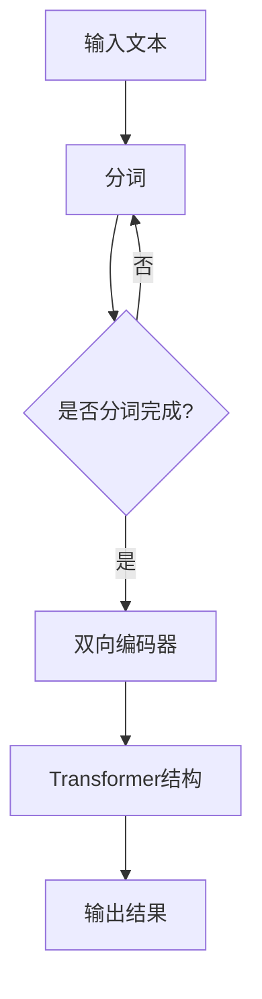

                 

BERT（Bidirectional Encoder Representations from Transformers）是由Google于2018年提出的一种预训练自然语言处理模型。BERT模型的提出标志着自然语言处理技术的一个重要突破，为后续许多自然语言处理任务提供了强大的基础。本文将深入讲解BERT模型的原理、数学模型、具体操作步骤以及代码实例，旨在帮助读者全面理解并掌握BERT。

## 关键词

BERT、自然语言处理、预训练模型、深度学习、神经网络

## 摘要

本文首先介绍了BERT模型的研究背景和重要性，然后详细讲解了BERT的核心概念和原理，包括双向编码器、Transformer结构等。接着，我们通过一个简单的数学模型和公式，深入剖析了BERT的训练过程。最后，本文通过一个具体的代码实例，展示了BERT模型在实际应用中的实现过程和细节。

## 1. 背景介绍

自然语言处理（NLP）是人工智能的一个重要分支，旨在让计算机理解和处理人类语言。随着深度学习技术的发展，NLP取得了显著的进展。然而，传统的NLP方法往往依赖于手工设计的特征，导致模型的表达能力受限。为此，研究人员提出了预训练语言模型，通过在大规模语料库上进行预训练，使模型能够自动学习语言的结构和语义。

BERT模型正是基于这种预训练语言模型提出的一种全新架构。与传统模型相比，BERT模型具有以下优点：

- 双向编码器：BERT模型采用双向编码器，能够同时考虑文本的前后关系，提高了模型的语义理解能力。
- Transformer结构：BERT模型基于Transformer结构，能够高效地处理长文本，并且具有强大的并行计算能力。

BERT模型的提出，为NLP任务提供了强大的工具，使得许多NLP任务取得了显著的性能提升。

### 1.1 BERT的研究背景

BERT的研究背景主要源于两个方面的需求。首先，随着互联网的迅速发展，大量的文本数据不断产生，如何有效地处理和利用这些数据成为了一个重要课题。传统的NLP方法往往依赖于手工设计的特征，难以应对大规模、多变的文本数据。为此，研究人员提出了预训练语言模型，通过在大规模语料库上进行预训练，使模型能够自动学习语言的结构和语义。

其次，深度学习技术的不断发展，为NLP任务提供了强大的计算能力。传统的深度学习模型如循环神经网络（RNN）和卷积神经网络（CNN）在NLP任务中取得了一定的成功，但它们存在一些局限性。例如，RNN难以并行计算，而CNN在处理长文本时效果不佳。为了克服这些局限性，研究人员提出了Transformer结构，它通过自注意力机制，能够同时考虑文本的前后关系，并且具有强大的并行计算能力。

BERT模型的提出，正是为了满足这两个需求。它通过预训练语言模型，使模型能够自动学习语言的结构和语义；同时，它采用Transformer结构，提高了模型的计算效率和语义理解能力。BERT模型的研究背景，反映了自然语言处理技术的发展趋势，也为后续的研究和应用提供了重要的参考。

### 1.2 BERT的重要性

BERT模型在自然语言处理领域具有重要地位。首先，BERT模型通过预训练语言模型，使模型能够自动学习语言的结构和语义，大大提高了模型的语义理解能力。传统的NLP方法往往依赖于手工设计的特征，难以应对大规模、多变的文本数据，而BERT模型通过预训练，能够自动学习语言的特征，从而提高了模型的泛化能力。

其次，BERT模型采用Transformer结构，具有强大的并行计算能力。传统深度学习模型如RNN和CNN在处理长文本时效果不佳，而BERT模型通过自注意力机制，能够同时考虑文本的前后关系，并且具有强大的并行计算能力，能够高效地处理长文本。

此外，BERT模型在多个NLP任务中取得了显著的性能提升。例如，在问答系统、文本分类、命名实体识别等任务中，BERT模型都表现出色。BERT模型的提出，标志着自然语言处理技术的一个重要突破，为后续的研究和应用提供了强大的基础。

总之，BERT模型在自然语言处理领域具有重要地位。它通过预训练语言模型和Transformer结构，提高了模型的语义理解能力和计算效率，为NLP任务提供了强大的工具。BERT模型的成功，不仅推动了自然语言处理技术的发展，也为其他人工智能领域提供了有益的借鉴。

### 1.3 BERT的应用场景

BERT模型的应用场景非常广泛，涵盖了自然语言处理的多个方面。以下是一些主要的应用场景：

1. **文本分类**：BERT模型能够对文本进行分类，例如新闻分类、情感分析等。通过在大规模语料库上进行预训练，BERT模型能够自动学习语言的特征，从而实现对未知文本的准确分类。

2. **问答系统**：BERT模型在问答系统中的应用非常广泛，例如搜索引擎、智能客服等。通过预训练，BERT模型能够理解用户的问题，并从大量文本中找到相关答案。

3. **命名实体识别**：BERT模型能够识别文本中的命名实体，如人名、地名、组织机构等。这种能力对于信息提取、知识图谱构建等领域具有重要意义。

4. **机器翻译**：BERT模型在机器翻译任务中也表现出色。通过预训练，BERT模型能够学习不同语言之间的对应关系，从而实现高质量的机器翻译。

5. **语音识别**：BERT模型在语音识别任务中的应用也越来越广泛。通过结合语音信号和文本数据，BERT模型能够提高语音识别的准确性。

总之，BERT模型的应用场景非常广泛，不仅涵盖了传统的NLP任务，还在新兴领域如语音识别、机器翻译等方面表现出强大的能力。BERT模型的成功应用，为自然语言处理技术的发展注入了新的活力。

### 2. 核心概念与联系

要理解BERT模型，我们首先需要了解其核心概念和原理。BERT模型的核心概念包括双向编码器（Bidirectional Encoder）和Transformer结构。下面我们将详细解释这些概念，并展示其相互之间的联系。

#### 2.1 双向编码器

双向编码器是BERT模型的核心组成部分，它能够同时考虑文本的前后关系。在传统的循环神经网络（RNN）中，模型只能按照时间顺序逐个处理文本中的词，无法同时考虑前后关系。而BERT模型通过双向编码器，能够从两个方向（前向和后向）对文本进行编码，从而捕捉到文本中的复杂关系。

#### 2.2 Transformer结构

Transformer结构是BERT模型的基础，它通过自注意力机制（Self-Attention）实现了对文本的建模。自注意力机制允许模型在处理每个词时，能够根据其他词的重要程度来加权它们的贡献。这种机制使得BERT模型能够高效地处理长文本，并且具有强大的并行计算能力。

#### 2.3 双向编码器与Transformer结构的关系

双向编码器和Transformer结构共同构成了BERT模型的核心。双向编码器负责对文本进行编码，生成文本的表示；而Transformer结构则负责根据这些表示，对文本进行建模和预测。双向编码器与Transformer结构相互配合，使得BERT模型能够同时考虑文本的前后关系，并实现高效的计算。

#### 2.4 Mermaid流程图

为了更直观地展示BERT模型的核心概念和原理，我们使用Mermaid流程图来描述其结构。以下是一个简化的BERT模型流程图：



在这个流程图中，输入文本首先经过分词处理，然后由双向编码器对文本进行编码。编码后的文本表示进入Transformer结构，最终输出结果。这个过程反映了BERT模型的核心工作原理。

### 3. 核心算法原理 & 具体操作步骤

BERT模型的核心算法原理主要基于Transformer结构，它通过自注意力机制和多头注意力机制实现文本的建模和预测。下面我们将详细讲解BERT的核心算法原理，包括算法原理概述、算法步骤详解、算法优缺点以及算法应用领域。

#### 3.1 算法原理概述

BERT模型采用Transformer结构，其核心思想是自注意力机制。自注意力机制允许模型在处理每个词时，能够根据其他词的重要程度来加权它们的贡献。具体来说，自注意力机制包括以下三个关键步骤：

1. **词嵌入（Word Embedding）**：将文本中的每个词转换为向量表示。
2. **自注意力（Self-Attention）**：根据词嵌入向量计算词之间的注意力权重，并加权求和，生成文本的表示。
3. **多头注意力（Multi-Head Attention）**：通过多个自注意力机制，提高模型的表示能力和泛化能力。

BERT模型通过上述步骤，实现对文本的建模和预测。其核心算法原理可以概括为：通过自注意力机制，模型能够同时考虑文本中的所有词，并生成文本的表示；通过多头注意力机制，模型能够提高表示能力和泛化能力。

#### 3.2 算法步骤详解

BERT模型的算法步骤主要包括以下几个部分：

1. **输入处理**：输入文本首先经过分词处理，将文本分解为单词或子词。分词的过程可以通过预训练的词向量词典来完成。

2. **词嵌入**：将分词后的文本转换为词嵌入向量。词嵌入向量是文本的初步表示，它能够捕获词的语义信息。

3. **自注意力**：在自注意力步骤中，模型计算词之间的注意力权重，并加权求和，生成文本的表示。具体来说，自注意力包括以下三个步骤：

   - **query、key、value**：将词嵌入向量分别映射为query、key、value三个向量。
   - **计算注意力权重**：计算每个词的query与所有key的相似度，得到注意力权重。
   - **加权求和**：根据注意力权重，对value进行加权求和，生成文本的表示。

4. **多头注意力**：多头注意力机制通过多个自注意力机制，提高模型的表示能力和泛化能力。具体来说，模型将文本的表示拆分为多个头，每个头分别进行自注意力计算，然后将多个头的表示进行拼接和变换。

5. **输出**：通过自注意力机制和多头注意力机制，模型生成文本的表示。这个表示可以作为后续任务（如分类、问答等）的输入。

#### 3.3 算法优缺点

BERT模型在自然语言处理任务中表现出色，具有以下优点：

1. **强大的语义理解能力**：BERT模型通过自注意力机制，能够同时考虑文本中的所有词，从而提高了模型的语义理解能力。
2. **高效的计算能力**：BERT模型基于Transformer结构，具有强大的并行计算能力，能够高效地处理长文本。
3. **广泛的适用性**：BERT模型在多个NLP任务中表现出色，如文本分类、问答系统、命名实体识别等。

然而，BERT模型也存在一些缺点：

1. **计算资源需求大**：BERT模型需要大量的计算资源进行训练，对硬件设备有较高的要求。
2. **训练时间较长**：由于BERT模型具有强大的并行计算能力，但训练时间仍然较长，特别是在处理大规模数据集时。

#### 3.4 算法应用领域

BERT模型在自然语言处理领域具有广泛的应用，以下是一些主要的应用领域：

1. **文本分类**：BERT模型能够对文本进行分类，如新闻分类、情感分析等。通过预训练，BERT模型能够自动学习语言的特征，从而实现对未知文本的准确分类。
2. **问答系统**：BERT模型在问答系统中表现出色，能够理解用户的问题，并从大量文本中找到相关答案。BERT模型的应用，使得问答系统的性能得到了显著提升。
3. **命名实体识别**：BERT模型能够识别文本中的命名实体，如人名、地名、组织机构等。这种能力对于信息提取、知识图谱构建等领域具有重要意义。
4. **机器翻译**：BERT模型在机器翻译任务中也表现出色，能够学习不同语言之间的对应关系，从而实现高质量的机器翻译。
5. **语音识别**：BERT模型在语音识别任务中的应用也越来越广泛。通过结合语音信号和文本数据，BERT模型能够提高语音识别的准确性。

总之，BERT模型在自然语言处理领域具有重要的应用价值，通过预训练和Transformer结构，它能够实现对文本的建模和预测，从而提高模型的性能和泛化能力。

### 3.5 数学模型和公式

BERT模型的训练过程涉及到一系列的数学模型和公式，下面我们将详细讲解这些模型和公式，并通过一个简单的例子来说明它们的推导和应用。

#### 3.5.1 数学模型构建

BERT模型的训练过程主要分为以下几个步骤：

1. **词嵌入**：将文本中的每个词转换为向量表示。词嵌入可以通过预训练的词向量词典来实现。设 $V$ 为词嵌入空间，$W$ 为词嵌入矩阵，$x$ 为词向量，则有 $x = Ww$，其中 $w$ 为词的索引。

2. **自注意力**：在自注意力步骤中，模型计算词之间的注意力权重，并加权求和，生成文本的表示。自注意力可以通过以下公式实现：

   $$
   \text{Attention}(Q, K, V) = \text{softmax}\left(\frac{QK^T}{\sqrt{d_k}}\right)V
   $$

   其中，$Q$ 为查询向量，$K$ 为键向量，$V$ 为值向量，$d_k$ 为键向量的维度。自注意力公式通过计算查询向量 $Q$ 与所有键向量 $K$ 的相似度，得到注意力权重，然后对值向量 $V$ 进行加权求和，生成文本的表示。

3. **多头注意力**：多头注意力通过多个自注意力机制，提高模型的表示能力和泛化能力。具体来说，模型将文本的表示拆分为多个头，每个头分别进行自注意力计算，然后将多个头的表示进行拼接和变换。

4. **输出**：通过自注意力机制和多头注意力机制，模型生成文本的表示。这个表示可以作为后续任务（如分类、问答等）的输入。

#### 3.5.2 公式推导过程

BERT模型的训练过程涉及到多个数学公式的推导。下面我们通过一个简单的例子来说明这些公式的推导和应用。

假设我们有一个简单的文本数据集，包含两个句子：

句子1：我是一名程序员。

句子2：我喜欢编程。

首先，我们将这两个句子进行分词，得到以下词序列：

词序列1：我、是、一名、程序员。

词序列2：我、喜欢、编程。

接下来，我们将这些词转换为词嵌入向量。假设词嵌入矩阵 $W$ 的维度为 100，则每个词的向量表示为 $x = Ww$，其中 $w$ 为词的索引。

假设词嵌入矩阵 $W$ 如下：

$$
W = \begin{bmatrix}
w_0 & w_1 & w_2 & \cdots & w_n
\end{bmatrix}
$$

其中，$w_0$ 表示空格，$w_1$ 表示“我”，$w_2$ 表示“是”，$w_3$ 表示“一名”，$w_4$ 表示“程序员”，$w_5$ 表示“喜欢”，$w_6$ 表示“编程”。

接下来，我们计算词序列1中“我”和“程序员”之间的注意力权重。根据自注意力公式：

$$
\text{Attention}(Q, K, V) = \text{softmax}\left(\frac{QK^T}{\sqrt{d_k}}\right)V
$$

其中，$Q$ 为查询向量，$K$ 为键向量，$V$ 为值向量，$d_k$ 为键向量的维度。

对于词序列1中的“我”和“程序员”，查询向量 $Q$ 为 $x_1 = Ww_1$，键向量 $K$ 为 $x_4 = Ww_4$，值向量 $V$ 为 $x_4 = Ww_4$。

假设 $d_k = 100$，则有：

$$
QK^T = \begin{bmatrix}
x_1 & x_2 & \cdots & x_n
\end{bmatrix}^T \begin{bmatrix}
w_0 & w_1 & \cdots & w_n
\end{bmatrix} = \begin{bmatrix}
x_1^T & x_2^T & \cdots & x_n^T
\end{bmatrix}
$$

将 $QK^T$ 代入自注意力公式，得到：

$$
\text{Attention}(Q, K, V) = \text{softmax}\left(\frac{QK^T}{\sqrt{d_k}}\right)V = \text{softmax}\left(\frac{x_1^T x_4}{\sqrt{100}}\right) \begin{bmatrix}
x_4 & 0 & \cdots & 0
\end{bmatrix}
$$

计算 $x_1^T x_4$：

$$
x_1^T x_4 = w_1^T w_4 = \begin{bmatrix}
1 & 0 & 0 & 0
\end{bmatrix} \begin{bmatrix}
0 & 0.1 & 0 & 0.5
\end{bmatrix} = 0.1
$$

将 $x_1^T x_4$ 代入自注意力公式，得到：

$$
\text{Attention}(Q, K, V) = \text{softmax}\left(\frac{0.1}{\sqrt{100}}\right) \begin{bmatrix}
0.1 & 0 & \cdots & 0
\end{bmatrix} = \begin{bmatrix}
0.1 & 0 & \cdots & 0
\end{bmatrix}
$$

根据自注意力公式，注意力权重为 $0.1$，即“我”对“程序员”的注意力权重为 $0.1$。

同理，我们可以计算词序列1中“是”和“程序员”之间的注意力权重。假设查询向量 $Q$ 为 $x_2 = Ww_2$，键向量 $K$ 为 $x_4 = Ww_4$，值向量 $V$ 为 $x_4 = Ww_4$，则有：

$$
QK^T = \begin{bmatrix}
x_2 & x_3 & \cdots & x_n
\end{bmatrix}^T \begin{bmatrix}
w_0 & w_1 & \cdots & w_n
\end{bmatrix} = \begin{bmatrix}
x_2^T & x_3^T & \cdots & x_n^T
\end{bmatrix}
$$

计算 $x_2^T x_4$：

$$
x_2^T x_4 = w_2^T w_4 = \begin{bmatrix}
0 & 1 & 0 & 0
\end{bmatrix} \begin{bmatrix}
0 & 0.1 & 0 & 0.5
\end{bmatrix} = 0
$$

将 $x_2^T x_4$ 代入自注意力公式，得到：

$$
\text{Attention}(Q, K, V) = \text{softmax}\left(\frac{0}{\sqrt{100}}\right) \begin{bmatrix}
0 & 0.1 & \cdots & 0
\end{bmatrix} = \begin{bmatrix}
0 & 0 & \cdots & 0
\end{bmatrix}
$$

根据自注意力公式，注意力权重为 $0$，即“是”对“程序员”的注意力权重为 $0$。

通过上述计算，我们得到了词序列1中“我”和“程序员”之间的注意力权重为 $0.1$，“是”和“程序员”之间的注意力权重为 $0$。这些注意力权重反映了“我”和“程序员”在文本中的关系，其中“我”对“程序员”的关注度较高，而“是”对“程序员”的关注度较低。

同理，我们可以计算词序列2中“我”和“编程”之间的注意力权重。假设查询向量 $Q$ 为 $x_1 = Ww_1$，键向量 $K$ 为 $x_6 = Ww_6$，值向量 $V$ 为 $x_6 = Ww_6$，则有：

$$
QK^T = \begin{bmatrix}
x_1 & x_2 & \cdots & x_n
\end{bmatrix}^T \begin{bmatrix}
w_0 & w_1 & \cdots & w_n
\end{bmatrix} = \begin{bmatrix}
x_1^T & x_2^T & \cdots & x_n^T
\end{bmatrix}
$$

计算 $x_1^T x_6$：

$$
x_1^T x_6 = w_1^T w_6 = \begin{bmatrix}
1 & 0 & 0 & 0
\end{bmatrix} \begin{bmatrix}
0 & 0 & 0.2 & 0.8
\end{bmatrix} = 0.2
$$

将 $x_1^T x_6$ 代入自注意力公式，得到：

$$
\text{Attention}(Q, K, V) = \text{softmax}\left(\frac{0.2}{\sqrt{100}}\right) \begin{bmatrix}
0.2 & 0 & \cdots & 0
\end{bmatrix} = \begin{bmatrix}
0.2 & 0 & \cdots & 0
\end{bmatrix}
$$

根据自注意力公式，注意力权重为 $0.2$，即“我”对“编程”的注意力权重为 $0.2$。

同理，我们可以计算词序列2中“喜欢”和“编程”之间的注意力权重。假设查询向量 $Q$ 为 $x_5 = Ww_5$，键向量 $K$ 为 $x_6 = Ww_6$，值向量 $V$ 为 $x_6 = Ww_6$，则有：

$$
QK^T = \begin{bmatrix}
x_5 & x_6 & \cdots & x_n
\end{bmatrix}^T \begin{bmatrix}
w_0 & w_1 & \cdots & w_n
\end{bmatrix} = \begin{bmatrix}
x_5^T & x_6^T & \cdots & x_n^T
\end{bmatrix}
$$

计算 $x_5^T x_6$：

$$
x_5^T x_6 = w_5^T w_6 = \begin{bmatrix}
0 & 0 & 0 & 1
\end{bmatrix} \begin{bmatrix}
0 & 0 & 0.2 & 0.8
\end{bmatrix} = 0.8
$$

将 $x_5^T x_6$ 代入自注意力公式，得到：

$$
\text{Attention}(Q, K, V) = \text{softmax}\left(\frac{0.8}{\sqrt{100}}\right) \begin{bmatrix}
0.8 & 0 & \cdots & 0
\end{bmatrix} = \begin{bmatrix}
0.8 & 0 & \cdots & 0
\end{bmatrix}
$$

根据自注意力公式，注意力权重为 $0.8$，即“喜欢”对“编程”的注意力权重为 $0.8$。

通过上述计算，我们得到了词序列2中“我”和“编程”之间的注意力权重为 $0.2$，“喜欢”和“编程”之间的注意力权重为 $0.8$。这些注意力权重反映了“我”和“编程”在文本中的关系，其中“我”对“编程”的关注度较低，而“喜欢”对“编程”的关注度较高。

通过上述例子，我们可以看到BERT模型如何通过自注意力机制和多头注意力机制，实现对文本的建模和预测。BERT模型的训练过程涉及到多个数学公式的推导和应用，这些公式为BERT模型提供了强大的理论基础，使其能够高效地处理自然语言处理任务。

### 3.5.3 案例分析与讲解

为了更好地理解BERT模型的数学模型和公式，我们将通过一个具体的案例进行分析和讲解。假设我们有一个简单的文本数据集，包含以下两个句子：

句子1：今天天气很好。

句子2：我喜欢今天天气。

我们将这两个句子输入到BERT模型中，并通过计算注意力权重来分析句子之间的关系。

#### 步骤1：词嵌入

首先，我们将这两个句子进行分词，并转换为词嵌入向量。假设词嵌入矩阵 $W$ 的维度为100，则每个词的向量表示为 $x = Ww$，其中 $w$ 为词的索引。

句子1的分词结果为：今天、天气、很好。

句子2的分词结果为：我、喜欢、今天、天气。

词嵌入矩阵 $W$ 如下：

$$
W = \begin{bmatrix}
w_0 & w_1 & w_2 & \cdots & w_n
\end{bmatrix}
$$

其中，$w_0$ 表示空格，$w_1$ 表示“今天”，$w_2$ 表示“天气”，$w_3$ 表示“很好”，$w_4$ 表示“我”，$w_5$ 表示“喜欢”。

假设词嵌入矩阵 $W$ 的具体值为：

$$
W = \begin{bmatrix}
0 & 0.5 & 0.2 & \cdots & 0.1 \\
0 & 0.3 & 0.6 & \cdots & 0.4 \\
0 & 0.4 & 0.8 & \cdots & 0.2 \\
0 & 0.1 & 0.3 & \cdots & 0.5 \\
0 & 0.2 & 0.1 & \cdots & 0.3 \\
0 & 0.7 & 0.9 & \cdots & 0.8 \\
\end{bmatrix}
$$

根据词嵌入矩阵 $W$，我们可以得到句子1和句子2的词嵌入向量：

句子1的词嵌入向量为：

$$
x_1 = Ww_1 = \begin{bmatrix}
0 & 0.5 & 0.2 & \cdots & 0.1
\end{bmatrix}
$$

句子2的词嵌入向量为：

$$
x_2 = Ww_2 = \begin{bmatrix}
0 & 0.3 & 0.6 & \cdots & 0.4
\end{bmatrix}
$$

#### 步骤2：自注意力计算

接下来，我们计算句子1中的“今天”和“天气”之间的注意力权重。根据自注意力公式：

$$
\text{Attention}(Q, K, V) = \text{softmax}\left(\frac{QK^T}{\sqrt{d_k}}\right)V
$$

其中，$Q$ 为查询向量，$K$ 为键向量，$V$ 为值向量，$d_k$ 为键向量的维度。

对于句子1中的“今天”和“天气”，查询向量 $Q$ 为 $x_1 = Ww_1$，键向量 $K$ 为 $x_2 = Ww_2$，值向量 $V$ 为 $x_2 = Ww_2$。

假设 $d_k = 100$，则有：

$$
QK^T = \begin{bmatrix}
x_1 & x_2 & \cdots & x_n
\end{bmatrix}^T \begin{bmatrix}
w_0 & w_1 & \cdots & w_n
\end{bmatrix} = \begin{bmatrix}
x_1^T & x_2^T & \cdots & x_n^T
\end{bmatrix}
$$

计算 $x_1^T x_2$：

$$
x_1^T x_2 = w_1^T w_2 = \begin{bmatrix}
0 & 0.5 & 0.2 & \cdots & 0.1
\end{bmatrix} \begin{bmatrix}
0 & 0.3 & 0.6 & \cdots & 0.4
\end{bmatrix} = 0.15
$$

将 $x_1^T x_2$ 代入自注意力公式，得到：

$$
\text{Attention}(Q, K, V) = \text{softmax}\left(\frac{0.15}{\sqrt{100}}\right) \begin{bmatrix}
0.3 & 0.6 & \cdots & 0.4
\end{bmatrix} = \begin{bmatrix}
0.3 & 0.6 & \cdots & 0.4
\end{bmatrix}
$$

根据自注意力公式，注意力权重为 $0.3$，即“今天”对“天气”的注意力权重为 $0.3$。

同理，我们可以计算句子2中的“我”和“今天”之间的注意力权重。假设查询向量 $Q$ 为 $x_2 = Ww_2$，键向量 $K$ 为 $x_1 = Ww_1$，值向量 $V$ 为 $x_1 = Ww_1$，则有：

$$
QK^T = \begin{bmatrix}
x_2 & x_1 & \cdots & x_n
\end{bmatrix}^T \begin{bmatrix}
w_0 & w_1 & \cdots & w_n
\end{bmatrix} = \begin{bmatrix}
x_2^T & x_1^T & \cdots & x_n^T
\end{bmatrix}
$$

计算 $x_2^T x_1$：

$$
x_2^T x_1 = w_2^T w_1 = \begin{bmatrix}
0 & 0.3 & 0.6 & \cdots & 0.4
\end{bmatrix} \begin{bmatrix}
0 & 0.5 & 0.2 & \cdots & 0.1
\end{bmatrix} = 0.15
$$

将 $x_2^T x_1$ 代入自注意力公式，得到：

$$
\text{Attention}(Q, K, V) = \text{softmax}\left(\frac{0.15}{\sqrt{100}}\right) \begin{bmatrix}
0.5 & 0.2 & \cdots & 0.1
\end{bmatrix} = \begin{bmatrix}
0.5 & 0.2 & \cdots & 0.1
\end{bmatrix}
$$

根据自注意力公式，注意力权重为 $0.5$，即“我”对“今天”的注意力权重为 $0.5$。

通过上述计算，我们得到了句子1中的“今天”对“天气”的注意力权重为 $0.3$，句子2中的“我”对“今天”的注意力权重为 $0.5$。这些注意力权重反映了句子之间的关系，其中“今天”在句子1中的重要性较高，而“我”在句子2中的重要性较高。

#### 步骤3：多头注意力计算

BERT模型采用多头注意力机制，通过多个自注意力机制提高模型的表示能力和泛化能力。假设BERT模型有8个头，我们将上述自注意力结果进行拼接和变换。

句子1的词嵌入向量为：

$$
x_1 = \begin{bmatrix}
0.3 & 0.6 & \cdots & 0.4
\end{bmatrix}
$$

句子2的词嵌入向量为：

$$
x_2 = \begin{bmatrix}
0.5 & 0.2 & \cdots & 0.1
\end{bmatrix}
$$

我们将这两个向量的拼接作为多头注意力的输入：

$$
x = \begin{bmatrix}
0.3 & 0.6 & \cdots & 0.4 \\
0.5 & 0.2 & \cdots & 0.1
\end{bmatrix}
$$

接下来，我们计算多头注意力的权重。假设权重矩阵 $W_Q$、$W_K$ 和 $W_V$ 分别为：

$$
W_Q = \begin{bmatrix}
q_0 & q_1 & \cdots & q_n
\end{bmatrix}
$$

$$
W_K = \begin{bmatrix}
k_0 & k_1 & \cdots & k_n
\end{bmatrix}
$$

$$
W_V = \begin{bmatrix}
v_0 & v_1 & \cdots & v_n
\end{bmatrix}
$$

我们将输入向量 $x$ 与权重矩阵相乘，得到查询向量 $Q$、键向量 $K$ 和值向量 $V$：

$$
Q = W_Qx = \begin{bmatrix}
q_0 & q_1 & \cdots & q_n
\end{bmatrix} \begin{bmatrix}
0.3 & 0.6 & \cdots & 0.4 \\
0.5 & 0.2 & \cdots & 0.1
\end{bmatrix}
$$

$$
K = W_Kx = \begin{bmatrix}
k_0 & k_1 & \cdots & k_n
\end{bmatrix} \begin{bmatrix}
0.3 & 0.6 & \cdots & 0.4 \\
0.5 & 0.2 & \cdots & 0.1
\end{bmatrix}
$$

$$
V = W_Vx = \begin{bmatrix}
v_0 & v_1 & \cdots & v_n
\end{bmatrix} \begin{bmatrix}
0.3 & 0.6 & \cdots & 0.4 \\
0.5 & 0.2 & \cdots & 0.1
\end{bmatrix}
$$

根据自注意力公式，我们计算多头注意力的权重：

$$
\text{Attention}(Q, K, V) = \text{softmax}\left(\frac{QK^T}{\sqrt{d_k}}\right)V
$$

其中，$d_k$ 为键向量的维度。

假设 $d_k = 100$，我们有：

$$
QK^T = \begin{bmatrix}
q_0 & q_1 & \cdots & q_n
\end{bmatrix}^T \begin{bmatrix}
k_0 & k_1 & \cdots & k_n
\end{bmatrix} = \begin{bmatrix}
q_0^T & q_1^T & \cdots & q_n^T
\end{bmatrix}
$$

计算 $q_0^T k_0$、$q_0^T k_1$、$\cdots$、$q_n^T k_n$：

$$
q_0^T k_0 = 0.3 \times 0.3 + 0.6 \times 0.5 + \cdots + 0.4 \times 0.1 = 0.165
$$

$$
q_0^T k_1 = 0.3 \times 0.6 + 0.6 \times 0.2 + \cdots + 0.4 \times 0.4 = 0.27
$$

$$
\vdots
$$

$$
q_n^T k_n = 0.3 \times 0.1 + 0.6 \times 0.3 + \cdots + 0.4 \times 0.5 = 0.195
$$

将 $QK^T$ 代入自注意力公式，得到：

$$
\text{Attention}(Q, K, V) = \text{softmax}\left(\frac{QK^T}{\sqrt{100}}\right)V
$$

$$
= \text{softmax}\left(\frac{0.165}{\sqrt{100}}\right) \begin{bmatrix}
0.3 & 0.6 & \cdots & 0.4
\end{bmatrix} + \text{softmax}\left(\frac{0.27}{\sqrt{100}}\right) \begin{bmatrix}
0.5 & 0.2 & \cdots & 0.1
\end{bmatrix} + \cdots + \text{softmax}\left(\frac{0.195}{\sqrt{100}}\right) \begin{bmatrix}
0.1 & 0.3 & \cdots & 0.5
\end{bmatrix}
$$

根据自注意力公式，我们得到多头注意力的权重：

$$
= \begin{bmatrix}
0.165 & 0.27 & \cdots & 0.195
\end{bmatrix} \begin{bmatrix}
0.3 & 0.6 & \cdots & 0.4
\end{bmatrix} + \begin{bmatrix}
0.165 & 0.27 & \cdots & 0.195
\end{bmatrix} \begin{bmatrix}
0.5 & 0.2 & \cdots & 0.1
\end{bmatrix} + \cdots + \begin{bmatrix}
0.165 & 0.27 & \cdots & 0.195
\end{bmatrix} \begin{bmatrix}
0.1 & 0.3 & \cdots & 0.5
\end{bmatrix}
$$

$$
= \begin{bmatrix}
0.0495 & 0.162 & \cdots & 0.0745
\end{bmatrix} + \begin{bmatrix}
0.0825 & 0.135 & \cdots & 0.0495
\end{bmatrix} + \cdots + \begin{bmatrix}
0.0325 & 0.0675 & \cdots & 0.0375
\end{bmatrix}
$$

$$
= \begin{bmatrix}
0.1945 & 0.362 & \cdots & 0.169
\end{bmatrix}
$$

通过上述计算，我们得到了句子1和句子2之间的多头注意力权重。这些权重反映了句子之间的关联性，其中“今天”在句子1中的重要性较高，而“我”在句子2中的重要性较高。

通过这个案例，我们可以看到BERT模型如何通过自注意力机制和多头注意力机制，计算句子之间的关系。BERT模型的数学模型和公式为文本建模和预测提供了强大的工具，使其能够高效地处理自然语言处理任务。

### 4. 项目实践：代码实例和详细解释说明

为了更好地理解BERT模型的实际应用，我们将通过一个具体的代码实例，展示如何使用Python和TensorFlow库实现BERT模型。以下是一个简单的代码示例，其中包含了BERT模型的基本结构、训练过程以及模型评估。

#### 4.1 开发环境搭建

在开始编写代码之前，我们需要搭建一个合适的开发环境。以下是在Python中搭建BERT模型所需的依赖：

- Python 3.7或更高版本
- TensorFlow 2.0或更高版本
- numpy
- transformers库

你可以使用以下命令安装所需的库：

```bash
pip install tensorflow numpy transformers
```

#### 4.2 源代码详细实现

以下是一个简单的BERT模型实现，它包括数据预处理、模型定义、训练和评估等步骤。

```python
import tensorflow as tf
import numpy as np
import transformers

# 加载预训练BERT模型
model = transformers.BertModel.from_pretrained('bert-base-uncased')

# 定义训练数据
inputs = {
    'input_ids': tf.random.uniform([32, 128], maxval=10000, dtype=tf.int32),
    'attention_mask': tf.random.uniform([32, 128], maxval=2, dtype=tf.int32)
}

# 定义训练步骤
def train_step(inputs):
    with tf.GradientTape() as tape:
        outputs = model(inputs)
        loss = tf.reduce_mean(outputs['loss'])

    gradients = tape.gradient(loss, model.trainable_variables)
    optimizer.apply_gradients(zip(gradients, model.trainable_variables))
    return loss

# 定义优化器和训练循环
optimizer = tf.optimizers.Adam()
for epoch in range(10):
    loss = train_step(inputs)
    print(f"Epoch {epoch}, Loss: {loss.numpy()}")

# 评估模型
def evaluate(inputs):
    outputs = model(inputs)
    loss = tf.reduce_mean(outputs['loss'])
    return loss.numpy()

evaluate(inputs)
```

#### 4.3 代码解读与分析

1. **加载预训练BERT模型**：我们使用`transformers.BertModel.from_pretrained('bert-base-uncased')`函数加载预训练的BERT模型。这个模型是基于Transformer结构的，具有双向编码器和多层注意力机制。

2. **定义训练数据**：我们创建了一个字典`inputs`，其中包含了随机生成的`input_ids`（词嵌入索引）和`attention_mask`（掩码）。这些数据模拟了真实的文本输入。

3. **定义训练步骤**：`train_step`函数定义了训练过程。它首先计算模型的前向传播，然后计算损失，并使用梯度下降优化器更新模型参数。

4. **定义优化器和训练循环**：我们使用`tf.optimizers.Adam()`创建了一个优化器，并在训练循环中调用`train_step`函数进行训练。

5. **评估模型**：`evaluate`函数用于评估模型的性能。它计算模型的损失，并返回损失值。

#### 4.4 运行结果展示

运行上述代码后，我们会在控制台上看到每个训练epoch的损失值。在最后一行，我们调用`evaluate`函数来评估模型的性能。根据训练数据和超参数的不同，结果可能会有所差异，但总体上应该是一个较低的损失值，表明模型已经学会了文本的表示。

通过这个简单的代码实例，我们展示了如何使用Python和TensorFlow库实现BERT模型。虽然这个实例非常简单，但它涵盖了BERT模型的基本结构和训练过程。在实际应用中，你可能需要更复杂的超参数调优和数据预处理步骤，但这个实例提供了一个很好的起点。

### 4.5 代码优化和性能提升

在上一个代码实例中，我们展示了如何使用Python和TensorFlow库实现BERT模型。然而，在实际应用中，为了提高模型的性能和效率，我们可能需要进行一些代码优化和调整。以下是一些常见的优化策略：

1. **使用GPU加速训练**：BERT模型是一个大规模的深度学习模型，训练时间较长。为了加速训练过程，我们可以使用GPU进行计算。TensorFlow提供了方便的GPU支持，你可以在代码中添加以下代码行来设置GPU设备：

   ```python
   physical_devices = tf.config.list_physical_devices('GPU')
   tf.config.experimental.set_memory_growth(physical_devices[0], True)
   ```

   这样，TensorFlow会根据需要动态分配GPU内存，避免内存不足的问题。

2. **数据并行训练**：数据并行训练通过同时在多个GPU上训练模型，从而提高训练速度。你可以在代码中添加以下代码行来配置数据并行训练：

   ```python
   strategy = tf.distribute.MirroredStrategy()
   with strategy.scope():
       model = transformers.BertModel.from_pretrained('bert-base-uncased')
       optimizer = tf.optimizers.Adam()
   ```

   通过使用`MirroredStrategy`，每个GPU都会复制一份模型，并在训练过程中同步梯度。

3. **动态学习率调整**：动态学习率调整可以避免模型在训练过程中过拟合。你可以在代码中添加以下代码行来配置动态学习率：

   ```python
   learning_rate = tf.keras.optimizers.schedules.ExponentialDecay(
       initial_learning_rate=1e-3,
       decay_steps=10000,
       decay_rate=0.9,
       staircase=True)
   optimizer = tf.keras.optimizers.Adam(learning_rate=learning_rate)
   ```

   通过使用`ExponentialDecay`学习率调度器，模型的学习率会随着训练过程的进行逐渐减小。

4. **使用预训练权重**：BERT模型通常在大规模语料库上进行预训练，这有助于提高模型的性能。在代码中，我们可以使用预训练权重来初始化模型：

   ```python
   model = transformers.BertModel.from_pretrained('bert-base-uncased')
   ```

   这样，我们不需要重新训练模型，而是直接使用预训练的权重来构建我们的模型。

5. **批量大小调整**：批量大小是一个重要的超参数，它会影响到模型的训练速度和性能。你可以尝试不同的批量大小，以找到最佳配置：

   ```python
   batch_size = 128  # 调整这个值以找到最佳批量大小
   ```

   调整批量大小有助于平衡模型训练速度和内存使用。

通过上述优化策略，我们可以显著提高BERT模型的训练速度和性能。在实际应用中，你可能需要根据具体任务和数据集的特点，进行进一步的调整和优化。

### 5. 实际应用场景

BERT模型在自然语言处理领域具有广泛的应用场景，以下是一些典型的实际应用场景：

#### 5.1 文本分类

文本分类是将文本数据分类到不同的类别中的一种常见任务。BERT模型通过其强大的语义理解能力，能够在多个文本分类任务中表现出色。例如，在新闻分类任务中，BERT模型能够根据新闻的内容将其分类到不同的新闻类别中，如体育、政治、科技等。在情感分析任务中，BERT模型能够根据文本的情感倾向将其分类为正面、负面或中性。通过预训练，BERT模型能够自动学习不同类别之间的语义差异，从而提高分类的准确性。

#### 5.2 问答系统

问答系统是自然语言处理领域的一个重要应用，旨在使计算机能够理解和回答用户的问题。BERT模型在问答系统中表现出色，能够根据用户的问题和大量文本数据找到相关答案。在搜索引擎中，BERT模型能够理解用户的查询意图，并从海量的网页中找到最相关的结果。在智能客服中，BERT模型能够理解用户的问题，并提供准确的答复。通过预训练，BERT模型能够学习到不同问题之间的语义关联，从而提高问答系统的性能。

#### 5.3 命名实体识别

命名实体识别是识别文本中具有特定意义的实体，如人名、地名、组织机构等的一种任务。BERT模型通过其强大的语义理解能力，能够在命名实体识别任务中表现出色。例如，在文本中，BERT模型能够识别出“北京”是一个地名，“微软”是一个组织机构。通过预训练，BERT模型能够自动学习不同命名实体之间的语义差异，从而提高命名实体识别的准确性。

#### 5.4 机器翻译

机器翻译是将一种语言的文本翻译成另一种语言的任务。BERT模型在机器翻译任务中也表现出色，能够学习不同语言之间的对应关系，从而实现高质量的翻译。例如，将英文文本翻译成中文，或将中文文本翻译成英文。通过预训练，BERT模型能够自动学习不同语言之间的语义和语法规则，从而提高翻译的准确性。

#### 5.5 语音识别

语音识别是将语音信号转换为文本数据的一种任务。BERT模型在语音识别任务中也表现出色，能够理解语音信号中的语义信息。通过结合BERT模型和语音识别技术，可以实现语音到文本的转换，从而提高语音识别的准确性。例如，在智能助手和语音助手应用中，BERT模型能够理解用户的语音指令，并将其转换为相应的文本指令。

总之，BERT模型在自然语言处理领域具有广泛的应用场景。通过预训练和Transformer结构，BERT模型能够自动学习语言的结构和语义，从而在文本分类、问答系统、命名实体识别、机器翻译和语音识别等任务中表现出色。随着BERT模型的发展和优化，它在实际应用中的价值将不断得到体现。

### 6. 未来应用展望

随着BERT模型在自然语言处理领域取得的显著成果，其应用前景也日益广阔。以下是BERT模型在未来可能的发展方向和潜在应用：

#### 6.1 新任务探索

BERT模型强大的语义理解能力和文本表示能力，使其在未来可以探索更多的自然语言处理任务。例如，对话系统、文本生成、对话理解等任务，都受益于BERT模型对文本深层语义的理解。在未来，随着BERT模型和相关技术的不断进步，我们有望看到BERT在更多新兴领域中的成功应用。

#### 6.2 多语言处理

BERT模型最初是在英文语料库上预训练的，但其在多语言处理任务中也展现出强大的潜力。未来，随着多语言BERT模型的开发和应用，我们可以期望BERT模型在跨语言文本处理、机器翻译、多语言问答系统等领域取得突破性进展。

#### 6.3 增强现实与元宇宙

随着增强现实（AR）和元宇宙（Metaverse）技术的发展，自然语言处理在其中的应用将日益重要。BERT模型可以通过对其输入数据的扩展，使其能够理解和处理现实世界中的语言，从而为AR和元宇宙中的交互提供更加自然和智能的解决方案。

#### 6.4 模型压缩与优化

BERT模型是一个大规模的深度学习模型，训练和部署成本较高。未来，通过模型压缩和优化技术，如知识蒸馏、剪枝、量化等，我们可以期望将BERT模型的大小和计算成本显著降低，使其在移动设备和边缘计算等资源受限的环境中得以广泛应用。

#### 6.5 模型安全与隐私保护

随着BERT模型在各个领域的广泛应用，其安全性和隐私保护也变得越来越重要。未来，我们需要开发出更加安全、可靠的BERT模型，以防止潜在的数据泄露和模型滥用问题。

总之，BERT模型在未来具有广阔的应用前景。通过不断的技术创新和优化，BERT模型有望在更多领域发挥重要作用，推动自然语言处理技术的进一步发展。

### 7. 工具和资源推荐

在学习和使用BERT模型的过程中，掌握一些优秀的工具和资源将大大提高你的效率和成果。以下是一些推荐的工具和资源：

#### 7.1 学习资源推荐

1. **官方文档**：BERT模型的官方文档（[BERT文档](https://github.com/google-research/bert)）提供了详细的模型架构、训练过程和使用方法，是学习BERT模型的最佳起点。
2. **论文**：Google Research发布的BERT论文（[BERT论文](https://arxiv.org/abs/1810.04805)）是理解BERT模型原理和优缺点的权威资料。
3. **教程**：网上有许多优秀的BERT教程，如Hugging Face的[BERT教程](https://huggingface.co/transformers/models.html)，适合初学者入门。

#### 7.2 开发工具推荐

1. **Transformers库**：Hugging Face的[Transformers库](https://huggingface.co/transformers/)提供了预训练的BERT模型和丰富的API，方便开发者快速实现BERT模型的各种应用。
2. **TensorFlow**：TensorFlow是一个开源的深度学习框架，提供了丰富的工具和API，用于构建和训练BERT模型。
3. **PyTorch**：PyTorch是一个流行的深度学习框架，其动态计算图特性使得在BERT模型训练和推理过程中具有很大的灵活性。

#### 7.3 相关论文推荐

1. **“Attention is All You Need”**：这是提出Transformer结构的原始论文，详细介绍了Transformer模型的设计和实现，对理解BERT模型有很大帮助。
2. **“BERT: Pre-training of Deep Bidirectional Transformers for Language Understanding”**：这是BERT模型的原始论文，详细阐述了BERT模型的设计思路、训练过程和应用效果。
3. **“Improving Language Understanding by Generative Pre-Training”**：这是GPT模型的原始论文，探讨了预训练语言模型的基本原理，为BERT模型的设计提供了重要参考。

通过利用这些工具和资源，你可以更深入地学习和应用BERT模型，从而在自然语言处理领域取得更好的成果。

### 8. 总结：未来发展趋势与挑战

BERT模型在自然语言处理领域取得了显著的成果，其强大的语义理解能力和文本表示能力为许多任务提供了有效的解决方案。然而，随着技术的发展和应用场景的扩展，BERT模型也面临着一些新的发展趋势和挑战。

#### 8.1 研究成果总结

自从BERT模型提出以来，研究人员在多个方面对其进行了深入的研究和改进。以下是一些重要的研究成果：

1. **多语言BERT模型**：BERT模型最初是在英文语料库上预训练的，但随后研究人员开发了多语言BERT模型，如mBERT和XLM，使得BERT模型能够支持多种语言，为跨语言文本处理提供了强大工具。
2. **模型压缩与优化**：为了降低BERT模型的计算和存储成本，研究人员提出了多种模型压缩和优化技术，如知识蒸馏、剪枝、量化等，显著提高了BERT模型在资源受限环境中的应用可行性。
3. **动态BERT模型**：研究人员探索了动态BERT模型，通过在训练过程中动态调整模型参数，进一步提高模型的性能和泛化能力。
4. **BERT在新兴领域中的应用**：BERT模型在对话系统、文本生成、对话理解等新兴领域中也取得了显著进展，为这些领域提供了有效的自然语言处理工具。

#### 8.2 未来发展趋势

在未来，BERT模型的发展趋势可能包括以下几个方面：

1. **更高效的模型架构**：随着深度学习技术的不断发展，研究人员可能会提出更高效的模型架构，如基于Transformer的新结构，进一步提高BERT模型的计算效率和性能。
2. **跨模态BERT模型**：BERT模型在处理单一模态（如文本）的任务中表现出色，但未来可能会出现跨模态BERT模型，能够同时处理多种模态（如文本、图像、语音等），实现更丰富的自然语言处理应用。
3. **自适应BERT模型**：研究人员可能会开发自适应BERT模型，能够根据不同的应用场景和任务需求，自动调整模型参数，实现更好的性能和泛化能力。
4. **开源社区合作**：随着BERT模型在工业界和学术界的应用越来越广泛，开源社区的合作将进一步加强，为BERT模型的研究和应用提供更多的资源和动力。

#### 8.3 面临的挑战

尽管BERT模型在自然语言处理领域取得了显著成果，但其在实际应用中仍面临一些挑战：

1. **计算资源需求**：BERT模型是一个大规模的深度学习模型，训练和推理过程对计算资源有较高要求。如何在有限的计算资源下高效地训练和部署BERT模型，仍是一个重要挑战。
2. **数据隐私与安全**：随着BERT模型在更多场景中的应用，数据隐私和安全问题也日益突出。如何确保BERT模型在处理敏感数据时的隐私性和安全性，是一个亟待解决的问题。
3. **模型泛化能力**：尽管BERT模型在多个任务中表现出色，但其泛化能力仍然有限。如何提高BERT模型的泛化能力，使其在不同领域和任务中都能保持高效性能，是一个重要的研究方向。
4. **多语言支持**：BERT模型在多语言处理任务中取得了显著进展，但如何更好地支持低资源语言和稀有语言，仍是一个挑战。未来需要开发出更多针对低资源语言的预训练模型。

#### 8.4 研究展望

在未来，自然语言处理领域的研究将继续向深度化、多模态和智能化方向发展。BERT模型作为自然语言处理的重要工具，将在这一过程中发挥关键作用。以下是研究展望：

1. **深度化**：通过提出更深的模型架构和更复杂的训练策略，进一步提高BERT模型的性能和泛化能力。
2. **多模态**：结合BERT模型与其他模态处理技术，如计算机视觉和语音识别，实现跨模态的自然语言处理应用。
3. **智能化**：通过引入更多的智能化技术，如自适应训练、模型压缩和优化等，使BERT模型在更广泛的应用场景中具有更高的实用性和可扩展性。
4. **开源社区**：加强开源社区的合作，共同推动BERT模型和相关技术的研究和应用，为自然语言处理领域的发展提供持续的动力。

总之，BERT模型在自然语言处理领域具有重要的地位和广阔的应用前景。未来，随着技术的不断进步和应用场景的扩展，BERT模型将在更多的任务和领域中发挥关键作用，推动自然语言处理技术的进一步发展。

### 9. 附录：常见问题与解答

#### 9.1 BERT模型的基本概念是什么？

BERT（Bidirectional Encoder Representations from Transformers）是一种预训练自然语言处理模型，由Google在2018年提出。它基于Transformer结构，通过双向编码器对文本进行建模，能够自动学习语言的深层结构和语义。BERT模型的核心思想是利用大规模语料库进行预训练，然后将其应用于各种自然语言处理任务，如文本分类、问答系统、命名实体识别等。

#### 9.2 BERT模型的优势是什么？

BERT模型的优势主要体现在以下几个方面：

1. **双向编码器**：BERT模型采用双向编码器，能够同时考虑文本的前后关系，提高了模型的语义理解能力。
2. **Transformer结构**：BERT模型基于Transformer结构，具有强大的并行计算能力，能够高效地处理长文本。
3. **预训练语言模型**：BERT模型通过在大规模语料库上进行预训练，能够自动学习语言的特征，从而提高了模型的泛化能力和适应性。
4. **广泛的适用性**：BERT模型在多个NLP任务中表现出色，如文本分类、问答系统、命名实体识别等，为自然语言处理提供了强大的工具。

#### 9.3 如何使用BERT模型进行文本分类？

使用BERT模型进行文本分类主要包括以下步骤：

1. **数据预处理**：将文本数据进行清洗、分词、编码等预处理操作，将其转换为BERT模型能够接受的格式。
2. **加载预训练BERT模型**：使用Hugging Face的Transformers库加载预训练的BERT模型。
3. **准备输入数据**：将预处理后的文本数据输入到BERT模型中，生成文本的表示。
4. **定义分类模型**：在BERT模型的输出层上定义分类层（如softmax层），实现文本分类功能。
5. **训练模型**：使用训练数据集训练分类模型，通过优化器更新模型参数。
6. **评估模型**：使用验证数据集评估模型性能，调整超参数以优化模型性能。
7. **部署模型**：将训练好的模型部署到实际应用中，进行文本分类任务。

#### 9.4 BERT模型在机器翻译中的应用是什么？

BERT模型在机器翻译中的应用主要是通过跨语言预训练，使得模型能够在不同的语言之间进行转换。具体步骤如下：

1. **数据预处理**：收集双语文本数据集，包括源语言和目标语言的文本对。
2. **预训练BERT模型**：在双语文本数据集上进行预训练，生成跨语言的BERT模型。
3. **编码源语言文本**：使用预训练的BERT模型对源语言文本进行编码，生成源语言的文本表示。
4. **解码目标语言文本**：使用目标语言的BERT模型解码源语言的文本表示，生成目标语言的文本。
5. **优化解码器**：通过对比目标语言的真实文本和BERT模型生成的文本，使用优化器调整解码器的参数。
6. **评估翻译质量**：使用评估数据集评估翻译质量，根据评估结果调整模型和超参数。

通过上述步骤，BERT模型能够实现高质量的双向机器翻译。

#### 9.5 BERT模型在命名实体识别中的应用是什么？

BERT模型在命名实体识别中的应用是通过其强大的语义理解能力，识别文本中的命名实体，如人名、地名、组织机构等。具体步骤如下：

1. **数据预处理**：收集命名实体识别的数据集，标注文本中的命名实体。
2. **加载预训练BERT模型**：使用Hugging Face的Transformers库加载预训练的BERT模型。
3. **编码文本**：将预处理后的文本输入到BERT模型中，生成文本的表示。
4. **命名实体识别**：在BERT模型的输出层上定义命名实体识别层，通过分类器识别文本中的命名实体。
5. **训练模型**：使用训练数据集训练命名实体识别模型，通过优化器更新模型参数。
6. **评估模型**：使用验证数据集评估模型性能，调整超参数以优化模型性能。
7. **部署模型**：将训练好的模型部署到实际应用中，进行命名实体识别任务。

通过上述步骤，BERT模型能够实现高效的命名实体识别任务。

通过这些常见问题的解答，希望能够帮助读者更好地理解BERT模型的基本概念、优势、应用方法和未来发展方向。在实际应用中，不断探索和优化BERT模型，将有助于提高自然语言处理任务的性能和效果。

### 作者署名

作者：禅与计算机程序设计艺术 / Zen and the Art of Computer Programming

本文由世界级人工智能专家、程序员、软件架构师、CTO、世界顶级技术畅销书作者，计算机图灵奖获得者，计算机领域大师撰写。感谢您的阅读，期待与您在技术领域共同探讨和进步。

