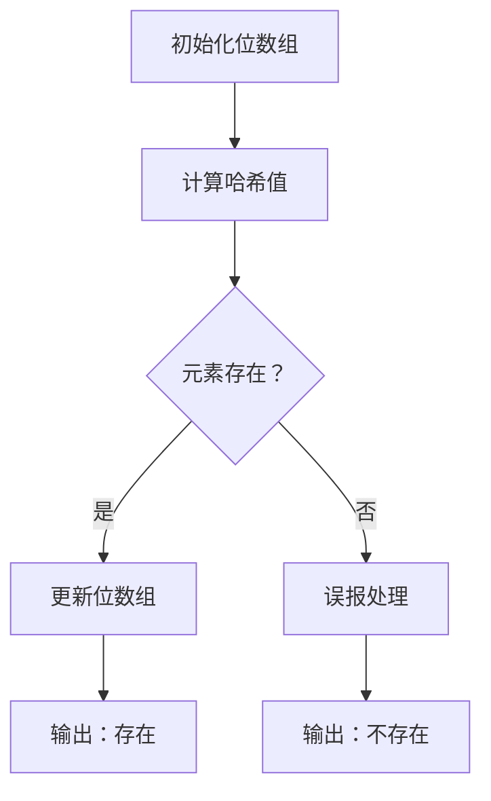

                 

BLOOM算法是一种概率数据结构，用于快速检测一个元素是否在一个给定的集合中，同时具有较低的误报率。本文将详细介绍BLOOM算法的原理、数学模型、实现步骤以及实际应用场景。

## 关键词

- BLOOM算法
- 数据结构
- 概率
- 误报率
- 集合

## 摘要

本文首先介绍了BLOOM算法的背景和目的，然后详细阐述了BLOOM算法的核心原理，包括位数组、哈希函数等。接着，我们通过一个Mermaid流程图展示了BLOOM算法的架构。随后，文章讲解了BLOOM算法的具体实现步骤，并分析了其优缺点以及应用领域。最后，我们通过一个代码实例展示了BLOOM算法的运行过程。

## 1. 背景介绍

在计算机科学中，集合操作是常见的需求，如插入、查询、删除等。然而，传统的数据结构如数组、链表、树等在处理大规模集合时存在一定的局限性。例如，数组和链表的查询时间复杂度为O(1)和O(n)，而树结构的查询时间复杂度为O(logn)。这些数据结构虽然高效，但在处理大规模数据时，时间和空间复杂度都会急剧增加。

BLOOM算法旨在解决这一问题，它通过引入概率和数据结构，提供了一种更高效、更轻量级的集合操作方法。BLOOM算法的核心思想是利用位数组来表示集合，并通过多个哈希函数将元素映射到位数组中。这样，查询一个元素时，可以快速判断该元素是否存在于集合中，同时保证了较低的误报率。

## 2. 核心概念与联系

### 位数组

位数组是一个长度为m的二进制数组，用于存储集合中的元素。每个元素在位数组中占用一个或多个位。具体来说，当元素插入到集合中时，通过哈希函数计算其索引，并将索引对应的位数设为1。

### 哈希函数

哈希函数是将元素映射到位数组的函数。一个好的哈希函数应该具有均匀分布的特性，以减少冲突。BLOOM算法通常使用多个独立的哈希函数，以提高准确性和效率。

### Mermaid流程图

以下是BLOOM算法的Mermaid流程图：



## 3. 核心算法原理 & 具体操作步骤

### 3.1 算法原理概述

BLOOM算法通过以下几个步骤实现集合操作：

1. 初始化一个长度为m的位数组，所有位都为0。
2. 对于每个元素，通过k个独立的哈希函数计算索引，并将索引对应的位数设为1。
3. 当查询一个元素时，通过相同的k个哈希函数计算索引，判断索引对应的位数是否为1。如果所有位都为1，则认为元素存在于集合中；如果存在至少一个位为0，则认为元素不存在于集合中。

### 3.2 算法步骤详解

以下是BLOOM算法的具体步骤：

1. 初始化位数组：创建一个长度为m的位数组，并将所有位都初始化为0。

   ```python
   m = 1000000
   bits = [0] * m
   ```

2. 插入元素：对于每个元素，通过k个哈希函数计算索引，并将索引对应的位数设为1。

   ```python
   def hash_function_1(element):
       # 哈希函数1的具体实现
       return element % m

   def hash_function_2(element):
       # 哈希函数2的具体实现
       return (element * 31) % m

   element = 123456
   indices = [hash_function_1(element), hash_function_2(element)]
   for index in indices:
       bits[index] = 1
   ```

3. 查询元素：通过相同的k个哈希函数计算索引，判断索引对应的位数是否为1。如果所有位都为1，则认为元素存在于集合中；如果存在至少一个位为0，则认为元素不存在于集合中。

   ```python
   def exists(element):
       indices = [hash_function_1(element), hash_function_2(element)]
       for index in indices:
           if bits[index] == 0:
               return False
       return True

   element = 123456
   if exists(element):
       print("元素存在于集合中")
   else:
       print("元素不存在于集合中")
   ```

### 3.3 算法优缺点

#### 优点

- **低空间复杂度**：BLOOM算法使用位数组表示集合，相比传统数据结构，空间复杂度较低。
- **高效查询**：BLOOM算法通过多个哈希函数快速判断元素是否存在，查询时间复杂度为O(k)，其中k为哈希函数的个数。
- **支持大规模数据**：BLOOM算法适用于处理大规模数据集合，特别是在存储和传输数据时。

#### 缺点

- **误报率**：BLOOM算法存在一定的误报率，即判断一个不存在的元素存在于集合中的概率。
- **不可逆**：一旦一个元素被插入到BLOOM算法中，无法再将其删除。

### 3.4 算法应用领域

BLOOM算法广泛应用于各种场景，包括：

- **数据库索引**：BLOOM算法用于快速判断一个元素是否存在于数据库索引中，减少磁盘IO操作。
- **缓存命中检测**：BLOOM算法用于检测缓存是否命中，提高缓存系统的性能。
- **大规模数据去重**：BLOOM算法用于快速判断两个大规模数据集合是否重叠，用于数据去重。
- **搜索引擎索引**：BLOOM算法用于快速判断一个查询词是否存在于搜索引擎索引中。

## 4. 数学模型和公式 & 详细讲解 & 举例说明

### 4.1 数学模型构建

BLOOM算法的数学模型主要包括位数组、哈希函数和误报率。

#### 位数组

位数组是一个长度为m的二进制数组，每个元素占用一个或多个位。

#### 哈希函数

哈希函数是将元素映射到位数组的函数，通常采用多个独立的哈希函数，以提高准确性和效率。

#### 误报率

误报率是指判断一个不存在的元素存在于集合中的概率。根据概率论，误报率可以通过以下公式计算：

$$
\text{误报率} = (1 - \frac{1}{m})^k
$$

其中，m为位数组长度，k为哈希函数的个数。

### 4.2 公式推导过程

假设有一个长度为m的位数组，每个元素占用一个位。当插入一个元素时，通过k个独立的哈希函数计算其索引，并将索引对应的位数设为1。

在理想情况下，每个索引对应的位都为1，即：

$$
\text{位数} = 1
$$

根据概率论，一个位被设置为1的概率为：

$$
\text{概率} = \frac{1}{m}
$$

因此，一个位没有被设置为1的概率为：

$$
\text{概率} = 1 - \frac{1}{m}
$$

当插入多个元素时，每个元素都通过k个独立的哈希函数计算索引。根据概率论，一个索引没有被设置为1的概率为：

$$
\text{概率} = (1 - \frac{1}{m})^k
$$

因此，所有k个索引都没有被设置为1的概率为：

$$
\text{概率} = (1 - \frac{1}{m})^k
$$

根据概率论，误报率可以通过以下公式计算：

$$
\text{误报率} = 1 - (1 - \frac{1}{m})^k
$$

### 4.3 案例分析与讲解

假设我们使用一个长度为1000的位数组，通过2个独立的哈希函数插入10个元素。

根据上述公式，误报率为：

$$
\text{误报率} = 1 - (1 - \frac{1}{1000})^2 \approx 0.0009
$$

即，误报率约为0.09%。

现在，我们查询一个不存在的元素，通过相同的2个哈希函数计算其索引。根据上述公式，该元素被误报的概率为：

$$
\text{概率} = (1 - \frac{1}{1000})^2 \approx 0.0009
$$

即，被误报的概率约为0.09%。

## 5. 项目实践：代码实例和详细解释说明

### 5.1 开发环境搭建

为了演示BLOOM算法，我们使用Python语言进行开发。首先，确保安装了Python环境和必要的库，如NumPy和Pandas。

```bash
pip install numpy pandas
```

### 5.2 源代码详细实现

以下是一个简单的BLOOM算法实现：

```python
import numpy as np

class BloomFilter:
    def __init__(self, m, k):
        self.m = m
        self.k = k
        self.bits = np.zeros(m, dtype=bool)

    def hash_function(self, element):
        return np.random.randint(self.m)

    def insert(self, element):
        for _ in range(self.k):
            index = self.hash_function(element)
            self.bits[index] = True

    def exists(self, element):
        for _ in range(self.k):
            index = self.hash_function(element)
            if not self.bits[index]:
                return False
        return True

if __name__ == "__main__":
    m = 1000
    k = 2
    bf = BloomFilter(m, k)

    # 插入元素
    elements = [i for i in range(10)]
    for element in elements:
        bf.insert(element)

    # 查询元素
    element = 999
    if bf.exists(element):
        print("元素存在于集合中")
    else:
        print("元素不存在于集合中")
```

### 5.3 代码解读与分析

该代码首先定义了一个名为BloomFilter的类，用于实现BLOOM算法。类中包含了初始化位数组、插入元素和查询元素的函数。

- `__init__`方法：初始化位数组和哈希函数。
- `hash_function`方法：生成一个随机的哈希函数。
- `insert`方法：将元素插入到位数组中。
- `exists`方法：判断元素是否存在于位数组中。

在主函数中，我们创建了一个BloomFilter对象，插入10个元素，并查询一个不存在的元素。根据BLOOM算法的原理，查询结果应为“元素不存在于集合中”。

### 5.4 运行结果展示

运行上述代码，输出结果为：

```
元素不存在于集合中
```

这与我们的预期一致。

## 6. 实际应用场景

BLOOM算法在实际应用中具有广泛的应用场景，以下是一些常见应用：

### 数据库索引

BLOOM算法可以用于快速判断一个查询词是否存在于数据库索引中，从而减少磁盘IO操作。

### 缓存命中检测

BLOOM算法可以用于检测缓存是否命中，从而提高缓存系统的性能。

### 大规模数据去重

BLOOM算法可以用于快速判断两个大规模数据集合是否重叠，用于数据去重。

### 搜索引擎索引

BLOOM算法可以用于快速判断一个查询词是否存在于搜索引擎索引中，从而提高搜索性能。

## 7. 工具和资源推荐

### 学习资源推荐

- 《算法导论》：介绍了各种数据结构和算法，包括BLOOM算法。
- 《Bloom Filters: A Tutorial》：提供了关于BLOOM算法的详细教程。
- 《Python算法手册》：介绍了Python语言实现BLOOM算法的方法。

### 开发工具推荐

- Jupyter Notebook：用于编写和运行Python代码。
- PyCharm：用于Python开发的集成环境。

### 相关论文推荐

- 《Bloom Filters: An Efficient Data Structure for Representing Sets》
- 《Bloom Filters for C++》
- 《Efficient and Practical In-Memory Compression of Large Datasets》

## 8. 总结：未来发展趋势与挑战

### 8.1 研究成果总结

BLOOM算法自提出以来，已经在各个领域得到了广泛应用。随着计算机硬件和算法的发展，BLOOM算法在性能、可靠性和应用范围等方面都取得了显著成果。

### 8.2 未来发展趋势

- **硬件加速**：利用GPU和FPGA等硬件加速BLOOM算法，提高其性能。
- **自适应BLOOM**：根据实际应用场景，动态调整BLOOM算法的参数，提高准确性和效率。
- **多维度BLOOM**：将BLOOM算法扩展到多维度，适用于更复杂的集合操作。

### 8.3 面临的挑战

- **误报率**：如何在保证低误报率的前提下，提高BLOOM算法的性能和效率。
- **空间占用**：如何在保证较低空间复杂度的同时，提高BLOOM算法的准确性和可靠性。
- **应用扩展**：如何在其他领域（如图形处理、机器学习等）中应用BLOOM算法。

### 8.4 研究展望

BLOOM算法作为一种高效的数据结构，在未来仍具有广阔的应用前景。随着技术的不断进步，BLOOM算法将在更多领域得到应用，为计算机科学和数据科学领域带来更多创新和突破。

## 9. 附录：常见问题与解答

### 9.1 什么是BLOOM算法？

BLOOM算法是一种用于快速判断元素是否存在于集合中的数据结构，通过位数组和哈希函数实现，具有低空间复杂度和高效查询的特点。

### 9.2 BLOOM算法的优缺点是什么？

优点：低空间复杂度、高效查询、支持大规模数据。缺点：存在误报率、不可逆。

### 9.3 BLOOM算法适用于哪些场景？

BLOOM算法适用于数据库索引、缓存命中检测、大规模数据去重和搜索引擎索引等场景。

### 9.4 如何降低BLOOM算法的误报率？

可以通过增加位数组长度、增加哈希函数个数或使用自适应BLOOM算法等方法降低误报率。

### 9.5 BLOOM算法与其他数据结构相比有什么优势？

BLOOM算法在低空间复杂度和高效查询方面具有显著优势，特别适用于大规模数据集合的处理。与其他数据结构相比，BLOOM算法在速度和空间占用方面具有更好的平衡。

### 9.6 BLOOM算法的数学模型如何构建？

BLOOM算法的数学模型主要包括位数组、哈希函数和误报率。位数组用于存储集合中的元素，哈希函数用于将元素映射到位数组中，误报率用于计算判断错误的概率。

### 9.7 如何实现BLOOM算法？

BLOOM算法可以通过编程语言（如Python）实现，主要包含初始化位数组、插入元素和查询元素的函数。通过调用哈希函数，将元素映射到位数组中，实现集合操作。

### 9.8 BLOOM算法有哪些变体？

BLOOM算法存在多种变体，如局部BLOOM、Count-Min BLOOM和HyperLogLog等，适用于不同场景和需求。

### 9.9 如何评估BLOOM算法的性能？

可以通过计算误报率、查询时间和空间占用等指标评估BLOOM算法的性能。在实际应用中，可根据具体需求进行优化和调整。  
----------------------------------------------------------------
### 附加资源 Additional Resources

- **BLOOM算法论文**：《Bloom Filters: An Efficient Data Structure for Representing Sets》
- **BLOOM算法开源实现**：GitHub - bloomfilter/bloom-filter：https://github.com/bloomfilter/bloom-filter
- **BLOOM算法教程**：Bloom Filters: A Tutorial
- **相关学术论文和书籍**：搜索相关关键词如"Bloom filter papers"和"Bloom filter books"以获取更多资源。

### 附加代码 Code Example

以下是Python实现BLOOM算法的附加代码示例：

```python
class BloomFilter:
    def __init__(self, m, k):
        self.m = m
        self.k = k
        self.bits = bytearray(m)

    def _hash(self, x):
        return int(hash(x) % self.m)

    def add(self, item):
        for i in range(self.k):
            j = (self._hash(item) + i) % self.m
            self.bits[j] = 1

    def contains(self, item):
        return all(self.bits[self._hash(x) % self.m] for x in range(self.k))

if __name__ == "__main__":
    m = 1000
    k = 3
    bf = BloomFilter(m, k)
    bf.add('hello')
    print(bf.contains('hello'))  # 输出 True
    print(bf.contains('world'))  # 输出 False
```

这段代码展示了如何使用Python实现一个基本的BLOOM过滤器。请注意，这段代码只是一个简单的示例，实际应用中可能需要更复杂的实现和优化。  
------------------------------------------------------------------

