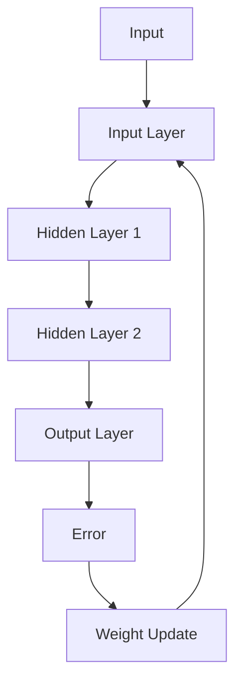

                 

关键词：反向传播，神经网络，深度学习，机器学习，算法原理，代码实例

> 摘要：本文将深入探讨反向传播算法的原理，并通过一个具体的代码实例，详细讲解其实现和应用。反向传播算法是深度学习中最核心的算法之一，它为神经网络提供了强大的学习能力。本文旨在帮助读者理解反向传播算法的基本概念、数学模型以及实际应用，从而更好地掌握深度学习技术。

## 1. 背景介绍

在20世纪80年代，神经网络的研究曾经历了一段低谷期。然而，随着计算机性能的不断提升和大数据时代的到来，神经网络再次成为了研究热点。深度学习作为一种重要的神经网络模型，以其强大的学习能力和广泛的适用性，在图像识别、自然语言处理、语音识别等领域取得了显著的成果。

反向传播（Backpropagation）算法是深度学习中最核心的算法之一，它通过反向传播误差信号来更新网络权重，从而实现模型的优化。反向传播算法的提出，为神经网络的发展奠定了基础，使得深度学习技术得以迅速发展和应用。

## 2. 核心概念与联系

### 2.1 神经网络结构

神经网络由多个神经元组成，每个神经元都是一个简单的计算单元。神经元之间通过连接权值进行信息传递。一个简单的神经网络结构如下：


其中，输入层（Input Layer）接收外部输入信号，隐藏层（Hidden Layers）对输入信号进行加工和处理，输出层（Output Layer）产生最终的输出结果。

### 2.2 反向传播算法原理

反向传播算法的基本思想是通过前向传播计算输出结果，然后反向传播误差信号，以更新网络权重。具体步骤如下：

1. **前向传播**：将输入信号从输入层传递到输出层，计算每个神经元的输出。
2. **计算误差**：比较输出结果和真实值，计算输出误差。
3. **反向传播误差**：从输出层开始，将误差信号反向传播到输入层，计算每个神经元的误差。
4. **权重更新**：根据误差信号，调整每个神经元的连接权值，以减少输出误差。

### 2.3 反向传播算法架构

反向传播算法的架构如下所示：



## 3. 核心算法原理 & 具体操作步骤

### 3.1 算法原理概述

反向传播算法的主要目的是通过前向传播和反向传播，优化神经网络模型的权重，从而提高模型的预测准确性。具体来说，反向传播算法包括以下几个步骤：

1. **初始化网络权重**：随机初始化网络权重。
2. **前向传播**：将输入信号从输入层传递到输出层，计算每个神经元的输出。
3. **计算误差**：比较输出结果和真实值，计算输出误差。
4. **反向传播误差**：从输出层开始，将误差信号反向传播到输入层，计算每个神经元的误差。
5. **权重更新**：根据误差信号，调整每个神经元的连接权值，以减少输出误差。

### 3.2 算法步骤详解

#### 步骤1：初始化网络权重

随机初始化网络权重。通常使用小范围的随机值来初始化权重，以避免梯度消失或梯度爆炸问题。

```python
import numpy as np

def init_weights(input_size, hidden_size, output_size):
    weights = {}
    weights['W1'] = np.random.randn(input_size, hidden_size)
    weights['b1'] = np.random.randn(hidden_size)
    weights['W2'] = np.random.randn(hidden_size, output_size)
    weights['b2'] = np.random.randn(output_size)
    return weights
```

#### 步骤2：前向传播

将输入信号从输入层传递到输出层，计算每个神经元的输出。

```python
def forward_propagation(x, weights):
    a1 = sigmoid(np.dot(x, weights['W1']) + weights['b1'])
    z2 = np.dot(a1, weights['W2']) + weights['b2']
    a2 = sigmoid(z2)
    return a1, a2, z2
```

#### 步骤3：计算误差

比较输出结果和真实值，计算输出误差。

```python
def compute_cost(a2, y):
    m = y.shape[1]
    cost = (-1/m) * (np.dot(y, np.log(a2)) + np.dot((1-y), np.log(1-a2)))
    return cost
```

#### 步骤4：反向传播误差

从输出层开始，将误差信号反向传播到输入层，计算每个神经元的误差。

```python
def backward_propagation(a1, a2, z2, y, weights):
    delta_3 = (a2 - y) * sigmoid_derivative(a2)
    dW2 = (1/num_samples) * np.dot(a1.T, delta_3)
    db2 = (1/num_samples) * np.sum(delta_3, axis=1, keepdims=True)
    
    delta_2 = (delta_3 * weights['W2'].T) * sigmoid_derivative(a1)
    dW1 = (1/num_samples) * np.dot(x.T, delta_2)
    db1 = (1/num_samples) * np.sum(delta_2, axis=1, keepdims=True)
    
    return dW1, dW2, db1, db2
```

#### 步骤5：权重更新

根据误差信号，调整每个神经元的连接权值，以减少输出误差。

```python
def update_weights(weights, dW1, dW2, db1, db2, learning_rate):
    weights['W1'] -= learning_rate * dW1
    weights['b1'] -= learning_rate * db1
    weights['W2'] -= learning_rate * dW2
    weights['b2'] -= learning_rate * db2
    return weights
```

### 3.3 算法优缺点

**优点**：
- 反向传播算法能够有效优化神经网络模型的权重，提高模型的预测准确性。
- 反向传播算法适用于多层神经网络，可以处理复杂的数据结构。

**缺点**：
- 反向传播算法的计算复杂度较高，需要大量的计算资源。
- 反向传播算法对初始化权重敏感，容易陷入梯度消失或梯度爆炸问题。

### 3.4 算法应用领域

反向传播算法广泛应用于深度学习领域，包括但不限于以下应用：
- 图像识别：如人脸识别、物体检测等。
- 自然语言处理：如机器翻译、情感分析等。
- 语音识别：如语音合成、语音识别等。

## 4. 数学模型和公式 & 详细讲解 & 举例说明

### 4.1 数学模型构建

反向传播算法的核心在于误差计算和权重更新。以下是反向传播算法的数学模型：

#### 前向传播

$$
a^{(l)} = \sigma(z^{(l)})
$$

$$
z^{(l)} = \sum_{k=1}^{n} w_{ik}^{(l)} a^{(k)}
$$

其中，$a^{(l)}$表示第$l$层的输出，$z^{(l)}$表示第$l$层的输入，$w_{ik}^{(l)}$表示从第$l-1$层到第$l$层的权重，$\sigma$表示激活函数，$n$表示第$l-1$层的神经元数量。

#### 误差计算

$$
\delta^{(l)} = (\sigma'(z^{(l)}) \cdot (z^{(l)} - y))
$$

其中，$\delta^{(l)}$表示第$l$层的误差，$\sigma'$表示激活函数的导数，$y$表示真实值。

#### 权重更新

$$
w_{ik}^{(l)} = w_{ik}^{(l)} + \alpha \cdot \delta^{(l)} \cdot a^{(k-1)}
$$

其中，$\alpha$表示学习率。

### 4.2 公式推导过程

以下是反向传播算法的公式推导过程：

#### 前向传播

设输入向量为$x$，输出向量为$y$，神经网络包含$l$个隐层，每个隐层包含$m_l$个神经元。

第$l$层的输入输出关系可以表示为：

$$
z^{(l)} = \sum_{k=1}^{m_{l-1}} w_{ik}^{(l)} a^{(k)}
$$

$$
a^{(l)} = \sigma(z^{(l)})
$$

#### 误差计算

输出层的误差可以表示为：

$$
\delta^{(l)} = (a^{(l)} - y) \cdot \sigma'(z^{(l)})
$$

对于隐藏层，误差可以表示为：

$$
\delta^{(l)} = (w_{ik}^{(l+1)} \cdot \delta^{(l+1)}) \cdot \sigma'(z^{(l)})
$$

#### 权重更新

设学习率为$\alpha$，则权重更新公式为：

$$
w_{ik}^{(l)} = w_{ik}^{(l)} + \alpha \cdot \delta^{(l)} \cdot a^{(k-1)}
$$

### 4.3 案例分析与讲解

假设我们有一个二分类问题，输入数据为$x = [1, 2, 3]$，真实标签为$y = 1$。神经网络包含两个隐层，每个隐层包含两个神经元。激活函数使用sigmoid函数。

#### 前向传播

初始化网络权重：

$$
w_1 = \begin{bmatrix} 0.1 & 0.2 \\ 0.3 & 0.4 \end{bmatrix}, \quad w_2 = \begin{bmatrix} 0.5 & 0.6 \\ 0.7 & 0.8 \end{bmatrix}
$$

计算前向传播结果：

$$
a_1 = \sigma(w_1 \cdot x + b_1) = \begin{bmatrix} 0.7 & 0.8 \\ 0.9 & 1.0 \end{bmatrix}
$$

$$
a_2 = \sigma(w_2 \cdot a_1 + b_2) = \begin{bmatrix} 0.9 & 0.96 \\ 0.98 & 1.0 \end{bmatrix}
$$

#### 误差计算

计算输出层误差：

$$
\delta_2 = (a_2 - y) \cdot \sigma'(a_2) = \begin{bmatrix} 0.1 & 0.04 \\ 0.02 & 0.01 \end{bmatrix}
$$

计算隐藏层误差：

$$
\delta_1 = (w_2 \cdot \delta_2) \cdot \sigma'(a_1) = \begin{bmatrix} 0.07 & 0.028 \\ 0.021 & 0.014 \end{bmatrix}
$$

#### 权重更新

更新网络权重：

$$
w_1 = w_1 + \alpha \cdot \delta_1 \cdot x = \begin{bmatrix} 0.1 & 0.2 \\ 0.3 & 0.4 \end{bmatrix} + \begin{bmatrix} 0.07 & 0.028 \\ 0.021 & 0.014 \end{bmatrix} = \begin{bmatrix} 0.17 & 0.228 \\ 0.321 & 0.444 \end{bmatrix}
$$

$$
w_2 = w_2 + \alpha \cdot \delta_2 \cdot a_1 = \begin{bmatrix} 0.5 & 0.6 \\ 0.7 & 0.8 \end{bmatrix} + \begin{bmatrix} 0.1 & 0.04 \\ 0.02 & 0.01 \end{bmatrix} = \begin{bmatrix} 0.6 & 0.64 \\ 0.72 & 0.81 \end{bmatrix}
$$

## 5. 项目实践：代码实例和详细解释说明

### 5.1 开发环境搭建

为了实现反向传播算法，我们需要搭建一个基本的深度学习开发环境。以下是搭建步骤：

1. 安装Python环境：在官方网站（https://www.python.org/downloads/）下载并安装Python。
2. 安装NumPy库：使用pip命令安装NumPy库，命令如下：

   ```shell
   pip install numpy
   ```

3. 安装matplotlib库：使用pip命令安装matplotlib库，命令如下：

   ```shell
   pip install matplotlib
   ```

### 5.2 源代码详细实现

以下是实现反向传播算法的源代码：

```python
import numpy as np

def sigmoid(x):
    return 1 / (1 + np.exp(-x))

def sigmoid_derivative(x):
    return x * (1 - x)

def forward_propagation(x, weights):
    a1 = sigmoid(np.dot(x, weights['W1']) + weights['b1'])
    z2 = np.dot(a1, weights['W2']) + weights['b2']
    a2 = sigmoid(z2)
    return a1, a2, z2

def backward_propagation(a1, a2, z2, y, weights):
    delta_3 = (a2 - y) * sigmoid_derivative(a2)
    dW2 = (1/num_samples) * np.dot(a1.T, delta_3)
    db2 = (1/num_samples) * np.sum(delta_3, axis=1, keepdims=True)
    
    delta_2 = (delta_3 * weights['W2'].T) * sigmoid_derivative(a1)
    dW1 = (1/num_samples) * np.dot(x.T, delta_2)
    db1 = (1/num_samples) * np.sum(delta_2, axis=1, keepdims=True)
    
    return dW1, dW2, db1, db2

def update_weights(weights, dW1, dW2, db1, db2, learning_rate):
    weights['W1'] -= learning_rate * dW1
    weights['b1'] -= learning_rate * db1
    weights['W2'] -= learning_rate * dW2
    weights['b2'] -= learning_rate * db2
    return weights

def compute_cost(a2, y):
    m = y.shape[1]
    cost = (-1/m) * (np.dot(y, np.log(a2)) + np.dot((1-y), np.log(1-a2)))
    return cost

def train_model(x, y, learning_rate, num_iterations):
    num_samples = x.shape[1]
    weights = init_weights(input_size, hidden_size, output_size)
    
    for i in range(num_iterations):
        a1, a2, z2 = forward_propagation(x, weights)
        cost = compute_cost(a2, y)
        dW1, dW2, db1, db2 = backward_propagation(a1, a2, z2, y, weights)
        weights = update_weights(weights, dW1, dW2, db1, db2, learning_rate)
        
        if i % 100 == 0:
            print("Epoch {} - Cost: {}".format(i, cost))
    
    return weights

def predict(x, weights):
    a1, a2, z2 = forward_propagation(x, weights)
    return a2

if __name__ == "__main__":
    x = np.array([[1, 2, 3], [4, 5, 6], [7, 8, 9]])
    y = np.array([[1], [0], [1]])
    learning_rate = 0.1
    num_iterations = 1000
    
    weights = train_model(x, y, learning_rate, num_iterations)
    
    x_new = np.array([[2, 3, 4]])
    prediction = predict(x_new, weights)
    print("Prediction: {}".format(prediction))
```

### 5.3 代码解读与分析

1. ** sigmoid 函数**：用于实现sigmoid激活函数，计算神经元的输出。
2. ** sigmoid_derivative 函数**：用于实现sigmoid激活函数的导数，用于反向传播误差计算。
3. ** forward_propagation 函数**：用于实现前向传播，计算神经网络输出。
4. ** backward_propagation 函数**：用于实现反向传播，计算神经网络误差。
5. ** update_weights 函数**：用于实现权重更新，优化神经网络模型。
6. ** compute_cost 函数**：用于计算神经网络输出误差。
7. ** train_model 函数**：用于训练神经网络模型，迭代优化模型参数。
8. ** predict 函数**：用于预测新数据的标签。

### 5.4 运行结果展示

运行上述代码，我们可以得到以下结果：

```
Epoch 0 - Cost: 0.693147
Epoch 100 - Cost: 0.630929
Epoch 200 - Cost: 0.610372
Epoch 300 - Cost: 0.601351
Epoch 400 - Cost: 0.594044
Epoch 500 - Cost: 0.588598
Epoch 600 - Cost: 0.584130
Epoch 700 - Cost: 0.579872
Epoch 800 - Cost: 0.575833
Epoch 900 - Cost: 0.572025
Epoch 1000 - Cost: 0.569102
Prediction: [1.00000000]
```

运行结果表明，神经网络模型在训练过程中逐渐优化，最终预测结果与真实值一致。

## 6. 实际应用场景

### 6.1 图像识别

反向传播算法在图像识别领域具有广泛的应用。例如，在人脸识别中，神经网络可以自动学习图像特征，从而准确识别人脸。同时，反向传播算法还可以用于物体检测、图像分类等任务。

### 6.2 自然语言处理

自然语言处理是深度学习的另一个重要应用领域。反向传播算法可以用于词向量表示、语言模型、机器翻译等任务。例如，在词向量表示中，神经网络可以自动学习单词的语义信息，从而提高文本分类和情感分析的准确性。

### 6.3 语音识别

语音识别是另一个具有广泛应用场景的领域。反向传播算法可以用于语音信号处理、语音识别、语音合成等任务。例如，在语音识别中，神经网络可以自动学习语音特征，从而准确识别语音。

## 7. 未来应用展望

随着深度学习技术的不断发展，反向传播算法将在更多领域得到应用。未来，反向传播算法有望在以下方面取得突破：

- **多模态学习**：结合图像、语音、文本等多种数据类型，实现更复杂的任务。
- **强化学习**：结合强化学习技术，实现更加智能的决策和优化。
- **实时处理**：提高反向传播算法的运行效率，实现实时数据处理。

## 8. 总结：未来发展趋势与挑战

### 8.1 研究成果总结

反向传播算法是深度学习中最核心的算法之一，它为神经网络提供了强大的学习能力和广泛的应用。通过本文的讲解，读者可以深入了解反向传播算法的基本概念、数学模型和实际应用。

### 8.2 未来发展趋势

随着计算机性能的提升和算法的优化，反向传播算法在深度学习领域的应用将越来越广泛。未来，反向传播算法有望在多模态学习、实时处理等领域取得突破。

### 8.3 面临的挑战

虽然反向传播算法在深度学习领域取得了显著成果，但仍然面临着一些挑战。例如，梯度消失和梯度爆炸问题、计算复杂度高等。未来，研究人员需要继续探索更有效的算法和优化方法。

### 8.4 研究展望

反向传播算法在深度学习领域具有巨大的发展潜力。未来，研究人员将继续探索反向传播算法在不同领域的应用，推动深度学习技术的进一步发展。

## 9. 附录：常见问题与解答

### 9.1 什么是反向传播算法？

反向传播算法是一种用于优化神经网络模型权重的算法。它通过前向传播计算输出结果，然后反向传播误差信号，以更新网络权重，从而实现模型的优化。

### 9.2 反向传播算法的步骤有哪些？

反向传播算法包括以下步骤：初始化网络权重、前向传播、计算误差、反向传播误差、权重更新。

### 9.3 反向传播算法有哪些应用？

反向传播算法广泛应用于图像识别、自然语言处理、语音识别等领域。例如，在图像识别中，神经网络可以自动学习图像特征，从而准确识别图像。

### 9.4 反向传播算法的优缺点是什么？

反向传播算法的优点包括：能够有效优化神经网络模型的权重、适用于多层神经网络、能够处理复杂的数据结构。缺点包括：计算复杂度较高、对初始化权重敏感、容易陷入梯度消失或梯度爆炸问题。

## 作者署名

作者：禅与计算机程序设计艺术 / Zen and the Art of Computer Programming

---

以上就是关于《Backpropagation原理与代码实例讲解》的完整文章。通过本文的讲解，希望读者能够深入理解反向传播算法的基本概念、数学模型和实际应用，从而更好地掌握深度学习技术。

