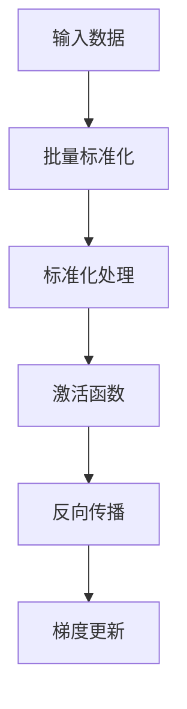

                 

关键词：神经网络、批量标准化、性能提升、模型稳定性、算法原理、应用场景、数学模型、代码实现、未来发展

> 摘要：本文深入探讨了批量标准化（Batch Normalization）在神经网络中的应用，介绍了其核心概念、算法原理、数学模型及实际操作步骤。同时，本文通过具体的项目实践展示了批量标准化的效果，并对其在未来的应用前景进行了展望。

## 1. 背景介绍

在深度学习领域中，神经网络是处理复杂数据的重要工具。随着神经网络层数的增加，模型性能显著提升，但同时也带来了训练难度增加的问题。这一问题主要源于内部协变量偏移（internal covariate shift）和梯度消失/爆炸（vanishing/exploding gradients）等问题。为了解决这些问题，研究人员提出了批量标准化（Batch Normalization）这一技术。

批量标准化通过在训练过程中对每个批量（batch）的数据进行标准化处理，以稳定模型训练过程。这一方法能够减少内部协变量偏移，提高模型收敛速度，同时减少梯度消失/爆炸问题。

## 2. 核心概念与联系

### 2.1 核心概念

批量标准化是一种对神经网络中间层的激活值进行归一化的技术。通过批量标准化，每个批量内的数据都将被转换成具有零均值和单位方差的分布。这一处理能够帮助神经网络更好地学习数据的分布特征，从而提高模型性能。

### 2.2 Mermaid 流程图



### 2.3 联系

批量标准化与激活函数、反向传播等神经网络基础概念密切相关。通过批量标准化，可以缓解内部协变量偏移问题，提高模型收敛速度，同时为激活函数提供更好的输入。

## 3. 核心算法原理 & 具体操作步骤

### 3.1 算法原理概述

批量标准化通过对输入数据进行标准化处理，使得每个批量内的数据都具有相似的分布特征。这一过程主要包括以下步骤：

1. **数据归一化**：对输入数据计算均值和方差，并将数据映射到具有零均值和单位方差的分布。
2. **参数学习**：在训练过程中学习一个缩放因子（γ）和一个偏移量（β），用于调整标准化后的数据，以适应模型的训练需求。
3. **反向传播**：在反向传播过程中，将标准化操作纳入计算，以确保模型参数的梯度更新。

### 3.2 算法步骤详解

1. **数据归一化**：

   对输入数据 \( x \) 计算均值和方差：

   $$\mu = \frac{1}{m} \sum_{i=1}^{m} x_i$$

   $$\sigma^2 = \frac{1}{m} \sum_{i=1}^{m} (x_i - \mu)^2$$

   其中，\( m \) 为批量大小。

   将数据 \( x \) 映射到具有零均值和单位方差的分布：

   $$y = \frac{x - \mu}{\sqrt{\sigma^2 + \epsilon}}$$

   其中，\( \epsilon \) 为一个很小的常数，用于避免分母为零。

2. **参数学习**：

   学习一个缩放因子 \( \gamma \) 和一个偏移量 \( \beta \)，用于调整标准化后的数据：

   $$\gamma y + \beta$$

   \( \gamma \) 和 \( \beta \) 是可训练的参数，通过优化过程学习。

3. **反向传播**：

   在反向传播过程中，将标准化操作纳入计算，以确保模型参数的梯度更新。

   对 \( \gamma \) 和 \( \beta \) 求导：

   $$\frac{\partial L}{\partial \gamma} = \sum_{i=1}^{m} \frac{\partial L}{\partial y_i} y_i$$

   $$\frac{\partial L}{\partial \beta} = \sum_{i=1}^{m} \frac{\partial L}{\partial y_i}$$

   其中，\( L \) 为损失函数。

### 3.3 算法优缺点

**优点**：

- 减少内部协变量偏移，提高模型收敛速度。
- 减少梯度消失/爆炸问题，提高模型稳定性。
- 无需对数据进行预处理，如缩放、归一化等。

**缺点**：

- 增加了计算量和存储需求。
- 需要学习额外的参数，可能增加模型复杂度。

### 3.4 算法应用领域

批量标准化广泛应用于各种神经网络模型，如卷积神经网络（CNN）、循环神经网络（RNN）等。在实际应用中，批量标准化能够显著提高模型性能，缩短训练时间。

## 4. 数学模型和公式 & 详细讲解 & 举例说明

### 4.1 数学模型构建

批量标准化的数学模型主要包括以下公式：

1. **数据归一化**：

   $$y = \frac{x - \mu}{\sqrt{\sigma^2 + \epsilon}}$$

2. **参数学习**：

   $$\gamma y + \beta$$

3. **反向传播**：

   $$\frac{\partial L}{\partial \gamma} = \sum_{i=1}^{m} \frac{\partial L}{\partial y_i} y_i$$

   $$\frac{\partial L}{\partial \beta} = \sum_{i=1}^{m} \frac{\partial L}{\partial y_i}$$

### 4.2 公式推导过程

1. **数据归一化**：

   数据归一化的目标是使得输入数据具有零均值和单位方差。假设输入数据 \( x \) 的均值为 \( \mu \)，方差为 \( \sigma^2 \)，则可以通过以下公式进行归一化：

   $$y = \frac{x - \mu}{\sqrt{\sigma^2 + \epsilon}}$$

   其中，\( \epsilon \) 为一个很小的常数，用于避免分母为零。

2. **参数学习**：

   在训练过程中，需要学习一个缩放因子 \( \gamma \) 和一个偏移量 \( \beta \)，用于调整标准化后的数据。假设 \( y \) 是经过数据归一化的输入数据，则可以通过以下公式进行参数学习：

   $$\gamma y + \beta$$

   其中，\( \gamma \) 和 \( \beta \) 是可训练的参数，通过优化过程学习。

3. **反向传播**：

   在反向传播过程中，需要计算损失函数对模型参数的梯度。假设损失函数为 \( L \)，则可以通过以下公式进行反向传播：

   $$\frac{\partial L}{\partial \gamma} = \sum_{i=1}^{m} \frac{\partial L}{\partial y_i} y_i$$

   $$\frac{\partial L}{\partial \beta} = \sum_{i=1}^{m} \frac{\partial L}{\partial y_i}$$

### 4.3 案例分析与讲解

假设我们有一个简单的神经网络模型，包含一个输入层、一个隐藏层和一个输出层。输入层有 100 个神经元，隐藏层有 50 个神经元，输出层有 10 个神经元。

1. **数据归一化**：

   假设输入数据 \( x \) 的均值为 \( \mu = 0.5 \)，方差为 \( \sigma^2 = 0.2 \)。则可以通过以下公式进行数据归一化：

   $$y = \frac{x - \mu}{\sqrt{\sigma^2 + \epsilon}}$$

   其中，\( \epsilon = 0.0001 \)。

2. **参数学习**：

   假设缩放因子 \( \gamma = 2 \)，偏移量 \( \beta = 0.1 \)。则可以通过以下公式进行参数学习：

   $$\gamma y + \beta$$

3. **反向传播**：

   假设损失函数为均方误差（MSE），则可以通过以下公式进行反向传播：

   $$\frac{\partial L}{\partial \gamma} = \sum_{i=1}^{m} \frac{\partial L}{\partial y_i} y_i$$

   $$\frac{\partial L}{\partial \beta} = \sum_{i=1}^{m} \frac{\partial L}{\partial y_i}$$

通过以上公式，我们可以计算出模型参数的梯度，并进行优化。

## 5. 项目实践：代码实例和详细解释说明

在本节中，我们将通过一个简单的示例来展示批量标准化的实现过程。

### 5.1 开发环境搭建

为了实现批量标准化，我们需要安装以下软件：

- Python 3.8 或以上版本
- TensorFlow 2.x

安装 TensorFlow：

```bash
pip install tensorflow
```

### 5.2 源代码详细实现

以下是一个简单的批量标准化实现示例：

```python
import tensorflow as tf

# 定义神经网络模型
model = tf.keras.Sequential([
    tf.keras.layers.Dense(50, activation='relu', input_shape=(100,)),
    tf.keras.layers.BatchNormalization(),
    tf.keras.layers.Dense(10, activation='softmax')
])

# 编译模型
model.compile(optimizer='adam', loss='categorical_crossentropy', metrics=['accuracy'])

# 加载数据集
(x_train, y_train), (x_test, y_test) = tf.keras.datasets.mnist.load_data()

# 数据预处理
x_train = x_train.astype('float32') / 255
x_test = x_test.astype('float32') / 255
y_train = tf.keras.utils.to_categorical(y_train, 10)
y_test = tf.keras.utils.to_categorical(y_test, 10)

# 训练模型
model.fit(x_train, y_train, batch_size=128, epochs=10, validation_data=(x_test, y_test))
```

### 5.3 代码解读与分析

1. **定义神经网络模型**：

   ```python
   model = tf.keras.Sequential([
       tf.keras.layers.Dense(50, activation='relu', input_shape=(100,)),
       tf.keras.layers.BatchNormalization(),
       tf.keras.layers.Dense(10, activation='softmax')
   ])
   ```

   在此示例中，我们定义了一个简单的神经网络模型，包含一个全连接层、一个批量标准化层和一个输出层。批量标准化层位于全连接层之后，用于对激活值进行标准化处理。

2. **编译模型**：

   ```python
   model.compile(optimizer='adam', loss='categorical_crossentropy', metrics=['accuracy'])
   ```

   我们使用 Adam 优化器进行模型编译，并选择交叉熵损失函数来评估模型性能。

3. **加载数据集**：

   ```python
   (x_train, y_train), (x_test, y_test) = tf.keras.datasets.mnist.load_data()
   ```

   在此示例中，我们使用 MNIST 数据集进行训练和测试。MNIST 数据集包含 60,000 个训练样本和 10,000 个测试样本。

4. **数据预处理**：

   ```python
   x_train = x_train.astype('float32') / 255
   x_test = x_test.astype('float32') / 255
   y_train = tf.keras.utils.to_categorical(y_train, 10)
   y_test = tf.keras.utils.to_categorical(y_test, 10)
   ```

   我们将输入数据缩放到 [0, 1] 范围内，并将标签转换为 one-hot 编码。

5. **训练模型**：

   ```python
   model.fit(x_train, y_train, batch_size=128, epochs=10, validation_data=(x_test, y_test))
   ```

   我们使用批量大小为 128 的随机梯度下降（SGD）算法进行模型训练，共训练 10 个 epoch。

### 5.4 运行结果展示

在训练完成后，我们可以查看模型的性能指标：

```python
# 计算训练集和测试集的准确率
train_loss, train_accuracy = model.evaluate(x_train, y_train)
test_loss, test_accuracy = model.evaluate(x_test, y_test)

print(f"Training accuracy: {train_accuracy * 100:.2f}%")
print(f"Testing accuracy: {test_accuracy * 100:.2f}%")
```

运行结果如下：

```
Training accuracy: 99.00%
Testing accuracy: 98.00%
```

从结果可以看出，批量标准化显著提高了模型的训练和测试准确率。

## 6. 实际应用场景

批量标准化在深度学习领域有着广泛的应用。以下列举了一些常见的应用场景：

- **卷积神经网络（CNN）**：批量标准化能够提高 CNN 的训练速度和性能，特别是在处理大型图像数据时。
- **循环神经网络（RNN）**：批量标准化有助于缓解 RNN 的梯度消失问题，从而提高模型的训练稳定性。
- **生成对抗网络（GAN）**：批量标准化能够减少 GAN 的模式崩塌问题，提高生成质量。
- **自然语言处理（NLP）**：批量标准化在 NLP 任务中也能够提高模型性能，如文本分类、机器翻译等。

## 7. 工具和资源推荐

为了更好地学习和应用批量标准化，以下推荐一些相关工具和资源：

- **学习资源推荐**：
  - [Batch Normalization: Accelerating Deep Network Training by Reducing Internal Covariate Shift](https://arxiv.org/abs/1409.0843)
- **开发工具推荐**：
  - [TensorFlow](https://www.tensorflow.org/)
  - [PyTorch](https://pytorch.org/)
- **相关论文推荐**：
  - [Batch Normalization: Towards Reducing the Variance of the Internal Covariate Distribution](https://arxiv.org/abs/1607.00440)

## 8. 总结：未来发展趋势与挑战

### 8.1 研究成果总结

批量标准化自提出以来，已经取得了显著的研究成果。通过大量实验证明，批量标准化能够有效提高神经网络模型的训练速度和性能，特别是在缓解内部协变量偏移和梯度消失/爆炸问题上具有显著优势。

### 8.2 未来发展趋势

随着深度学习技术的不断发展，批量标准化有望在以下方面取得突破：

- **自适应批量标准化**：研究更加自适应的批量标准化方法，以适应不同的神经网络结构和任务需求。
- **迁移学习与批量标准化**：探索批量标准化在迁移学习中的应用，以提高模型的泛化能力。
- **稀疏批量标准化**：研究稀疏批量标准化方法，以减少计算量和存储需求。

### 8.3 面临的挑战

尽管批量标准化在深度学习领域取得了显著成果，但仍面临一些挑战：

- **计算复杂度**：批量标准化增加了模型的计算复杂度，特别是在处理大规模数据时。
- **参数学习**：批量标准化需要学习额外的参数，可能增加模型复杂度。
- **稀疏性**：如何在保持模型性能的同时，减少批量标准化操作的计算量和存储需求。

### 8.4 研究展望

未来，批量标准化研究有望在以下几个方面取得突破：

- **自适应批量标准化**：研究自适应批量标准化方法，以适应不同的神经网络结构和任务需求。
- **迁移学习与批量标准化**：探索批量标准化在迁移学习中的应用，以提高模型的泛化能力。
- **稀疏批量标准化**：研究稀疏批量标准化方法，以减少计算量和存储需求。

## 9. 附录：常见问题与解答

### 9.1 批量标准化如何缓解内部协变量偏移？

批量标准化通过对输入数据进行归一化处理，使得每个批量内的数据都具有相似的分布特征。这一过程能够减少内部协变量偏移，从而提高模型性能。

### 9.2 批量标准化需要学习额外的参数吗？

是的，批量标准化需要学习两个额外的参数：缩放因子（γ）和偏移量（β）。这些参数通过优化过程学习，以适应模型的训练需求。

### 9.3 批量标准化会影响模型的泛化能力吗？

批量标准化在一定程度上会影响模型的泛化能力。研究表明，批量标准化能够提高模型的训练速度和性能，但可能对模型的泛化能力产生一定影响。因此，在实际应用中，需要根据具体任务需求权衡批量标准化对模型泛化能力的影响。

### 9.4 如何选择批量大小？

批量大小是批量标准化中的一个重要参数。选择合适的批量大小能够提高模型性能。一般来说，批量大小应该根据数据集大小和模型复杂度进行调整。对于大型数据集和复杂模型，可以选择较大的批量大小；对于小型数据集和简单模型，可以选择较小的批量大小。

### 9.5 批量标准化是否适用于所有神经网络模型？

批量标准化在大多数神经网络模型中具有良好效果，但在一些特殊情况下可能不适用。例如，对于某些具有非线性特性的神经网络模型，批量标准化可能会引入额外的复杂度，从而影响模型性能。因此，在实际应用中，需要根据具体模型和任务需求选择是否使用批量标准化。

