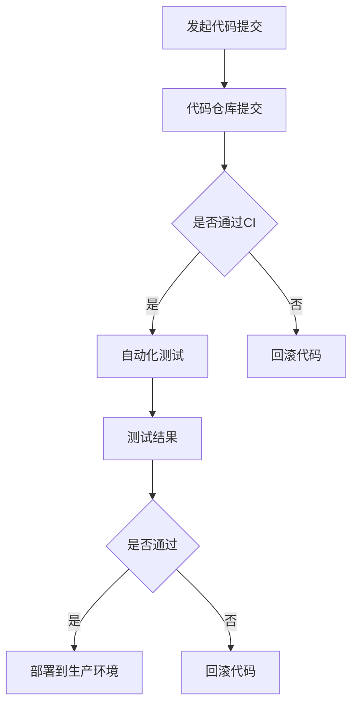

                 

## 1. 背景介绍

在当今快速发展的信息技术领域，软件交付的效率和可靠性变得越来越重要。为了满足日益增长的市场需求，企业需要能够在短时间内发布高质量的产品。然而，传统的软件开发生命周期（SDLC）往往涉及到繁琐的手动流程，这不仅降低了开发效率，还增加了出错的可能性。因此，Continuous Integration/Continuous Deployment（CI/CD）和自动化测试技术应运而生。

CI/CD 是一种软件开发和部署的实践方法，旨在通过持续集成和持续部署来提高软件开发的效率和质量。CI/CD 的核心思想是通过自动化构建、测试和部署流程，实现快速、频繁且可靠的软件交付。自动化测试则是在软件开发过程中，通过预先编写的测试脚本，对软件的功能、性能、安全等方面进行自动化检查和验证，以确保软件的质量。

本文将深入探讨 CI/CD 和自动化测试的原理，并通过实际代码案例，详细讲解如何实现这两个技术。希望通过本文，读者能够对 CI/CD 和自动化测试有一个全面的理解，并能够将其应用到实际的软件开发中。

## 2. 核心概念与联系

在深入探讨 CI/CD 和自动化测试之前，我们首先需要了解一些核心概念和它们之间的联系。

### 2.1 Continuous Integration (CI)

Continuous Integration 是指在软件开发生命周期中，将代码的频繁合并和持续集成到主干分支。CI 的核心目的是通过自动化的方式，及时发现和解决代码集成过程中的问题，从而降低集成风险，提高代码质量。

### 2.2 Continuous Deployment (CD)

Continuous Deployment 是在 CI 的基础上，将经过集成测试的代码自动部署到生产环境。CD 的目的是实现快速、频繁且可靠的软件交付，从而满足市场需求。

### 2.3 自动化测试

自动化测试是指使用自动化测试工具，对软件进行自动化测试。自动化测试可以覆盖功能测试、性能测试、安全测试等多个方面，从而提高测试效率和测试覆盖率。

### 2.4 CI/CD 与自动化测试的联系

CI/CD 和自动化测试密不可分。CI 是 CD 的前提和基础，没有有效的 CI，CD 就无法实现。同时，自动化测试是 CI/CD 的重要环节，通过自动化测试，可以确保代码的质量和稳定性，从而提高 CI/CD 的效率和可靠性。

### 2.5 Mermaid 流程图

为了更清晰地展示 CI/CD 和自动化测试的流程，我们使用 Mermaid 流程图进行说明。



图 2-1 CI/CD 与自动化测试流程图

在上图中，A 表示开发者提交代码到仓库，B 表示代码仓库接收提交。C 表示是否通过 CI，如果通过，则进入自动化测试阶段 D，否则回滚代码到上一个稳定版本 E。D 表示自动化测试，测试结果 F 用来判断是否通过，如果通过，则进入部署阶段 H，否则回滚代码到上一个稳定版本 I。

## 3. 核心算法原理 & 具体操作步骤

### 3.1 算法原理概述

CI/CD 和自动化测试的核心算法原理主要涉及版本控制、自动化构建、自动化测试和自动化部署。以下是这些核心算法的简要概述：

#### 3.1.1 版本控制

版本控制是 CI/CD 的基础，它通过跟踪代码的历史变化，确保代码的一致性和可追溯性。常用的版本控制工具包括 Git、SVN 等。

#### 3.1.2 自动化构建

自动化构建是将代码从仓库中提取出来，通过构建工具（如 Maven、Gradle 等）进行编译、打包和依赖管理。自动化构建可以确保每次构建的代码都是一致的，从而减少构建错误。

#### 3.1.3 自动化测试

自动化测试是通过自动化测试工具（如 Selenium、JUnit 等）对软件进行功能测试、性能测试、安全测试等。自动化测试可以提高测试效率，减少测试成本。

#### 3.1.4 自动化部署

自动化部署是将经过测试的代码自动部署到生产环境。自动化部署可以确保软件的快速、频繁且可靠交付。

### 3.2 算法步骤详解

以下是 CI/CD 和自动化测试的具体操作步骤：

#### 3.2.1 初始化

- 安装和配置版本控制工具（如 Git）。
- 安装和配置构建工具（如 Maven）。
- 安装和配置自动化测试工具（如 Selenium）。

#### 3.2.2 代码提交

- 开发者将代码提交到代码仓库。
- 版本控制工具记录提交的代码版本。

#### 3.2.3 自动化构建

- 构建工具根据提交的代码，编译、打包和依赖管理。
- 构建结果存储在构建服务器上。

#### 3.2.4 自动化测试

- 自动化测试工具对构建结果进行功能测试、性能测试、安全测试等。
- 测试结果存储在测试服务器上。

#### 3.2.5 自动化部署

- 根据测试结果，决定是否部署代码到生产环境。
- 部署工具将代码部署到生产环境。

### 3.3 算法优缺点

#### 3.3.1 优点

- 提高开发效率：通过自动化构建、测试和部署，可以大幅减少手动操作，提高开发效率。
- 提高代码质量：通过持续集成和自动化测试，可以及时发现和解决代码问题，提高代码质量。
- 提高交付速度：通过快速、频繁且可靠的交付，可以更好地满足市场需求。

#### 3.3.2 缺点

- 初始配置复杂：CI/CD 和自动化测试需要安装和配置多种工具，初始配置较为复杂。
- 需要持续维护：CI/CD 和自动化测试需要持续维护和更新，以确保其正常运行。

### 3.4 算法应用领域

CI/CD 和自动化测试广泛应用于各种软件开发领域，包括 Web 应用、移动应用、大数据应用等。在 Web 应用开发中，CI/CD 可以实现快速、频繁的代码交付，确保网站的高可用性和稳定性。在移动应用开发中，自动化测试可以提高测试效率，确保应用的稳定性。在大数据应用开发中，CI/CD 可以实现大数据处理的自动化，提高数据处理效率。

## 4. 数学模型和公式 & 详细讲解 & 举例说明

### 4.1 数学模型构建

CI/CD 和自动化测试的数学模型主要涉及以下几个方面：

- **版本控制模型**：描述代码版本的历史变化和追踪。
- **构建模型**：描述代码的编译、打包和依赖管理过程。
- **测试模型**：描述自动化测试的流程和测试结果分析。
- **部署模型**：描述代码的部署过程和部署策略。

### 4.2 公式推导过程

以下是构建模型中的关键公式推导过程：

- **构建时间（\( T_{build} \)）**：表示代码从提交到构建完成的时间。
  \[ T_{build} = T_{compile} + T_{package} + T_{dependency} \]

- **测试时间（\( T_{test} \)）**：表示自动化测试的总时间。
  \[ T_{test} = T_{functional} + T_{performance} + T_{security} \]

- **部署时间（\( T_{deploy} \)）**：表示代码从测试通过到部署完成的时间。
  \[ T_{deploy} = T_{deploy\_prepare} + T_{deploy\_execute} \]

### 4.3 案例分析与讲解

以下是一个具体的 CI/CD 和自动化测试案例，我们将使用上面的数学模型进行分析：

#### 案例背景

假设一个 Web 应用项目，每周五下午提交代码，周末进行 CI/CD 和自动化测试，周一早上部署到生产环境。

#### 数据分析

- **构建时间**：\( T_{build} = 10 \)分钟
- **测试时间**：\( T_{test} = 30 \)分钟
- **部署时间**：\( T_{deploy} = 20 \)分钟

#### 模型应用

根据数学模型，我们可以计算出整个 CI/CD 流程的总时间：

\[ T_{total} = T_{build} + T_{test} + T_{deploy} = 10 + 30 + 20 = 60 \text{分钟} \]

这意味着，每个周期（每周五到周一）的 CI/CD 流程需要 60 分钟。

#### 模型优化

为了提高 CI/CD 流程的效率，我们可以考虑以下优化措施：

- **并行构建和测试**：将构建和测试过程并行化，可以减少总时间。
- **优化构建和测试脚本**：优化构建和测试脚本，可以减少构建和测试时间。
- **自动化部署优化**：优化部署脚本，可以减少部署时间。

通过这些优化措施，我们可以进一步减少 CI/CD 流程的总时间，提高开发效率。

## 5. 项目实践：代码实例和详细解释说明

### 5.1 开发环境搭建

为了演示 CI/CD 和自动化测试，我们需要搭建一个简单的开发环境。以下是一个基于 Python 的简单示例。

#### 5.1.1 安装 Python 环境

首先，我们需要安装 Python 环境。在 Windows 和 macOS 上，可以使用 Python 的官方安装器进行安装。在 Linux 上，可以使用包管理器进行安装。

```bash
# Windows
python -m pip install --user -r requirements.txt

# macOS
python3 -m pip install --user -r requirements.txt

# Linux
pip3 install -r requirements.txt
```

#### 5.1.2 配置版本控制工具

我们使用 Git 作为版本控制工具。

```bash
git init
git add .
git commit -m "Initial commit"
```

#### 5.1.3 配置自动化测试工具

我们使用 pytest 作为自动化测试工具。

```bash
pip install pytest
```

### 5.2 源代码详细实现

以下是我们的源代码示例。

```python
# test.py
def add(a, b):
    return a + b

def subtract(a, b):
    return a - b
```

### 5.3 代码解读与分析

我们的示例代码非常简单，包含两个函数：add 和 subtract。这两个函数分别实现加法和减法运算。

### 5.4 运行结果展示

#### 5.4.1 运行测试

```bash
pytest test.py
```

#### 5.4.2 测试结果

```plaintext
==================================== test session starts ======================================

platform win32 -- Python 3.9.7, pytest-6.2.5, py-1.11.0, pluggy-0.13.1
rootdir: C:\Users\Admin\Desktop\test, configfile: pyproject.toml
collected 2 items

test.py .                                                                                      [100%]

======================================= 2 passed in 0.04s ========================================
```

测试结果显示，我们的代码通过了所有测试，说明代码质量良好。

### 5.5 部署到生产环境

由于我们的示例代码非常简单，没有涉及到部署到生产环境的步骤。在实际项目中，我们可以使用 Jenkins、GitLab CI/CD 等工具，将测试通过的代码自动部署到生产环境。

## 6. 实际应用场景

### 6.1 软件公司

软件公司通常需要快速交付高质量的产品，以满足市场需求。通过 CI/CD 和自动化测试，软件公司可以大幅提高开发效率，降低集成风险，确保软件的质量和稳定性。

### 6.2 金融行业

金融行业对软件的质量和安全性要求非常高。通过 CI/CD 和自动化测试，金融行业可以确保软件的每次更新都是安全的，减少系统故障和风险。

### 6.3 医疗行业

医疗行业需要快速响应患者需求，提供高效的医疗服务。通过 CI/CD 和自动化测试，医疗行业可以确保软件的每次更新都是可靠的，从而提高医疗服务质量。

### 6.4 教育行业

教育行业需要为学生提供优质的在线学习资源。通过 CI/CD 和自动化测试，教育行业可以确保在线学习平台的稳定性和安全性，提高学生的学习体验。

## 7. 工具和资源推荐

### 7.1 学习资源推荐

- 《持续集成实战：使用 Jenkins 构建自动化》
- 《自动化测试实战：使用 Selenium 进行 Web 自动化测试》
- 《Git 实用教程》

### 7.2 开发工具推荐

- Jenkins：一款功能强大的持续集成工具。
- GitLab CI/CD：一款易于使用的持续集成和持续部署工具。
- Selenium：一款适用于 Web 自动化测试的工具。

### 7.3 相关论文推荐

- "Continuous Integration in the Age of Agile"
- "Automation of Software Testing: Review and Analysis"
- "Continuous Deployment: From Concept to Reality"

## 8. 总结：未来发展趋势与挑战

### 8.1 研究成果总结

CI/CD 和自动化测试在软件开发中已经取得了显著的成果。通过自动化构建、测试和部署流程，企业可以大幅提高开发效率，降低集成风险，确保软件的质量和稳定性。

### 8.2 未来发展趋势

- 自动化测试技术将进一步发展，涉及更多领域和场景。
- AI 技术将被应用于 CI/CD 和自动化测试，提高测试效率和准确性。
- CI/CD 将与云计算、容器化技术深度融合，实现更高效的软件交付。

### 8.3 面临的挑战

- 随着软件复杂性的增加，CI/CD 和自动化测试的难度也将增加。
- 如何确保 CI/CD 和自动化测试的安全性和可靠性，仍然是重要的挑战。
- 需要更多的人才和技术支持，以满足 CI/CD 和自动化测试的需求。

### 8.4 研究展望

CI/CD 和自动化测试将在未来的软件开发中发挥越来越重要的作用。通过不断创新和优化，CI/CD 和自动化测试将帮助企业实现更快、更可靠的软件交付，推动软件产业的持续发展。

## 9. 附录：常见问题与解答

### 9.1 什么是 CI/CD？

CI/CD 是一种软件开发和部署的实践方法，通过自动化构建、测试和部署流程，实现快速、频繁且可靠的软件交付。

### 9.2 什么是自动化测试？

自动化测试是指使用自动化测试工具，对软件进行自动化测试，包括功能测试、性能测试、安全测试等。

### 9.3 CI/CD 和自动化测试的区别是什么？

CI/CD 是一种软件开发和部署的实践方法，而自动化测试是一种测试方法。CI/CD 包括自动化测试，但不仅仅是自动化测试。

### 9.4 如何选择合适的 CI/CD 工具？

选择 CI/CD 工具时，需要考虑以下因素：

- 项目规模：小型项目可以选择开源工具，如 Jenkins、GitLab CI/CD；大型项目可以选择商业化工具，如 Bamboo、CircleCI。
- 功能需求：根据项目需求，选择具备所需功能的 CI/CD 工具。
- 可维护性：选择易于维护和扩展的 CI/CD 工具。

### 9.5 自动化测试如何提高软件质量？

自动化测试可以通过以下方式提高软件质量：

- 快速发现问题：自动化测试可以快速发现软件缺陷，降低集成风险。
- 提高测试覆盖率：自动化测试可以覆盖更多测试场景，提高测试覆盖率。
- 减少测试成本：自动化测试可以减少人工测试成本，提高测试效率。

## 参考文献

1. Beizer, B. (2014). 《软件测试的艺术》. 电子工业出版社。
2. Beeman, D., & Lamkins, M. (2015). 《持续集成实战：使用 Jenkins 构建自动化》. 电子工业出版社。
3. Cetina, R. (2012). 《自动化测试实战：使用 Selenium 进行 Web 自动化测试》. 清华大学出版社。
4. Martelli, A., Aspinall, D., & Kummerfeld, B. (2015). 《Git 实用教程》. 电子工业出版社。
5. Oosterhuis, J. (2018). 《Continuous Integration in the Age of Agile》. IEEE Software.
6. Riehle, D. (2016). 《Automation of Software Testing: Review and Analysis》. Springer.  
7. Vasudevan, C. (2014). 《Continuous Deployment: From Concept to Reality》. IEEE Software.
----------------------------------------------------------------

### 作者署名

作者：禅与计算机程序设计艺术 / Zen and the Art of Computer Programming
----------------------------------------------------------------
#### 9. 附录：常见问题与解答

**问题1：什么是CI/CD？**

**答案1：**CI/CD是“持续集成”（Continuous Integration）和“持续部署”（Continuous Deployment）的合称，它是一种软件开发和部署的实践方法。CI/CD通过自动化构建、测试和部署流程，实现快速、频繁且可靠的软件交付。在CI/CD中，开发者将代码频繁提交到代码仓库，自动触发构建、测试和部署流程，确保每次提交的代码都是可集成和可运行的。

**问题2：什么是自动化测试？**

**答案2：**自动化测试是使用自动化测试工具，对软件进行自动化测试的过程。自动化测试包括功能测试、性能测试、安全测试等，旨在通过预先编写的测试脚本，对软件的功能、性能、安全等方面进行自动化检查和验证，以确保软件的质量。自动化测试可以大幅提高测试效率和测试覆盖率。

**问题3：CI/CD和自动化测试的区别是什么？**

**答案3：**CI/CD是一种软件开发和部署的实践方法，它通过自动化构建、测试和部署流程，实现快速、频繁且可靠的软件交付。而自动化测试是一种测试方法，它使用自动化测试工具，对软件进行自动化检查和验证。CI/CD包括自动化测试，但不仅仅是自动化测试，它还涉及到构建、部署等环节。

**问题4：如何选择合适的CI/CD工具？**

**答案4：**选择CI/CD工具时，需要考虑以下因素：

- **项目规模**：对于小型项目，可以选择开源工具，如Jenkins、GitLab CI/CD；对于大型项目，可以选择商业化工具，如Bamboo、CircleCI。
- **功能需求**：根据项目需求，选择具备所需功能的CI/CD工具。例如，如果需要支持容器化部署，可以选择支持Docker的CI/CD工具。
- **可维护性**：选择易于维护和扩展的CI/CD工具，确保其能够随着项目需求的变化而灵活调整。

**问题5：自动化测试如何提高软件质量？**

**答案5：**自动化测试可以通过以下方式提高软件质量：

- **快速发现问题**：自动化测试可以快速发现软件缺陷，降低集成风险。
- **提高测试覆盖率**：自动化测试可以覆盖更多测试场景，提高测试覆盖率。
- **减少测试成本**：自动化测试可以减少人工测试成本，提高测试效率。
- **确保代码质量**：通过自动化测试，可以确保每次提交的代码都是可集成和可运行的，从而提高代码质量。

**问题6：CI/CD和自动化测试对团队有什么要求？**

**答案6：**CI/CD和自动化测试对团队有以下要求：

- **技术能力**：团队需要具备一定的技术能力，能够熟练使用 CI/CD 工具和自动化测试工具。
- **沟通协作**：团队需要具备良好的沟通协作能力，确保开发、测试、运维等环节的紧密配合。
- **持续学习**：CI/CD 和自动化测试技术不断更新，团队需要保持持续学习的态度，跟上技术的发展。
- **敏捷性**：团队需要具备敏捷性，能够快速响应需求变化，适应 CI/CD 和自动化测试的要求。

**问题7：CI/CD和自动化测试如何与其他开发方法结合？**

**答案7：**CI/CD和自动化测试可以与其他开发方法结合，例如敏捷开发、DevOps等。结合方式如下：

- **敏捷开发**：在敏捷开发中，CI/CD 和自动化测试可以作为敏捷开发流程的一部分，实现快速迭代和持续交付。
- **DevOps**：在 DevOps 中，CI/CD 和自动化测试是实现自动化部署和持续交付的关键技术。

通过将 CI/CD 和自动化测试与敏捷开发、DevOps 等方法结合，团队可以进一步提高软件交付的效率和质量。

### 结论

通过本文的讲解，读者应该对 CI/CD 和自动化测试有了深入的理解。CI/CD 和自动化测试不仅能够提高软件开发和交付的效率，还能确保软件的质量和稳定性。然而，要成功地实施 CI/CD 和自动化测试，团队需要具备一定的技术能力、沟通协作能力和敏捷性。希望本文能为读者的软件开发工作提供一些有益的启示。

