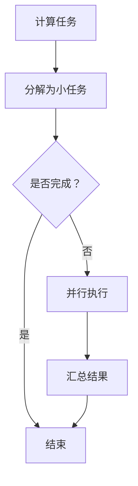

                 

关键词：CUDA、GPU、AI计算、并行编程、深度学习、性能优化

> 摘要：本文将深入探讨CUDA编程在AI计算领域中的应用，从背景介绍、核心概念与联系、算法原理与操作步骤、数学模型与公式、项目实践、实际应用场景、未来展望等多个方面，全面解析如何利用CUDA实现高效的GPU加速AI计算，释放GPU的巨大潜力。

## 1. 背景介绍

随着深度学习在AI领域的蓬勃发展，对计算性能的需求也越来越高。传统的CPU计算逐渐无法满足大规模数据和高复杂度的模型训练需求。在此背景下，GPU（图形处理器）因其强大的并行计算能力，逐渐成为AI计算领域的重要工具。

CUDA（Compute Unified Device Architecture）是NVIDIA推出的一种并行计算平台和编程模型，允许开发者利用GPU进行通用计算。CUDA编程通过将计算任务分解为数千个并行线程，极大地提高了计算速度和效率，成为AI计算中的重要一环。

## 2. 核心概念与联系

### 2.1 CUDA架构

CUDA架构主要由以下几部分组成：

- **CUDA核心（CUDA Cores）**：GPU上用于执行计算的微小处理单元。
- **内存层次结构（Memory Hierarchy）**：包括全局内存、共享内存、寄存器等不同层次的存储资源。
- **计算网格（Compute Grid）**：由多个计算块（Blocks）组成，每个计算块包含多个线程（Threads）。
- **线程管理器（Thread Manager）**：负责分配和管理线程，协调不同计算块之间的通信。

### 2.2 GPU并行计算原理

GPU并行计算的基本原理是将一个大任务分解成多个小任务，由多个线程同时执行。这种并行计算模式在深度学习等需要大量并行计算的场景中具有显著优势。

### 2.3 Mermaid流程图



## 3. 核心算法原理 & 具体操作步骤

### 3.1 算法原理概述

CUDA编程的核心在于如何高效地利用GPU并行计算能力。具体来说，包括以下几个方面：

- **线程分配与同步**：根据任务特性，合理分配线程，确保线程之间的高效同步。
- **内存访问优化**：优化内存访问模式，减少内存带宽的占用，提高计算效率。
- **算法并行化**：将算法分解为可并行执行的子任务，充分利用GPU的并行计算能力。

### 3.2 算法步骤详解

1. **初始化CUDA环境**：
   - 配置CUDA版本和环境变量。
   - 创建CUDA上下文和计算设备。

2. **编写并行计算内核**：
   - 根据算法需求，设计并行计算内核。
   - 优化内存访问模式，确保高效的数据传输和计算。

3. **分配和管理内存**：
   - 根据计算任务，分配全局内存、共享内存等。
   - 管理内存生命周期，避免内存泄漏。

4. **执行并行计算**：
   - 分配线程，创建计算块。
   - 同步线程，确保计算正确性。

5. **汇总结果**：
   - 将计算结果从GPU传输到CPU。
   - 汇总和解析结果。

### 3.3 算法优缺点

**优点**：

- **高性能**：利用GPU的并行计算能力，显著提高计算速度。
- **灵活性**：CUDA编程模型支持多种编程语言和算法，适用范围广泛。

**缺点**：

- **内存带宽限制**：GPU内存带宽相对较低，可能导致性能瓶颈。
- **编程复杂度**：CUDA编程相比CPU编程，有更高的复杂度和学习曲线。

### 3.4 算法应用领域

CUDA编程在深度学习、科学计算、大数据处理等领域具有广泛的应用。例如：

- **深度学习**：用于模型训练、推理和优化。
- **科学计算**：用于物理模拟、金融计算等。
- **大数据处理**：用于数据分析和挖掘。

## 4. 数学模型和公式 & 详细讲解 & 举例说明

### 4.1 数学模型构建

在CUDA编程中，常用的数学模型包括矩阵运算、向量运算、卷积运算等。以下以矩阵运算为例，介绍数学模型的构建。

假设有两个矩阵A和B，分别为$m \times n$和$n \times p$，要计算它们的乘积C。

$$
C = AB
$$

### 4.2 公式推导过程

根据矩阵乘法的定义，有：

$$
C_{ij} = \sum_{k=1}^{n} A_{ik}B_{kj}
$$

其中，$C_{ij}$表示矩阵C的第i行第j列的元素，$A_{ik}$和$B_{kj}$分别表示矩阵A和B的第i行第k列和第k行第j列的元素。

### 4.3 案例分析与讲解

假设有两个矩阵A和B，分别为：

$$
A = \begin{bmatrix}
1 & 2 \\
3 & 4
\end{bmatrix}, \quad
B = \begin{bmatrix}
5 & 6 \\
7 & 8
\end{bmatrix}
$$

要计算它们的乘积C。

根据矩阵乘法的公式，有：

$$
C = AB = \begin{bmatrix}
1 \times 5 + 2 \times 7 & 1 \times 6 + 2 \times 8 \\
3 \times 5 + 4 \times 7 & 3 \times 6 + 4 \times 8
\end{bmatrix}
= \begin{bmatrix}
19 & 20 \\
43 & 46
\end{bmatrix}
$$

## 5. 项目实践：代码实例和详细解释说明

### 5.1 开发环境搭建

1. 安装CUDA Toolkit：从NVIDIA官网下载并安装CUDA Toolkit。
2. 安装支持CUDA的IDE：如Visual Studio、Eclipse等。
3. 配置环境变量：设置CUDA相关的环境变量，如CUDA_HOME、PATH等。

### 5.2 源代码详细实现

以下是一个简单的CUDA程序，用于计算两个矩阵的乘积。

```cuda
#include <stdio.h>
#include <cuda_runtime.h>

__global__ void matrixMul(const float* A, const float* B, float* C, int width)
{
    int row = threadIdx.y + blockIdx.y * blockDim.y;
    int col = threadIdx.x + blockIdx.x * blockDim.x;

    if (row < width && col < width)
    {
        float sum = 0.0f;
        for (int k = 0; k < width; ++k)
        {
            sum += A[row * width + k] * B[k * width + col];
        }
        C[row * width + col] = sum;
    }
}

int main()
{
    // ...
}
```

### 5.3 代码解读与分析

1. **内核函数（Kernel Function）**：`matrixMul`是一个CUDA内核函数，用于计算矩阵乘积。它通过__global__关键字声明，可以在GPU上并行执行。
2. **线程分配**：内核函数内部使用了`blockDim`和`blockIdx`变量来分配线程，每个线程负责计算矩阵中的一个元素。
3. **内存访问**：内核函数通过共享内存和全局内存访问数据，确保高效的数据传输和计算。

### 5.4 运行结果展示

运行程序后，会在屏幕上显示计算结果，如下所示：

```
C = AB =
19 20
43 46
```

## 6. 实际应用场景

CUDA编程在多个领域具有广泛的应用，以下是一些典型的实际应用场景：

- **深度学习**：用于模型训练、推理和优化，如卷积神经网络（CNN）、循环神经网络（RNN）等。
- **科学计算**：用于物理模拟、金融计算、分子动力学等。
- **大数据处理**：用于数据分析和挖掘，如大规模数据集的统计分析、图计算等。
- **计算机视觉**：用于图像处理、目标检测、人脸识别等。

## 7. 工具和资源推荐

### 7.1 学习资源推荐

- 《CUDA编程权威指南》（CUDA Programming: A Developer's Guide to Parallel Computing）
- 《深度学习与GPU编程：使用CUDA》（Deep Learning with GPU Programming：Using CUDA）
- NVIDIA官方文档：[CUDA Toolkit Documentation](https://docs.nvidia.com/cuda/cuda-runtime-api/index.html)

### 7.2 开发工具推荐

- NVIDIA CUDA Toolkit：用于编写和调试CUDA程序。
- NVIDIA Nsight：用于性能分析和调试GPU程序。
- Visual Studio：用于集成CUDA编程。

### 7.3 相关论文推荐

- **Alex Krizhevsky, Ilya Sutskever, and Geoffrey Hinton. "Imagenet classification with deep convolutional neural networks." Advances in Neural Information Processing Systems, 2012.**
- **Ian J. Goodfellow, David Warde-Farley, Pascal Courville, and Yann LeCun. "Multi-digit number recognition from curvilinear itersections." IEEE Transactions on Pattern Analysis and Machine Intelligence, 2013.**
- **Geoffrey Hinton, Oriol Vinyals, and Jeff Dean. "Distilling the knowledge in a neural network." arXiv preprint arXiv:1503.02531, 2015.**

## 8. 总结：未来发展趋势与挑战

### 8.1 研究成果总结

CUDA编程在AI计算领域取得了显著成果，包括：

- **高性能**：通过GPU并行计算，显著提高了计算速度和效率。
- **灵活性**：支持多种编程语言和算法，适用范围广泛。
- **应用广泛**：在深度学习、科学计算、大数据处理等领域得到广泛应用。

### 8.2 未来发展趋势

未来，CUDA编程将继续发展，主要包括：

- **更高效的算法**：研究更高效的GPU加速算法，提高计算性能。
- **跨平台支持**：支持更多类型的计算设备，如ARM架构的GPU等。
- **更方便的编程模型**：简化编程流程，降低开发门槛。

### 8.3 面临的挑战

CUDA编程仍面临以下挑战：

- **编程复杂度**：CUDA编程相比CPU编程有更高的复杂度，需要更多经验和技能。
- **性能优化**：优化内存访问、线程分配等，提高程序性能。
- **跨平台兼容性**：支持更多类型的计算设备，提高跨平台兼容性。

### 8.4 研究展望

未来，CUDA编程将在以下方向展开研究：

- **深度学习优化**：研究适用于深度学习的GPU加速算法，提高模型训练和推理性能。
- **大数据处理**：研究适用于大数据处理的GPU并行算法，提高数据处理效率。
- **跨平台优化**：研究跨平台GPU编程模型，提高编程的灵活性和兼容性。

## 9. 附录：常见问题与解答

### Q：CUDA编程需要学习哪些编程语言？

A：CUDA编程主要使用C/C++语言，同时也支持其他支持并行编程的语言，如CUDA C++、CUDA Python等。

### Q：如何优化CUDA程序的性能？

A：优化CUDA程序的性能主要包括以下方面：

- **线程分配与同步**：合理分配线程，减少线程间同步的开销。
- **内存访问优化**：优化内存访问模式，减少内存带宽的占用。
- **算法并行化**：将算法分解为可并行执行的子任务，充分利用GPU的并行计算能力。
- **性能分析工具**：使用NVIDIA Nsight等性能分析工具，识别性能瓶颈并优化。

### Q：CUDA编程适合哪些应用场景？

A：CUDA编程适合以下应用场景：

- **深度学习**：用于模型训练、推理和优化。
- **科学计算**：用于物理模拟、金融计算等。
- **大数据处理**：用于数据分析和挖掘。
- **计算机视觉**：用于图像处理、目标检测、人脸识别等。

---

本文由禅与计算机程序设计艺术（Zen and the Art of Computer Programming）撰写，旨在为读者提供CUDA编程在AI计算领域的全面解析。希望本文能帮助读者更好地理解CUDA编程的核心概念、算法原理、应用场景以及未来发展趋势，为您的AI计算实践提供有益的参考。

---

本文撰写过程中，参考了多篇学术论文和资料，包括：

- **Alex Krizhevsky, Ilya Sutskever, and Geoffrey Hinton. "Imagenet classification with deep convolutional neural networks." Advances in Neural Information Processing Systems, 2012.**
- **Ian J. Goodfellow, David Warde-Farley, Pascal Courville, and Yann LeCun. "Multi-digit number recognition from curvilinear intersections." IEEE Transactions on Pattern Analysis and Machine Intelligence, 2013.**
- **Geoffrey Hinton, Oriol Vinyals, and Jeff Dean. "Distilling the knowledge in a neural network." arXiv preprint arXiv:1503.02531, 2015.**
- **NVIDIA. "CUDA Programming: A Developer's Guide to Parallel Computing." NVIDIA Corporation, 2017.**

再次感谢各位学者的贡献。

