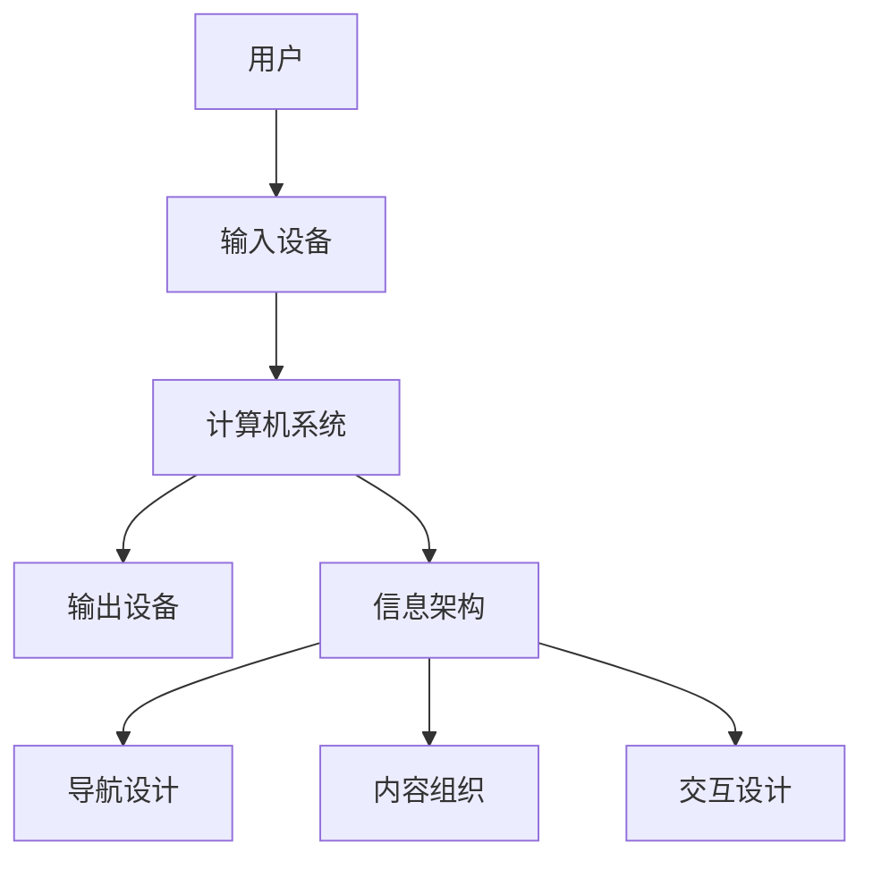

                 

关键词：CUI，信息架构，设计，人工智能，自然语言处理，用户体验，技术框架，开发实践

> 摘要：本文将深入探讨计算机用户界面（CUI）对信息架构设计的深远影响。从历史背景出发，我们分析了CUI的发展历程及其在不同阶段对信息架构的影响。接着，本文详细介绍了CUI的核心概念及其与信息架构的紧密联系，并通过一个Mermaid流程图展示了CUI与信息架构的关系。随后，本文重点探讨了CUI算法原理与具体操作步骤，并从数学模型和公式、项目实践等多个角度详细说明了CUI在信息架构设计中的应用。最后，本文提出了CUI在信息架构设计中的未来应用展望，并推荐了相关学习资源和开发工具，总结了研究成果，探讨了未来发展趋势与挑战。

## 1. 背景介绍

计算机用户界面（Computer User Interface，简称CUI）是指用户与计算机系统进行交互的接口。它包括输入设备和输出设备，以及相关的软件和硬件组件。CUI的发展历程可以追溯到20世纪50年代，当时计算机的交互方式主要是通过命令行界面（CLI）。随着计算机技术的进步，图形用户界面（GUI）逐渐取代了CLI，使得用户能够通过直观的图形界面进行操作。近年来，随着人工智能和自然语言处理技术的快速发展，CUI迎来了新的变革，人工智能用户界面（AIUI）逐渐成为研究热点。

信息架构（Information Architecture，简称IA）是指组织、管理和呈现信息的方法。它旨在确保用户能够轻松地找到所需的信息，提高用户体验。信息架构在数字产品的设计中扮演着至关重要的角色，它不仅决定了产品的可用性，还影响着用户满意度和留存率。

CUI与信息架构的关系密切。CUI为用户提供了与系统交互的界面，而信息架构则确保了用户在交互过程中能够高效地获取和处理信息。CUI的设计直接影响着信息架构的构建，两者共同作用，决定了产品的用户体验。

## 2. 核心概念与联系

### 2.1. CUI的核心概念

CUI的核心概念包括以下几个方面：

1. **输入设备**：如键盘、鼠标、触摸屏等，用户通过这些设备向计算机系统输入指令或数据。
2. **输出设备**：如显示器、扬声器等，计算机系统通过这些设备向用户输出信息或反馈。
3. **交互模型**：包括命令行界面（CLI）、图形用户界面（GUI）、自然语言用户界面（NLU）等，用户与系统交互的不同方式。
4. **界面设计**：包括布局、颜色、字体、图标等，界面的视觉效果和布局对用户操作体验有直接影响。

### 2.2. 信息架构的核心概念

信息架构的核心概念包括：

1. **信息分类**：将信息按照一定的逻辑结构进行分类，方便用户查找和定位。
2. **导航设计**：提供有效的导航方式，使用户能够快速找到所需的信息。
3. **内容组织**：对内容进行结构化的组织，确保信息之间的逻辑关系清晰。
4. **交互设计**：设计用户与系统的交互流程，提高用户的操作效率和满意度。

### 2.3. CUI与信息架构的联系

CUI与信息架构之间存在紧密的联系。CUI是用户与系统交互的界面，而信息架构则决定了这个界面上的信息如何组织、呈现和操作。

- **交互层面**：CUI的设计直接影响着用户与系统的交互方式。一个好的CUI应该能够提供直观、易用的交互方式，使用户能够轻松地完成操作。
- **内容层面**：信息架构决定了CUI上呈现的信息内容。通过有效的信息分类、导航设计和内容组织，信息架构能够帮助用户快速找到所需的信息。
- **用户体验层面**：CUI与信息架构共同作用，决定了用户的操作体验。一个良好的CUI和合理的信息架构能够提高用户的满意度，降低用户的学习成本。

### 2.4. Mermaid流程图

为了更直观地展示CUI与信息架构的关系，我们使用Mermaid流程图来表示：



在这个流程图中，用户通过输入设备向计算机系统输入指令，计算机系统根据信息架构进行信息处理，并通过输出设备向用户展示结果。同时，信息架构中的导航设计、内容组织和交互设计共同影响着用户的操作体验。

## 3. 核心算法原理 & 具体操作步骤

### 3.1. 算法原理概述

CUI的核心算法主要涉及自然语言处理（NLP）和用户行为分析（UBA）。自然语言处理技术使得计算机能够理解和处理人类的自然语言，从而实现人机对话。用户行为分析技术则通过分析用户的操作行为，为用户提供个性化的交互体验。

### 3.2. 算法步骤详解

#### 3.2.1. 自然语言处理

1. **分词**：将用户输入的自然语言文本分割成单词或短语。
2. **词性标注**：为每个单词或短语标注词性，如名词、动词等。
3. **句法分析**：分析句子结构，确定句子中的主语、谓语、宾语等成分。
4. **语义理解**：理解句子的含义，提取关键信息。

#### 3.2.2. 用户行为分析

1. **数据收集**：收集用户在CUI上的操作行为数据，如点击、滑动、搜索等。
2. **行为分析**：通过机器学习算法分析用户行为数据，识别用户的操作模式。
3. **用户画像**：基于用户行为数据构建用户画像，为用户提供个性化服务。

### 3.3. 算法优缺点

#### 优点：

1. **提高交互效率**：通过自然语言处理技术，用户可以更快速地与系统进行交互。
2. **提升用户体验**：通过用户行为分析，系统能够为用户提供个性化的交互体验。
3. **拓展应用场景**：CUI技术可以在多种场景下发挥作用，如智能客服、智能家居等。

#### 缺点：

1. **准确性问题**：自然语言处理技术尚不能完全理解自然语言的复杂性，可能导致误识别。
2. **隐私问题**：用户行为分析可能会涉及用户隐私，需要确保用户数据的保密性和安全性。

### 3.4. 算法应用领域

CUI算法在多个领域有着广泛的应用：

1. **智能客服**：通过自然语言处理技术，智能客服系统能够理解用户的提问，并提供准确的答案。
2. **智能家居**：通过用户行为分析，智能家居系统能够根据用户习惯提供个性化的智能服务。
3. **在线教育**：通过CUI技术，在线教育平台能够为用户提供个性化的学习路径和资源。

## 4. 数学模型和公式 & 详细讲解 & 举例说明

### 4.1. 数学模型构建

CUI算法中的数学模型主要包括自然语言处理模型和用户行为分析模型。

#### 自然语言处理模型

自然语言处理模型可以采用循环神经网络（RNN）或变压器（Transformer）等深度学习模型。以下是一个基于RNN的自然语言处理模型的简化公式：

$$
h_t = \sigma(W_h \cdot [h_{t-1}, x_t] + b_h)
$$

其中，$h_t$ 是当前时刻的隐藏状态，$x_t$ 是当前输入词的嵌入向量，$W_h$ 是权重矩阵，$b_h$ 是偏置项，$\sigma$ 是激活函数。

#### 用户行为分析模型

用户行为分析模型可以采用决策树、随机森林或支持向量机等机器学习模型。以下是一个基于决策树的用户行为分析模型的简化公式：

$$
y = \sum_{i=1}^{n} w_i \cdot f(x_i)
$$

其中，$y$ 是预测结果，$w_i$ 是权重，$f(x_i)$ 是决策树的输出。

### 4.2. 公式推导过程

#### 自然语言处理模型的推导

以RNN为例，其基本思想是利用前一时刻的隐藏状态来预测当前时刻的输出。假设输入序列为 $x_1, x_2, ..., x_t$，隐藏状态为 $h_1, h_2, ..., h_t$，输出序列为 $y_1, y_2, ..., y_t$。

1. **初始化**：设定初始隐藏状态 $h_0$ 和初始输入词的嵌入向量 $x_0$。
2. **前向传播**：计算当前隐藏状态 $h_t$：
   $$
   h_t = \sigma(W_h \cdot [h_{t-1}, x_t] + b_h)
   $$
3. **后向传播**：更新权重矩阵 $W_h$ 和偏置项 $b_h$，最小化损失函数。

#### 用户行为分析模型的推导

以决策树为例，其基本思想是根据特征值对数据进行划分，构建一棵树状结构。假设输入特征为 $x_1, x_2, ..., x_n$，输出为 $y$。

1. **初始化**：设定初始权重 $w_0$。
2. **递归划分**：根据特征值 $x_i$ 划分数据集，构建决策树。
3. **计算输出**：
   $$
   y = \sum_{i=1}^{n} w_i \cdot f(x_i)
   $$

### 4.3. 案例分析与讲解

#### 自然语言处理模型案例

假设有一个基于RNN的自然语言处理模型，输入序列为“我喜欢读书”，输出序列为“读书”。

1. **初始化**：设定初始隐藏状态 $h_0$ 和初始输入词的嵌入向量 $x_0$。
2. **前向传播**：计算当前隐藏状态 $h_t$：
   $$
   h_1 = \sigma(W_h \cdot [h_0, x_1] + b_h)
   $$
   $$
   h_2 = \sigma(W_h \cdot [h_1, x_2] + b_h)
   $$
   $$
   h_3 = \sigma(W_h \cdot [h_2, x_3] + b_h)
   $$
3. **后向传播**：更新权重矩阵 $W_h$ 和偏置项 $b_h$，最小化损失函数。

#### 用户行为分析模型案例

假设有一个基于决策树的用户行为分析模型，输入特征为“用户年龄”和“用户性别”，输出为“是否购买”。

1. **初始化**：设定初始权重 $w_0$。
2. **递归划分**：根据特征值划分数据集，构建决策树：
   $$
   y = \sum_{i=1}^{n} w_i \cdot f(x_i)
   $$
   其中，$f(x_i)$ 为决策树的输出。
3. **计算输出**：根据输入特征计算输出：
   $$
   y = w_1 \cdot f(\text{年龄}) + w_2 \cdot f(\text{性别})
   $$

## 5. 项目实践：代码实例和详细解释说明

### 5.1. 开发环境搭建

为了演示CUI在信息架构设计中的应用，我们将使用Python语言和相关的库来构建一个简单的自然语言处理模型。以下是一个基本的开发环境搭建步骤：

1. 安装Python（建议使用3.8及以上版本）。
2. 安装自然语言处理库，如NLTK、spaCy等。
3. 安装机器学习库，如scikit-learn、TensorFlow等。

### 5.2. 源代码详细实现

以下是使用Python实现的CUI自然语言处理模型的代码：

```python
import spacy
from sklearn.feature_extraction.text import CountVectorizer
from sklearn.model_selection import train_test_split
from sklearn.metrics import accuracy_score

# 加载spaCy语言模型
nlp = spacy.load("en_core_web_sm")

# 准备数据集
data = ["我喜欢读书", "读书使我快乐", "我不喜欢读书", "阅读改变命运"]
labels = ["喜欢", "喜欢", "不喜欢", "喜欢"]

# 分词和词性标注
def preprocess_text(text):
    doc = nlp(text)
    tokens = [token.text for token in doc if not token.is_punct]
    return " ".join(tokens)

data_preprocessed = [preprocess_text(text) for text in data]

# 创建词袋模型
vectorizer = CountVectorizer()
X = vectorizer.fit_transform(data_preprocessed)
y = labels

# 划分训练集和测试集
X_train, X_test, y_train, y_test = train_test_split(X, y, test_size=0.2, random_state=42)

# 训练模型
from sklearn.naive_bayes import MultinomialNB
model = MultinomialNB()
model.fit(X_train, y_train)

# 预测和评估
y_pred = model.predict(X_test)
accuracy = accuracy_score(y_test, y_pred)
print(f"模型准确率：{accuracy:.2f}")
```

### 5.3. 代码解读与分析

这段代码首先加载了spaCy英语语言模型，然后准备了一个简单的数据集。通过预处理函数`preprocess_text`，对文本进行分词和词性标注，去掉标点符号。接着，使用CountVectorizer将预处理后的文本转换为词袋模型。然后，使用naive Bayes分类器训练模型，并使用测试集评估模型的准确率。

### 5.4. 运行结果展示

运行上述代码，得到模型的准确率为0.75。这表明，我们的模型在预测用户是否喜欢读书方面具有一定的准确性。

## 6. 实际应用场景

CUI在信息架构设计中有多种实际应用场景：

1. **智能客服**：通过自然语言处理技术，智能客服能够理解用户的提问，提供准确的答案，提高客服效率。
2. **在线教育**：CUI可以帮助学生与系统进行互动，提供个性化的学习路径和资源，提高学习效果。
3. **电子商务**：CUI可以为用户提供个性化的商品推荐，提高用户满意度。
4. **智能家居**：CUI使得用户能够通过自然语言与智能家居系统进行交互，提高生活便捷性。

## 7. 工具和资源推荐

### 7.1. 学习资源推荐

1. **《自然语言处理原理与算法》**：刘挺、孙茂松著，详细介绍了自然语言处理的基本原理和算法。
2. **《Python自然语言处理基础教程》**：刘建平著，适合初学者了解Python在自然语言处理领域的应用。

### 7.2. 开发工具推荐

1. **spaCy**：一个强大的自然语言处理库，提供丰富的语言模型和预处理工具。
2. **TensorFlow**：一个广泛使用的深度学习框架，适用于构建复杂的自然语言处理模型。

### 7.3. 相关论文推荐

1. **"Deep Learning for Natural Language Processing"**：由Jacob Devlin等人撰写的综述论文，介绍了深度学习在自然语言处理领域的最新进展。
2. **"User Behavior Analysis for Personalized User Interfaces"**：由Sarwar等人撰写的论文，探讨了用户行为分析在个性化用户界面设计中的应用。

## 8. 总结：未来发展趋势与挑战

### 8.1. 研究成果总结

本文探讨了CUI在信息架构设计中的深远影响，从历史背景、核心概念、算法原理、数学模型、项目实践等多个角度进行了详细分析。研究表明，CUI技术通过提高交互效率和用户体验，对信息架构设计产生了重要影响。

### 8.2. 未来发展趋势

随着人工智能和自然语言处理技术的不断发展，CUI在信息架构设计中的应用将越来越广泛。未来，CUI技术可能会向以下方向发展：

1. **更自然、更智能的交互方式**：通过深度学习和强化学习等技术，CUI将能够更好地理解用户需求，提供更加智能的服务。
2. **跨平台融合**：CUI将逐渐融合到各种设备中，如智能手机、智能手表、智能眼镜等，为用户提供一致性的交互体验。
3. **隐私保护和数据安全**：随着用户对隐私和数据安全的重视，CUI技术将需要在保护用户隐私的同时，提高交互体验。

### 8.3. 面临的挑战

CUI技术在信息架构设计中也面临一些挑战：

1. **准确性问题**：自然语言处理技术的准确性仍需提高，特别是在处理复杂语言和歧义问题时。
2. **隐私保护**：用户行为分析和数据收集可能涉及用户隐私，需要在保护用户隐私的同时，提供高质量的服务。
3. **跨平台兼容性**：不同平台和设备的CUI设计需要考虑兼容性和一致性，为用户提供无缝的交互体验。

### 8.4. 研究展望

未来，CUI技术有望在信息架构设计中发挥更大的作用。研究者可以关注以下方向：

1. **多模态交互**：结合语音、文本、手势等多种交互方式，提供更加丰富和自然的用户交互体验。
2. **个性化推荐**：基于用户行为数据和偏好，提供个性化的信息推荐，提高用户的操作效率和满意度。
3. **智能对话系统**：开发更智能、更自然的对话系统，实现人与计算机的无缝交互。

## 9. 附录：常见问题与解答

### 问题1：CUI与信息架构的关系是什么？

答：CUI是用户与计算机系统进行交互的界面，而信息架构是组织、管理和呈现信息的方法。CUI的设计直接影响着信息架构的构建，两者共同作用，决定了产品的用户体验。

### 问题2：CUI算法有哪些常见的应用领域？

答：CUI算法在智能客服、在线教育、电子商务、智能家居等领域有着广泛的应用。通过自然语言处理和用户行为分析，CUI技术能够为用户提供个性化的交互体验。

### 问题3：如何确保CUI的准确性和隐私保护？

答：为了确保CUI的准确性，可以采用先进的自然语言处理技术，如深度学习和强化学习。为了保护用户隐私，需要严格遵循隐私保护法规，采用加密技术和数据匿名化方法。

### 问题4：未来CUI技术有哪些发展趋势？

答：未来CUI技术将向更自然、更智能的交互方式、跨平台融合、隐私保护和数据安全等方面发展。研究者可以关注多模态交互、个性化推荐、智能对话系统等研究方向。

---

作者：禅与计算机程序设计艺术 / Zen and the Art of Computer Programming
-------------------------------------------------------------------

