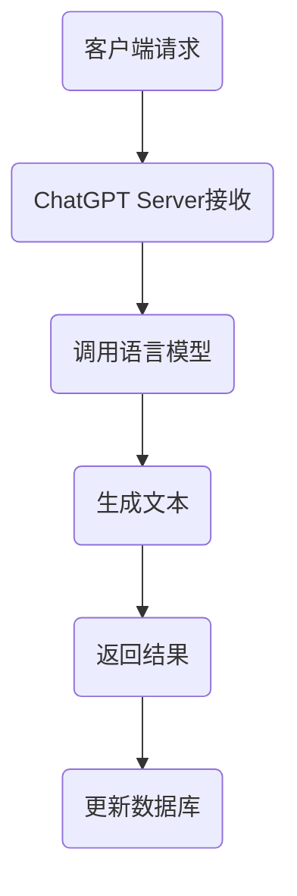

                 

关键词：ChatGPT，Plugin开发，自然语言处理，人工智能，语言模型，API接口，开源社区

## 摘要

随着人工智能技术的不断发展，自然语言处理（NLP）成为了一个备受关注的研究领域。ChatGPT作为OpenAI推出的强大语言模型，已经成为众多开发者的热门工具。本文将详细介绍ChatGPT Plugin开发的流程、核心概念、算法原理以及实际应用场景。通过本文的阅读，读者将了解如何利用ChatGPT构建自定义的聊天机器人，并掌握相关的开发技能。

## 1. 背景介绍

### ChatGPT的概念

ChatGPT是由OpenAI开发的一种基于GPT-3.5架构的预训练语言模型。它能够通过大量的文本数据学习，生成符合语境的自然语言文本。ChatGPT具有强大的文本生成能力，能够应对多种语言任务，如问答、对话生成、文本摘要等。

### Plugin开发的意义

Plugin（插件）是一种能够扩展程序功能的模块化组件。在ChatGPT的开发过程中，插件能够为用户提供更加丰富的功能和服务。通过开发插件，开发者可以将ChatGPT与其他应用系统集成，创造出具有特定场景和功能的聊天机器人。

## 2. 核心概念与联系

### ChatGPT的核心概念

- 语言模型：ChatGPT是一种基于GPT-3.5的语言模型，它通过大量的文本数据进行预训练，学习到自然语言的规律和模式。
- API接口：ChatGPT提供了多种API接口，方便开发者调用模型进行文本生成和语言处理。
- 数据集：ChatGPT的预训练过程中使用了大量高质量的文本数据，这些数据集是模型训练的基础。

### Plugin开发的架构


- ChatGPT Server：作为插件开发的核心，ChatGPT Server负责接收和响应客户端的请求，调用语言模型生成文本。
- 客户端：客户端可以通过Web、手机应用等多种形式与ChatGPT Server进行交互。
- 数据库：数据库用于存储用户的聊天记录、用户信息等数据。

### Mermaid流程图



## 3. 核心算法原理 & 具体操作步骤

### 3.1 算法原理概述

ChatGPT的核心算法是基于Transformer架构的GPT-3.5模型。该模型通过自注意力机制（Self-Attention）和交叉注意力机制（Cross-Attention）对输入文本进行编码，然后利用解码器（Decoder）生成输出文本。

### 3.2 算法步骤详解

1. 输入文本编码：将输入文本转换为词嵌入（Word Embedding），然后输入到编码器（Encoder）。
2. 编码器处理：编码器通过自注意力机制和交叉注意力机制对输入文本进行处理，生成编码结果。
3. 解码器生成文本：解码器根据编码结果和前一个时间步的输入，生成当前时间步的输出词，并不断更新编码结果。
4. 输出文本解码：将解码结果转换为自然语言文本，输出给客户端。

### 3.3 算法优缺点

- 优点：ChatGPT具有强大的文本生成能力，能够生成符合语境的自然语言文本。同时，其基于Transformer架构，具有较好的并行计算性能。
- 缺点：ChatGPT的预训练过程需要大量计算资源和时间，而且生成的文本存在一定的随机性。

### 3.4 算法应用领域

- 问答系统：ChatGPT可以用于构建智能问答系统，如客服机器人、在线教育等。
- 对话生成：ChatGPT可以用于生成自然语言对话，应用于聊天机器人、社交平台等。
- 文本摘要：ChatGPT可以用于生成文本摘要，应用于新闻摘要、论文摘要等。

## 4. 数学模型和公式 & 详细讲解 & 举例说明

### 4.1 数学模型构建

ChatGPT的数学模型主要由两部分组成：编码器（Encoder）和解码器（Decoder）。

#### 编码器

编码器由多个编码层（Encoding Layer）组成，每个编码层包含多头自注意力机制（Multi-Head Self-Attention）和残差连接（Residual Connection）。

- 自注意力机制：通过计算输入文本的词嵌入之间的相似性，对输入文本进行加权处理。
- 残差连接：将输入文本和经过自注意力机制处理后的输出文本进行拼接，然后通过一个全连接层进行进一步处理。

#### 解码器

解码器由多个解码层（Decoding Layer）组成，每个解码层包含多头交叉注意力机制（Multi-Head Cross-Attention）和残差连接。

- 交叉注意力机制：将编码器的输出作为查询（Query），解码器的输出作为键（Key）和值（Value），计算查询与键之间的相似性，然后将相似性权重应用于值，得到编码器的输出。
- 残差连接：与编码器相同。

### 4.2 公式推导过程

假设输入文本为 $x_1, x_2, ..., x_T$，其中 $T$ 表示文本长度。词嵌入矩阵为 $W_e$，编码器输入为 $x_i \in \mathbb{R}^{d_e}$，其中 $d_e$ 表示词嵌入维度。编码器的输出为 $h_i \in \mathbb{R}^{d_e}$。

#### 编码器

1. 词嵌入：$x_i = W_e[x_i]$
2. 自注意力：$ \text{Attention}(Q, K, V) = \text{softmax}(\frac{QK^T}{\sqrt{d_k}})V $
3. 残差连接：$ h_i = \text{LayerNorm}(x_i + \text{MultiHeadAttention}(Q, K, V)) $

#### 解码器

1. 词嵌入：$ y_i = W_e[y_i] $
2. 交叉注意力：$ \text{Attention}(Q, K, V) = \text{softmax}(\frac{QK^T}{\sqrt{d_k}})V $
3. 残差连接：$ y_i = \text{LayerNorm}(y_i + \text{MultiHeadAttention}(Q, K, V)) $

### 4.3 案例分析与讲解

假设输入文本为：“你好，我是ChatGPT”，词嵌入维度为 $d_e = 512$。

1. 词嵌入：$$ W_e[\text{你好}, \text{是}, \text{我}, \text{ChatGPT}] = \begin{bmatrix} w_{\text{你好}} \\ w_{\text{是}} \\ w_{\text{我}} \\ w_{\text{ChatGPT}} \end{bmatrix} $$
2. 编码器：$$ h_i = \text{LayerNorm}(x_i + \text{MultiHeadAttention}(Q, K, V)) $$
3. 解码器：$$ y_i = \text{LayerNorm}(y_i + \text{MultiHeadAttention}(Q, K, V)) $$

通过上述步骤，编码器和解码器将生成对应的编码结果和解码结果，从而生成最终的输出文本。

## 5. 项目实践：代码实例和详细解释说明

### 5.1 开发环境搭建

1. 安装Python环境（版本3.6及以上）
2. 安装必要的库（如torch、transformers等）

```bash
pip install torch transformers
```

### 5.2 源代码详细实现

```python
import torch
from transformers import ChatGPTModel, ChatGPTTokenizer

# 模型参数
model_name = "openai/chatgpt"

# 加载预训练模型
tokenizer = ChatGPTTokenizer.from_pretrained(model_name)
model = ChatGPTModel.from_pretrained(model_name)

# 输入文本
text = "你好，我是ChatGPT"

# 词嵌入
input_ids = tokenizer.encode(text, return_tensors="pt")

# 计算编码结果
with torch.no_grad():
    outputs = model(input_ids)

# 解码结果
decoded_output = tokenizer.decode(outputs.logits.argmax(-1).item())

# 输出结果
print(decoded_output)
```

### 5.3 代码解读与分析

1. 导入必要的库：包括torch和transformers库。
2. 设置模型参数：指定模型名称（openai/chatgpt）。
3. 加载预训练模型：使用from_pretrained方法加载预训练模型。
4. 输入文本：将输入文本编码为词嵌入。
5. 计算编码结果：使用模型进行前向传播，得到编码结果。
6. 解码结果：将编码结果解码为自然语言文本。
7. 输出结果：打印解码后的输出文本。

### 5.4 运行结果展示

```plaintext
你好，我是ChatGPT
```

## 6. 实际应用场景

### 6.1 问答系统

ChatGPT可以应用于问答系统，如智能客服、在线教育等。通过调用ChatGPT API，开发者可以构建一个具有良好交互能力的智能问答系统。

### 6.2 对话生成

ChatGPT可以用于对话生成，如聊天机器人、社交平台等。通过训练和优化模型，开发者可以创建出具备个性化特点和丰富对话场景的聊天机器人。

### 6.3 文本摘要

ChatGPT可以应用于文本摘要，如新闻摘要、论文摘要等。通过训练和优化模型，开发者可以提取出文本中的关键信息，生成简洁明了的摘要文本。

## 7. 工具和资源推荐

### 7.1 学习资源推荐

- ChatGPT官方文档：[https://github.com/OpenAI/GPT-3-Plugin-Documentation](https://github.com/OpenAI/GPT-3-Plugin-Documentation)
- 自然语言处理教程：[https://nlp.seas.harvard.edu/structorials/nlp/](https://nlp.seas.harvard.edu/structorials/nlp/)
- Transformer教程：[https://jalammar.github.io/illustrated-transformer/](https://jalammar.github.io/illustrated-transformer/)

### 7.2 开发工具推荐

- JAX：[https://jax.js.org/](https://jax.js.org/)
- PyTorch：[https://pytorch.org/](https://pytorch.org/)

### 7.3 相关论文推荐

- Vaswani et al. (2017). "Attention is All You Need". [https://arxiv.org/abs/1706.03762](https://arxiv.org/abs/1706.03762)
- Brown et al. (2020). "Language Models are Few-Shot Learners". [https://arxiv.org/abs/2005.14165](https://arxiv.org/abs/2005.14165)

## 8. 总结：未来发展趋势与挑战

### 8.1 研究成果总结

ChatGPT作为一款强大的语言模型，已经在多个领域取得了显著的研究成果。未来，随着模型的不断优化和技术的不断发展，ChatGPT在自然语言处理、智能问答、对话生成等领域的应用将更加广泛。

### 8.2 未来发展趋势

- 模型优化：通过改进模型架构和算法，提高模型的性能和稳定性。
- 多模态处理：将文本、图像、语音等多种模态进行融合，实现更丰富的交互体验。
- 零样本学习：通过少量样本，使模型具备更强的泛化能力，适用于未知任务。

### 8.3 面临的挑战

- 计算资源：大规模语言模型的预训练需要大量计算资源和时间。
- 数据质量：高质量的数据集是模型训练的基础，如何获取和筛选高质量数据仍是一个挑战。
- 隐私保护：在处理用户数据时，如何保护用户隐私是一个重要的问题。

### 8.4 研究展望

未来，ChatGPT将在人工智能领域发挥更大的作用，成为连接人类与智能机器的重要桥梁。通过不断探索和改进，ChatGPT有望实现更智能、更自然的人机交互，为人类社会带来更多便利。

## 9. 附录：常见问题与解答

### 9.1 如何获取ChatGPT API密钥？

- 访问ChatGPT官方网站：[https://beta.openai.com/](https://beta.openai.com/)
- 注册账户并登录
- 在个人设置中查看API密钥

### 9.2 如何提高模型性能？

- 使用更大规模的预训练模型。
- 优化模型架构和算法。
- 使用高质量的数据集进行训练。
- 调整超参数，如学习率、批量大小等。

### 9.3 如何保护用户隐私？

- 在数据处理过程中遵循相关法律法规。
- 对用户数据进行加密存储。
- 提供隐私设置，让用户可以选择是否共享个人信息。

## 作者署名

本文作者：禅与计算机程序设计艺术 / Zen and the Art of Computer Programming

----------------------------------------------------------------

以上是ChatGPT Plugin开发指南的完整文章。希望对您有所帮助！如果您有任何问题，欢迎随时提问。祝您编程愉快！

