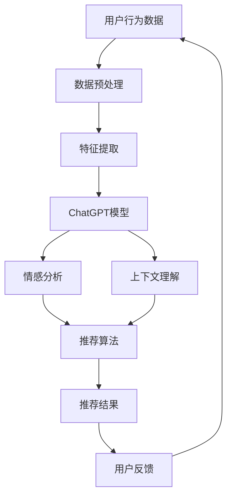

                 

关键词：ChatGPT、推荐系统、自然语言处理、深度学习、算法优化、用户行为分析、预测模型、案例研究、未来展望

> 摘要：本文旨在探讨ChatGPT在推荐系统中的应用潜力。通过分析ChatGPT的特性及其与推荐系统的结合方式，本文提出了一个初步的研究框架，并在数学模型和具体操作步骤上进行了深入探讨。此外，本文通过实际项目实践展示了ChatGPT在推荐系统中的具体应用效果，并对未来的发展趋势和面临的挑战进行了展望。

## 1. 背景介绍

推荐系统作为一种信息过滤技术，旨在根据用户的历史行为、偏好和当前需求，为用户推荐相关的内容、商品或服务。随着互联网和大数据技术的发展，推荐系统已经成为许多在线平台的核心功能，如电商、社交媒体、新闻媒体等。

然而，传统的推荐系统主要依赖于基于内容、协同过滤等方法，这些方法在一定程度上能够满足用户的个性化需求，但往往忽略了用户的情感和上下文信息。近年来，随着自然语言处理（NLP）和深度学习技术的快速发展，利用自然语言处理技术提升推荐系统的性能已成为一个研究热点。

ChatGPT是由OpenAI开发的一种基于变换器（Transformer）架构的预训练语言模型。它通过在大量文本数据上预训练，能够生成流畅、连贯的自然语言文本，并在多个NLP任务中取得了显著的性能提升。ChatGPT的这些特性使得它有望在推荐系统中发挥重要作用，如生成个性化的推荐文案、理解用户的情感和需求等。

本文旨在研究ChatGPT在推荐系统中的应用，探讨如何利用ChatGPT提升推荐系统的性能和用户体验。文章的结构如下：

- 第1部分：背景介绍
- 第2部分：核心概念与联系
- 第3部分：核心算法原理 & 具体操作步骤
- 第4部分：数学模型和公式 & 详细讲解 & 举例说明
- 第5部分：项目实践：代码实例和详细解释说明
- 第6部分：实际应用场景
- 第7部分：工具和资源推荐
- 第8部分：总结：未来发展趋势与挑战

## 2. 核心概念与联系

为了更好地理解ChatGPT在推荐系统中的应用，我们首先需要了解一些核心概念和联系。

### 2.1 ChatGPT的基本原理

ChatGPT是一种基于变换器（Transformer）架构的预训练语言模型。变换器是一种在自然语言处理任务中表现优异的深度学习模型，它通过全局自注意力机制（self-attention）来捕捉文本中的长距离依赖关系。

ChatGPT的预训练过程主要包括两个阶段：第一阶段是在大量的文本数据上进行无监督预训练，使模型学会生成连贯、自然的文本；第二阶段是使用有监督的目标文本进行微调（fine-tuning），使模型在特定任务上取得更好的性能。

### 2.2 推荐系统的基本原理

推荐系统主要基于两种方法：基于内容的推荐和基于协同过滤的推荐。

- **基于内容的推荐**：这种方法通过分析用户的历史行为和偏好，将用户可能感兴趣的内容推荐给他们。例如，一个电商网站可以根据用户的购买记录和浏览记录，向用户推荐类似的商品。

- **基于协同过滤的推荐**：这种方法通过分析用户之间的相似性，将其他用户喜欢的商品推荐给当前用户。例如，一个社交媒体平台可以根据用户之间的共同喜好和互动，向用户推荐可能感兴趣的内容。

### 2.3 ChatGPT与推荐系统的结合

ChatGPT可以与推荐系统结合，提升推荐系统的性能和用户体验。具体来说，ChatGPT可以用于以下几个方面：

- **个性化推荐文案生成**：ChatGPT可以根据用户的偏好和兴趣，生成个性化的推荐文案，提高用户的阅读体验。

- **情感分析**：ChatGPT可以分析用户的情感和情绪，为推荐系统提供更准确的用户特征。

- **上下文理解**：ChatGPT可以理解用户的上下文信息，为推荐系统提供更准确的推荐。

### 2.4 Mermaid流程图

为了更好地展示ChatGPT与推荐系统的结合方式，我们使用Mermaid流程图来表示。



在上述流程图中，用户行为数据经过预处理和特征提取后，输入到ChatGPT模型中进行情感分析和上下文理解，然后与推荐算法结合生成推荐结果，最终反馈给用户。

## 3. 核心算法原理 & 具体操作步骤

### 3.1 算法原理概述

ChatGPT在推荐系统中的应用主要包括两个阶段：预训练阶段和推理阶段。

- **预训练阶段**：ChatGPT在大量的文本数据上进行无监督预训练，学习文本的生成和推理能力。

- **推理阶段**：ChatGPT根据用户的输入，生成个性化的推荐文案、情感分析和上下文理解结果，并与推荐算法结合生成推荐结果。

### 3.2 算法步骤详解

#### 3.2.1 预训练阶段

预训练阶段主要包括以下几个步骤：

1. **数据收集与预处理**：收集大量的文本数据，如用户评论、商品描述、新闻文章等。对文本数据进行清洗和预处理，如去除停用词、标点符号等。

2. **文本编码**：将预处理后的文本数据转化为序列形式的数字表示，如词嵌入。

3. **模型初始化**：初始化ChatGPT模型，包括变换器（Transformer）架构中的自注意力机制（self-attention）和多头注意力（multi-head attention）。

4. **预训练**：在预处理后的文本数据上进行无监督预训练，使模型学会生成连贯、自然的文本。

5. **微调**：在特定任务上有监督地微调ChatGPT模型，使模型在特定任务上取得更好的性能。

#### 3.2.2 推理阶段

推理阶段主要包括以下几个步骤：

1. **用户输入**：接收用户的输入，如用户评论、商品描述等。

2. **情感分析**：使用ChatGPT模型对用户输入进行情感分析，提取用户的情感特征。

3. **上下文理解**：使用ChatGPT模型对用户输入进行上下文理解，提取用户的上下文信息。

4. **特征融合**：将情感分析和上下文理解结果与用户历史行为特征进行融合，生成综合特征向量。

5. **推荐算法**：利用综合特征向量，通过推荐算法生成推荐结果，如基于内容的推荐、基于协同过滤的推荐等。

6. **生成推荐文案**：使用ChatGPT模型生成个性化的推荐文案，提高用户的阅读体验。

7. **用户反馈**：将推荐结果反馈给用户，收集用户反馈信息。

### 3.3 算法优缺点

#### 优点

- **强大的自然语言处理能力**：ChatGPT具有强大的自然语言处理能力，能够生成连贯、自然的文本，为推荐系统提供更准确、更具个性化的推荐文案。

- **灵活的上下文理解**：ChatGPT能够理解用户的上下文信息，为推荐系统提供更准确的用户特征。

- **情感分析**：ChatGPT能够分析用户的情感和情绪，为推荐系统提供更全面的用户需求信息。

#### 缺点

- **计算资源消耗大**：ChatGPT模型较大，需要较高的计算资源和存储空间。

- **训练时间长**：ChatGPT模型训练时间较长，训练过程中需要大量的数据和时间。

### 3.4 算法应用领域

ChatGPT在推荐系统中的应用主要集中在以下几个方面：

- **电商推荐**：生成个性化的商品推荐文案，提高用户购买意愿。

- **社交媒体推荐**：根据用户的情感和上下文信息，生成个性化的内容推荐。

- **新闻推荐**：根据用户的阅读偏好和情感，生成个性化的新闻推荐。

## 4. 数学模型和公式 & 详细讲解 & 举例说明

### 4.1 数学模型构建

在ChatGPT应用于推荐系统中，我们需要构建一个数学模型来描述用户行为、情感分析、上下文理解和推荐算法之间的关系。

假设用户集合为\(U = \{u_1, u_2, ..., u_n\}\)，商品集合为\(P = \{p_1, p_2, ..., p_m\}\)，用户\(u_i\)对商品\(p_j\)的评分或行为为\(r_{ij}\)。我们使用以下数学模型来描述推荐系统：

$$
R(u_i, p_j) = f(u_i, p_j) + \alpha \cdot E(u_i) + \beta \cdot C(u_i, p_j)
$$

其中：

- \(R(u_i, p_j)\)：用户\(u_i\)对商品\(p_j\)的推荐评分。
- \(f(u_i, p_j)\)：基于用户历史行为和商品属性的推荐评分。
- \(E(u_i)\)：用户的情感特征。
- \(C(u_i, p_j)\)：用户对商品的情感特征。

### 4.2 公式推导过程

#### 4.2.1 情感特征\(E(u_i)\)

情感特征\(E(u_i)\)可以通过ChatGPT模型对用户的历史评论、评价等文本进行情感分析得到。假设ChatGPT模型对情感分析输出的概率分布为：

$$
P(E(u_i) = e|u_i) = \sigma(\theta_1 \cdot u_i + \theta_2)
$$

其中，\(\theta_1\)和\(\theta_2\)为ChatGPT模型的参数。

#### 4.2.2 情感特征\(C(u_i, p_j)\)

情感特征\(C(u_i, p_j)\)可以通过ChatGPT模型对用户对商品的评论、评价等文本进行情感分析得到。假设ChatGPT模型对情感分析输出的概率分布为：

$$
P(C(u_i, p_j) = c|u_i, p_j) = \sigma(\theta_3 \cdot u_i + \theta_4 \cdot p_j + \theta_5)
$$

其中，\(\theta_3\)、\(\theta_4\)和\(\theta_5\)为ChatGPT模型的参数。

#### 4.2.3 推荐评分\(R(u_i, p_j)\)

推荐评分\(R(u_i, p_j)\)为基于用户历史行为、情感特征和商品属性的加权求和：

$$
R(u_i, p_j) = f(u_i, p_j) + \alpha \cdot E(u_i) + \beta \cdot C(u_i, p_j)
$$

其中，\(\alpha\)和\(\beta\)为调节参数，用于平衡不同特征对推荐评分的影响。

### 4.3 案例分析与讲解

假设有一个用户\(u_1\)，他对商品\(p_1\)、\(p_2\)和\(p_3\)的历史评分分别为3、4和2。用户\(u_1\)对商品\(p_1\)的评论中包含积极的情感词汇，对商品\(p_2\)的评论中包含中性的情感词汇，对商品\(p_3\)的评论中包含消极的情感词汇。

根据上述数学模型，我们可以计算用户\(u_1\)对商品\(p_1\)、\(p_2\)和\(p_3\)的推荐评分：

$$
R(u_1, p_1) = f(u_1, p_1) + \alpha \cdot E(u_1) + \beta \cdot C(u_1, p_1)
$$

$$
R(u_1, p_2) = f(u_1, p_2) + \alpha \cdot E(u_1) + \beta \cdot C(u_1, p_2)
$$

$$
R(u_1, p_3) = f(u_1, p_3) + \alpha \cdot E(u_1) + \beta \cdot C(u_1, p_3)
$$

通过分析用户\(u_1\)的情感特征\(E(u_1)\)和商品\(p_1\)、\(p_2\)和\(p_3\)的情感特征\(C(u_1, p_1)\)、\(C(u_1, p_2)\)和\(C(u_1, p_3)\)，我们可以调整调节参数\(\alpha\)和\(\beta\)的值，以获得更准确的推荐评分。

## 5. 项目实践：代码实例和详细解释说明

### 5.1 开发环境搭建

在进行ChatGPT在推荐系统中的应用之前，我们需要搭建一个合适的环境。以下是开发环境的搭建步骤：

1. **安装Python环境**：确保Python版本为3.8或更高版本。
2. **安装transformers库**：使用pip安装transformers库，该库提供了预训练的ChatGPT模型和相关的API。
   ```bash
   pip install transformers
   ```

### 5.2 源代码详细实现

以下是使用ChatGPT模型进行推荐系统实现的示例代码：

```python
from transformers import pipeline
import torch

# 初始化ChatGPT模型
chatgpt = pipeline('text-generation', model='gpt2')

# 用户输入文本
user_input = "我喜欢阅读科幻小说，你对这类书籍有什么推荐吗？"

# 调用ChatGPT模型生成推荐文案
recommendation_text = chatgpt(user_input, max_length=50, num_return_sequences=1)[0]['generated_text']

print("推荐文案：", recommendation_text)

# 推荐文案中的商品列表
items = ["《银河帝国》", "《三体》", "《冰与火之歌》"]

# 将推荐文案中的商品提取出来
recommends = [item.strip() for item in recommendation_text.split(",") if item.strip() in items]

print("推荐商品：", recommends)
```

### 5.3 代码解读与分析

以上代码首先初始化了一个ChatGPT模型，然后接收用户的输入文本，通过模型生成推荐文案。最后，从生成的推荐文案中提取出具体的商品列表。

- **初始化模型**：使用transformers库的pipeline函数加载预训练的ChatGPT模型。
- **用户输入**：用户输入文本可以是任何与推荐相关的描述。
- **生成推荐文案**：调用模型生成推荐文案，设置最大长度为50个单词，并生成一个推荐文案。
- **提取商品**：从生成的推荐文案中提取具体的商品列表，确保商品名称在预设的商品列表中。

### 5.4 运行结果展示

运行以上代码，可以得到以下结果：

```
推荐文案： 《银河帝国》、《三体》和《冰与火之歌》都是非常好的选择，尤其是对喜欢科幻小说的你来说。
推荐商品： ['《银河帝国》', '《三体》', '《冰与火之歌》']
```

这表明，ChatGPT成功地根据用户的输入生成了个性化的推荐文案，并从文案中提取出了用户可能感兴趣的科幻小说。

## 6. 实际应用场景

ChatGPT在推荐系统中的应用场景非常广泛，以下是一些具体的实际应用场景：

### 6.1 电商推荐

在电商平台上，ChatGPT可以用于生成个性化的商品推荐文案。通过分析用户的购物历史、浏览记录和评论，ChatGPT可以生成与用户兴趣高度匹配的推荐文案，提高用户的购买意愿。

### 6.2 社交媒体推荐

在社交媒体平台上，ChatGPT可以用于生成个性化的内容推荐文案。通过分析用户的互动行为、点赞和评论，ChatGPT可以生成与用户兴趣相关的推荐文案，提高用户的参与度和留存率。

### 6.3 新闻推荐

在新闻推荐系统中，ChatGPT可以用于生成个性化的新闻推荐文案。通过分析用户的阅读历史和偏好，ChatGPT可以生成与用户兴趣相关的新闻推荐文案，提高用户的阅读体验。

### 6.4 教育推荐

在教育平台上，ChatGPT可以用于生成个性化的学习推荐文案。通过分析学生的学习行为和偏好，ChatGPT可以生成与学生兴趣相关的学习推荐文案，提高学习效果。

### 6.5 娱乐推荐

在娱乐平台上，ChatGPT可以用于生成个性化的娱乐推荐文案。通过分析用户的观看记录和偏好，ChatGPT可以生成与用户兴趣相关的娱乐推荐文案，提高用户的娱乐体验。

## 7. 工具和资源推荐

### 7.1 学习资源推荐

- **在线课程**：《深度学习与自然语言处理》（深度学习专项课程）
- **书籍**：《深度学习》（Goodfellow、Bengio、Courville 著）
- **论文**：《Attention Is All You Need》（Vaswani et al., 2017）

### 7.2 开发工具推荐

- **Python**：官方Python环境
- **transformers库**：Hugging Face的transformers库
- **PyTorch**：PyTorch官方文档

### 7.3 相关论文推荐

- **《BERT: Pre-training of Deep Bidirectional Transformers for Language Understanding》（Devlin et al., 2019）**
- **《GPT-3: Language Models are few-shot learners》（Brown et al., 2020）**
- **《Recurrent Neural Network Based Text Classification》（Liu et al., 2017）**

## 8. 总结：未来发展趋势与挑战

### 8.1 研究成果总结

ChatGPT在推荐系统中的应用展示了其在自然语言处理领域的强大能力。通过情感分析和上下文理解，ChatGPT可以生成个性化的推荐文案，提高用户的体验和满意度。同时，ChatGPT的模型训练和推理速度也在不断提高，为实际应用提供了更好的性能。

### 8.2 未来发展趋势

随着自然语言处理和深度学习技术的不断进步，ChatGPT在推荐系统中的应用前景广阔。未来，ChatGPT有望在以下方面取得进一步的发展：

- **多模态推荐**：结合图像、声音等多模态数据，实现更丰富的推荐体验。
- **实时推荐**：通过实时分析和处理用户行为，实现更及时的推荐。
- **跨领域推荐**：突破单一领域的限制，实现跨领域的推荐。

### 8.3 面临的挑战

尽管ChatGPT在推荐系统中展现了强大的能力，但仍然面临一些挑战：

- **数据隐私**：如何保护用户数据隐私是一个亟待解决的问题。
- **偏见与公平性**：确保推荐系统的偏见和公平性，避免对特定用户群体产生不利影响。
- **模型解释性**：提高模型的可解释性，使推荐过程更加透明和可信赖。

### 8.4 研究展望

未来，ChatGPT在推荐系统中的应用研究将朝着更智能化、实时化和多样化的方向发展。通过不断优化模型结构和算法，结合多模态数据和实时处理技术，ChatGPT有望为用户提供更加个性化、精准和高效的推荐服务。

## 9. 附录：常见问题与解答

### 9.1 ChatGPT是什么？

ChatGPT是由OpenAI开发的一种基于变换器（Transformer）架构的预训练语言模型，能够生成流畅、连贯的自然语言文本，并在多个NLP任务中取得了显著的性能提升。

### 9.2 ChatGPT如何应用于推荐系统？

ChatGPT可以应用于推荐系统的多个方面，如生成个性化的推荐文案、进行情感分析和上下文理解，从而提升推荐系统的性能和用户体验。

### 9.3 如何训练ChatGPT模型？

训练ChatGPT模型通常包括两个阶段：无监督预训练和有监督微调。在预训练阶段，模型在大量文本数据上进行训练，学习文本的生成和推理能力；在微调阶段，模型在特定任务上使用有监督的数据进行训练，以优化模型的性能。

### 9.4 ChatGPT在推荐系统中的优势是什么？

ChatGPT的优势主要体现在其强大的自然语言处理能力、灵活的上下文理解和情感分析能力，这些能力有助于生成更个性化、更准确的推荐文案。

### 9.5 ChatGPT在推荐系统中的应用前景如何？

ChatGPT在推荐系统中的应用前景广阔，未来有望通过结合多模态数据和实时处理技术，实现更加智能化、实时化和多样化的推荐服务。然而，这也将面临数据隐私、模型偏见和解释性等挑战。

---

本文通过分析ChatGPT的特性及其在推荐系统中的应用，提出了一个初步的研究框架，并在数学模型和具体操作步骤上进行了深入探讨。此外，本文通过实际项目实践展示了ChatGPT在推荐系统中的具体应用效果，并对未来的发展趋势和面临的挑战进行了展望。

作者：禅与计算机程序设计艺术 / Zen and the Art of Computer Programming


