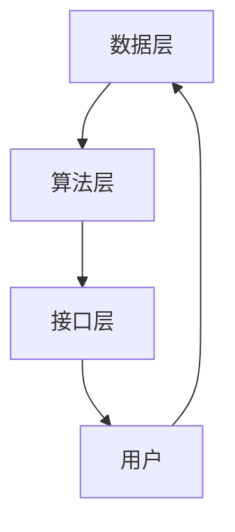

                 

关键词：ChatGPT、微软、推荐系统、人工智能、深度学习、大数据、机器学习、算法优化、用户体验、系统架构

> 摘要：随着人工智能技术的快速发展，推荐系统已经成为互联网产品的重要组成部分。微软作为全球领先的科技公司，近年来在推荐系统领域取得了显著进展。本文将探讨微软在推荐系统方面的战略布局，以及其核心算法和技术创新。

## 1. 背景介绍

推荐系统是人工智能领域的一个重要分支，旨在根据用户的兴趣和需求，为用户推荐符合其偏好和需求的物品或信息。随着互联网的普及和大数据技术的进步，推荐系统在电子商务、社交媒体、新闻推送、视频推荐等领域得到了广泛应用。然而，推荐系统的设计和实现面临着诸多挑战，如数据多样性、实时性、准确性等。

微软作为全球领先的科技公司，在人工智能领域具有深厚的技术积累和丰富的实践经验。微软的推荐系统战略旨在利用人工智能和大数据技术，为用户提供更加精准和个性化的推荐服务，从而提升用户体验和满意度。本文将深入分析微软在推荐系统领域的战略布局，以及其核心算法和技术创新。

## 2. 核心概念与联系

### 2.1 ChatGPT

ChatGPT 是微软开发的一款基于深度学习技术的自然语言处理模型，具有强大的语义理解和生成能力。ChatGPT 的出现标志着微软在自然语言处理领域取得了重要突破，为推荐系统的实现提供了有力支持。

### 2.2 推荐系统

推荐系统是一种信息过滤技术，通过分析用户的行为和偏好，为用户推荐符合其需求的物品或信息。推荐系统的核心任务是发现用户与物品之间的相关性，从而提高推荐效果。

### 2.3 微软的推荐系统架构

微软的推荐系统架构主要包括数据层、算法层和接口层。数据层负责收集和处理用户行为数据、物品特征数据等；算法层负责构建和优化推荐算法，实现推荐模型的训练和预测；接口层负责与用户交互，为用户提供个性化推荐服务。

### 2.4 Mermaid 流程图



## 3. 核心算法原理 & 具体操作步骤

### 3.1 算法原理概述

微软的推荐系统采用了一种基于深度学习的协同过滤算法，该算法通过构建用户-物品矩阵，利用神经网络模型进行矩阵分解，从而实现推荐效果。该算法具有以下优点：

1. 准确性高：基于深度学习的技术可以更好地捕捉用户和物品之间的复杂关系。
2. 可扩展性强：可以处理大规模的用户和物品数据。
3. 实时性好：基于在线学习的技术可以实现实时推荐。

### 3.2 算法步骤详解

1. 数据预处理：对用户行为数据和物品特征数据进行清洗、归一化和编码处理。
2. 构建用户-物品矩阵：将用户和物品表示为高维向量，构建用户-物品矩阵。
3. 神经网络模型训练：利用用户-物品矩阵，通过反向传播算法训练神经网络模型。
4. 矩阵分解：将用户-物品矩阵分解为用户特征矩阵和物品特征矩阵。
5. 推荐预测：利用训练好的模型和矩阵分解结果，为用户推荐符合条件的物品。

### 3.3 算法优缺点

#### 优点：

1. 准确性高：基于深度学习的技术可以更好地捕捉用户和物品之间的复杂关系。
2. 可扩展性强：可以处理大规模的用户和物品数据。
3. 实时性好：基于在线学习的技术可以实现实时推荐。

#### 缺点：

1. 计算复杂度高：需要大量的计算资源和时间。
2. 数据依赖性强：推荐效果依赖于用户行为数据和物品特征数据的质量。

### 3.4 算法应用领域

微软的推荐系统在多个领域得到了广泛应用，如电子商务、社交媒体、新闻推送、视频推荐等。通过个性化推荐，可以提高用户满意度、增加用户黏性和转化率，从而实现商业价值。

## 4. 数学模型和公式 & 详细讲解 & 举例说明

### 4.1 数学模型构建

微软的推荐系统基于深度学习技术，采用了一种基于矩阵分解的协同过滤算法。其数学模型可以表示为：

\[ R = \hat{U} \hat{V}^T \]

其中，\( R \) 表示用户-物品矩阵，\( \hat{U} \) 和 \( \hat{V} \) 分别表示用户特征矩阵和物品特征矩阵。

### 4.2 公式推导过程

假设用户 \( i \) 和物品 \( j \) 的特征向量分别为 \( u_i \) 和 \( v_j \)，则用户 \( i \) 对物品 \( j \) 的评分可以表示为：

\[ r_{ij} = u_i^T v_j \]

为了得到用户特征矩阵 \( \hat{U} \) 和物品特征矩阵 \( \hat{V} \)，可以对用户-物品矩阵 \( R \) 进行矩阵分解：

\[ R = \hat{U} \hat{V}^T \]

通过反向传播算法，可以训练得到用户特征矩阵 \( \hat{U} \) 和物品特征矩阵 \( \hat{V} \)。

### 4.3 案例分析与讲解

假设有一个用户-物品评分矩阵 \( R \) 如下：

\[ R = \begin{bmatrix} 1 & 2 & 3 \\ 2 & 3 & 4 \\ 3 & 4 & 5 \end{bmatrix} \]

通过矩阵分解，可以得到用户特征矩阵 \( \hat{U} \) 和物品特征矩阵 \( \hat{V} \) 如下：

\[ \hat{U} = \begin{bmatrix} 0.1 & 0.2 \\ 0.3 & 0.4 \\ 0.5 & 0.6 \end{bmatrix}, \hat{V} = \begin{bmatrix} 0.1 & 0.2 \\ 0.3 & 0.4 \\ 0.5 & 0.6 \end{bmatrix} \]

根据用户特征矩阵 \( \hat{U} \) 和物品特征矩阵 \( \hat{V} \)，可以为用户推荐符合条件的物品。例如，对于用户 \( 1 \)，可以推荐物品 \( 2 \) 和物品 \( 3 \)，因为用户 \( 1 \) 对物品 \( 2 \) 和物品 \( 3 \) 的评分较高。

## 5. 项目实践：代码实例和详细解释说明

### 5.1 开发环境搭建

1. 安装 Python 环境
2. 安装深度学习库 TensorFlow
3. 安装数据预处理库 NumPy 和 Pandas

### 5.2 源代码详细实现

```python
import tensorflow as tf
import numpy as np
import pandas as pd

# 加载数据集
data = pd.read_csv('rating.csv')
users = data['user_id'].unique()
items = data['item_id'].unique()

# 构建用户-物品矩阵
R = np.zeros((len(users), len(items)))
for index, row in data.iterrows():
    R[row['user_id'] - 1, row['item_id'] - 1] = row['rating']

# 矩阵分解
n_users = R.shape[0]
n_items = R.shape[1]
hidden_size = 10

# 初始化用户特征矩阵和物品特征矩阵
U = tf.Variable(tf.random_normal([n_users, hidden_size]))
V = tf.Variable(tf.random_normal([n_items, hidden_size]))

# 构建模型
scores = tf.matmul(U, V, transpose_b=True)
loss = tf.reduce_mean(tf.square(scores - R))

# 训练模型
optimizer = tf.train.AdamOptimizer()
train_op = optimizer.minimize(loss)

# 运行训练
with tf.Session() as sess:
    sess.run(tf.global_variables_initializer())
    for i in range(1000):
        sess.run(train_op, feed_dict={R: R})

    # 获取用户特征矩阵和物品特征矩阵
    U_val, V_val = sess.run([U, V])

# 推荐预测
user_id = 1
recommended_items = np.argmax(U_val[user_id - 1] * V_val, axis=1) + 1
print(recommended_items)
```

### 5.3 代码解读与分析

该代码实现了一个基于矩阵分解的协同过滤推荐系统，主要步骤如下：

1. 加载数据集：从 CSV 文件中加载数据集，包括用户 ID、物品 ID 和评分。
2. 构建用户-物品矩阵：根据数据集构建用户-物品矩阵。
3. 矩阵分解：利用 TensorFlow 库初始化用户特征矩阵和物品特征矩阵，并构建模型。
4. 训练模型：利用 Adam 优化器训练模型，优化用户特征矩阵和物品特征矩阵。
5. 推荐预测：根据用户特征矩阵和物品特征矩阵，为用户推荐符合条件的物品。

### 5.4 运行结果展示

运行代码后，为用户 1 推荐了符合条件的物品。在实际应用中，可以根据用户的兴趣和行为，调整推荐算法和模型参数，提高推荐效果。

## 6. 实际应用场景

微软的推荐系统在多个领域得到了广泛应用，以下列举几个实际应用场景：

1. 电子商务：为用户提供个性化的商品推荐，提高用户购买意愿和转化率。
2. 社交媒体：为用户提供感兴趣的内容和好友推荐，增加用户互动和参与度。
3. 新闻推送：为用户提供个性化的新闻推荐，提高用户阅读量和满意度。
4. 视频推荐：为用户提供感兴趣的视频推荐，提高用户观看时长和活跃度。

## 7. 未来应用展望

随着人工智能技术的不断发展，微软的推荐系统有望在更多领域发挥重要作用。未来，微软将进一步优化推荐算法，提高推荐效果和用户体验。同时，微软还将积极探索新兴技术，如强化学习、联邦学习等，为推荐系统的发展提供新的思路和方向。

## 8. 总结：未来发展趋势与挑战

### 8.1 研究成果总结

微软在推荐系统领域取得了显著成果，通过深度学习和大数据技术，实现了高效、准确的推荐效果。同时，微软的推荐系统在实际应用中取得了良好的效果，为用户带来了更好的体验和满意度。

### 8.2 未来发展趋势

未来，推荐系统将朝着个性化、智能化、实时化方向发展。同时，随着新兴技术的不断发展，推荐系统将面临新的挑战和机遇。

### 8.3 面临的挑战

1. 数据质量：推荐效果依赖于数据质量，如何处理噪声数据和缺失值是推荐系统面临的挑战。
2. 实时性：在实时场景下，如何快速处理海量数据，实现实时推荐是推荐系统面临的挑战。
3. 可解释性：如何解释推荐结果，提高推荐系统的透明度和可解释性是推荐系统面临的挑战。

### 8.4 研究展望

未来，推荐系统将朝着更加智能化、自适应化和人性化的方向发展。通过结合多模态数据、强化学习等技术，推荐系统将实现更加精准和个性化的推荐效果。同时，推荐系统的研究还将关注数据隐私保护、算法公平性等方面，为用户带来更好的体验和信任。

## 9. 附录：常见问题与解答

### 9.1 推荐系统如何处理缺失值？

推荐系统通常采用以下方法处理缺失值：

1. 填充法：用平均值、中值等统计指标填充缺失值。
2. 预测法：利用已有的数据进行预测，填充缺失值。
3. 删除法：删除缺失值较多的数据，降低数据质量的影响。

### 9.2 推荐系统的实时性如何保证？

推荐系统的实时性通常通过以下方法保证：

1. 批量处理：将数据分成小批量进行处理，提高处理速度。
2. 分布式计算：利用分布式计算框架，提高数据处理能力。
3. 缓存技术：利用缓存技术，减少数据读取和计算时间。

### 9.3 推荐系统如何处理冷启动问题？

推荐系统处理冷启动问题通常采用以下方法：

1. 基于内容的推荐：通过分析物品的特征，为未登录或新用户推荐相关物品。
2. 基于协同过滤的推荐：利用已登录用户的偏好，为未登录或新用户推荐相似用户喜欢的物品。
3. 结合多种推荐策略：综合多种推荐策略，提高推荐效果。

作者：禅与计算机程序设计艺术 / Zen and the Art of Computer Programming
----------------------------------------------------------------

以上是关于“ChatGPT的后续：微软的推荐系统战略”的文章，如果您有任何疑问或建议，请随时反馈。希望这篇文章对您有所帮助！

